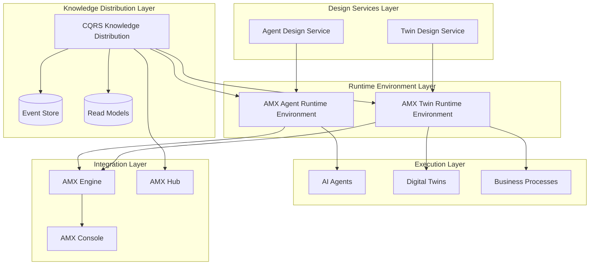
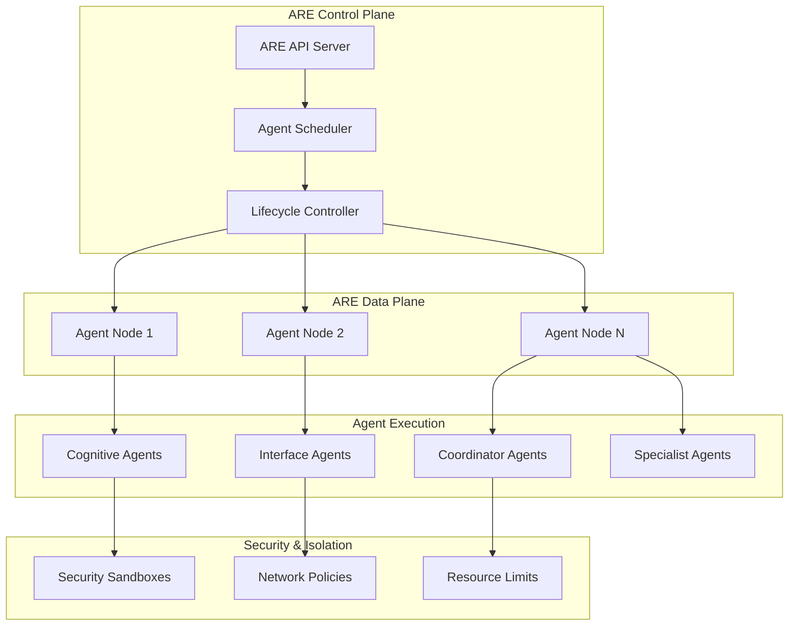
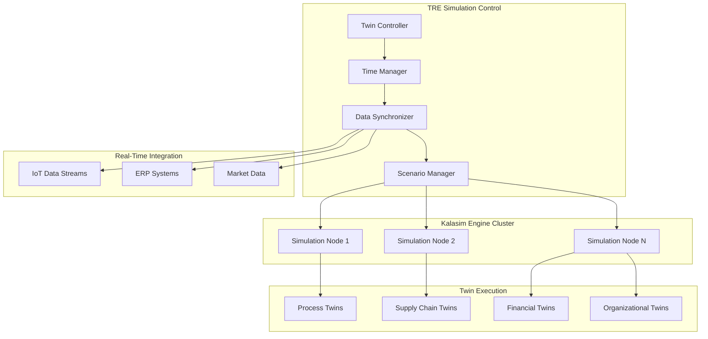
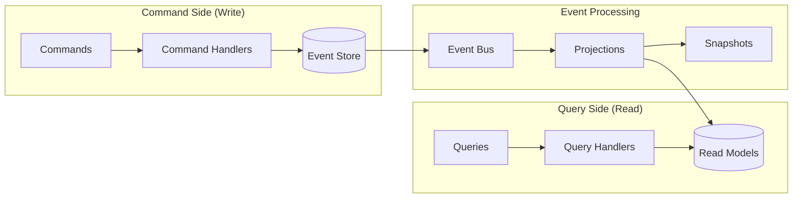
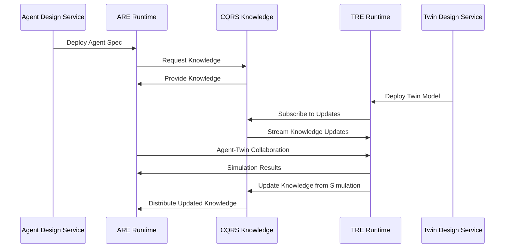
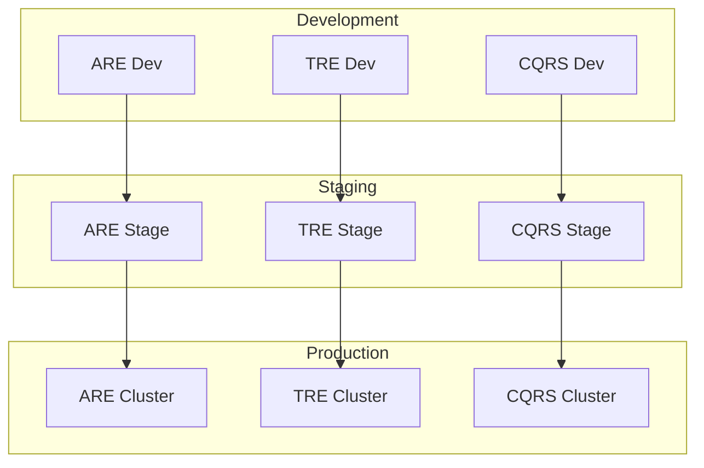
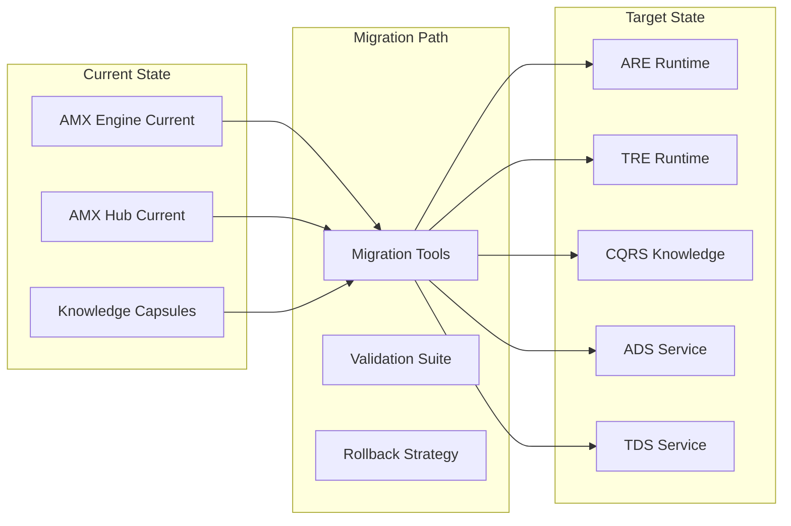

The AIMatrix ecosystem introduces four new cornerstone products that fundamentally expand the platform's capabilities for AI agent execution, digital twin simulation, and intelligent system design. This comprehensive overview details the architecture, integration patterns, and strategic implementation of these interconnected systems.

## Product Architecture Overview



## Product Matrix

### Runtime Environments

| Feature | AMX Agent Runtime Environment (ARE) | AMX Twin Runtime Environment (TRE) |
|---------|-------------------------------------|-------------------------------------|
| **Primary Purpose** | JVM-like runtime for AI agents | Unity Engine-like runtime for digital twins |
| **Container Technology** | Kubernetes + gVisor security | Event-driven microservices |
| **Execution Model** | Agent lifecycle management | Discrete event simulation |
| **Time Control** | Real-time execution | Variable speed, pause, rewind |
| **State Management** | CQRS + Event Sourcing | Time-based snapshots + projections |
| **Scaling Pattern** | Horizontal pod scaling | Distributed simulation clusters |
| **Communication** | gRPC + Message Queues | Event streams + time sync |
| **Resource Isolation** | Security sandboxes | Simulation boundaries |
| **Primary Workloads** | Cognitive, Interface, Coordinator agents | Process twins, Analytical twins |

### Design Services

| Feature | Agent Design Service (ADS) | Twin Design Service (TDS) |
|---------|----------------------------|---------------------------|
| **Primary Purpose** | Visual agent specification and testing | Digital twin modeling and validation |
| **Design Interface** | Drag-and-drop agent designer | Process modeling studio |
| **Code Generation** | Agent specifications → ARE deployment | Twin models → TRE simulation |
| **Testing Framework** | Automated agent testing harness | Simulation validation & calibration |
| **Knowledge Analysis** | Agent knowledge requirements | Twin data mapping requirements |
| **Behavioral Modeling** | State machines + skill composition | Process flows + business rules |
| **Integration Points** | ARE deployment pipeline | TRE execution environment |
| **Validation Approach** | Unit/integration/performance tests | Model/data/behavior validation |

## Technical Architecture Deep Dive

### AMX Agent Runtime Environment (ARE)

#### Multi-Language SDK Support

The Agent Runtime Environment supports five programming languages, each optimized for different use cases:

- **Kotlin**: Native performance, JVM ecosystem, coroutine-based concurrency
- **Python**: ML/AI optimization, data science libraries, async processing  
- **TypeScript**: Web integration, Node.js ecosystem, real-time communication
- **C#**: Enterprise integration, .NET ecosystem, Azure cloud services
- **Java**: Enterprise platform, Spring ecosystem, Apache integration, JVM performance

#### Container-Based Agent Execution



**Key Capabilities:**
- **Agent Lifecycle Management**: Deployment, scaling, updating, termination
- **Resource Isolation**: CPU, memory, network, storage limits per agent
- **Security Sandboxing**: gVisor containers with restricted capabilities
- **State Management**: CQRS event sourcing for agent state
- **Communication**: gRPC + message queues for inter-agent communication
- **Monitoring**: Prometheus metrics + custom agent telemetry

#### Agent Type Runtime Assignment

```kotlin
fun selectOptimalRuntime(agentSpec: AgentDeploymentSpec): RuntimeSelection {
    return when {
        // Cognitive agents always use ARE
        agentSpec.agentType in listOf("planner", "executor", "coworker", "specialist") -> 
            RuntimeSelection.ARE
        
        // Interface agents based on requirements
        agentSpec.agentType == "remote_desktop" && agentSpec.requiresDesktopAccess ->
            RuntimeSelection.ARE_WITH_DESKTOP
        
        agentSpec.agentType == "iot_edge" && agentSpec.deploymentLocation == "edge" ->
            RuntimeSelection.ARE_EDGE
        
        // Simulation-heavy agents prefer TRE
        agentSpec.requiresSimulation || agentSpec.processesTimeSeries ->
            RuntimeSelection.TRE
        
        // Default to ARE for most agents
        else -> RuntimeSelection.ARE
    }
}
```

#### C# Enterprise Agent Runtime Selection

```csharp
// C# implementation for enterprise agent deployment with enhanced decision logic
using AIMatrix.Runtime;
using Microsoft.Extensions.Logging;
using System;
using System.Collections.Generic;
using System.Threading.Tasks;

namespace AIMatrix.Enterprise.Runtime
{
    public enum RuntimeSelection
    {
        ARE,
        ARE_WITH_DESKTOP,
        ARE_EDGE,
        ARE_ENTERPRISE, // C#-specific enterprise runtime
        TRE,
        TRE_ENTERPRISE  // C#-specific enterprise twin runtime
    }

    public enum EnterpriseFeatures
    {
        None = 0,
        ActiveDirectoryAuth = 1,
        SqlServerIntegration = 2,
        AzureIntegration = 4,
        WindowsServices = 8,
        ComInterop = 16,
        EnterpriseCompliance = 32
    }

    public class EnterpriseRuntimeSelector
    {
        private readonly ILogger<EnterpriseRuntimeSelector> _logger;
        
        public EnterpriseRuntimeSelector(ILogger<EnterpriseRuntimeSelector> logger)
        {
            _logger = logger;
        }
        
        public async Task<RuntimeSelection> SelectOptimalRuntimeAsync(
            AgentDeploymentSpec agentSpec,
            EnterpriseRuntimeConfig enterpriseConfig)
        {
            _logger.LogInformation($"Selecting optimal runtime for agent type: {agentSpec.AgentType}");
            
            // Enterprise-specific runtime selection logic
            var runtimeSelection = agentSpec switch
            {
                // Enterprise cognitive agents with compliance requirements
                var spec when spec.AgentType is "planner" or "executor" or "coworker" or "specialist" 
                           && spec.RequiresCompliance => RuntimeSelection.ARE_ENTERPRISE,
                
                // Customer service agents with Active Directory integration
                var spec when spec.AgentType == "customer_service" 
                           && enterpriseConfig.EnableActiveDirectory => RuntimeSelection.ARE_ENTERPRISE,
                
                // Desktop automation agents on Windows
                var spec when spec.AgentType == "remote_desktop" 
                           && spec.RequiresDesktopAccess 
                           && Environment.OSVersion.Platform == PlatformID.Win32NT => RuntimeSelection.ARE_ENTERPRISE,
                
                // IoT edge agents with Windows IoT support
                var spec when spec.AgentType == "iot_edge" 
                           && spec.DeploymentLocation == "edge" 
                           && spec.RequiresWindowsServices => RuntimeSelection.ARE_ENTERPRISE,
                
                // Supply chain twins with ERP integration
                var spec when spec.AgentType == "supply_chain_twin" 
                           && enterpriseConfig.EnableERPIntegration => RuntimeSelection.TRE_ENTERPRISE,
                
                // Financial twins with SQL Server and compliance
                var spec when spec.AgentType == "financial_twin" 
                           && (enterpriseConfig.EnableSqlServer || spec.RequiresCompliance) => RuntimeSelection.TRE_ENTERPRISE,
                
                // Legacy system integration agents
                var spec when spec.RequiresComInterop 
                           || spec.RequiresLegacyIntegration => RuntimeSelection.ARE_ENTERPRISE,
                
                // Azure-native agents
                var spec when spec.RequiresAzureServices 
                           && enterpriseConfig.EnableAzureIntegration => spec.RequiresSimulation 
                               ? RuntimeSelection.TRE_ENTERPRISE 
                               : RuntimeSelection.ARE_ENTERPRISE,
                
                // High-security compliance agents
                var spec when spec.ComplianceStandards?.Contains("SOX") == true 
                           || spec.ComplianceStandards?.Contains("GDPR") == true => RuntimeSelection.ARE_ENTERPRISE,
                
                // Simulation-heavy agents (fallback to standard TRE for non-enterprise)
                var spec when spec.RequiresSimulation || spec.ProcessesTimeSeries => RuntimeSelection.TRE,
                
                // Default enterprise runtime for C# agents
                var spec when spec.Language == "csharp" => RuntimeSelection.ARE_ENTERPRISE,
                
                // Standard ARE for everything else
                _ => RuntimeSelection.ARE
            };
            
            // Validate runtime availability and requirements
            await ValidateRuntimeRequirementsAsync(runtimeSelection, agentSpec, enterpriseConfig);
            
            _logger.LogInformation($"Selected runtime: {runtimeSelection} for agent {agentSpec.AgentName}");
            return runtimeSelection;
        }
        
        private async Task ValidateRuntimeRequirementsAsync(
            RuntimeSelection selection,
            AgentDeploymentSpec agentSpec,
            EnterpriseRuntimeConfig config)
        {
            var validationTasks = new List<Task>();
            
            // Validate enterprise runtime requirements
            if (selection is RuntimeSelection.ARE_ENTERPRISE or RuntimeSelection.TRE_ENTERPRISE)
            {
                if (config.EnableActiveDirectory)
                {
                    validationTasks.Add(ValidateActiveDirectoryConnectivityAsync());
                }
                
                if (config.EnableSqlServer)
                {
                    validationTasks.Add(ValidateSqlServerConnectivityAsync(config.SqlServerConnectionString));
                }
                
                if (config.EnableAzureIntegration)
                {
                    validationTasks.Add(ValidateAzureConnectivityAsync(config.AzureSubscriptionId));
                }
            }
            
            // Wait for all validations
            await Task.WhenAll(validationTasks);
        }
        
        private async Task ValidateActiveDirectoryConnectivityAsync()
        {
            // Validate Active Directory connectivity
            _logger.LogDebug("Validating Active Directory connectivity...");
            await Task.Delay(100); // Simulate validation
        }
        
        private async Task ValidateSqlServerConnectivityAsync(string connectionString)
        {
            // Validate SQL Server connectivity
            _logger.LogDebug($"Validating SQL Server connectivity: {MaskConnectionString(connectionString)}");
            await Task.Delay(100); // Simulate validation
        }
        
        private async Task ValidateAzureConnectivityAsync(string subscriptionId)
        {
            // Validate Azure connectivity
            _logger.LogDebug($"Validating Azure connectivity for subscription: {subscriptionId}");
            await Task.Delay(100); // Simulate validation
        }
        
        private static string MaskConnectionString(string connectionString)
        {
            // Mask sensitive information in connection string for logging
            return string.IsNullOrEmpty(connectionString) ? "[Not provided]" : "[Configured]";
        }
    }
    
    public class AgentDeploymentSpec
    {
        public string AgentName { get; set; } = string.Empty;
        public string AgentType { get; set; } = string.Empty;
        public string Language { get; set; } = "csharp";
        public bool RequiresDesktopAccess { get; set; }
        public string DeploymentLocation { get; set; } = "cloud";
        public bool RequiresSimulation { get; set; }
        public bool ProcessesTimeSeries { get; set; }
        public bool RequiresCompliance { get; set; }
        public bool RequiresComInterop { get; set; }
        public bool RequiresLegacyIntegration { get; set; }
        public bool RequiresAzureServices { get; set; }
        public bool RequiresWindowsServices { get; set; }
        public List<string>? ComplianceStandards { get; set; }
    }
    
    public class EnterpriseRuntimeConfig
    {
        public bool EnableActiveDirectory { get; set; } = true;
        public bool EnableSqlServer { get; set; } = true;
        public bool EnableAzureIntegration { get; set; } = true;
        public bool EnableERPIntegration { get; set; } = false;
        public string SqlServerConnectionString { get; set; } = string.Empty;
        public string AzureSubscriptionId { get; set; } = string.Empty;
        public EnterpriseFeatures EnabledFeatures { get; set; } = EnterpriseFeatures.ActiveDirectoryAuth | EnterpriseFeatures.SqlServerIntegration | EnterpriseFeatures.AzureIntegration;
    }
}
```

#### Java Enterprise Agent Runtime Selection

```java
// Java implementation for enterprise agent deployment with Spring Boot and Apache ecosystem
package com.aimatrix.runtime.selection;

import com.aimatrix.runtime.core.*;
import com.aimatrix.enterprise.*;
import org.springframework.stereotype.Service;
import org.springframework.boot.autoconfigure.condition.ConditionalOnProperty;
import org.springframework.context.annotation.Configuration;
import org.springframework.validation.annotation.Validated;

import javax.validation.Valid;
import javax.validation.constraints.*;
import java.time.Duration;
import java.util.List;
import java.util.concurrent.CompletableFuture;
import java.util.stream.Stream;
import java.util.Arrays;
import java.util.Map;

/**
 * Enterprise runtime selector for Java agents with Spring Boot and Apache ecosystem support
 * Supports: Spring Boot, Apache Kafka, Apache Spark, Apache Camel, JPA/Hibernate
 */
@Service
@Validated
@ConditionalOnProperty(name = "aimatrix.runtime.java.enabled", havingValue = "true")
public class JavaEnterpriseRuntimeSelector {
    
    private static final Logger log = LoggerFactory.getLogger(JavaEnterpriseRuntimeSelector.class);
    
    public enum RuntimeSelection {
        ARE,              // Standard Agent Runtime Environment
        ARE_EDGE,         // Lightweight edge runtime
        ARE_ENTERPRISE,   // Java-specific enterprise runtime with Spring Boot
        TRE,              // Standard Twin Runtime Environment
        TRE_ENTERPRISE    // Java-specific enterprise twin runtime with Apache ecosystem
    }
    
    public enum JavaEnterpriseFeatures {
        NONE(0),
        SPRING_BOOT_INTEGRATION(1),
        APACHE_KAFKA_STREAMING(2),
        APACHE_SPARK_ANALYTICS(4),
        APACHE_CAMEL_INTEGRATION(8),
        JPA_HIBERNATE_PERSISTENCE(16),
        JMX_MONITORING(32),
        GRAALVM_NATIVE_IMAGE(64),
        MICROSERVICES_ARCHITECTURE(128),
        ENTERPRISE_COMPLIANCE(256);
        
        private final int value;
        
        JavaEnterpriseFeatures(int value) {
            this.value = value;
        }
        
        public int getValue() { return value; }
    }
    
    /**
     * Select optimal runtime for Java agent deployment with comprehensive enterprise features
     */
    public CompletableFuture<RuntimeSelection> selectOptimalRuntimeAsync(
            @Valid AgentDeploymentSpec agentSpec,
            @Valid JavaEnterpriseRuntimeConfig enterpriseConfig) {
        
        log.info("Selecting optimal runtime for Java agent type: {}", agentSpec.getAgentType());
        
        return CompletableFuture.supplyAsync(() -> {
            var runtimeSelection = determineRuntimeSelection(agentSpec, enterpriseConfig);
            
            // Validate runtime requirements asynchronously
            validateRuntimeRequirements(runtimeSelection, agentSpec, enterpriseConfig)
                .exceptionally(ex -> {
                    log.error("Runtime validation failed for agent {}: {}", agentSpec.getAgentName(), ex.getMessage());
                    return null;
                });
            
            log.info("Selected runtime: {} for Java agent {}", runtimeSelection, agentSpec.getAgentName());
            return runtimeSelection;
        });
    }
    
    private RuntimeSelection determineRuntimeSelection(AgentDeploymentSpec agentSpec, JavaEnterpriseRuntimeConfig config) {
        // Use Java 17+ pattern matching and switch expressions
        return switch (agentSpec.getAgentType()) {
            // Enterprise cognitive agents with Spring Boot microservices
            case "planner", "executor", "coworker", "specialist" when 
                agentSpec.isRequiresCompliance() || config.isEnableSpringBootIntegration() -> 
                RuntimeSelection.ARE_ENTERPRISE;
            
            // Customer service agents with Apache Kafka streaming
            case "customer_service" when 
                config.isEnableKafkaStreaming() && config.isEnableSpringBootIntegration() -> 
                RuntimeSelection.ARE_ENTERPRISE;
            
            // Analytics agents with Apache Spark integration
            case "analytics_agent", "ml_inference_agent" when 
                config.isEnableSparkAnalytics() -> RuntimeSelection.ARE_ENTERPRISE;
            
            // Integration agents with Apache Camel enterprise integration patterns
            case "integration_agent", "data_pipeline_agent" when 
                config.isEnableCamelIntegration() -> RuntimeSelection.ARE_ENTERPRISE;
            
            // IoT edge agents with lightweight Java deployment
            case "iot_edge", "sensor_agent" when 
                "edge".equals(agentSpec.getDeploymentLocation()) && config.isEnableGraalVMNativeImage() -> 
                RuntimeSelection.ARE_EDGE;
            
            // Supply chain twins with JPA/Hibernate and ERP integration
            case "supply_chain_twin", "logistics_twin" when 
                config.isEnableJPAIntegration() && config.isEnableERPIntegration() -> 
                RuntimeSelection.TRE_ENTERPRISE;
            
            // Financial twins with enterprise compliance and JPA persistence
            case "financial_twin", "risk_analysis_twin" when 
                agentSpec.isRequiresCompliance() || config.isEnableJPAIntegration() -> 
                RuntimeSelection.TRE_ENTERPRISE;
            
            // Manufacturing twins with Apache Kafka real-time data streaming
            case "manufacturing_twin", "production_twin" when 
                config.isEnableKafkaStreaming() && agentSpec.isRequiresRealTimeData() -> 
                RuntimeSelection.TRE_ENTERPRISE;
            
            // Microservices-based agents with Spring Boot
            case String agentType when 
                agentSpec.getArchitectureStyle() != null && 
                agentSpec.getArchitectureStyle().contains("microservices") -> 
                RuntimeSelection.ARE_ENTERPRISE;
            
            // High-performance agents requiring GraalVM native compilation
            case String agentType when 
                config.isEnableGraalVMNativeImage() && agentSpec.getPerformanceRequirements() != null &&
                agentSpec.getPerformanceRequirements().getStartupTimeRequirement().compareTo(Duration.ofMillis(100)) < 0 -> 
                RuntimeSelection.ARE_ENTERPRISE;
            
            // Compliance-required agents (SOX, GDPR, HIPAA)
            case String agentType when 
                agentSpec.getComplianceStandards() != null && 
                agentSpec.getComplianceStandards().stream().anyMatch(standard -> 
                    Arrays.asList("SOX", "GDPR", "HIPAA", "PCI-DSS").contains(standard)) -> 
                RuntimeSelection.ARE_ENTERPRISE;
            
            // Simulation-heavy agents (fallback to standard TRE for non-enterprise)
            case String agentType when 
                agentSpec.isRequiresSimulation() || agentSpec.isProcessesTimeSeries() -> 
                RuntimeSelection.TRE;
            
            // Default enterprise runtime for Java agents with enterprise features enabled
            case String agentType when 
                "java".equals(agentSpec.getLanguage()) && hasEnterpriseFeatures(config) -> 
                RuntimeSelection.ARE_ENTERPRISE;
            
            // Standard ARE for simple Java agents
            default -> RuntimeSelection.ARE;
        };
    }
    
    private boolean hasEnterpriseFeatures(JavaEnterpriseRuntimeConfig config) {
        return config.isEnableSpringBootIntegration() || 
               config.isEnableKafkaStreaming() || 
               config.isEnableSparkAnalytics() || 
               config.isEnableCamelIntegration() || 
               config.isEnableJPAIntegration();
    }
    
    /**
     * Validate runtime requirements using CompletableFuture for async validation
     */
    private CompletableFuture<Void> validateRuntimeRequirements(
            RuntimeSelection selection,
            AgentDeploymentSpec agentSpec,
            JavaEnterpriseRuntimeConfig config) {
        
        var validationTasks = Stream.<CompletableFuture<Void>>builder();
        
        // Validate enterprise runtime requirements
        if (selection == RuntimeSelection.ARE_ENTERPRISE || selection == RuntimeSelection.TRE_ENTERPRISE) {
            
            if (config.isEnableSpringBootIntegration()) {
                validationTasks.add(validateSpringBootEnvironmentAsync());
            }
            
            if (config.isEnableKafkaStreaming()) {
                validationTasks.add(validateKafkaConnectivityAsync(config.getKafkaBrokerUrls()));
            }
            
            if (config.isEnableSparkAnalytics()) {
                validationTasks.add(validateSparkClusterConnectivityAsync(config.getSparkMasterUrl()));
            }
            
            if (config.isEnableJPAIntegration()) {
                validationTasks.add(validateDatabaseConnectivityAsync(config.getDatabaseConnectionString()));
            }
            
            if (config.isEnableCamelIntegration()) {
                validationTasks.add(validateCamelIntegrationPointsAsync(config.getCamelEndpoints()));
            }
            
            if (config.isEnableJMXMonitoring()) {
                validationTasks.add(validateJMXConnectivityAsync(config.getJmxPort()));
            }
        }
        
        // Return combined validation future
        var allValidations = validationTasks.build().toArray(CompletableFuture[]::new);
        return CompletableFuture.allOf(allValidations);
    }
    
    private CompletableFuture<Void> validateSpringBootEnvironmentAsync() {
        return CompletableFuture.runAsync(() -> {
            log.debug("Validating Spring Boot environment...");
            // Validate Spring Boot classpath and configuration
            try {
                Class.forName("org.springframework.boot.SpringApplication");
                log.debug("Spring Boot environment validation passed");
            } catch (ClassNotFoundException e) {
                throw new RuntimeException("Spring Boot not found in classpath", e);
            }
        });
    }
    
    private CompletableFuture<Void> validateKafkaConnectivityAsync(List<String> brokerUrls) {
        return CompletableFuture.runAsync(() -> {
            log.debug("Validating Apache Kafka connectivity to brokers: {}", brokerUrls);
            // Simulate Kafka connectivity validation
            // In real implementation, this would test actual Kafka connection
        });
    }
    
    private CompletableFuture<Void> validateSparkClusterConnectivityAsync(String sparkMasterUrl) {
        return CompletableFuture.runAsync(() -> {
            log.debug("Validating Apache Spark cluster connectivity: {}", sparkMasterUrl);
            // Simulate Spark cluster connectivity validation
            // In real implementation, this would test actual Spark connection
        });
    }
    
    private CompletableFuture<Void> validateDatabaseConnectivityAsync(String connectionString) {
        return CompletableFuture.runAsync(() -> {
            log.debug("Validating database connectivity: {}", maskConnectionString(connectionString));
            // Simulate database connectivity validation using JPA/Hibernate
            // In real implementation, this would test actual database connection
        });
    }
    
    private CompletableFuture<Void> validateCamelIntegrationPointsAsync(List<String> endpoints) {
        return CompletableFuture.runAsync(() -> {
            log.debug("Validating Apache Camel integration endpoints: {}", endpoints);
            // Simulate Camel endpoint validation
            // In real implementation, this would test actual Camel routes
        });
    }
    
    private CompletableFuture<Void> validateJMXConnectivityAsync(int jmxPort) {
        return CompletableFuture.runAsync(() -> {
            log.debug("Validating JMX monitoring connectivity on port: {}", jmxPort);
            // Simulate JMX connectivity validation
            // In real implementation, this would test actual JMX connection
        });
    }
    
    private static String maskConnectionString(String connectionString) {
        return connectionString != null && !connectionString.isEmpty() ? "[Configured]" : "[Not provided]";
    }
}

// Java-specific configuration classes
@Configuration
@ConfigurationProperties(prefix = "aimatrix.runtime.java.enterprise")
@Validated
public class JavaEnterpriseRuntimeConfig {
    
    @NotNull
    private boolean enableSpringBootIntegration = true;
    
    private boolean enableKafkaStreaming = false;
    private boolean enableSparkAnalytics = false;
    private boolean enableCamelIntegration = false;
    private boolean enableJPAIntegration = false;
    private boolean enableJMXMonitoring = true;
    private boolean enableGraalVMNativeImage = false;
    private boolean enableERPIntegration = false;
    
    @Size(min = 1, message = "At least one Kafka broker URL must be provided when Kafka is enabled")
    private List<String> kafkaBrokerUrls = List.of("localhost:9092");
    
    @Pattern(regexp = "^spark://.*", message = "Spark master URL must start with 'spark://'")
    private String sparkMasterUrl = "spark://localhost:7077";
    
    private String databaseConnectionString = "jdbc:postgresql://localhost:5432/aimatrix";
    
    private List<String> camelEndpoints = List.of("kafka:agent-events", "file:./data/input");
    
    @Min(value = 1024, message = "JMX port must be >= 1024")
    @Max(value = 65535, message = "JMX port must be <= 65535")
    private int jmxPort = 9999;
    
    private JavaEnterpriseFeatures enabledFeatures = JavaEnterpriseFeatures.SPRING_BOOT_INTEGRATION;
    
    // Getters and setters
    public boolean isEnableSpringBootIntegration() { return enableSpringBootIntegration; }
    public void setEnableSpringBootIntegration(boolean enableSpringBootIntegration) { this.enableSpringBootIntegration = enableSpringBootIntegration; }
    
    public boolean isEnableKafkaStreaming() { return enableKafkaStreaming; }
    public void setEnableKafkaStreaming(boolean enableKafkaStreaming) { this.enableKafkaStreaming = enableKafkaStreaming; }
    
    public boolean isEnableSparkAnalytics() { return enableSparkAnalytics; }
    public void setEnableSparkAnalytics(boolean enableSparkAnalytics) { this.enableSparkAnalytics = enableSparkAnalytics; }
    
    public boolean isEnableCamelIntegration() { return enableCamelIntegration; }
    public void setEnableCamelIntegration(boolean enableCamelIntegration) { this.enableCamelIntegration = enableCamelIntegration; }
    
    public boolean isEnableJPAIntegration() { return enableJPAIntegration; }
    public void setEnableJPAIntegration(boolean enableJPAIntegration) { this.enableJPAIntegration = enableJPAIntegration; }
    
    public boolean isEnableJMXMonitoring() { return enableJMXMonitoring; }
    public void setEnableJMXMonitoring(boolean enableJMXMonitoring) { this.enableJMXMonitoring = enableJMXMonitoring; }
    
    public boolean isEnableGraalVMNativeImage() { return enableGraalVMNativeImage; }
    public void setEnableGraalVMNativeImage(boolean enableGraalVMNativeImage) { this.enableGraalVMNativeImage = enableGraalVMNativeImage; }
    
    public boolean isEnableERPIntegration() { return enableERPIntegration; }
    public void setEnableERPIntegration(boolean enableERPIntegration) { this.enableERPIntegration = enableERPIntegration; }
    
    public List<String> getKafkaBrokerUrls() { return kafkaBrokerUrls; }
    public void setKafkaBrokerUrls(List<String> kafkaBrokerUrls) { this.kafkaBrokerUrls = kafkaBrokerUrls; }
    
    public String getSparkMasterUrl() { return sparkMasterUrl; }
    public void setSparkMasterUrl(String sparkMasterUrl) { this.sparkMasterUrl = sparkMasterUrl; }
    
    public String getDatabaseConnectionString() { return databaseConnectionString; }
    public void setDatabaseConnectionString(String databaseConnectionString) { this.databaseConnectionString = databaseConnectionString; }
    
    public List<String> getCamelEndpoints() { return camelEndpoints; }
    public void setCamelEndpoints(List<String> camelEndpoints) { this.camelEndpoints = camelEndpoints; }
    
    public int getJmxPort() { return jmxPort; }
    public void setJmxPort(int jmxPort) { this.jmxPort = jmxPort; }
    
    public JavaEnterpriseFeatures getEnabledFeatures() { return enabledFeatures; }
    public void setEnabledFeatures(JavaEnterpriseFeatures enabledFeatures) { this.enabledFeatures = enabledFeatures; }
}

// Enhanced AgentDeploymentSpec with Java-specific properties
public class AgentDeploymentSpec {
    @NotBlank(message = "Agent name is required")
    private String agentName;
    
    @NotBlank(message = "Agent type is required")
    private String agentType;
    
    @Pattern(regexp = "kotlin|python|typescript|csharp|java", message = "Language must be one of: kotlin, python, typescript, csharp, java")
    private String language = "java";
    
    private String deploymentLocation = "cloud";
    private String architectureStyle;
    private boolean requiresDesktopAccess;
    private boolean requiresSimulation;
    private boolean processesTimeSeries;
    private boolean requiresCompliance;
    private boolean requiresRealTimeData;
    private List<String> complianceStandards;
    private PerformanceRequirements performanceRequirements;
    
    // Getters and setters
    public String getAgentName() { return agentName; }
    public void setAgentName(String agentName) { this.agentName = agentName; }
    
    public String getAgentType() { return agentType; }
    public void setAgentType(String agentType) { this.agentType = agentType; }
    
    public String getLanguage() { return language; }
    public void setLanguage(String language) { this.language = language; }
    
    public String getDeploymentLocation() { return deploymentLocation; }
    public void setDeploymentLocation(String deploymentLocation) { this.deploymentLocation = deploymentLocation; }
    
    public String getArchitectureStyle() { return architectureStyle; }
    public void setArchitectureStyle(String architectureStyle) { this.architectureStyle = architectureStyle; }
    
    public boolean isRequiresDesktopAccess() { return requiresDesktopAccess; }
    public void setRequiresDesktopAccess(boolean requiresDesktopAccess) { this.requiresDesktopAccess = requiresDesktopAccess; }
    
    public boolean isRequiresSimulation() { return requiresSimulation; }
    public void setRequiresSimulation(boolean requiresSimulation) { this.requiresSimulation = requiresSimulation; }
    
    public boolean isProcessesTimeSeries() { return processesTimeSeries; }
    public void setProcessesTimeSeries(boolean processesTimeSeries) { this.processesTimeSeries = processesTimeSeries; }
    
    public boolean isRequiresCompliance() { return requiresCompliance; }
    public void setRequiresCompliance(boolean requiresCompliance) { this.requiresCompliance = requiresCompliance; }
    
    public boolean isRequiresRealTimeData() { return requiresRealTimeData; }
    public void setRequiresRealTimeData(boolean requiresRealTimeData) { this.requiresRealTimeData = requiresRealTimeData; }
    
    public List<String> getComplianceStandards() { return complianceStandards; }
    public void setComplianceStandards(List<String> complianceStandards) { this.complianceStandards = complianceStandards; }
    
    public PerformanceRequirements getPerformanceRequirements() { return performanceRequirements; }
    public void setPerformanceRequirements(PerformanceRequirements performanceRequirements) { this.performanceRequirements = performanceRequirements; }
}

// Performance requirements for Java agents
public class PerformanceRequirements {
    private Duration startupTimeRequirement = Duration.ofSeconds(5);
    private long maxMemoryUsage = 1024 * 1024 * 1024; // 1GB default
    private int maxCpuCores = 4;
    private Duration responseTimeRequirement = Duration.ofMillis(100);
    
    public Duration getStartupTimeRequirement() { return startupTimeRequirement; }
    public void setStartupTimeRequirement(Duration startupTimeRequirement) { this.startupTimeRequirement = startupTimeRequirement; }
    
    public long getMaxMemoryUsage() { return maxMemoryUsage; }
    public void setMaxMemoryUsage(long maxMemoryUsage) { this.maxMemoryUsage = maxMemoryUsage; }
    
    public int getMaxCpuCores() { return maxCpuCores; }
    public void setMaxCpuCores(int maxCpuCores) { this.maxCpuCores = maxCpuCores; }
    
    public Duration getResponseTimeRequirement() { return responseTimeRequirement; }
    public void setResponseTimeRequirement(Duration responseTimeRequirement) { this.responseTimeRequirement = responseTimeRequirement; }
}
```

### AMX Twin Runtime Environment (TRE)

#### Discrete Event Simulation Engine



**Key Capabilities:**
- **Time Control**: Variable speed (0.1x - 1000x), pause, rewind functionality
- **Scenario Branching**: Parallel "what-if" scenarios with branch/merge
- **Real-Time Sync**: < 50ms latency data synchronization
- **Model Execution**: Kalasim-powered discrete event simulation
- **Distributed Scaling**: Handle 1000+ concurrent twins per cluster

#### Twin Type Runtime Assignment

```kotlin
fun selectTwinRuntime(twinSpec: DigitalTwinSpec): RuntimeSelection {
    return when {
        // Time-critical simulations always use TRE
        twinSpec.requiresTimeControl || twinSpec.hasScenarioBranching -> 
            RuntimeSelection.TRE
        
        // Process-heavy twins prefer TRE
        twinSpec.processComplexity > 0.7 || twinSpec.hasWorkflows ->
            RuntimeSelection.TRE
        
        // Real-time data sync requirements
        twinSpec.realTimeDataSources.isNotEmpty() && twinSpec.syncFrequency < Duration.ofMinutes(1) ->
            RuntimeSelection.TRE
        
        // Heavy simulation workloads
        twinSpec.expectedEvents > 100000 || twinSpec.simulationDuration > Duration.ofHours(24) ->
            RuntimeSelection.TRE_CLUSTER
        
        // Interactive/agent-driven twins may use ARE
        twinSpec.requiresAgentInteraction && !twinSpec.requiresTimeControl ->
            RuntimeSelection.ARE
        
        // Default to TRE for most digital twins
        else -> RuntimeSelection.TRE
    }
}
```

#### C# Enterprise Twin Runtime Selection

```csharp
// Enterprise digital twin runtime selection with C# enterprise features
namespace AIMatrix.Enterprise.Runtime
{
    public class EnterpriseTwinRuntimeSelector
    {
        private readonly ILogger<EnterpriseTwinRuntimeSelector> _logger;
        private readonly IERPConnectivityService _erpService;
        private readonly IAzureResourceValidator _azureValidator;
        
        public EnterpriseTwinRuntimeSelector(
            ILogger<EnterpriseTwinRuntimeSelector> logger,
            IERPConnectivityService erpService,
            IAzureResourceValidator azureValidator)
        {
            _logger = logger;
            _erpService = erpService;
            _azureValidator = azureValidator;
        }
        
        public async Task<RuntimeSelection> SelectTwinRuntimeAsync(
            DigitalTwinSpec twinSpec,
            EnterpriseRuntimeConfig enterpriseConfig)
        {
            _logger.LogInformation($"Selecting optimal runtime for twin: {twinSpec.TwinName}");
            
            var runtimeSelection = twinSpec switch
            {
                // Supply chain twins with ERP integration
                var spec when spec.TwinType == "supply_chain" 
                           && enterpriseConfig.EnableERPIntegration => RuntimeSelection.TRE_ENTERPRISE,
                
                // Financial twins requiring SOX compliance and SQL Server
                var spec when spec.TwinType == "financial" 
                           && (spec.ComplianceStandards?.Contains("SOX") == true 
                               || enterpriseConfig.EnableSqlServer) => RuntimeSelection.TRE_ENTERPRISE,
                
                // Manufacturing twins with real-time MES integration
                var spec when spec.TwinType == "manufacturing" 
                           && spec.RequiresRealTimeData 
                           && enterpriseConfig.EnableERPIntegration => RuntimeSelection.TRE_ENTERPRISE,
                
                // Customer journey twins with Azure Analytics
                var spec when spec.TwinType == "customer_journey" 
                           && enterpriseConfig.EnableAzureIntegration => RuntimeSelection.TRE_ENTERPRISE,
                
                // Process twins requiring Windows Services integration
                var spec when spec.RequiresWindowsServices 
                           || spec.RequiresComInterop => RuntimeSelection.TRE_ENTERPRISE,
                
                // Time-critical simulations with enterprise monitoring
                var spec when (spec.RequiresTimeControl || spec.HasScenarioBranching) 
                           && spec.RequiresCompliance => RuntimeSelection.TRE_ENTERPRISE,
                
                // Standard time-critical simulations
                var spec when spec.RequiresTimeControl || spec.HasScenarioBranching => RuntimeSelection.TRE,
                
                // Process-heavy twins with enterprise features
                var spec when (spec.ProcessComplexity > 0.7 || spec.HasWorkflows) 
                           && (enterpriseConfig.EnableSqlServer || spec.RequiresCompliance) => RuntimeSelection.TRE_ENTERPRISE,
                
                // Standard process-heavy twins
                var spec when spec.ProcessComplexity > 0.7 || spec.HasWorkflows => RuntimeSelection.TRE,
                
                // Enterprise real-time data sync requirements
                var spec when spec.RealTimeDataSources.Count > 0 
                           && spec.SyncFrequency < TimeSpan.FromMinutes(1) 
                           && enterpriseConfig.EnableERPIntegration => RuntimeSelection.TRE_ENTERPRISE,
                
                // Standard real-time data sync
                var spec when spec.RealTimeDataSources.Count > 0 
                           && spec.SyncFrequency < TimeSpan.FromMinutes(1) => RuntimeSelection.TRE,
                
                // Heavy simulation workloads with enterprise scalability
                var spec when (spec.ExpectedEvents > 100000 || spec.SimulationDuration > TimeSpan.FromHours(24)) 
                           && enterpriseConfig.EnableAzureIntegration => RuntimeSelection.TRE_ENTERPRISE,
                
                // Standard heavy simulation workloads
                var spec when spec.ExpectedEvents > 100000 
                           || spec.SimulationDuration > TimeSpan.FromHours(24) => RuntimeSelection.TRE_CLUSTER,
                
                // Interactive/agent-driven twins with enterprise features
                var spec when spec.RequiresAgentInteraction 
                           && !spec.RequiresTimeControl 
                           && enterpriseConfig.EnableActiveDirectory => RuntimeSelection.ARE_ENTERPRISE,
                
                // Standard interactive/agent-driven twins
                var spec when spec.RequiresAgentInteraction && !spec.RequiresTimeControl => RuntimeSelection.ARE,
                
                // C# twins default to enterprise runtime
                var spec when spec.Language == "csharp" => RuntimeSelection.TRE_ENTERPRISE,
                
                // Default to TRE for all other digital twins
                _ => RuntimeSelection.TRE
            };
            
            // Validate enterprise runtime requirements
            await ValidateEnterpriseRuntimeRequirementsAsync(runtimeSelection, twinSpec, enterpriseConfig);
            
            _logger.LogInformation($"Selected runtime: {runtimeSelection} for twin {twinSpec.TwinName}");
            return runtimeSelection;
        }
        
        private async Task ValidateEnterpriseRuntimeRequirementsAsync(
            RuntimeSelection selection,
            DigitalTwinSpec twinSpec,
            EnterpriseRuntimeConfig config)
        {
            if (selection != RuntimeSelection.TRE_ENTERPRISE)
                return;
                
            var validationTasks = new List<Task>();
            
            // Validate ERP connectivity if required
            if (config.EnableERPIntegration && twinSpec.RequiresERPData)
            {
                validationTasks.Add(ValidateERPConnectivityAsync(twinSpec));
            }
            
            // Validate Azure resources if required
            if (config.EnableAzureIntegration && twinSpec.RequiresAzureServices)
            {
                validationTasks.Add(ValidateAzureResourcesAsync(twinSpec, config));
            }
            
            // Validate SQL Server for data persistence
            if (config.EnableSqlServer && twinSpec.RequiresDataPersistence)
            {
                validationTasks.Add(ValidateSqlServerForTwinAsync(twinSpec, config));
            }
            
            await Task.WhenAll(validationTasks);
        }
        
        private async Task ValidateERPConnectivityAsync(DigitalTwinSpec twinSpec)
        {
            _logger.LogDebug($"Validating ERP connectivity for twin {twinSpec.TwinName}...");
            
            var erpSystems = twinSpec.RequiredERPSystems ?? new List<string>();
            foreach (var erpSystem in erpSystems)
            {
                var isHealthy = await _erpService.CheckSystemHealthAsync(erpSystem);
                if (!isHealthy)
                {
                    throw new InvalidOperationException($"ERP system {erpSystem} is not available for twin {twinSpec.TwinName}");
                }
            }
        }
        
        private async Task ValidateAzureResourcesAsync(DigitalTwinSpec twinSpec, EnterpriseRuntimeConfig config)
        {
            _logger.LogDebug($"Validating Azure resources for twin {twinSpec.TwinName}...");
            
            var requiredServices = twinSpec.RequiredAzureServices ?? new List<string>();
            foreach (var service in requiredServices)
            {
                var isAvailable = await _azureValidator.ValidateServiceAvailabilityAsync(
                    service, config.AzureSubscriptionId);
                if (!isAvailable)
                {
                    throw new InvalidOperationException($"Azure service {service} is not available for twin {twinSpec.TwinName}");
                }
            }
        }
        
        private async Task ValidateSqlServerForTwinAsync(DigitalTwinSpec twinSpec, EnterpriseRuntimeConfig config)
        {
            _logger.LogDebug($"Validating SQL Server for twin {twinSpec.TwinName}...");
            
            // Validate database schema and permissions for twin data
            var estimatedDataSize = EstimateTwinDataSize(twinSpec);
            if (estimatedDataSize > 100_000) // Large twins need special handling
            {
                await ValidateLargeTwinDatabaseCapacityAsync(config.SqlServerConnectionString, estimatedDataSize);
            }
        }
        
        private static long EstimateTwinDataSize(DigitalTwinSpec twinSpec)
        {
            // Estimate data size based on twin complexity
            return (long)(twinSpec.ProcessComplexity * twinSpec.ExpectedEvents * 1000);
        }
        
        private async Task ValidateLargeTwinDatabaseCapacityAsync(string connectionString, long estimatedSize)
        {
            _logger.LogDebug($"Validating database capacity for estimated size: {estimatedSize} records");
            await Task.Delay(100); // Simulate validation
        }
    }
    
    public class DigitalTwinSpec
    {
        public string TwinName { get; set; } = string.Empty;
        public string TwinType { get; set; } = string.Empty;
        public string Language { get; set; } = "csharp";
        public bool RequiresTimeControl { get; set; }
        public bool HasScenarioBranching { get; set; }
        public double ProcessComplexity { get; set; }
        public bool HasWorkflows { get; set; }
        public List<string> RealTimeDataSources { get; set; } = new();
        public TimeSpan SyncFrequency { get; set; } = TimeSpan.FromMinutes(5);
        public long ExpectedEvents { get; set; }
        public TimeSpan SimulationDuration { get; set; } = TimeSpan.FromHours(1);
        public bool RequiresAgentInteraction { get; set; }
        public bool RequiresCompliance { get; set; }
        public bool RequiresWindowsServices { get; set; }
        public bool RequiresComInterop { get; set; }
        public bool RequiresERPData { get; set; }
        public bool RequiresAzureServices { get; set; }
        public bool RequiresDataPersistence { get; set; }
        public List<string>? ComplianceStandards { get; set; }
        public List<string>? RequiredERPSystems { get; set; }
        public List<string>? RequiredAzureServices { get; set; }
    }
}
```

### CQRS Knowledge Distribution Architecture

#### Command-Query Separation



**Knowledge Distribution Features:**
- **Command Processing**: Create, update, distribute knowledge operations
- **Query Optimization**: Specialized read models for different access patterns
- **Event Sourcing**: Complete audit trail of all knowledge changes
- **Distribution Policies**: Role-based, geography-based, load-based distribution
- **Offline/Online Sync**: Intelligent synchronization strategies
- **Conflict Resolution**: Automatic and manual conflict resolution

## Integration Patterns

### Inter-Product Communication Flow



### Knowledge Flow Patterns

#### Command Side Operations

```kotlin
// Knowledge creation and updates
sealed class KnowledgeCommands : KnowledgeCommand {
    data class CreateKnowledgeCapsule(
        val capsuleData: KnowledgeCapsuleData,
        val metadata: CapsuleMetadata
    ) : KnowledgeCommands()
    
    data class DistributeKnowledge(
        val targetNodes: List<String>,
        val distributionPolicy: DistributionPolicy
    ) : KnowledgeCommands()
    
    data class SynchronizeKnowledge(
        val sourceNode: String,
        val syncStrategy: SyncStrategy
    ) : KnowledgeCommands()
}
```

#### Query Side Operations

```kotlin
// Knowledge retrieval and search
sealed class KnowledgeQueries : KnowledgeQuery {
    data class SearchKnowledge(
        val searchQuery: String,
        val categories: List<String> = emptyList(),
        val maxResults: Int = 10
    ) : KnowledgeQueries()
    
    data class GetAvailableKnowledge(
        val nodeId: String,
        val knowledgeTypes: List<String> = emptyList()
    ) : KnowledgeQueries()
    
    data class GetKnowledgeUpdates(
        val nodeId: String,
        val since: Instant
    ) : KnowledgeQueries()
}
```

## Design Service Capabilities

### Agent Design Service (ADS)

#### Visual Agent Designer
- **Component Palette**: Behavior blocks, skill modules, event triggers, action handlers
- **Design Canvas**: Drag-and-drop interface for agent composition
- **Code Generation**: Agent specifications → Kotlin/Java implementation
- **Testing Harness**: Automated unit, integration, and performance tests

#### Agent Specification Format
```yaml
apiVersion: aimatrix.com/v1
kind: AgentSpecification
metadata:
  name: customer-service-agent
  version: "1.0.0"
spec:
  agentType: cognitive
  behavior:
    capabilities:
      - intent_recognition
      - knowledge_retrieval
      - escalation_management
  knowledge:
    sources:
      - type: vector_database
        name: product_knowledge
        priority: high
  performance:
    responseTime: "< 3s"
    availability: "99.9%"
```

### Twin Design Service (TDS)

#### Visual Process Modeling
- **Business Process Components**: Activities, gateways, events, resources, data stores
- **Simulation Components**: Entity types, process flows, business rules, KPI definitions
- **Model Generation**: BPMN models → Kalasim simulation code
- **Validation Framework**: Model structure, data consistency, behavior validation

#### Twin Model Format
```yaml
apiVersion: aimatrix.com/v1
kind: TwinModel
metadata:
  name: supply-chain-twin
  type: supply_chain
spec:
  entities:
    - name: supplier
      capacity: 10000
      leadTime: "triangular(5, 10, 21)"
      reliability: 0.95
  processes:
    - name: procurement
      steps: [request, approve, order, receive]
      resources: [procurement_staff, approval_workflow]
  dataSources:
    - type: erp_system
      syncFrequency: real_time
```

## Performance Characteristics

### Runtime Environment Performance

| Metric | ARE Specification | TRE Specification |
|--------|-------------------|-------------------|
| **Agent/Twin Capacity** | 50,000+ agents per cluster | 1,000+ twins per cluster |
| **Startup Time** | < 500ms agent startup | < 2s twin initialization |
| **Memory Overhead** | < 50MB per agent | < 1GB per 10K entities |
| **Processing Speed** | 10ms inter-agent latency | 1M+ events/sec simulation |
| **Scaling Time** | 0-1000 agents in 30s | Distributed scaling |
| **High Availability** | 99.9% SLA | 99.9% SLA |

### Knowledge Distribution Performance

| Operation | Latency | Throughput |
|-----------|---------|------------|
| **Command Processing** | < 100ms | 10,000 ops/sec |
| **Query Processing** | < 50ms | 50,000 queries/sec |
| **Knowledge Distribution** | < 500ms | 1,000 nodes/operation |
| **Real-time Sync** | < 50ms | Continuous streaming |
| **Offline Sync** | Variable | Conflict resolution |
| **C# Enterprise Operations** | < 200ms | 5,000 ops/sec (with compliance) |

## Deployment Architecture

### Production Deployment Pattern

```yaml
# Kubernetes deployment example
apiVersion: argoproj.io/v1alpha1
kind: Application
metadata:
  name: aimatrix-runtime-environments
spec:
  source:
    chart: aimatrix-platform
    helm:
      values: |
        are:
          replicas: 3
          resources:
            limits: {cpu: 2000m, memory: 4Gi}
        tre:
          replicas: 2
          resources:
            limits: {cpu: 4000m, memory: 8Gi}
        cqrs:
          eventStore:
            replicas: 3
            persistence: 100Gi
          readModels:
            replicas: 5
        designServices:
          ads: {replicas: 2}
          tds: {replicas: 2}
```

### Multi-Environment Strategy



## Security and Compliance

### Security Architecture

| Component | Security Features |
|-----------|-------------------|
| **ARE** | gVisor sandboxes, network policies, RBAC, secret management |
| **TRE** | Simulation isolation, data encryption, access controls |
| **CQRS** | Command validation, encrypted event store, audit trails |
| **ADS/TDS** | Design access controls, code signing, secure pipelines |

### Compliance Features
- **Data Protection**: GDPR, CCPA compliance with data retention policies
- **Audit Trails**: Complete event sourcing for regulatory requirements
- **Access Control**: Role-based permissions with principle of least privilege
- **Encryption**: AES-256 at rest, TLS 1.3 in transit
- **Secret Management**: Integration with HashiCorp Vault, Kubernetes secrets

## Migration Strategy

### From Existing AIMatrix Components



### Migration Phases

1. **Phase 1: Foundation Setup**
   - Deploy CQRS knowledge distribution
   - Migrate existing knowledge capsules
   - Set up event sourcing infrastructure

2. **Phase 2: Runtime Deployment**
   - Deploy ARE for agent workloads
   - Deploy TRE for simulation workloads
   - Establish inter-runtime communication

3. **Phase 3: Design Services**
   - Launch ADS for agent design
   - Launch TDS for twin modeling
   - Integrate with existing AMX tools

4. **Phase 4: Full Migration**
   - Migrate all agents to ARE
   - Migrate all twins to TRE
   - Deprecate legacy components

## Future Roadmap

### Short-term Enhancements (6 months)
- **ARE**: GPU support for ML-heavy agents
- **TRE**: Quantum simulation capabilities
- **CQRS**: Multi-region knowledge replication
- **ADS**: AI-assisted agent design recommendations
- **TDS**: Real-time twin optimization

### Medium-term Vision (12-18 months)
- **Cross-Runtime Optimization**: Automatic workload placement
- **Federated Knowledge**: Cross-organization knowledge sharing
- **Edge Deployment**: Lightweight edge versions of ARE/TRE
- **Visual Programming**: No-code agent and twin creation

### Long-term Strategy (2+ years)
- **Quantum-Classical Hybrid**: Quantum computing integration
- **Autonomous Evolution**: Self-improving agents and twins
- **Universal Compatibility**: Industry-standard runtime interfaces
- **Ecosystem Marketplace**: Third-party extensions and plugins

---

This comprehensive architecture represents a fundamental evolution of the AIMatrix platform, providing the foundational infrastructure for next-generation AI systems that seamlessly integrate agents, digital twins, and distributed knowledge management at enterprise scale.