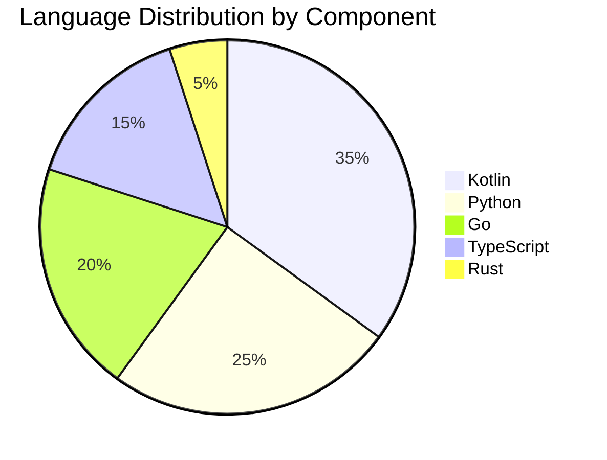

## Executive Summary

AIMatrix employs a **polyglot architecture** where each language is chosen for its specific strengths. This document details our language choices, rationale, and implementation guidelines.

## Language Distribution



## Primary Languages

### Kotlin (35% of codebase)

#### Why Kotlin?

1. **Compose Multiplatform** - Single codebase for all platforms
2. **Coroutines** - Superior async/await implementation
3. **Type Safety** - Null safety and strong typing
4. **JVM Ecosystem** - Access to mature libraries
5. **Interoperability** - Works with Java, JavaScript, Native

#### Where We Use Kotlin

```kotlin
// Core Components in Kotlin
sealed class KotlinComponents {
    // Client Applications
    object Console : KotlinComponents() {
        val platforms = listOf("Android", "iOS", "Desktop", "Web")
        val framework = "Compose Multiplatform"
    }
    
    // Master Agent
    object MasterAgent : KotlinComponents() {
        val responsibilities = listOf(
            "Agent Orchestration",
            "Resource Management",
            "Task Distribution"
        )
    }
    
    // API Gateway
    object Gateway : KotlinComponents() {
        val framework = "Ktor"
        val features = listOf("WebSocket", "REST", "GraphQL")
    }
    
    // Business Logic
    object Services : KotlinComponents() {
        val patterns = listOf("CQRS", "Event Sourcing", "DDD")
    }
}
```

#### Kotlin Best Practices

```kotlin
// Idiomatic Kotlin Example
class AgentManager(
    private val repository: AgentRepository,
    private val eventBus: EventBus
) {
    // Use suspend functions for async operations
    suspend fun createAgent(spec: AgentSpec): Result<Agent> = 
        runCatching {
            spec.validate()
                .let { repository.save(Agent.from(it)) }
                .also { eventBus.publish(AgentCreated(it)) }
        }
    
    // Leverage sealed classes for state management
    sealed class AgentState {
        object Idle : AgentState()
        data class Running(val taskId: String) : AgentState()
        data class Failed(val error: Throwable) : AgentState()
    }
    
    // Use Flow for reactive streams
    fun observeAgents(): Flow<List<Agent>> = 
        repository.findAll()
            .distinctUntilChanged()
            .catch { emit(emptyList()) }
}
```

### Python (25% of codebase)

#### Why Python?

1. **ML Ecosystem** - TensorFlow, PyTorch, Transformers
2. **Data Science** - NumPy, Pandas, SciPy
3. **AI Libraries** - LangChain, AutoGen, OpenAI SDK
4. **Rapid Prototyping** - Quick iteration on ML models
5. **Community** - Largest AI/ML community

#### Where We Use Python

```python
# ML and AI Components
from dataclasses import dataclass
from typing import List, Optional, Dict, Any
from enum import Enum

class PythonComponents(Enum):
    MODEL_SERVING = "Model inference and serving"
    TRAINING_PIPELINE = "Fine-tuning and training"
    DATA_PROCESSING = "ETL and preprocessing"
    EMBEDDINGS = "Vector generation"
    AGENTS = "LangChain and AutoGen agents"

# Example: Model Service
@dataclass
class ModelService:
    """Handles all model-related operations"""
    
    async def serve_model(self, model_id: str) -> ModelServer:
        """Load and serve ML models"""
        return ModelServer(
            model=self._load_model(model_id),
            tokenizer=self._load_tokenizer(model_id),
            config=self._load_config(model_id)
        )
    
    async def fine_tune(self, 
                       base_model: str,
                       dataset: Dataset,
                       config: TrainingConfig) -> Model:
        """Fine-tune models for specific tasks"""
        trainer = Trainer(
            model=AutoModelForCausalLM.from_pretrained(base_model),
            args=TrainingArguments(**config.to_dict()),
            train_dataset=dataset.train,
            eval_dataset=dataset.eval
        )
        return trainer.train()
```

#### Python Performance Optimization

```python
# Performance-critical code using Cython
# vector_ops.pyx
import numpy as np
cimport numpy as np
from libc.math cimport sqrt

def fast_cosine_similarity(
    np.ndarray[np.float32_t, ndim=1] vec1,
    np.ndarray[np.float32_t, ndim=1] vec2
) -> float:
    """Optimized cosine similarity using Cython"""
    cdef float dot = 0.0
    cdef float norm1 = 0.0
    cdef float norm2 = 0.0
    cdef int i
    
    for i in range(vec1.shape[0]):
        dot += vec1[i] * vec2[i]
        norm1 += vec1[i] * vec1[i]
        norm2 += vec2[i] * vec2[i]
    
    return dot / (sqrt(norm1) * sqrt(norm2))

# Async processing with asyncio
import asyncio
from concurrent.futures import ThreadPoolExecutor

class AsyncModelProcessor:
    def __init__(self):
        self.executor = ThreadPoolExecutor(max_workers=4)
    
    async def process_batch(self, items: List[Any]) -> List[Any]:
        """Process items in parallel"""
        loop = asyncio.get_event_loop()
        tasks = [
            loop.run_in_executor(self.executor, self.process_item, item)
            for item in items
        ]
        return await asyncio.gather(*tasks)
```

### Go (20% of codebase)

#### Why Go?

1. **Performance** - Near C performance with GC
2. **Concurrency** - Goroutines and channels
3. **Simplicity** - Easy to read and maintain
4. **Deployment** - Single binary, no dependencies
5. **Network Programming** - Excellent standard library

#### Where We Use Go

```go
package main

// Go Components
type GoComponents struct {
    KnowledgeService   string // Vector search and RAG
    DocumentProcessor  string // High-throughput document processing
    P2PNetwork        string // Distributed compute coordination
    MetricsCollector  string // Performance monitoring
    ProxyService      string // High-performance reverse proxy
}

// Example: High-Performance Knowledge Service
package knowledge

import (
    "context"
    "sync"
    "github.com/aimatrix/vector"
)

type KnowledgeService struct {
    vectorDB   *vector.Client
    docStore   DocumentStore
    embedder   Embedder
    
    // Connection pool for efficiency
    connPool   *sync.Pool
    
    // Concurrent processing
    workers    int
    jobQueue   chan Job
}

func (ks *KnowledgeService) ProcessDocuments(
    ctx context.Context,
    docs []Document,
) error {
    // Use goroutines for parallel processing
    var wg sync.WaitGroup
    semaphore := make(chan struct{}, ks.workers)
    errors := make(chan error, len(docs))
    
    for _, doc := range docs {
        wg.Add(1)
        semaphore <- struct{}{} // Acquire semaphore
        
        go func(d Document) {
            defer wg.Done()
            defer func() { <-semaphore }() // Release semaphore
            
            if err := ks.processDocument(ctx, d); err != nil {
                errors <- err
            }
        }(doc)
    }
    
    wg.Wait()
    close(errors)
    
    // Collect errors
    var errs []error
    for err := range errors {
        errs = append(errs, err)
    }
    
    if len(errs) > 0 {
        return fmt.Errorf("processing failed: %v", errs)
    }
    
    return nil
}

// Memory-efficient streaming
func (ks *KnowledgeService) StreamSearch(
    ctx context.Context,
    query string,
) <-chan SearchResult {
    results := make(chan SearchResult)
    
    go func() {
        defer close(results)
        
        embedding := ks.embedder.Embed(query)
        stream := ks.vectorDB.StreamSearch(ctx, embedding)
        
        for result := range stream {
            select {
            case results <- result:
            case <-ctx.Done():
                return
            }
        }
    }()
    
    return results
}
```

#### Go Performance Patterns

```go
// Object pooling for reduced GC pressure
var bufferPool = sync.Pool{
    New: func() interface{} {
        return make([]byte, 4096)
    },
}

// Zero-allocation JSON encoding
func (s *Service) HandleRequest(w http.ResponseWriter, r *http.Request) {
    buf := bufferPool.Get().([]byte)
    defer bufferPool.Put(buf)
    
    // Use buffer for processing
    // ...
}

// Efficient concurrent map
type ConcurrentMap struct {
    shards [256]*shard
}

type shard struct {
    mu    sync.RWMutex
    items map[string]interface{}
}

func (m *ConcurrentMap) Get(key string) (interface{}, bool) {
    shard := m.getShard(key)
    shard.mu.RLock()
    defer shard.mu.RUnlock()
    
    val, ok := shard.items[key]
    return val, ok
}
```

### TypeScript (15% of codebase)

#### Why TypeScript?

1. **Type Safety** - Catches errors at compile time
2. **Modern JavaScript** - Latest ECMAScript features
3. **Tooling** - Excellent IDE support
4. **Ecosystem** - NPM packages with types
5. **Full-stack** - Same language for frontend/backend

#### Where We Use TypeScript

```typescript
// TypeScript Components
enum TypeScriptComponents {
    WebFrontend = "React/Next.js web application",
    StudioAPI = "Studio.aimatrix.com backend",
    CloudFunctions = "Serverless functions",
    CDPBridge = "Chrome DevTools Protocol integration",
    WebhookHandlers = "External service integrations"
}

// Example: MCP Server Implementation
interface MCPFunction {
    name: string;
    description: string;
    parameters: JSONSchema;
    handler: (params: any) => Promise<any>;
}

class MCPServer {
    private functions = new Map<string, MCPFunction>();
    private ws: WebSocket | null = null;
    
    // Type-safe function registration
    registerFunction<TParams, TResult>(
        name: string,
        description: string,
        parameters: JSONSchema,
        handler: (params: TParams) => Promise<TResult>
    ): void {
        this.functions.set(name, {
            name,
            description,
            parameters,
            handler: handler as any
        });
    }
    
    // WebSocket message handling with discriminated unions
    private async handleMessage(message: MCPMessage): Promise<void> {
        switch (message.type) {
            case 'function_call':
                await this.handleFunctionCall(message);
                break;
            case 'list_functions':
                await this.handleListFunctions();
                break;
            case 'health_check':
                await this.respondHealthCheck();
                break;
            default:
                assertNever(message);
        }
    }
    
    // Type guards for runtime validation
    private isFunctionCallMessage(msg: any): msg is FunctionCallMessage {
        return msg.type === 'function_call' 
            && typeof msg.function === 'string'
            && msg.params !== undefined;
    }
}

// Advanced TypeScript patterns
type DeepPartial<T> = T extends object ? {
    [P in keyof T]?: DeepPartial<T[P]>;
} : T;

type AsyncReturnType<T extends (...args: any) => Promise<any>> =
    T extends (...args: any) => Promise<infer R> ? R : never;

// Branded types for type safety
type UserId = string & { __brand: 'UserId' };
type AgentId = string & { __brand: 'AgentId' };

function createUserId(id: string): UserId {
    return id as UserId;
}
```

### Rust (5% of codebase)

#### Why Rust?

1. **Memory Safety** - No GC, no runtime overhead
2. **Performance** - C++ level performance
3. **Concurrency** - Fearless concurrency
4. **WASM** - Compile to WebAssembly
5. **Reliability** - Prevents entire classes of bugs

#### Where We Use Rust

```rust
// Rust Components
enum RustComponents {
    CryptoEngine,      // Encryption and signing
    WASMModules,       // Browser-side compute
    HotPath,           // Performance-critical paths
    VectorOperations,  // SIMD vector math
    Parsers,          // High-speed parsing
}

// Example: High-performance vector operations
use ndarray::{Array1, ArrayView1};
use rayon::prelude::*;

/// SIMD-optimized cosine similarity
#[inline]
pub fn cosine_similarity(a: &ArrayView1<f32>, b: &ArrayView1<f32>) -> f32 {
    let dot_product = a.dot(b);
    let norm_a = a.dot(a).sqrt();
    let norm_b = b.dot(b).sqrt();
    
    dot_product / (norm_a * norm_b)
}

/// Parallel batch processing
pub fn batch_similarity(
    query: &Array1<f32>,
    database: &[Array1<f32>],
) -> Vec<f32> {
    database
        .par_iter()
        .map(|vec| cosine_similarity(&query.view(), &vec.view()))
        .collect()
}

// WebAssembly module for browser
#[wasm_bindgen]
pub struct EmbeddingProcessor {
    model: Vec<f32>,
}

#[wasm_bindgen]
impl EmbeddingProcessor {
    #[wasm_bindgen(constructor)]
    pub fn new(model_bytes: &[u8]) -> Result<EmbeddingProcessor, JsValue> {
        let model = bincode::deserialize(model_bytes)
            .map_err(|e| JsValue::from_str(&e.to_string()))?;
        
        Ok(EmbeddingProcessor { model })
    }
    
    #[wasm_bindgen]
    pub fn process(&self, input: &[f32]) -> Vec<f32> {
        // Fast vector processing in browser
        self.transform(input)
    }
}

// Zero-copy parsing
use nom::{
    bytes::complete::{tag, take_while},
    IResult,
};

fn parse_command(input: &str) -> IResult<&str, Command> {
    // Zero-allocation parsing
    let (input, _) = tag("CMD:")(input)?;
    let (input, name) = take_while(|c: char| c.is_alphanumeric())(input)?;
    
    Ok((input, Command { name }))
}
```

## Language Interoperability

### FFI (Foreign Function Interface)

```kotlin
// Kotlin calling Rust via JNI
class NativeVectorOps {
    companion object {
        init {
            System.loadLibrary("vector_ops")
        }
    }
    
    external fun cosineSimilarity(a: FloatArray, b: FloatArray): Float
}
```

```rust
// Rust implementation for JNI
#[no_mangle]
pub extern "C" fn Java_com_aimatrix_NativeVectorOps_cosineSimilarity(
    _env: JNIEnv,
    _class: JClass,
    a: jfloatArray,
    b: jfloatArray,
) -> jfloat {
    // Implementation
}
```

### gRPC for Service Communication

```protobuf
// Shared protocol buffer definitions
syntax = "proto3";

package aimatrix;

service AgentService {
    rpc CreateAgent(CreateAgentRequest) returns (Agent);
    rpc ExecuteTask(TaskRequest) returns (TaskResponse);
}

message Agent {
    string id = 1;
    string name = 2;
    repeated Capability capabilities = 3;
}
```

### Message Queue Integration

```python
# Python producer
import asyncio
from aiokafka import AIOKafkaProducer

async def send_to_kotlin_service(message):
    producer = AIOKafkaProducer(
        bootstrap_servers='localhost:9092',
        value_serializer=lambda v: json.dumps(v).encode()
    )
    await producer.start()
    await producer.send('agent-tasks', message)
```

```kotlin
// Kotlin consumer
class KafkaConsumer {
    fun consumeMessages() {
        val consumer = KafkaConsumer<String, String>(props)
        consumer.subscribe(listOf("agent-tasks"))
        
        while (true) {
            val records = consumer.poll(Duration.ofMillis(100))
            records.forEach { record ->
                processMessage(record.value())
            }
        }
    }
}
```

## Build System Integration

### Gradle for Polyglot Builds

```gradle
// Root build.gradle.kts
plugins {
    kotlin("multiplatform") version "1.9.0"
    id("com.github.johnrengelman.shadow") version "8.0.0"
    id("org.python.gradle") version "0.2.0"
    id("org.rust.cargo") version "0.1.0"
}

subprojects {
    when (name) {
        "core" -> apply(plugin = "kotlin-multiplatform")
        "ml-service" -> apply(plugin = "org.python.gradle")
        "vector-ops" -> apply(plugin = "org.rust.cargo")
        "web" -> apply(plugin = "org.nodejs.gradle")
    }
}

// Cross-compilation targets
kotlin {
    jvm()
    js(IR) {
        browser()
        nodejs()
    }
    native() {
        linuxX64()
        macosX64()
        macosArm64()
        mingwX64()
    }
}
```

## Language Selection Criteria

### Decision Matrix

| Criteria | Kotlin | Python | Go | TypeScript | Rust |
|----------|--------|--------|-----|------------|------|
| Performance | 8/10 | 5/10 | 9/10 | 6/10 | 10/10 |
| Development Speed | 8/10 | 10/10 | 7/10 | 8/10 | 5/10 |
| Ecosystem | 8/10 | 10/10 | 7/10 | 9/10 | 6/10 |
| Type Safety | 9/10 | 6/10 | 7/10 | 8/10 | 10/10 |
| Concurrency | 9/10 | 6/10 | 10/10 | 6/10 | 9/10 |
| Memory Safety | 7/10 | 7/10 | 8/10 | 7/10 | 10/10 |
| Learning Curve | 7/10 | 9/10 | 8/10 | 8/10 | 4/10 |

### Selection Algorithm

```kotlin
fun selectLanguage(requirements: Requirements): Language {
    return when {
        requirements.needsMLLibraries -> Python
        requirements.needsMultiplatform -> Kotlin
        requirements.needsMaxPerformance && requirements.memorySafety -> Rust
        requirements.needsHighConcurrency && requirements.simplicity -> Go
        requirements.needsWebFrontend -> TypeScript
        requirements.needsAndroid || requirements.needsIOS -> Kotlin
        else -> Kotlin // Default choice
    }
}
```

## Migration Strategy

### Legacy Code Migration

```kotlin
// Gradual migration approach
class MigrationStrategy {
    fun migrateService(service: LegacyService): ModernService {
        return when (service.language) {
            "Java" -> migrateJavaToKotlin(service)
            "JavaScript" -> migrateJSToTypeScript(service)
            "Python2" -> migratePython2To3(service)
            else -> wrapInAdapter(service)
        }
    }
    
    private fun wrapInAdapter(service: LegacyService): ModernService {
        // Create adapter layer for gradual migration
        return AdapterService(service)
    }
}
```

## Future Considerations

### Emerging Languages

1. **Zig** - Potential Rust alternative for systems programming
2. **Mojo** - Python-compatible with C++ performance
3. **Carbon** - Google's C++ successor
4. **Vale** - Memory-safe without GC

### Evaluation Criteria for New Languages

1. Community adoption and ecosystem maturity
2. Performance benchmarks vs current stack
3. Developer productivity metrics
4. Integration complexity with existing codebase
5. Long-term maintenance considerations

---

*This document is maintained by the Platform Architecture team and updated quarterly.*