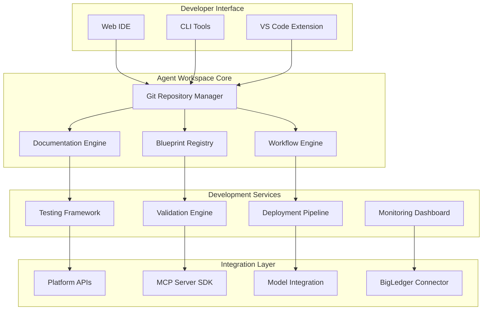
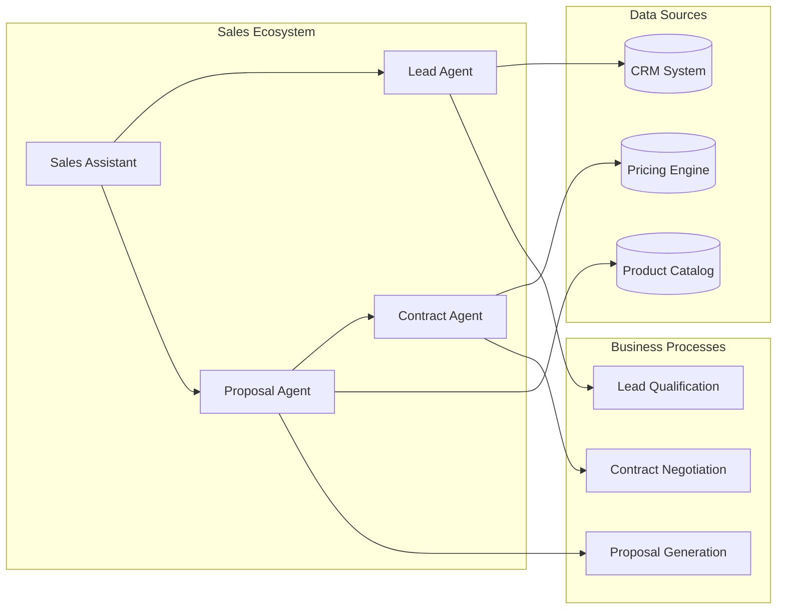
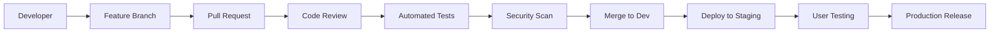

# Agent Workspace

## The Collaborative Hub for AI Agent Development

The Agent Workspace is AIMatrix's integrated development environment (IDE) specifically designed for building, testing, and managing AI agents at enterprise scale. It combines the power of modern development tools with AI-specific capabilities to accelerate agent development while maintaining enterprise-grade governance and collaboration.

## Core Capabilities

### 🔄 **Git-Native Development**
Version control and collaboration built around Git workflows with AI-specific enhancements:

- **Agent-aware Git operations** with semantic versioning for agent capabilities
- **Branch strategies** optimized for agent development lifecycle
- **Merge conflict resolution** with AI-assisted code integration
- **Automated testing** triggered by Git hooks and workflow events

### 📚 **Intelligent Documentation**
Living documentation that evolves with your agents:

- **Auto-generated API docs** from agent definitions and tool signatures
- **Interactive examples** with live code execution
- **Knowledge graphs** showing agent relationships and dependencies
- **Multi-format export** (Markdown, PDF, HTML, OpenAPI specs)

### 🎯 **Agent Blueprints**
Reusable templates and patterns for rapid agent development:

- **Marketplace integration** with vetted, production-ready templates
- **Custom blueprint creation** for organizational standards
- **Parameterized configurations** for different deployment scenarios
- **Compliance validation** ensuring blueprints meet security requirements

### 🔧 **Workflow Orchestration**
Visual tools for designing complex agent interactions and business processes:

- **Drag-and-drop workflow designer** with real-time validation
- **Agent choreography** for multi-agent collaboration patterns
- **Event-driven triggers** connecting business events to agent actions
- **Performance monitoring** with detailed execution analytics

## Architecture Overview



## Git Repository Management

### Smart Repository Structure

```
workspace/
├── agents/                    # Agent definitions
│   ├── sales-assistant/
│   │   ├── agent.yaml       # Agent configuration
│   │   ├── prompts/         # System and user prompts
│   │   ├── tools/           # Custom tools and functions
│   │   ├── tests/           # Agent behavior tests
│   │   └── docs/            # Agent-specific documentation
│   └── customer-service/
├── blueprints/               # Reusable templates
│   ├── crm-assistant.yaml
│   ├── data-processor.yaml
│   └── compliance-checker.yaml
├── workflows/                # Multi-agent workflows
│   ├── order-processing.yaml
│   └── invoice-approval.yaml
├── shared/                   # Shared resources
│   ├── prompts/             # Common prompt templates
│   ├── tools/               # Shared tool library
│   └── schemas/             # Data schemas and types
└── platform/                # Platform configurations
    ├── deployment.yaml      # Deployment settings
    ├── monitoring.yaml      # Monitoring configuration
    └── security.yaml        # Security policies
```

### Branch Strategy for Agent Development

```yaml
# Git workflow configuration
branching:
  main:
    protection:
      - required_reviews: 2
      - status_checks: [build, test, security-scan]
      - dismiss_stale_reviews: true
    
  development:
    auto_merge:
      - feature branches with passing tests
      - dependency updates from Dependabot
    
  feature:
    naming: "feature/{agent-name}/{feature-description}"
    lifecycle:
      - create_from: development
      - merge_to: development
      - auto_delete: true
    
  hotfix:
    naming: "hotfix/{issue-number}/{description}"
    lifecycle:
      - create_from: main
      - merge_to: [main, development]
```

### AI-Enhanced Git Operations

```python
# Intelligent commit message generation
class SmartCommit:
    def generate_message(self, changes):
        analysis = self.analyze_changes(changes)
        
        if analysis.type == "agent_creation":
            return f"feat(agents): add {analysis.agent_name} with {analysis.capabilities}"
        elif analysis.type == "tool_update":
            return f"fix(tools): improve {analysis.tool_name} error handling"
        elif analysis.type == "workflow_modification":
            return f"refactor(workflows): optimize {analysis.workflow_name} performance"
        
        # Fallback to AI-generated message
        return self.llm.generate_commit_message(changes)

# Automated merge conflict resolution
class MergeAssistant:
    def resolve_conflicts(self, conflicts):
        for conflict in conflicts:
            if self.is_agent_config(conflict.file):
                resolution = self.merge_agent_configs(
                    conflict.ours, 
                    conflict.theirs
                )
            elif self.is_workflow(conflict.file):
                resolution = self.merge_workflows(
                    conflict.ours,
                    conflict.theirs
                )
            else:
                resolution = self.ai_resolve(conflict)
            
            yield resolution
```

## Documentation Engine

### Auto-Generated Documentation

The documentation engine automatically creates comprehensive docs from your agent definitions:

```yaml
# Agent definition with embedded documentation
agent:
  name: "sales-assistant"
  version: "2.1.0"
  description: |
    Intelligent sales assistant that handles lead qualification,
    product recommendations, and order processing.
  
  capabilities:
    - name: "qualify_lead"
      description: "Evaluates lead potential using ML scoring"
      input_schema:
        type: "object"
        properties:
          company_size: {type: "string", enum: ["startup", "sme", "enterprise"]}
          budget: {type: "number", minimum: 0}
          timeline: {type: "string", format: "date"}
      output_schema:
        type: "object"
        properties:
          score: {type: "number", minimum: 0, maximum: 100}
          category: {type: "string", enum: ["hot", "warm", "cold"]}
          next_actions: {type: "array", items: {type: "string"}}
      
      examples:
        - input: 
            company_size: "enterprise"
            budget: 100000
            timeline: "2025-Q2"
          output:
            score: 85
            category: "hot"
            next_actions: ["Schedule demo", "Send proposal"]
```

### Interactive Documentation Features

```javascript
// Live code execution in documentation
class DocInteractions {
    // Execute agent examples in sandbox
    async executeExample(agentName, exampleId) {
        const sandbox = await this.createSandbox(agentName);
        const result = await sandbox.execute(exampleId);
        return {
            output: result.response,
            performance: result.metrics,
            cost: result.token_usage
        };
    }
    
    // Generate documentation from agent runtime
    async generateLiveDocs(agentName) {
        const agent = await this.loadAgent(agentName);
        const capabilities = await agent.introspect();
        
        return {
            api_reference: this.generateAPIRef(capabilities),
            usage_examples: this.generateExamples(capabilities),
            performance_metrics: await this.getMetrics(agentName)
        };
    }
}
```

### Knowledge Graph Visualization



## Blueprint Registry

### Blueprint Architecture

```yaml
# Sales assistant blueprint
blueprint:
  metadata:
    name: "crm-sales-assistant"
    version: "1.0.0"
    author: "AIMatrix Team"
    description: "Production-ready sales assistant with CRM integration"
    tags: ["sales", "crm", "lead-qualification"]
    
  parameters:
    - name: "crm_system"
      type: "string"
      enum: ["salesforce", "hubspot", "pipedrive"]
      required: true
      description: "Target CRM system for integration"
    
    - name: "lead_scoring_model"
      type: "string"
      default: "gradient_boosting"
      description: "ML model for lead scoring"
    
    - name: "qualification_threshold"
      type: "number"
      default: 70
      minimum: 0
      maximum: 100
      description: "Minimum score for qualified leads"
  
  template:
    agent:
      name: "${blueprint.name}-${parameters.crm_system}"
      version: "${blueprint.version}"
      
      tools:
        - name: "crm_integration"
          implementation: "mcp-${parameters.crm_system}"
        
        - name: "lead_scorer"
          model: "${parameters.lead_scoring_model}"
          threshold: ${parameters.qualification_threshold}
      
      workflows:
        - trigger: "new_lead"
          actions:
            - score_lead
            - update_crm
            - notify_sales_rep
```

### Blueprint Marketplace

```python
# Blueprint discovery and installation
class BlueprintMarketplace:
    def search_blueprints(self, query, filters=None):
        results = self.api.search({
            "query": query,
            "category": filters.get("category"),
            "min_rating": filters.get("min_rating", 4.0),
            "compatible_with": self.platform.version
        })
        
        return [
            Blueprint(
                id=bp["id"],
                name=bp["name"],
                description=bp["description"],
                rating=bp["rating"],
                downloads=bp["downloads"],
                author=bp["author"],
                verified=bp["verified"]
            ) for bp in results
        ]
    
    def install_blueprint(self, blueprint_id, parameters=None):
        blueprint = self.download_blueprint(blueprint_id)
        
        # Validate parameters
        validation = blueprint.validate_parameters(parameters)
        if not validation.valid:
            raise InvalidParametersError(validation.errors)
        
        # Generate agent from blueprint
        agent_config = blueprint.generate_config(parameters)
        
        # Install to workspace
        return self.workspace.create_agent(agent_config)
```

### Custom Blueprint Creation

```yaml
# Blueprint creation template
blueprint_spec:
  # Blueprint metadata
  metadata:
    name: "${input.name}"
    description: "${input.description}"
    author: "${user.name}"
    version: "1.0.0"
  
  # Parameterization
  parameters: ${input.parameters}
  
  # Validation rules
  validation:
    - type: "security_scan"
      rules: ["no_hardcoded_secrets", "safe_tool_usage"]
    - type: "performance_test"
      requirements: ["<500ms_response", "memory<100MB"]
    - type: "compatibility_check"
      platforms: ["aimatrix_2.0+", "kubernetes_1.24+"]
  
  # Template generation
  template:
    source: "${input.agent_definition}"
    transformations:
      - parameterize_values
      - inject_security_defaults
      - add_monitoring_config
```

## Workflow Orchestration

### Visual Workflow Designer

```javascript
// Workflow definition with visual editor support
const workflow = {
    name: "customer_onboarding",
    version: "1.0.0",
    
    nodes: [
        {
            id: "lead_received",
            type: "trigger",
            config: {
                event_type: "webhook",
                source: "website_form"
            }
        },
        {
            id: "qualify_lead",
            type: "agent",
            config: {
                agent: "lead-qualifier",
                timeout: "30s"
            },
            inputs: ["lead_received.data"]
        },
        {
            id: "route_decision",
            type: "decision",
            config: {
                condition: "qualify_lead.score >= 70"
            }
        },
        {
            id: "hot_lead_flow",
            type: "parallel",
            config: {
                branches: [
                    "notify_sales_rep",
                    "create_crm_record",
                    "schedule_followup"
                ]
            }
        },
        {
            id: "nurture_flow",
            type: "agent",
            config: {
                agent: "lead-nurturer",
                schedule: "weekly"
            }
        }
    ],
    
    edges: [
        {from: "lead_received", to: "qualify_lead"},
        {from: "qualify_lead", to: "route_decision"},
        {from: "route_decision", to: "hot_lead_flow", condition: "score >= 70"},
        {from: "route_decision", to: "nurture_flow", condition: "score < 70"}
    ]
};
```

### Multi-Agent Choreography

```yaml
# Agent collaboration patterns
choreography:
  name: "order_processing"
  
  participants:
    - agent: "order_validator"
      role: "validate incoming orders"
    - agent: "inventory_checker" 
      role: "verify product availability"
    - agent: "payment_processor"
      role: "handle payment transactions"
    - agent: "fulfillment_coordinator"
      role: "coordinate shipping and delivery"
  
  message_flows:
    - from: "order_validator"
      to: "inventory_checker"
      message_type: "order_validated"
      
    - from: "inventory_checker"
      to: ["payment_processor", "fulfillment_coordinator"]
      message_type: "inventory_confirmed"
      
    - from: "payment_processor"
      to: "fulfillment_coordinator"
      message_type: "payment_completed"
  
  error_handling:
    - condition: "inventory_unavailable"
      action: "trigger_backorder_agent"
    - condition: "payment_failed"
      action: "notify_customer_agent"
```

## Development Tools Integration

### VS Code Extension

```json
// VS Code extension configuration
{
    "aimatrix.workspace": {
        "features": {
            "intellisense": true,
            "live_testing": true,
            "performance_profiling": true,
            "cost_estimation": true
        },
        
        "linting": {
            "enabled": true,
            "rules": [
                "agent_naming_convention",
                "tool_signature_validation", 
                "security_best_practices",
                "performance_guidelines"
            ]
        },
        
        "debugging": {
            "breakpoints": true,
            "step_through_execution": true,
            "variable_inspection": true,
            "conversation_replay": true
        }
    }
}
```

### CLI Development Tools

```bash
# Agent development commands
aimatrix agent create sales-assistant \
  --blueprint=crm-assistant \
  --crm-system=salesforce \
  --template=enterprise

aimatrix agent test sales-assistant \
  --scenario=lead-qualification \
  --verbose

aimatrix workflow create order-processing \
  --agents=validator,inventory,payment \
  --trigger=webhook

aimatrix deploy \
  --agent=sales-assistant \
  --environment=staging \
  --monitoring=enabled

# Blueprint management
aimatrix blueprint search "customer service"
aimatrix blueprint install crm-assistant --version=1.2.0
aimatrix blueprint create my-template --from=existing-agent
```

## Testing Framework

### Agent Behavior Testing

```python
# Agent testing with conversation scenarios
class AgentTester:
    def test_conversation_flow(self):
        agent = self.load_agent("sales-assistant")
        
        # Simulate conversation
        conversation = ConversationSimulator(agent)
        
        # Test lead qualification flow
        response1 = conversation.send("I'm interested in your product")
        assert "tell me about your company" in response1.lower()
        
        response2 = conversation.send("We're a 500-person enterprise")
        assert conversation.context["company_size"] == "enterprise"
        
        response3 = conversation.send("Budget is around $100k")
        assert conversation.context["budget"] >= 100000
        
        # Verify qualification outcome
        qualification = agent.qualify_lead(conversation.context)
        assert qualification["score"] > 70
        assert qualification["category"] == "hot"
    
    def test_tool_integration(self):
        agent = self.load_agent("sales-assistant")
        
        # Mock CRM responses
        with mock.patch('crm.create_lead') as mock_crm:
            mock_crm.return_value = {"id": "lead_123", "status": "created"}
            
            result = agent.create_lead({
                "name": "Test Company",
                "email": "test@company.com"
            })
            
            mock_crm.assert_called_once()
            assert result["crm_id"] == "lead_123"
```

### Performance Testing

```yaml
# Load testing configuration
performance_tests:
  - name: "concurrent_conversations"
    type: "load_test"
    config:
      concurrent_users: 100
      duration: "5m"
      ramp_up: "30s"
    
    assertions:
      - avg_response_time < 500ms
      - 95th_percentile < 1s
      - error_rate < 0.1%
  
  - name: "memory_usage"
    type: "resource_test"
    config:
      duration: "10m"
      monitoring_interval: "10s"
    
    assertions:
      - memory_usage < 512MB
      - cpu_usage < 50%
      - no_memory_leaks
```

## Security & Compliance

### Code Security Scanning

```yaml
# Security validation pipeline
security:
  static_analysis:
    - tool: "semgrep"
      rules: ["aimatrix-security-rules"]
    - tool: "bandit" 
      config: "aimatrix-bandit.yaml"
  
  secret_detection:
    - tool: "truffleHog"
      entropy_threshold: 4.0
    - tool: "detect-secrets"
      baseline: ".secrets.baseline"
  
  dependency_scanning:
    - tool: "safety"
      database: "latest"
    - tool: "npm audit"
      level: "moderate"
  
  agent_specific:
    - validate_prompt_injection_protection
    - check_tool_permission_boundaries
    - verify_data_handling_compliance
```

### Compliance Validation

```python
# GDPR compliance checker for agents
class ComplianceValidator:
    def validate_gdpr_compliance(self, agent_config):
        issues = []
        
        # Check data collection practices
        if self.collects_personal_data(agent_config):
            if not self.has_consent_mechanism(agent_config):
                issues.append("Missing consent mechanism for personal data")
        
        # Verify data retention policies
        if not self.has_retention_policy(agent_config):
            issues.append("No data retention policy specified")
        
        # Check for right to be forgotten
        if not self.supports_data_deletion(agent_config):
            issues.append("Agent doesn't support data deletion requests")
        
        return ComplianceReport(
            compliant=len(issues) == 0,
            issues=issues,
            recommendations=self.generate_recommendations(issues)
        )
```

## Integration Capabilities

### Platform API Integration

```python
# Deep platform integration
class PlatformConnector:
    def sync_with_core_platform(self):
        # Sync agent definitions
        agents = self.workspace.get_all_agents()
        for agent in agents:
            self.platform.register_agent(agent)
        
        # Update deployment configurations
        deployments = self.workspace.get_deployments()
        for deployment in deployments:
            self.platform.update_deployment(deployment)
        
        # Sync monitoring configurations
        self.platform.configure_monitoring(
            self.workspace.get_monitoring_config()
        )
```

### BigLedger Integration

```yaml
# BigLedger workspace synchronization
bigledger:
  sync:
    entities:
      - customers
      - products
      - orders
      - invoices
    
    permissions:
      read: ["sales_team", "customer_service"]
      write: ["order_processor", "billing_agent"]
    
    events:
      - trigger: "new_customer"
        action: "create_agent_workspace"
      - trigger: "order_completed"
        action: "update_agent_knowledge"
```

## Best Practices

### Agent Development Guidelines

```yaml
# Development standards
standards:
  naming:
    agents: "kebab-case" # sales-assistant
    tools: "snake_case" # qualify_lead
    workflows: "kebab-case" # order-processing
  
  structure:
    max_tools_per_agent: 10
    max_workflow_depth: 5
    documentation_coverage: 90%
  
  performance:
    response_time_target: 500ms
    memory_limit: 512MB
    token_efficiency: optimize
  
  security:
    input_validation: required
    output_sanitization: required
    audit_logging: enabled
```

### Collaboration Workflows



## Getting Started

### Initial Workspace Setup

```bash
# Create new workspace
aimatrix workspace create my-enterprise-workspace \
  --template=enterprise \
  --git-provider=github \
  --organization=my-company

# Initialize repository structure
aimatrix workspace init \
  --blueprints=marketplace \
  --docs=auto-generate \
  --ci-cd=github-actions

# Install development tools
aimatrix tools install \
  --vscode-extension \
  --cli-completion \
  --git-hooks
```

### First Agent Development

```bash
# Create agent from blueprint
aimatrix agent create my-first-agent \
  --blueprint=customer-service \
  --interactive

# Test agent locally
aimatrix agent test my-first-agent \
  --conversation-file=test-scenarios.yaml

# Deploy to staging
aimatrix agent deploy my-first-agent \
  --environment=staging \
  --monitor=true
```

---

> [!NOTE]
> **Development Environment**: The Agent Workspace requires Docker and Git for full functionality. VS Code with the AIMatrix extension provides the best development experience.

> [!TIP]
> **Blueprint First**: Always start with a blueprint when creating new agents. Custom blueprints ensure consistency across your organization and speed up development.

---

*Agent Workspace - Where AI agents come to life through collaborative development*