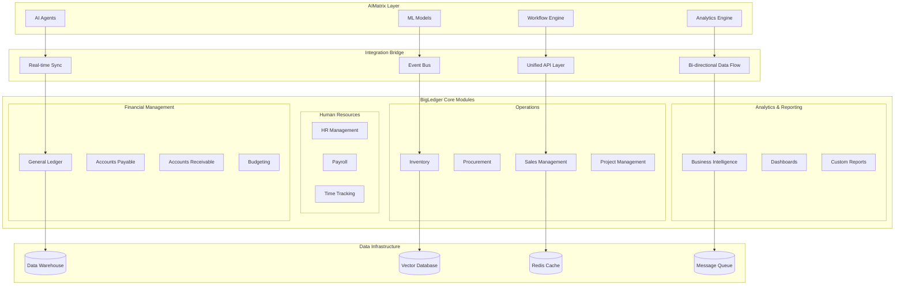

## The Unified Business Intelligence Ecosystem

BigLedger Platform integration with AIMatrix creates a powerful synergy where traditional business operations meet advanced artificial intelligence. This deep integration transforms BigLedger from a robust ERP system into an intelligent business operating system that learns, adapts, and optimizes automatically.

## Integration Architecture



## Deep Data Integration

### Real-Time Data Synchronization

```python
# BigLedger-AIMatrix real-time synchronization
class BigLedgerSyncEngine:
    def __init__(self, config: BigLedgerConfig):
        self.bl_client = BigLedgerClient(
            host=config.host,
            api_key=config.api_key,
            tenant_id=config.tenant_id
        )
        self.aimatrix_client = AIMatrixClient()
        self.event_processor = EventProcessor()
        self.data_transformer = DataTransformer()
        
    async def initialize_sync(self):
        """Initialize bidirectional synchronization between BigLedger and AIMatrix"""
        
        # Setup event listeners for BigLedger changes
        await self._setup_bigledger_webhooks()
        
        # Setup AIMatrix change listeners
        await self._setup_aimatrix_listeners()
        
        # Perform initial data sync
        await self._perform_initial_sync()
        
        # Start real-time sync processes
        await self._start_sync_processes()
    
    async def _setup_bigledger_webhooks(self):
        """Setup webhooks to capture BigLedger changes"""
        
        webhook_endpoints = [
            {
                'event_type': 'customer.created',
                'endpoint': f"{self.aimatrix_client.base_url}/webhooks/bigledger/customer-created",
                'modules': ['sales', 'ar']
            },
            {
                'event_type': 'invoice.posted',
                'endpoint': f"{self.aimatrix_client.base_url}/webhooks/bigledger/invoice-posted",
                'modules': ['ar', 'gl']
            },
            {
                'event_type': 'payment.received',
                'endpoint': f"{self.aimatrix_client.base_url}/webhooks/bigledger/payment-received",
                'modules': ['ar', 'gl', 'cash']
            },
            {
                'event_type': 'inventory.movement',
                'endpoint': f"{self.aimatrix_client.base_url}/webhooks/bigledger/inventory-movement",
                'modules': ['inventory', 'costing']
            }
        ]
        
        for webhook in webhook_endpoints:
            await self.bl_client.register_webhook(
                event_type=webhook['event_type'],
                endpoint=webhook['endpoint'],
                secret=self._generate_webhook_secret(),
                modules=webhook['modules']
            )
    
    async def handle_bigledger_event(self, event: BigLedgerEvent):
        """Process BigLedger events and sync to AIMatrix"""
        
        try:
            # Validate event signature
            if not self._validate_webhook_signature(event):
                raise SecurityError("Invalid webhook signature")
            
            # Transform BigLedger data to AIMatrix format
            transformed_data = await self.data_transformer.transform_bl_to_ai(
                event.data, event.event_type
            )
            
            # Update AIMatrix with new data
            await self._update_aimatrix_data(event.event_type, transformed_data)
            
            # Trigger AI processing if applicable
            if self._should_trigger_ai_processing(event):
                await self._trigger_ai_analysis(event, transformed_data)
            
            # Log sync success
            await self._log_sync_event(event, 'success')
            
        except Exception as e:
            await self._log_sync_event(event, 'error', str(e))
            await self._handle_sync_error(event, e)
    
    async def _trigger_ai_analysis(self, event: BigLedgerEvent, data):
        """Trigger AI analysis based on BigLedger events"""
        
        if event.event_type == 'invoice.posted':
            # Trigger cash flow forecasting update
            await self.aimatrix_client.trigger_workflow(
                'cash_flow_forecast_update',
                data={'invoice_data': data}
            )
            
            # Update customer risk scoring
            await self.aimatrix_client.trigger_agent(
                'credit_risk_analyzer',
                data={'customer_id': data['customer_id'], 'invoice_amount': data['amount']}
            )
        
        elif event.event_type == 'inventory.movement':
            # Trigger demand forecasting
            await self.aimatrix_client.trigger_workflow(
                'demand_forecast_update',
                data={'item_movements': data}
            )
        
        elif event.event_type == 'customer.created':
            # Trigger customer segmentation analysis
            await self.aimatrix_client.trigger_agent(
                'customer_segmentation',
                data={'customer_data': data}
            )

# AI-powered insights flowing back to BigLedger
class AIInsightsIntegrator:
    def __init__(self):
        self.bl_client = BigLedgerClient()
        self.insight_processor = InsightProcessor()
        
    async def push_ai_insights_to_bigledger(self, insight: AIInsight):
        """Push AI-generated insights back to BigLedger"""
        
        if insight.type == 'cash_flow_forecast':
            await self._update_cash_flow_dashboard(insight)
            
        elif insight.type == 'customer_risk_score':
            await self._update_customer_risk_indicators(insight)
            
        elif insight.type == 'demand_forecast':
            await self._update_inventory_planning(insight)
            
        elif insight.type == 'expense_anomaly':
            await self._create_review_task(insight)
    
    async def _update_customer_risk_indicators(self, insight: AIInsight):
        """Update customer risk scores in BigLedger"""
        
        risk_data = {
            'customer_id': insight.data['customer_id'],
            'risk_score': insight.data['risk_score'],
            'risk_category': insight.data['risk_category'],
            'credit_limit_recommendation': insight.data['recommended_credit_limit'],
            'payment_terms_recommendation': insight.data['recommended_payment_terms'],
            'ai_confidence': insight.confidence,
            'last_updated': datetime.utcnow().isoformat()
        }
        
        # Update BigLedger customer record
        await self.bl_client.update_customer(
            customer_id=insight.data['customer_id'],
            updates={
                'ai_risk_score': risk_data['risk_score'],
                'ai_risk_category': risk_data['risk_category'],
                'ai_credit_limit_rec': risk_data['credit_limit_recommendation'],
                'ai_insight_date': risk_data['last_updated']
            }
        )
        
        # Create alert if high risk
        if risk_data['risk_score'] > 80:
            await self.bl_client.create_alert(
                type='high_customer_risk',
                customer_id=insight.data['customer_id'],
                message=f"AI detected high credit risk (score: {risk_data['risk_score']})",
                severity='high',
                recommended_action=insight.data.get('recommended_actions', [])
            )
```

### Unified Data Model

```yaml
# Unified data model mapping between BigLedger and AIMatrix
data_model:
  entities:
    customer:
      bigledger_fields:
        - customer_id
        - name
        - address
        - payment_terms
        - credit_limit
        - balance
        - last_payment_date
      
      aimatrix_extensions:
        - ai_risk_score
        - predicted_ltv
        - churn_probability
        - segmentation_cluster
        - engagement_score
        - next_best_action
      
      sync_rules:
        - field: "ai_risk_score"
          sync_direction: "ai_to_bl"
          update_frequency: "daily"
        - field: "payment_behavior"
          sync_direction: "bl_to_ai"
          update_frequency: "real_time"
    
    invoice:
      bigledger_fields:
        - invoice_id
        - customer_id
        - amount
        - due_date
        - status
        - line_items
      
      aimatrix_extensions:
        - payment_prediction
        - collection_priority
        - discount_recommendation
        - fraud_risk_score
      
      sync_rules:
        - field: "payment_prediction"
          sync_direction: "ai_to_bl"
          trigger: "invoice_created"
        - field: "collection_priority"
          sync_direction: "ai_to_bl"
          update_frequency: "daily"
    
    inventory_item:
      bigledger_fields:
        - item_id
        - description
        - category
        - unit_cost
        - quantity_on_hand
        - reorder_point
      
      aimatrix_extensions:
        - demand_forecast
        - optimal_reorder_quantity
        - seasonal_patterns
        - price_elasticity
        - competitor_pricing
      
      sync_rules:
        - field: "demand_forecast"
          sync_direction: "ai_to_bl"
          update_frequency: "weekly"
        - field: "sales_velocity"
          sync_direction: "bl_to_ai"
          update_frequency: "real_time"
```

## Intelligent Business Process Automation

### AI-Enhanced Workflows

```python
# Intelligent workflow automation combining BigLedger and AIMatrix
class IntelligentWorkflowEngine:
    def __init__(self):
        self.bl_client = BigLedgerClient()
        self.ai_client = AIMatrixClient()
        self.workflow_orchestrator = WorkflowOrchestrator()
        
    async def setup_intelligent_workflows(self):
        """Setup AI-enhanced business workflows"""
        
        workflows = [
            self._create_intelligent_invoicing_workflow(),
            self._create_smart_procurement_workflow(),
            self._create_automated_collections_workflow(),
            self._create_predictive_budgeting_workflow()
        ]
        
        for workflow in workflows:
            await self.workflow_orchestrator.deploy_workflow(workflow)
    
    def _create_intelligent_invoicing_workflow(self):
        """AI-enhanced invoicing workflow"""
        
        return Workflow(
            name="intelligent_invoicing",
            description="AI-enhanced invoice creation and optimization",
            
            steps=[
                WorkflowStep(
                    name="analyze_customer",
                    type="ai_analysis",
                    agent="customer_analyzer",
                    inputs=["customer_id", "order_data"],
                    outputs=["risk_assessment", "payment_terms_recommendation"]
                ),
                
                WorkflowStep(
                    name="optimize_pricing",
                    type="ai_analysis", 
                    agent="pricing_optimizer",
                    inputs=["order_data", "customer_history", "market_conditions"],
                    outputs=["optimized_pricing", "discount_recommendations"]
                ),
                
                WorkflowStep(
                    name="create_invoice",
                    type="bigledger_action",
                    action="create_invoice",
                    inputs=["order_data", "optimized_pricing", "payment_terms_recommendation"]
                ),
                
                WorkflowStep(
                    name="predict_payment",
                    type="ai_analysis",
                    agent="payment_predictor",
                    inputs=["invoice_data", "customer_data"],
                    outputs=["payment_prediction", "collection_strategy"]
                ),
                
                WorkflowStep(
                    name="schedule_followup",
                    type="conditional_action",
                    condition="payment_prediction.risk_level > 0.5",
                    action="schedule_collection_reminder",
                    inputs=["invoice_data", "collection_strategy"]
                )
            ],
            
            triggers=[
                WorkflowTrigger(
                    type="bigledger_event",
                    event="order.approved",
                    condition="order.amount > 1000"
                )
            ]
        )
    
    def _create_smart_procurement_workflow(self):
        """AI-powered procurement workflow"""
        
        return Workflow(
            name="smart_procurement",
            description="Intelligent procurement with demand forecasting",
            
            steps=[
                WorkflowStep(
                    name="analyze_inventory_trends",
                    type="ai_analysis",
                    agent="demand_forecaster",
                    inputs=["inventory_data", "sales_history", "market_trends"],
                    outputs=["demand_forecast", "reorder_recommendations"]
                ),
                
                WorkflowStep(
                    name="optimize_supplier_selection",
                    type="ai_analysis",
                    agent="supplier_optimizer",
                    inputs=["reorder_recommendations", "supplier_performance", "market_prices"],
                    outputs=["optimal_suppliers", "negotiation_points"]
                ),
                
                WorkflowStep(
                    name="create_purchase_requisitions",
                    type="bigledger_action",
                    action="create_purchase_requisition",
                    inputs=["reorder_recommendations", "optimal_suppliers"]
                ),
                
                WorkflowStep(
                    name="route_for_approval",
                    type="approval_routing",
                    routing_rules="amount_based_approval",
                    inputs=["purchase_requisitions"]
                )
            ],
            
            triggers=[
                WorkflowTrigger(
                    type="scheduled",
                    schedule="daily",
                    time="09:00"
                ),
                WorkflowTrigger(
                    type="bigledger_event",
                    event="inventory.low_stock_alert"
                )
            ]
        )

# AI-powered decision support system
class IntelligentDecisionSupport:
    def __init__(self):
        self.bl_client = BigLedgerClient()
        self.ml_models = {
            'credit_risk': load_model('customer_credit_risk_model'),
            'demand_forecast': load_model('demand_forecasting_model'),
            'price_optimization': load_model('dynamic_pricing_model'),
            'cash_flow': load_model('cash_flow_prediction_model')
        }
        
    async def provide_decision_support(self, decision_context: DecisionContext):
        """Provide AI-powered decision support for business operations"""
        
        if decision_context.type == 'credit_approval':
            return await self._credit_approval_support(decision_context)
            
        elif decision_context.type == 'pricing_decision':
            return await self._pricing_decision_support(decision_context)
            
        elif decision_context.type == 'inventory_planning':
            return await self._inventory_planning_support(decision_context)
            
        elif decision_context.type == 'budget_allocation':
            return await self._budget_allocation_support(decision_context)
    
    async def _credit_approval_support(self, context: DecisionContext):
        """AI support for credit approval decisions"""
        
        # Get customer data from BigLedger
        customer_data = await self.bl_client.get_customer_detailed(
            context.customer_id,
            include_history=True,
            include_financials=True
        )
        
        # Prepare features for ML model
        features = self._extract_credit_features(customer_data, context)
        
        # Generate risk assessment
        risk_prediction = self.ml_models['credit_risk'].predict(features)
        
        # Analyze similar customers
        similar_customers = await self._find_similar_customers(customer_data)
        benchmark_performance = self._analyze_benchmark_performance(similar_customers)
        
        # Generate recommendation
        recommendation = self._generate_credit_recommendation(
            risk_prediction, benchmark_performance, context
        )
        
        return DecisionSupport(
            recommendation=recommendation.decision,
            confidence=recommendation.confidence,
            supporting_data={
                'risk_score': risk_prediction.score,
                'risk_factors': risk_prediction.top_factors,
                'benchmark_data': benchmark_performance,
                'similar_customers_performance': similar_customers.performance_stats
            },
            alternative_options=recommendation.alternatives,
            monitoring_suggestions=[
                "Monitor payment behavior for first 90 days",
                "Review credit terms after 6 months",
                "Set up automated alerts for late payments"
            ]
        )
    
    async def _pricing_decision_support(self, context: DecisionContext):
        """AI support for pricing decisions"""
        
        # Get market data and customer history
        market_data = await self._get_market_intelligence(context.product_id)
        customer_history = await self.bl_client.get_customer_purchase_history(context.customer_id)
        
        # Prepare features
        features = self._extract_pricing_features(market_data, customer_history, context)
        
        # Generate pricing recommendation
        pricing_prediction = self.ml_models['price_optimization'].predict(features)
        
        # Calculate expected outcomes for different price points
        price_scenarios = self._generate_price_scenarios(pricing_prediction, context)
        
        return DecisionSupport(
            recommendation={
                'optimal_price': pricing_prediction.optimal_price,
                'price_range': pricing_prediction.price_range,
                'discount_opportunity': pricing_prediction.discount_opportunity
            },
            confidence=pricing_prediction.confidence,
            supporting_data={
                'demand_elasticity': pricing_prediction.elasticity,
                'competitor_pricing': market_data.competitor_prices,
                'customer_price_sensitivity': customer_history.price_sensitivity
            },
            scenarios=price_scenarios,
            success_probability=pricing_prediction.success_probability
        )
```

## Advanced Analytics & Business Intelligence

### Real-Time Business Intelligence

```python
# Real-time BI engine combining BigLedger data with AI insights
class RealTimeBusinessIntelligence:
    def __init__(self):
        self.bl_client = BigLedgerClient()
        self.ai_client = AIMatrixClient()
        self.data_warehouse = DataWarehouse()
        self.real_time_processor = StreamProcessor()
        
    async def generate_executive_dashboard(self, executive_level: str):
        """Generate real-time executive dashboard with AI insights"""
        
        # Get real-time business metrics from BigLedger
        current_metrics = await self._get_current_business_metrics()
        
        # Get AI predictions and insights
        ai_insights = await self._get_ai_insights_summary()
        
        # Generate executive-level KPIs
        kpis = await self._calculate_executive_kpis(current_metrics, ai_insights, executive_level)
        
        # Create actionable recommendations
        recommendations = await self._generate_executive_recommendations(kpis, ai_insights)
        
        return ExecutiveDashboard(
            timestamp=datetime.utcnow(),
            executive_level=executive_level,
            key_metrics=kpis,
            ai_insights=ai_insights,
            recommendations=recommendations,
            alerts=await self._get_executive_alerts(),
            forecast=await self._get_business_forecast()
        )
    
    async def _get_current_business_metrics(self):
        """Get real-time business metrics from BigLedger"""
        
        # Parallel data fetching for performance
        tasks = [
            self.bl_client.get_financial_summary(period='current_month'),
            self.bl_client.get_sales_metrics(period='current_month'),
            self.bl_client.get_cash_flow_status(),
            self.bl_client.get_inventory_turnover(),
            self.bl_client.get_ar_aging(),
            self.bl_client.get_ap_summary()
        ]
        
        results = await asyncio.gather(*tasks)
        
        return BusinessMetrics(
            financial=results[0],
            sales=results[1],
            cash_flow=results[2],
            inventory=results[3],
            receivables=results[4],
            payables=results[5],
            calculated_at=datetime.utcnow()
        )
    
    async def _get_ai_insights_summary(self):
        """Get summarized AI insights across all business areas"""
        
        insights = await self.ai_client.get_insights_summary([
            'revenue_forecast',
            'customer_churn_risk',
            'inventory_optimization',
            'cash_flow_prediction',
            'market_opportunities',
            'operational_efficiency'
        ])
        
        return AIInsightsSummary(
            revenue_outlook=insights['revenue_forecast'],
            customer_insights=insights['customer_churn_risk'],
            inventory_recommendations=insights['inventory_optimization'],
            cash_flow_forecast=insights['cash_flow_prediction'],
            growth_opportunities=insights['market_opportunities'],
            efficiency_gains=insights['operational_efficiency']
        )

# Predictive analytics integration
class PredictiveAnalytics:
    def __init__(self):
        self.ml_engine = MLEngine()
        self.data_pipeline = DataPipeline()
        
    async def generate_business_forecasts(self, forecast_type: str, horizon: str):
        """Generate various business forecasts using BigLedger data and AI"""
        
        if forecast_type == 'revenue':
            return await self._revenue_forecast(horizon)
        elif forecast_type == 'cash_flow':
            return await self._cash_flow_forecast(horizon)
        elif forecast_type == 'demand':
            return await self._demand_forecast(horizon)
        elif forecast_type == 'customer_behavior':
            return await self._customer_behavior_forecast(horizon)
    
    async def _revenue_forecast(self, horizon: str):
        """Advanced revenue forecasting with multiple factors"""
        
        # Get historical revenue data from BigLedger
        revenue_history = await self.bl_client.get_revenue_history(months=36)
        
        # Get external factors
        market_data = await self._get_market_indicators()
        seasonal_data = await self._get_seasonal_patterns()
        
        # Get customer pipeline from CRM integration
        pipeline_data = await self._get_sales_pipeline()
        
        # Prepare comprehensive dataset
        forecast_features = self._prepare_revenue_features(
            revenue_history, market_data, seasonal_data, pipeline_data
        )
        
        # Generate forecast using ensemble methods
        forecast = await self.ml_engine.ensemble_forecast(
            features=forecast_features,
            models=['arima', 'lstm', 'xgboost'],
            horizon=horizon
        )
        
        # Add scenario analysis
        scenarios = await self._generate_revenue_scenarios(forecast, market_data)
        
        return RevenueForecast(
            base_forecast=forecast.prediction,
            confidence_intervals=forecast.confidence_bands,
            scenarios=scenarios,
            key_drivers=forecast.feature_importance,
            recommendations=await self._generate_revenue_recommendations(forecast)
        )
    
    async def _generate_revenue_scenarios(self, base_forecast, market_data):
        """Generate optimistic, pessimistic, and realistic scenarios"""
        
        scenarios = {}
        
        # Optimistic scenario (market growth + new opportunities)
        scenarios['optimistic'] = self._adjust_forecast(
            base_forecast, 
            multiplier=1.15,  # 15% boost
            reasoning="Assuming favorable market conditions and successful new product launches"
        )
        
        # Pessimistic scenario (market downturn + competitive pressure)
        scenarios['pessimistic'] = self._adjust_forecast(
            base_forecast,
            multiplier=0.85,  # 15% reduction
            reasoning="Accounting for potential market downturn and increased competition"
        )
        
        # Most likely scenario (base forecast with minor adjustments)
        scenarios['realistic'] = self._adjust_forecast(
            base_forecast,
            multiplier=1.02,  # 2% adjustment
            reasoning="Base forecast with typical market fluctuations"
        )
        
        return scenarios
```

## Automated Financial Operations

### Intelligent Accounts Receivable

```python
# AI-powered accounts receivable management
class IntelligentARManagement:
    def __init__(self):
        self.bl_client = BigLedgerClient()
        self.ai_client = AIMatrixClient()
        self.collection_optimizer = CollectionOptimizer()
        
    async def optimize_collections_process(self):
        """AI-optimized accounts receivable management"""
        
        # Get all outstanding invoices from BigLedger
        outstanding_invoices = await self.bl_client.get_outstanding_invoices()
        
        # AI analysis for each invoice
        collection_strategies = []
        
        for invoice in outstanding_invoices:
            # Analyze payment probability
            payment_analysis = await self._analyze_payment_probability(invoice)
            
            # Generate collection strategy
            strategy = await self._generate_collection_strategy(invoice, payment_analysis)
            
            collection_strategies.append(CollectionStrategy(
                invoice=invoice,
                payment_probability=payment_analysis.probability,
                recommended_actions=strategy.actions,
                timing=strategy.timing,
                expected_recovery=strategy.expected_recovery
            ))
        
        # Prioritize collection efforts
        prioritized_collections = self._prioritize_collection_efforts(collection_strategies)
        
        # Execute automated actions
        automation_results = []
        for strategy in prioritized_collections:
            if strategy.automation_eligible:
                result = await self._execute_automated_collection(strategy)
                automation_results.append(result)
        
        return CollectionOptimizationResult(
            total_outstanding=sum(inv.amount for inv in outstanding_invoices),
            strategies=prioritized_collections,
            automation_results=automation_results,
            expected_recovery_rate=self._calculate_expected_recovery(prioritized_collections),
            recommendations=await self._generate_ar_recommendations(prioritized_collections)
        )
    
    async def _analyze_payment_probability(self, invoice):
        """AI analysis of payment probability"""
        
        # Get customer payment history
        payment_history = await self.bl_client.get_customer_payment_history(invoice.customer_id)
        
        # Get customer communication history
        communication_history = await self._get_communication_history(invoice.customer_id)
        
        # External data sources
        credit_bureau_data = await self._get_credit_bureau_data(invoice.customer_id)
        
        # Prepare features for ML model
        features = self._extract_payment_features(
            invoice, payment_history, communication_history, credit_bureau_data
        )
        
        # Generate prediction
        prediction = await self.ai_client.predict('payment_probability', features)
        
        return PaymentAnalysis(
            probability=prediction.probability,
            confidence=prediction.confidence,
            key_factors=prediction.feature_importance,
            historical_patterns=self._analyze_historical_patterns(payment_history),
            risk_indicators=self._identify_risk_indicators(features)
        )
    
    async def _generate_collection_strategy(self, invoice, payment_analysis):
        """Generate personalized collection strategy"""
        
        # Base strategy on payment probability and customer characteristics
        if payment_analysis.probability > 0.8:
            # High probability - gentle reminder approach
            actions = [
                CollectionAction(
                    type='email_reminder',
                    timing='immediate',
                    template='friendly_reminder',
                    personalization=await self._generate_personalized_message(invoice)
                )
            ]
        
        elif payment_analysis.probability > 0.5:
            # Medium probability - multi-channel approach
            actions = [
                CollectionAction(
                    type='email_reminder',
                    timing='immediate',
                    template='payment_due_notice'
                ),
                CollectionAction(
                    type='phone_call',
                    timing='3_days_if_no_response',
                    script=await self._generate_call_script(invoice, payment_analysis)
                ),
                CollectionAction(
                    type='payment_plan_offer',
                    timing='7_days_if_no_response',
                    terms=await self._calculate_payment_plan_terms(invoice)
                )
            ]
        
        else:
            # Low probability - aggressive but professional approach
            actions = [
                CollectionAction(
                    type='urgent_notice',
                    timing='immediate',
                    template='final_notice'
                ),
                CollectionAction(
                    type='collection_agency_referral',
                    timing='14_days_if_no_response',
                    agency=await self._select_optimal_collection_agency(invoice)
                )
            ]
        
        return CollectionStrategy(
            actions=actions,
            expected_recovery=self._calculate_expected_recovery_rate(payment_analysis),
            automation_eligible=all(action.can_automate for action in actions),
            estimated_cost=sum(action.estimated_cost for action in actions)
        )
```

### Smart Expense Management

```python
# AI-powered expense management and optimization
class SmartExpenseManagement:
    def __init__(self):
        self.bl_client = BigLedgerClient()
        self.ai_client = AIMatrixClient()
        self.receipt_processor = ReceiptProcessor()
        self.expense_analyzer = ExpenseAnalyzer()
        
    async def process_expense_submission(self, expense_data):
        """AI-powered expense processing with automatic categorization and validation"""
        
        # Process receipt/document using OCR and AI
        extracted_data = await self.receipt_processor.process_receipt(expense_data.receipt)
        
        # Validate expense against extracted data
        validation_result = await self._validate_expense_data(expense_data, extracted_data)
        
        # AI categorization
        category = await self._ai_categorize_expense(extracted_data)
        
        # Policy compliance check
        compliance_check = await self._check_expense_policy_compliance(expense_data, category)
        
        # Fraud detection
        fraud_analysis = await self._detect_expense_fraud(expense_data, extracted_data)
        
        # Create expense record in BigLedger
        if validation_result.valid and compliance_check.compliant and fraud_analysis.risk_score < 0.3:
            bl_expense = await self.bl_client.create_expense(
                amount=extracted_data.amount,
                category=category.category,
                vendor=extracted_data.vendor,
                date=extracted_data.date,
                description=extracted_data.description,
                employee_id=expense_data.employee_id,
                ai_confidence=category.confidence
            )
            
            # Auto-approve if high confidence and compliant
            if category.confidence > 0.9 and extracted_data.amount < 100:
                await self.bl_client.approve_expense(bl_expense.id)
                status = 'auto_approved'
            else:
                status = 'pending_approval'
        else:
            status = 'requires_review'
        
        return ExpenseProcessingResult(
            status=status,
            extracted_data=extracted_data,
            ai_category=category,
            validation_result=validation_result,
            compliance_check=compliance_check,
            fraud_analysis=fraud_analysis,
            bigledger_expense_id=bl_expense.id if 'bl_expense' in locals() else None
        )
    
    async def _ai_categorize_expense(self, extracted_data):
        """AI-powered expense categorization"""
        
        # Prepare features for categorization
        features = {
            'vendor_name': extracted_data.vendor,
            'amount': extracted_data.amount,
            'description': extracted_data.description,
            'location': extracted_data.location,
            'time_of_day': extracted_data.timestamp.hour if extracted_data.timestamp else None,
            'day_of_week': extracted_data.timestamp.weekday() if extracted_data.timestamp else None
        }
        
        # Get historical categorization patterns
        historical_patterns = await self._get_categorization_history(extracted_data.vendor)
        
        # AI categorization
        categorization = await self.ai_client.categorize_expense({
            **features,
            'historical_patterns': historical_patterns
        })
        
        return ExpenseCategory(
            category=categorization.category,
            subcategory=categorization.subcategory,
            confidence=categorization.confidence,
            alternative_categories=categorization.alternatives,
            reasoning=categorization.explanation
        )
    
    async def analyze_expense_patterns(self, analysis_period='quarter'):
        """Comprehensive expense pattern analysis"""
        
        # Get expense data from BigLedger
        expense_data = await self.bl_client.get_expense_data(period=analysis_period)
        
        # AI analysis of spending patterns
        patterns = await self.expense_analyzer.analyze_patterns(expense_data)
        
        # Identify optimization opportunities
        optimizations = await self._identify_expense_optimizations(expense_data, patterns)
        
        # Budget variance analysis
        budget_analysis = await self._analyze_budget_variances(expense_data)
        
        # Generate insights and recommendations
        insights = await self._generate_expense_insights(patterns, optimizations, budget_analysis)
        
        return ExpenseAnalysisReport(
            analysis_period=analysis_period,
            total_expenses=expense_data.total_amount,
            spending_patterns=patterns,
            optimization_opportunities=optimizations,
            budget_analysis=budget_analysis,
            insights=insights,
            cost_saving_potential=sum(opt.potential_savings for opt in optimizations)
        )
```

## Custom Integration Scenarios

### Multi-Company Consolidation

```python
# Multi-company consolidation with AI-powered reconciliation
class MultiCompanyConsolidation:
    def __init__(self):
        self.bl_clients = {}  # Multiple BigLedger instances
        self.ai_client = AIMatrixClient()
        self.consolidation_engine = ConsolidationEngine()
        
    async def perform_intelligent_consolidation(self, company_entities: List[str]):
        """AI-powered multi-company financial consolidation"""
        
        # Collect financial data from all entities
        entity_data = {}
        for entity in company_entities:
            entity_data[entity] = await self._collect_entity_data(entity)
        
        # AI-powered intercompany transaction detection
        intercompany_transactions = await self._detect_intercompany_transactions(entity_data)
        
        # Automated elimination entries
        elimination_entries = await self._generate_elimination_entries(intercompany_transactions)
        
        # Currency translation using real-time rates
        translated_data = await self._perform_currency_translation(entity_data)
        
        # AI validation of consolidation logic
        validation_result = await self._validate_consolidation_logic(
            translated_data, elimination_entries
        )
        
        # Generate consolidated financials
        consolidated_financials = await self._generate_consolidated_statements(
            translated_data, elimination_entries
        )
        
        return ConsolidationResult(
            consolidated_financials=consolidated_financials,
            intercompany_transactions=intercompany_transactions,
            elimination_entries=elimination_entries,
            validation_result=validation_result,
            consolidation_summary=await self._generate_consolidation_summary(consolidated_financials)
        )
    
    async def _detect_intercompany_transactions(self, entity_data):
        """AI detection of intercompany transactions across entities"""
        
        # Prepare transaction data for AI analysis
        all_transactions = []
        for entity, data in entity_data.items():
            for transaction in data.transactions:
                all_transactions.append({
                    'entity': entity,
                    'transaction': transaction,
                    'counterparty_indicators': self._extract_counterparty_indicators(transaction)
                })
        
        # AI matching of potential intercompany transactions
        matches = await self.ai_client.detect_intercompany_matches(all_transactions)
        
        return IntercompanyTransactions(
            detected_matches=matches.matches,
            confidence_scores=matches.confidence_scores,
            manual_review_required=[m for m in matches.matches if m.confidence < 0.8]
        )

# Advanced budgeting and planning integration
class IntelligentBudgetingIntegration:
    def __init__(self):
        self.bl_client = BigLedgerClient()
        self.ai_client = AIMatrixClient()
        self.scenario_engine = ScenarioEngine()
        
    async def create_intelligent_budget(self, budget_period: str):
        """AI-powered budget creation using historical data and forecasts"""
        
        # Get historical financial data
        historical_data = await self.bl_client.get_historical_financials(
            periods=12,  # 12 months of history
            include_details=True
        )
        
        # Get external market data and trends
        market_data = await self._get_market_intelligence()
        
        # AI-powered forecasting for each budget category
        budget_forecasts = {}
        
        budget_categories = await self.bl_client.get_budget_categories()
        for category in budget_categories:
            forecast = await self._forecast_budget_category(
                category, historical_data, market_data
            )
            budget_forecasts[category.name] = forecast
        
        # Generate multiple scenarios
        scenarios = await self._generate_budget_scenarios(budget_forecasts)
        
        # Optimize budget allocation using AI
        optimized_allocation = await self._optimize_budget_allocation(
            budget_forecasts, scenarios
        )
        
        # Create budget in BigLedger
        budget_id = await self.bl_client.create_budget(
            period=budget_period,
            allocations=optimized_allocation,
            scenarios=scenarios,
            ai_generated=True
        )
        
        return IntelligentBudgetResult(
            budget_id=budget_id,
            forecasts=budget_forecasts,
            scenarios=scenarios,
            optimized_allocation=optimized_allocation,
            confidence_metrics=self._calculate_budget_confidence(budget_forecasts),
            recommendations=await self._generate_budget_recommendations(optimized_allocation)
        )
```

## Performance & Monitoring

### Integration Health Monitoring

```python
# Comprehensive monitoring of BigLedger-AIMatrix integration
class IntegrationHealthMonitor:
    def __init__(self):
        self.bl_client = BigLedgerClient()
        self.ai_client = AIMatrixClient()
        self.metrics_collector = MetricsCollector()
        self.alerting = AlertingSystem()
        
    async def monitor_integration_health(self):
        """Comprehensive health monitoring of the integration"""
        
        # Data synchronization health
        sync_health = await self._check_sync_health()
        
        # API performance metrics
        api_performance = await self._measure_api_performance()
        
        # Data quality assessment
        data_quality = await self._assess_data_quality()
        
        # AI model performance
        ai_performance = await self._monitor_ai_model_performance()
        
        # Business impact metrics
        business_impact = await self._measure_business_impact()
        
        # Generate overall health score
        overall_health = self._calculate_overall_health_score([
            sync_health, api_performance, data_quality, ai_performance, business_impact
        ])
        
        # Check for alerts
        alerts = await self._generate_health_alerts(overall_health)
        
        return IntegrationHealthReport(
            timestamp=datetime.utcnow(),
            overall_health_score=overall_health.score,
            sync_health=sync_health,
            api_performance=api_performance,
            data_quality=data_quality,
            ai_performance=ai_performance,
            business_impact=business_impact,
            alerts=alerts,
            recommendations=await self._generate_health_recommendations(overall_health)
        )
    
    async def _check_sync_health(self):
        """Monitor data synchronization health"""
        
        # Check last sync times
        last_syncs = await self._get_last_sync_times()
        
        # Check sync failures
        sync_failures = await self._get_sync_failures(hours=24)
        
        # Check data consistency
        consistency_check = await self._verify_data_consistency()
        
        # Calculate sync health score
        health_score = self._calculate_sync_health_score(
            last_syncs, sync_failures, consistency_check
        )
        
        return SyncHealthReport(
            health_score=health_score,
            last_successful_sync=max(last_syncs.values()) if last_syncs else None,
            failed_syncs_24h=len(sync_failures),
            consistency_score=consistency_check.score,
            issues=consistency_check.issues
        )
```

## Getting Started

### Integration Setup

```bash
# Install BigLedger-AIMatrix integration
curl -sSL https://get.aimatrix.com/bigledger-integration | bash

# Configure BigLedger connection
aimatrix bigledger configure \
  --host=https://bigledger.company.com \
  --tenant-id=your-tenant-id \
  --api-key=your-api-key

# Initialize data synchronization
aimatrix bigledger sync init \
  --modules=all \
  --sync-mode=real-time \
  --enable-ai-insights=true

# Deploy intelligent workflows
aimatrix bigledger workflows deploy \
  --workflow-pack=financial-automation \
  --enable-ml-optimization=true
```

### Configuration Example

```yaml
# bigledger-integration.yaml
bigledger:
  connection:
    host: "https://bl.company.com"
    tenant_id: "${BL_TENANT_ID}"
    api_key: "${BL_API_KEY}"
    timeout: 30
    retry_attempts: 3
    
  synchronization:
    mode: "real_time"
    batch_size: 100
    sync_interval: "5m"
    
    modules:
      - name: "general_ledger"
        sync_direction: "bi_directional"
        ai_insights: true
        
      - name: "accounts_receivable"
        sync_direction: "bi_directional" 
        ai_insights: true
        workflows: ["intelligent_collections"]
        
      - name: "inventory"
        sync_direction: "bl_to_ai"
        ai_insights: true
        workflows: ["demand_forecasting", "smart_procurement"]
  
  ai_integration:
    enable_predictive_analytics: true
    enable_intelligent_workflows: true
    enable_anomaly_detection: true
    
    models:
      - name: "cash_flow_forecasting"
        enabled: true
        update_frequency: "daily"
        
      - name: "customer_risk_scoring"
        enabled: true
        update_frequency: "real_time"
        
      - name: "expense_categorization"
        enabled: true
        confidence_threshold: 0.8

  workflows:
    intelligent_invoicing:
      enabled: true
      triggers: ["order_approved"]
      ai_components: ["pricing_optimizer", "payment_predictor"]
      
    smart_collections:
      enabled: true
      triggers: ["invoice_overdue"]
      ai_components: ["payment_probability", "collection_optimizer"]
      
    predictive_budgeting:
      enabled: true
      schedule: "monthly"
      ai_components: ["demand_forecaster", "budget_optimizer"]
```

---

> [!NOTE]
> **Deep Integration**: The BigLedger-AIMatrix integration creates a unified business intelligence ecosystem where traditional ERP meets advanced AI capabilities.

> [!TIP]
> **Start with Analytics**: Begin with AI-powered analytics and insights before enabling automated workflows to build confidence in the system.

---

*BigLedger Platform Integration - Where traditional business operations meet intelligent automation*