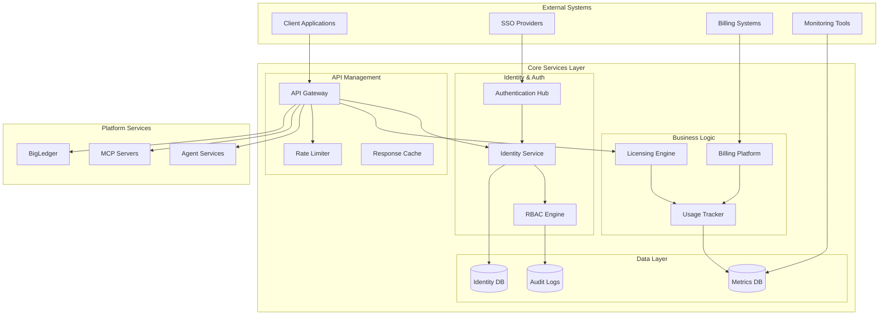
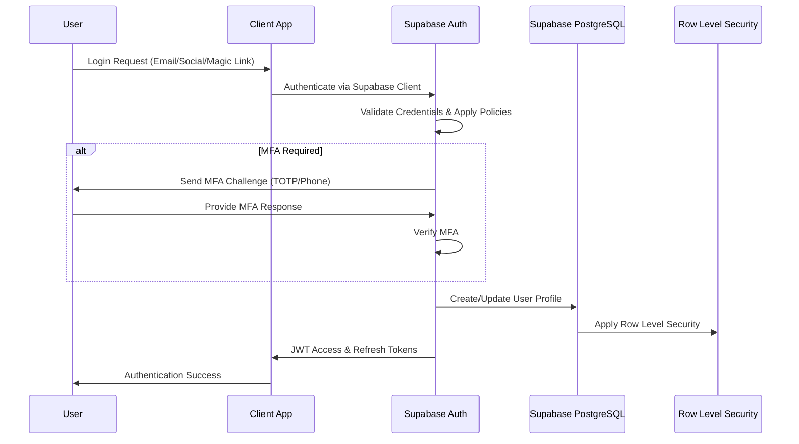
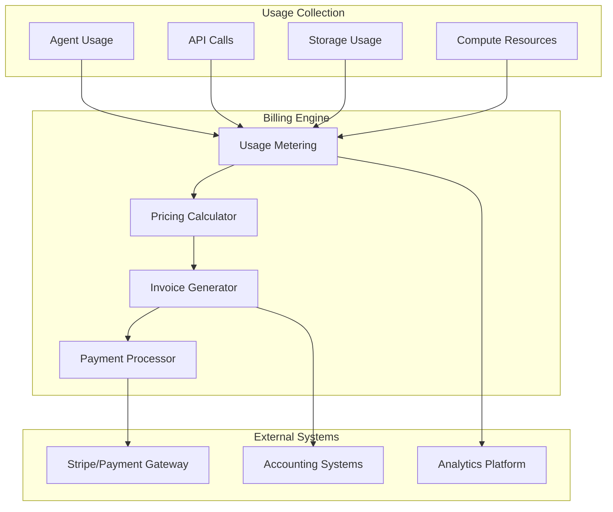

# Core Services

## The Foundation of Enterprise AI Infrastructure

Core Services provide the essential infrastructure components that power every aspect of the AIMatrix platform. These services handle identity management, authentication, API routing, licensing enforcement, and billing operations with enterprise-grade security, scalability, and reliability.

## Service Architecture



## Identity Service

### Centralized Identity Management

The Identity Service provides unified identity management across the entire AIMatrix ecosystem, supporting multiple identity providers and complex organizational structures.

#### Core Features

- **Multi-tenant Identity Isolation**: Complete separation of identity data across organizations
- **Hierarchical Organization Support**: Complex org charts with departments, teams, and roles
- **Federation Ready**: SAML 2.0, OIDC, and Active Directory integration
- **Real-time Synchronization**: Instant updates across all connected systems

#### Identity Data Model

```yaml
# Identity schema definition
identity:
  user:
    id: uuid
    email: string (unique)
    username: string (unique)
    display_name: string
    avatar_url: string
    status: enum [active, inactive, suspended]
    created_at: timestamp
    updated_at: timestamp
    last_login: timestamp
    
    # Multi-factor authentication
    mfa:
      enabled: boolean
      methods: array [totp, sms, push, biometric]
      backup_codes: array
    
    # User preferences
    preferences:
      language: string
      timezone: string
      theme: enum [light, dark, auto]
      notifications: object
  
  organization:
    id: uuid
    name: string
    domain: string
    plan: enum [starter, professional, enterprise]
    settings:
      sso_required: boolean
      mfa_required: boolean
      session_timeout: duration
      password_policy: object
    
    # Hierarchical structure
    departments: array
    teams: array
    
  role:
    id: uuid
    name: string
    description: string
    permissions: array
    scope: enum [global, organization, team]
    
  permission:
    id: uuid
    resource: string
    action: enum [create, read, update, delete, execute]
    conditions: array
```

#### API Integration

```python
# Identity Service client
class IdentityService:
    def __init__(self, api_key, base_url):
        self.client = APIClient(api_key, base_url)
    
    async def authenticate_user(self, token):
        """Validate user token and return identity claims"""
        response = await self.client.post('/auth/validate', {
            'token': token
        })
        
        return UserIdentity(
            id=response['user_id'],
            email=response['email'],
            roles=response['roles'],
            organization=response['organization'],
            permissions=response['permissions']
        )
    
    async def authorize_action(self, user_id, resource, action):
        """Check if user can perform action on resource"""
        return await self.client.post('/auth/authorize', {
            'user_id': user_id,
            'resource': resource,
            'action': action
        })
    
    async def get_user_profile(self, user_id):
        """Retrieve complete user profile"""
        return await self.client.get(f'/users/{user_id}')
    
    async def sync_organization(self, org_data):
        """Sync organization data from external systems"""
        return await self.client.put('/organizations/sync', org_data)
```

### SSO Integration Patterns

#### SAML 2.0 Configuration

```xml
<!-- SAML Service Provider configuration -->
<EntityDescriptor entityID="https://api.aimatrix.com/saml/metadata">
  <SPSSODescriptor 
    protocolSupportEnumeration="urn:oasis:names:tc:SAML:2.0:protocol">
    
    <KeyDescriptor use="signing">
      <KeyInfo xmlns="http://www.w3.org/2000/09/xmldsig#">
        <X509Data>
          <X509Certificate>{{SIGNING_CERTIFICATE}}</X509Certificate>
        </X509Data>
      </KeyInfo>
    </KeyDescriptor>
    
    <AssertionConsumerService 
      Binding="urn:oasis:names:tc:SAML:2.0:bindings:HTTP-POST"
      Location="https://api.aimatrix.com/saml/acs"
      index="0"/>
    
    <AttributeConsumingService index="0">
      <ServiceName xml:lang="en">AIMatrix Platform</ServiceName>
      <RequestedAttribute 
        Name="http://schemas.xmlsoap.org/ws/2005/05/identity/claims/emailaddress"/>
      <RequestedAttribute 
        Name="http://schemas.xmlsoap.org/ws/2005/05/identity/claims/givenname"/>
      <RequestedAttribute 
        Name="http://schemas.xmlsoap.org/ws/2005/05/identity/claims/surname"/>
    </AttributeConsumingService>
  </SPSSODescriptor>
</EntityDescriptor>
```

#### OIDC Provider Configuration

```yaml
# OpenID Connect configuration
oidc:
  issuer: "https://identity.aimatrix.com"
  authorization_endpoint: "https://identity.aimatrix.com/oauth2/auth"
  token_endpoint: "https://identity.aimatrix.com/oauth2/token"
  userinfo_endpoint: "https://identity.aimatrix.com/oauth2/userinfo"
  jwks_uri: "https://identity.aimatrix.com/.well-known/jwks.json"
  
  scopes_supported:
    - "openid"
    - "profile" 
    - "email"
    - "aimatrix:agents"
    - "aimatrix:admin"
  
  response_types_supported:
    - "code"
    - "id_token"
    - "code id_token"
  
  claims_supported:
    - "sub"
    - "iss"
    - "aud"
    - "exp"
    - "iat"
    - "email"
    - "email_verified"
    - "name"
    - "roles"
    - "organization"
```

## Supabase Authentication Hub

### Supabase Auth Integration

AIMatrix Core Platform leverages Supabase Auth as the foundation for secure, scalable authentication with built-in multi-factor authentication, social logins, and advanced security features.

#### Supabase Authentication Flow



#### Supabase Authentication Implementation

```python
# Supabase Auth integration with AIMatrix Core Platform
import asyncio
from supabase import create_client, Client
from typing import Dict, Optional, List

class SupabaseAuthHub:
    def __init__(self, config: SupabaseConfig):
        self.supabase: Client = create_client(
            config.url, 
            config.anon_key
        )
        self.service_role_client: Client = create_client(
            config.url,
            config.service_role_key
        )
    
    async def authenticate_with_email(self, email: str, password: str):
        """Authenticate user with email and password"""
        try:
            response = self.supabase.auth.sign_in_with_password({
                "email": email,
                "password": password
            })
            
            if response.user:
                # Update user metadata for AIMatrix-specific fields
                await self._sync_user_profile(response.user)
                
                return AuthenticationResult(
                    success=True,
                    user=response.user,
                    session=response.session,
                    access_token=response.session.access_token,
                    refresh_token=response.session.refresh_token
                )
        except Exception as e:
            raise AuthenticationError(f"Authentication failed: {str(e)}")
    
    async def authenticate_with_social(self, provider: str, redirect_url: str):
        """Authenticate with social providers (Google, GitHub, etc.)"""
        supported_providers = ['google', 'github', 'azure', 'linkedin']
        
        if provider not in supported_providers:
            raise AuthenticationError(f"Provider {provider} not supported")
        
        try:
            response = self.supabase.auth.sign_in_with_oauth({
                "provider": provider,
                "options": {
                    "redirect_to": redirect_url,
                    "scopes": "email profile"
                }
            })
            
            return response
            
        except Exception as e:
            raise AuthenticationError(f"Social authentication failed: {str(e)}")
    
    async def authenticate_with_magic_link(self, email: str, redirect_url: str):
        """Send magic link for passwordless authentication"""
        try:
            response = self.supabase.auth.sign_in_with_otp({
                "email": email,
                "options": {
                    "email_redirect_to": redirect_url
                }
            })
            
            return {"message": "Magic link sent to email", "success": True}
            
        except Exception as e:
            raise AuthenticationError(f"Magic link authentication failed: {str(e)}")
    
    async def setup_mfa(self, user_id: str, factor_type: str = "totp"):
        """Setup multi-factor authentication for user"""
        try:
            # Enroll MFA factor
            enroll_response = self.supabase.auth.mfa.enroll({
                "factor_type": factor_type,
                "friendly_name": f"AIMatrix {factor_type.upper()}"
            })
            
            if enroll_response.get("id"):
                # Update user profile with MFA status
                await self._update_user_mfa_status(user_id, True)
                
                return {
                    "factor_id": enroll_response["id"],
                    "qr_code": enroll_response.get("qr_code"),
                    "secret": enroll_response.get("secret"),
                    "type": factor_type
                }
                
        except Exception as e:
            raise AuthenticationError(f"MFA setup failed: {str(e)}")
    
    async def verify_mfa(self, factor_id: str, challenge_id: str, code: str):
        """Verify MFA code"""
        try:
            response = self.supabase.auth.mfa.verify({
                "factor_id": factor_id,
                "challenge_id": challenge_id,
                "code": code
            })
            
            return response
            
        except Exception as e:
            raise AuthenticationError(f"MFA verification failed: {str(e)}")
    
    async def create_user(self, email: str, password: str, metadata: Dict):
        """Create new user with custom metadata"""
        try:
            response = self.service_role_client.auth.admin.create_user({
                "email": email,
                "password": password,
                "email_confirm": True,
                "user_metadata": {
                    **metadata,
                    "aimatrix_user": True,
                    "created_at": "now()"
                }
            })
            
            if response.user:
                # Create user profile in custom table
                await self._create_user_profile(response.user, metadata)
                
            return response
            
        except Exception as e:
            raise AuthenticationError(f"User creation failed: {str(e)}")
    
    async def _sync_user_profile(self, user):
        """Sync user data with AIMatrix profile table"""
        try:
            # Upsert user profile
            profile_data = {
                "id": user.id,
                "email": user.email,
                "last_login": "now()",
                "updated_at": "now()"
            }
            
            # Add metadata if available
            if hasattr(user, 'user_metadata') and user.user_metadata:
                profile_data.update(user.user_metadata)
            
            response = self.supabase.table('user_profiles').upsert(profile_data).execute()
            
            return response
            
        except Exception as e:
            print(f"Profile sync failed: {str(e)}")
    
    async def _update_user_mfa_status(self, user_id: str, mfa_enabled: bool):
        """Update user MFA status in profile"""
        try:
            self.supabase.table('user_profiles').update({
                "mfa_enabled": mfa_enabled,
                "updated_at": "now()"
            }).eq('id', user_id).execute()
            
        except Exception as e:
            print(f"MFA status update failed: {str(e)}")
```

#### Supabase Row Level Security (RLS) Policies

```sql
-- Enable RLS on user profiles table
ALTER TABLE user_profiles ENABLE ROW LEVEL SECURITY;

-- Policy: Users can only see their own profile
CREATE POLICY "Users can view own profile" ON user_profiles
  FOR SELECT USING (auth.uid() = id);

-- Policy: Users can update their own profile
CREATE POLICY "Users can update own profile" ON user_profiles
  FOR UPDATE USING (auth.uid() = id);

-- Policy: Service role can manage all profiles
CREATE POLICY "Service role full access" ON user_profiles
  FOR ALL USING (auth.jwt() ->> 'role' = 'service_role');

-- Organization-level access control
CREATE POLICY "Organization members access" ON organizations
  FOR SELECT USING (
    auth.uid() IN (
      SELECT user_id FROM organization_members 
      WHERE organization_id = id AND status = 'active'
    )
  );

-- Agent access policies
CREATE POLICY "Agent owners and org admins" ON agents
  FOR ALL USING (
    auth.uid() = owner_id 
    OR auth.uid() IN (
      SELECT user_id FROM organization_members om
      JOIN agents a ON a.organization_id = om.organization_id
      WHERE om.role = 'admin' AND a.id = agents.id
    )
  );
```

#### Supabase Auth Configuration

```python
# Supabase authentication configuration
class SupabaseAuthConfig:
    def __init__(self):
        self.auth_settings = {
            "jwt_expiry": 3600,  # 1 hour
            "jwt_secret": os.getenv("SUPABASE_JWT_SECRET"),
            "enable_signup": True,
            "enable_confirmations": True,
            "enable_recoveries": True,
            "external_providers": {
                "google": {
                    "enabled": True,
                    "client_id": os.getenv("GOOGLE_CLIENT_ID"),
                    "secret": os.getenv("GOOGLE_CLIENT_SECRET")
                },
                "github": {
                    "enabled": True,
                    "client_id": os.getenv("GITHUB_CLIENT_ID"),
                    "secret": os.getenv("GITHUB_CLIENT_SECRET")
                },
                "azure": {
                    "enabled": True,
                    "client_id": os.getenv("AZURE_CLIENT_ID"),
                    "secret": os.getenv("AZURE_CLIENT_SECRET")
                }
            },
            "password_policy": {
                "min_length": 8,
                "require_uppercase": True,
                "require_lowercase": True,
                "require_numbers": True,
                "require_symbols": True
            },
            "mfa_settings": {
                "enforce": False,  # Organization can enforce
                "allowed_factors": ["totp", "phone"]
            }
        }
    
    async def setup_auth_hooks(self):
        """Setup Supabase auth hooks for custom logic"""
        
        # User creation hook
        await self._setup_user_creation_hook()
        
        # Login hook for risk assessment
        await self._setup_login_hook()
        
        # MFA challenge hook
        await self._setup_mfa_hook()
    
    async def _setup_user_creation_hook(self):
        """Setup post-signup webhook for user profile creation"""
        webhook_config = {
            "url": f"{self.api_base_url}/webhooks/auth/user-created",
            "events": ["user.created"],
            "headers": {
                "authorization": f"Bearer {self.webhook_secret}"
            }
        }
        return webhook_config
```

### Supabase JWT Token Management

#### Supabase JWT Token Structure

```python
# Supabase JWT token payload structure
supabase_token_payload = {
    # Standard JWT claims
    "iss": "https://your-project.supabase.co/auth/v1",  # Supabase issuer
    "sub": "f47ac10b-58cc-4372-a567-0e02b2c3d479",      # User UUID
    "aud": "authenticated",                               # Audience
    "exp": 1640995200,                                   # Expiration (1 hour)
    "iat": 1640991600,                                   # Issued at
    "email": "user@company.com",                         # User email
    "phone": "+1234567890",                             # User phone (if provided)
    "role": "authenticated",                             # Supabase role
    
    # Supabase-specific claims
    "app_metadata": {
        "provider": "email",  # auth provider used
        "providers": ["email", "google"]
    },
    
    # AIMatrix custom metadata (stored in user_metadata)
    "user_metadata": {
        "organization_id": "org_456",
        "aimatrix_roles": ["agent_developer", "team_lead"],
        "permissions": [
            "agents:create",
            "agents:read", 
            "agents:update",
            "workflows:execute"
        ],
        "mfa_enabled": True,
        "last_login": "2025-08-23T10:30:00Z",
        "aimatrix_user": True
    },
    
    # Session information
    "session_id": "session_789"
}

# Helper function to extract AIMatrix-specific claims
def extract_aimatrix_claims(jwt_payload: dict) -> dict:
    """Extract AIMatrix-specific information from Supabase JWT"""
    
    user_metadata = jwt_payload.get("user_metadata", {})
    
    return {
        "user_id": jwt_payload.get("sub"),
        "email": jwt_payload.get("email"),
        "organization_id": user_metadata.get("organization_id"),
        "roles": user_metadata.get("aimatrix_roles", []),
        "permissions": user_metadata.get("permissions", []),
        "mfa_verified": user_metadata.get("mfa_enabled", False),
        "provider": jwt_payload.get("app_metadata", {}).get("provider"),
        "session_id": jwt_payload.get("session_id")
    }
```

#### Token Lifecycle Management

```python
class TokenManager:
    def __init__(self):
        self.access_token_ttl = timedelta(hours=1)
        self.refresh_token_ttl = timedelta(days=30)
        self.redis_client = RedisClient()
    
    async def generate_tokens(self, user):
        access_token = self.create_access_token(user)
        refresh_token = self.create_refresh_token(user)
        
        # Store refresh token
        await self.redis_client.setex(
            f"refresh_token:{refresh_token.jti}",
            self.refresh_token_ttl.total_seconds(),
            json.dumps(refresh_token.payload)
        )
        
        return TokenPair(
            access_token=access_token.encode(),
            refresh_token=refresh_token.encode(),
            expires_in=self.access_token_ttl.total_seconds()
        )
    
    async def refresh_access_token(self, refresh_token):
        # Validate refresh token
        payload = await self.validate_refresh_token(refresh_token)
        if not payload:
            raise InvalidTokenError("Invalid refresh token")
        
        # Generate new access token
        user = await self.identity_service.get_user(payload['sub'])
        new_access_token = self.create_access_token(user)
        
        return new_access_token.encode()
    
    async def revoke_token(self, token):
        # Add to blacklist
        decoded = self.decode_token(token)
        await self.redis_client.setex(
            f"blacklist:{decoded['jti']}",
            decoded['exp'] - time.time(),
            "revoked"
        )
```

## API Gateway

### Intelligent Request Routing

The API Gateway serves as the single entry point for all client requests, providing intelligent routing, rate limiting, authentication, and monitoring.

#### Gateway Architecture

```yaml
# API Gateway configuration
gateway:
  listeners:
    - port: 443
      protocol: HTTPS
      tls:
        certificate: "/certs/aimatrix.com.pem"
        key: "/certs/aimatrix.com.key"
        
  routes:
    # Agent services
    - match:
        path: "/api/v2/agents/*"
        methods: [GET, POST, PUT, DELETE]
      backend:
        service: "agent-service"
        load_balancer: "round_robin"
        health_check: "/health"
      
    # MCP servers
    - match:
        path: "/api/v2/mcp/*"
        methods: [GET, POST]
      backend:
        service: "mcp-gateway"
        timeout: "30s"
        retry_policy:
          attempts: 3
          backoff: "exponential"
    
    # BigLedger integration
    - match:
        path: "/api/v2/bigledger/*"
        headers:
          - name: "x-integration-type"
            value: "bigledger"
      backend:
        service: "bigledger-proxy"
        circuit_breaker:
          failure_threshold: 50%
          recovery_timeout: "60s"
  
  middleware:
    - authentication
    - authorization
    - rate_limiting
    - request_logging
    - response_caching
    - metrics_collection
```

#### Load Balancing & Health Checks

```python
# Intelligent load balancing
class LoadBalancer:
    def __init__(self):
        self.algorithms = {
            'round_robin': RoundRobinBalancer(),
            'least_connections': LeastConnectionsBalancer(),
            'weighted': WeightedBalancer(),
            'ip_hash': IPHashBalancer(),
            'ai_optimized': AIOptimizedBalancer()
        }
    
    async def select_backend(self, route_config, request):
        algorithm = route_config.get('load_balancer', 'round_robin')
        balancer = self.algorithms[algorithm]
        
        # Get healthy backends
        backends = await self.get_healthy_backends(route_config['service'])
        
        if not backends:
            raise ServiceUnavailableError("No healthy backends available")
        
        # AI-optimized selection considers multiple factors
        if algorithm == 'ai_optimized':
            return await balancer.select(backends, request, {
                'response_time_history': await self.get_response_times(backends),
                'cpu_utilization': await self.get_cpu_metrics(backends),
                'request_complexity': self.assess_request_complexity(request),
                'user_location': self.get_user_location(request)
            })
        
        return await balancer.select(backends, request)

# Health check implementation
class HealthChecker:
    async def check_service_health(self, service_name):
        backends = await self.discover_backends(service_name)
        health_results = []
        
        for backend in backends:
            try:
                start_time = time.time()
                response = await self.http_client.get(
                    f"{backend.url}/health",
                    timeout=5.0
                )
                response_time = (time.time() - start_time) * 1000
                
                health_results.append(HealthResult(
                    backend=backend,
                    healthy=response.status == 200,
                    response_time=response_time,
                    details=response.json() if response.status == 200 else None
                ))
                
            except Exception as e:
                health_results.append(HealthResult(
                    backend=backend,
                    healthy=False,
                    error=str(e)
                ))
        
        return health_results
```

### Rate Limiting & Throttling

```python
# Advanced rate limiting with multiple strategies
class RateLimiter:
    def __init__(self):
        self.strategies = {
            'token_bucket': TokenBucketLimiter(),
            'sliding_window': SlidingWindowLimiter(),
            'fixed_window': FixedWindowLimiter(),
            'adaptive': AdaptiveLimiter()
        }
        self.redis_client = RedisClient()
    
    async def check_rate_limit(self, request, limits):
        user_id = request.user.id if request.user else request.ip
        
        # Check multiple rate limits
        for limit_config in limits:
            limiter = self.strategies[limit_config['strategy']]
            
            allowed = await limiter.is_allowed(
                key=f"{limit_config['scope']}:{user_id}",
                limit=limit_config['requests'],
                window=limit_config['window']
            )
            
            if not allowed:
                return RateLimitResult(
                    allowed=False,
                    limit_exceeded=limit_config,
                    retry_after=await limiter.get_retry_after(
                        f"{limit_config['scope']}:{user_id}"
                    )
                )
        
        return RateLimitResult(allowed=True)

# Rate limit configuration
rate_limits = {
    'default': [
        {
            'strategy': 'sliding_window',
            'scope': 'user',
            'requests': 1000,
            'window': '1h'
        },
        {
            'strategy': 'token_bucket',
            'scope': 'user', 
            'requests': 100,
            'window': '1m',
            'burst': 20
        }
    ],
    
    'premium': [
        {
            'strategy': 'adaptive',
            'scope': 'user',
            'base_limit': 5000,
            'window': '1h',
            'adaptive_factor': 2.0
        }
    ],
    
    'internal': [
        {
            'strategy': 'sliding_window',
            'scope': 'service',
            'requests': 10000,
            'window': '1m'
        }
    ]
}
```

### Response Caching

```python
# Intelligent response caching
class ResponseCache:
    def __init__(self):
        self.cache_backends = {
            'memory': MemoryCache(),
            'redis': RedisCache(),
            'cdn': CDNCache()
        }
    
    async def get_cached_response(self, request):
        cache_key = await self.generate_cache_key(request)
        cache_config = await self.get_cache_config(request.path)
        
        if not cache_config or not cache_config.enabled:
            return None
        
        # Try cache backends in priority order
        for backend_name in cache_config.backends:
            backend = self.cache_backends[backend_name]
            cached = await backend.get(cache_key)
            
            if cached:
                # Update cache statistics
                await self.update_cache_stats('hit', backend_name)
                return CachedResponse(
                    data=cached['data'],
                    headers=cached['headers'],
                    cached_at=cached['timestamp'],
                    backend=backend_name
                )
        
        await self.update_cache_stats('miss')
        return None
    
    async def cache_response(self, request, response):
        cache_config = await self.get_cache_config(request.path)
        
        if not self.should_cache(response, cache_config):
            return
        
        cache_key = await self.generate_cache_key(request)
        cache_data = {
            'data': response.body,
            'headers': dict(response.headers),
            'timestamp': time.time(),
            'ttl': cache_config.ttl
        }
        
        # Store in configured backends
        for backend_name in cache_config.backends:
            backend = self.cache_backends[backend_name]
            await backend.set(cache_key, cache_data, ttl=cache_config.ttl)
    
    def should_cache(self, response, config):
        # Don't cache errors
        if response.status >= 400:
            return False
        
        # Check cache control headers
        cache_control = response.headers.get('cache-control', '')
        if 'no-cache' in cache_control or 'no-store' in cache_control:
            return False
        
        # Check response size
        if len(response.body) > config.max_size:
            return False
        
        return True

# Cache configuration
cache_policies = {
    '/api/v2/agents/*/schema': {
        'enabled': True,
        'ttl': 3600,  # 1 hour
        'backends': ['memory', 'redis'],
        'max_size': 1024 * 1024  # 1MB
    },
    
    '/api/v2/marketplace/*': {
        'enabled': True,
        'ttl': 1800,  # 30 minutes
        'backends': ['redis', 'cdn'],
        'vary': ['accept-language']
    }
}
```

## Licensing Engine

### Usage-Based Licensing

The Licensing Engine provides flexible licensing models that adapt to actual usage patterns and business needs.

#### License Types & Models

```yaml
# License configuration schema
license_models:
  starter:
    type: "seat_based"
    limits:
      max_users: 10
      max_agents: 5
      max_requests_per_month: 100000
      max_storage_gb: 10
    
    features:
      - "basic_agents"
      - "standard_support"
      - "community_blueprints"
    
    pricing:
      base_fee: 99
      per_user: 20
      currency: "USD"
      billing_cycle: "monthly"
  
  professional:
    type: "usage_based" 
    limits:
      max_users: 100
      max_agents: 50
      max_requests_per_month: 1000000
      max_storage_gb: 100
    
    features:
      - "advanced_agents"
      - "premium_support" 
      - "marketplace_blueprints"
      - "api_access"
      - "sso_integration"
    
    pricing:
      base_fee: 499
      per_request: 0.001
      per_gb_storage: 10
      currency: "USD"
      billing_cycle: "monthly"
  
  enterprise:
    type: "hybrid"
    limits:
      max_users: "unlimited"
      max_agents: "unlimited" 
      max_requests_per_month: "unlimited"
      max_storage_gb: 1000
    
    features:
      - "all_features"
      - "dedicated_support"
      - "custom_blueprints"
      - "on_premise_deployment"
      - "advanced_security"
    
    pricing:
      base_fee: 2499
      custom_pricing: true
      currency: "USD"
      billing_cycle: "monthly"
```

#### License Validation & Enforcement

```python
# License validation engine
class LicenseValidator:
    def __init__(self):
        self.redis_client = RedisClient()
        self.usage_tracker = UsageTracker()
    
    async def validate_request(self, organization_id, request_type):
        license = await self.get_license(organization_id)
        current_usage = await self.get_current_usage(organization_id)
        
        # Check feature permissions
        if not self.has_feature_access(license, request_type):
            return ValidationResult(
                allowed=False,
                reason="Feature not included in license",
                upgrade_required=True
            )
        
        # Check usage limits
        limit_check = await self.check_usage_limits(license, current_usage, request_type)
        if not limit_check.allowed:
            return limit_check
        
        # Update usage counters
        await self.usage_tracker.increment(organization_id, request_type)
        
        return ValidationResult(
            allowed=True,
            remaining_quota=limit_check.remaining_quota
        )
    
    async def check_usage_limits(self, license, usage, request_type):
        limits = license.limits
        
        # Monthly request limit
        if request_type in ['agent_execution', 'api_call']:
            monthly_requests = usage.get_monthly_requests()
            if monthly_requests >= limits.max_requests_per_month:
                return ValidationResult(
                    allowed=False,
                    reason="Monthly request limit exceeded",
                    reset_date=usage.get_next_billing_cycle()
                )
        
        # Storage limit
        if request_type == 'file_upload':
            current_storage = usage.get_storage_usage()
            if current_storage >= limits.max_storage_gb * 1024**3:
                return ValidationResult(
                    allowed=False,
                    reason="Storage limit exceeded",
                    current_usage=current_storage
                )
        
        # Agent count limit
        if request_type == 'create_agent':
            active_agents = usage.get_active_agents()
            if active_agents >= limits.max_agents:
                return ValidationResult(
                    allowed=False,
                    reason="Maximum agent limit reached",
                    current_count=active_agents
                )
        
        return ValidationResult(allowed=True)
```

#### License Analytics & Optimization

```python
# License optimization recommendations
class LicenseOptimizer:
    def __init__(self):
        self.ml_model = load_model("license_optimization_model")
    
    async def analyze_usage_patterns(self, organization_id):
        usage_data = await self.get_historical_usage(organization_id, days=90)
        current_license = await self.get_license(organization_id)
        
        analysis = {
            'utilization_rate': self.calculate_utilization(usage_data, current_license),
            'growth_trend': self.calculate_growth_trend(usage_data),
            'feature_usage': self.analyze_feature_usage(usage_data),
            'cost_efficiency': self.calculate_cost_efficiency(usage_data, current_license)
        }
        
        recommendations = self.generate_recommendations(analysis, current_license)
        
        return OptimizationReport(
            current_license=current_license,
            analysis=analysis,
            recommendations=recommendations,
            potential_savings=self.calculate_potential_savings(recommendations)
        )
    
    def generate_recommendations(self, analysis, current_license):
        recommendations = []
        
        # Under-utilization
        if analysis['utilization_rate'] < 0.3:
            recommendations.append(Recommendation(
                type="downgrade",
                suggestion="Consider downgrading to a lower tier",
                potential_savings=self.calculate_downgrade_savings(current_license),
                confidence=0.8
            ))
        
        # Over-utilization
        elif analysis['utilization_rate'] > 0.9:
            recommendations.append(Recommendation(
                type="upgrade",
                suggestion="Upgrade to avoid hitting limits",
                cost_increase=self.calculate_upgrade_cost(current_license),
                confidence=0.9
            ))
        
        # Feature optimization
        unused_features = self.identify_unused_features(analysis['feature_usage'])
        if unused_features:
            recommendations.append(Recommendation(
                type="optimize",
                suggestion=f"Consider removing unused features: {', '.join(unused_features)}",
                potential_savings=self.calculate_feature_savings(unused_features),
                confidence=0.7
            ))
        
        return recommendations
```

## Billing Platform

### Intelligent Billing & Invoicing

The Billing Platform provides comprehensive billing management with real-time usage tracking, flexible pricing models, and automated invoicing.

#### Billing Architecture



#### Usage Metering

```python
# Real-time usage tracking
class UsageMeter:
    def __init__(self):
        self.event_queue = EventQueue()
        self.aggregators = {
            'api_calls': APICallAggregator(),
            'agent_executions': AgentExecutionAggregator(),
            'storage_usage': StorageAggregator(),
            'compute_time': ComputeAggregator()
        }
    
    async def record_usage(self, event):
        """Record a usage event"""
        # Validate event
        if not self.validate_event(event):
            raise InvalidUsageEventError("Invalid usage event format")
        
        # Add to queue for processing
        await self.event_queue.add(event)
        
        # Real-time aggregation for critical metrics
        if event.type in ['api_call', 'agent_execution']:
            aggregator = self.aggregators[event.type + 's']
            await aggregator.process_real_time(event)
    
    async def get_usage_summary(self, organization_id, period):
        """Get aggregated usage for billing period"""
        summary = {}
        
        for usage_type, aggregator in self.aggregators.items():
            usage_data = await aggregator.get_summary(
                organization_id, 
                period.start_date, 
                period.end_date
            )
            summary[usage_type] = usage_data
        
        return UsageSummary(
            organization_id=organization_id,
            period=period,
            usage_data=summary,
            total_events=sum(data.event_count for data in summary.values())
        )

# Usage event schema
class UsageEvent:
    def __init__(self, **kwargs):
        self.organization_id = kwargs['organization_id']
        self.user_id = kwargs.get('user_id')
        self.event_type = kwargs['event_type']
        self.timestamp = kwargs.get('timestamp', datetime.utcnow())
        self.metadata = kwargs.get('metadata', {})
        
        # Event-specific fields
        if self.event_type == 'api_call':
            self.endpoint = kwargs['endpoint']
            self.method = kwargs['method']
            self.response_status = kwargs.get('response_status')
            self.response_size = kwargs.get('response_size', 0)
        
        elif self.event_type == 'agent_execution':
            self.agent_id = kwargs['agent_id']
            self.execution_time = kwargs['execution_time']
            self.tokens_used = kwargs.get('tokens_used', 0)
            self.model_used = kwargs.get('model_used')
        
        elif self.event_type == 'storage_usage':
            self.file_size = kwargs['file_size']
            self.operation = kwargs['operation']  # upload, download, delete
            self.file_type = kwargs.get('file_type')
```

#### Pricing Calculator

```python
# Dynamic pricing calculation
class PricingCalculator:
    def __init__(self):
        self.pricing_rules = self.load_pricing_rules()
        self.currency_converter = CurrencyConverter()
    
    async def calculate_charges(self, organization_id, usage_summary):
        license = await self.get_license(organization_id)
        pricing_model = self.pricing_rules[license.plan]
        
        charges = BillingCharges()
        
        # Base subscription fee
        charges.add_line_item(
            description=f"{license.plan.title()} Plan - Monthly Subscription",
            amount=pricing_model.base_fee,
            quantity=1,
            unit_price=pricing_model.base_fee
        )
        
        # Usage-based charges
        for usage_type, usage_data in usage_summary.usage_data.items():
            if usage_type in pricing_model.usage_rates:
                rate = pricing_model.usage_rates[usage_type]
                
                # Calculate billable usage (subtract included amounts)
                included = pricing_model.included_usage.get(usage_type, 0)
                billable_usage = max(0, usage_data.total - included)
                
                if billable_usage > 0:
                    charge_amount = billable_usage * rate.unit_price
                    
                    charges.add_line_item(
                        description=f"{usage_type.replace('_', ' ').title()}",
                        amount=charge_amount,
                        quantity=billable_usage,
                        unit_price=rate.unit_price,
                        unit=rate.unit
                    )
        
        # Apply discounts
        discounts = await self.calculate_discounts(organization_id, charges)
        for discount in discounts:
            charges.add_discount(discount)
        
        # Apply taxes
        tax_rate = await self.get_tax_rate(organization_id)
        charges.apply_tax(tax_rate)
        
        return charges
    
    async def calculate_discounts(self, organization_id, charges):
        discounts = []
        
        # Volume discount
        if charges.subtotal > 1000:
            discount_rate = min(0.15, (charges.subtotal - 1000) / 10000 * 0.05)
            discounts.append(Discount(
                type="volume_discount",
                description=f"Volume Discount ({discount_rate*100:.1f}%)",
                amount=charges.subtotal * discount_rate
            ))
        
        # Long-term customer discount
        account_age = await self.get_account_age(organization_id)
        if account_age > 365:  # 1 year
            discounts.append(Discount(
                type="loyalty_discount",
                description="Loyal Customer Discount (5%)",
                amount=charges.subtotal * 0.05
            ))
        
        return discounts
```

#### Invoice Generation

```python
# Automated invoice generation
class InvoiceGenerator:
    def __init__(self):
        self.template_engine = TemplateEngine()
        self.pdf_generator = PDFGenerator()
        self.email_service = EmailService()
    
    async def generate_invoice(self, organization_id, billing_period):
        # Get usage and charges
        usage_summary = await self.usage_meter.get_usage_summary(
            organization_id, billing_period
        )
        charges = await self.pricing_calculator.calculate_charges(
            organization_id, usage_summary
        )
        
        # Generate invoice
        invoice = Invoice(
            invoice_number=await self.generate_invoice_number(),
            organization_id=organization_id,
            billing_period=billing_period,
            issue_date=datetime.utcnow(),
            due_date=datetime.utcnow() + timedelta(days=30),
            charges=charges,
            status="draft"
        )
        
        # Save to database
        await self.save_invoice(invoice)
        
        # Generate PDF
        pdf_content = await self.generate_pdf(invoice)
        invoice.pdf_url = await self.storage.upload_pdf(
            pdf_content, 
            f"invoices/{invoice.invoice_number}.pdf"
        )
        
        # Send email
        if invoice.charges.total > 0:
            await self.send_invoice_email(invoice)
        
        # Update status
        invoice.status = "sent"
        await self.save_invoice(invoice)
        
        return invoice
    
    async def generate_pdf(self, invoice):
        # Load organization data
        organization = await self.get_organization(invoice.organization_id)
        
        # Render HTML template
        html_content = await self.template_engine.render("invoice_template.html", {
            "invoice": invoice,
            "organization": organization,
            "line_items": invoice.charges.line_items,
            "discounts": invoice.charges.discounts,
            "tax_details": invoice.charges.tax_details
        })
        
        # Generate PDF
        pdf_content = await self.pdf_generator.generate(
            html_content,
            options={
                "format": "A4",
                "margin": {"top": "1in", "bottom": "1in", "left": "1in", "right": "1in"}
            }
        )
        
        return pdf_content
```

## Monitoring & Observability

### Service Health Monitoring

```python
# Comprehensive service monitoring
class ServiceMonitor:
    def __init__(self):
        self.metrics_collector = MetricsCollector()
        self.alerting = AlertingSystem()
        self.dashboards = DashboardManager()
    
    async def collect_service_metrics(self):
        services = [
            'identity-service',
            'authentication-hub', 
            'api-gateway',
            'licensing-engine',
            'billing-platform'
        ]
        
        metrics = {}
        for service in services:
            service_metrics = await self.collect_metrics(service)
            metrics[service] = service_metrics
            
            # Check SLA thresholds
            await self.check_sla_violations(service, service_metrics)
        
        return metrics
    
    async def check_sla_violations(self, service, metrics):
        sla_config = self.get_sla_config(service)
        violations = []
        
        # Response time SLA
        if metrics.avg_response_time > sla_config.max_response_time:
            violations.append(SLAViolation(
                service=service,
                metric="response_time",
                current_value=metrics.avg_response_time,
                threshold=sla_config.max_response_time,
                severity="high"
            ))
        
        # Availability SLA
        if metrics.availability < sla_config.min_availability:
            violations.append(SLAViolation(
                service=service,
                metric="availability",
                current_value=metrics.availability,
                threshold=sla_config.min_availability,
                severity="critical"
            ))
        
        # Error rate SLA
        if metrics.error_rate > sla_config.max_error_rate:
            violations.append(SLAViolation(
                service=service,
                metric="error_rate",
                current_value=metrics.error_rate,
                threshold=sla_config.max_error_rate,
                severity="medium"
            ))
        
        # Send alerts for violations
        for violation in violations:
            await self.alerting.send_alert(violation)
        
        return violations
```

### Performance Dashboards

```yaml
# Dashboard configuration
dashboards:
  core_services_overview:
    title: "Core Services Overview"
    refresh_interval: "30s"
    
    panels:
      - title: "Service Health Status"
        type: "status_grid"
        services:
          - identity-service
          - authentication-hub
          - api-gateway
          - licensing-engine
          - billing-platform
      
      - title: "Request Volume"
        type: "time_series"
        metrics:
          - name: "requests_per_second"
            aggregation: "sum"
            group_by: ["service"]
      
      - title: "Response Times"
        type: "heatmap"
        metrics:
          - name: "response_time_percentiles"
            percentiles: [50, 90, 95, 99]
      
      - title: "Error Rates"
        type: "gauge"
        metrics:
          - name: "error_rate"
            threshold_critical: 5%
            threshold_warning: 1%
```

## Getting Started

### Installation & Configuration

```bash
# Install Core Services
curl -sSL https://get.aimatrix.com/core-services | bash

# Configure identity provider
aimatrix core identity configure \
  --provider=saml \
  --metadata-url=https://sso.company.com/metadata

# Setup API Gateway
aimatrix core gateway configure \
  --domain=api.company.com \
  --tls-cert=/path/to/cert.pem \
  --tls-key=/path/to/key.pem

# Initialize licensing
aimatrix core licensing init \
  --org-id=your-org-id \
  --plan=professional

# Configure billing integration
aimatrix core billing configure \
  --provider=stripe \
  --webhook-secret=whsec_xxx
```

### Service Configuration Example

```yaml
# core-services.yaml
identity:
  providers:
    - type: saml
      name: "Corporate SSO"
      metadata_url: "https://sso.company.com/metadata"
      attribute_mapping:
        email: "http://schemas.xmlsoap.org/ws/2005/05/identity/claims/emailaddress"
        name: "http://schemas.xmlsoap.org/ws/2005/05/identity/claims/name"
        groups: "http://schemas.xmlsoap.org/ws/2005/05/identity/claims/groups"

authentication:
  mfa:
    required_for:
      - admin_users
      - api_access
    methods:
      - totp
      - push_notification
      - sms
  
  session:
    timeout: "8h"
    refresh_threshold: "1h"

api_gateway:
  rate_limits:
    default:
      - requests: 1000
        window: "1h"
      - requests: 100
        window: "1m"
    
  caching:
    default_ttl: "5m"
    max_size: "100MB"

licensing:
  enforcement:
    strict_mode: true
    grace_period: "7d"
  
  metering:
    batch_size: 1000
    flush_interval: "1m"

billing:
  currency: "USD"
  tax_calculation: "automatic"
  invoice_delivery: "email"
  payment_methods:
    - "card"
    - "ach"
    - "wire_transfer"
```

---

> [!NOTE]
> **High Availability**: All Core Services are designed for active-active deployment across multiple availability zones with automatic failover.

> [!TIP]
> **Security Best Practices**: Always enable MFA for administrative functions and use environment-specific encryption keys for each deployment.

---

*Core Services - The reliable foundation that powers enterprise AI at scale*