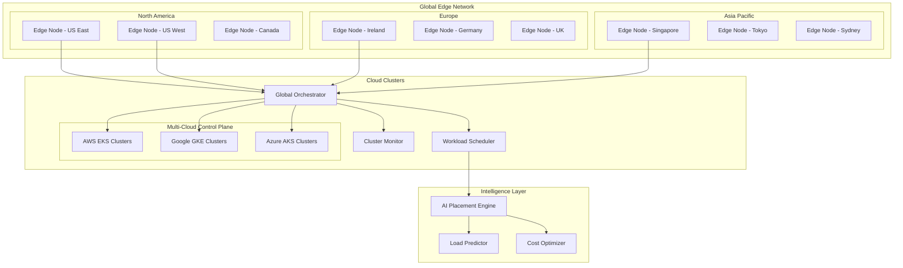

# Serverless Edge & Cloud Clusters

## Distributed Intelligence at Global Scale

The Serverless Edge & Cloud Clusters infrastructure provides a globally distributed, auto-scaling compute platform that brings AI processing closer to users while maintaining centralized coordination. This hybrid architecture combines the benefits of edge computing with the power of cloud-scale orchestration.

## Architecture Overview



## Edge Computing Infrastructure

### Edge Node Architecture

Each edge node is a self-contained computing unit capable of running AI workloads with minimal latency:

```yaml
# Edge node specification
edge_node:
  hardware:
    cpu: "16 cores (ARM64 or x86_64)"
    memory: "64GB RAM"
    storage: "2TB NVMe SSD"
    gpu: "NVIDIA T4 or equivalent (optional)"
    network: "10Gbps fiber connection"
  
  software_stack:
    container_runtime: "containerd"
    orchestration: "k3s (lightweight Kubernetes)"
    service_mesh: "linkerd (edge-optimized)"
    monitoring: "prometheus + grafana"
    storage: "longhorn (distributed storage)"
  
  ai_capabilities:
    model_serving:
      - inference_engines: ["triton", "onnx-runtime", "tflite"]
      - supported_formats: ["onnx", "tensorrt", "pytorch", "tensorflow"]
      - max_model_size: "8GB"
    
    local_processing:
      - image_processing: "opencv, pillow"
      - nlp: "spacy, transformers"
      - data_preprocessing: "pandas, numpy"
      - vector_operations: "faiss, annoy"
  
  networking:
    ingress: "traefik"
    load_balancing: "round_robin, least_connections"
    service_discovery: "consul-connect"
    vpn: "wireguard (site-to-site)"
```

### Intelligent Workload Placement

```python
# AI-powered workload placement engine
class WorkloadPlacementEngine:
    def __init__(self):
        self.ml_model = load_model("workload_placement_optimizer")
        self.edge_monitor = EdgeNodeMonitor()
        self.latency_predictor = LatencyPredictor()
    
    async def place_workload(self, workload_spec):
        # Analyze workload requirements
        requirements = self.analyze_requirements(workload_spec)
        
        # Get available edge nodes and their current state
        candidate_nodes = await self.get_candidate_nodes(requirements)
        
        # Score each candidate using ML model
        placement_scores = []
        for node in candidate_nodes:
            node_metrics = await self.edge_monitor.get_metrics(node.id)
            user_locations = await self.get_user_locations(workload_spec)
            
            features = self.extract_features(
                workload=workload_spec,
                node=node,
                metrics=node_metrics,
                user_locations=user_locations
            )
            
            score = self.ml_model.predict(features)
            placement_scores.append(PlacementScore(
                node=node,
                score=score,
                predicted_latency=await self.latency_predictor.predict(node, user_locations),
                predicted_cost=self.calculate_cost(workload_spec, node),
                resource_availability=self.calculate_availability(node_metrics, requirements)
            ))
        
        # Select optimal placement
        best_placement = max(placement_scores, key=lambda x: x.score)
        
        # Deploy workload
        deployment_result = await self.deploy_workload(
            workload_spec, 
            best_placement.node
        )
        
        return PlacementResult(
            node=best_placement.node,
            deployment=deployment_result,
            predicted_performance=best_placement,
            alternatives=[s for s in placement_scores if s.node != best_placement.node]
        )
    
    def extract_features(self, workload, node, metrics, user_locations):
        """Extract features for ML model prediction"""
        return {
            # Workload characteristics
            'cpu_requests': workload.resources.cpu,
            'memory_requests': workload.resources.memory,
            'gpu_required': workload.resources.gpu is not None,
            'storage_requests': workload.resources.storage,
            'network_intensive': workload.characteristics.network_intensive,
            
            # Node characteristics
            'node_cpu_available': metrics.cpu_available_percentage,
            'node_memory_available': metrics.memory_available_percentage,
            'node_gpu_available': metrics.gpu_available_percentage,
            'node_load_average': metrics.load_average,
            'node_network_bandwidth': metrics.network_bandwidth_available,
            
            # Geographical factors
            'avg_distance_to_users': self.calculate_avg_distance(node.location, user_locations),
            'users_in_same_region': self.count_users_in_region(node.region, user_locations),
            
            # Historical performance
            'node_reliability_score': metrics.historical_uptime,
            'average_response_time': metrics.avg_response_time_7d,
            'error_rate': metrics.error_rate_7d
        }

# Workload migration for dynamic optimization
class WorkloadMigrator:
    async def optimize_placement(self):
        """Continuously optimize workload placement"""
        active_workloads = await self.get_active_workloads()
        
        for workload in active_workloads:
            current_performance = await self.measure_performance(workload)
            
            # Check if migration could improve performance
            better_placement = await self.placement_engine.find_better_placement(
                workload, 
                current_performance
            )
            
            if better_placement and self.should_migrate(current_performance, better_placement):
                await self.migrate_workload(workload, better_placement.node)
    
    def should_migrate(self, current, proposed):
        """Determine if migration is worthwhile"""
        # Consider migration costs
        migration_overhead = self.estimate_migration_cost(current.workload)
        
        # Performance improvement threshold
        latency_improvement = (current.latency - proposed.predicted_latency) / current.latency
        cost_reduction = (current.cost - proposed.predicted_cost) / current.cost
        
        # Migration criteria
        return (
            latency_improvement > 0.2 or  # 20% latency improvement
            cost_reduction > 0.15 or      # 15% cost reduction
            current.error_rate > 0.05     # High error rate
        ) and migration_overhead < proposed.benefits * 0.5
```

### Edge-to-Edge Communication

```yaml
# Edge mesh networking configuration
edge_mesh:
  communication:
    protocol: "grpc"
    encryption: "tls_1.3"
    compression: "gzip"
    
  service_discovery:
    method: "consul_connect"
    health_checks: "enabled"
    load_balancing: "round_robin"
    
  data_replication:
    strategy: "eventual_consistency"
    conflict_resolution: "last_writer_wins"
    sync_interval: "30s"
    
  failure_handling:
    circuit_breaker: "enabled"
    retry_policy:
      max_attempts: 3
      backoff: "exponential"
      initial_delay: "1s"
      max_delay: "30s"
```

## Cloud Cluster Orchestration

### Multi-Cloud Kubernetes Management

```python
# Multi-cloud Kubernetes orchestrator
class MultiCloudOrchestrator:
    def __init__(self):
        self.cluster_providers = {
            'aws': EKSManager(),
            'gcp': GKEManager(), 
            'azure': AKSManager(),
            'edge': EdgeK8sManager()
        }
        self.workload_scheduler = WorkloadScheduler()
        self.cost_optimizer = CostOptimizer()
    
    async def deploy_workload(self, workload_spec):
        # Determine optimal cluster placement
        placement = await self.determine_cluster_placement(workload_spec)
        
        # Get cluster manager
        cluster_manager = self.cluster_providers[placement.provider]
        
        # Deploy to cluster
        deployment = await cluster_manager.deploy(
            workload_spec, 
            placement.cluster_id
        )
        
        # Setup monitoring and health checks
        await self.setup_monitoring(deployment)
        
        return deployment
    
    async def determine_cluster_placement(self, workload_spec):
        candidates = []
        
        for provider, manager in self.cluster_providers.items():
            clusters = await manager.get_available_clusters()
            
            for cluster in clusters:
                # Check resource availability
                if not await self.check_resource_availability(cluster, workload_spec):
                    continue
                
                # Calculate cost
                cost = await self.cost_optimizer.calculate_cost(
                    workload_spec, cluster
                )
                
                # Calculate performance score
                performance_score = await self.calculate_performance_score(
                    workload_spec, cluster
                )
                
                candidates.append(ClusterCandidate(
                    provider=provider,
                    cluster_id=cluster.id,
                    cost=cost,
                    performance_score=performance_score,
                    availability_zone=cluster.availability_zone,
                    region=cluster.region
                ))
        
        # Select optimal candidate
        return self.select_optimal_candidate(candidates, workload_spec.preferences)
    
    def select_optimal_candidate(self, candidates, preferences):
        """Multi-criteria optimization for cluster selection"""
        # Weighted scoring based on preferences
        weights = {
            'cost': preferences.get('cost_weight', 0.3),
            'performance': preferences.get('performance_weight', 0.4),
            'reliability': preferences.get('reliability_weight', 0.2),
            'compliance': preferences.get('compliance_weight', 0.1)
        }
        
        scored_candidates = []
        for candidate in candidates:
            total_score = (
                candidate.cost_score * weights['cost'] +
                candidate.performance_score * weights['performance'] +
                candidate.reliability_score * weights['reliability'] +
                candidate.compliance_score * weights['compliance']
            )
            
            scored_candidates.append((candidate, total_score))
        
        # Return highest scoring candidate
        return max(scored_candidates, key=lambda x: x[1])[0]

# Kubernetes cluster auto-scaling
class ClusterAutoScaler:
    def __init__(self):
        self.metrics_collector = MetricsCollector()
        self.predictor = ResourceDemandPredictor()
    
    async def scale_cluster(self, cluster_id):
        # Get current metrics
        current_metrics = await self.metrics_collector.get_cluster_metrics(cluster_id)
        
        # Predict future demand
        predicted_demand = await self.predictor.predict_demand(
            cluster_id, 
            horizon_minutes=30
        )
        
        # Calculate required scaling
        scaling_decision = self.calculate_scaling_decision(
            current_metrics, 
            predicted_demand
        )
        
        if scaling_decision.scale_up:
            await self.scale_up_cluster(cluster_id, scaling_decision.additional_nodes)
        elif scaling_decision.scale_down:
            await self.scale_down_cluster(cluster_id, scaling_decision.nodes_to_remove)
        
        return scaling_decision
    
    def calculate_scaling_decision(self, current_metrics, predicted_demand):
        # CPU-based scaling
        cpu_utilization = current_metrics.cpu_utilization
        predicted_cpu = predicted_demand.cpu_utilization
        
        # Memory-based scaling
        memory_utilization = current_metrics.memory_utilization
        predicted_memory = predicted_demand.memory_utilization
        
        # Scale up conditions
        scale_up = (
            cpu_utilization > 70 or 
            memory_utilization > 80 or
            predicted_cpu > 70 or 
            predicted_memory > 80
        )
        
        # Scale down conditions (with safety margin)
        scale_down = (
            cpu_utilization < 30 and 
            memory_utilization < 40 and
            predicted_cpu < 40 and
            predicted_memory < 50
        )
        
        return ScalingDecision(
            scale_up=scale_up,
            scale_down=scale_down,
            additional_nodes=self.calculate_nodes_needed(predicted_demand) if scale_up else 0,
            nodes_to_remove=self.calculate_nodes_removable(current_metrics) if scale_down else 0,
            reasoning=self.generate_scaling_reasoning(current_metrics, predicted_demand)
        )
```

### Serverless Function Management

```yaml
# Serverless function configuration
serverless_functions:
  runtime_support:
    - python: ["3.9", "3.10", "3.11"]
    - node: ["16", "18", "20"]
    - go: ["1.19", "1.20", "1.21"]
    - rust: ["1.70+"]
    - java: ["11", "17", "21"]
  
  scaling:
    cold_start_optimization: true
    warm_instances: 
      min: 0
      max: 1000
    concurrency:
      per_instance: 100
      global_limit: 10000
  
  triggers:
    http: "enabled"
    queue: "enabled" 
    schedule: "enabled"
    events: "enabled"
    
  features:
    - vpc_support
    - custom_domains
    - environment_variables
    - secrets_management
    - distributed_tracing
    - custom_metrics
```

```python
# Serverless function orchestrator
class ServerlessOrchestrator:
    def __init__(self):
        self.function_registry = FunctionRegistry()
        self.scaling_engine = ScalingEngine()
        self.cold_start_optimizer = ColdStartOptimizer()
    
    async def deploy_function(self, function_spec):
        # Validate function spec
        validation = await self.validate_function_spec(function_spec)
        if not validation.valid:
            raise ValidationError(validation.errors)
        
        # Build container image
        image = await self.build_function_image(function_spec)
        
        # Deploy to edge nodes based on trigger configuration
        deployment_targets = await self.determine_deployment_targets(function_spec)
        
        deployments = []
        for target in deployment_targets:
            deployment = await self.deploy_to_target(function_spec, image, target)
            deployments.append(deployment)
        
        # Register function in service discovery
        await self.function_registry.register(function_spec, deployments)
        
        # Setup monitoring and alerting
        await self.setup_function_monitoring(function_spec, deployments)
        
        return FunctionDeploymentResult(
            function_id=function_spec.id,
            deployments=deployments,
            endpoints=self.generate_endpoints(deployments),
            monitoring_dashboard=self.generate_dashboard_url(function_spec.id)
        )
    
    async def handle_function_invocation(self, function_id, event):
        # Find optimal instance to handle request
        instance = await self.find_optimal_instance(function_id, event)
        
        if not instance:
            # No warm instances available, cold start
            instance = await self.cold_start_instance(function_id)
        
        # Route request to instance
        result = await self.invoke_function_instance(instance, event)
        
        # Update scaling metrics
        await self.scaling_engine.record_invocation(function_id, result.execution_time)
        
        return result
    
    async def find_optimal_instance(self, function_id, event):
        """Find the best available instance for the request"""
        available_instances = await self.get_available_instances(function_id)
        
        if not available_instances:
            return None
        
        # Simple load balancing - choose least loaded instance
        return min(available_instances, key=lambda x: x.current_load)

# Cold start optimization
class ColdStartOptimizer:
    def __init__(self):
        self.predictive_scaler = PredictiveScaler()
        self.image_cache = ImageCache()
    
    async def optimize_cold_starts(self):
        """Proactively warm up function instances"""
        # Predict which functions will be invoked soon
        predictions = await self.predictive_scaler.predict_invocations(
            time_horizon=timedelta(minutes=15)
        )
        
        for prediction in predictions:
            if prediction.confidence > 0.7:
                # Pre-warm instances
                await self.pre_warm_instances(
                    function_id=prediction.function_id,
                    instance_count=prediction.expected_invocations
                )
    
    async def pre_warm_instances(self, function_id, instance_count):
        """Pre-warm function instances to avoid cold starts"""
        function_spec = await self.function_registry.get(function_id)
        
        # Ensure container images are cached on edge nodes
        await self.image_cache.ensure_cached(function_spec.image)
        
        # Start warm instances
        for i in range(instance_count):
            await self.start_warm_instance(function_spec)
```

## Intelligent Resource Management

### AI-Powered Resource Allocation

```python
# AI-driven resource allocation system
class AIResourceAllocator:
    def __init__(self):
        self.demand_forecaster = DemandForecaster()
        self.cost_optimizer = CostOptimizer()
        self.performance_predictor = PerformancePredictor()
    
    async def optimize_resource_allocation(self):
        """Continuously optimize resource allocation across the platform"""
        
        # Forecast demand for next 24 hours
        demand_forecast = await self.demand_forecaster.forecast_demand(
            horizon_hours=24,
            granularity_minutes=15
        )
        
        # Get current resource utilization
        current_utilization = await self.get_global_utilization()
        
        # Generate optimization plan
        optimization_plan = await self.generate_optimization_plan(
            demand_forecast,
            current_utilization
        )
        
        # Execute optimization actions
        results = []
        for action in optimization_plan.actions:
            result = await self.execute_optimization_action(action)
            results.append(result)
        
        return OptimizationResult(
            plan=optimization_plan,
            execution_results=results,
            projected_savings=optimization_plan.projected_cost_savings,
            performance_impact=optimization_plan.performance_impact
        )
    
    async def generate_optimization_plan(self, demand_forecast, current_utilization):
        """Generate a comprehensive resource optimization plan"""
        
        actions = []
        
        # Analyze each resource type
        for resource_type in ['cpu', 'memory', 'gpu', 'storage']:
            # Identify over/under provisioned resources
            inefficiencies = self.identify_inefficiencies(
                resource_type, 
                demand_forecast, 
                current_utilization
            )
            
            for inefficiency in inefficiencies:
                if inefficiency.type == 'over_provisioned':
                    actions.append(OptimizationAction(
                        type='scale_down',
                        target=inefficiency.target,
                        resource_type=resource_type,
                        amount=inefficiency.excess_amount,
                        priority='medium',
                        estimated_savings=inefficiency.cost_savings
                    ))
                elif inefficiency.type == 'under_provisioned':
                    actions.append(OptimizationAction(
                        type='scale_up',
                        target=inefficiency.target,
                        resource_type=resource_type,
                        amount=inefficiency.shortage_amount,
                        priority='high',
                        performance_risk=inefficiency.performance_risk
                    ))
        
        # Consider workload migration opportunities
        migration_opportunities = await self.identify_migration_opportunities(
            demand_forecast
        )
        
        for opportunity in migration_opportunities:
            actions.append(OptimizationAction(
                type='migrate_workload',
                source=opportunity.current_location,
                target=opportunity.optimal_location,
                workload=opportunity.workload,
                priority='low',
                estimated_savings=opportunity.cost_savings,
                performance_improvement=opportunity.latency_improvement
            ))
        
        # Prioritize actions
        prioritized_actions = self.prioritize_actions(actions)
        
        return OptimizationPlan(
            actions=prioritized_actions,
            projected_cost_savings=sum(a.estimated_savings for a in actions if a.estimated_savings),
            performance_impact=self.calculate_performance_impact(actions),
            execution_timeline=self.generate_execution_timeline(prioritized_actions)
        )

# Predictive resource scaling
class PredictiveScaler:
    def __init__(self):
        self.ml_models = {
            'demand_forecast': load_model('demand_forecasting_model'),
            'resource_optimization': load_model('resource_optimization_model'),
            'anomaly_detection': load_model('anomaly_detection_model')
        }
        self.feature_store = FeatureStore()
    
    async def predict_scaling_needs(self, cluster_id, time_horizon=timedelta(hours=2)):
        """Predict future scaling needs for a cluster"""
        
        # Get historical data
        historical_data = await self.feature_store.get_historical_features(
            cluster_id, 
            lookback_days=30
        )
        
        # Extract features for prediction
        features = self.extract_prediction_features(historical_data)
        
        # Generate demand forecast
        demand_forecast = self.ml_models['demand_forecast'].predict(
            features,
            horizon_steps=int(time_horizon.total_seconds() / 300)  # 5-minute intervals
        )
        
        # Detect anomalies in the forecast
        anomalies = self.ml_models['anomaly_detection'].predict(demand_forecast)
        
        # Generate scaling recommendations
        scaling_recommendations = self.ml_models['resource_optimization'].predict({
            'demand_forecast': demand_forecast,
            'current_capacity': features['current_capacity'],
            'cost_constraints': features['cost_constraints'],
            'performance_requirements': features['performance_requirements']
        })
        
        return ScalingPrediction(
            cluster_id=cluster_id,
            forecast_horizon=time_horizon,
            demand_forecast=demand_forecast,
            scaling_recommendations=scaling_recommendations,
            confidence_intervals=self.calculate_confidence_intervals(demand_forecast),
            anomalies_detected=anomalies,
            cost_projection=self.calculate_cost_projection(scaling_recommendations)
        )
```

### Green Computing & Sustainability

```python
# Carbon-aware resource management
class CarbonAwareScheduler:
    def __init__(self):
        self.carbon_api = CarbonIntensityAPI()
        self.energy_tracker = EnergyTracker()
        self.renewable_predictor = RenewableEnergyPredictor()
    
    async def schedule_workload_with_carbon_awareness(self, workload_spec):
        """Schedule workloads considering carbon intensity"""
        
        # Get carbon intensity for all regions
        carbon_data = await self.get_regional_carbon_intensity()
        
        # Get renewable energy availability
        renewable_forecast = await self.renewable_predictor.get_forecast(
            time_horizon=timedelta(hours=24)
        )
        
        # Score regions based on environmental impact
        region_scores = []
        for region in carbon_data:
            # Calculate environmental score
            env_score = self.calculate_environmental_score(
                carbon_intensity=region.carbon_intensity,
                renewable_percentage=renewable_forecast.get(region.id, 0),
                energy_efficiency=region.pue_rating
            )
            
            # Consider performance and cost
            performance_score = await self.calculate_performance_score(
                workload_spec, region
            )
            cost_score = await self.calculate_cost_score(workload_spec, region)
            
            # Multi-objective optimization
            total_score = (
                env_score * workload_spec.sustainability_weight +
                performance_score * workload_spec.performance_weight +
                cost_score * workload_spec.cost_weight
            )
            
            region_scores.append(RegionScore(
                region=region,
                environmental_score=env_score,
                performance_score=performance_score,
                cost_score=cost_score,
                total_score=total_score
            ))
        
        # Select optimal region
        best_region = max(region_scores, key=lambda x: x.total_score)
        
        # Schedule for optimal time if flexible
        if workload_spec.time_flexible:
            optimal_time = await self.find_greenest_execution_time(
                best_region.region, 
                workload_spec.execution_window
            )
            return SchedulingDecision(
                region=best_region.region,
                scheduled_time=optimal_time,
                carbon_footprint_estimate=self.estimate_carbon_footprint(
                    workload_spec, best_region.region, optimal_time
                )
            )
        
        return SchedulingDecision(
            region=best_region.region,
            scheduled_time=datetime.utcnow(),
            carbon_footprint_estimate=self.estimate_carbon_footprint(
                workload_spec, best_region.region
            )
        )
    
    def calculate_environmental_score(self, carbon_intensity, renewable_percentage, energy_efficiency):
        """Calculate environmental impact score (higher = better)"""
        # Normalize carbon intensity (lower is better)
        carbon_score = max(0, 1 - (carbon_intensity / 1000))  # Assuming max 1000g CO2/kWh
        
        # Renewable energy percentage (higher is better)  
        renewable_score = renewable_percentage / 100
        
        # Energy efficiency (lower PUE is better)
        efficiency_score = max(0, (2.5 - energy_efficiency) / 1.5)  # PUE range 1.0-2.5
        
        # Weighted combination
        return (
            carbon_score * 0.4 +
            renewable_score * 0.4 +
            efficiency_score * 0.2
        )

# Energy consumption tracking
class EnergyTracker:
    def __init__(self):
        self.metrics_collector = MetricsCollector()
        self.carbon_calculator = CarbonCalculator()
    
    async def track_energy_consumption(self):
        """Track energy consumption across all infrastructure"""
        
        energy_data = {}
        
        # Track cloud clusters
        cloud_clusters = await self.get_cloud_clusters()
        for cluster in cloud_clusters:
            cluster_energy = await self.calculate_cluster_energy(cluster)
            energy_data[f"cloud_{cluster.id}"] = cluster_energy
        
        # Track edge nodes
        edge_nodes = await self.get_edge_nodes()
        for node in edge_nodes:
            node_energy = await self.calculate_node_energy(node)
            energy_data[f"edge_{node.id}"] = node_energy
        
        # Calculate carbon footprint
        total_carbon = await self.carbon_calculator.calculate_total_footprint(energy_data)
        
        # Generate sustainability report
        sustainability_report = await self.generate_sustainability_report(
            energy_data, total_carbon
        )
        
        return sustainability_report
    
    async def calculate_cluster_energy(self, cluster):
        """Calculate energy consumption for a Kubernetes cluster"""
        
        # Get CPU utilization
        cpu_metrics = await self.metrics_collector.get_cpu_metrics(cluster.id)
        
        # Get memory utilization  
        memory_metrics = await self.metrics_collector.get_memory_metrics(cluster.id)
        
        # Estimate energy consumption based on utilization
        base_power = cluster.node_count * 150  # Watts per idle node
        cpu_power = cpu_metrics.avg_utilization * cluster.node_count * 100  # Additional CPU power
        memory_power = memory_metrics.avg_utilization * cluster.node_count * 50  # Additional memory power
        
        total_power = base_power + cpu_power + memory_power
        
        return EnergyConsumption(
            cluster_id=cluster.id,
            power_watts=total_power,
            energy_kwh_per_hour=total_power / 1000,
            carbon_intensity=await self.carbon_calculator.get_regional_intensity(cluster.region),
            cost_per_hour=self.calculate_energy_cost(total_power, cluster.region)
        )
```

## Performance Optimization

### Global Load Balancing

```yaml
# Global load balancing configuration
global_load_balancing:
  algorithm: "ai_optimized"
  health_checks:
    interval: "10s"
    timeout: "5s" 
    healthy_threshold: 3
    unhealthy_threshold: 2
  
  failover:
    mode: "automatic"
    max_failover_time: "30s"
    cross_region_enabled: true
    
  traffic_distribution:
    strategies:
      - geographic: "route to nearest healthy endpoint"
      - performance: "route to fastest responding endpoint"
      - cost: "route to most cost-effective endpoint"
      - carbon: "route to lowest carbon intensity endpoint"
  
  caching:
    edge_cache_enabled: true
    cache_ttl: "300s"
    cache_invalidation: "smart"
```

```python
# AI-optimized global load balancer
class GlobalLoadBalancer:
    def __init__(self):
        self.traffic_analyzer = TrafficAnalyzer()
        self.performance_predictor = PerformancePredictor()
        self.health_monitor = HealthMonitor()
    
    async def route_request(self, request):
        """Route request to optimal endpoint using AI"""
        
        # Get available endpoints
        endpoints = await self.get_healthy_endpoints(request.service)
        
        if not endpoints:
            raise ServiceUnavailableError("No healthy endpoints available")
        
        # Analyze request characteristics
        request_profile = await self.traffic_analyzer.analyze_request(request)
        
        # Score each endpoint
        endpoint_scores = []
        for endpoint in endpoints:
            # Get real-time metrics
            metrics = await self.health_monitor.get_endpoint_metrics(endpoint.id)
            
            # Predict performance
            predicted_performance = await self.performance_predictor.predict(
                endpoint, request_profile
            )
            
            # Calculate composite score
            score = self.calculate_endpoint_score(
                endpoint=endpoint,
                metrics=metrics,
                predicted_performance=predicted_performance,
                request_profile=request_profile,
                routing_preferences=request.routing_preferences
            )
            
            endpoint_scores.append(EndpointScore(
                endpoint=endpoint,
                score=score,
                predicted_latency=predicted_performance.latency,
                predicted_success_rate=predicted_performance.success_rate,
                current_load=metrics.current_requests_per_second
            ))
        
        # Select best endpoint
        best_endpoint = max(endpoint_scores, key=lambda x: x.score)
        
        # Update routing statistics
        await self.update_routing_stats(request, best_endpoint)
        
        return RoutingDecision(
            endpoint=best_endpoint.endpoint,
            score=best_endpoint.score,
            alternatives=[s for s in endpoint_scores if s.endpoint != best_endpoint.endpoint]
        )
    
    def calculate_endpoint_score(self, endpoint, metrics, predicted_performance, 
                                request_profile, routing_preferences):
        """Multi-factor endpoint scoring"""
        
        # Performance factors
        latency_score = 1.0 / (1.0 + predicted_performance.latency / 100)  # Normalize to 0-1
        success_rate_score = predicted_performance.success_rate
        load_score = max(0, 1.0 - metrics.current_load / metrics.max_capacity)
        
        # Geographic factors
        geographic_score = 1.0 / (1.0 + endpoint.distance_to_user / 1000)  # Normalize by km
        
        # Cost factors
        cost_score = 1.0 / (1.0 + endpoint.cost_per_request)
        
        # Environmental factors
        carbon_score = 1.0 / (1.0 + endpoint.carbon_intensity / 500)
        
        # Apply preferences weighting
        weights = routing_preferences or {
            'performance': 0.4,
            'geographic': 0.25,
            'cost': 0.2,
            'environmental': 0.15
        }
        
        total_score = (
            (latency_score * 0.6 + success_rate_score * 0.4) * weights['performance'] +
            geographic_score * weights['geographic'] +
            cost_score * weights['cost'] +
            carbon_score * weights['environmental']
        )
        
        return total_score
```

### Caching & Content Delivery

```python
# Intelligent edge caching system
class EdgeCacheManager:
    def __init__(self):
        self.cache_predictor = CachePredictorML()
        self.popularity_tracker = PopularityTracker()
        self.cache_stores = {}  # Edge node cache stores
    
    async def optimize_cache_distribution(self):
        """Proactively distribute content to edge caches"""
        
        # Predict content popularity
        popularity_predictions = await self.cache_predictor.predict_popular_content(
            time_horizon=timedelta(hours=4)
        )
        
        # Analyze user geographic distribution
        user_distribution = await self.analyze_user_distribution()
        
        # Optimize cache placement
        for prediction in popularity_predictions:
            if prediction.confidence > 0.8:
                # Determine optimal edge locations for this content
                optimal_locations = self.select_cache_locations(
                    content=prediction.content,
                    user_distribution=user_distribution[prediction.content.id],
                    cache_budget=self.get_cache_budget()
                )
                
                # Pre-populate caches
                for location in optimal_locations:
                    await self.pre_populate_cache(location, prediction.content)
    
    async def handle_cache_request(self, request):
        """Handle content request with intelligent caching"""
        
        # Try local edge cache first
        cached_content = await self.get_from_local_cache(request)
        if cached_content and not cached_content.is_stale():
            return CacheHitResponse(
                content=cached_content,
                source="edge_local",
                latency=cached_content.access_time
            )
        
        # Try regional cache
        regional_content = await self.get_from_regional_cache(request)
        if regional_content and not regional_content.is_stale():
            # Store in local cache for future requests
            await self.store_in_local_cache(request, regional_content)
            
            return CacheHitResponse(
                content=regional_content,
                source="edge_regional", 
                latency=regional_content.access_time
            )
        
        # Fetch from origin and cache appropriately
        origin_content = await self.fetch_from_origin(request)
        
        # Decide caching strategy based on content characteristics
        cache_strategy = await self.determine_cache_strategy(request, origin_content)
        
        # Execute caching strategy
        await self.execute_cache_strategy(cache_strategy, origin_content)
        
        return CacheMissResponse(
            content=origin_content,
            source="origin",
            latency=origin_content.fetch_time,
            cache_strategy=cache_strategy
        )
    
    async def determine_cache_strategy(self, request, content):
        """AI-powered cache strategy determination"""
        
        content_features = self.extract_content_features(content)
        request_features = self.extract_request_features(request)
        
        # Predict cache effectiveness
        cache_prediction = await self.cache_predictor.predict_cache_effectiveness(
            content_features, request_features
        )
        
        strategy = CacheStrategy()
        
        # Local cache decision
        if cache_prediction.local_hit_probability > 0.3:
            strategy.cache_locally = True
            strategy.local_ttl = self.calculate_optimal_ttl(cache_prediction.local_hit_probability)
        
        # Regional cache decision
        if cache_prediction.regional_hit_probability > 0.5:
            strategy.cache_regionally = True
            strategy.regional_ttl = self.calculate_optimal_ttl(cache_prediction.regional_hit_probability)
        
        # Global cache decision (CDN)
        if cache_prediction.global_popularity_score > 0.7:
            strategy.cache_globally = True
            strategy.global_ttl = timedelta(hours=24)
        
        return strategy
```

## Monitoring & Analytics

### Real-Time Infrastructure Monitoring

```python
# Comprehensive infrastructure monitoring
class InfrastructureMonitor:
    def __init__(self):
        self.metrics_collectors = {
            'kubernetes': KubernetesMetricsCollector(),
            'edge_nodes': EdgeNodeMetricsCollector(),
            'serverless': ServerlessMetricsCollector(),
            'network': NetworkMetricsCollector()
        }
        self.anomaly_detector = AnomalyDetector()
        self.alerting_system = AlertingSystem()
    
    async def collect_comprehensive_metrics(self):
        """Collect metrics from all infrastructure components"""
        
        all_metrics = {}
        
        # Collect from all sources in parallel
        collection_tasks = []
        for source, collector in self.metrics_collectors.items():
            task = asyncio.create_task(collector.collect_metrics())
            collection_tasks.append((source, task))
        
        # Gather results
        for source, task in collection_tasks:
            try:
                metrics = await task
                all_metrics[source] = metrics
            except Exception as e:
                logger.error(f"Failed to collect metrics from {source}: {e}")
                all_metrics[source] = None
        
        # Detect anomalies
        anomalies = await self.anomaly_detector.detect_anomalies(all_metrics)
        
        # Generate alerts for critical issues
        for anomaly in anomalies:
            if anomaly.severity >= Severity.HIGH:
                await self.alerting_system.send_alert(anomaly)
        
        # Store metrics for historical analysis
        await self.store_metrics(all_metrics, anomalies)
        
        return InfrastructureMetrics(
            timestamp=datetime.utcnow(),
            metrics=all_metrics,
            anomalies=anomalies,
            overall_health=self.calculate_overall_health(all_metrics)
        )
    
    def calculate_overall_health(self, metrics):
        """Calculate overall infrastructure health score"""
        
        health_scores = []
        
        # Kubernetes cluster health
        if metrics.get('kubernetes'):
            k8s_health = self.calculate_k8s_health(metrics['kubernetes'])
            health_scores.append(k8s_health)
        
        # Edge node health
        if metrics.get('edge_nodes'):
            edge_health = self.calculate_edge_health(metrics['edge_nodes'])
            health_scores.append(edge_health)
        
        # Serverless health
        if metrics.get('serverless'):
            serverless_health = self.calculate_serverless_health(metrics['serverless'])
            health_scores.append(serverless_health)
        
        # Network health
        if metrics.get('network'):
            network_health = self.calculate_network_health(metrics['network'])
            health_scores.append(network_health)
        
        # Calculate weighted average
        if health_scores:
            return sum(health_scores) / len(health_scores)
        else:
            return 0.0

# Performance analytics and optimization
class PerformanceAnalytics:
    def __init__(self):
        self.ml_models = {
            'performance_predictor': load_model('performance_prediction_model'),
            'bottleneck_detector': load_model('bottleneck_detection_model'),
            'optimization_recommender': load_model('optimization_recommendation_model')
        }
    
    async def analyze_performance_trends(self, time_range=timedelta(days=7)):
        """Analyze performance trends and generate insights"""
        
        # Collect historical performance data
        performance_data = await self.get_historical_performance_data(time_range)
        
        # Detect performance bottlenecks
        bottlenecks = await self.detect_bottlenecks(performance_data)
        
        # Generate optimization recommendations
        recommendations = await self.generate_optimization_recommendations(
            performance_data, bottlenecks
        )
        
        # Predict future performance issues
        predictions = await self.predict_performance_issues(performance_data)
        
        return PerformanceAnalysisResult(
            time_range=time_range,
            current_performance=performance_data.latest,
            trends=self.calculate_trends(performance_data),
            bottlenecks=bottlenecks,
            optimization_recommendations=recommendations,
            performance_predictions=predictions
        )
    
    async def detect_bottlenecks(self, performance_data):
        """Use ML to detect performance bottlenecks"""
        
        features = self.extract_bottleneck_features(performance_data)
        
        # Run bottleneck detection model
        bottleneck_predictions = self.ml_models['bottleneck_detector'].predict(features)
        
        bottlenecks = []
        for prediction in bottleneck_predictions:
            if prediction.confidence > 0.8:
                bottlenecks.append(PerformanceBottleneck(
                    type=prediction.bottleneck_type,
                    component=prediction.affected_component,
                    severity=prediction.severity,
                    impact_description=prediction.impact_description,
                    resolution_suggestions=prediction.resolution_suggestions,
                    confidence=prediction.confidence
                ))
        
        return bottlenecks
```

## Getting Started

### Infrastructure Deployment

```bash
# Deploy serverless edge & cloud infrastructure
curl -sSL https://get.aimatrix.com/edge-cloud | bash

# Configure multi-cloud deployment
aimatrix infra configure \
  --aws-region=us-east-1,us-west-2 \
  --gcp-region=us-central1,europe-west1 \
  --azure-region=eastus,westeurope

# Deploy edge nodes
aimatrix edge deploy \
  --locations=us-east,us-west,eu-west,ap-southeast \
  --node-type=standard \
  --gpu-enabled=true

# Setup serverless functions
aimatrix serverless init \
  --runtime=python3.11 \
  --scaling-mode=auto \
  --cold-start-optimization=enabled
```

### Configuration Example

```yaml
# edge-cloud-config.yaml
global:
  orchestrator:
    enable_ai_optimization: true
    carbon_aware_scheduling: true
    cost_optimization: true
  
edge_nodes:
  regions:
    - name: "us-east"
      location: "Virginia, USA"
      capacity:
        cpu: "64 cores"
        memory: "256GB" 
        gpu: "4x NVIDIA T4"
        storage: "4TB NVMe"
    
    - name: "eu-west"
      location: "Ireland, EU"
      capacity:
        cpu: "64 cores"
        memory: "256GB"
        gpu: "4x NVIDIA T4" 
        storage: "4TB NVMe"
  
  networking:
    mesh_enabled: true
    encryption: "wireguard"
    load_balancing: "ai_optimized"

cloud_clusters:
  providers:
    aws:
      regions: ["us-east-1", "us-west-2", "eu-west-1"]
      node_types: ["m5.large", "m5.xlarge", "c5.2xlarge"]
      auto_scaling:
        min_nodes: 3
        max_nodes: 100
    
    gcp:
      regions: ["us-central1", "europe-west1"] 
      node_types: ["n2-standard-4", "n2-standard-8"]
      auto_scaling:
        min_nodes: 2
        max_nodes: 50
    
    azure:
      regions: ["eastus", "westeurope"]
      node_types: ["Standard_D4s_v3", "Standard_D8s_v3"]
      auto_scaling:
        min_nodes: 2
        max_nodes: 50

serverless:
  runtimes:
    - python: ["3.9", "3.10", "3.11"]
    - node: ["16", "18", "20"]
    - go: ["1.19", "1.20"]
  
  scaling:
    cold_start_optimization: true
    predictive_scaling: true
    max_concurrency: 1000
  
  triggers:
    - http
    - events
    - schedules
    - queues
```

---

> [!NOTE]
> **High Availability**: The edge and cloud infrastructure is designed for 99.99% uptime with automatic failover and disaster recovery capabilities.

> [!TIP]
> **Cost Optimization**: Enable AI-powered cost optimization to reduce infrastructure costs by up to 40% while maintaining performance SLAs.

---

*Serverless Edge & Cloud Clusters - Intelligent infrastructure that scales globally, thinks locally, and acts sustainably*