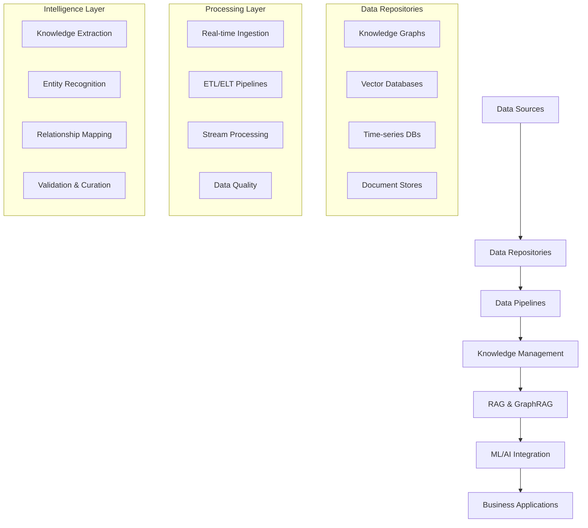

# AIMatrix Data & Knowledge Layer

The Data & Knowledge Layer forms the intelligent "brain" of the AIMatrix platform, providing sophisticated data management, knowledge representation, and ML/AI integration capabilities. This layer transforms raw data into actionable intelligence through advanced architectures and cutting-edge technologies.

## Architecture Overview

The Data & Knowledge Layer consists of five interconnected components:

## Key Components

### 🗂️ [Data Repositories](./data-repositories/)
Advanced storage systems optimized for different data types and access patterns:
- **Knowledge Graphs** - Neo4j, Amazon Neptune for complex relationships
- **Vector Databases** - Pinecone, Weaviate, Chroma, Qdrant for semantic search
- **Time-series Databases** - For metrics, monitoring, and temporal data
- **Document Stores & Data Lakes** - Scalable unstructured data storage

### 🔄 [Data Pipelines](./data-pipelines/)
Robust data processing infrastructure for real-time and batch operations:
- **Real-time Ingestion** - Multi-source data streaming and processing
- **ETL/ELT Processes** - Apache Airflow orchestrated workflows
- **Stream Processing** - Kafka, Pulsar for high-throughput data streams
- **Data Quality & Validation** - Automated quality assurance and governance

### 🧠 [RAG & GraphRAG](./rag-graphrag/)
Advanced retrieval-augmented generation systems:
- **Hybrid Search** - Combining semantic and keyword search strategies
- **Context Optimization** - Intelligent context window management
- **Multi-hop Reasoning** - Complex query resolution across knowledge graphs
- **Adaptive RAG** - Self-improving retrieval based on usage patterns

### 📚 [Knowledge Management](./knowledge-management/)
Automated knowledge extraction and curation:
- **Entity Recognition & Linking** - Advanced NLP for information extraction
- **Relationship Mapping** - Dynamic knowledge graph construction
- **Knowledge Validation** - Automated fact verification and curation
- **Temporal Knowledge Graphs** - Time-aware knowledge representation

### 🤖 [ML/AI Integration](./ml-ai-integration/)
Seamless integration with machine learning workflows:
- **Fine-tuning Pipelines** - Automated model adaptation
- **Model Registry & Versioning** - MLOps best practices
- **Experiment Tracking** - MLflow, Weights & Biases integration
- **Feature Stores** - Centralized feature management

## Core Principles

### Scalability & Performance
- **Distributed Architecture** - Horizontally scalable components
- **Caching Strategies** - Multi-level caching for optimal performance
- **Load Balancing** - Intelligent request distribution
- **Asynchronous Processing** - Non-blocking operations for high throughput

### Security & Privacy
- **Data Encryption** - At-rest and in-transit protection
- **Access Control** - Fine-grained permissions and authentication
- **Privacy-Preserving ML** - Federated learning and differential privacy
- **Audit Trails** - Comprehensive logging and monitoring

### Reliability & Consistency
- **Data Lineage** - Complete traceability of data transformations
- **ACID Compliance** - Transactional consistency where needed
- **Backup & Recovery** - Automated disaster recovery procedures
- **Health Monitoring** - Proactive system health assessment

## Integration Points

### Business Systems
- **ERP Integration** - SAP, Oracle, Microsoft Dynamics connectivity
- **CRM Systems** - Salesforce, HubSpot data synchronization
- **Analytics Platforms** - Tableau, Power BI, Looker integration
- **Custom APIs** - RESTful and GraphQL interfaces

### AI/ML Platforms
- **AutoML Platforms** - H2O.ai, DataRobot integration
- **Deep Learning Frameworks** - TensorFlow, PyTorch compatibility
- **MLOps Tools** - Kubeflow, MLflow, DVC support
- **Model Serving** - TensorFlow Serving, TorchServe deployment

## Getting Started

1. **[Quick Start Guide](./getting-started/)** - Set up your first data pipeline
2. **[Architecture Patterns](./architecture-patterns/)** - Learn common implementation patterns
3. **[Best Practices](./best-practices/)** - Follow proven methodologies
4. **[Performance Optimization](./performance-optimization/)** - Maximize system efficiency

## Use Cases

### Enterprise Knowledge Management
Transform organizational knowledge into a searchable, intelligent knowledge graph that powers decision-making across all business functions.

### Real-time Analytics
Process streaming data in real-time to provide instant insights and automated responses to changing business conditions.

### Intelligent Document Processing
Automatically extract, classify, and link information from documents to build comprehensive knowledge repositories.

### Predictive Maintenance
Use time-series data and ML models to predict equipment failures and optimize maintenance schedules.

### Customer Intelligence
Create comprehensive customer profiles by integrating data from multiple touchpoints and generating actionable insights.

---

The Data & Knowledge Layer is designed to evolve with your organization's needs, providing a solid foundation for current requirements while remaining flexible enough to adapt to future innovations in AI and data science.