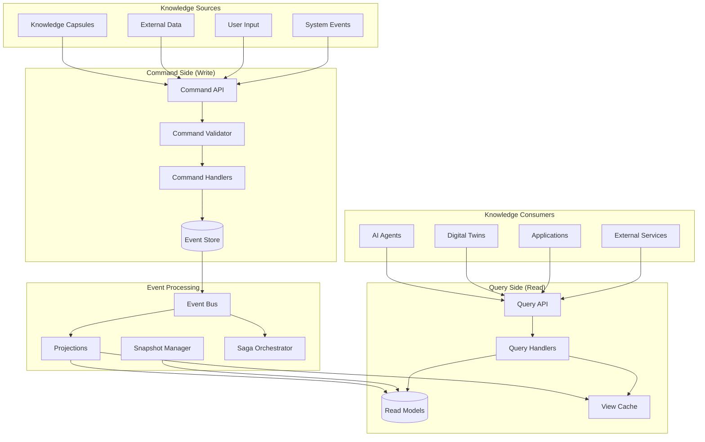

# CQRS Knowledge Distribution Architecture

The AIMatrix CQRS Knowledge Distribution Architecture implements Command Query Responsibility Segregation with Event Sourcing to manage knowledge distribution across agents and digital twins. This architecture separates write operations (commands) from read operations (queries), enabling optimized knowledge access patterns, real-time synchronization, and scalable offline/online operations across the ARE and TRE runtime environments.

## Architecture Overview



## Command Side Architecture

### Knowledge Command Processing

```kotlin
// Knowledge Command API
interface KnowledgeCommand {
    val commandId: String
    val aggregateId: String
    val timestamp: Instant
    val userId: String?
    val correlationId: String?
}

// Command Types
sealed class KnowledgeCommands : KnowledgeCommand {
    
    data class CreateKnowledgeCapsule(
        override val commandId: String = UUID.randomUUID().toString(),
        override val aggregateId: String,
        override val timestamp: Instant = Instant.now(),
        override val userId: String?,
        override val correlationId: String?,
        val capsuleData: KnowledgeCapsuleData,
        val metadata: CapsuleMetadata
    ) : KnowledgeCommands()
    
    data class UpdateKnowledgeCapsule(
        override val commandId: String = UUID.randomUUID().toString(),
        override val aggregateId: String,
        override val timestamp: Instant = Instant.now(),
        override val userId: String?,
        override val correlationId: String?,
        val updates: List<KnowledgeUpdate>,
        val version: Long
    ) : KnowledgeCommands()
    
    data class DistributeKnowledge(
        override val commandId: String = UUID.randomUUID().toString(),
        override val aggregateId: String,
        override val timestamp: Instant = Instant.now(),
        override val userId: String?,
        override val correlationId: String?,
        val targetNodes: List<String>,
        val distributionPolicy: DistributionPolicy
    ) : KnowledgeCommands()
    
    data class SynchronizeKnowledge(
        override val commandId: String = UUID.randomUUID().toString(),
        override val aggregateId: String,
        override val timestamp: Instant = Instant.now(),
        override val userId: String?,
        override val correlationId: String?,
        val sourceNode: String,
        val syncStrategy: SyncStrategy
    ) : KnowledgeCommands()
}

// Command Handler
class KnowledgeCommandHandler(
    private val eventStore: EventStore,
    private val knowledgeRepository: KnowledgeAggregateRepository,
    private val validator: CommandValidator
) {
    
    suspend fun handle(command: KnowledgeCommands): CommandResult {
        // Validate command
        val validation = validator.validate(command)
        if (!validation.isValid) {
            return CommandResult.ValidationFailed(validation.errors)
        }
        
        return when (command) {
            is KnowledgeCommands.CreateKnowledgeCapsule -> handleCreateCapsule(command)
            is KnowledgeCommands.UpdateKnowledgeCapsule -> handleUpdateCapsule(command)
            is KnowledgeCommands.DistributeKnowledge -> handleDistributeKnowledge(command)
            is KnowledgeCommands.SynchronizeKnowledge -> handleSynchronizeKnowledge(command)
        }
    }
    
    private suspend fun handleCreateCapsule(
        command: KnowledgeCommands.CreateKnowledgeCapsule
    ): CommandResult {
        
        try {
            // Load or create aggregate
            val aggregate = knowledgeRepository.getById(command.aggregateId)
                ?: KnowledgeAggregate.create(command.aggregateId)
            
            // Execute business logic
            val events = aggregate.createKnowledgeCapsule(
                capsuleData = command.capsuleData,
                metadata = command.metadata,
                userId = command.userId ?: "system"
            )
            
            // Persist events
            eventStore.appendEvents(
                aggregateId = command.aggregateId,
                events = events,
                expectedVersion = aggregate.version
            )
            
            // Update repository
            knowledgeRepository.save(aggregate)
            
            return CommandResult.Success(
                aggregateId = command.aggregateId,
                events = events,
                newVersion = aggregate.version + events.size
            )
            
        } catch (e: ConcurrencyException) {
            return CommandResult.ConcurrencyConflict(e.message)
        } catch (e: BusinessRuleException) {
            return CommandResult.BusinessRuleViolation(e.message)
        } catch (e: Exception) {
            return CommandResult.SystemError(e.message)
        }
    }
    
    private suspend fun handleDistributeKnowledge(
        command: KnowledgeCommands.DistributeKnowledge
    ): CommandResult {
        
        val aggregate = knowledgeRepository.getById(command.aggregateId)
            ?: return CommandResult.AggregateNotFound(command.aggregateId)
        
        // Check distribution policy
        val distributionPlan = aggregate.planDistribution(
            targetNodes = command.targetNodes,
            policy = command.distributionPolicy
        )
        
        if (!distributionPlan.isValid) {
            return CommandResult.BusinessRuleViolation(
                "Distribution not allowed: ${distributionPlan.reason}"
            )
        }
        
        // Execute distribution
        val events = aggregate.distributeKnowledge(
            targets = command.targetNodes,
            policy = command.distributionPolicy,
            userId = command.userId ?: "system"
        )
        
        eventStore.appendEvents(
            aggregateId = command.aggregateId,
            events = events,
            expectedVersion = aggregate.version
        )
        
        knowledgeRepository.save(aggregate)
        
        return CommandResult.Success(
            aggregateId = command.aggregateId,
            events = events,
            newVersion = aggregate.version + events.size
        )
    }
}

// Knowledge Aggregate
class KnowledgeAggregate private constructor(
    val id: String,
    private val events: MutableList<KnowledgeEvent> = mutableListOf()
) {
    
    var version: Long = 0
        private set
    
    private var state = KnowledgeAggregateState()
    
    companion object {
        fun create(id: String): KnowledgeAggregate {
            return KnowledgeAggregate(id)
        }
        
        fun fromHistory(id: String, history: List<KnowledgeEvent>): KnowledgeAggregate {
            val aggregate = KnowledgeAggregate(id)
            history.forEach { event ->
                aggregate.apply(event)
                aggregate.version = event.version
            }
            return aggregate
        }
    }
    
    fun createKnowledgeCapsule(
        capsuleData: KnowledgeCapsuleData,
        metadata: CapsuleMetadata,
        userId: String
    ): List<KnowledgeEvent> {
        
        // Business rule validation
        if (state.capsules.containsKey(capsuleData.id)) {
            throw BusinessRuleException("Capsule ${capsuleData.id} already exists")
        }
        
        // Create events
        val events = listOf(
            KnowledgeEvent.KnowledgeCapsuleCreated(
                aggregateId = id,
                version = version + 1,
                timestamp = Instant.now(),
                userId = userId,
                capsuleId = capsuleData.id,
                capsuleData = capsuleData,
                metadata = metadata
            )
        )
        
        // Apply events to validate business logic
        events.forEach { apply(it) }
        
        return events
    }
    
    fun distributeKnowledge(
        targets: List<String>,
        policy: DistributionPolicy,
        userId: String
    ): List<KnowledgeEvent> {
        
        // Validate distribution targets
        val validTargets = targets.filter { target ->
            policy.isTargetAllowed(target, state.securityContext)
        }
        
        if (validTargets.isEmpty()) {
            throw BusinessRuleException("No valid distribution targets")
        }
        
        // Create distribution events
        val events = mutableListOf<KnowledgeEvent>()
        
        // Main distribution event
        events.add(
            KnowledgeEvent.KnowledgeDistributionInitiated(
                aggregateId = id,
                version = version + events.size + 1,
                timestamp = Instant.now(),
                userId = userId,
                targets = validTargets,
                policy = policy,
                distributionId = UUID.randomUUID().toString()
            )
        )
        
        // Individual target events
        validTargets.forEach { target ->
            events.add(
                KnowledgeEvent.KnowledgeDistributedToTarget(
                    aggregateId = id,
                    version = version + events.size + 1,
                    timestamp = Instant.now(),
                    userId = userId,
                    targetNode = target,
                    knowledgeItems = selectKnowledgeForTarget(target, policy),
                    distributionId = events.first().let { 
                        (it as KnowledgeEvent.KnowledgeDistributionInitiated).distributionId 
                    }
                )
            )
        }
        
        // Apply events
        events.forEach { apply(it) }
        
        return events
    }
    
    private fun apply(event: KnowledgeEvent) {
        when (event) {
            is KnowledgeEvent.KnowledgeCapsuleCreated -> {
                state = state.copy(
                    capsules = state.capsules + (event.capsuleId to KnowledgeCapsuleState(
                        id = event.capsuleId,
                        data = event.capsuleData,
                        metadata = event.metadata,
                        createdAt = event.timestamp,
                        version = 1
                    ))
                )
            }
            
            is KnowledgeEvent.KnowledgeDistributionInitiated -> {
                state = state.copy(
                    activeDistributions = state.activeDistributions + (event.distributionId to DistributionState(
                        id = event.distributionId,
                        targets = event.targets,
                        policy = event.policy,
                        status = DistributionStatus.IN_PROGRESS,
                        initiatedAt = event.timestamp
                    ))
                )
            }
            
            is KnowledgeEvent.KnowledgeDistributedToTarget -> {
                val distributionState = state.activeDistributions[event.distributionId]
                if (distributionState != null) {
                    val updatedState = distributionState.copy(
                        completedTargets = distributionState.completedTargets + event.targetNode
                    )
                    state = state.copy(
                        activeDistributions = state.activeDistributions + (event.distributionId to updatedState)
                    )
                }
            }
        }
        
        version = event.version
    }
}
```

### Event Store Implementation

```kotlin
// Event Store Interface
interface EventStore {
    suspend fun appendEvents(
        aggregateId: String,
        events: List<KnowledgeEvent>,
        expectedVersion: Long
    ): EventStoreResult
    
    suspend fun getEvents(
        aggregateId: String,
        fromVersion: Long = 0
    ): List<KnowledgeEvent>
    
    suspend fun getAllEvents(
        fromTimestamp: Instant? = null,
        maxCount: Int = 1000
    ): List<KnowledgeEvent>
    
    suspend fun getEventsByType(
        eventType: String,
        fromTimestamp: Instant? = null,
        maxCount: Int = 1000
    ): List<KnowledgeEvent>
}

// Redis Streams Event Store Implementation
class RedisStreamsEventStore(
    private val redisClient: RedisClient,
    private val serializer: EventSerializer
) : EventStore {
    
    private val streamKeyPrefix = "knowledge-events"
    private val aggregateStreamPrefix = "knowledge-aggregate"
    
    override suspend fun appendEvents(
        aggregateId: String,
        events: List<KnowledgeEvent>,
        expectedVersion: Long
    ): EventStoreResult {
        
        val aggregateStreamKey = "$aggregateStreamPrefix:$aggregateId"
        
        return redisClient.transaction { transaction ->
            try {
                // Check current version for optimistic concurrency
                val currentVersion = getCurrentVersion(transaction, aggregateStreamKey)
                if (currentVersion != expectedVersion) {
                    throw ConcurrencyException("Expected version $expectedVersion, but current is $currentVersion")
                }
                
                // Append events to aggregate stream
                val eventIds = events.map { event ->
                    val eventData = mapOf(
                        "eventType" to event::class.simpleName!!,
                        "aggregateId" to event.aggregateId,
                        "version" to event.version.toString(),
                        "timestamp" to event.timestamp.toString(),
                        "userId" to (event.userId ?: ""),
                        "data" to serializer.serialize(event)
                    )
                    
                    transaction.xAdd(aggregateStreamKey, eventData)
                }
                
                // Also append to global event stream for projections
                events.forEach { event ->
                    val globalEventData = mapOf(
                        "eventType" to event::class.simpleName!!,
                        "aggregateId" to event.aggregateId,
                        "version" to event.version.toString(),
                        "timestamp" to event.timestamp.toString(),
                        "data" to serializer.serialize(event)
                    )
                    
                    transaction.xAdd(streamKeyPrefix, globalEventData)
                }
                
                EventStoreResult.Success(eventIds)
                
            } catch (e: ConcurrencyException) {
                EventStoreResult.ConcurrencyConflict(e.message)
            } catch (e: Exception) {
                EventStoreResult.Error(e.message)
            }
        }
    }
    
    override suspend fun getEvents(
        aggregateId: String,
        fromVersion: Long
    ): List<KnowledgeEvent> {
        
        val aggregateStreamKey = "$aggregateStreamPrefix:$aggregateId"
        
        val streamEntries = redisClient.xRange(
            key = aggregateStreamKey,
            start = if (fromVersion > 0) "$fromVersion" else "-",
            end = "+",
            count = 1000
        )
        
        return streamEntries
            .filter { entry ->
                val version = entry.fields["version"]?.toLongOrNull() ?: 0
                version >= fromVersion
            }
            .map { entry ->
                serializer.deserialize(
                    eventType = entry.fields["eventType"]!!,
                    data = entry.fields["data"]!!
                )
            }
            .sortedBy { it.version }
    }
    
    override suspend fun getAllEvents(
        fromTimestamp: Instant?,
        maxCount: Int
    ): List<KnowledgeEvent> {
        
        val startId = fromTimestamp?.toEpochMilli()?.toString() ?: "-"
        
        val streamEntries = redisClient.xRange(
            key = streamKeyPrefix,
            start = startId,
            end = "+",
            count = maxCount
        )
        
        return streamEntries.map { entry ->
            serializer.deserialize(
                eventType = entry.fields["eventType"]!!,
                data = entry.fields["data"]!!
            )
        }.sortedBy { it.timestamp }
    }
    
    private suspend fun getCurrentVersion(
        transaction: RedisTransaction,
        streamKey: String
    ): Long {
        val lastEntry = transaction.xRevRange(streamKey, "+", "-", 1).firstOrNull()
        return lastEntry?.fields?.get("version")?.toLongOrNull() ?: 0
    }
}

// Event Types
sealed class KnowledgeEvent {
    abstract val aggregateId: String
    abstract val version: Long
    abstract val timestamp: Instant
    abstract val userId: String?
    
    data class KnowledgeCapsuleCreated(
        override val aggregateId: String,
        override val version: Long,
        override val timestamp: Instant,
        override val userId: String?,
        val capsuleId: String,
        val capsuleData: KnowledgeCapsuleData,
        val metadata: CapsuleMetadata
    ) : KnowledgeEvent()
    
    data class KnowledgeCapsuleUpdated(
        override val aggregateId: String,
        override val version: Long,
        override val timestamp: Instant,
        override val userId: String?,
        val capsuleId: String,
        val updates: List<KnowledgeUpdate>,
        val newVersion: Int
    ) : KnowledgeEvent()
    
    data class KnowledgeDistributionInitiated(
        override val aggregateId: String,
        override val version: Long,
        override val timestamp: Instant,
        override val userId: String?,
        val distributionId: String,
        val targets: List<String>,
        val policy: DistributionPolicy
    ) : KnowledgeEvent()
    
    data class KnowledgeDistributedToTarget(
        override val aggregateId: String,
        override val version: Long,
        override val timestamp: Instant,
        override val userId: String?,
        val distributionId: String,
        val targetNode: String,
        val knowledgeItems: List<KnowledgeItem>
    ) : KnowledgeEvent()
    
    data class KnowledgeSynchronized(
        override val aggregateId: String,
        override val version: Long,
        override val timestamp: Instant,
        override val userId: String?,
        val sourceNode: String,
        val targetNode: String,
        val synchronizedItems: List<KnowledgeItem>,
        val syncStrategy: SyncStrategy
    ) : KnowledgeEvent()
}
```

## Query Side Architecture

### Read Model Projections

```kotlin
// Read Model Projector
class KnowledgeReadModelProjector(
    private val eventStore: EventStore,
    private val readModelStore: ReadModelStore,
    private val eventBus: EventBus
) {
    
    suspend fun startProjection() {
        // Subscribe to all knowledge events
        eventBus.subscribe<KnowledgeEvent> { event ->
            when (event) {
                is KnowledgeEvent.KnowledgeCapsuleCreated -> projectCapsuleCreated(event)
                is KnowledgeEvent.KnowledgeCapsuleUpdated -> projectCapsuleUpdated(event)
                is KnowledgeEvent.KnowledgeDistributionInitiated -> projectDistributionInitiated(event)
                is KnowledgeEvent.KnowledgeDistributedToTarget -> projectDistributedToTarget(event)
                is KnowledgeEvent.KnowledgeSynchronized -> projectSynchronized(event)
            }
        }
    }
    
    private suspend fun projectCapsuleCreated(event: KnowledgeEvent.KnowledgeCapsuleCreated) {
        // Project to capsule read model
        val capsuleReadModel = KnowledgeCapsuleReadModel(
            id = event.capsuleId,
            aggregateId = event.aggregateId,
            name = event.capsuleData.name,
            category = event.capsuleData.category,
            tags = event.capsuleData.tags,
            content = event.capsuleData.content,
            metadata = ReadModelMetadata(
                createdAt = event.timestamp,
                createdBy = event.userId,
                version = 1,
                lastUpdated = event.timestamp
            ),
            searchableContent = extractSearchableContent(event.capsuleData),
            embeddings = generateEmbeddings(event.capsuleData.content)
        )
        
        readModelStore.save("knowledge_capsules", capsuleReadModel)
        
        // Project to search index
        val searchDocument = KnowledgeSearchDocument(
            id = event.capsuleId,
            title = event.capsuleData.name,
            content = event.capsuleData.content,
            category = event.capsuleData.category,
            tags = event.capsuleData.tags,
            createdAt = event.timestamp,
            embedding = capsuleReadModel.embeddings
        )
        
        readModelStore.indexForSearch("knowledge_search", searchDocument)
        
        // Project to distribution tracking
        val distributionReadModel = KnowledgeDistributionReadModel(
            knowledgeId = event.capsuleId,
            availableAt = listOf(event.aggregateId),
            distributionHistory = emptyList(),
            accessCount = 0,
            lastAccessed = null
        )
        
        readModelStore.save("knowledge_distribution", distributionReadModel)
    }
    
    private suspend fun projectDistributionInitiated(
        event: KnowledgeEvent.KnowledgeDistributionInitiated
    ) {
        // Update distribution tracking read model
        val distributionTracker = DistributionTrackerReadModel(
            distributionId = event.distributionId,
            sourceAggregate = event.aggregateId,
            targets = event.targets,
            policy = event.policy,
            status = DistributionStatus.IN_PROGRESS,
            initiatedAt = event.timestamp,
            completedTargets = emptyList(),
            failedTargets = emptyList()
        )
        
        readModelStore.save("distribution_tracking", distributionTracker)
        
        // Update node availability projections
        event.targets.forEach { target ->
            updateNodeAvailabilityProjection(target, event.aggregateId, AvailabilityStatus.PENDING)
        }
    }
    
    private suspend fun projectDistributedToTarget(
        event: KnowledgeEvent.KnowledgeDistributedToTarget
    ) {
        // Update distribution tracker
        val tracker = readModelStore.get<DistributionTrackerReadModel>(
            "distribution_tracking", 
            event.distributionId
        )
        
        if (tracker != null) {
            val updatedTracker = tracker.copy(
                completedTargets = tracker.completedTargets + event.targetNode,
                status = if (tracker.completedTargets.size + 1 >= tracker.targets.size) 
                         DistributionStatus.COMPLETED else DistributionStatus.IN_PROGRESS
            )
            
            readModelStore.save("distribution_tracking", updatedTracker)
        }
        
        // Update knowledge availability for target node
        event.knowledgeItems.forEach { knowledgeItem ->
            updateKnowledgeAvailability(knowledgeItem.id, event.targetNode, true)
        }
        
        // Update node knowledge index
        val nodeKnowledgeIndex = NodeKnowledgeIndexReadModel(
            nodeId = event.targetNode,
            availableKnowledge = event.knowledgeItems.map { it.id },
            lastUpdated = event.timestamp,
            totalSize = event.knowledgeItems.sumOf { it.size }
        )
        
        readModelStore.upsert("node_knowledge_index", nodeKnowledgeIndex)
    }
}

// Read Model Definitions
data class KnowledgeCapsuleReadModel(
    val id: String,
    val aggregateId: String,
    val name: String,
    val category: String,
    val tags: List<String>,
    val content: String,
    val metadata: ReadModelMetadata,
    val searchableContent: String,
    val embeddings: FloatArray
)

data class KnowledgeDistributionReadModel(
    val knowledgeId: String,
    val availableAt: List<String>,
    val distributionHistory: List<DistributionHistoryEntry>,
    val accessCount: Long,
    val lastAccessed: Instant?
)

data class DistributionTrackerReadModel(
    val distributionId: String,
    val sourceAggregate: String,
    val targets: List<String>,
    val policy: DistributionPolicy,
    val status: DistributionStatus,
    val initiatedAt: Instant,
    val completedTargets: List<String>,
    val failedTargets: List<String>
)

data class NodeKnowledgeIndexReadModel(
    val nodeId: String,
    val availableKnowledge: List<String>,
    val lastUpdated: Instant,
    val totalSize: Long
)

data class KnowledgeSearchDocument(
    val id: String,
    val title: String,
    val content: String,
    val category: String,
    val tags: List<String>,
    val createdAt: Instant,
    val embedding: FloatArray
)
```

### Query Processing

```kotlin
// Query API
interface KnowledgeQuery {
    val queryId: String
    val requestedBy: String?
    val timestamp: Instant
}

// Query Types
sealed class KnowledgeQueries : KnowledgeQuery {
    
    data class GetKnowledgeCapsule(
        override val queryId: String = UUID.randomUUID().toString(),
        override val requestedBy: String?,
        override val timestamp: Instant = Instant.now(),
        val capsuleId: String
    ) : KnowledgeQueries()
    
    data class SearchKnowledge(
        override val queryId: String = UUID.randomUUID().toString(),
        override val requestedBy: String?,
        override val timestamp: Instant = Instant.now(),
        val searchQuery: String,
        val categories: List<String> = emptyList(),
        val tags: List<String> = emptyList(),
        val maxResults: Int = 10
    ) : KnowledgeQueries()
    
    data class GetAvailableKnowledge(
        override val queryId: String = UUID.randomUUID().toString(),
        override val requestedBy: String?,
        override val timestamp: Instant = Instant.now(),
        val nodeId: String,
        val knowledgeTypes: List<String> = emptyList()
    ) : KnowledgeQueries()
    
    data class GetKnowledgeUpdates(
        override val queryId: String = UUID.randomUUID().toString(),
        override val requestedBy: String?,
        override val timestamp: Instant = Instant.now(),
        val nodeId: String,
        val since: Instant
    ) : KnowledgeQueries()
}

// Query Handler
class KnowledgeQueryHandler(
    private val readModelStore: ReadModelStore,
    private val searchEngine: SearchEngine,
    private val accessController: AccessController
) {
    
    suspend fun handle(query: KnowledgeQueries): QueryResult {
        // Check access permissions
        val accessCheck = accessController.checkAccess(query.requestedBy, query)
        if (!accessCheck.allowed) {
            return QueryResult.AccessDenied(accessCheck.reason)
        }
        
        return when (query) {
            is KnowledgeQueries.GetKnowledgeCapsule -> handleGetCapsule(query)
            is KnowledgeQueries.SearchKnowledge -> handleSearchKnowledge(query)
            is KnowledgeQueries.GetAvailableKnowledge -> handleGetAvailableKnowledge(query)
            is KnowledgeQueries.GetKnowledgeUpdates -> handleGetKnowledgeUpdates(query)
        }
    }
    
    private suspend fun handleGetCapsule(
        query: KnowledgeQueries.GetKnowledgeCapsule
    ): QueryResult {
        
        val capsule = readModelStore.get<KnowledgeCapsuleReadModel>(
            "knowledge_capsules",
            query.capsuleId
        )
        
        return if (capsule != null) {
            // Record access for analytics
            recordKnowledgeAccess(query.capsuleId, query.requestedBy)
            
            QueryResult.Success(
                data = KnowledgeCapsuleResponse(
                    id = capsule.id,
                    name = capsule.name,
                    category = capsule.category,
                    tags = capsule.tags,
                    content = capsule.content,
                    metadata = capsule.metadata
                )
            )
        } else {
            QueryResult.NotFound("Knowledge capsule ${query.capsuleId} not found")
        }
    }
    
    private suspend fun handleSearchKnowledge(
        query: KnowledgeQueries.SearchKnowledge
    ): QueryResult {
        
        val searchRequest = SearchRequest(
            query = query.searchQuery,
            filters = buildSearchFilters(query.categories, query.tags),
            maxResults = query.maxResults,
            requestedBy = query.requestedBy
        )
        
        val searchResults = searchEngine.search(searchRequest)
        
        // Convert search results to response format
        val knowledgeResults = searchResults.results.map { result ->
            KnowledgeSearchResult(
                id = result.id,
                title = result.title,
                snippet = result.snippet,
                category = result.category,
                tags = result.tags,
                relevanceScore = result.score,
                lastUpdated = result.lastUpdated
            )
        }
        
        return QueryResult.Success(
            data = KnowledgeSearchResponse(
                results = knowledgeResults,
                totalResults = searchResults.totalCount,
                searchTime = searchResults.searchTime
            )
        )
    }
    
    private suspend fun handleGetAvailableKnowledge(
        query: KnowledgeQueries.GetAvailableKnowledge
    ): QueryResult {
        
        val nodeIndex = readModelStore.get<NodeKnowledgeIndexReadModel>(
            "node_knowledge_index",
            query.nodeId
        )
        
        if (nodeIndex == null) {
            return QueryResult.Success(
                data = AvailableKnowledgeResponse(
                    nodeId = query.nodeId,
                    availableKnowledge = emptyList(),
                    totalCount = 0,
                    lastUpdated = null
                )
            )
        }
        
        // Filter by requested knowledge types if specified
        val filteredKnowledge = if (query.knowledgeTypes.isNotEmpty()) {
            nodeIndex.availableKnowledge.filter { knowledgeId ->
                val capsule = readModelStore.get<KnowledgeCapsuleReadModel>(
                    "knowledge_capsules",
                    knowledgeId
                )
                capsule != null && query.knowledgeTypes.contains(capsule.category)
            }
        } else {
            nodeIndex.availableKnowledge
        }
        
        // Get detailed information for each knowledge item
        val knowledgeDetails = filteredKnowledge.mapNotNull { knowledgeId ->
            readModelStore.get<KnowledgeCapsuleReadModel>("knowledge_capsules", knowledgeId)
                ?.let { capsule ->
                    AvailableKnowledgeItem(
                        id = capsule.id,
                        name = capsule.name,
                        category = capsule.category,
                        tags = capsule.tags,
                        lastUpdated = capsule.metadata.lastUpdated
                    )
                }
        }
        
        return QueryResult.Success(
            data = AvailableKnowledgeResponse(
                nodeId = query.nodeId,
                availableKnowledge = knowledgeDetails,
                totalCount = knowledgeDetails.size,
                lastUpdated = nodeIndex.lastUpdated
            )
        )
    }
    
    private suspend fun handleGetKnowledgeUpdates(
        query: KnowledgeQueries.GetKnowledgeUpdates
    ): QueryResult {
        
        // Get all knowledge updates since the specified timestamp
        val updates = readModelStore.query<KnowledgeUpdateReadModel>(
            collection = "knowledge_updates",
            filter = mapOf(
                "nodeId" to query.nodeId,
                "timestamp" to mapOf("\$gte" to query.since)
            )
        ).sortedBy { it.timestamp }
        
        return QueryResult.Success(
            data = KnowledgeUpdatesResponse(
                nodeId = query.nodeId,
                since = query.since,
                updates = updates.map { update ->
                    KnowledgeUpdateItem(
                        knowledgeId = update.knowledgeId,
                        updateType = update.updateType,
                        timestamp = update.timestamp,
                        version = update.version,
                        changeDescription = update.changeDescription
                    )
                },
                totalUpdates = updates.size
            )
        )
    }
    
    private suspend fun recordKnowledgeAccess(knowledgeId: String, accessedBy: String?) {
        // Update access statistics
        val distributionModel = readModelStore.get<KnowledgeDistributionReadModel>(
            "knowledge_distribution",
            knowledgeId
        )
        
        if (distributionModel != null) {
            val updatedModel = distributionModel.copy(
                accessCount = distributionModel.accessCount + 1,
                lastAccessed = Instant.now()
            )
            
            readModelStore.save("knowledge_distribution", updatedModel)
        }
        
        // Record access event for analytics
        val accessEvent = KnowledgeAccessEvent(
            knowledgeId = knowledgeId,
            accessedBy = accessedBy,
            accessedAt = Instant.now(),
            accessType = "query"
        )
        
        // Publish for analytics processing
        eventBus.publish(accessEvent)
    }
}
```

## Knowledge Distribution Policies

### Distribution Policy Engine

```kotlin
// Distribution Policy Definition
interface DistributionPolicy {
    val id: String
    val name: String
    val description: String
    
    fun isTargetAllowed(target: String, securityContext: SecurityContext): Boolean
    fun selectKnowledgeForTarget(
        target: String,
        availableKnowledge: List<KnowledgeItem>,
        securityContext: SecurityContext
    ): List<KnowledgeItem>
    
    fun calculatePriority(
        knowledgeItem: KnowledgeItem,
        target: String,
        context: DistributionContext
    ): Int
}

// Concrete Distribution Policies
class RoleBasedDistributionPolicy(
    override val id: String = "role_based",
    override val name: String = "Role-Based Distribution",
    override val description: String = "Distribute knowledge based on agent/node roles",
    private val roleMapping: Map<String, List<String>>
) : DistributionPolicy {
    
    override fun isTargetAllowed(target: String, securityContext: SecurityContext): Boolean {
        val targetRoles = roleMapping[target] ?: return false
        return targetRoles.any { role ->
            securityContext.allowedRoles.contains(role)
        }
    }
    
    override fun selectKnowledgeForTarget(
        target: String,
        availableKnowledge: List<KnowledgeItem>,
        securityContext: SecurityContext
    ): List<KnowledgeItem> {
        
        val targetRoles = roleMapping[target] ?: emptyList()
        
        return availableKnowledge.filter { knowledge ->
            // Check if knowledge is relevant for target's roles
            knowledge.relevantRoles.any { role -> targetRoles.contains(role) }
        }.sortedByDescending { knowledge ->
            // Prioritize by role match count
            knowledge.relevantRoles.count { role -> targetRoles.contains(role) }
        }
    }
    
    override fun calculatePriority(
        knowledgeItem: KnowledgeItem,
        target: String,
        context: DistributionContext
    ): Int {
        val targetRoles = roleMapping[target] ?: emptyList()
        val matchingRoles = knowledgeItem.relevantRoles.count { role -> 
            targetRoles.contains(role) 
        }
        
        return matchingRoles * 100 + knowledgeItem.priority
    }
}

class GeographyBasedDistributionPolicy(
    override val id: String = "geography_based",
    override val name: String = "Geography-Based Distribution", 
    override val description: String = "Distribute knowledge based on geographical proximity",
    private val regionMapping: Map<String, GeographicRegion>
) : DistributionPolicy {
    
    override fun isTargetAllowed(target: String, securityContext: SecurityContext): Boolean {
        val targetRegion = regionMapping[target]
        return targetRegion != null && 
               securityContext.allowedRegions.contains(targetRegion.id)
    }
    
    override fun selectKnowledgeForTarget(
        target: String,
        availableKnowledge: List<KnowledgeItem>,
        securityContext: SecurityContext
    ): List<KnowledgeItem> {
        
        val targetRegion = regionMapping[target] ?: return emptyList()
        
        return availableKnowledge.filter { knowledge ->
            // Include knowledge relevant to target's region
            knowledge.applicableRegions.contains(targetRegion.id) ||
            knowledge.applicableRegions.isEmpty() // Global knowledge
        }.sortedByDescending { knowledge ->
            calculateGeographyPriority(knowledge, targetRegion)
        }
    }
    
    override fun calculatePriority(
        knowledgeItem: KnowledgeItem,
        target: String,
        context: DistributionContext
    ): Int {
        val targetRegion = regionMapping[target] ?: return 0
        return calculateGeographyPriority(knowledgeItem, targetRegion)
    }
    
    private fun calculateGeographyPriority(
        knowledge: KnowledgeItem,
        targetRegion: GeographicRegion
    ): Int {
        return when {
            knowledge.applicableRegions.contains(targetRegion.id) -> 100
            knowledge.applicableRegions.isEmpty() -> 50 // Global knowledge
            else -> 0
        }
    }
}

class LoadBasedDistributionPolicy(
    override val id: String = "load_based",
    override val name: String = "Load-Based Distribution",
    override val description: String = "Distribute knowledge based on node capacity and load",
    private val capacityThresholds: Map<String, Double>
) : DistributionPolicy {
    
    override fun isTargetAllowed(target: String, securityContext: SecurityContext): Boolean {
        val targetLoad = getCurrentNodeLoad(target)
        val threshold = capacityThresholds[target] ?: 0.8
        
        return targetLoad < threshold
    }
    
    override fun selectKnowledgeForTarget(
        target: String,
        availableKnowledge: List<KnowledgeItem>,
        securityContext: SecurityContext
    ): List<KnowledgeItem> {
        
        val targetCapacity = getAvailableCapacity(target)
        var selectedKnowledge = mutableListOf<KnowledgeItem>()
        var totalSize = 0L
        
        // Sort by priority and select until capacity is reached
        availableKnowledge.sortedByDescending { it.priority }.forEach { knowledge ->
            if (totalSize + knowledge.size <= targetCapacity) {
                selectedKnowledge.add(knowledge)
                totalSize += knowledge.size
            }
        }
        
        return selectedKnowledge
    }
    
    override fun calculatePriority(
        knowledgeItem: KnowledgeItem,
        target: String,
        context: DistributionContext
    ): Int {
        val sizeScore = when {
            knowledgeItem.size < 1024 * 1024 -> 100 // Small files get high priority
            knowledgeItem.size < 10 * 1024 * 1024 -> 75 // Medium files
            else -> 25 // Large files get lower priority
        }
        
        return knowledgeItem.priority + sizeScore
    }
    
    private fun getCurrentNodeLoad(nodeId: String): Double {
        // Implementation would check actual node load
        return 0.5 // Placeholder
    }
    
    private fun getAvailableCapacity(nodeId: String): Long {
        // Implementation would check available storage/memory
        return 100 * 1024 * 1024 // 100MB placeholder
    }
}
```

## Offline/Online Synchronization

### Sync Strategy Implementation

```kotlin
// Synchronization Strategy Interface
interface SyncStrategy {
    val name: String
    val description: String
    
    suspend fun synchronize(
        sourceNode: String,
        targetNode: String,
        context: SyncContext
    ): SyncResult
    
    fun canHandleOfflineSync(): Boolean
    fun getRequiredBandwidth(): Long
    fun getEstimatedSyncTime(knowledgeSize: Long): Duration
}

// Incremental Sync Strategy
class IncrementalSyncStrategy : SyncStrategy {
    
    override val name = "Incremental Sync"
    override val description = "Synchronize only changed knowledge items"
    
    override suspend fun synchronize(
        sourceNode: String,
        targetNode: String,
        context: SyncContext
    ): SyncResult {
        
        // Get last sync timestamp for target
        val lastSyncTime = getLastSyncTime(sourceNode, targetNode)
        
        // Find knowledge items updated since last sync
        val updatedKnowledge = getUpdatedKnowledgeSince(sourceNode, lastSyncTime)
        
        if (updatedKnowledge.isEmpty()) {
            return SyncResult.Success(
                syncedItems = emptyList(),
                totalSize = 0,
                syncTime = Duration.ZERO,
                strategy = name
            )
        }
        
        val startTime = Instant.now()
        val syncedItems = mutableListOf<SyncedItem>()
        var totalSize = 0L
        
        try {
            // Transfer updated knowledge
            updatedKnowledge.forEach { knowledgeItem ->
                val transferred = transferKnowledgeItem(
                    item = knowledgeItem,
                    from = sourceNode,
                    to = targetNode,
                    context = context
                )
                
                if (transferred.success) {
                    syncedItems.add(
                        SyncedItem(
                            knowledgeId = knowledgeItem.id,
                            operation = if (transferred.isNew) "create" else "update",
                            size = knowledgeItem.size,
                            version = knowledgeItem.version
                        )
                    )
                    totalSize += knowledgeItem.size
                }
            }
            
            // Update last sync timestamp
            updateLastSyncTime(sourceNode, targetNode, startTime)
            
            return SyncResult.Success(
                syncedItems = syncedItems,
                totalSize = totalSize,
                syncTime = Duration.between(startTime, Instant.now()),
                strategy = name
            )
            
        } catch (e: Exception) {
            return SyncResult.Failed(
                reason = "Incremental sync failed: ${e.message}",
                partialResults = syncedItems
            )
        }
    }
    
    override fun canHandleOfflineSync(): Boolean = true
    
    override fun getRequiredBandwidth(): Long = 1024 * 1024 // 1MB baseline
    
    override fun getEstimatedSyncTime(knowledgeSize: Long): Duration {
        val transferRate = 10 * 1024 * 1024 // 10MB/s
        return Duration.ofSeconds(knowledgeSize / transferRate)
    }
}

// Conflict Resolution Sync Strategy
class ConflictResolutionSyncStrategy(
    private val conflictResolver: ConflictResolver
) : SyncStrategy {
    
    override val name = "Conflict Resolution Sync"
    override val description = "Handle conflicts when multiple nodes have updates"
    
    override suspend fun synchronize(
        sourceNode: String,
        targetNode: String,
        context: SyncContext
    ): SyncResult {
        
        val sourceKnowledge = getKnowledgeState(sourceNode)
        val targetKnowledge = getKnowledgeState(targetNode)
        
        // Detect conflicts
        val conflicts = detectConflicts(sourceKnowledge, targetKnowledge)
        
        if (conflicts.isEmpty()) {
            // No conflicts, proceed with normal sync
            return performNormalSync(sourceNode, targetNode, context)
        }
        
        val startTime = Instant.now()
        val syncedItems = mutableListOf<SyncedItem>()
        var totalSize = 0L
        
        try {
            // Resolve each conflict
            conflicts.forEach { conflict ->
                val resolution = conflictResolver.resolve(conflict, context)
                
                when (resolution.decision) {
                    ConflictResolution.USE_SOURCE -> {
                        val transferred = transferKnowledgeItem(
                            item = conflict.sourceVersion,
                            from = sourceNode,
                            to = targetNode,
                            context = context
                        )
                        
                        if (transferred.success) {
                            syncedItems.add(createSyncedItem(conflict.sourceVersion, "update"))
                            totalSize += conflict.sourceVersion.size
                        }
                    }
                    
                    ConflictResolution.USE_TARGET -> {
                        // Keep target version, no transfer needed
                        syncedItems.add(createSyncedItem(conflict.targetVersion, "keep"))
                    }
                    
                    ConflictResolution.MERGE -> {
                        val mergedVersion = mergeKnowledgeVersions(
                            conflict.sourceVersion,
                            conflict.targetVersion,
                            resolution.mergeStrategy
                        )
                        
                        val transferred = transferKnowledgeItem(
                            item = mergedVersion,
                            from = sourceNode,
                            to = targetNode,
                            context = context
                        )
                        
                        if (transferred.success) {
                            syncedItems.add(createSyncedItem(mergedVersion, "merge"))
                            totalSize += mergedVersion.size
                        }
                    }
                    
                    ConflictResolution.CREATE_BRANCH -> {
                        // Create versioned copies of both
                        val sourceVariant = createVersionedCopy(conflict.sourceVersion, "source")
                        val targetVariant = createVersionedCopy(conflict.targetVersion, "target")
                        
                        // Transfer source variant
                        val transferred = transferKnowledgeItem(
                            item = sourceVariant,
                            from = sourceNode,
                            to = targetNode,
                            context = context
                        )
                        
                        if (transferred.success) {
                            syncedItems.add(createSyncedItem(sourceVariant, "branch"))
                            totalSize += sourceVariant.size
                        }
                    }
                }
            }
            
            return SyncResult.Success(
                syncedItems = syncedItems,
                totalSize = totalSize,
                syncTime = Duration.between(startTime, Instant.now()),
                strategy = name,
                conflictsResolved = conflicts.size
            )
            
        } catch (e: Exception) {
            return SyncResult.Failed(
                reason = "Conflict resolution sync failed: ${e.message}",
                partialResults = syncedItems
            )
        }
    }
    
    override fun canHandleOfflineSync(): Boolean = true
    
    override fun getRequiredBandwidth(): Long = 5 * 1024 * 1024 // Higher bandwidth for conflict resolution
    
    override fun getEstimatedSyncTime(knowledgeSize: Long): Duration {
        val transferRate = 8 * 1024 * 1024 // Slightly slower due to conflict processing
        val conflictResolutionOverhead = Duration.ofSeconds(10)
        return Duration.ofSeconds(knowledgeSize / transferRate).plus(conflictResolutionOverhead)
    }
}

// Offline Synchronization Manager
class OfflineSyncManager(
    private val syncStrategies: Map<String, SyncStrategy>,
    private val networkMonitor: NetworkMonitor,
    private val syncQueue: SyncQueue
) {
    
    suspend fun handleOfflineSync(nodeId: String) {
        // Monitor network connectivity
        networkMonitor.onConnectivityChanged { isOnline ->
            if (isOnline) {
                processOfflineSyncQueue(nodeId)
            }
        }
        
        // Process any pending sync requests
        if (networkMonitor.isOnline()) {
            processOfflineSyncQueue(nodeId)
        }
    }
    
    private suspend fun processOfflineSyncQueue(nodeId: String) {
        val pendingSyncs = syncQueue.getPendingSyncs(nodeId)
        
        pendingSyncs.forEach { syncRequest ->
            try {
                val strategy = syncStrategies[syncRequest.strategyName] 
                    ?: syncStrategies["incremental"]!!
                
                val result = strategy.synchronize(
                    sourceNode = syncRequest.sourceNode,
                    targetNode = syncRequest.targetNode,
                    context = syncRequest.context
                )
                
                when (result) {
                    is SyncResult.Success -> {
                        syncQueue.markCompleted(syncRequest.id)
                        logSyncSuccess(syncRequest, result)
                    }
                    
                    is SyncResult.Failed -> {
                        syncQueue.markFailed(syncRequest.id, result.reason)
                        logSyncFailure(syncRequest, result)
                        
                        // Retry with different strategy if appropriate
                        scheduleRetrySync(syncRequest, result)
                    }
                }
                
            } catch (e: Exception) {
                syncQueue.markFailed(syncRequest.id, "Sync processing error: ${e.message}")
                logSyncError(syncRequest, e)
            }
        }
    }
}
```

## Integration with Runtime Environments

### ARE Integration

```kotlin
// Agent Knowledge Client for ARE
class AgentKnowledgeClient(
    private val queryHandler: KnowledgeQueryHandler,
    private val commandHandler: KnowledgeCommandHandler,
    private val cacheManager: KnowledgeCacheManager
) {
    
    suspend fun getKnowledge(
        agentId: String,
        knowledgeRequest: KnowledgeRequest
    ): KnowledgeResponse {
        
        // Check local cache first
        val cacheKey = generateCacheKey(agentId, knowledgeRequest)
        val cachedResult = cacheManager.get(cacheKey)
        
        if (cachedResult != null && !cachedResult.isExpired()) {
            return cachedResult.data
        }
        
        // Query distributed knowledge system
        val query = KnowledgeQueries.SearchKnowledge(
            searchQuery = knowledgeRequest.query,
            categories = knowledgeRequest.categories,
            tags = knowledgeRequest.tags,
            maxResults = knowledgeRequest.maxResults,
            requestedBy = agentId
        )
        
        val queryResult = queryHandler.handle(query)
        
        return when (queryResult) {
            is QueryResult.Success -> {
                val response = queryResult.data as KnowledgeSearchResponse
                
                // Cache the result
                cacheManager.put(
                    cacheKey, 
                    CachedKnowledgeResponse(
                        data = response,
                        cachedAt = Instant.now(),
                        ttl = Duration.ofMinutes(30)
                    )
                )
                
                response
            }
            
            is QueryResult.AccessDenied -> {
                throw KnowledgeAccessException("Access denied: ${queryResult.reason}")
            }
            
            is QueryResult.NotFound -> {
                throw KnowledgeNotFoundException("Knowledge not found")
            }
            
            else -> {
                throw KnowledgeSystemException("Query failed: ${queryResult}")
            }
        }
    }
    
    suspend fun subscribeToKnowledgeUpdates(
        agentId: String,
        subscriptionRequest: KnowledgeSubscription
    ): KnowledgeSubscriptionHandle {
        
        // Create subscription for real-time updates
        val subscription = eventBus.subscribe<KnowledgeEvent> { event ->
            if (isRelevantForAgent(event, agentId, subscriptionRequest)) {
                notifyAgentOfKnowledgeUpdate(agentId, event)
            }
        }
        
        return KnowledgeSubscriptionHandle(
            subscriptionId = UUID.randomUUID().toString(),
            agentId = agentId,
            subscription = subscription
        )
    }
    
    suspend fun updateAgentKnowledge(
        agentId: String,
        knowledgeUpdate: AgentKnowledgeUpdate
    ) {
        val command = KnowledgeCommands.UpdateKnowledgeCapsule(
            aggregateId = knowledgeUpdate.knowledgeId,
            updates = knowledgeUpdate.updates,
            version = knowledgeUpdate.version,
            userId = agentId
        )
        
        commandHandler.handle(command)
    }
}
```

### TRE Integration

```kotlin
// Twin Knowledge Synchronizer for TRE
class TwinKnowledgeSynchronizer(
    private val knowledgeClient: TwinKnowledgeClient,
    private val syncStrategy: SyncStrategy,
    private val twinStateManager: TwinStateManager
) {
    
    suspend fun synchronizeTwinKnowledge(
        twinId: String,
        syncRequest: TwinSyncRequest
    ): TwinSyncResult {
        
        // Get current twin knowledge state
        val currentState = twinStateManager.getKnowledgeState(twinId)
        
        // Determine what knowledge needs to be synchronized
        val requiredKnowledge = determineRequiredKnowledge(
            twinId = twinId,
            currentState = currentState,
            syncRequest = syncRequest
        )
        
        if (requiredKnowledge.isEmpty()) {
            return TwinSyncResult.NoUpdatesRequired
        }
        
        // Execute synchronization
        val syncResult = syncStrategy.synchronize(
            sourceNode = syncRequest.sourceNode,
            targetNode = twinId,
            context = SyncContext(
                knowledgeItems = requiredKnowledge,
                priority = syncRequest.priority,
                timeConstraints = syncRequest.timeConstraints
            )
        )
        
        return when (syncResult) {
            is SyncResult.Success -> {
                // Update twin knowledge state
                updateTwinKnowledgeState(twinId, syncResult.syncedItems)
                
                TwinSyncResult.Success(
                    syncedKnowledge = syncResult.syncedItems,
                    syncDuration = syncResult.syncTime
                )
            }
            
            is SyncResult.Failed -> {
                TwinSyncResult.Failed(
                    reason = syncResult.reason,
                    partialSync = syncResult.partialResults?.isNotEmpty() ?: false
                )
            }
        }
    }
    
    suspend fun setupRealTimeKnowledgeSync(
        twinId: String,
        dataSources: List<String>
    ) {
        // Subscribe to relevant knowledge updates
        dataSources.forEach { dataSource ->
            eventBus.subscribe<KnowledgeEvent> { event ->
                if (isRelevantForTwin(event, twinId, dataSource)) {
                    updateTwinWithKnowledgeEvent(twinId, event)
                }
            }
        }
    }
    
    private suspend fun updateTwinWithKnowledgeEvent(
        twinId: String,
        event: KnowledgeEvent
    ) {
        when (event) {
            is KnowledgeEvent.KnowledgeCapsuleUpdated -> {
                // Apply knowledge update to twin simulation
                twinStateManager.applyKnowledgeUpdate(
                    twinId = twinId,
                    knowledgeId = event.capsuleId,
                    updates = event.updates
                )
            }
            
            is KnowledgeEvent.KnowledgeDistributedToTarget -> {
                if (event.targetNode == twinId) {
                    // New knowledge available for twin
                    twinStateManager.addAvailableKnowledge(
                        twinId = twinId,
                        knowledgeItems = event.knowledgeItems
                    )
                }
            }
        }
    }
}
```

## Performance and Scalability

### Distributed Event Store Sharding

```kotlin
// Event Store Sharding Strategy
class ShardedEventStore(
    private val shards: Map<String, EventStore>,
    private val shardingStrategy: ShardingStrategy
) : EventStore {
    
    override suspend fun appendEvents(
        aggregateId: String,
        events: List<KnowledgeEvent>,
        expectedVersion: Long
    ): EventStoreResult {
        
        val shardKey = shardingStrategy.getShardKey(aggregateId)
        val eventStore = shards[shardKey] 
            ?: throw IllegalStateException("No shard found for key: $shardKey")
        
        return eventStore.appendEvents(aggregateId, events, expectedVersion)
    }
    
    override suspend fun getEvents(
        aggregateId: String,
        fromVersion: Long
    ): List<KnowledgeEvent> {
        
        val shardKey = shardingStrategy.getShardKey(aggregateId)
        val eventStore = shards[shardKey] 
            ?: throw IllegalStateException("No shard found for key: $shardKey")
        
        return eventStore.getEvents(aggregateId, fromVersion)
    }
    
    override suspend fun getAllEvents(
        fromTimestamp: Instant?,
        maxCount: Int
    ): List<KnowledgeEvent> {
        
        // Query all shards and merge results
        val allEvents = shards.values.map { shard ->
            async {
                shard.getAllEvents(fromTimestamp, maxCount / shards.size)
            }
        }.awaitAll().flatten()
        
        return allEvents
            .sortedBy { it.timestamp }
            .take(maxCount)
    }
}

// Hash-based Sharding Strategy
class HashBasedShardingStrategy(
    private val shardCount: Int
) : ShardingStrategy {
    
    override fun getShardKey(aggregateId: String): String {
        val hash = aggregateId.hashCode()
        val shardIndex = Math.abs(hash) % shardCount
        return "shard-$shardIndex"
    }
}
```

### Performance Monitoring

```kotlin
// CQRS Performance Metrics
class CQRSPerformanceMonitor(
    private val metricsRegistry: MeterRegistry
) {
    
    private val commandLatency = Timer.builder("cqrs.command.latency")
        .description("Command processing latency")
        .register(metricsRegistry)
    
    private val queryLatency = Timer.builder("cqrs.query.latency")
        .description("Query processing latency")
        .register(metricsRegistry)
    
    private val eventProcessingLatency = Timer.builder("cqrs.event.processing.latency")
        .description("Event processing latency")
        .register(metricsRegistry)
    
    private val knowledgeDistributionCount = Counter.builder("cqrs.knowledge.distribution.count")
        .description("Number of knowledge distributions")
        .register(metricsRegistry)
    
    fun recordCommandLatency(commandType: String, duration: Duration) {
        commandLatency
            .tag("command_type", commandType)
            .record(duration)
    }
    
    fun recordQueryLatency(queryType: String, duration: Duration) {
        queryLatency
            .tag("query_type", queryType)
            .record(duration)
    }
    
    fun recordKnowledgeDistribution(targetCount: Int, totalSize: Long) {
        knowledgeDistributionCount
            .tag("target_count", targetCount.toString())
            .increment()
        
        Gauge.builder("cqrs.knowledge.distribution.size")
            .description("Size of knowledge distribution")
            .register(metricsRegistry)
            .set(totalSize.toDouble())
    }
}
```

---

The CQRS Knowledge Distribution Architecture provides a robust, scalable foundation for knowledge management across the AIMatrix ecosystem, enabling efficient read/write separation, real-time synchronization, and intelligent distribution policies that optimize knowledge availability for both agents and digital twins.