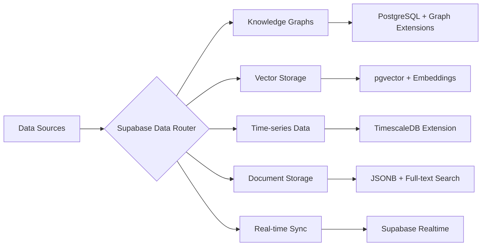

# Data Repositories

The Data Repositories component leverages **Supabase** as the primary data platform, providing PostgreSQL-powered storage systems optimized for different data types, access patterns, and performance requirements. Supabase's native support for vector embeddings via pgvector, real-time subscriptions, and edge deployment makes it the ideal foundation for AIMatrix's data layer.

## Repository Types Overview



## Supabase as Primary Data Platform

### Architecture & Implementation

Supabase provides a comprehensive data platform built on PostgreSQL, offering native support for vectors, JSON documents, time-series data, and real-time subscriptions. This unified approach eliminates the complexity of managing multiple specialized databases.

#### Core Supabase Setup

```typescript
import { createClient } from '@supabase/supabase-js'

// Initialize Supabase client
const supabase = createClient(
  process.env.SUPABASE_URL!,
  process.env.SUPABASE_ANON_KEY!
)

// Enable pgvector extension
const { error } = await supabase.rpc('enable_extensions', {
  extensions: ['vector', 'timescaledb', 'pg_trgm', 'fuzzystrmatch']
})
```

## Knowledge Graphs with PostgreSQL

### Graph Data in PostgreSQL

Supabase's PostgreSQL foundation supports graph-like data structures using recursive CTEs, adjacency lists, and specialized graph extensions.

#### Graph Schema Setup

```sql
-- Create knowledge graph tables in Supabase
CREATE TABLE entities (
  id UUID PRIMARY KEY DEFAULT gen_random_uuid(),
  type TEXT NOT NULL,
  name TEXT NOT NULL,
  properties JSONB DEFAULT '{}',
  embedding VECTOR(1536),
  created_at TIMESTAMPTZ DEFAULT NOW()
);

CREATE TABLE relationships (
  id UUID PRIMARY KEY DEFAULT gen_random_uuid(),
  source_id UUID REFERENCES entities(id),
  target_id UUID REFERENCES entities(id),
  relationship_type TEXT NOT NULL,
  properties JSONB DEFAULT '{}',
  strength FLOAT DEFAULT 1.0,
  created_at TIMESTAMPTZ DEFAULT NOW()
);

-- Create indexes for performance
CREATE INDEX idx_entities_type ON entities(type);
CREATE INDEX idx_entities_embedding ON entities USING ivfflat (embedding vector_cosine_ops);
CREATE INDEX idx_relationships_source ON relationships(source_id);
CREATE INDEX idx_relationships_target ON relationships(target_id);
CREATE INDEX idx_relationships_type ON relationships(relationship_type);

-- Example entity creation
INSERT INTO entities (type, name, properties, embedding) VALUES
('Person', 'John Smith', '{
  "title": "Data Scientist",
  "skills": ["Python", "Machine Learning", "Statistics"],
  "experience_years": 5
}', '[0.1, 0.2, 0.3, ...]'),
('Company', 'TechCorp Inc.', '{
  "industry": "Technology",
  "size": "Enterprise",
  "founded": 2010,
  "employees": 1000
}', '[0.4, 0.5, 0.6, ...]');

-- Create relationships
INSERT INTO relationships (source_id, target_id, relationship_type, properties)
SELECT 
  p.id as source_id,
  c.id as target_id,
  'WORKS_FOR' as relationship_type,
  '{"role": "Senior Data Scientist", "since": "2021-01-01"}' as properties
FROM entities p, entities c 
WHERE p.name = 'John Smith' AND c.name = 'TechCorp Inc.';
```

#### Graph Traversal with PostgreSQL

```sql
-- Supabase function for graph traversal
CREATE OR REPLACE FUNCTION traverse_graph(
  start_entity_id UUID,
  max_depth INTEGER DEFAULT 3,
  relationship_types TEXT[] DEFAULT NULL
)
RETURNS TABLE(
  path_id UUID[],
  path_names TEXT[],
  path_types TEXT[],
  depth INTEGER,
  total_strength FLOAT
) AS $$
WITH RECURSIVE graph_traversal AS (
  -- Base case: start with the initial entity
  SELECT 
    ARRAY[e.id] as path_id,
    ARRAY[e.name] as path_names,
    ARRAY[e.type] as path_types,
    0 as depth,
    1.0 as total_strength
  FROM entities e
  WHERE e.id = start_entity_id
  
  UNION ALL
  
  -- Recursive case: follow relationships
  SELECT 
    gt.path_id || r.target_id as path_id,
    gt.path_names || te.name as path_names,
    gt.path_types || te.type as path_types,
    gt.depth + 1 as depth,
    gt.total_strength * r.strength as total_strength
  FROM graph_traversal gt
  JOIN relationships r ON r.source_id = gt.path_id[array_length(gt.path_id, 1)]
  JOIN entities te ON te.id = r.target_id
  WHERE 
    gt.depth < max_depth
    AND NOT (r.target_id = ANY(gt.path_id)) -- Avoid cycles
    AND (relationship_types IS NULL OR r.relationship_type = ANY(relationship_types))
)
SELECT * FROM graph_traversal;
$$ LANGUAGE SQL;
```

### Semantic Layers & Ontology Management

#### Ontology Definition

```python
from rdflib import Graph, Namespace, RDF, RDFS, OWL
from rdflib.namespace import FOAF, XSD

# Define custom ontology
class AIMatrixOntology:
    def __init__(self):
        self.graph = Graph()
        self.amx = Namespace("http://aimatrix.com/ontology#")
        self.graph.bind("amx", self.amx)
        self.graph.bind("foaf", FOAF)
        
    def define_classes(self):
        # Define entity classes
        self.graph.add((self.amx.Agent, RDF.type, OWL.Class))
        self.graph.add((self.amx.Agent, RDFS.subClassOf, FOAF.Agent))
        
        self.graph.add((self.amx.KnowledgeBase, RDF.type, OWL.Class))
        self.graph.add((self.amx.DataSource, RDF.type, OWL.Class))
        
    def define_properties(self):
        # Object properties
        self.graph.add((self.amx.hasKnowledge, RDF.type, OWL.ObjectProperty))
        self.graph.add((self.amx.hasKnowledge, RDFS.domain, self.amx.Agent))
        self.graph.add((self.amx.hasKnowledge, RDFS.range, self.amx.KnowledgeBase))
        
        # Data properties
        self.graph.add((self.amx.confidence, RDF.type, OWL.DatatypeProperty))
        self.graph.add((self.amx.confidence, RDFS.domain, self.amx.KnowledgeBase))
        self.graph.add((self.amx.confidence, RDFS.range, XSD.float))

# Usage
ontology = AIMatrixOntology()
ontology.define_classes()
ontology.define_properties()
```

### Knowledge Federation

```python
class KnowledgeFederation:
    def __init__(self):
        self.federated_sources = []
        self.schema_mappings = {}
        
    def add_source(self, source_config):
        """Add a knowledge source to federation"""
        self.federated_sources.append({
            'name': source_config['name'],
            'endpoint': source_config['endpoint'],
            'schema': source_config['schema'],
            'weight': source_config.get('weight', 1.0)
        })
        
    def create_schema_mapping(self, source_schema, target_schema):
        """Map between different knowledge schemas"""
        mapping = {
            'entity_mappings': {},
            'property_mappings': {},
            'relationship_mappings': {}
        }
        
        # Example mapping
        mapping['entity_mappings'] = {
            'Person': 'foaf:Person',
            'Organization': 'foaf:Organization'
        }
        
        self.schema_mappings[f"{source_schema}->{target_schema}"] = mapping
        
    def federated_query(self, query):
        """Execute query across federated sources"""
        results = []
        for source in self.federated_sources:
            source_result = self._execute_on_source(source, query)
            mapped_result = self._apply_schema_mapping(source_result, source)
            results.extend(mapped_result)
        
        return self._merge_results(results)
```

## Vector Storage with pgvector

### Unified Vector Storage with Supabase

Supabase's pgvector extension provides enterprise-grade vector storage with PostgreSQL's ACID guarantees, eliminating the need for separate vector databases.

```typescript
import { createClient } from '@supabase/supabase-js'
import OpenAI from 'openai'

interface VectorDocument {
  id?: string
  content: string
  embedding?: number[]
  metadata: Record<string, any>
  collection_name: string
}

class SupabaseVectorStore {
  private supabase
  private openai
  
  constructor(supabaseUrl: string, supabaseKey: string, openaiKey: string) {
    this.supabase = createClient(supabaseUrl, supabaseKey)
    this.openai = new OpenAI({ apiKey: openaiKey })
  }
  
  async setupVectorTables() {
    // Create documents table with vector support
    const { error } = await this.supabase.rpc('create_vector_table', {
      table_sql: `
        CREATE TABLE IF NOT EXISTS vector_documents (
          id UUID PRIMARY KEY DEFAULT gen_random_uuid(),
          content TEXT NOT NULL,
          embedding VECTOR(1536),
          metadata JSONB DEFAULT '{}',
          collection_name TEXT NOT NULL,
          created_at TIMESTAMPTZ DEFAULT NOW(),
          updated_at TIMESTAMPTZ DEFAULT NOW()
        );
        
        -- Create indexes for optimal performance
        CREATE INDEX IF NOT EXISTS idx_vector_documents_embedding 
        ON vector_documents USING ivfflat (embedding vector_cosine_ops);
        
        CREATE INDEX IF NOT EXISTS idx_vector_documents_collection 
        ON vector_documents(collection_name);
        
        CREATE INDEX IF NOT EXISTS idx_vector_documents_metadata 
        ON vector_documents USING GIN (metadata);
      `
    })
    
    if (error) throw error
  }
  
  async storeDocument(doc: VectorDocument): Promise<string> {
    // Generate embedding if not provided
    if (!doc.embedding) {
      const response = await this.openai.embeddings.create({
        model: 'text-embedding-ada-002',
        input: doc.content
      })
      doc.embedding = response.data[0].embedding
    }
    
    const { data, error } = await this.supabase
      .from('vector_documents')
      .insert([
        {
          content: doc.content,
          embedding: doc.embedding,
          metadata: doc.metadata,
          collection_name: doc.collection_name
        }
      ])
      .select('id')
      .single()
    
    if (error) throw error
    return data.id
  }
  
  async similaritySearch(
    query: string,
    options: {
      collectionName?: string
      limit?: number
      threshold?: number
      filter?: Record<string, any>
    } = {}
  ) {
    const { 
      collectionName,
      limit = 10,
      threshold = 0.7,
      filter
    } = options
    
    // Generate query embedding
    const response = await this.openai.embeddings.create({
      model: 'text-embedding-ada-002',
      input: query
    })
    const queryEmbedding = response.data[0].embedding
    
    // Build query with filters
    let rpcQuery = this.supabase.rpc('vector_similarity_search', {
      query_embedding: queryEmbedding,
      match_threshold: threshold,
      match_count: limit
    })
    
    if (collectionName) {
      rpcQuery = rpcQuery.eq('collection_name', collectionName)
    }
    
    if (filter) {
      Object.entries(filter).forEach(([key, value]) => {
        rpcQuery = rpcQuery.contains('metadata', { [key]: value })
      })
    }
    
    const { data, error } = await rpcQuery
    if (error) throw error
    
    return data
  }
}
```

#### Advanced Vector Operations

```sql
-- Create advanced vector search function
CREATE OR REPLACE FUNCTION vector_similarity_search(
  query_embedding VECTOR(1536),
  match_threshold FLOAT DEFAULT 0.78,
  match_count INT DEFAULT 10
)
RETURNS TABLE(
  id UUID,
  content TEXT,
  metadata JSONB,
  collection_name TEXT,
  similarity FLOAT
)
LANGUAGE SQL
AS $$
SELECT
  id,
  content,
  metadata,
  collection_name,
  1 - (embedding <=> query_embedding) AS similarity
FROM vector_documents
WHERE 1 - (embedding <=> query_embedding) > match_threshold
ORDER BY embedding <=> query_embedding
LIMIT match_count;
$$;

-- Hybrid search combining vector and full-text search
CREATE OR REPLACE FUNCTION hybrid_search(
  query_text TEXT,
  query_embedding VECTOR(1536),
  semantic_weight FLOAT DEFAULT 0.7,
  keyword_weight FLOAT DEFAULT 0.3,
  match_count INT DEFAULT 10
)
RETURNS TABLE(
  id UUID,
  content TEXT,
  metadata JSONB,
  collection_name TEXT,
  combined_score FLOAT
)
LANGUAGE SQL
AS $$
SELECT
  id,
  content,
  metadata,
  collection_name,
  (
    semantic_weight * (1 - (embedding <=> query_embedding)) +
    keyword_weight * ts_rank_cd(to_tsvector('english', content), plainto_tsquery('english', query_text))
  ) AS combined_score
FROM vector_documents
WHERE 
  to_tsvector('english', content) @@ plainto_tsquery('english', query_text)
  OR (1 - (embedding <=> query_embedding)) > 0.7
ORDER BY combined_score DESC
LIMIT match_count;
$$;
```

### Real-time Vector Updates

```typescript
// Real-time vector search with Supabase subscriptions
class RealTimeVectorStore extends SupabaseVectorStore {
  private subscriptions: Map<string, any> = new Map()
  
  async subscribeToCollection(
    collectionName: string,
    callback: (payload: any) => void
  ) {
    const subscription = this.supabase
      .channel(`vector_updates_${collectionName}`)
      .on(
        'postgres_changes',
        {
          event: '*',
          schema: 'public',
          table: 'vector_documents',
          filter: `collection_name=eq.${collectionName}`
        },
        callback
      )
      .subscribe()
    
    this.subscriptions.set(collectionName, subscription)
    return subscription
  }
  
  async bulkUpsert(documents: VectorDocument[]): Promise<string[]> {
    // Generate embeddings for documents without them
    const docsWithEmbeddings = await Promise.all(
      documents.map(async (doc) => {
        if (!doc.embedding) {
          const response = await this.openai.embeddings.create({
            model: 'text-embedding-ada-002',
            input: doc.content
          })
          doc.embedding = response.data[0].embedding
        }
        return doc
      })
    )
    
    // Batch insert for performance
    const { data, error } = await this.supabase
      .from('vector_documents')
      .upsert(docsWithEmbeddings.map(doc => ({
        id: doc.id,
        content: doc.content,
        embedding: doc.embedding,
        metadata: doc.metadata,
        collection_name: doc.collection_name
      })))
      .select('id')
    
    if (error) throw error
    return data.map(row => row.id)
  }
  
  async semanticClustering(
    collectionName: string,
    numClusters: number = 5
  ) {
    // Use pgvector for k-means clustering
    const { data, error } = await this.supabase.rpc('vector_kmeans_clustering', {
      collection_name: collectionName,
      k: numClusters
    })
    
    if (error) throw error
    return data
  }
}
```

### Multi-Modal Vector Storage

```sql
-- Create multi-modal vector table
CREATE TABLE multimodal_vectors (
  id UUID PRIMARY KEY DEFAULT gen_random_uuid(),
  content_type TEXT NOT NULL, -- 'text', 'image', 'audio', 'video'
  content_text TEXT,
  content_url TEXT,
  text_embedding VECTOR(1536),
  image_embedding VECTOR(512),
  combined_embedding VECTOR(2048),
  metadata JSONB DEFAULT '{}',
  collection_name TEXT NOT NULL,
  created_at TIMESTAMPTZ DEFAULT NOW()
);

-- Create specialized indexes
CREATE INDEX idx_multimodal_text_embedding 
ON multimodal_vectors USING ivfflat (text_embedding vector_cosine_ops);

CREATE INDEX idx_multimodal_image_embedding 
ON multimodal_vectors USING ivfflat (image_embedding vector_cosine_ops);

CREATE INDEX idx_multimodal_combined_embedding 
ON multimodal_vectors USING ivfflat (combined_embedding vector_cosine_ops);

-- Multi-modal search function
CREATE OR REPLACE FUNCTION multimodal_search(
  query_text_embedding VECTOR(1536) DEFAULT NULL,
  query_image_embedding VECTOR(512) DEFAULT NULL,
  content_types TEXT[] DEFAULT NULL,
  match_count INT DEFAULT 10
)
RETURNS TABLE(
  id UUID,
  content_type TEXT,
  content_text TEXT,
  content_url TEXT,
  metadata JSONB,
  similarity_score FLOAT
)
LANGUAGE SQL
AS $$
SELECT
  id,
  content_type,
  content_text,
  content_url,
  metadata,
  CASE 
    WHEN query_text_embedding IS NOT NULL AND query_image_embedding IS NOT NULL THEN
      -- Combined similarity for multi-modal queries
      (0.6 * (1 - (text_embedding <=> query_text_embedding)) + 
       0.4 * (1 - (image_embedding <=> query_image_embedding)))
    WHEN query_text_embedding IS NOT NULL THEN
      1 - (text_embedding <=> query_text_embedding)
    WHEN query_image_embedding IS NOT NULL THEN
      1 - (image_embedding <=> query_image_embedding)
    ELSE 0
  END AS similarity_score
FROM multimodal_vectors
WHERE 
  (content_types IS NULL OR content_type = ANY(content_types))
  AND (
    (query_text_embedding IS NOT NULL AND text_embedding IS NOT NULL) OR
    (query_image_embedding IS NOT NULL AND image_embedding IS NOT NULL)
  )
ORDER BY similarity_score DESC
LIMIT match_count;
$$;
```

## Time-series Data with TimescaleDB Extension

### Supabase TimescaleDB Integration

Supabase supports the TimescaleDB extension, providing powerful time-series capabilities directly within PostgreSQL.

```typescript
class SupabaseTimeSeriesManager {
  private supabase
  
  constructor(supabaseUrl: string, supabaseKey: string) {
    this.supabase = createClient(supabaseUrl, supabaseKey)
  }
  
  async setupTimeSeriesTables() {
    // Enable TimescaleDB extension
    await this.supabase.rpc('enable_timescaledb')
    
    // Create time-series table
    const { error } = await this.supabase.rpc('create_timeseries_table', {
      table_sql: `
        CREATE TABLE IF NOT EXISTS metrics (
          time TIMESTAMPTZ NOT NULL,
          metric_name TEXT NOT NULL,
          value DOUBLE PRECISION,
          tags JSONB DEFAULT '{}',
          metadata JSONB DEFAULT '{}',
          embedding VECTOR(384) -- For semantic time-series analysis
        );
        
        -- Convert to hypertable
        SELECT create_hypertable('metrics', 'time', if_not_exists => TRUE);
        
        -- Create indexes
        CREATE INDEX IF NOT EXISTS idx_metrics_name_time ON metrics (metric_name, time DESC);
        CREATE INDEX IF NOT EXISTS idx_metrics_tags ON metrics USING GIN (tags);
        CREATE INDEX IF NOT EXISTS idx_metrics_embedding ON metrics USING ivfflat (embedding vector_cosine_ops);
        
        -- Create continuous aggregate for real-time analytics
        CREATE MATERIALIZED VIEW IF NOT EXISTS metrics_hourly
        WITH (timescaledb.continuous) AS
        SELECT 
          metric_name,
          time_bucket('1 hour', time) as hour,
          avg(value) as avg_value,
          max(value) as max_value,
          min(value) as min_value,
          count(*) as count,
          stddev(value) as stddev_value
        FROM metrics
        GROUP BY metric_name, hour
        WITH NO DATA;
        
        -- Add refresh policy
        SELECT add_continuous_aggregate_policy('metrics_hourly',
          start_offset => INTERVAL '2 hours',
          end_offset => INTERVAL '1 minute',
          schedule_interval => INTERVAL '1 minute');
      `
    })
    
    if (error) throw error
  }
  
  async writeMetrics(measurements: Array<{
    metricName: string
    value: number
    tags?: Record<string, any>
    metadata?: Record<string, any>
    timestamp?: Date
    embedding?: number[]
  }>) {
    const data = measurements.map(m => ({
      time: m.timestamp || new Date(),
      metric_name: m.metricName,
      value: m.value,
      tags: m.tags || {},
      metadata: m.metadata || {},
      embedding: m.embedding
    }))
    
    const { error } = await this.supabase
      .from('metrics')
      .insert(data)
    
    if (error) throw error
  }
  
  async queryAggregatedMetrics(
    metricName: string,
    timeRange: { start: Date; end: Date },
    aggregation: 'avg' | 'sum' | 'max' | 'min' | 'count' = 'avg',
    interval: string = '5 minutes'
  ) {
    const { data, error } = await this.supabase.rpc('query_time_series', {
      metric_name: metricName,
      start_time: timeRange.start.toISOString(),
      end_time: timeRange.end.toISOString(),
      time_interval: interval,
      aggregation_func: aggregation
    })
    
    if (error) throw error
    return data
  }
  
  async detectAnomalies(
    metricName: string,
    lookbackHours: number = 24,
    threshold: number = 3.0
  ) {
    const { data, error } = await this.supabase.rpc('detect_metric_anomalies', {
      metric_name: metricName,
      lookback_hours: lookbackHours,
      anomaly_threshold: threshold
    })
    
    if (error) throw error
    return data
  }
}
```

#### Advanced Time-Series Functions

```sql
-- Time-series aggregation function
CREATE OR REPLACE FUNCTION query_time_series(
  metric_name TEXT,
  start_time TIMESTAMPTZ,
  end_time TIMESTAMPTZ,
  time_interval INTERVAL DEFAULT '5 minutes',
  aggregation_func TEXT DEFAULT 'avg'
)
RETURNS TABLE(
  time_bucket TIMESTAMPTZ,
  metric_name TEXT,
  aggregated_value DOUBLE PRECISION,
  count BIGINT
)
LANGUAGE SQL
AS $$
SELECT 
  time_bucket(time_interval, time) as time_bucket,
  metric_name,
  CASE 
    WHEN aggregation_func = 'avg' THEN avg(value)
    WHEN aggregation_func = 'sum' THEN sum(value)
    WHEN aggregation_func = 'max' THEN max(value)
    WHEN aggregation_func = 'min' THEN min(value)
    ELSE avg(value)
  END as aggregated_value,
  count(*) as count
FROM metrics
WHERE 
  metric_name = $1
  AND time BETWEEN start_time AND end_time
GROUP BY time_bucket, metric_name
ORDER BY time_bucket;
$$;

-- Anomaly detection using statistical methods
CREATE OR REPLACE FUNCTION detect_metric_anomalies(
  metric_name TEXT,
  lookback_hours INTEGER DEFAULT 24,
  anomaly_threshold FLOAT DEFAULT 3.0
)
RETURNS TABLE(
  time TIMESTAMPTZ,
  value DOUBLE PRECISION,
  z_score DOUBLE PRECISION,
  is_anomaly BOOLEAN
)
LANGUAGE SQL
AS $$
WITH stats AS (
  SELECT 
    avg(value) as mean_value,
    stddev(value) as std_value
  FROM metrics
  WHERE 
    metric_name = $1
    AND time >= NOW() - (lookback_hours || ' hours')::INTERVAL
),
recent_data AS (
  SELECT 
    m.time,
    m.value,
    (m.value - s.mean_value) / NULLIF(s.std_value, 0) as z_score
  FROM metrics m
  CROSS JOIN stats s
  WHERE 
    m.metric_name = $1
    AND m.time >= NOW() - '1 hour'::INTERVAL
)
SELECT 
  time,
  value,
  z_score,
  abs(z_score) > anomaly_threshold as is_anomaly
FROM recent_data
ORDER BY time DESC;
$$;
```

### Semantic Time-Series Analysis

```typescript
// Combine time-series data with vector embeddings for intelligent analysis
class SemanticTimeSeriesAnalyzer extends SupabaseTimeSeriesManager {
  private openai
  
  constructor(supabaseUrl: string, supabaseKey: string, openaiKey: string) {
    super(supabaseUrl, supabaseKey)
    this.openai = new OpenAI({ apiKey: openaiKey })
  }
  
  async writeSemanticMetrics(measurements: Array<{
    metricName: string
    value: number
    description?: string
    tags?: Record<string, any>
    timestamp?: Date
  }>) {
    // Generate embeddings for metric descriptions
    const enrichedMeasurements = await Promise.all(
      measurements.map(async (m) => {
        let embedding = null
        
        if (m.description) {
          const response = await this.openai.embeddings.create({
            model: 'text-embedding-ada-002',
            input: `${m.metricName}: ${m.description}`
          })
          embedding = response.data[0].embedding
        }
        
        return {
          ...m,
          embedding
        }
      })
    )
    
    return this.writeMetrics(enrichedMeasurements)
  }
  
  async semanticMetricSearch(
    queryDescription: string,
    timeRange: { start: Date; end: Date },
    limit: number = 10
  ) {
    // Generate query embedding
    const response = await this.openai.embeddings.create({
      model: 'text-embedding-ada-002',
      input: queryDescription
    })
    const queryEmbedding = response.data[0].embedding
    
    const { data, error } = await this.supabase.rpc('semantic_metric_search', {
      query_embedding: queryEmbedding,
      start_time: timeRange.start.toISOString(),
      end_time: timeRange.end.toISOString(),
      match_limit: limit
    })
    
    if (error) throw error
    return data
  }
  
  async predictMetricTrends(
    metricName: string,
    forecastHours: number = 24
  ) {
    // Use historical patterns and semantic similarity for trend prediction
    const { data, error } = await this.supabase.rpc('predict_metric_trends', {
      metric_name: metricName,
      forecast_hours: forecastHours
    })
    
    if (error) throw error
    return data
  }
}
```

```sql
-- Semantic metric search function
CREATE OR REPLACE FUNCTION semantic_metric_search(
  query_embedding VECTOR(384),
  start_time TIMESTAMPTZ,
  end_time TIMESTAMPTZ,
  match_limit INTEGER DEFAULT 10
)
RETURNS TABLE(
  time TIMESTAMPTZ,
  metric_name TEXT,
  value DOUBLE PRECISION,
  tags JSONB,
  similarity FLOAT
)
LANGUAGE SQL
AS $$
SELECT
  time,
  metric_name,
  value,
  tags,
  1 - (embedding <=> query_embedding) AS similarity
FROM metrics
WHERE 
  time BETWEEN start_time AND end_time
  AND embedding IS NOT NULL
  AND 1 - (embedding <=> query_embedding) > 0.7
ORDER BY similarity DESC, time DESC
LIMIT match_limit;
$$;
```

## Document Storage with JSONB

### Supabase Document Storage with JSONB

Supabase's PostgreSQL foundation provides powerful JSONB support for flexible document storage with the performance of a relational database.

```typescript
interface Document {
  id?: string
  title: string
  content: any // Flexible JSONB content
  metadata: Record<string, any>
  tags: string[]
  embedding?: number[]
  collection_name: string
}

class SupabaseDocumentStore {
  private supabase
  private openai
  
  constructor(supabaseUrl: string, supabaseKey: string, openaiKey: string) {
    this.supabase = createClient(supabaseUrl, supabaseKey)
    this.openai = new OpenAI({ apiKey: openaiKey })
  }
  
  async setupDocumentTables() {
    const { error } = await this.supabase.rpc('create_document_tables', {
      table_sql: `
        CREATE TABLE IF NOT EXISTS documents (
          id UUID PRIMARY KEY DEFAULT gen_random_uuid(),
          title TEXT NOT NULL,
          content JSONB NOT NULL,
          metadata JSONB DEFAULT '{}',
          tags TEXT[] DEFAULT '{}',
          embedding VECTOR(1536),
          collection_name TEXT NOT NULL,
          created_at TIMESTAMPTZ DEFAULT NOW(),
          updated_at TIMESTAMPTZ DEFAULT NOW(),
          -- Full-text search vector
          search_vector TSVECTOR GENERATED ALWAYS AS (
            to_tsvector('english', 
              COALESCE(title, '') || ' ' || 
              COALESCE(content::text, '') || ' ' ||
              COALESCE(array_to_string(tags, ' '), '')
            )
          ) STORED
        );
        
        -- Create indexes for optimal performance
        CREATE INDEX IF NOT EXISTS idx_documents_embedding 
        ON documents USING ivfflat (embedding vector_cosine_ops);
        
        CREATE INDEX IF NOT EXISTS idx_documents_search_vector 
        ON documents USING gin (search_vector);
        
        CREATE INDEX IF NOT EXISTS idx_documents_content_gin 
        ON documents USING gin (content);
        
        CREATE INDEX IF NOT EXISTS idx_documents_metadata_gin 
        ON documents USING gin (metadata);
        
        CREATE INDEX IF NOT EXISTS idx_documents_tags_gin 
        ON documents USING gin (tags);
        
        CREATE INDEX IF NOT EXISTS idx_documents_collection 
        ON documents(collection_name);
      `
    })
    
    if (error) throw error
  }
  
  async storeDocument(doc: Document): Promise<string> {
    // Generate embedding for the document
    const text = `${doc.title} ${JSON.stringify(doc.content)} ${doc.tags.join(' ')}`
    const response = await this.openai.embeddings.create({
      model: 'text-embedding-ada-002',
      input: text
    })
    
    const { data, error } = await this.supabase
      .from('documents')
      .insert([{
        id: doc.id,
        title: doc.title,
        content: doc.content,
        metadata: doc.metadata,
        tags: doc.tags,
        embedding: response.data[0].embedding,
        collection_name: doc.collection_name
      }])
      .select('id')
      .single()
    
    if (error) throw error
    return data.id
  }
  
  async intelligentSearch(
    query: string,
    options: {
      collectionName?: string
      searchType?: 'semantic' | 'fulltext' | 'hybrid'
      filters?: Record<string, any>
      limit?: number
    } = {}
  ) {
    const {
      collectionName,
      searchType = 'hybrid',
      filters,
      limit = 10
    } = options
    
    if (searchType === 'semantic') {
      return this.semanticSearch(query, { collectionName, filters, limit })
    } else if (searchType === 'fulltext') {
      return this.fullTextSearch(query, { collectionName, filters, limit })
    } else {
      return this.hybridSearch(query, { collectionName, filters, limit })
    }
  }
  
  private async hybridSearch(
    query: string,
    options: { collectionName?: string; filters?: Record<string, any>; limit?: number }
  ) {
    // Generate query embedding
    const response = await this.openai.embeddings.create({
      model: 'text-embedding-ada-002',
      input: query
    })
    const queryEmbedding = response.data[0].embedding
    
    const { data, error } = await this.supabase.rpc('hybrid_document_search', {
      query_text: query,
      query_embedding: queryEmbedding,
      collection_name: options.collectionName,
      content_filters: options.filters,
      match_limit: options.limit
    })
    
    if (error) throw error
    return data
  }
  
  private async fullTextSearch(
    query: string,
    options: { collectionName?: string; filters?: Record<string, any>; limit?: number }
  ) {
    let queryBuilder = this.supabase
      .from('documents')
      .select('*')
      .textSearch('search_vector', query)
    
    if (options.collectionName) {
      queryBuilder = queryBuilder.eq('collection_name', options.collectionName)
    }
    
    if (options.filters) {
      Object.entries(options.filters).forEach(([key, value]) => {
        queryBuilder = queryBuilder.contains('metadata', { [key]: value })
      })
    }
    
    const { data, error } = await queryBuilder.limit(options.limit || 10)
    if (error) throw error
    return data
  }
}
```

#### Advanced Document Search Functions

```sql
-- Hybrid document search combining semantic and full-text search
CREATE OR REPLACE FUNCTION hybrid_document_search(
  query_text TEXT,
  query_embedding VECTOR(1536),
  collection_name TEXT DEFAULT NULL,
  content_filters JSONB DEFAULT NULL,
  semantic_weight FLOAT DEFAULT 0.6,
  fulltext_weight FLOAT DEFAULT 0.4,
  match_limit INTEGER DEFAULT 10
)
RETURNS TABLE(
  id UUID,
  title TEXT,
  content JSONB,
  metadata JSONB,
  tags TEXT[],
  collection_name TEXT,
  combined_score FLOAT,
  semantic_score FLOAT,
  fulltext_score FLOAT
)
LANGUAGE SQL
AS $$
SELECT
  d.id,
  d.title,
  d.content,
  d.metadata,
  d.tags,
  d.collection_name,
  (
    semantic_weight * (1 - (d.embedding <=> query_embedding)) +
    fulltext_weight * ts_rank_cd(d.search_vector, plainto_tsquery('english', query_text))
  ) AS combined_score,
  1 - (d.embedding <=> query_embedding) AS semantic_score,
  ts_rank_cd(d.search_vector, plainto_tsquery('english', query_text)) AS fulltext_score
FROM documents d
WHERE 
  (
    d.search_vector @@ plainto_tsquery('english', query_text) OR
    (1 - (d.embedding <=> query_embedding)) > 0.7
  )
  AND (collection_name IS NULL OR d.collection_name = collection_name)
  AND (
    content_filters IS NULL OR 
    d.metadata @> content_filters OR
    d.content @> content_filters
  )
ORDER BY combined_score DESC
LIMIT match_limit;
$$;

-- Advanced JSONB content search
CREATE OR REPLACE FUNCTION search_document_content(
  json_path TEXT,
  search_value ANYELEMENT,
  collection_name TEXT DEFAULT NULL,
  match_limit INTEGER DEFAULT 10
)
RETURNS TABLE(
  id UUID,
  title TEXT,
  content JSONB,
  matched_value JSONB
)
LANGUAGE SQL
AS $$
SELECT
  id,
  title,
  content,
  jsonb_extract_path(content, variadic string_to_array(json_path, '.')) as matched_value
FROM documents
WHERE 
  jsonb_extract_path_text(content, variadic string_to_array(json_path, '.')) = search_value::text
  AND (collection_name IS NULL OR documents.collection_name = collection_name)
ORDER BY created_at DESC
LIMIT match_limit;
$$;
```

### Real-time Data Processing with Supabase

```typescript
// Real-time data processing and streaming with Supabase
class SupabaseDataProcessor {
  private supabase
  private subscriptions: Map<string, any> = new Map()
  
  constructor(supabaseUrl: string, supabaseKey: string) {
    this.supabase = createClient(supabaseUrl, supabaseKey)
  }
  
  async setupDataPipeline() {
    // Create data processing tables
    const { error } = await this.supabase.rpc('create_data_pipeline', {
      pipeline_sql: `
        -- Raw data ingestion table
        CREATE TABLE IF NOT EXISTS raw_data (
          id UUID PRIMARY KEY DEFAULT gen_random_uuid(),
          source_system TEXT NOT NULL,
          data_type TEXT NOT NULL,
          raw_payload JSONB NOT NULL,
          processed BOOLEAN DEFAULT FALSE,
          created_at TIMESTAMPTZ DEFAULT NOW()
        );
        
        -- Processed data table
        CREATE TABLE IF NOT EXISTS processed_data (
          id UUID PRIMARY KEY DEFAULT gen_random_uuid(),
          raw_data_id UUID REFERENCES raw_data(id),
          processed_payload JSONB NOT NULL,
          embedding VECTOR(1536),
          quality_score FLOAT DEFAULT 1.0,
          processing_metadata JSONB DEFAULT '{}',
          created_at TIMESTAMPTZ DEFAULT NOW()
        );
        
        -- Data lineage table
        CREATE TABLE IF NOT EXISTS data_lineage (
          id UUID PRIMARY KEY DEFAULT gen_random_uuid(),
          source_id UUID NOT NULL,
          target_id UUID NOT NULL,
          transformation_type TEXT NOT NULL,
          transformation_rules JSONB DEFAULT '{}',
          created_at TIMESTAMPTZ DEFAULT NOW()
        );
        
        -- Create indexes
        CREATE INDEX IF NOT EXISTS idx_raw_data_processed ON raw_data(processed);
        CREATE INDEX IF NOT EXISTS idx_processed_data_embedding 
        ON processed_data USING ivfflat (embedding vector_cosine_ops);
        CREATE INDEX IF NOT EXISTS idx_data_lineage_source ON data_lineage(source_id);
        CREATE INDEX IF NOT EXISTS idx_data_lineage_target ON data_lineage(target_id);
        
        -- Create trigger for real-time processing
        CREATE OR REPLACE FUNCTION trigger_data_processing()
        RETURNS TRIGGER AS $$
        BEGIN
          -- Notify processing service
          PERFORM pg_notify('new_data_ingested', row_to_json(NEW)::text);
          RETURN NEW;
        END;
        $$ LANGUAGE plpgsql;
        
        DROP TRIGGER IF EXISTS raw_data_insert_trigger ON raw_data;
        CREATE TRIGGER raw_data_insert_trigger
          AFTER INSERT ON raw_data
          FOR EACH ROW
          EXECUTE FUNCTION trigger_data_processing();
      `
    })
    
    if (error) throw error
  }
  
  async ingestData(
    sourceSystem: string,
    dataType: string,
    payload: any
  ): Promise<string> {
    const { data, error } = await this.supabase
      .from('raw_data')
      .insert([{
        source_system: sourceSystem,
        data_type: dataType,
        raw_payload: payload
      }])
      .select('id')
      .single()
    
    if (error) throw error
    return data.id
  }
  
  async subscribeToDataChanges(
    dataType: string,
    callback: (payload: any) => void
  ) {
    const subscription = this.supabase
      .channel(`data_changes_${dataType}`)
      .on(
        'postgres_changes',
        {
          event: 'INSERT',
          schema: 'public',
          table: 'raw_data',
          filter: `data_type=eq.${dataType}`
        },
        callback
      )
      .subscribe()
    
    this.subscriptions.set(dataType, subscription)
    return subscription
  }
  
  async processData(
    rawDataId: string,
    transformationRules: Record<string, any>
  ) {
    const { data: rawData, error: fetchError } = await this.supabase
      .from('raw_data')
      .select('*')
      .eq('id', rawDataId)
      .single()
    
    if (fetchError) throw fetchError
    
    // Apply transformations
    const processedPayload = this.applyTransformations(
      rawData.raw_payload,
      transformationRules
    )
    
    // Generate embedding if needed
    let embedding = null
    if (transformationRules.generateEmbedding) {
      embedding = await this.generateEmbedding(processedPayload)
    }
    
    // Store processed data
    const { data: processed, error: processError } = await this.supabase
      .from('processed_data')
      .insert([{
        raw_data_id: rawDataId,
        processed_payload: processedPayload,
        embedding,
        processing_metadata: {
          transformation_rules: transformationRules,
          processing_timestamp: new Date().toISOString()
        }
      }])
      .select('id')
      .single()
    
    if (processError) throw processError
    
    // Update raw data as processed
    await this.supabase
      .from('raw_data')
      .update({ processed: true })
      .eq('id', rawDataId)
    
    // Record data lineage
    await this.supabase
      .from('data_lineage')
      .insert([{
        source_id: rawDataId,
        target_id: processed.id,
        transformation_type: 'processing',
        transformation_rules: transformationRules
      }])
    
    return processed.id
  }
  
  private applyTransformations(data: any, rules: Record<string, any>): any {
    // Implementation of data transformation logic
    // This would include data cleaning, normalization, enrichment, etc.
    let transformed = JSON.parse(JSON.stringify(data)) // Deep copy
    
    // Apply various transformation rules
    if (rules.normalize) {
      transformed = this.normalizeData(transformed)
    }
    
    if (rules.enrich) {
      transformed = this.enrichData(transformed, rules.enrich)
    }
    
    if (rules.validate) {
      transformed = this.validateData(transformed, rules.validate)
    }
    
    return transformed
  }
}
```

## Performance Optimization with Supabase

### Edge Caching and CDN

```typescript
// Supabase edge caching with geographic distribution
class SupabaseEdgeCache {
  private supabase
  private cacheConfig
  
  constructor(supabaseUrl: string, supabaseKey: string) {
    this.supabase = createClient(supabaseUrl, supabaseKey)
    this.cacheConfig = {
      defaultTTL: 3600, // 1 hour
      maxSize: 10000,   // Max cached items
      regions: ['us-east-1', 'eu-west-1', 'ap-southeast-1']
    }
  }
  
  async setupCachingTables() {
    const { error } = await this.supabase.rpc('create_cache_tables', {
      cache_sql: `
        CREATE TABLE IF NOT EXISTS query_cache (
          cache_key TEXT PRIMARY KEY,
          cached_data JSONB NOT NULL,
          expiry_time TIMESTAMPTZ NOT NULL,
          hit_count INTEGER DEFAULT 0,
          region TEXT DEFAULT 'global',
          created_at TIMESTAMPTZ DEFAULT NOW()
        );
        
        -- Index for fast expiry cleanup
        CREATE INDEX IF NOT EXISTS idx_query_cache_expiry ON query_cache(expiry_time);
        CREATE INDEX IF NOT EXISTS idx_query_cache_region ON query_cache(region);
        
        -- Automatic cleanup function
        CREATE OR REPLACE FUNCTION cleanup_expired_cache()
        RETURNS INTEGER AS $$
        DECLARE
          deleted_count INTEGER;
        BEGIN
          DELETE FROM query_cache WHERE expiry_time < NOW();
          GET DIAGNOSTICS deleted_count = ROW_COUNT;
          RETURN deleted_count;
        END;
        $$ LANGUAGE plpgsql;
        
        -- Schedule automatic cleanup every 5 minutes
        SELECT cron.schedule('cache-cleanup', '*/5 * * * *', 'SELECT cleanup_expired_cache();');
      `
    })
    
    if (error) throw error
  }
  
  async get<T>(cacheKey: string, region?: string): Promise<T | null> {
    const { data, error } = await this.supabase
      .from('query_cache')
      .select('cached_data, expiry_time')
      .eq('cache_key', cacheKey)
      .gt('expiry_time', new Date().toISOString())
      .maybeSingle()
    
    if (error || !data) return null
    
    // Update hit count
    await this.supabase
      .from('query_cache')
      .update({ hit_count: this.supabase.sql`hit_count + 1` })
      .eq('cache_key', cacheKey)
    
    return data.cached_data as T
  }
  
  async set<T>(
    cacheKey: string,
    data: T,
    ttlSeconds?: number,
    region?: string
  ): Promise<void> {
    const expiryTime = new Date(
      Date.now() + (ttlSeconds || this.cacheConfig.defaultTTL) * 1000
    )
    
    const { error } = await this.supabase
      .from('query_cache')
      .upsert([{
        cache_key: cacheKey,
        cached_data: data,
        expiry_time: expiryTime.toISOString(),
        region: region || 'global'
      }])
    
    if (error) throw error
  }
  
  async invalidatePattern(pattern: string): Promise<number> {
    const { data, error } = await this.supabase.rpc('invalidate_cache_pattern', {
      key_pattern: pattern
    })
    
    if (error) throw error
    return data
  }
  
  async getCacheStats(region?: string) {
    const { data, error } = await this.supabase
      .from('query_cache')
      .select('region, count(*), sum(hit_count)')
      .eq(region ? 'region' : 'region', region || 'region')
      .groupBy('region')
    
    if (error) throw error
    return data
  }
}

-- Cache pattern invalidation function
CREATE OR REPLACE FUNCTION invalidate_cache_pattern(key_pattern TEXT)
RETURNS INTEGER AS $$
DECLARE
  deleted_count INTEGER;
BEGIN
  DELETE FROM query_cache WHERE cache_key LIKE key_pattern;
  GET DIAGNOSTICS deleted_count = ROW_COUNT;
  RETURN deleted_count;
END;
$$ LANGUAGE plpgsql;
```

### Query Optimization for Supabase

```sql
-- Advanced query optimization functions for Supabase
CREATE OR REPLACE FUNCTION optimize_vector_search(
  query_embedding VECTOR(1536),
  optimization_level INTEGER DEFAULT 1
)
RETURNS TABLE(
  id UUID,
  content TEXT,
  similarity FLOAT
)
LANGUAGE SQL
AS $$
BEGIN
  -- Level 1: Basic optimization
  IF optimization_level = 1 THEN
    RETURN QUERY
    SELECT 
      v.id,
      v.content,
      1 - (v.embedding <=> query_embedding) AS similarity
    FROM vector_documents v
    WHERE 1 - (v.embedding <=> query_embedding) > 0.7
    ORDER BY v.embedding <=> query_embedding
    LIMIT 10;
    
  -- Level 2: Advanced optimization with pre-filtering
  ELSIF optimization_level = 2 THEN
    RETURN QUERY
    SELECT 
      v.id,
      v.content,
      1 - (v.embedding <=> query_embedding) AS similarity
    FROM vector_documents v
    WHERE 
      v.metadata->>'category' IS NOT NULL  -- Pre-filter
      AND 1 - (v.embedding <=> query_embedding) > 0.75
    ORDER BY v.embedding <=> query_embedding
    LIMIT 20;
    
  -- Level 3: Maximum optimization with clustering
  ELSE
    RETURN QUERY
    WITH clustered_search AS (
      SELECT DISTINCT ON (v.metadata->>'cluster_id')
        v.id,
        v.content,
        1 - (v.embedding <=> query_embedding) AS similarity,
        v.metadata->>'cluster_id' as cluster_id
      FROM vector_documents v
      WHERE 
        v.metadata->>'cluster_id' IS NOT NULL
        AND 1 - (v.embedding <=> query_embedding) > 0.8
      ORDER BY v.metadata->>'cluster_id', v.embedding <=> query_embedding
    )
    SELECT id, content, similarity
    FROM clustered_search
    ORDER BY similarity DESC
    LIMIT 15;
  END IF;
END;
$$;

-- Adaptive batch processing function
CREATE OR REPLACE FUNCTION adaptive_batch_process(
  operation_type TEXT,
  current_performance_ms INTEGER DEFAULT 1000
)
RETURNS INTEGER AS $$
DECLARE
  optimal_batch_size INTEGER;
BEGIN
  -- Base batch sizes for different operations
  CASE operation_type
    WHEN 'vector_insert' THEN optimal_batch_size := 100;
    WHEN 'document_process' THEN optimal_batch_size := 50;
    WHEN 'graph_traverse' THEN optimal_batch_size := 25;
    ELSE optimal_batch_size := 100;
  END CASE;
  
  -- Adjust based on current performance
  IF current_performance_ms > 2000 THEN  -- Slow performance
    optimal_batch_size := GREATEST(10, optimal_batch_size / 2);
  ELSIF current_performance_ms < 500 THEN  -- Good performance
    optimal_batch_size := LEAST(1000, optimal_batch_size * 2);
  END IF;
  
  RETURN optimal_batch_size;
END;
$$ LANGUAGE plpgsql;

-- Query plan analysis and optimization suggestions
CREATE OR REPLACE FUNCTION analyze_query_performance(
  query_text TEXT
)
RETURNS TABLE(
  execution_time_ms FLOAT,
  suggested_indexes TEXT[],
  optimization_tips TEXT[]
)
LANGUAG SQL
AS $$
DECLARE
  plan_info JSONB;
  exec_time FLOAT;
BEGIN
  -- Analyze query execution plan
  EXECUTE 'EXPLAIN (ANALYZE, BUFFERS, FORMAT JSON) ' || query_text INTO plan_info;
  
  -- Extract execution time
  exec_time := (plan_info->0->'Execution Time')::FLOAT;
  
  -- Return analysis results
  RETURN QUERY
  SELECT 
    exec_time as execution_time_ms,
    ARRAY['Consider adding index on frequently filtered columns'] as suggested_indexes,
    ARRAY['Use LIMIT for large result sets', 'Consider partitioning for time-series data'] as optimization_tips;
END;
$$ LANGUAGE plpgsql;
```

## Monitoring & Observability with Supabase

```typescript
// Comprehensive monitoring for Supabase data repositories
class SupabaseMonitoring {
  private supabase
  private metricsStore: SupabaseTimeSeriesManager
  
  constructor(supabaseUrl: string, supabaseKey: string, openaiKey: string) {
    this.supabase = createClient(supabaseUrl, supabaseKey)
    this.metricsStore = new SupabaseTimeSeriesManager(supabaseUrl, supabaseKey)
  }
  
  async setupMonitoring() {
    // Create monitoring tables
    const { error } = await this.supabase.rpc('create_monitoring_tables', {
      monitoring_sql: `
        CREATE TABLE IF NOT EXISTS query_performance (
          id UUID PRIMARY KEY DEFAULT gen_random_uuid(),
          query_type TEXT NOT NULL,
          operation_name TEXT NOT NULL,
          duration_ms INTEGER NOT NULL,
          result_count INTEGER DEFAULT 0,
          cache_hit BOOLEAN DEFAULT FALSE,
          error_message TEXT,
          user_id UUID,
          session_id UUID,
          created_at TIMESTAMPTZ DEFAULT NOW()
        );
        
        CREATE TABLE IF NOT EXISTS system_health (
          id UUID PRIMARY KEY DEFAULT gen_random_uuid(),
          component TEXT NOT NULL,
          status TEXT NOT NULL, -- 'healthy', 'degraded', 'unhealthy'
          metrics JSONB DEFAULT '{}',
          last_check TIMESTAMPTZ DEFAULT NOW()
        );
        
        -- Indexes for performance monitoring
        CREATE INDEX IF NOT EXISTS idx_query_performance_type_time 
        ON query_performance(query_type, created_at DESC);
        
        CREATE INDEX IF NOT EXISTS idx_system_health_component 
        ON system_health(component, last_check DESC);
        
        -- Real-time monitoring view
        CREATE OR REPLACE VIEW real_time_performance AS
        SELECT 
          query_type,
          operation_name,
          COUNT(*) as query_count,
          AVG(duration_ms) as avg_duration,
          MAX(duration_ms) as max_duration,
          MIN(duration_ms) as min_duration,
          AVG(result_count) as avg_results,
          COUNT(*) FILTER (WHERE cache_hit = true) as cache_hits,
          COUNT(*) FILTER (WHERE error_message IS NOT NULL) as errors
        FROM query_performance
        WHERE created_at >= NOW() - INTERVAL '1 hour'
        GROUP BY query_type, operation_name;
      `
    })
    
    if (error) throw error
    await this.metricsStore.setupTimeSeriesTables()
  }
  
  async trackQuery(
    queryType: string,
    operationName: string,
    duration: number,
    resultCount: number,
    cacheHit: boolean = false,
    error?: string,
    userId?: string,
    sessionId?: string
  ) {
    // Store detailed query performance
    await this.supabase
      .from('query_performance')
      .insert([{
        query_type: queryType,
        operation_name: operationName,
        duration_ms: duration,
        result_count: resultCount,
        cache_hit: cacheHit,
        error_message: error,
        user_id: userId,
        session_id: sessionId
      }])
    
    // Store time-series metrics
    await this.metricsStore.writeMetrics([
      {
        metricName: `query_duration_${queryType}`,
        value: duration,
        tags: { operation: operationName, cache_hit: cacheHit.toString() }
      },
      {
        metricName: `query_count_${queryType}`,
        value: 1,
        tags: { operation: operationName }
      },
      {
        metricName: `result_count_${queryType}`,
        value: resultCount,
        tags: { operation: operationName }
      }
    ])
  }
  
  async healthCheck(): Promise<{
    status: 'healthy' | 'degraded' | 'unhealthy'
    components: Record<string, any>
    overall_score: number
  }> {
    const components = {
      database: await this.checkDatabaseHealth(),
      vector_search: await this.checkVectorSearchHealth(),
      cache: await this.checkCacheHealth(),
      performance: await this.checkPerformanceHealth()
    }
    
    // Calculate overall health score
    const scores = Object.values(components).map(c => c.score)
    const overallScore = scores.reduce((sum, score) => sum + score, 0) / scores.length
    
    let status: 'healthy' | 'degraded' | 'unhealthy'
    if (overallScore >= 0.8) {
      status = 'healthy'
    } else if (overallScore >= 0.6) {
      status = 'degraded'
    } else {
      status = 'unhealthy'
    }
    
    // Store health check results
    await this.supabase
      .from('system_health')
      .upsert([
        {
          component: 'overall',
          status,
          metrics: {
            score: overallScore,
            components,
            timestamp: new Date().toISOString()
          }
        }
      ])
    
    return {
      status,
      components,
      overall_score: overallScore
    }
  }
  
  private async checkDatabaseHealth() {
    const start = Date.now()
    
    try {
      // Test basic connectivity
      const { data, error } = await this.supabase
        .from('vector_documents')
        .select('count(*)')
        .limit(1)
      
      const latency = Date.now() - start
      
      if (error) {
        return {
          status: 'unhealthy',
          score: 0,
          latency,
          error: error.message
        }
      }
      
      // Check if latency is acceptable
      const score = latency < 100 ? 1 : (latency < 500 ? 0.7 : 0.3)
      
      return {
        status: score >= 0.7 ? 'healthy' : 'degraded',
        score,
        latency,
        connection_count: data?.[0]?.count || 0
      }
      
    } catch (error) {
      return {
        status: 'unhealthy',
        score: 0,
        error: (error as Error).message
      }
    }
  }
  
  private async checkVectorSearchHealth() {
    const start = Date.now()
    
    try {
      // Test vector similarity search
      const { data, error } = await this.supabase.rpc('vector_similarity_search', {
        query_embedding: new Array(1536).fill(0.1), // Test embedding
        match_threshold: 0.5,
        match_count: 1
      })
      
      const latency = Date.now() - start
      
      if (error) {
        return {
          status: 'unhealthy',
          score: 0,
          latency,
          error: error.message
        }
      }
      
      const score = latency < 200 ? 1 : (latency < 1000 ? 0.7 : 0.3)
      
      return {
        status: score >= 0.7 ? 'healthy' : 'degraded',
        score,
        latency,
        result_count: data?.length || 0
      }
      
    } catch (error) {
      return {
        status: 'unhealthy',
        score: 0,
        error: (error as Error).message
      }
    }
  }
  
  async getPerformanceReport(hours: number = 24) {
    const { data, error } = await this.supabase
      .from('real_time_performance')
      .select('*')
      .gte('created_at', new Date(Date.now() - hours * 60 * 60 * 1000).toISOString())
    
    if (error) throw error
    return data
  }
}
```

## Supabase Advantages for AI/ML Workloads

### Unified Data Platform Benefits

- **Native Vector Support**: pgvector extension provides enterprise-grade vector storage and search
- **ACID Transactions**: Full PostgreSQL ACID guarantees for consistent data operations
- **Real-time Subscriptions**: Built-in real-time data synchronization across applications
- **Scalable Architecture**: Automatic scaling with connection pooling and read replicas
- **Edge Deployment**: Global CDN and edge functions for low-latency access
- **Integrated Auth**: Row-level security and built-in authentication system
- **Rich Data Types**: JSONB, arrays, time-series, and custom types in a single database
- **Performance**: Optimized queries with specialized indexes (GIN, BRIN, ivfflat)
- **Cost Effective**: Eliminate multiple database licensing and operational overhead

### Migration Path from Traditional Systems

```sql
-- Migrate from Pinecone to Supabase pgvector
CREATE OR REPLACE FUNCTION migrate_from_pinecone(
  pinecone_data JSONB[]
)
RETURNS INTEGER AS $$
DECLARE
  inserted_count INTEGER;
BEGIN
  INSERT INTO vector_documents (content, embedding, metadata, collection_name)
  SELECT 
    item->>'content',
    ARRAY(SELECT jsonb_array_elements_text(item->'values'))::VECTOR(1536),
    item->'metadata',
    'migrated_from_pinecone'
  FROM unnest(pinecone_data) AS item;
  
  GET DIAGNOSTICS inserted_count = ROW_COUNT;
  RETURN inserted_count;
END;
$$ LANGUAGE plpgsql;

-- Migrate from Elasticsearch to Supabase full-text search
CREATE OR REPLACE FUNCTION migrate_from_elasticsearch(
  es_documents JSONB[]
)
RETURNS INTEGER AS $$
DECLARE
  inserted_count INTEGER;
BEGIN
  INSERT INTO documents (title, content, metadata, tags, collection_name)
  SELECT 
    item->>'title',
    item->'_source',
    item->'metadata',
    ARRAY(SELECT jsonb_array_elements_text(item->'tags')),
    'migrated_from_es'
  FROM unnest(es_documents) AS item;
  
  GET DIAGNOSTICS inserted_count = ROW_COUNT;
  RETURN inserted_count;
END;
$$ LANGUAGE plpgsql;
```

## Next Steps

- **[RAG & GraphRAG](../rag-graphrag/)** - Implement advanced retrieval systems with Supabase
- **[ML/AI Integration](../ml-ai-integration/)** - Connect ML workflows with Supabase feature stores
- **[Data Pipelines](../data-pipelines/)** - Set up real-time data processing with Supabase
- **[Performance Optimization](../performance-optimization/)** - Advanced Supabase optimization techniques

Supabase provides a unified, scalable foundation for all AIMatrix data needs, eliminating the complexity of managing multiple specialized databases while providing enterprise-grade performance and features.