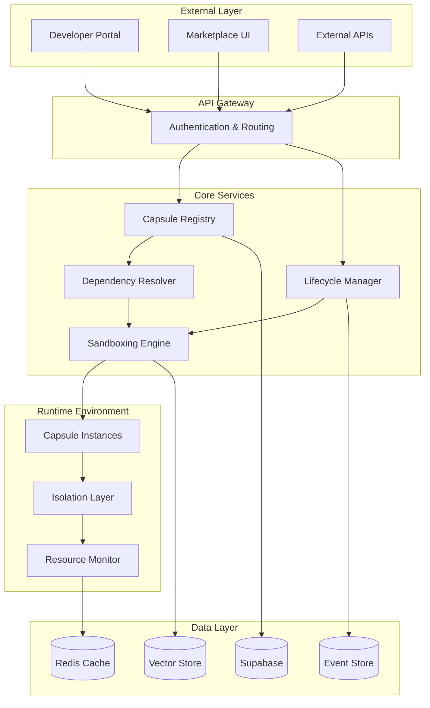

# Capsule Architecture

Knowledge Capsules are structured files stored within AMX Workspaces, providing encapsulated units of knowledge that can be versioned, shared, and processed by AMX Engine. The architecture treats capsules as files within the workspace's knowledge/ directory, managed through git-like operations.

## Workspace Integration

Knowledge Capsules exist as files within the workspace structure:

```
workspace/
├── .aimatrix/
├── knowledge/
│   ├── capsules/
│   │   ├── customer-service.kc      # Customer service capsule
│   │   ├── product-catalog.kc       # Product knowledge capsule
│   │   └── troubleshooting.kc       # Support knowledge capsule
│   ├── volumes/
│   └── libraries/
├── agents/
├── workflows/
└── models/
```

### File-Based Management
- **Storage**: Capsules are `.kc` files stored in `knowledge/capsules/`
- **Version Control**: Managed through AMX Hub like git repositories
- **Processing**: AMX Engine reads capsule files directly from workspace
- **Collaboration**: Shared through workspace push/pull operations

## System Architecture Overview



## Capsule Structure and Format

### Capsule Manifest

Every knowledge capsule is defined by a comprehensive manifest file that describes its structure, dependencies, and capabilities.

```typescript
interface CapsuleManifest {
  // Basic identification
  id: string;
  name: string;
  version: string;
  description: string;
  author: DeveloperInfo;
  license: string;
  
  // Compatibility and requirements
  aimatrixVersion: string;
  nodeVersion?: string;
  pythonVersion?: string;
  
  // Dependencies
  dependencies: {
    [capsuleId: string]: VersionConstraint;
  };
  peerDependencies?: {
    [capsuleId: string]: VersionConstraint;
  };
  
  // Resources and capabilities
  resources: ResourceRequirements;
  permissions: Permission[];
  endpoints: EndpointDefinition[];
  eventHandlers: EventHandler[];
  
  // Knowledge assets
  knowledgeAssets: {
    schemas: string[];
    rules: string[];
    workflows: string[];
    embeddings: string[];
  };
  
  // Integration hooks
  hooks: {
    preInstall?: string;
    postInstall?: string;
    preUpdate?: string;
    postUpdate?: string;
    preRemove?: string;
    postRemove?: string;
  };
  
  // Metadata
  tags: string[];
  category: string;
  documentation: string;
  changelog: string;
}

interface ResourceRequirements {
  memory: {
    min: string;
    recommended: string;
    max: string;
  };
  cpu: {
    min: number;
    recommended: number;
  };
  storage: {
    persistent: string;
    temporary: string;
  };
  network: {
    outbound: string[];
    inbound?: string[];
  };
}
```

### Directory Structure

```
knowledge-capsule/
├── manifest.json                 # Capsule manifest
├── README.md                     # Documentation
├── CHANGELOG.md                  # Version history
├── LICENSE                       # License file
├── src/                          # Source code
│   ├── handlers/                 # Event handlers
│   ├── endpoints/                # API endpoints
│   ├── processors/               # Data processors
│   └── utilities/                # Helper functions
├── knowledge/                    # Knowledge assets
│   ├── schemas/                  # Data schemas
│   ├── rules/                    # Business rules
│   ├── workflows/                # Process definitions
│   └── embeddings/               # Vector embeddings
├── tests/                        # Test suite
│   ├── unit/                     # Unit tests
│   ├── integration/              # Integration tests
│   └── fixtures/                 # Test data
├── docs/                         # Additional documentation
└── examples/                     # Usage examples
```

## Dependency Management System

### Dependency Resolution Algorithm

The dependency resolver uses a sophisticated algorithm to ensure compatibility and prevent conflicts:

```typescript
class DependencyResolver {
  async resolveInstallation(
    capsuleId: string,
    requestedVersion: string,
    currentInstallations: InstalledCapsule[]
  ): Promise<InstallationPlan> {
    
    const dependencyGraph = await this.buildDependencyGraph(
      capsuleId, 
      requestedVersion
    );
    
    // Check for conflicts with existing installations
    const conflicts = this.detectConflicts(
      dependencyGraph, 
      currentInstallations
    );
    
    if (conflicts.length > 0) {
      return this.generateConflictResolution(conflicts);
    }
    
    // Generate installation order using topological sort
    const installationOrder = this.topologicalSort(dependencyGraph);
    
    return {
      capsulesToInstall: installationOrder,
      capsulesToUpdate: await this.findUpdateCandidates(dependencyGraph),
      estimatedSize: this.calculateTotalSize(installationOrder),
      riskAssessment: await this.assessRisks(installationOrder)
    };
  }
  
  private async buildDependencyGraph(
    capsuleId: string,
    version: string,
    visited = new Set<string>()
  ): Promise<DependencyGraph> {
    
    if (visited.has(`${capsuleId}@${version}`)) {
      throw new Error(`Circular dependency detected: ${capsuleId}@${version}`);
    }
    
    visited.add(`${capsuleId}@${version}`);
    
    const manifest = await this.fetchManifest(capsuleId, version);
    const node = new DependencyNode(capsuleId, version, manifest);
    
    // Recursively resolve dependencies
    for (const [depId, constraint] of Object.entries(manifest.dependencies)) {
      const resolvedVersion = await this.resolveVersion(depId, constraint);
      const depGraph = await this.buildDependencyGraph(
        depId, 
        resolvedVersion, 
        new Set(visited)
      );
      node.addDependency(depGraph.root);
    }
    
    return new DependencyGraph(node);
  }
}
```

### Version Compatibility

The system uses semantic versioning with advanced constraint resolution:

```typescript
interface VersionConstraint {
  operator: '=' | '>' | '>=' | '<' | '<=' | '~' | '^' | 'latest';
  version: string;
  prerelease?: boolean;
}

class VersionResolver {
  satisfies(version: string, constraint: VersionConstraint): boolean {
    const semver = new SemVer(version);
    const constraintVer = new SemVer(constraint.version);
    
    switch (constraint.operator) {
      case '=':
        return semver.equals(constraintVer);
      case '^':
        return semver.compatibleWith(constraintVer);
      case '~':
        return semver.approximatelyEquals(constraintVer);
      case '>=':
        return semver.greaterThanOrEqual(constraintVer);
      case '>':
        return semver.greaterThan(constraintVer);
      case '<=':
        return semver.lessThanOrEqual(constraintVer);
      case '<':
        return semver.lessThan(constraintVer);
      case 'latest':
        return true; // Resolved at install time
      default:
        return false;
    }
  }
}
```

## Isolation and Sandboxing

### Runtime Sandboxing

Each capsule runs in an isolated environment to prevent interference and security issues:

```typescript
class CapsuleSandbox {
  private readonly containerId: string;
  private readonly resources: ResourceLimits;
  private readonly permissions: Permission[];
  
  async initialize(capsule: CapsuleManifest): Promise<SandboxEnvironment> {
    // Create isolated container
    const container = await this.containerRuntime.create({
      image: this.buildSandboxImage(capsule),
      resources: this.resources,
      networkMode: 'restricted',
      filesystemMode: 'overlay'
    });
    
    // Set up resource monitoring
    const monitor = new ResourceMonitor(container.id, {
      memoryLimit: this.resources.memory,
      cpuLimit: this.resources.cpu,
      networkLimit: this.resources.network
    });
    
    // Initialize security context
    const securityContext = new SecurityContext({
      uid: this.generateUniqueUserId(),
      gid: this.generateUniqueGroupId(),
      capabilities: this.permissions.map(p => p.capability),
      seccompProfile: 'restricted'
    });
    
    return new SandboxEnvironment(container, monitor, securityContext);
  }
  
  async executeCode(
    code: string, 
    context: ExecutionContext
  ): Promise<ExecutionResult> {
    
    const sandbox = this.createV8Sandbox({
      timeout: context.timeout || 30000,
      memoryLimit: context.memoryLimit || '128MB'
    });
    
    // Inject controlled APIs
    sandbox.globals.aimatrix = this.createRestrictedAPI(context.permissions);
    sandbox.globals.supabase = this.createSupabaseProxy(context.organizationId);
    
    try {
      const result = await sandbox.execute(code);
      return {
        success: true,
        result: result,
        resourceUsage: sandbox.getResourceUsage()
      };
    } catch (error) {
      return {
        success: false,
        error: error.message,
        resourceUsage: sandbox.getResourceUsage()
      };
    } finally {
      sandbox.dispose();
    }
  }
}
```

### Permission System

```typescript
interface Permission {
  resource: string;
  actions: string[];
  conditions?: PermissionCondition[];
}

interface PermissionCondition {
  field: string;
  operator: 'equals' | 'contains' | 'startsWith' | 'matches';
  value: any;
}

class PermissionManager {
  async checkPermission(
    capsuleId: string,
    permission: Permission,
    context: SecurityContext
  ): Promise<boolean> {
    
    const grantedPermissions = await this.getGrantedPermissions(capsuleId);
    
    const matchingPermission = grantedPermissions.find(p => 
      p.resource === permission.resource &&
      permission.actions.every(action => p.actions.includes(action))
    );
    
    if (!matchingPermission) {
      return false;
    }
    
    // Check conditions
    if (matchingPermission.conditions) {
      return this.evaluateConditions(matchingPermission.conditions, context);
    }
    
    return true;
  }
  
  private evaluateConditions(
    conditions: PermissionCondition[],
    context: SecurityContext
  ): boolean {
    return conditions.every(condition => {
      const contextValue = context[condition.field];
      
      switch (condition.operator) {
        case 'equals':
          return contextValue === condition.value;
        case 'contains':
          return contextValue.includes(condition.value);
        case 'startsWith':
          return contextValue.startsWith(condition.value);
        case 'matches':
          return new RegExp(condition.value).test(contextValue);
        default:
          return false;
      }
    });
  }
}
```

## Supabase Integration

### Database Schema

The complete database schema for the Knowledge Capsule System:

```sql
-- Enable necessary extensions
CREATE EXTENSION IF NOT EXISTS "uuid-ossp";
CREATE EXTENSION IF NOT EXISTS "vector";

-- Custom types
CREATE TYPE capsule_status AS ENUM ('active', 'deprecated', 'removed', 'suspended');
CREATE TYPE dependency_type AS ENUM ('required', 'optional', 'development', 'peer');
CREATE TYPE installation_status AS ENUM ('pending', 'installing', 'active', 'failed', 'updating', 'removing');
CREATE TYPE event_type AS ENUM ('installed', 'updated', 'removed', 'configured', 'error', 'accessed');

-- Developers table
CREATE TABLE developers (
    id UUID PRIMARY KEY DEFAULT uuid_generate_v4(),
    email TEXT UNIQUE NOT NULL,
    name TEXT NOT NULL,
    company TEXT,
    verified BOOLEAN DEFAULT FALSE,
    reputation_score INTEGER DEFAULT 0,
    created_at TIMESTAMP WITH TIME ZONE DEFAULT NOW(),
    updated_at TIMESTAMP WITH TIME ZONE DEFAULT NOW()
);

-- Organizations table
CREATE TABLE organizations (
    id UUID PRIMARY KEY DEFAULT uuid_generate_v4(),
    name TEXT NOT NULL,
    subscription_tier TEXT DEFAULT 'basic',
    created_at TIMESTAMP WITH TIME ZONE DEFAULT NOW(),
    updated_at TIMESTAMP WITH TIME ZONE DEFAULT NOW()
);

-- Core capsule registry
CREATE TABLE knowledge_capsules (
    id UUID PRIMARY KEY DEFAULT uuid_generate_v4(),
    name TEXT NOT NULL,
    version TEXT NOT NULL,
    developer_id UUID REFERENCES developers(id) ON DELETE CASCADE,
    status capsule_status DEFAULT 'active',
    
    -- Manifest data
    manifest JSONB NOT NULL,
    
    -- Searchable metadata
    description TEXT,
    tags TEXT[],
    category TEXT,
    
    -- Statistics
    download_count INTEGER DEFAULT 0,
    rating_average DECIMAL(2,1) DEFAULT 0.0,
    rating_count INTEGER DEFAULT 0,
    
    -- Storage
    package_size BIGINT,
    package_url TEXT,
    checksum TEXT,
    
    -- Timestamps
    created_at TIMESTAMP WITH TIME ZONE DEFAULT NOW(),
    updated_at TIMESTAMP WITH TIME ZONE DEFAULT NOW(),
    published_at TIMESTAMP WITH TIME ZONE,
    deprecated_at TIMESTAMP WITH TIME ZONE,
    
    UNIQUE(name, version),
    CHECK (rating_average >= 0.0 AND rating_average <= 5.0)
);

-- Create indexes for performance
CREATE INDEX idx_capsules_name ON knowledge_capsules(name);
CREATE INDEX idx_capsules_developer ON knowledge_capsules(developer_id);
CREATE INDEX idx_capsules_status ON knowledge_capsules(status);
CREATE INDEX idx_capsules_category ON knowledge_capsules(category);
CREATE INDEX idx_capsules_tags ON knowledge_capsules USING GIN(tags);
CREATE INDEX idx_capsules_published ON knowledge_capsules(published_at DESC) WHERE status = 'active';

-- Dependency relationships
CREATE TABLE capsule_dependencies (
    id UUID PRIMARY KEY DEFAULT uuid_generate_v4(),
    capsule_id UUID REFERENCES knowledge_capsules(id) ON DELETE CASCADE,
    depends_on_id UUID REFERENCES knowledge_capsules(id) ON DELETE CASCADE,
    version_constraint TEXT NOT NULL,
    dependency_type dependency_type DEFAULT 'required',
    created_at TIMESTAMP WITH TIME ZONE DEFAULT NOW(),
    
    UNIQUE(capsule_id, depends_on_id)
);

CREATE INDEX idx_dependencies_capsule ON capsule_dependencies(capsule_id);
CREATE INDEX idx_dependencies_target ON capsule_dependencies(depends_on_id);

-- Installation tracking
CREATE TABLE capsule_installations (
    id UUID PRIMARY KEY DEFAULT uuid_generate_v4(),
    capsule_id UUID REFERENCES knowledge_capsules(id) ON DELETE CASCADE,
    organization_id UUID REFERENCES organizations(id) ON DELETE CASCADE,
    installation_status installation_status DEFAULT 'pending',
    
    -- Configuration and state
    configuration JSONB DEFAULT '{}',
    environment_variables JSONB DEFAULT '{}',
    resource_limits JSONB DEFAULT '{}',
    
    -- Tracking
    installed_at TIMESTAMP WITH TIME ZONE DEFAULT NOW(),
    last_accessed TIMESTAMP WITH TIME ZONE,
    last_updated TIMESTAMP WITH TIME ZONE DEFAULT NOW(),
    access_count BIGINT DEFAULT 0,
    
    -- Error handling
    error_message TEXT,
    retry_count INTEGER DEFAULT 0,
    
    UNIQUE(capsule_id, organization_id)
);

CREATE INDEX idx_installations_org ON capsule_installations(organization_id);
CREATE INDEX idx_installations_capsule ON capsule_installations(capsule_id);
CREATE INDEX idx_installations_status ON capsule_installations(installation_status);

-- Event sourcing for complete audit trail
CREATE TABLE capsule_events (
    id UUID PRIMARY KEY DEFAULT uuid_generate_v4(),
    capsule_id UUID REFERENCES knowledge_capsules(id) ON DELETE CASCADE,
    organization_id UUID REFERENCES organizations(id) ON DELETE CASCADE,
    user_id UUID, -- Can be null for system events
    
    -- Event details
    event_type event_type NOT NULL,
    event_data JSONB NOT NULL,
    
    -- Context
    ip_address INET,
    user_agent TEXT,
    session_id TEXT,
    
    -- Timing
    timestamp TIMESTAMP WITH TIME ZONE DEFAULT NOW(),
    
    -- Partitioning hint
    partition_key TEXT GENERATED ALWAYS AS (date_trunc('month', timestamp)::text) STORED
);

-- Partition by month for performance
CREATE INDEX idx_events_capsule_time ON capsule_events(capsule_id, timestamp DESC);
CREATE INDEX idx_events_org_time ON capsule_events(organization_id, timestamp DESC);
CREATE INDEX idx_events_type_time ON capsule_events(event_type, timestamp DESC);
CREATE INDEX idx_events_partition ON capsule_events(partition_key, timestamp DESC);

-- Knowledge assets and embeddings
CREATE TABLE capsule_knowledge_assets (
    id UUID PRIMARY KEY DEFAULT uuid_generate_v4(),
    capsule_id UUID REFERENCES knowledge_capsules(id) ON DELETE CASCADE,
    asset_type TEXT NOT NULL, -- 'schema', 'rule', 'workflow', 'embedding'
    asset_name TEXT NOT NULL,
    asset_path TEXT NOT NULL,
    content_hash TEXT NOT NULL,
    
    -- Vector embeddings for searchability
    embedding vector(1536), -- OpenAI ada-002 dimension
    
    -- Metadata
    metadata JSONB DEFAULT '{}',
    created_at TIMESTAMP WITH TIME ZONE DEFAULT NOW(),
    
    UNIQUE(capsule_id, asset_type, asset_name)
);

CREATE INDEX idx_knowledge_assets_capsule ON capsule_knowledge_assets(capsule_id);
CREATE INDEX idx_knowledge_assets_type ON capsule_knowledge_assets(asset_type);
CREATE INDEX idx_knowledge_assets_embedding ON capsule_knowledge_assets USING ivfflat (embedding vector_cosine_ops) WITH (lists = 100);

-- Reviews and ratings
CREATE TABLE capsule_reviews (
    id UUID PRIMARY KEY DEFAULT uuid_generate_v4(),
    capsule_id UUID REFERENCES knowledge_capsules(id) ON DELETE CASCADE,
    organization_id UUID REFERENCES organizations(id) ON DELETE CASCADE,
    user_id UUID NOT NULL,
    
    rating INTEGER NOT NULL CHECK (rating >= 1 AND rating <= 5),
    review_text TEXT,
    
    created_at TIMESTAMP WITH TIME ZONE DEFAULT NOW(),
    updated_at TIMESTAMP WITH TIME ZONE DEFAULT NOW(),
    
    UNIQUE(capsule_id, organization_id, user_id)
);

CREATE INDEX idx_reviews_capsule ON capsule_reviews(capsule_id);
CREATE INDEX idx_reviews_rating ON capsule_reviews(capsule_id, rating);
```

### Event Sourcing Implementation

```typescript
class CapsuleEventStore {
  constructor(private supabase: SupabaseClient) {}
  
  async appendEvent(event: CapsuleEvent): Promise<void> {
    const { error } = await this.supabase
      .from('capsule_events')
      .insert({
        capsule_id: event.capsuleId,
        organization_id: event.organizationId,
        user_id: event.userId,
        event_type: event.eventType,
        event_data: event.payload,
        ip_address: event.ipAddress,
        user_agent: event.userAgent,
        session_id: event.sessionId
      });
      
    if (error) {
      throw new Error(`Failed to append event: ${error.message}`);
    }
  }
  
  async getEventStream(
    capsuleId: string,
    organizationId: string,
    fromTimestamp?: Date
  ): Promise<CapsuleEvent[]> {
    
    let query = this.supabase
      .from('capsule_events')
      .select('*')
      .eq('capsule_id', capsuleId)
      .eq('organization_id', organizationId)
      .order('timestamp', { ascending: true });
    
    if (fromTimestamp) {
      query = query.gte('timestamp', fromTimestamp.toISOString());
    }
    
    const { data, error } = await query;
    
    if (error) {
      throw new Error(`Failed to retrieve events: ${error.message}`);
    }
    
    return data.map(row => ({
      id: row.id,
      capsuleId: row.capsule_id,
      organizationId: row.organization_id,
      userId: row.user_id,
      eventType: row.event_type,
      payload: row.event_data,
      timestamp: new Date(row.timestamp),
      ipAddress: row.ip_address,
      userAgent: row.user_agent,
      sessionId: row.session_id
    }));
  }
  
  async projectCurrentState(
    capsuleId: string,
    organizationId: string
  ): Promise<CapsuleInstallationState> {
    
    const events = await this.getEventStream(capsuleId, organizationId);
    
    return events.reduce((state, event) => {
      switch (event.eventType) {
        case 'installed':
          return {
            ...state,
            status: 'active',
            installedAt: event.timestamp,
            configuration: event.payload.configuration
          };
        case 'configured':
          return {
            ...state,
            configuration: { ...state.configuration, ...event.payload.configuration }
          };
        case 'updated':
          return {
            ...state,
            version: event.payload.newVersion,
            lastUpdated: event.timestamp
          };
        case 'removed':
          return {
            ...state,
            status: 'removed',
            removedAt: event.timestamp
          };
        default:
          return state;
      }
    }, {} as CapsuleInstallationState);
  }
}
```

## Performance Optimization

### Caching Strategy

```typescript
class CapsuleCache {
  private redis: Redis;
  private localCache: LRUCache<string, any>;
  
  constructor(redisConfig: RedisConfig) {
    this.redis = new Redis(redisConfig);
    this.localCache = new LRUCache({
      max: 1000,
      ttl: 5 * 60 * 1000 // 5 minutes
    });
  }
  
  async getCapsuleManifest(capsuleId: string, version: string): Promise<CapsuleManifest | null> {
    const key = `manifest:${capsuleId}:${version}`;
    
    // L1: Local cache
    let manifest = this.localCache.get(key);
    if (manifest) {
      return manifest;
    }
    
    // L2: Redis cache
    const cached = await this.redis.get(key);
    if (cached) {
      manifest = JSON.parse(cached);
      this.localCache.set(key, manifest);
      return manifest;
    }
    
    // L3: Database
    manifest = await this.fetchFromDatabase(capsuleId, version);
    if (manifest) {
      // Cache with 1 hour TTL
      await this.redis.setex(key, 3600, JSON.stringify(manifest));
      this.localCache.set(key, manifest);
    }
    
    return manifest;
  }
  
  async invalidateCapsule(capsuleId: string): Promise<void> {
    const pattern = `*:${capsuleId}:*`;
    const keys = await this.redis.keys(pattern);
    
    if (keys.length > 0) {
      await this.redis.del(...keys);
    }
    
    // Clear local cache entries
    this.localCache.clear();
  }
}
```

## Security Considerations

### Code Scanning and Validation

```typescript
class SecurityScanner {
  async scanCapsule(packagePath: string): Promise<SecurityReport> {
    const report: SecurityReport = {
      vulnerabilities: [],
      maliciousPatterns: [],
      riskScore: 0,
      recommendations: []
    };
    
    // Static code analysis
    const staticAnalysis = await this.runStaticAnalysis(packagePath);
    report.vulnerabilities.push(...staticAnalysis.vulnerabilities);
    
    // Malicious pattern detection
    const patternAnalysis = await this.scanForMaliciousPatterns(packagePath);
    report.maliciousPatterns.push(...patternAnalysis.patterns);
    
    // Dependency vulnerability check
    const dependencyAnalysis = await this.checkDependencyVulnerabilities(packagePath);
    report.vulnerabilities.push(...dependencyAnalysis.vulnerabilities);
    
    // Calculate risk score
    report.riskScore = this.calculateRiskScore(report);
    
    // Generate recommendations
    report.recommendations = this.generateRecommendations(report);
    
    return report;
  }
  
  private async scanForMaliciousPatterns(packagePath: string): Promise<PatternAnalysis> {
    const dangerousPatterns = [
      /require\(['"`]child_process['"`]\)/g,  // Process execution
      /eval\s*\(/g,                           // Code evaluation
      /Function\s*\(/g,                       // Dynamic function creation
      /process\.env/g,                        // Environment access
      /fs\.(readFile|writeFile|unlink)/g,     // File system access
      /require\(['"`]net['"`]\)/g,            // Network access
      /require\(['"`]crypto['"`]\)/g          // Cryptographic operations
    ];
    
    const analysis: PatternAnalysis = {
      patterns: [],
      riskLevel: 'low'
    };
    
    const files = await this.getAllSourceFiles(packagePath);
    
    for (const file of files) {
      const content = await fs.readFile(file, 'utf-8');
      
      for (const pattern of dangerousPatterns) {
        const matches = content.match(pattern);
        if (matches) {
          analysis.patterns.push({
            pattern: pattern.source,
            file: file,
            matches: matches.length,
            severity: this.getPatternSeverity(pattern)
          });
        }
      }
    }
    
    analysis.riskLevel = this.assessOverallRisk(analysis.patterns);
    return analysis;
  }
}
```

This architecture provides a robust foundation for the Knowledge Capsule System, ensuring security, scalability, and maintainability while enabling powerful extensibility for AIMatrix users.