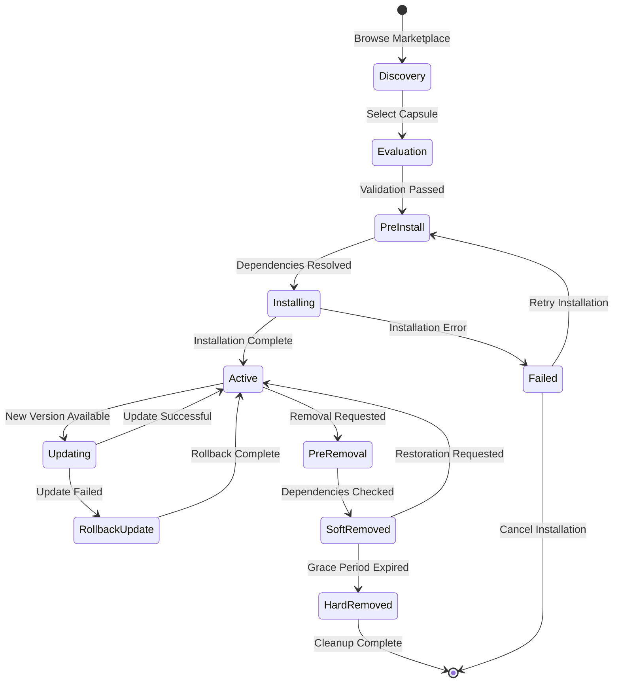

# Capsule Lifecycle Management

The Knowledge Capsule System implements comprehensive lifecycle management to ensure smooth installation, reliable updates, and safe removal of knowledge modules while maintaining system integrity and data consistency.

## Lifecycle Overview



## Installation Process

### Phase 1: Discovery and Validation

The installation process begins with thorough validation to ensure compatibility and security:

```typescript
class CapsuleInstaller {
  async validateInstallation(
    capsuleId: string,
    version: string,
    organizationId: string
  ): Promise<ValidationResult> {
    
    const validation: ValidationResult = {
      isValid: true,
      errors: [],
      warnings: [],
      requirements: []
    };
    
    // 1. Fetch and validate manifest
    const manifest = await this.fetchManifest(capsuleId, version);
    if (!manifest) {
      validation.errors.push(`Capsule ${capsuleId}@${version} not found`);
      validation.isValid = false;
      return validation;
    }
    
    // 2. Check AIMatrix version compatibility
    const platformVersion = await this.getPlatformVersion();
    if (!this.isVersionCompatible(platformVersion, manifest.aimatrixVersion)) {
      validation.errors.push(
        `Platform version ${platformVersion} incompatible with required ${manifest.aimatrixVersion}`
      );
      validation.isValid = false;
    }
    
    // 3. Validate permissions
    const permissionCheck = await this.validatePermissions(
      manifest.permissions, 
      organizationId
    );
    if (!permissionCheck.granted) {
      validation.errors.push(...permissionCheck.deniedReasons);
      validation.isValid = false;
    }
    
    // 4. Check resource requirements
    const resourceCheck = await this.checkResourceAvailability(
      manifest.resources, 
      organizationId
    );
    if (!resourceCheck.sufficient) {
      validation.warnings.push(...resourceCheck.warnings);
      if (resourceCheck.critical) {
        validation.errors.push(...resourceCheck.errors);
        validation.isValid = false;
      }
    }
    
    // 5. Resolve dependencies
    const dependencyPlan = await this.resolveDependencies(
      manifest.dependencies, 
      organizationId
    );
    if (!dependencyPlan.resolvable) {
      validation.errors.push(...dependencyPlan.conflicts);
      validation.isValid = false;
    } else {
      validation.requirements = dependencyPlan.installationPlan;
    }
    
    return validation;
  }
  
  private async resolveDependencies(
    dependencies: Record<string, string>,
    organizationId: string
  ): Promise<DependencyPlan> {
    
    const resolver = new DependencyResolver();
    const currentInstallations = await this.getCurrentInstallations(organizationId);
    
    const plan: DependencyPlan = {
      resolvable: true,
      conflicts: [],
      installationPlan: [],
      updatePlan: []
    };
    
    for (const [depId, constraint] of Object.entries(dependencies)) {
      const existing = currentInstallations.find(i => i.capsuleId === depId);
      
      if (existing) {
        // Check if existing version satisfies constraint
        if (!this.versionSatisfies(existing.version, constraint)) {
          const compatibleVersion = await this.findCompatibleVersion(depId, constraint);
          
          if (!compatibleVersion) {
            plan.conflicts.push(
              `Cannot resolve dependency ${depId}@${constraint} - no compatible version found`
            );
            plan.resolvable = false;
          } else {
            plan.updatePlan.push({
              capsuleId: depId,
              currentVersion: existing.version,
              targetVersion: compatibleVersion,
              reason: `Required by new installation`
            });
          }
        }
      } else {
        // Need to install dependency
        const targetVersion = await this.resolveLatestVersion(depId, constraint);
        
        if (!targetVersion) {
          plan.conflicts.push(
            `Cannot resolve dependency ${depId}@${constraint} - capsule not found`
          );
          plan.resolvable = false;
        } else {
          plan.installationPlan.push({
            capsuleId: depId,
            version: targetVersion,
            reason: `Dependency of requested capsule`
          });
        }
      }
    }
    
    return plan;
  }
}
```

### Phase 2: Pre-Installation Hooks

Before actual installation, the system executes pre-installation hooks:

```typescript
class PreInstallationManager {
  async executePreInstallHooks(
    manifest: CapsuleManifest,
    context: InstallationContext
  ): Promise<HookResult> {
    
    if (!manifest.hooks?.preInstall) {
      return { success: true, output: "No pre-install hooks" };
    }
    
    const sandbox = await this.createInstallationSandbox(context);
    
    try {
      // Load pre-install script
      const script = await this.loadScript(manifest.hooks.preInstall);
      
      // Execute with limited permissions
      const result = await sandbox.execute(script, {
        timeout: 30000,
        permissions: ['read-config', 'validate-environment'],
        context: {
          organizationId: context.organizationId,
          targetVersion: manifest.version,
          dependencies: manifest.dependencies
        }
      });
      
      if (!result.success) {
        throw new Error(`Pre-install hook failed: ${result.error}`);
      }
      
      return {
        success: true,
        output: result.output,
        modifications: result.environmentChanges
      };
      
    } catch (error) {
      return {
        success: false,
        error: error.message,
        output: error.output || ""
      };
    } finally {
      await sandbox.cleanup();
    }
  }
}
```

### Phase 3: Installation Execution

The core installation process involves multiple coordinated steps:

```typescript
class InstallationExecutor {
  async executeInstallation(
    capsuleId: string,
    version: string,
    organizationId: string,
    plan: InstallationPlan
  ): Promise<InstallationResult> {
    
    const transaction = await this.beginTransaction();
    
    try {
      // 1. Install dependencies first
      for (const dep of plan.dependenciesToInstall) {
        await this.installDependency(dep, organizationId, transaction);
      }
      
      // 2. Update conflicting dependencies
      for (const update of plan.dependenciesToUpdate) {
        await this.updateDependency(update, organizationId, transaction);
      }
      
      // 3. Download and verify capsule package
      const packageInfo = await this.downloadPackage(capsuleId, version);
      const verified = await this.verifyPackage(packageInfo);
      
      if (!verified.success) {
        throw new Error(`Package verification failed: ${verified.reason}`);
      }
      
      // 4. Extract and prepare files
      const extractPath = await this.extractPackage(packageInfo.path);
      const manifest = await this.loadManifest(extractPath);
      
      // 5. Set up runtime environment
      const environment = await this.setupEnvironment(manifest, organizationId);
      
      // 6. Register capsule in database
      const installation = await this.registerInstallation({
        capsuleId,
        version,
        organizationId,
        manifest,
        environment: environment.id,
        extractPath
      }, transaction);
      
      // 7. Execute post-install hooks
      const hookResult = await this.executePostInstallHooks(
        manifest, 
        { 
          organizationId, 
          installationId: installation.id 
        }
      );
      
      if (!hookResult.success) {
        throw new Error(`Post-install hook failed: ${hookResult.error}`);
      }
      
      // 8. Start capsule services
      await this.startCapsuleServices(installation.id);
      
      // 9. Update status to active
      await this.updateInstallationStatus(
        installation.id, 
        'active', 
        transaction
      );
      
      await transaction.commit();
      
      // 10. Log installation event
      await this.eventStore.appendEvent({
        capsuleId,
        organizationId,
        eventType: 'installed',
        payload: {
          version,
          installationId: installation.id,
          duration: Date.now() - plan.startTime
        },
        timestamp: new Date()
      });
      
      return {
        success: true,
        installationId: installation.id,
        message: "Installation completed successfully"
      };
      
    } catch (error) {
      await transaction.rollback();
      
      // Clean up any partially installed components
      await this.cleanupFailedInstallation(capsuleId, organizationId);
      
      // Log failure event
      await this.eventStore.appendEvent({
        capsuleId,
        organizationId,
        eventType: 'error',
        payload: {
          error: error.message,
          phase: 'installation',
          version
        },
        timestamp: new Date()
      });
      
      return {
        success: false,
        error: error.message,
        rollbackCompleted: true
      };
    }
  }
}
```

## Update Mechanism

### Incremental Update Strategy

The update system supports both full and incremental updates to minimize downtime:

```typescript
class CapsuleUpdater {
  async planUpdate(
    capsuleId: string,
    currentVersion: string,
    targetVersion: string,
    organizationId: string
  ): Promise<UpdatePlan> {
    
    const updatePath = await this.findUpdatePath(
      capsuleId, 
      currentVersion, 
      targetVersion
    );
    
    if (updatePath.length === 0) {
      throw new Error(`No update path found from ${currentVersion} to ${targetVersion}`);
    }
    
    const plan: UpdatePlan = {
      steps: [],
      requiresRestart: false,
      backupRequired: false,
      estimatedDuration: 0,
      riskLevel: 'low'
    };
    
    for (let i = 0; i < updatePath.length - 1; i++) {
      const from = updatePath[i];
      const to = updatePath[i + 1];
      
      const stepPlan = await this.planUpdateStep(from, to, organizationId);
      plan.steps.push(stepPlan);
      
      plan.estimatedDuration += stepPlan.estimatedDuration;
      plan.requiresRestart = plan.requiresRestart || stepPlan.requiresRestart;
      plan.backupRequired = plan.backupRequired || stepPlan.backupRequired;
      plan.riskLevel = this.maxRiskLevel(plan.riskLevel, stepPlan.riskLevel);
    }
    
    return plan;
  }
  
  async executeUpdate(
    installationId: string,
    updatePlan: UpdatePlan
  ): Promise<UpdateResult> {
    
    const backup = await this.createBackup(installationId);
    
    try {
      for (const step of updatePlan.steps) {
        const stepResult = await this.executeUpdateStep(installationId, step);
        
        if (!stepResult.success) {
          // Rollback to backup
          await this.restoreFromBackup(installationId, backup);
          throw new Error(`Update step failed: ${stepResult.error}`);
        }
      }
      
      // Verify update success
      const verification = await this.verifyUpdate(installationId);
      if (!verification.success) {
        await this.restoreFromBackup(installationId, backup);
        throw new Error(`Update verification failed: ${verification.error}`);
      }
      
      // Clean up old backup after successful update
      await this.cleanupBackup(backup);
      
      return {
        success: true,
        newVersion: updatePlan.targetVersion,
        backupRemoved: true
      };
      
    } catch (error) {
      return {
        success: false,
        error: error.message,
        rolledBack: true,
        backupRetained: true
      };
    }
  }
  
  private async executeUpdateStep(
    installationId: string,
    step: UpdateStep
  ): Promise<StepResult> {
    
    switch (step.type) {
      case 'schema_migration':
        return await this.executeSchemaMigration(installationId, step);
      case 'code_update':
        return await this.executeCodeUpdate(installationId, step);
      case 'configuration_change':
        return await this.executeConfigurationChange(installationId, step);
      case 'dependency_update':
        return await this.executeDependencyUpdate(installationId, step);
      default:
        throw new Error(`Unknown update step type: ${step.type}`);
    }
  }
}
```

### Blue-Green Update Deployment

For zero-downtime updates, the system supports blue-green deployment:

```typescript
class BlueGreenUpdater {
  async performBlueGreenUpdate(
    installationId: string,
    newVersion: string
  ): Promise<UpdateResult> {
    
    const currentInstallation = await this.getInstallation(installationId);
    
    // 1. Create new environment (Green)
    const greenEnvironment = await this.createGreenEnvironment(
      currentInstallation, 
      newVersion
    );
    
    try {
      // 2. Install new version in green environment
      await this.installInEnvironment(greenEnvironment, newVersion);
      
      // 3. Run smoke tests
      const smokeTests = await this.runSmokeTests(greenEnvironment);
      if (!smokeTests.passed) {
        throw new Error(`Smoke tests failed: ${smokeTests.failures.join(', ')}`);
      }
      
      // 4. Migrate data if needed
      if (greenEnvironment.requiresDataMigration) {
        await this.migrateData(currentInstallation, greenEnvironment);
      }
      
      // 5. Switch traffic to green environment
      await this.switchTraffic(currentInstallation, greenEnvironment);
      
      // 6. Monitor for issues
      const monitoring = await this.monitorSwitchover(greenEnvironment, 300); // 5 minutes
      
      if (!monitoring.stable) {
        // Rollback to blue environment
        await this.switchTraffic(greenEnvironment, currentInstallation);
        throw new Error(`Update monitoring failed: ${monitoring.issues.join(', ')}`);
      }
      
      // 7. Clean up old environment after successful switchover
      await this.scheduleCleanup(currentInstallation.environmentId);
      
      return {
        success: true,
        newEnvironment: greenEnvironment.id,
        switchoverTime: monitoring.switchoverDuration
      };
      
    } catch (error) {
      // Clean up failed green environment
      await this.cleanupEnvironment(greenEnvironment.id);
      
      return {
        success: false,
        error: error.message,
        rollbackCompleted: true
      };
    }
  }
}
```

## Rollback Capabilities

### Automated Rollback System

The system provides comprehensive rollback capabilities at multiple levels:

```typescript
class RollbackManager {
  async createRestorePoint(installationId: string): Promise<RestorePoint> {
    const installation = await this.getInstallation(installationId);
    
    const restorePoint: RestorePoint = {
      id: uuid(),
      installationId,
      version: installation.version,
      timestamp: new Date(),
      
      // Snapshot current state
      configuration: await this.snapshotConfiguration(installationId),
      database: await this.createDatabaseSnapshot(installationId),
      files: await this.createFileSnapshot(installationId),
      environment: await this.snapshotEnvironment(installationId),
      
      // Metadata
      size: 0, // Calculated after snapshots
      compressed: true,
      encrypted: true
    };
    
    // Calculate total size
    restorePoint.size = this.calculateSnapshotSize(restorePoint);
    
    // Store restore point
    await this.storeRestorePoint(restorePoint);
    
    return restorePoint;
  }
  
  async rollbackToRestorePoint(
    installationId: string,
    restorePointId: string,
    options: RollbackOptions = {}
  ): Promise<RollbackResult> {
    
    const restorePoint = await this.getRestorePoint(restorePointId);
    const currentInstallation = await this.getInstallation(installationId);
    
    // Validate rollback is safe
    const validation = await this.validateRollback(
      currentInstallation, 
      restorePoint
    );
    
    if (!validation.safe && !options.force) {
      return {
        success: false,
        error: "Rollback validation failed",
        issues: validation.issues,
        canForce: validation.canForce
      };
    }
    
    const transaction = await this.beginTransaction();
    
    try {
      // 1. Stop current capsule
      await this.stopCapsule(installationId);
      
      // 2. Restore database state
      if (options.restoreDatabase !== false) {
        await this.restoreDatabase(restorePoint.database, transaction);
      }
      
      // 3. Restore file system
      await this.restoreFiles(restorePoint.files);
      
      // 4. Restore configuration
      await this.restoreConfiguration(restorePoint.configuration);
      
      // 5. Restore environment
      await this.restoreEnvironment(restorePoint.environment);
      
      // 6. Update installation record
      await this.updateInstallation(installationId, {
        version: restorePoint.version,
        rolledBackFrom: currentInstallation.version,
        rolledBackAt: new Date()
      }, transaction);
      
      // 7. Start capsule with restored state
      await this.startCapsule(installationId);
      
      // 8. Verify rollback success
      const verification = await this.verifyRollback(installationId, restorePoint);
      if (!verification.success) {
        throw new Error(`Rollback verification failed: ${verification.error}`);
      }
      
      await transaction.commit();
      
      // Log rollback event
      await this.eventStore.appendEvent({
        capsuleId: currentInstallation.capsuleId,
        organizationId: currentInstallation.organizationId,
        eventType: 'rollback',
        payload: {
          fromVersion: currentInstallation.version,
          toVersion: restorePoint.version,
          restorePointId: restorePointId,
          duration: Date.now() - rollbackStartTime
        },
        timestamp: new Date()
      });
      
      return {
        success: true,
        restoredVersion: restorePoint.version,
        verificationPassed: true
      };
      
    } catch (error) {
      await transaction.rollback();
      
      // Attempt to restart current version
      try {
        await this.startCapsule(installationId);
      } catch (startError) {
        // If we can't even start the original, we have a serious problem
        await this.markInstallationAsFailed(installationId, {
          error: "Rollback failed and original version cannot start",
          originalError: error.message,
          startError: startError.message
        });
      }
      
      return {
        success: false,
        error: error.message,
        originalVersionRestored: true
      };
    }
  }
}
```

## Migration Strategies

### Data Migration Framework

For handling complex data transformations during updates:

```typescript
class MigrationEngine {
  async executeMigrations(
    installationId: string,
    fromVersion: string,
    toVersion: string
  ): Promise<MigrationResult> {
    
    const migrationPlan = await this.buildMigrationPlan(
      fromVersion, 
      toVersion
    );
    
    if (migrationPlan.migrations.length === 0) {
      return { success: true, migrationsApplied: 0 };
    }
    
    const results: MigrationStepResult[] = [];
    
    for (const migration of migrationPlan.migrations) {
      const result = await this.executeMigration(installationId, migration);
      results.push(result);
      
      if (!result.success) {
        // Rollback all applied migrations
        await this.rollbackMigrations(installationId, results.slice(0, -1));
        
        return {
          success: false,
          error: result.error,
          migrationsApplied: results.length - 1,
          rollbackCompleted: true
        };
      }
    }
    
    return {
      success: true,
      migrationsApplied: results.length,
      details: results
    };
  }
  
  private async executeMigration(
    installationId: string,
    migration: Migration
  ): Promise<MigrationStepResult> {
    
    const startTime = Date.now();
    
    try {
      switch (migration.type) {
        case 'schema':
          return await this.executeSchemaMigration(installationId, migration);
        case 'data':
          return await this.executeDataMigration(installationId, migration);
        case 'configuration':
          return await this.executeConfigMigration(installationId, migration);
        default:
          throw new Error(`Unknown migration type: ${migration.type}`);
      }
    } catch (error) {
      return {
        success: false,
        migration: migration.id,
        error: error.message,
        duration: Date.now() - startTime
      };
    }
  }
  
  private async executeDataMigration(
    installationId: string,
    migration: DataMigration
  ): Promise<MigrationStepResult> {
    
    const batchSize = migration.batchSize || 1000;
    const table = migration.table;
    
    let processed = 0;
    let hasMore = true;
    
    while (hasMore) {
      const batch = await this.fetchBatch(table, migration.cursor, batchSize);
      
      if (batch.length === 0) {
        hasMore = false;
        break;
      }
      
      // Transform batch data
      const transformedBatch = await this.applyTransformation(
        batch, 
        migration.transformer
      );
      
      // Write back transformed data
      await this.writeBatch(table, transformedBatch);
      
      processed += batch.length;
      migration.cursor = batch[batch.length - 1].id;
      
      // Update progress
      await this.updateMigrationProgress(migration.id, processed);
      
      hasMore = batch.length === batchSize;
    }
    
    return {
      success: true,
      migration: migration.id,
      recordsProcessed: processed,
      duration: Date.now() - migration.startTime
    };
  }
}
```

## Monitoring and Health Checks

### Installation Health Monitoring

```typescript
class HealthMonitor {
  async checkInstallationHealth(installationId: string): Promise<HealthStatus> {
    const installation = await this.getInstallation(installationId);
    
    const checks: HealthCheck[] = [
      {
        name: 'service_status',
        check: () => this.checkServiceStatus(installationId),
        critical: true
      },
      {
        name: 'resource_usage',
        check: () => this.checkResourceUsage(installationId),
        critical: false
      },
      {
        name: 'dependency_health',
        check: () => this.checkDependencyHealth(installationId),
        critical: true
      },
      {
        name: 'data_integrity',
        check: () => this.checkDataIntegrity(installationId),
        critical: true
      },
      {
        name: 'performance_metrics',
        check: () => this.checkPerformanceMetrics(installationId),
        critical: false
      }
    ];
    
    const results = await Promise.allSettled(
      checks.map(async check => ({
        name: check.name,
        critical: check.critical,
        result: await check.check()
      }))
    );
    
    const healthStatus: HealthStatus = {
      overall: 'healthy',
      checks: {},
      issues: [],
      recommendations: []
    };
    
    for (const [index, result] of results.entries()) {
      const check = checks[index];
      
      if (result.status === 'fulfilled') {
        healthStatus.checks[check.name] = result.value.result;
        
        if (!result.value.result.healthy) {
          healthStatus.issues.push({
            check: check.name,
            severity: check.critical ? 'critical' : 'warning',
            message: result.value.result.message,
            details: result.value.result.details
          });
          
          if (check.critical) {
            healthStatus.overall = 'unhealthy';
          } else if (healthStatus.overall === 'healthy') {
            healthStatus.overall = 'degraded';
          }
        }
      } else {
        healthStatus.checks[check.name] = {
          healthy: false,
          message: 'Health check failed to execute',
          details: result.reason
        };
        
        if (check.critical) {
          healthStatus.overall = 'unhealthy';
        }
      }
    }
    
    // Generate recommendations based on issues
    healthStatus.recommendations = this.generateRecommendations(healthStatus.issues);
    
    return healthStatus;
  }
}
```

The lifecycle management system ensures that Knowledge Capsules are installed, updated, and removed safely while maintaining system integrity and providing comprehensive monitoring and rollback capabilities. This robust approach enables organizations to confidently extend their AIMatrix capabilities with third-party knowledge modules.