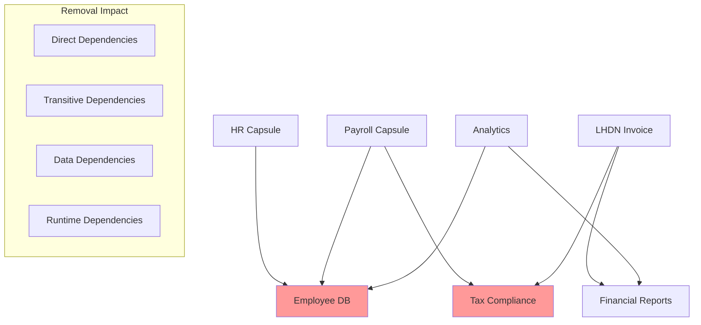

# Knowledge Capsule Removal Strategy

Removing Knowledge Capsules presents one of the most complex challenges in the system due to intricate dependency relationships, data interconnections, and the need to maintain system integrity. This document outlines comprehensive strategies for safe capsule removal.

## The Removal Challenge

### Core Problems

1. **Dependency Entanglement**: Capsules may depend on each other in complex ways
2. **Orphaned References**: Removal may leave dangling references in other capsules
3. **Data Consistency**: Shared data structures may become inconsistent
4. **Cascade Effects**: Removing one capsule may require removing others
5. **Runtime Safety**: Active processes may be using the capsule
6. **Rollback Complexity**: Undoing a removal may be impossible without full system restoration



## Dependency Graph Tracking

### Comprehensive Dependency Model

The system maintains a multi-layered dependency graph to understand all relationships:

```typescript
interface DependencyRelationship {
  id: string;
  sourceId: string;        // Capsule that depends
  targetId: string;        // Capsule being depended upon
  type: DependencyType;    // Nature of dependency
  strength: DependencyStrength;  // How critical is this dependency
  bidirectional: boolean;  // Is this a mutual dependency
  metadata: DependencyMetadata;
}

enum DependencyType {
  DIRECT = 'direct',           // Explicit dependency in manifest
  TRANSITIVE = 'transitive',   // Indirect dependency through chain
  DATA = 'data',               // Shared data structures
  RUNTIME = 'runtime',         // Runtime service calls
  KNOWLEDGE = 'knowledge',     // Shared knowledge assets
  CONFIGURATION = 'configuration' // Shared configuration
}

enum DependencyStrength {
  CRITICAL = 'critical',       // Cannot function without
  IMPORTANT = 'important',     // Degraded functionality without
  OPTIONAL = 'optional',       // Nice to have
  DEVELOPMENTAL = 'developmental' // Only needed for development
}

interface DependencyMetadata {
  createdAt: Date;
  usageFrequency: number;      // How often is this dependency used
  lastAccessed: Date;
  accessPattern: string[];     // Which functions/features use it
  alternativeOptions: string[]; // Alternative capsules that could replace
  migrationComplexity: 'low' | 'medium' | 'high';
}
```

### Dynamic Dependency Discovery

The system continuously discovers dependencies through runtime analysis:

```typescript
class DependencyTracker {
  private dependencyGraph: Map<string, Set<DependencyRelationship>>;
  private accessLogger: AccessLogger;
  private runtimeAnalyzer: RuntimeAnalyzer;
  
  async discoverRuntimeDependencies(capsuleId: string): Promise<DependencyRelationship[]> {
    // Monitor API calls and service interactions
    const apiCalls = await this.accessLogger.getApiCalls(capsuleId, {
      timeframe: '30d',
      includeInternal: true
    });
    
    // Analyze data access patterns
    const dataAccess = await this.runtimeAnalyzer.analyzeDataAccess(capsuleId);
    
    // Track knowledge base queries
    const knowledgeQueries = await this.runtimeAnalyzer.analyzeKnowledgeQueries(capsuleId);
    
    const dependencies: DependencyRelationship[] = [];
    
    // Process API call dependencies
    for (const call of apiCalls) {
      if (this.isInternalCapsuleCall(call.endpoint)) {
        const targetCapsule = this.extractCapsuleFromEndpoint(call.endpoint);
        
        dependencies.push({
          id: uuid(),
          sourceId: capsuleId,
          targetId: targetCapsule,
          type: DependencyType.RUNTIME,
          strength: this.calculateDependencyStrength(call.frequency, call.criticality),
          bidirectional: await this.checkBidirectional(capsuleId, targetCapsule),
          metadata: {
            createdAt: new Date(),
            usageFrequency: call.frequency,
            lastAccessed: call.lastAccessed,
            accessPattern: call.patterns,
            alternativeOptions: await this.findAlternatives(targetCapsule),
            migrationComplexity: 'medium'
          }
        });
      }
    }
    
    // Process data dependencies
    for (const access of dataAccess) {
      if (access.sharedWithCapsules.length > 0) {
        for (const sharedCapsule of access.sharedWithCapsules) {
          dependencies.push({
            id: uuid(),
            sourceId: capsuleId,
            targetId: sharedCapsule,
            type: DependencyType.DATA,
            strength: DependencyStrength.IMPORTANT,
            bidirectional: true,
            metadata: {
              createdAt: new Date(),
              usageFrequency: access.frequency,
              lastAccessed: access.lastAccessed,
              accessPattern: [access.operation],
              alternativeOptions: [],
              migrationComplexity: 'high'
            }
          });
        }
      }
    }
    
    return dependencies;
  }
  
  async buildRemovalImpactGraph(capsuleId: string): Promise<RemovalImpactGraph> {
    const directDependents = await this.getDirectDependents(capsuleId);
    const transitiveImpact = await this.calculateTransitiveImpact(capsuleId);
    const dataImpact = await this.calculateDataImpact(capsuleId);
    
    return {
      targetCapsule: capsuleId,
      directlyAffected: directDependents,
      transitivelyAffected: transitiveImpact,
      dataAffected: dataImpact,
      riskScore: this.calculateRemovalRisk(directDependents, transitiveImpact, dataImpact),
      estimatedDowntime: this.estimateDowntime(directDependents),
      migrationOptions: await this.findMigrationOptions(capsuleId)
    };
  }
}
```

## Orphaned Reference Detection

### Reference Tracking System

The system maintains comprehensive reference tracking to detect and handle orphaned references:

```typescript
class ReferenceTracker {
  async scanForReferences(capsuleId: string): Promise<ReferenceMap> {
    const references: ReferenceMap = {
      codeReferences: [],
      configReferences: [],
      dataReferences: [],
      knowledgeReferences: [],
      apiReferences: []
    };
    
    // Scan code references
    references.codeReferences = await this.scanCodeReferences(capsuleId);
    
    // Scan configuration files
    references.configReferences = await this.scanConfigReferences(capsuleId);
    
    // Scan database references
    references.dataReferences = await this.scanDataReferences(capsuleId);
    
    // Scan knowledge base references
    references.knowledgeReferences = await this.scanKnowledgeReferences(capsuleId);
    
    // Scan API endpoint references
    references.apiReferences = await this.scanApiReferences(capsuleId);
    
    return references;
  }
  
  private async scanCodeReferences(capsuleId: string): Promise<CodeReference[]> {
    const allCapsules = await this.getAllActiveCapsules();
    const references: CodeReference[] = [];
    
    for (const capsule of allCapsules) {
      if (capsule.id === capsuleId) continue;
      
      const sourceFiles = await this.getCapsuleSourceFiles(capsule.id);
      
      for (const file of sourceFiles) {
        const content = await this.readFile(file.path);
        
        // Search for various reference patterns
        const patterns = [
          new RegExp(`import.*from.*['"\`]${capsuleId}['"\`]`, 'g'),
          new RegExp(`require\\(['"\`]${capsuleId}['"\`]\\)`, 'g'),
          new RegExp(`aimatrix\\.capsules\\['"\`]${capsuleId}['"\`]`, 'g'),
          new RegExp(`getCapsule\\(['"\`]${capsuleId}['"\`]\\)`, 'g')
        ];
        
        for (const pattern of patterns) {
          const matches = content.match(pattern);
          if (matches) {
            references.push({
              referencingCapsule: capsule.id,
              filePath: file.path,
              lineNumbers: this.findLineNumbers(content, pattern),
              context: this.extractContext(content, pattern),
              referenceType: this.classifyReference(pattern),
              severity: this.assessReferenceSeverity(pattern, content)
            });
          }
        }
      }
    }
    
    return references;
  }
  
  private async scanDataReferences(capsuleId: string): Promise<DataReference[]> {
    const references: DataReference[] = [];
    
    // Check database foreign key references
    const fkReferences = await this.supabase
      .from('information_schema.table_constraints')
      .select('*')
      .eq('constraint_type', 'FOREIGN KEY')
      .contains('constraint_name', capsuleId);
    
    for (const fk of fkReferences.data || []) {
      references.push({
        type: 'foreign_key',
        table: fk.table_name,
        column: fk.column_name,
        referencedTable: fk.referenced_table_name,
        referencedColumn: fk.referenced_column_name,
        constraintName: fk.constraint_name,
        severity: 'critical'
      });
    }
    
    // Check vector embedding references
    const vectorReferences = await this.supabase
      .from('capsule_knowledge_assets')
      .select('*')
      .textSearch('metadata', capsuleId);
    
    for (const vector of vectorReferences.data || []) {
      references.push({
        type: 'vector_embedding',
        assetId: vector.id,
        capsuleId: vector.capsule_id,
        embeddingPath: vector.asset_path,
        severity: 'important'
      });
    }
    
    return references;
  }
}
```

## Soft Delete vs Hard Delete

### Soft Delete Implementation

Soft delete provides safety by marking capsules as removed without actually deleting data:

```typescript
class SoftDeleteManager {
  async softDeleteCapsule(
    capsuleId: string,
    organizationId: string,
    reason: string
  ): Promise<SoftDeleteResult> {
    
    const transaction = await this.beginTransaction();
    
    try {
      // 1. Validate removal is safe
      const impactAnalysis = await this.analyzeRemovalImpact(capsuleId);
      if (impactAnalysis.riskLevel === 'critical' && !this.hasAdminOverride()) {
        throw new Error('Cannot remove capsule: critical dependencies detected');
      }
      
      // 2. Create removal snapshot
      const snapshot = await this.createRemovalSnapshot(capsuleId, organizationId);
      
      // 3. Update status to 'soft_removed'
      await this.supabase
        .from('capsule_installations')
        .update({
          installation_status: 'soft_removed',
          soft_delete_reason: reason,
          soft_delete_at: new Date().toISOString(),
          removal_snapshot_id: snapshot.id
        })
        .eq('capsule_id', capsuleId)
        .eq('organization_id', organizationId);
      
      // 4. Disable capsule services but keep data
      await this.disableCapsuleServices(capsuleId, organizationId);
      
      // 5. Update dependency graph
      await this.markDependenciesAsOrphaned(capsuleId);
      
      // 6. Schedule cleanup job
      await this.scheduleHardDeleteJob(capsuleId, organizationId, {
        gracePeroid: '30d', // 30 days before hard delete
        conditions: ['no_dependent_capsules', 'no_active_references']
      });
      
      await transaction.commit();
      
      // 7. Log soft delete event
      await this.eventStore.appendEvent({
        capsuleId,
        organizationId,
        eventType: 'soft_removed',
        payload: {
          reason,
          snapshotId: snapshot.id,
          impactLevel: impactAnalysis.riskLevel,
          affectedCapsules: impactAnalysis.directlyAffected.map(c => c.id)
        },
        timestamp: new Date()
      });
      
      return {
        success: true,
        snapshotId: snapshot.id,
        scheduledHardDelete: new Date(Date.now() + 30 * 24 * 60 * 60 * 1000),
        affectedCapsules: impactAnalysis.directlyAffected.length
      };
      
    } catch (error) {
      await transaction.rollback();
      
      return {
        success: false,
        error: error.message,
        impactAnalysis
      };
    }
  }
  
  async restoreSoftDeletedCapsule(
    capsuleId: string,
    organizationId: string
  ): Promise<RestoreResult> {
    
    const installation = await this.getInstallation(capsuleId, organizationId);
    
    if (installation.installation_status !== 'soft_removed') {
      throw new Error('Capsule is not in soft-removed state');
    }
    
    try {
      // 1. Restore from snapshot
      const snapshot = await this.getRemovalSnapshot(installation.removal_snapshot_id);
      await this.restoreFromSnapshot(snapshot);
      
      // 2. Re-enable services
      await this.enableCapsuleServices(capsuleId, organizationId);
      
      // 3. Update status back to active
      await this.supabase
        .from('capsule_installations')
        .update({
          installation_status: 'active',
          soft_delete_reason: null,
          soft_delete_at: null,
          removal_snapshot_id: null,
          restored_at: new Date().toISOString()
        })
        .eq('capsule_id', capsuleId)
        .eq('organization_id', organizationId);
      
      // 4. Restore dependency relationships
      await this.restoreDependencyRelationships(capsuleId);
      
      // 5. Cancel scheduled hard delete
      await this.cancelHardDeleteJob(capsuleId, organizationId);
      
      // 6. Log restoration event
      await this.eventStore.appendEvent({
        capsuleId,
        organizationId,
        eventType: 'restored',
        payload: {
          restoredFrom: 'soft_delete',
          snapshotId: installation.removal_snapshot_id
        },
        timestamp: new Date()
      });
      
      return {
        success: true,
        restoredAt: new Date(),
        snapshotCleaned: false // Keep snapshot for audit
      };
      
    } catch (error) {
      return {
        success: false,
        error: error.message
      };
    }
  }
}
```

### Hard Delete Implementation

Hard delete permanently removes all traces of a capsule:

```typescript
class HardDeleteManager {
  async hardDeleteCapsule(
    capsuleId: string,
    organizationId: string,
    options: HardDeleteOptions
  ): Promise<HardDeleteResult> {
    
    // Validate hard delete is safe
    const currentDependents = await this.getCurrentDependents(capsuleId);
    if (currentDependents.length > 0 && !options.force) {
      throw new Error(`Cannot hard delete: ${currentDependents.length} dependents still active`);
    }
    
    const deletionPlan = await this.createDeletionPlan(capsuleId, organizationId);
    const transaction = await this.beginTransaction();
    
    try {
      // 1. Final backup before deletion
      const finalBackup = await this.createFinalBackup(capsuleId, organizationId);
      
      // 2. Clean up dependent references
      await this.cleanupDependentReferences(capsuleId, deletionPlan.references);
      
      // 3. Remove knowledge assets
      await this.removeKnowledgeAssets(capsuleId, organizationId);
      
      // 4. Remove vector embeddings
      await this.removeVectorEmbeddings(capsuleId);
      
      // 5. Remove database data
      await this.removeDatabaseData(capsuleId, organizationId, deletionPlan.dataTables);
      
      // 6. Remove file system data
      await this.removeFileSystemData(capsuleId, organizationId);
      
      // 7. Remove configuration
      await this.removeConfiguration(capsuleId, organizationId);
      
      // 8. Remove installation record
      await this.supabase
        .from('capsule_installations')
        .delete()
        .eq('capsule_id', capsuleId)
        .eq('organization_id', organizationId);
      
      // 9. Clean up dependency graph
      await this.cleanupDependencyGraph(capsuleId);
      
      // 10. Remove from search indexes
      await this.removeFromSearchIndexes(capsuleId);
      
      await transaction.commit();
      
      // 11. Log final deletion event (to audit trail, not capsule events)
      await this.auditStore.logDeletion({
        capsuleId,
        organizationId,
        deletedAt: new Date(),
        deletionPlan,
        finalBackupId: finalBackup.id,
        performedBy: options.userId
      });
      
      return {
        success: true,
        deletedItems: deletionPlan.itemCount,
        backupId: finalBackup.id,
        backupRetentionUntil: new Date(Date.now() + 365 * 24 * 60 * 60 * 1000) // 1 year
      };
      
    } catch (error) {
      await transaction.rollback();
      
      return {
        success: false,
        error: error.message,
        partialDeletion: true,
        recoverable: await this.checkRecoverability(capsuleId, organizationId)
      };
    }
  }
  
  private async cleanupDependentReferences(
    capsuleId: string,
    references: Reference[]
  ): Promise<void> {
    
    for (const reference of references) {
      switch (reference.type) {
        case 'code_reference':
          await this.handleCodeReference(reference as CodeReference);
          break;
        case 'config_reference':
          await this.handleConfigReference(reference as ConfigReference);
          break;
        case 'data_reference':
          await this.handleDataReference(reference as DataReference);
          break;
        case 'api_reference':
          await this.handleApiReference(reference as ApiReference);
          break;
      }
    }
  }
  
  private async handleCodeReference(reference: CodeReference): Promise<void> {
    // Strategy depends on reference type and severity
    switch (reference.severity) {
      case 'critical':
        // Replace with stub implementation
        await this.replaceWithStub(reference);
        break;
      case 'important':
        // Comment out and add warning
        await this.commentOutWithWarning(reference);
        break;
      case 'optional':
        // Remove reference entirely
        await this.removeReference(reference);
        break;
    }
  }
}
```

## Knowledge Deprecation Strategies

### Gradual Deprecation Process

```typescript
class DeprecationManager {
  async initiateDeprecation(
    capsuleId: string,
    deprecationPlan: DeprecationPlan
  ): Promise<DeprecationResult> {
    
    const phases: DeprecationPhase[] = [
      {
        name: 'announcement',
        duration: '30d',
        actions: ['notify_users', 'update_docs', 'log_deprecation_warning']
      },
      {
        name: 'warning_period',
        duration: '60d',
        actions: ['show_warnings', 'suggest_alternatives', 'collect_migration_feedback']
      },
      {
        name: 'migration_assistance',
        duration: '90d',
        actions: ['provide_migration_tools', 'offer_support', 'monitor_adoption']
      },
      {
        name: 'soft_removal',
        duration: '30d',
        actions: ['disable_new_installations', 'maintain_existing', 'final_warnings']
      },
      {
        name: 'hard_removal',
        duration: 'immediate',
        actions: ['remove_capsule', 'cleanup_data', 'archive_documentation']
      }
    ];
    
    for (const phase of phases) {
      await this.executeDeprecationPhase(capsuleId, phase);
      await this.waitForPhaseCompletion(phase.duration);
    }
    
    return {
      success: true,
      totalDuration: phases.reduce((sum, p) => sum + this.parseDuration(p.duration), 0),
      migratedUsers: await this.getMigrationStats(capsuleId)
    };
  }
  
  async executeDeprecationPhase(
    capsuleId: string,
    phase: DeprecationPhase
  ): Promise<void> {
    
    switch (phase.name) {
      case 'announcement':
        await this.sendDeprecationNotifications(capsuleId);
        await this.updateMarketplaceListing(capsuleId, 'deprecated');
        break;
        
      case 'warning_period':
        await this.enableDeprecationWarnings(capsuleId);
        await this.suggestAlternatives(capsuleId);
        break;
        
      case 'migration_assistance':
        await this.deployMigrationTools(capsuleId);
        await this.offerMigrationSupport(capsuleId);
        break;
        
      case 'soft_removal':
        await this.disableNewInstallations(capsuleId);
        await this.sendFinalWarnings(capsuleId);
        break;
        
      case 'hard_removal':
        await this.removeCapsuleFromMarketplace(capsuleId);
        await this.beginRemovalProcess(capsuleId);
        break;
    }
  }
}
```

## Gradual Phase-Out Mechanisms

### Progressive Functionality Reduction

```typescript
class PhaseOutManager {
  async createPhaseOutPlan(capsuleId: string): Promise<PhaseOutPlan> {
    const currentUsage = await this.analyzeCurrentUsage(capsuleId);
    const features = await this.getCapsuleFeatures(capsuleId);
    const alternatives = await this.findAlternativeFeatures(capsuleId);
    
    const plan: PhaseOutPlan = {
      capsuleId,
      phases: [],
      totalDuration: 0,
      migrationSupport: true
    };
    
    // Group features by usage and criticality
    const featureGroups = this.groupFeaturesByImportance(features, currentUsage);
    
    for (const [importance, featureGroup] of featureGroups) {
      const phase: PhaseOutPhase = {
        name: `phase_out_${importance}`,
        features: featureGroup,
        duration: this.calculatePhaseDuration(importance, featureGroup.length),
        actions: this.determinePhaseActions(importance, featureGroup),
        alternatives: alternatives.filter(alt => 
          featureGroup.some(feature => alt.replacesFeature === feature.id)
        )
      };
      
      plan.phases.push(phase);
      plan.totalDuration += phase.duration;
    }
    
    return plan;
  }
  
  async executePhaseOut(plan: PhaseOutPlan): Promise<PhaseOutResult> {
    const results: PhaseOutPhaseResult[] = [];
    
    for (const phase of plan.phases) {
      const phaseResult = await this.executePhaseOutPhase(phase);
      results.push(phaseResult);
      
      if (!phaseResult.success) {
        // Pause phase-out and notify administrators
        await this.pausePhaseOut(plan.capsuleId, phase.name, phaseResult.error);
        break;
      }
      
      // Wait for phase completion
      await this.monitorPhaseCompletion(phase);
    }
    
    return {
      success: results.every(r => r.success),
      phases: results,
      finalStatus: await this.getFinalCapsuleStatus(plan.capsuleId)
    };
  }
  
  private async executePhaseOutPhase(phase: PhaseOutPhase): Promise<PhaseOutPhaseResult> {
    try {
      for (const action of phase.actions) {
        await this.executePhaseOutAction(action, phase);
      }
      
      return {
        success: true,
        phase: phase.name,
        featuresDisabled: phase.features.length,
        usersImpacted: await this.countImpactedUsers(phase.features)
      };
      
    } catch (error) {
      return {
        success: false,
        phase: phase.name,
        error: error.message,
        rollbackRequired: true
      };
    }
  }
  
  private async executePhaseOutAction(action: PhaseOutAction, phase: PhaseOutPhase): Promise<void> {
    switch (action.type) {
      case 'disable_feature':
        await this.disableFeatures(action.targetFeatures);
        break;
        
      case 'redirect_to_alternative':
        await this.setupRedirects(action.targetFeatures, action.alternatives);
        break;
        
      case 'show_migration_notice':
        await this.enableMigrationNotices(action.targetFeatures);
        break;
        
      case 'reduce_functionality':
        await this.reduceFunctionality(action.targetFeatures, action.reductionLevel);
        break;
        
      case 'archive_data':
        await this.archiveFeatureData(action.targetFeatures);
        break;
    }
  }
}
```

## Impact Analysis Before Removal

### Comprehensive Impact Assessment

```typescript
class ImpactAnalyzer {
  async performComprehensiveAnalysis(capsuleId: string): Promise<RemovalImpactReport> {
    const report: RemovalImpactReport = {
      capsuleId,
      analysisTimestamp: new Date(),
      overallRisk: 'unknown',
      impacts: {
        technical: await this.analyzeTechnicalImpact(capsuleId),
        business: await this.analyzeBusinessImpact(capsuleId),
        user: await this.analyzeUserImpact(capsuleId),
        data: await this.analyzeDataImpact(capsuleId)
      },
      mitigation: await this.generateMitigationPlan(capsuleId),
      timeline: await this.generateRemovalTimeline(capsuleId),
      recommendations: []
    };
    
    // Calculate overall risk
    report.overallRisk = this.calculateOverallRisk(report.impacts);
    
    // Generate recommendations based on analysis
    report.recommendations = this.generateRecommendations(report);
    
    return report;
  }
  
  private async analyzeTechnicalImpact(capsuleId: string): Promise<TechnicalImpact> {
    const dependencies = await this.getDependencyGraph(capsuleId);
    const integrations = await this.getIntegrationPoints(capsuleId);
    const services = await this.getProvidedServices(capsuleId);
    
    return {
      dependentCapsules: dependencies.dependents.length,
      criticalDependencies: dependencies.dependents.filter(d => d.strength === 'critical').length,
      integrationPoints: integrations.length,
      providedServices: services.length,
      estimatedDowntime: this.calculateDowntime(dependencies, integrations, services),
      rollbackComplexity: this.assessRollbackComplexity(dependencies),
      alternativesSufficiency: await this.assessAlternatives(capsuleId)
    };
  }
  
  private async analyzeBusinessImpact(capsuleId: string): Promise<BusinessImpact> {
    const usage = await this.getBusinessUsage(capsuleId);
    const processes = await this.getBusinessProcesses(capsuleId);
    const revenue = await this.getRevenueImpact(capsuleId);
    
    return {
      affectedOrganizations: usage.organizationCount,
      affectedUsers: usage.userCount,
      criticalProcesses: processes.filter(p => p.criticality === 'critical').length,
      businessContinuityRisk: this.assessBusinessContinuityRisk(processes),
      revenueImpact: revenue.estimated,
      complianceRisk: await this.assessComplianceRisk(capsuleId),
      customerSatisfactionRisk: this.assessCustomerSatisfactionRisk(usage)
    };
  }
  
  private async generateMitigationPlan(capsuleId: string): Promise<MitigationPlan> {
    const alternatives = await this.findAlternativeCapsules(capsuleId);
    const migrationPaths = await this.identifyMigrationPaths(capsuleId);
    const riskReduction = await this.identifyRiskReductionMeasures(capsuleId);
    
    return {
      alternatives,
      migrationPaths,
      riskReductionMeasures: riskReduction,
      estimatedMigrationEffort: this.calculateMigrationEffort(migrationPaths),
      successProbability: this.calculateMigrationSuccessProbability(alternatives, migrationPaths),
      contingencyPlans: await this.developContingencyPlans(capsuleId)
    };
  }
  
  async generateRemovalTimeline(capsuleId: string): Promise<RemovalTimeline> {
    const impact = await this.analyzeTechnicalImpact(capsuleId);
    const businessImpact = await this.analyzeBusinessImpact(capsuleId);
    
    const timeline: RemovalTimeline = {
      phases: [
        {
          name: 'Impact Assessment & Planning',
          duration: 14, // days
          activities: [
            'Complete impact analysis',
            'Identify migration paths',
            'Prepare alternatives',
            'Stakeholder communication'
          ]
        },
        {
          name: 'Migration Preparation',
          duration: 30,
          activities: [
            'Set up alternative capsules',
            'Create migration tools',
            'Test migration procedures',
            'Train support team'
          ]
        },
        {
          name: 'User Migration',
          duration: this.calculateMigrationDuration(businessImpact.affectedUsers),
          activities: [
            'Begin user migration',
            'Monitor migration progress',
            'Provide migration support',
            'Address migration issues'
          ]
        },
        {
          name: 'Soft Removal',
          duration: 30,
          activities: [
            'Disable new installations',
            'Mark as deprecated',
            'Final migration push',
            'Monitor for issues'
          ]
        },
        {
          name: 'Hard Removal',
          duration: 7,
          activities: [
            'Final data backup',
            'Remove capsule',
            'Clean up references',
            'Archive documentation'
          ]
        }
      ],
      totalDuration: 0,
      criticalPath: [],
      dependencies: []
    };
    
    timeline.totalDuration = timeline.phases.reduce((sum, phase) => sum + phase.duration, 0);
    timeline.criticalPath = this.identifyCriticalPath(timeline.phases);
    timeline.dependencies = this.identifyTimelineDependencies(timeline.phases);
    
    return timeline;
  }
}
```

## Event Sourcing for Reversibility

### Complete Audit Trail

The removal strategy leverages event sourcing to maintain a complete audit trail and enable reversibility:

```typescript
class RemovalEventSourcing {
  async createRemovalEventStream(
    capsuleId: string,
    organizationId: string
  ): Promise<RemovalEventStream> {
    
    const streamId = `removal:${capsuleId}:${organizationId}`;
    
    return {
      streamId,
      events: [],
      checkpoints: [],
      reversibilityIndex: new Map(),
      
      async appendEvent(event: RemovalEvent): Promise<void> {
        // Add reversibility information to each event
        event.reversibilityInfo = await this.calculateReversibility(event);
        
        this.events.push(event);
        this.reversibilityIndex.set(event.id, event.reversibilityInfo);
        
        // Store in event store
        await this.eventStore.append(streamId, event);
        
        // Create checkpoint if needed
        if (event.type === 'phase_completed') {
          await this.createCheckpoint(streamId, event);
        }
      },
      
      async reverseToCheckpoint(checkpointId: string): Promise<ReversalResult> {
        const checkpoint = this.checkpoints.find(c => c.id === checkpointId);
        if (!checkpoint) {
          throw new Error(`Checkpoint ${checkpointId} not found`);
        }
        
        const eventsToReverse = this.events.filter(e => 
          e.timestamp > checkpoint.timestamp
        ).reverse();
        
        const reversalResults: EventReversalResult[] = [];
        
        for (const event of eventsToReverse) {
          const reversalResult = await this.reverseEvent(event);
          reversalResults.push(reversalResult);
          
          if (!reversalResult.success) {
            // Stop reversal and report partial success
            return {
              success: false,
              partialReversal: true,
              reversedEvents: reversalResults.filter(r => r.success).length,
              error: reversalResult.error
            };
          }
        }
        
        return {
          success: true,
          reversedEvents: reversalResults.length,
          restoredToCheckpoint: checkpointId
        };
      }
    };
  }
  
  private async reverseEvent(event: RemovalEvent): Promise<EventReversalResult> {
    const reversibility = this.reversibilityIndex.get(event.id);
    
    if (!reversibility || !reversibility.reversible) {
      return {
        success: false,
        eventId: event.id,
        error: 'Event is not reversible',
        reason: reversibility?.irreversibilityReason
      };
    }
    
    try {
      switch (event.type) {
        case 'soft_deleted':
          await this.reverseSoftDelete(event);
          break;
        case 'configuration_removed':
          await this.restoreConfiguration(event);
          break;
        case 'dependencies_updated':
          await this.restoreDependencies(event);
          break;
        case 'data_archived':
          await this.restoreData(event);
          break;
        case 'services_disabled':
          await this.restoreServices(event);
          break;
        default:
          throw new Error(`Unknown event type: ${event.type}`);
      }
      
      return {
        success: true,
        eventId: event.id,
        restoredState: event.previousState
      };
      
    } catch (error) {
      return {
        success: false,
        eventId: event.id,
        error: error.message
      };
    }
  }
}
```

This comprehensive removal strategy ensures that Knowledge Capsules can be safely removed while maintaining system integrity, providing multiple safety mechanisms, and enabling recovery when necessary. The combination of dependency analysis, impact assessment, gradual phase-out, and event sourcing creates a robust framework for managing the complex challenge of capsule removal.