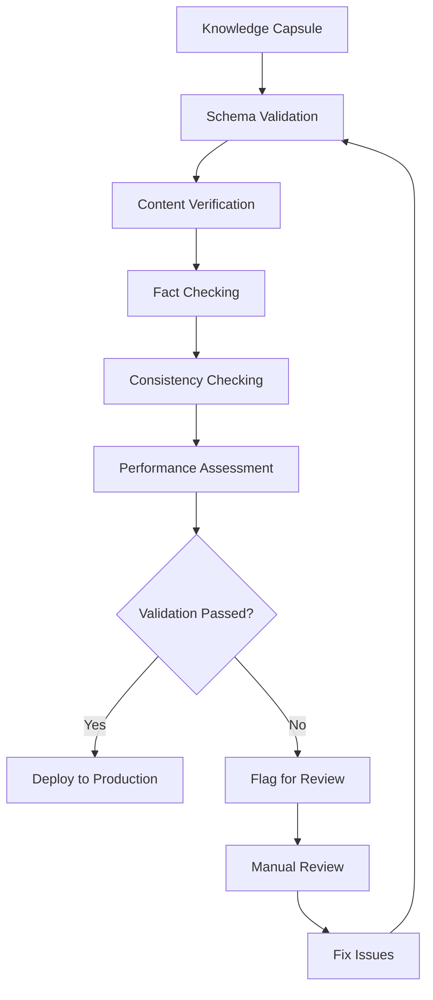

# Validation Framework

Implement comprehensive automated validation pipelines to ensure knowledge capsule quality, consistency, and reliability.

## Architecture Overview



## Validation Pipeline Components

### 1. Schema Validation

Ensure all knowledge capsules conform to the expected structure.

```sql
-- Supabase function for schema validation
CREATE OR REPLACE FUNCTION validate_capsule_schema(capsule_data JSONB)
RETURNS TABLE(is_valid BOOLEAN, errors TEXT[])
LANGUAGE plpgsql
AS $$
DECLARE
    required_fields TEXT[] := ARRAY['id', 'title', 'content', 'metadata', 'version'];
    field TEXT;
    validation_errors TEXT[] := '{}';
BEGIN
    -- Check required fields
    FOREACH field IN ARRAY required_fields
    LOOP
        IF NOT (capsule_data ? field) THEN
            validation_errors := array_append(validation_errors, 
                'Missing required field: ' || field);
        END IF;
    END LOOP;
    
    -- Validate metadata structure
    IF capsule_data ? 'metadata' THEN
        IF NOT (capsule_data->'metadata' ? 'tags') THEN
            validation_errors := array_append(validation_errors, 
                'Metadata missing required tags field');
        END IF;
    END IF;
    
    -- Return validation results
    RETURN QUERY SELECT 
        array_length(validation_errors, 1) IS NULL OR array_length(validation_errors, 1) = 0,
        validation_errors;
END;
$$;
```

### 2. Content Verification

Validate content quality, format, and completeness.

```typescript
// Edge function for content validation
import { serve } from 'https://deno.land/std@0.168.0/http/server.ts'
import { createClient } from 'https://esm.sh/@supabase/supabase-js@2'

interface ValidationResult {
  isValid: boolean;
  errors: string[];
  warnings: string[];
}

const validateContent = async (content: string, metadata: any): Promise<ValidationResult> => {
  const errors: string[] = [];
  const warnings: string[] = [];
  
  // Content length validation
  if (content.length < 50) {
    errors.push('Content too short (minimum 50 characters)');
  }
  
  if (content.length > 10000) {
    warnings.push('Content very long (over 10,000 characters)');
  }
  
  // Check for required sections
  const requiredSections = ['description', 'examples'];
  requiredSections.forEach(section => {
    if (!content.toLowerCase().includes(section)) {
      warnings.push(`Missing recommended section: ${section}`);
    }
  });
  
  // Validate links and references
  const urlRegex = /(https?:\/\/[^\s]+)/g;
  const urls = content.match(urlRegex) || [];
  
  for (const url of urls) {
    try {
      const response = await fetch(url, { method: 'HEAD' });
      if (!response.ok) {
        errors.push(`Broken link detected: ${url}`);
      }
    } catch {
      errors.push(`Unable to verify link: ${url}`);
    }
  }
  
  return {
    isValid: errors.length === 0,
    errors,
    warnings
  };
};

serve(async (req) => {
  const { content, metadata } = await req.json();
  const result = await validateContent(content, metadata);
  
  return new Response(JSON.stringify(result), {
    headers: { 'Content-Type': 'application/json' }
  });
});
```

### 3. Fact Checking Against Trusted Sources

Validate information accuracy against authoritative sources.

```typescript
// Fact checking service
interface TrustedSource {
  id: string;
  name: string;
  baseUrl: string;
  apiKey?: string;
  reliability: number; // 0-1 scale
}

class FactChecker {
  private trustedSources: TrustedSource[];
  
  constructor(sources: TrustedSource[]) {
    this.trustedSources = sources;
  }
  
  async verifyFacts(claims: string[]): Promise<FactCheckResult[]> {
    const results: FactCheckResult[] = [];
    
    for (const claim of claims) {
      const verification = await this.checkClaim(claim);
      results.push(verification);
    }
    
    return results;
  }
  
  private async checkClaim(claim: string): Promise<FactCheckResult> {
    // Use vector similarity to find related facts in trusted sources
    const supabase = createClient(
      Deno.env.get('SUPABASE_URL')!,
      Deno.env.get('SUPABASE_ANON_KEY')!
    );
    
    const { data: similarFacts } = await supabase
      .rpc('match_trusted_facts', {
        query_embedding: await this.getEmbedding(claim),
        match_threshold: 0.8,
        match_count: 5
      });
    
    return {
      claim,
      isSupported: similarFacts && similarFacts.length > 0,
      confidence: this.calculateConfidence(similarFacts),
      sources: similarFacts?.map(fact => fact.source) || []
    };
  }
}

interface FactCheckResult {
  claim: string;
  isSupported: boolean;
  confidence: number;
  sources: string[];
}
```

### 4. Consistency Checking Across Capsules

Detect and flag inconsistencies between related knowledge capsules.

```sql
-- Consistency checking function
CREATE OR REPLACE FUNCTION check_capsule_consistency(capsule_id UUID)
RETURNS TABLE(
    related_capsule_id UUID,
    inconsistency_type TEXT,
    description TEXT,
    severity TEXT
)
LANGUAGE plpgsql
AS $$
BEGIN
    -- Find related capsules using vector similarity
    RETURN QUERY
    WITH related_capsules AS (
        SELECT 
            kc.id,
            kc.title,
            kc.content,
            kc.metadata,
            1 - (kc.embedding <=> (SELECT embedding FROM knowledge_capsules WHERE id = capsule_id)) as similarity
        FROM knowledge_capsules kc
        WHERE kc.id != capsule_id
        AND 1 - (kc.embedding <=> (SELECT embedding FROM knowledge_capsules WHERE id = capsule_id)) > 0.7
    ),
    conflicts AS (
        -- Check for conflicting information
        SELECT 
            rc.id as related_id,
            'content_conflict' as type,
            'Potential conflicting information detected' as desc,
            CASE 
                WHEN rc.similarity > 0.9 THEN 'HIGH'
                WHEN rc.similarity > 0.8 THEN 'MEDIUM'
                ELSE 'LOW'
            END as sev
        FROM related_capsules rc
        -- Add more specific conflict detection logic here
    )
    SELECT * FROM conflicts;
END;
$$;
```

### 5. Performance Impact Assessment

Evaluate how knowledge changes affect system performance.

```typescript
// Performance impact analyzer
interface PerformanceMetrics {
  responseTime: number;
  memoryUsage: number;
  cpuUsage: number;
  accuracyScore: number;
}

class PerformanceAnalyzer {
  async assessImpact(
    oldCapsule: KnowledgeCapsule,
    newCapsule: KnowledgeCapsule
  ): Promise<ImpactAssessment> {
    
    const baseline = await this.getBaselineMetrics(oldCapsule);
    const updated = await this.simulatePerformance(newCapsule);
    
    return {
      responseTimeDelta: updated.responseTime - baseline.responseTime,
      memoryImpact: updated.memoryUsage - baseline.memoryUsage,
      accuracyChange: updated.accuracyScore - baseline.accuracyScore,
      recommendation: this.generateRecommendation(baseline, updated)
    };
  }
  
  private generateRecommendation(
    baseline: PerformanceMetrics,
    updated: PerformanceMetrics
  ): string {
    if (updated.responseTime > baseline.responseTime * 1.2) {
      return 'WARNING: Significant performance degradation detected';
    }
    
    if (updated.accuracyScore < baseline.accuracyScore * 0.95) {
      return 'CAUTION: Accuracy may be compromised';
    }
    
    return 'Update appears safe to deploy';
  }
}

interface ImpactAssessment {
  responseTimeDelta: number;
  memoryImpact: number;
  accuracyChange: number;
  recommendation: string;
}
```

## Real-World Examples

### LHDN E-Invoice Knowledge Updates

```typescript
// Specialized validator for LHDN regulations
class LHDNValidator {
  async validateEInvoiceUpdate(capsule: KnowledgeCapsule): Promise<ValidationResult> {
    const checks = [
      this.validateEffectiveDate(capsule),
      this.checkComplianceRequirements(capsule),
      this.verifyFormatSpecifications(capsule),
      this.validateBusinessRules(capsule)
    ];
    
    const results = await Promise.all(checks);
    
    return {
      isValid: results.every(r => r.isValid),
      errors: results.flatMap(r => r.errors),
      warnings: results.flatMap(r => r.warnings)
    };
  }
  
  private async validateEffectiveDate(capsule: KnowledgeCapsule): Promise<ValidationResult> {
    const effectiveDate = capsule.metadata.effectiveDate;
    const now = new Date();
    
    if (new Date(effectiveDate) <= now) {
      return {
        isValid: false,
        errors: ['Effective date must be in the future for regulatory updates'],
        warnings: []
      };
    }
    
    return { isValid: true, errors: [], warnings: [] };
  }
}
```

### HR Policy Validation

```sql
-- HR policy specific validation
CREATE OR REPLACE FUNCTION validate_hr_policy(policy_data JSONB)
RETURNS TABLE(is_valid BOOLEAN, issues TEXT[])
LANGUAGE plpgsql
AS $$
DECLARE
    validation_issues TEXT[] := '{}';
    approval_required BOOLEAN;
BEGIN
    -- Check for sensitive policy changes
    IF policy_data->>'type' IN ('compensation', 'termination', 'disciplinary') THEN
        approval_required := TRUE;
        validation_issues := array_append(validation_issues, 
            'Policy type requires legal review and HR director approval');
    END IF;
    
    -- Validate policy effective date
    IF (policy_data->>'effective_date')::DATE <= CURRENT_DATE THEN
        validation_issues := array_append(validation_issues, 
            'Policy effective date should be at least 30 days in future');
    END IF;
    
    -- Check for required sections
    IF NOT (policy_data ? 'purpose' AND policy_data ? 'scope' AND policy_data ? 'procedures') THEN
        validation_issues := array_append(validation_issues, 
            'HR policy missing required sections: purpose, scope, or procedures');
    END IF;
    
    RETURN QUERY SELECT 
        array_length(validation_issues, 1) IS NULL OR array_length(validation_issues, 1) = 0,
        validation_issues;
END;
$$;
```

## Integration with Supabase

### Real-time Validation Updates

```typescript
// Real-time validation status updates
const supabase = createClient(supabaseUrl, supabaseAnonKey);

// Subscribe to validation status changes
const subscription = supabase
  .channel('validation-updates')
  .on(
    'postgres_changes',
    {
      event: 'UPDATE',
      schema: 'public',
      table: 'knowledge_capsules',
      filter: 'validation_status=eq.processing'
    },
    (payload) => {
      console.log('Validation status updated:', payload);
      updateValidationDashboard(payload);
    }
  )
  .subscribe();
```

### Vector Search for Similarity Detection

```sql
-- Enhanced similarity search for validation
CREATE OR REPLACE FUNCTION find_similar_capsules_for_validation(
    target_embedding vector(1536),
    similarity_threshold FLOAT DEFAULT 0.8,
    exclude_ids UUID[] DEFAULT '{}'
)
RETURNS TABLE(
    capsule_id UUID,
    similarity_score FLOAT,
    potential_conflict BOOLEAN,
    conflict_type TEXT
)
LANGUAGE plpgsql
AS $$
BEGIN
    RETURN QUERY
    SELECT 
        kc.id,
        1 - (kc.embedding <=> target_embedding) as similarity,
        CASE 
            WHEN kc.metadata->>'domain' = 'regulations' 
            AND 1 - (kc.embedding <=> target_embedding) > 0.9 
            THEN TRUE
            ELSE FALSE
        END as potential_conflict,
        CASE 
            WHEN kc.metadata->>'domain' = 'regulations' THEN 'regulatory_overlap'
            WHEN kc.metadata->>'type' = 'policy' THEN 'policy_conflict'
            ELSE 'content_similarity'
        END as conflict_type
    FROM knowledge_capsules kc
    WHERE 1 - (kc.embedding <=> target_embedding) > similarity_threshold
    AND NOT (kc.id = ANY(exclude_ids))
    ORDER BY similarity DESC;
END;
$$;
```

## Best Practices

### 1. Layered Validation
- Start with schema validation
- Progress to content verification
- End with domain-specific checks

### 2. Configurable Rules
- Make validation rules configurable by domain
- Allow for different severity levels
- Enable custom validation functions

### 3. Performance Optimization
- Use async validation where possible
- Implement caching for expensive checks
- Batch similar validations together

### 4. Error Reporting
- Provide clear, actionable error messages
- Include suggested fixes where possible
- Log validation metrics for analysis

## Monitoring and Alerts

Set up monitoring for validation pipeline health:

- Validation success rates
- Processing times
- Error patterns
- Manual review queue length
- Performance impact metrics