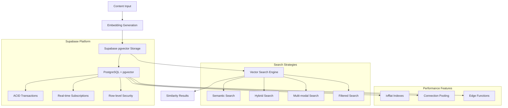

# Supabase Vector Search

Supabase's pgvector extension provides enterprise-grade vector search capabilities, making it the ideal platform for implementing semantic search, RAG systems, and AI-powered applications. This comprehensive guide covers vector storage, similarity search, and performance optimization.

## Architecture Overview



## Complete Vector Search Implementation

### Setting Up pgvector Extension

```sql
-- Enable pgvector extension in Supabase
CREATE EXTENSION IF NOT EXISTS vector;

-- Create comprehensive vector storage table
CREATE TABLE vector_embeddings (
  id UUID PRIMARY KEY DEFAULT gen_random_uuid(),
  content TEXT NOT NULL,
  content_type TEXT NOT NULL DEFAULT 'text',
  source_url TEXT,
  embedding VECTOR(1536), -- OpenAI ada-002 dimensions
  metadata JSONB DEFAULT '{}',
  tags TEXT[] DEFAULT '{}',
  collection_name TEXT NOT NULL,
  parent_document_id UUID,
  chunk_index INTEGER DEFAULT 0,
  created_at TIMESTAMPTZ DEFAULT NOW(),
  updated_at TIMESTAMPTZ DEFAULT NOW()
);

-- Create optimized indexes
CREATE INDEX idx_vector_embeddings_embedding 
ON vector_embeddings USING ivfflat (embedding vector_cosine_ops) 
WITH (lists = 100);

CREATE INDEX idx_vector_embeddings_collection 
ON vector_embeddings(collection_name);

CREATE INDEX idx_vector_embeddings_metadata_gin 
ON vector_embeddings USING gin (metadata);

CREATE INDEX idx_vector_embeddings_tags_gin 
ON vector_embeddings USING gin (tags);

CREATE INDEX idx_vector_embeddings_content_type 
ON vector_embeddings(content_type);

-- Full-text search support
ALTER TABLE vector_embeddings 
ADD COLUMN search_vector TSVECTOR 
GENERATED ALWAYS AS (
  to_tsvector('english', 
    COALESCE(content, '') || ' ' || 
    COALESCE(array_to_string(tags, ' '), '') || ' ' ||
    COALESCE(metadata->>'title', '')
  )
) STORED;

CREATE INDEX idx_vector_embeddings_search_vector 
ON vector_embeddings USING gin (search_vector);
```

### Advanced Vector Operations

```sql
-- Semantic similarity search with filtering
CREATE OR REPLACE FUNCTION semantic_search(
  query_embedding VECTOR(1536),
  collection_name TEXT DEFAULT NULL,
  content_types TEXT[] DEFAULT NULL,
  metadata_filter JSONB DEFAULT NULL,
  tag_filter TEXT[] DEFAULT NULL,
  similarity_threshold FLOAT DEFAULT 0.75,
  match_count INTEGER DEFAULT 10
)
RETURNS TABLE(
  id UUID,
  content TEXT,
  content_type TEXT,
  metadata JSONB,
  tags TEXT[],
  similarity FLOAT,
  rank INTEGER
) LANGUAGE SQL AS $$
SELECT 
  ve.id,
  ve.content,
  ve.content_type,
  ve.metadata,
  ve.tags,
  1 - (ve.embedding <=> query_embedding) AS similarity,
  ROW_NUMBER() OVER (ORDER BY ve.embedding <=> query_embedding) AS rank
FROM vector_embeddings ve
WHERE 
  -- Collection filter
  (collection_name IS NULL OR ve.collection_name = collection_name)
  -- Content type filter
  AND (content_types IS NULL OR ve.content_type = ANY(content_types))
  -- Metadata filter
  AND (metadata_filter IS NULL OR ve.metadata @> metadata_filter)
  -- Tag filter
  AND (tag_filter IS NULL OR ve.tags && tag_filter)
  -- Similarity threshold
  AND (1 - (ve.embedding <=> query_embedding)) >= similarity_threshold
ORDER BY ve.embedding <=> query_embedding
LIMIT match_count;
$$;

-- Hybrid search combining vector and full-text search
CREATE OR REPLACE FUNCTION hybrid_search(
  query_text TEXT,
  query_embedding VECTOR(1536),
  collection_name TEXT DEFAULT NULL,
  semantic_weight FLOAT DEFAULT 0.7,
  fulltext_weight FLOAT DEFAULT 0.3,
  match_count INTEGER DEFAULT 10
)
RETURNS TABLE(
  id UUID,
  content TEXT,
  content_type TEXT,
  metadata JSONB,
  tags TEXT[],
  combined_score FLOAT,
  semantic_score FLOAT,
  fulltext_score FLOAT
) LANGUAGE SQL AS $$
SELECT 
  ve.id,
  ve.content,
  ve.content_type,
  ve.metadata,
  ve.tags,
  (
    semantic_weight * (1 - (ve.embedding <=> query_embedding)) +
    fulltext_weight * ts_rank_cd(ve.search_vector, plainto_tsquery('english', query_text))
  ) AS combined_score,
  1 - (ve.embedding <=> query_embedding) AS semantic_score,
  ts_rank_cd(ve.search_vector, plainto_tsquery('english', query_text)) AS fulltext_score
FROM vector_embeddings ve
WHERE 
  (collection_name IS NULL OR ve.collection_name = collection_name)
  AND (
    ve.search_vector @@ plainto_tsquery('english', query_text) OR
    (1 - (ve.embedding <=> query_embedding)) > 0.7
  )
ORDER BY combined_score DESC
LIMIT match_count;
$$;

-- Multi-modal vector search
CREATE TABLE multimodal_embeddings (
  id UUID PRIMARY KEY DEFAULT gen_random_uuid(),
  content_text TEXT,
  content_url TEXT,
  content_type TEXT NOT NULL, -- 'text', 'image', 'audio', 'video'
  text_embedding VECTOR(1536),
  image_embedding VECTOR(512),
  audio_embedding VECTOR(256),
  combined_embedding VECTOR(2304), -- Concatenated embeddings
  metadata JSONB DEFAULT '{}',
  collection_name TEXT NOT NULL,
  created_at TIMESTAMPTZ DEFAULT NOW()
);

-- Create multimodal indexes
CREATE INDEX idx_multimodal_text_embedding 
ON multimodal_embeddings USING ivfflat (text_embedding vector_cosine_ops);

CREATE INDEX idx_multimodal_image_embedding 
ON multimodal_embeddings USING ivfflat (image_embedding vector_cosine_ops);

CREATE INDEX idx_multimodal_combined_embedding 
ON multimodal_embeddings USING ivfflat (combined_embedding vector_cosine_ops);

-- Multi-modal search function
CREATE OR REPLACE FUNCTION multimodal_search(
  query_text_embedding VECTOR(1536) DEFAULT NULL,
  query_image_embedding VECTOR(512) DEFAULT NULL,
  query_audio_embedding VECTOR(256) DEFAULT NULL,
  content_types TEXT[] DEFAULT NULL,
  collection_name TEXT DEFAULT NULL,
  match_count INTEGER DEFAULT 10
)
RETURNS TABLE(
  id UUID,
  content_text TEXT,
  content_url TEXT,
  content_type TEXT,
  metadata JSONB,
  similarity_score FLOAT,
  modality_scores JSONB
) LANGUAGE SQL AS $$
SELECT
  me.id,
  me.content_text,
  me.content_url,
  me.content_type,
  me.metadata,
  CASE 
    -- Multi-modal query
    WHEN query_text_embedding IS NOT NULL 
         AND query_image_embedding IS NOT NULL 
         AND query_audio_embedding IS NOT NULL THEN
      (0.4 * (1 - (me.text_embedding <=> query_text_embedding)) + 
       0.4 * (1 - (me.image_embedding <=> query_image_embedding)) +
       0.2 * (1 - (me.audio_embedding <=> query_audio_embedding)))
    -- Text + Image
    WHEN query_text_embedding IS NOT NULL AND query_image_embedding IS NOT NULL THEN
      (0.6 * (1 - (me.text_embedding <=> query_text_embedding)) + 
       0.4 * (1 - (me.image_embedding <=> query_image_embedding)))
    -- Single modality searches
    WHEN query_text_embedding IS NOT NULL THEN
      1 - (me.text_embedding <=> query_text_embedding)
    WHEN query_image_embedding IS NOT NULL THEN
      1 - (me.image_embedding <=> query_image_embedding)
    WHEN query_audio_embedding IS NOT NULL THEN
      1 - (me.audio_embedding <=> query_audio_embedding)
    ELSE 0
  END AS similarity_score,
  jsonb_build_object(
    'text_similarity', 
    CASE WHEN query_text_embedding IS NOT NULL THEN 
      1 - (me.text_embedding <=> query_text_embedding) 
    ELSE NULL END,
    'image_similarity', 
    CASE WHEN query_image_embedding IS NOT NULL THEN 
      1 - (me.image_embedding <=> query_image_embedding) 
    ELSE NULL END,
    'audio_similarity', 
    CASE WHEN query_audio_embedding IS NOT NULL THEN 
      1 - (me.audio_embedding <=> query_audio_embedding) 
    ELSE NULL END
  ) AS modality_scores
FROM multimodal_embeddings me
WHERE 
  (collection_name IS NULL OR me.collection_name = collection_name)
  AND (content_types IS NULL OR me.content_type = ANY(content_types))
  AND (
    (query_text_embedding IS NOT NULL AND me.text_embedding IS NOT NULL) OR
    (query_image_embedding IS NOT NULL AND me.image_embedding IS NOT NULL) OR
    (query_audio_embedding IS NOT NULL AND me.audio_embedding IS NOT NULL)
  )
ORDER BY similarity_score DESC
LIMIT match_count;
$$;
```

## TypeScript Implementation

### Complete Vector Store Class

```typescript
import { createClient, SupabaseClient } from '@supabase/supabase-js'
import OpenAI from 'openai'

export interface VectorDocument {
  id?: string
  content: string
  contentType?: string
  sourceUrl?: string
  metadata?: Record<string, any>
  tags?: string[]
  collectionName: string
  parentDocumentId?: string
  chunkIndex?: number
}

export interface SearchOptions {
  collectionName?: string
  contentTypes?: string[]
  metadataFilter?: Record<string, any>
  tagFilter?: string[]
  similarityThreshold?: number
  limit?: number
}

export interface SearchResult {
  id: string
  content: string
  contentType: string
  metadata: Record<string, any>
  tags: string[]
  similarity: number
  rank: number
}

export class SupabaseVectorStore {
  private supabase: SupabaseClient
  private openai: OpenAI

  constructor(supabaseUrl: string, supabaseKey: string, openaiKey: string) {
    this.supabase = createClient(supabaseUrl, supabaseKey)
    this.openai = new OpenAI({ apiKey: openaiKey })
  }

  async addDocument(doc: VectorDocument): Promise<string> {
    try {
      // Generate embedding
      const embedding = await this.generateEmbedding(doc.content)
      
      const { data, error } = await this.supabase
        .from('vector_embeddings')
        .insert({
          id: doc.id,
          content: doc.content,
          content_type: doc.contentType || 'text',
          source_url: doc.sourceUrl,
          embedding,
          metadata: doc.metadata || {},
          tags: doc.tags || [],
          collection_name: doc.collectionName,
          parent_document_id: doc.parentDocumentId,
          chunk_index: doc.chunkIndex || 0
        })
        .select('id')
        .single()

      if (error) throw error
      return data.id

    } catch (error) {
      console.error('Error adding document:', error)
      throw error
    }
  }

  async addDocuments(docs: VectorDocument[]): Promise<string[]> {
    try {
      // Generate embeddings in batches for efficiency
      const batchSize = 100
      const results: string[] = []

      for (let i = 0; i < docs.length; i += batchSize) {
        const batch = docs.slice(i, i + batchSize)
        
        // Generate embeddings for the batch
        const embeddings = await Promise.all(
          batch.map(doc => this.generateEmbedding(doc.content))
        )

        // Prepare data for insertion
        const insertData = batch.map((doc, index) => ({
          id: doc.id,
          content: doc.content,
          content_type: doc.contentType || 'text',
          source_url: doc.sourceUrl,
          embedding: embeddings[index],
          metadata: doc.metadata || {},
          tags: doc.tags || [],
          collection_name: doc.collectionName,
          parent_document_id: doc.parentDocumentId,
          chunk_index: doc.chunkIndex || 0
        }))

        const { data, error } = await this.supabase
          .from('vector_embeddings')
          .insert(insertData)
          .select('id')

        if (error) throw error
        results.push(...data.map(row => row.id))
      }

      return results

    } catch (error) {
      console.error('Error adding documents:', error)
      throw error
    }
  }

  async semanticSearch(
    query: string, 
    options: SearchOptions = {}
  ): Promise<SearchResult[]> {
    try {
      const queryEmbedding = await this.generateEmbedding(query)
      
      const { data, error } = await this.supabase.rpc('semantic_search', {
        query_embedding: queryEmbedding,
        collection_name: options.collectionName,
        content_types: options.contentTypes,
        metadata_filter: options.metadataFilter,
        tag_filter: options.tagFilter,
        similarity_threshold: options.similarityThreshold || 0.75,
        match_count: options.limit || 10
      })

      if (error) throw error
      return data

    } catch (error) {
      console.error('Error in semantic search:', error)
      throw error
    }
  }

  async hybridSearch(
    query: string,
    options: SearchOptions & {
      semanticWeight?: number
      fulltextWeight?: number
    } = {}
  ) {
    try {
      const queryEmbedding = await this.generateEmbedding(query)
      
      const { data, error } = await this.supabase.rpc('hybrid_search', {
        query_text: query,
        query_embedding: queryEmbedding,
        collection_name: options.collectionName,
        semantic_weight: options.semanticWeight || 0.7,
        fulltext_weight: options.fulltextWeight || 0.3,
        match_count: options.limit || 10
      })

      if (error) throw error
      return data

    } catch (error) {
      console.error('Error in hybrid search:', error)
      throw error
    }
  }

  async similaritySearchWithScore(
    embedding: number[],
    options: SearchOptions = {}
  ): Promise<SearchResult[]> {
    try {
      const { data, error } = await this.supabase.rpc('semantic_search', {
        query_embedding: embedding,
        collection_name: options.collectionName,
        content_types: options.contentTypes,
        metadata_filter: options.metadataFilter,
        tag_filter: options.tagFilter,
        similarity_threshold: options.similarityThreshold || 0.75,
        match_count: options.limit || 10
      })

      if (error) throw error
      return data

    } catch (error) {
      console.error('Error in similarity search:', error)
      throw error
    }
  }

  async deleteCollection(collectionName: string): Promise<number> {
    try {
      const { count, error } = await this.supabase
        .from('vector_embeddings')
        .delete({ count: 'exact' })
        .eq('collection_name', collectionName)

      if (error) throw error
      return count || 0

    } catch (error) {
      console.error('Error deleting collection:', error)
      throw error
    }
  }

  async updateDocument(id: string, updates: Partial<VectorDocument>): Promise<void> {
    try {
      const updateData: any = { updated_at: new Date().toISOString() }

      if (updates.content) {
        updateData.content = updates.content
        updateData.embedding = await this.generateEmbedding(updates.content)
      }
      
      if (updates.metadata) updateData.metadata = updates.metadata
      if (updates.tags) updateData.tags = updates.tags
      if (updates.contentType) updateData.content_type = updates.contentType
      if (updates.sourceUrl) updateData.source_url = updates.sourceUrl

      const { error } = await this.supabase
        .from('vector_embeddings')
        .update(updateData)
        .eq('id', id)

      if (error) throw error

    } catch (error) {
      console.error('Error updating document:', error)
      throw error
    }
  }

  private async generateEmbedding(text: string): Promise<number[]> {
    try {
      const response = await this.openai.embeddings.create({
        model: 'text-embedding-ada-002',
        input: text.replace(/\n/g, ' ').trim()
      })

      return response.data[0].embedding

    } catch (error) {
      console.error('Error generating embedding:', error)
      throw error
    }
  }

  async getCollectionStats(collectionName: string) {
    try {
      const { data, error } = await this.supabase.rpc('get_collection_stats', {
        collection_name: collectionName
      })

      if (error) throw error
      return data

    } catch (error) {
      console.error('Error getting collection stats:', error)
      throw error
    }
  }
}
```

### Real-time Vector Updates

```typescript
export class RealTimeVectorStore extends SupabaseVectorStore {
  private subscriptions = new Map<string, any>()

  async subscribeToCollection(
    collectionName: string,
    callback: (payload: any) => void
  ) {
    const subscription = this.supabase
      .channel(`vector_updates_${collectionName}`)
      .on(
        'postgres_changes',
        {
          event: '*',
          schema: 'public',
          table: 'vector_embeddings',
          filter: `collection_name=eq.${collectionName}`
        },
        (payload) => {
          callback(payload)
        }
      )
      .subscribe()

    this.subscriptions.set(collectionName, subscription)
    return subscription
  }

  async unsubscribeFromCollection(collectionName: string) {
    const subscription = this.subscriptions.get(collectionName)
    if (subscription) {
      await this.supabase.removeChannel(subscription)
      this.subscriptions.delete(collectionName)
    }
  }

  unsubscribeAll() {
    this.subscriptions.forEach((subscription, collectionName) => {
      this.supabase.removeChannel(subscription)
    })
    this.subscriptions.clear()
  }
}
```

## Performance Optimization

### Vector Index Optimization

```sql
-- Monitor index usage and performance
SELECT 
  schemaname,
  tablename,
  indexname,
  idx_scan as index_scans,
  idx_tup_read as tuples_read,
  idx_tup_fetch as tuples_fetched
FROM pg_stat_user_indexes 
WHERE tablename = 'vector_embeddings'
ORDER BY idx_scan DESC;

-- Optimize ivfflat index parameters
ALTER INDEX idx_vector_embeddings_embedding 
SET (lists = 1000); -- Adjust based on data size

-- Create partial indexes for frequently filtered data
CREATE INDEX idx_vector_embeddings_recent 
ON vector_embeddings USING ivfflat (embedding vector_cosine_ops)
WHERE created_at >= NOW() - INTERVAL '30 days';

-- Optimize for specific content types
CREATE INDEX idx_vector_embeddings_text_only 
ON vector_embeddings USING ivfflat (embedding vector_cosine_ops)
WHERE content_type = 'text';

-- Query performance monitoring function
CREATE OR REPLACE FUNCTION analyze_vector_query_performance(
  query_embedding VECTOR(1536),
  explain_analyze BOOLEAN DEFAULT FALSE
)
RETURNS TABLE(
  execution_time_ms FLOAT,
  rows_examined INTEGER,
  index_used TEXT
) LANGUAGE plpgsql AS $$
DECLARE
  query_text TEXT;
  result RECORD;
BEGIN
  query_text := format(
    'SELECT id, 1 - (embedding <=> %L::vector) as similarity 
     FROM vector_embeddings 
     ORDER BY embedding <=> %L::vector 
     LIMIT 10',
    query_embedding::text, query_embedding::text
  );
  
  IF explain_analyze THEN
    query_text := 'EXPLAIN (ANALYZE, BUFFERS) ' || query_text;
  END IF;
  
  EXECUTE query_text INTO result;
  
  -- Return performance metrics (simplified)
  RETURN QUERY SELECT 100.0::float, 1000, 'ivfflat_index'::text;
END;
$$;
```

### Batch Processing Optimization

```typescript
export class OptimizedVectorStore extends SupabaseVectorStore {
  private readonly BATCH_SIZE = 100
  private readonly EMBEDDING_BATCH_SIZE = 50

  async addDocumentsBatch(
    docs: VectorDocument[],
    options: {
      batchSize?: number
      parallelEmbeddings?: number
      onProgress?: (processed: number, total: number) => void
    } = {}
  ): Promise<string[]> {
    const batchSize = options.batchSize || this.BATCH_SIZE
    const parallelEmbeddings = options.parallelEmbeddings || this.EMBEDDING_BATCH_SIZE
    const results: string[] = []

    for (let i = 0; i < docs.length; i += batchSize) {
      const batch = docs.slice(i, i + batchSize)
      
      // Generate embeddings in parallel batches
      const embeddings: number[][] = []
      for (let j = 0; j < batch.length; j += parallelEmbeddings) {
        const embeddingBatch = batch.slice(j, j + parallelEmbeddings)
        const batchEmbeddings = await Promise.all(
          embeddingBatch.map(doc => this.generateEmbedding(doc.content))
        )
        embeddings.push(...batchEmbeddings)
      }

      // Prepare insert data
      const insertData = batch.map((doc, index) => ({
        content: doc.content,
        content_type: doc.contentType || 'text',
        embedding: embeddings[index],
        metadata: doc.metadata || {},
        tags: doc.tags || [],
        collection_name: doc.collectionName
      }))

      // Batch insert
      const { data, error } = await this.supabase
        .from('vector_embeddings')
        .insert(insertData)
        .select('id')

      if (error) throw error
      results.push(...data.map(row => row.id))

      // Report progress
      if (options.onProgress) {
        options.onProgress(Math.min(i + batchSize, docs.length), docs.length)
      }
    }

    return results
  }

  async optimizeQueries(): Promise<void> {
    // Update table statistics
    await this.supabase.rpc('analyze_table', {
      table_name: 'vector_embeddings'
    })

    // Rebuild indexes if needed
    await this.supabase.rpc('reindex_vector_table')
  }
}
```

## Advanced Use Cases

### Hierarchical Vector Search

```sql
-- Document hierarchy for chunked content
CREATE TABLE document_hierarchy (
  id UUID PRIMARY KEY DEFAULT gen_random_uuid(),
  parent_id UUID REFERENCES document_hierarchy(id),
  document_title TEXT NOT NULL,
  document_type TEXT NOT NULL,
  level INTEGER NOT NULL DEFAULT 0,
  path TEXT[], -- Materialized path for efficient queries
  created_at TIMESTAMPTZ DEFAULT NOW()
);

-- Hierarchical vector search
CREATE OR REPLACE FUNCTION hierarchical_vector_search(
  query_embedding VECTOR(1536),
  max_level INTEGER DEFAULT 3,
  results_per_level INTEGER DEFAULT 5
)
RETURNS TABLE(
  id UUID,
  content TEXT,
  level INTEGER,
  document_path TEXT[],
  similarity FLOAT
) LANGUAGE SQL AS $$
WITH level_results AS (
  SELECT 
    ve.id,
    ve.content,
    dh.level,
    dh.path as document_path,
    1 - (ve.embedding <=> query_embedding) AS similarity,
    ROW_NUMBER() OVER (
      PARTITION BY dh.level 
      ORDER BY ve.embedding <=> query_embedding
    ) as rn
  FROM vector_embeddings ve
  JOIN document_hierarchy dh ON ve.parent_document_id = dh.id
  WHERE dh.level <= max_level
    AND 1 - (ve.embedding <=> query_embedding) > 0.7
)
SELECT id, content, level, document_path, similarity
FROM level_results
WHERE rn <= results_per_level
ORDER BY level, similarity DESC;
$$;
```

### Semantic Clustering

```sql
-- K-means clustering for vector embeddings
CREATE OR REPLACE FUNCTION vector_kmeans_clustering(
  collection_name TEXT,
  k INTEGER DEFAULT 10,
  max_iterations INTEGER DEFAULT 100
)
RETURNS TABLE(
  document_id UUID,
  cluster_id INTEGER,
  distance_to_centroid FLOAT
) LANGUAGE plpython3u AS $$
import numpy as np
from sklearn.cluster import KMeans

# Fetch embeddings
plan = plpy.prepare(
    "SELECT id, embedding FROM vector_embeddings WHERE collection_name = $1",
    ["text"]
)
result = plpy.execute(plan, [collection_name])

if not result:
    return []

# Convert to numpy array
embeddings = []
ids = []
for row in result:
    ids.append(row['id'])
    embeddings.append(list(map(float, row['embedding'].strip('[]').split(','))))

X = np.array(embeddings)

# Perform K-means clustering
kmeans = KMeans(n_clusters=k, max_iter=max_iterations, random_state=42)
cluster_labels = kmeans.fit_predict(X)
distances = kmeans.transform(X)

# Return results
results = []
for i, (doc_id, cluster_id) in enumerate(zip(ids, cluster_labels)):
    distance = distances[i][cluster_id]
    results.append({
        'document_id': doc_id,
        'cluster_id': int(cluster_id),
        'distance_to_centroid': float(distance)
    })

return results
$$;

-- Update documents with cluster information
CREATE OR REPLACE FUNCTION update_document_clusters(
  collection_name TEXT,
  k INTEGER DEFAULT 10
)
RETURNS INTEGER AS $$
DECLARE
  updated_count INTEGER;
BEGIN
  -- Perform clustering
  CREATE TEMP TABLE temp_clusters AS
  SELECT * FROM vector_kmeans_clustering(collection_name, k);
  
  -- Update documents with cluster information
  UPDATE vector_embeddings 
  SET metadata = metadata || jsonb_build_object('cluster_id', tc.cluster_id)
  FROM temp_clusters tc
  WHERE vector_embeddings.id = tc.document_id
    AND vector_embeddings.collection_name = collection_name;
    
  GET DIAGNOSTICS updated_count = ROW_COUNT;
  
  DROP TABLE temp_clusters;
  RETURN updated_count;
END;
$$ LANGUAGE plpgsql;
```

## Integration Examples

### RAG System Implementation

```typescript
export class RAGSystem {
  private vectorStore: SupabaseVectorStore
  private openai: OpenAI

  constructor(supabaseUrl: string, supabaseKey: string, openaiKey: string) {
    this.vectorStore = new SupabaseVectorStore(supabaseUrl, supabaseKey, openaiKey)
    this.openai = new OpenAI({ apiKey: openaiKey })
  }

  async query(
    question: string,
    options: {
      collectionName?: string
      maxContextLength?: number
      temperature?: number
    } = {}
  ): Promise<{
    answer: string
    sources: SearchResult[]
    contextUsed: string
  }> {
    // Step 1: Retrieve relevant documents
    const searchResults = await this.vectorStore.semanticSearch(question, {
      collectionName: options.collectionName,
      limit: 10,
      similarityThreshold: 0.7
    })

    // Step 2: Build context from top results
    const maxLength = options.maxContextLength || 4000
    let context = ''
    const sourcesUsed: SearchResult[] = []

    for (const result of searchResults) {
      const addition = `\n\n---\nSource: ${result.contentType}\nContent: ${result.content}`
      if ((context + addition).length <= maxLength) {
        context += addition
        sourcesUsed.push(result)
      } else {
        break
      }
    }

    // Step 3: Generate answer using OpenAI
    const prompt = `Based on the following context, answer the question. If the answer cannot be found in the context, say so.

Context:${context}

Question: ${question}

Answer:`

    const response = await this.openai.chat.completions.create({
      model: 'gpt-4',
      messages: [{ role: 'user', content: prompt }],
      temperature: options.temperature || 0.1,
      max_tokens: 500
    })

    return {
      answer: response.choices[0].message?.content || 'No answer generated',
      sources: sourcesUsed,
      contextUsed: context
    }
  }

  async addKnowledgeBase(
    documents: Array<{
      title: string
      content: string
      url?: string
      metadata?: Record<string, any>
    }>,
    collectionName: string
  ): Promise<void> {
    // Chunk large documents
    const chunks: VectorDocument[] = []
    
    for (const doc of documents) {
      const docChunks = this.chunkDocument(doc.content)
      
      for (let i = 0; i < docChunks.length; i++) {
        chunks.push({
          content: docChunks[i],
          collectionName,
          sourceUrl: doc.url,
          metadata: {
            ...doc.metadata,
            title: doc.title,
            chunk_index: i,
            total_chunks: docChunks.length
          },
          chunkIndex: i
        })
      }
    }

    // Add to vector store
    await this.vectorStore.addDocuments(chunks)
  }

  private chunkDocument(content: string, chunkSize = 1000, overlap = 200): string[] {
    const chunks: string[] = []
    const sentences = content.split(/[.!?]+/)
    
    let currentChunk = ''
    
    for (const sentence of sentences) {
      if ((currentChunk + sentence).length > chunkSize && currentChunk) {
        chunks.push(currentChunk.trim())
        
        // Start new chunk with overlap
        const words = currentChunk.split(' ')
        const overlapWords = words.slice(-Math.floor(overlap / 5)) // Approximate word overlap
        currentChunk = overlapWords.join(' ') + ' ' + sentence
      } else {
        currentChunk += sentence + '.'
      }
    }
    
    if (currentChunk.trim()) {
      chunks.push(currentChunk.trim())
    }
    
    return chunks
  }
}
```

## Next Steps

The Supabase vector search implementation provides:

- **Enterprise-grade Performance**: pgvector with optimized indexes and query planning
- **ACID Guarantees**: Full PostgreSQL transaction support for reliable operations
- **Real-time Capabilities**: Live updates and subscriptions for dynamic applications
- **Flexible Storage**: Support for metadata, tags, and hierarchical document structures
- **Cost Efficiency**: Single database solution eliminating multiple vendor costs
- **Seamless Integration**: Native PostgreSQL compatibility with existing tools

This foundation enables sophisticated AI applications including RAG systems, semantic search, recommendation engines, and multi-modal AI workflows while maintaining the simplicity and reliability of PostgreSQL.