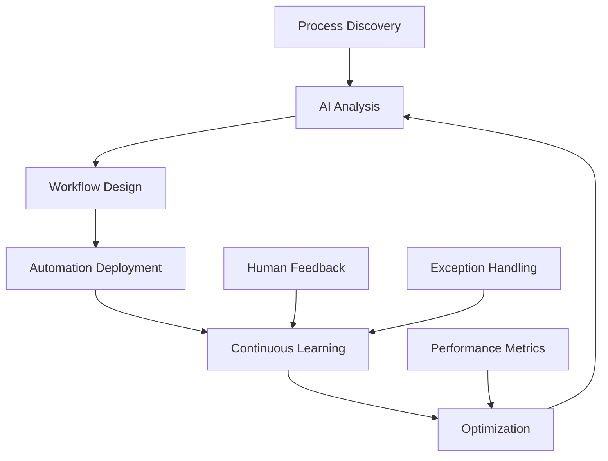

# Intelligent Automation

## Beyond Traditional Automation

Intelligent Automation in AIMatrix combines the power of AI with process automation to create self-improving workflows that adapt to your business needs. Unlike traditional RPA (Robotic Process Automation) that follows rigid rules, our intelligent automation learns from patterns, handles exceptions, and continuously optimizes itself.

## Key Capabilities

### 🧠 Cognitive Automation
- **Natural Language Understanding**: Process unstructured documents and emails
- **Computer Vision**: Automate visual tasks like invoice processing
- **Decision Intelligence**: Make complex decisions based on multiple factors
- **Pattern Recognition**: Identify trends and anomalies automatically

### 🔄 Adaptive Workflows
- **Self-Healing Processes**: Automatically fix broken workflows
- **Dynamic Routing**: Intelligently route tasks based on context
- **Exception Handling**: Learn from exceptions to prevent future issues
- **Continuous Optimization**: Improve efficiency over time

### 📊 Process Intelligence
- **Process Mining**: Discover actual process flows from data
- **Bottleneck Detection**: Identify and resolve process constraints
- **Compliance Monitoring**: Ensure processes follow regulations
- **Performance Analytics**: Real-time process metrics and KPIs

## How It Works



## Process Mining & Discovery

### Automatic Process Discovery

AIMatrix can automatically discover your existing business processes by analyzing:
- System logs and event data
- User interactions
- Email flows
- Document trails

```python
from aimatrix.automation import ProcessMiner

# Discover processes from BigLedger data
miner = ProcessMiner()
processes = miner.discover(
    data_source="bigledger_logs",
    timeframe="last_90_days",
    min_frequency=10  # Processes occurring at least 10 times
)

# Visualize discovered processes
for process in processes:
    print(f"Process: {process.name}")
    print(f"  Steps: {process.step_count}")
    print(f"  Avg Duration: {process.avg_duration}")
    print(f"  Automation Potential: {process.automation_score}%")
```

### Process Optimization Recommendations

Based on discovered processes, AIMatrix provides:
- Automation opportunities
- Bottleneck resolutions
- Process standardization suggestions
- Compliance gap analysis

## Workflow Automation

### Visual Workflow Designer

Create intelligent workflows using our drag-and-drop designer:

```yaml
# Example: Intelligent Invoice Processing Workflow
workflow:
  name: "Smart Invoice Processing"
  trigger: 
    type: "email"
    condition: "attachment contains invoice"
  
  steps:
    - extract_data:
        method: "ai_ocr"
        confidence_threshold: 0.95
        
    - validate:
        rules:
          - amount > 0
          - vendor_exists_in_system
          - po_number_valid
        
    - decision:
        if: "amount > 10000"
        then: "manager_approval"
        else: "auto_approve"
        
    - process_payment:
        method: "bigledger_integration"
        
    - notify:
        channels: ["email", "slack"]
        recipients: ["finance_team"]
```

### Intelligent Task Routing

Route tasks intelligently based on:
- Workload balancing
- Skill matching
- Priority scoring
- Historical performance

```python
# Intelligent routing example
from aimatrix.automation import SmartRouter

router = SmartRouter()

# Configure routing rules
router.add_rule(
    condition="customer.tier == 'platinum'",
    route_to="senior_team",
    priority="high"
)

router.add_ml_routing(
    model="skill_matcher",
    factors=["complexity", "language", "technical_level"]
)

# Route a task
task = {"type": "support_ticket", "complexity": "high", ...}
assigned_to = router.route(task)
print(f"Task routed to: {assigned_to}")
```

## RPA with AI Enhancement

### Traditional RPA vs Intelligent RPA

| Aspect | Traditional RPA | AIMatrix Intelligent RPA |
|--------|----------------|-------------------------|
| **Adaptability** | Breaks with UI changes | Self-adapts to changes |
| **Data Handling** | Structured only | Structured & unstructured |
| **Decision Making** | Rule-based only | AI-powered decisions |
| **Learning** | No learning | Continuous improvement |
| **Exception Handling** | Stops on exceptions | Learns from exceptions |

### Example: Intelligent Data Entry

```python
from aimatrix.automation import IntelligentRPA

# Create intelligent RPA bot
bot = IntelligentRPA("DataEntryBot")

# Configure with AI capabilities
bot.enable_ocr()  # Read from images/PDFs
bot.enable_nlp()  # Understand context
bot.enable_ml()   # Learn patterns

# Process documents intelligently
@bot.task
def process_invoice(document):
    # AI extracts data even from poor quality scans
    data = bot.extract_data(document)
    
    # Validate using ML model
    if bot.validate_invoice(data):
        # Enter into BigLedger
        bot.enter_to_system("bigledger", data)
    else:
        # Intelligent exception handling
        bot.flag_for_review(data, bot.get_confidence_scores())
    
    return {"status": "processed", "confidence": bot.confidence}

# Deploy bot
bot.deploy(schedule="every_30_minutes")
```

## Decision Automation

### AI-Powered Decision Trees

Create intelligent decision trees that learn and adapt:

```python
from aimatrix.automation import DecisionEngine

engine = DecisionEngine()

# Define decision tree with ML enhancement
decision_tree = engine.create_tree(
    name="Credit Approval",
    learning_enabled=True
)

# Add decision nodes
decision_tree.add_node(
    id="credit_check",
    type="ml_prediction",
    model="credit_risk_model",
    inputs=["credit_score", "income", "debt_ratio"]
)

decision_tree.add_node(
    id="manual_review",
    condition="confidence < 0.8 OR amount > 50000"
)

# Deploy and monitor
decision_tree.deploy()
decision_tree.monitor_performance()
```

### Automated Approval Workflows

```python
# Smart approval workflow
approval_workflow = Workflow("Smart Approvals")

approval_workflow.add_step(
    "analyze_request",
    ai_model="approval_predictor",
    features=["amount", "department", "history", "urgency"]
)

approval_workflow.add_decision(
    "auto_approve_if",
    conditions=[
        "risk_score < 0.3",
        "amount < auto_approval_limit",
        "requester.history == 'good'"
    ]
)

approval_workflow.add_escalation(
    "escalate_to_manager",
    when="risk_score > 0.7 OR amount > threshold"
)
```

## Predictive Process Automation

### Anticipate and Act

AIMatrix doesn't just react—it predicts and prevents:

```python
from aimatrix.automation import PredictiveAutomation

predictor = PredictiveAutomation()

# Predict process failures
failure_prediction = predictor.predict_failure(
    process="order_fulfillment",
    lookahead_hours=24
)

if failure_prediction.probability > 0.7:
    # Proactively prevent failure
    predictor.take_preventive_action(
        action="allocate_additional_resources",
        target=failure_prediction.bottleneck
    )
```

### Demand-Driven Automation

Automatically scale processes based on predicted demand:

```python
# Demand-driven scaling
demand_predictor = DemandPredictor()

# Predict next week's order volume
predicted_volume = demand_predictor.predict(
    metric="order_volume",
    period="next_7_days"
)

# Automatically adjust automation capacity
if predicted_volume > current_capacity * 0.8:
    automation_platform.scale_up(
        processes=["order_processing", "inventory_check"],
        factor=1.5
    )
```

## Self-Healing Workflows

### Automatic Error Recovery

Workflows that fix themselves:

```python
@self_healing_workflow
def process_order(order):
    try:
        # Normal processing
        validate_order(order)
        check_inventory(order)
        process_payment(order)
        
    except InventoryError as e:
        # Self-healing: Try alternative suppliers
        alternative = find_alternative_supplier(order.items)
        if alternative:
            process_with_supplier(order, alternative)
        else:
            backorder_items(order)
            
    except PaymentError as e:
        # Self-healing: Retry with different gateway
        retry_payment_alternative_gateway(order)
        
    except Exception as e:
        # Learn from unknown errors
        log_for_learning(e)
        escalate_to_human(order, e)
```

## Continuous Optimization

### Performance Monitoring

Real-time monitoring and optimization:

```python
from aimatrix.automation import ProcessOptimizer

optimizer = ProcessOptimizer()

# Monitor all automated processes
metrics = optimizer.get_metrics(
    processes=["all"],
    metrics=["throughput", "error_rate", "cost", "duration"]
)

# Get optimization recommendations
recommendations = optimizer.analyze(metrics)

for rec in recommendations:
    print(f"Process: {rec.process}")
    print(f"Issue: {rec.issue}")
    print(f"Recommendation: {rec.action}")
    print(f"Expected Improvement: {rec.expected_improvement}%")
    
    # Auto-apply if confidence is high
    if rec.confidence > 0.9:
        optimizer.apply_optimization(rec)
```

## Integration with BigLedger

### Seamless Data Flow

```python
from aimatrix.automation import BigLedgerConnector

connector = BigLedgerConnector()

# Create automated sync
@automated_process(schedule="realtime")
def sync_orders_to_inventory():
    # Get new orders from BigLedger
    new_orders = connector.get_new_orders()
    
    # Process intelligently
    for order in new_orders:
        # AI predicts optimal fulfillment strategy
        strategy = ai_optimizer.get_fulfillment_strategy(order)
        
        # Execute strategy
        if strategy.type == "dropship":
            trigger_dropship_workflow(order)
        elif strategy.type == "warehouse":
            trigger_warehouse_workflow(order)
        else:
            trigger_custom_workflow(order, strategy)
        
        # Update BigLedger
        connector.update_order_status(order.id, "processing")
```

## Success Metrics

Track the impact of intelligent automation:

| Metric | Before Automation | After AIMatrix | Improvement |
|--------|------------------|----------------|-------------|
| Process Time | 45 minutes | 3 minutes | 93% faster |
| Error Rate | 12% | 0.5% | 96% reduction |
| Cost per Transaction | $15 | $0.75 | 95% savings |
| Employee Satisfaction | 65% | 92% | 27 points |
| Compliance Rate | 89% | 99.5% | Near perfect |

## Getting Started

### Quick Setup

1. **Identify Process**: Choose a repetitive process
2. **Record Process**: Let AIMatrix observe the process
3. **Review Automation**: Validate the suggested automation
4. **Deploy & Monitor**: Launch with confidence

```bash
# Install automation toolkit
aimatrix install automation-toolkit

# Start process discovery
aimatrix discover --source=bigledger --days=30

# Review discovered processes
aimatrix processes list

# Create automation for top opportunity
aimatrix automate --process=invoice_processing --mode=intelligent
```

## Best Practices

### 1. Start with High-Volume Processes
Focus on processes that occur frequently for maximum ROI

### 2. Enable Learning from Day One
Let the system learn from exceptions and feedback

### 3. Maintain Human Oversight
Keep humans in the loop for critical decisions

### 4. Monitor and Iterate
Continuously monitor performance and optimize

### 5. Document Everything
Maintain clear documentation of automated processes

## Next Steps

- [Workflow Designer Tutorial →](/technical/intelligent-automation/workflow-designer/)
- [Process Mining Guide →](/technical/intelligent-automation/process-mining/)
- [RPA Implementation →](/technical/intelligent-automation/rpa-setup/)
- [Best Practices →](/technical/best-practices/automation/)

---

> [!TIP]
> **Pro Tip**: Start with process discovery to identify your best automation opportunities. Let AIMatrix analyze your workflows for a week before designing automation.