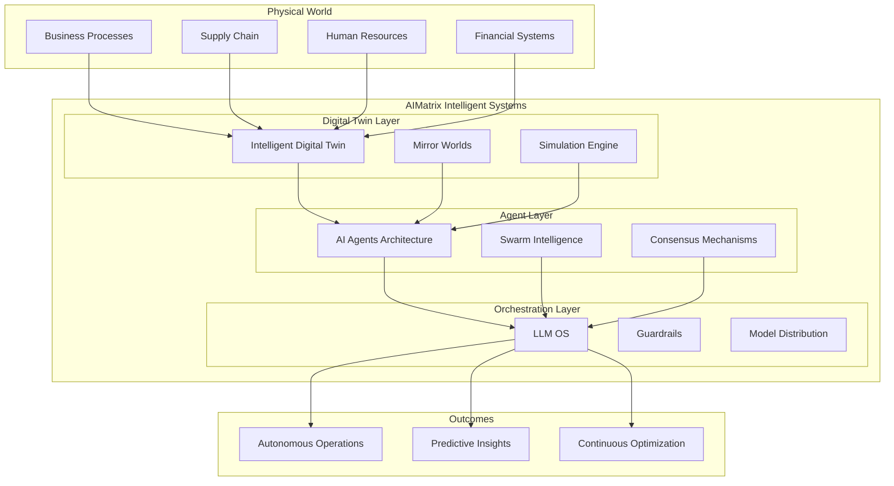

AIMatrix Intelligent Systems represents our journey toward the **Enterprise Agentic Twin** vision—an intelligent digital representation of your entire organization that thinks, learns, and acts autonomously. We're building the foundation for businesses to evolve from simple automation to truly intelligent, self-managing systems.

## The Evolution Toward Enterprise Agentic Twin

The path to intelligent enterprises follows a clear progression:

**Copilot → Agents → Intelligent Twin → Digital Twin for Organization (DTO) → Enterprise Agentic Twin**

We're advancing along this path by combining three foundational technologies that work together to enable increasingly sophisticated capabilities:

## Core Components

These three technologies form the building blocks of our Enterprise Agentic Twin vision:

### [Intelligent Digital Twin (IDT)](/technical/intelligent-systems/intelligent-digital-twin/)
**Foundation Layer**: Create living digital replicas of your business processes, supply chains, and organizational structures. IDTs provide the simulation and modeling capabilities that let us understand and predict business behavior—the first step toward an organization that can reason about itself.

### [AI Agents Architecture](/technical/intelligent-systems/ai-agents-architecture/)
**Action Layer**: Deploy autonomous agents with specialized roles, swarm intelligence, and emergent behaviors. Agents transform insights from digital twins into intelligent actions—moving from passive observation to active optimization.

### [LLM OS / LLM Lite](/technical/intelligent-systems/llm-os/)
**Intelligence Layer**: Centralized orchestration platform for AI models with fine-tuning, guardrails, and distributed inference. LLM OS provides the reasoning and language capabilities that enable human-like understanding and communication.

## The Enterprise Agentic Twin Vision

The ultimate goal is an **Enterprise Agentic Twin**—a comprehensive digital representation that doesn't just mirror your organization but actively participates in managing it. This vision represents the convergence of:

### 🧬 **Biological-Inspired Adapt Adaptation**
- Self-organizing systems that adapt to changing conditions without manual reconfiguration
- Emergent behaviors from simple agent interactions creating sophisticated solutions
- Evolutionary optimization discovering better approaches through continuous experimentation

### 🌐 **Complete Business Understanding**
- Comprehensive digital replicas that capture every aspect of business operations
- Real-time synchronization between physical operations and digital models
- Predictive modeling that anticipates challenges and opportunities before they materialize

### 🤖 **Autonomous Decision-Making**
- Self-managing workflows that handle routine operations with minimal human intervention
- Intelligent decision-making distributed across every operational level
- Continuous learning loops that improve performance over time

**Current State**: Today, AIMatrix provides the foundational components (digital twins, agents, LLM orchestration) that businesses need to begin this journey.

**The Path Forward**: We're working toward systems that progressively gain more autonomy, understanding, and reasoning capabilities—eventually achieving the Enterprise Agentic Twin vision where your organization has a comprehensive, intelligent digital counterpart.

## Key Capabilities

### Business Process Intelligence
Transform static workflows into intelligent, adaptive processes that:
- **Self-optimize** based on performance metrics and changing conditions
- **Predict bottlenecks** before they occur and automatically adjust resources
- **Learn from exceptions** and develop new handling patterns
- **Scale dynamically** based on demand and resource availability

### Synthetic Data Generation
Create realistic business scenarios and training data through:
- **Process simulation** with millions of variations
- **Customer behavior modeling** across different segments
- **Market condition synthesis** for stress testing
- **Regulatory scenario generation** for compliance testing

### Predictive Maintenance for Business
Apply predictive maintenance concepts to business operations:
- **Process health monitoring** with early warning systems
- **Resource utilization prediction** to prevent overallocation
- **Relationship maintenance** for customer and partner ecosystems
- **Knowledge base freshness** tracking and automatic updates

## Real-World Applications

### Financial Services
- **Risk simulation** across thousands of market scenarios
- **Customer journey optimization** through behavioral modeling
- **Regulatory compliance** with automated monitoring and reporting
- **Fraud detection** using multi-agent surveillance systems

### Supply Chain & Logistics
- **End-to-end visibility** through digital twin networks
- **Demand forecasting** with multi-variable predictive models
- **Route optimization** using swarm intelligence algorithms
- **Supplier relationship** management through AI agents

### Healthcare & Life Sciences
- **Patient pathway optimization** through process simulation
- **Resource allocation** using predictive analytics
- **Clinical trial design** with synthetic patient populations
- **Drug discovery** acceleration through intelligent automation

### Manufacturing & Industry 4.0
- **Production planning** with real-time demand integration
- **Quality prediction** using multi-sensor data fusion
- **Maintenance scheduling** through predictive algorithms
- **Energy optimization** across facility operations

## Getting Started

Ready to transform your organization into an intelligent enterprise? Choose your entry point:

1. **[Start with Digital Twins](/technical/intelligent-systems/intelligent-digital-twin/)** - Begin by modeling your core business processes
2. **[Deploy AI Agents](/technical/intelligent-systems/ai-agents-architecture/)** - Implement specialized agents for specific functions
3. **[Orchestrate with LLM OS](/technical/intelligent-systems/llm-os/)** - Centralize AI model management and deployment

## Architecture Overview

## Starting Your Journey

AIMatrix Intelligent Systems provides the building blocks for your evolution toward an Enterprise Agentic Twin:

**Phase 1: Digital Foundation** - Model your business processes with Intelligent Digital Twins
**Phase 2: Autonomous Actions** - Deploy AI Agents to automate and optimize operations
**Phase 3: Intelligent Orchestration** - Integrate LLM OS for sophisticated reasoning and coordination
**Phase 4: Emergent Intelligence** - Enable systems to discover novel solutions and self-improve
**Phase 5: Enterprise Agentic Twin** - Achieve a fully intelligent organizational counterpart

The future is intelligent, adaptive, and autonomous. With AIMatrix Intelligent Systems, your organization doesn't just use AI—it evolves toward becoming an intelligent entity capable of continuous self-improvement and autonomous operation.