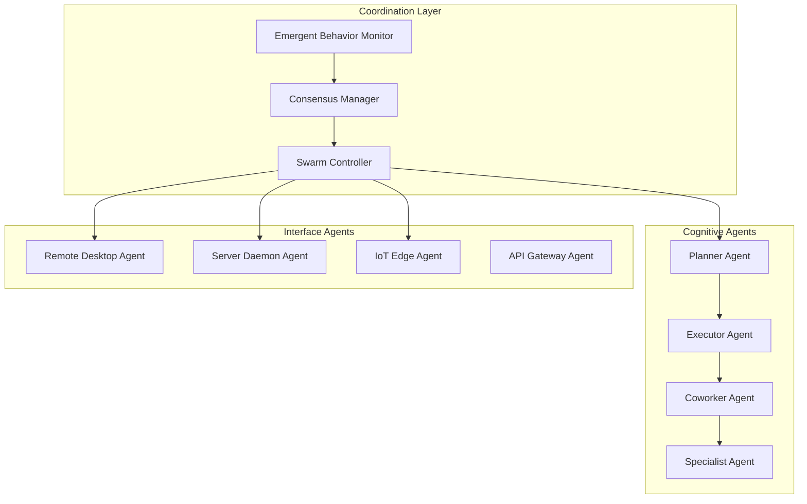

AIMatrix AI Agents Architecture creates autonomous, intelligent entities that collaborate to manage complex business operations. Unlike traditional automation that follows rigid scripts, our agent systems exhibit adaptive behaviors, collective intelligence, and emergent problem-solving capabilities that mirror natural swarm systems.

## Agent Ecosystem Overview

### Agent Classification Hierarchy



## Core Agent Types

### Planner Agents

Strategic decision-makers that decompose complex objectives into actionable plans.

#### Capabilities
- **Multi-objective Optimization**: Balance competing priorities like cost, speed, and quality
- **Resource Allocation**: Distribute tasks and resources across agent networks
- **Risk Assessment**: Evaluate potential outcomes and mitigation strategies  
- **Adaptive Planning**: Modify plans based on changing conditions and feedback

#### Implementation Example
```python
from aimatrix.agents import PlannerAgent, ObjectiveDecomposer, ResourcePlanner

class BusinessPlannerAgent(PlannerAgent):
    def __init__(self, domain="business_operations"):
        super().__init__(domain)
        self.objective_decomposer = ObjectiveDecomposer()
        self.resource_planner = ResourcePlanner()
        self.plan_history = []
    
    async def create_execution_plan(self, objective, constraints):
        """Create comprehensive execution plan for business objective"""
        
        # Decompose high-level objective
        sub_objectives = self.objective_decomposer.decompose(
            objective=objective,
            complexity_threshold=0.7,
            max_depth=4
        )
        
        # Analyze resource requirements
        resource_requirements = await self.analyze_resource_needs(sub_objectives)
        
        # Generate execution strategy
        execution_plan = ExecutionPlan(
            id=f"plan_{uuid.uuid4()}",
            main_objective=objective,
            sub_objectives=sub_objectives,
            resource_allocation=resource_requirements,
            timeline=self.generate_timeline(sub_objectives),
            risk_factors=await self.assess_risks(sub_objectives),
            success_criteria=self.define_success_metrics(objective)
        )
        
        # Optimize plan using constraints
        optimized_plan = self.resource_planner.optimize(
            plan=execution_plan,
            constraints=constraints,
            optimization_objectives=["time", "cost", "quality"]
        )
        
        self.plan_history.append(optimized_plan)
        return optimized_plan
    
    async def adapt_plan(self, plan_id, execution_feedback):
        """Adapt existing plan based on execution feedback"""
        
        current_plan = self.get_plan(plan_id)
        performance_analysis = self.analyze_execution_performance(
            plan=current_plan,
            feedback=execution_feedback
        )
        
        if performance_analysis.requires_adaptation:
            adapted_plan = self.modify_plan(
                original_plan=current_plan,
                performance_issues=performance_analysis.issues,
                available_resources=self.get_available_resources()
            )
            
            # Validate adapted plan
            validation_result = await self.validate_plan_feasibility(adapted_plan)
            if validation_result.is_feasible:
                return adapted_plan
            else:
                return await self.create_contingency_plan(current_plan, validation_result)
        
        return current_plan

# Usage example
planner = BusinessPlannerAgent()
plan = await planner.create_execution_plan(
    objective="Launch new product line within 6 months",
    constraints={
        "budget": 2000000,
        "team_size": 25,
        "regulatory_compliance": "FDA_approval_required",
        "market_window": "Q4_holiday_season"
    }
)
```

### Executor Agents

Operational agents that implement plans and manage day-to-day business processes.

#### Advanced Execution Patterns
```python
from aimatrix.agents import ExecutorAgent, TaskQueue, ProgressTracker

class ProcessExecutorAgent(ExecutorAgent):
    def __init__(self, process_domain):
        super().__init__(process_domain)
        self.task_queue = TaskQueue(priority_enabled=True)
        self.progress_tracker = ProgressTracker()
        self.execution_context = {}
    
    async def execute_process(self, process_definition, input_data):
        """Execute business process with adaptive error handling"""
        
        execution_id = f"exec_{uuid.uuid4()}"
        self.progress_tracker.start_execution(execution_id)
        
        try:
            # Initialize execution context
            context = ProcessContext(
                execution_id=execution_id,
                process_def=process_definition,
                input_data=input_data,
                start_time=datetime.now()
            )
            
            # Execute process steps
            for step in process_definition.steps:
                step_result = await self.execute_step(step, context)
                
                if step_result.requires_human_intervention:
                    # Escalate to human operator
                    escalation_result = await self.escalate_to_human(
                        step=step,
                        context=context,
                        reason=step_result.intervention_reason
                    )
                    step_result = escalation_result
                
                elif step_result.has_errors:
                    # Attempt automatic recovery
                    recovery_result = await self.attempt_recovery(
                        step=step,
                        error=step_result.error,
                        context=context
                    )
                    
                    if not recovery_result.successful:
                        # Escalate unrecoverable error
                        await self.escalate_error(step, step_result.error, context)
                        break
                
                # Update context and progress
                context.add_step_result(step, step_result)
                self.progress_tracker.update_progress(
                    execution_id, 
                    step.id, 
                    step_result.status
                )
            
            return ProcessExecutionResult(
                execution_id=execution_id,
                status="completed",
                results=context.get_results(),
                metrics=self.progress_tracker.get_metrics(execution_id)
            )
            
        except Exception as e:
            await self.handle_execution_exception(execution_id, e)
            raise ProcessExecutionError(f"Execution {execution_id} failed: {str(e)}")
    
    async def execute_step(self, step, context):
        """Execute individual process step with intelligent adaptation"""
        
        # Select optimal execution strategy
        strategy = self.select_execution_strategy(step, context)
        
        if strategy == "parallel":
            return await self.execute_parallel_step(step, context)
        elif strategy == "distributed":
            return await self.execute_distributed_step(step, context)
        else:
            return await self.execute_sequential_step(step, context)
```

### Coworker Agents

Collaborative agents that work alongside humans and other agents to augment capabilities.

#### Human-Agent Collaboration Patterns
```python
from aimatrix.agents import CoworkerAgent, HumanInterface, CollaborationProtocol

class CustomerServiceCoworker(CoworkerAgent):
    def __init__(self):
        super().__init__(role="customer_service_assistant")
        self.human_interface = HumanInterface()
        self.collaboration_protocol = CollaborationProtocol()
        self.knowledge_base = CustomerServiceKB()
    
    async def assist_customer_interaction(self, customer_inquiry):
        """Collaborate with human agent to resolve customer issues"""
        
        # Analyze inquiry complexity
        complexity_assessment = await self.assess_inquiry_complexity(customer_inquiry)
        
        if complexity_assessment.can_handle_autonomously:
            # Handle simple inquiries independently
            response = await self.generate_response(customer_inquiry)
            return await self.send_response(response)
        
        else:
            # Collaborate with human agent
            collaboration_session = await self.start_collaboration_session(
                inquiry=customer_inquiry,
                required_expertise=complexity_assessment.expertise_needed
            )
            
            # Provide context and suggestions to human
            context_brief = self.prepare_context_brief(customer_inquiry)
            suggestions = await self.generate_response_suggestions(customer_inquiry)
            
            await self.human_interface.present_collaboration_context(
                session_id=collaboration_session.id,
                context=context_brief,
                suggestions=suggestions
            )
            
            # Monitor collaboration and provide real-time assistance
            while collaboration_session.is_active:
                human_input = await self.human_interface.get_input(collaboration_session.id)
                
                if human_input.requests_assistance:
                    assistance = await self.provide_contextual_assistance(
                        request=human_input.assistance_request,
                        session_context=collaboration_session.context
                    )
                    await self.human_interface.provide_assistance(assistance)
                
                elif human_input.finalizes_response:
                    # Learn from human decision
                    await self.learn_from_interaction(
                        inquiry=customer_inquiry,
                        human_response=human_input.response,
                        outcome=human_input.outcome
                    )
                    break
            
            return collaboration_session.final_result
```

### Specialist Agents

Domain-expert agents with deep knowledge in specific business functions.

#### Specialized Capabilities by Domain
```python
from aimatrix.agents import SpecialistAgent

class FinancialAnalystAgent(SpecialistAgent):
    """Specialized agent for financial analysis and forecasting"""
    
    def __init__(self):
        super().__init__(specialty="financial_analysis")
        self.models = {
            "risk_assessment": RiskAssessmentModel(),
            "cash_flow_forecast": CashFlowModel(), 
            "investment_analysis": InvestmentAnalysisModel(),
            "fraud_detection": FraudDetectionModel()
        }
    
    async def analyze_investment_opportunity(self, investment_data):
        """Comprehensive investment analysis with risk assessment"""
        
        # Multi-model analysis
        risk_profile = await self.models["risk_assessment"].analyze(investment_data)
        cash_flow_projection = await self.models["cash_flow_forecast"].project(
            investment_data, 
            time_horizon="5_years"
        )
        
        # Generate investment recommendation
        recommendation = InvestmentRecommendation(
            opportunity_id=investment_data.id,
            risk_score=risk_profile.composite_score,
            expected_roi=cash_flow_projection.roi,
            confidence_interval=cash_flow_projection.confidence_bounds,
            key_risks=risk_profile.primary_risks,
            mitigation_strategies=await self.suggest_risk_mitigations(risk_profile)
        )
        
        return recommendation

class ComplianceAgent(SpecialistAgent):
    """Regulatory compliance monitoring and enforcement"""
    
    def __init__(self, jurisdiction="US"):
        super().__init__(specialty="regulatory_compliance")
        self.jurisdiction = jurisdiction
        self.regulation_engine = RegulationEngine(jurisdiction)
        self.compliance_monitor = ComplianceMonitor()
    
    async def monitor_compliance_continuous(self):
        """Continuous monitoring of business operations for compliance"""
        
        while True:
            # Scan current business activities
            activities = await self.get_current_business_activities()
            
            for activity in activities:
                compliance_check = await self.regulation_engine.check_compliance(
                    activity=activity,
                    applicable_regulations=self.get_applicable_regulations(activity)
                )
                
                if compliance_check.has_violations:
                    violation_alert = ComplianceAlert(
                        severity=compliance_check.violation_severity,
                        regulation=compliance_check.violated_regulation,
                        activity=activity,
                        required_actions=compliance_check.remediation_steps
                    )
                    
                    await self.escalate_compliance_violation(violation_alert)
            
            await asyncio.sleep(300)  # Check every 5 minutes
```

## Multi-Agent Orchestration Patterns

### Swarm Intelligence Implementation

```python
from aimatrix.agents import SwarmController, SwarmBehaviors

class BusinessSwarmController(SwarmController):
    def __init__(self):
        super().__init__()
        self.swarm_behaviors = SwarmBehaviors()
        self.collective_memory = CollectiveMemory()
        self.emergence_detector = EmergenceDetector()
    
    async def orchestrate_complex_objective(self, objective, agent_pool):
        """Orchestrate multiple agents to achieve complex business objective"""
        
        # Initialize swarm for objective
        swarm = self.create_swarm(
            objective=objective,
            agents=agent_pool,
            coordination_pattern="hierarchical_mesh"
        )
        
        # Define swarm behaviors
        behaviors = [
            self.swarm_behaviors.task_distribution(),
            self.swarm_behaviors.information_sharing(),
            self.swarm_behaviors.consensus_building(),
            self.swarm_behaviors.adaptive_reorganization()
        ]
        
        swarm.apply_behaviors(behaviors)
        
        # Execute swarm coordination
        execution_result = await swarm.execute_collaborative_objective()
        
        # Detect emergent behaviors
        emergent_patterns = self.emergence_detector.analyze_execution(
            swarm_execution=execution_result
        )
        
        # Learn from emergent behaviors
        if emergent_patterns.beneficial_patterns:
            await self.incorporate_emergent_patterns(
                patterns=emergent_patterns.beneficial_patterns,
                swarm_template=swarm.template
            )
        
        return execution_result

class SwarmBehaviors:
    """Define collective behaviors for agent swarms"""
    
    def task_distribution(self):
        """Intelligent task distribution based on agent capabilities"""
        return TaskDistributionBehavior(
            strategy="capability_based",
            load_balancing=True,
            dynamic_reassignment=True
        )
    
    def information_sharing(self):
        """Efficient information propagation across swarm"""
        return InformationSharingBehavior(
            protocol="gossip_with_priorities",
            knowledge_aggregation=True,
            conflict_resolution="weighted_consensus"
        )
    
    def consensus_building(self):
        """Democratic decision-making processes"""
        return ConsensusBehavior(
            mechanism="delegated_proof_of_stake",
            voting_weights="expertise_based",
            quorum_requirements=0.67
        )
    
    def adaptive_reorganization(self):
        """Dynamic swarm restructuring based on performance"""
        return AdaptiveReorganizationBehavior(
            trigger_conditions=["performance_degradation", "objective_change"],
            reorganization_strategies=["role_reassignment", "topology_modification"],
            stability_cooldown="15_minutes"
        )
```

### Emergent Behaviors

#### Emergence Detection and Analysis
```python
from aimatrix.agents import EmergenceBehaviorAnalyzer

class BusinessEmergenceAnalyzer(EmergenceBehaviorAnalyzer):
    def __init__(self):
        super().__init__()
        self.pattern_recognition = PatternRecognitionEngine()
        self.behavior_classifier = BehaviorClassifier()
        self.performance_correlator = PerformanceCorrelator()
    
    async def detect_emergent_behaviors(self, swarm_execution_data):
        """Identify emergent behaviors from swarm execution"""
        
        # Extract interaction patterns
        interaction_patterns = self.pattern_recognition.extract_patterns(
            data=swarm_execution_data.agent_interactions,
            pattern_types=["communication", "collaboration", "decision_making"]
        )
        
        # Classify behavior types
        behavior_types = []
        for pattern in interaction_patterns:
            classification = self.behavior_classifier.classify(
                pattern=pattern,
                context=swarm_execution_data.execution_context
            )
            
            if classification.emergence_score > 0.7:  # High emergence threshold
                behavior_types.append(EmergentBehavior(
                    pattern=pattern,
                    type=classification.behavior_type,
                    emergence_score=classification.emergence_score,
                    novelty_score=classification.novelty_score
                ))
        
        # Analyze performance correlation
        performance_impact = await self.analyze_performance_impact(
            emergent_behaviors=behavior_types,
            execution_results=swarm_execution_data.results
        )
        
        return EmergenceAnalysisResult(
            detected_behaviors=behavior_types,
            performance_correlations=performance_impact,
            recommendations=self.generate_emergence_recommendations(
                behavior_types, performance_impact
            )
        )

# Example emergent behaviors observed in business swarms
emergent_behavior_examples = {
    "spontaneous_load_balancing": {
        "description": "Agents automatically redistribute tasks without central coordination",
        "conditions": "High workload variation, diverse agent capabilities",
        "benefits": "30% improvement in throughput, reduced bottlenecks"
    },
    
    "collaborative_learning": {
        "description": "Agents share learned patterns to improve collective performance", 
        "conditions": "Repeated similar tasks, knowledge-sharing mechanisms enabled",
        "benefits": "45% reduction in error rates, faster problem resolution"
    },
    
    "adaptive_hierarchy": {
        "description": "Dynamic leadership roles based on situational expertise",
        "conditions": "Complex multi-domain problems, diverse specialist agents",
        "benefits": "Better decision quality, improved agility"
    },
    
    "predictive_coordination": {
        "description": "Agents anticipate needs and coordinate proactively",
        "conditions": "Predictable workflow patterns, sufficient historical data", 
        "benefits": "25% reduction in coordination overhead, smoother operations"
    }
}
```

## Agent Communication Protocols

### Advanced Communication Patterns
```python
from aimatrix.agents import CommunicationProtocol, MessageRouter

class BusinessAgentCommunicationProtocol(CommunicationProtocol):
    def __init__(self):
        super().__init__()
        self.message_router = MessageRouter()
        self.protocol_stack = self.build_protocol_stack()
    
    def build_protocol_stack(self):
        """Build layered communication protocol stack"""
        return ProtocolStack([
            # Physical layer - transport mechanisms
            TransportLayer(protocols=["http", "websocket", "message_queue"]),
            
            # Network layer - routing and discovery
            NetworkLayer(
                routing_algorithm="adaptive_shortest_path",
                discovery_mechanism="distributed_hash_table"
            ),
            
            # Session layer - connection management
            SessionLayer(
                connection_pooling=True,
                heartbeat_interval=30,
                reconnection_strategy="exponential_backoff"
            ),
            
            # Presentation layer - message serialization
            PresentationLayer(
                serialization_format="protocol_buffers",
                compression=True,
                encryption="aes_256"
            ),
            
            # Application layer - business logic
            ApplicationLayer(
                message_types=self.define_business_message_types(),
                workflow_protocols=self.define_workflow_protocols()
            )
        ])
    
    def define_business_message_types(self):
        """Define message types for business agent communication"""
        return {
            "task_assignment": TaskAssignmentMessage,
            "progress_update": ProgressUpdateMessage,
            "resource_request": ResourceRequestMessage,
            "collaboration_invite": CollaborationInviteMessage,
            "escalation_alert": EscalationAlertMessage,
            "knowledge_share": KnowledgeShareMessage,
            "consensus_vote": ConsensusVoteMessage,
            "emergency_broadcast": EmergencyBroadcastMessage
        }

class MessageRouter:
    """Intelligent message routing for agent networks"""
    
    def __init__(self):
        self.routing_table = RoutingTable()
        self.load_balancer = LoadBalancer()
        self.priority_queue = PriorityQueue()
    
    async def route_message(self, message, routing_options=None):
        """Route message using intelligent routing algorithms"""
        
        # Determine routing strategy based on message type
        routing_strategy = self.select_routing_strategy(
            message_type=message.type,
            priority=message.priority,
            destination=message.destination,
            options=routing_options
        )
        
        if routing_strategy == "direct":
            return await self.route_direct(message)
        elif routing_strategy == "broadcast":
            return await self.route_broadcast(message)
        elif routing_strategy == "multicast":
            return await self.route_multicast(message)
        elif routing_strategy == "consensus":
            return await self.route_for_consensus(message)
        else:
            return await self.route_adaptive(message)
```

### Consensus Mechanisms

```python
from aimatrix.agents import ConsensusManager, ConsensusAlgorithm

class BusinessConsensusManager(ConsensusManager):
    """Manage consensus-building for business decisions"""
    
    def __init__(self):
        super().__init__()
        self.algorithms = {
            "simple_majority": SimpleMajorityConsensus(),
            "weighted_voting": WeightedVotingConsensus(), 
            "delegated_authority": DelegatedAuthorityConsensus(),
            "expertise_based": ExpertiseBasedConsensus(),
            "stakeholder_consensus": StakeholderConsensus()
        }
    
    async def build_consensus(self, decision_context, participating_agents):
        """Build consensus for business decisions"""
        
        # Select appropriate consensus algorithm
        algorithm = self.select_consensus_algorithm(decision_context)
        
        # Initialize consensus round
        consensus_round = ConsensusRound(
            id=f"consensus_{uuid.uuid4()}",
            decision_context=decision_context,
            participants=participating_agents,
            algorithm=algorithm,
            timeout=decision_context.urgency_timeout
        )
        
        # Collect initial positions
        initial_positions = await self.collect_initial_positions(
            participants=participating_agents,
            context=decision_context
        )
        
        # Execute consensus building process
        consensus_result = await algorithm.execute_consensus(
            round=consensus_round,
            initial_positions=initial_positions
        )
        
        # Validate consensus quality
        quality_assessment = await self.assess_consensus_quality(
            result=consensus_result,
            context=decision_context
        )
        
        if quality_assessment.is_acceptable:
            return consensus_result
        else:
            # Attempt consensus improvement
            return await self.improve_consensus(
                initial_result=consensus_result,
                quality_issues=quality_assessment.issues
            )

class ExpertiseBasedConsensus(ConsensusAlgorithm):
    """Weight votes based on agent expertise in relevant domains"""
    
    async def calculate_voting_weights(self, participants, decision_context):
        """Calculate voting weights based on expertise relevance"""
        
        weights = {}
        for agent in participants:
            # Assess agent expertise relevance
            expertise_relevance = await self.assess_expertise_relevance(
                agent_expertise=agent.expertise_profile,
                decision_domain=decision_context.domain,
                decision_complexity=decision_context.complexity
            )
            
            # Calculate base weight from expertise
            base_weight = expertise_relevance.relevance_score
            
            # Apply modifiers
            experience_modifier = self.calculate_experience_modifier(
                agent_experience=agent.experience_history,
                similar_decisions=decision_context.similar_decisions
            )
            
            track_record_modifier = self.calculate_track_record_modifier(
                agent_track_record=agent.decision_track_record,
                decision_type=decision_context.type
            )
            
            final_weight = base_weight * experience_modifier * track_record_modifier
            weights[agent.id] = min(final_weight, 1.0)  # Cap at 1.0
        
        # Normalize weights
        total_weight = sum(weights.values())
        normalized_weights = {
            agent_id: weight / total_weight 
            for agent_id, weight in weights.items()
        }
        
        return normalized_weights
```

## Interface Agents

### Remote Desktop Agents

```python
from aimatrix.agents import RemoteDesktopAgent, ScreenInterpreter, ApplicationController

class BusinessDesktopAgent(RemoteDesktopAgent):
    """Agent capable of interacting with desktop applications"""
    
    def __init__(self):
        super().__init__()
        self.screen_interpreter = ScreenInterpreter()
        self.app_controllers = {
            "excel": ExcelController(),
            "outlook": OutlookController(),
            "erp_system": ERPController(),
            "crm_system": CRMController()
        }
        self.workflow_executor = WorkflowExecutor()
    
    async def execute_desktop_workflow(self, workflow_definition):
        """Execute complex workflows across multiple desktop applications"""
        
        workflow_session = WorkflowSession(
            id=f"desktop_workflow_{uuid.uuid4()}",
            definition=workflow_definition
        )
        
        try:
            for step in workflow_definition.steps:
                if step.type == "application_interaction":
                    result = await self.interact_with_application(
                        app_name=step.application,
                        actions=step.actions,
                        context=workflow_session.context
                    )
                
                elif step.type == "data_extraction":
                    result = await self.extract_data_from_screen(
                        extraction_rules=step.extraction_rules,
                        target_region=step.target_region
                    )
                
                elif step.type == "decision_point":
                    result = await self.make_workflow_decision(
                        decision_criteria=step.criteria,
                        available_options=step.options,
                        context=workflow_session.context
                    )
                
                # Update workflow context
                workflow_session.context.add_step_result(step.id, result)
                
                # Check for workflow completion or branching
                next_step = self.determine_next_step(
                    current_step=step,
                    step_result=result,
                    workflow_context=workflow_session.context
                )
                
                if next_step is None:
                    break  # Workflow complete
            
            return WorkflowExecutionResult(
                session_id=workflow_session.id,
                status="completed",
                results=workflow_session.context.get_final_results()
            )
            
        except Exception as e:
            return await self.handle_workflow_error(workflow_session, e)
```

### Server Daemon Agents

```python
from aimatrix.agents import ServerDaemonAgent, SystemMonitor, ServiceManager

class InfrastructureManagementDaemon(ServerDaemonAgent):
    """Autonomous server and infrastructure management"""
    
    def __init__(self):
        super().__init__(daemon_name="infrastructure_manager")
        self.system_monitor = SystemMonitor()
        self.service_manager = ServiceManager()
        self.alert_manager = AlertManager()
        self.auto_scaler = AutoScaler()
    
    async def run_continuous_monitoring(self):
        """Continuous infrastructure monitoring and management"""
        
        while self.is_running:
            try:
                # Collect system metrics
                metrics = await self.system_monitor.collect_metrics([
                    "cpu_usage", "memory_usage", "disk_usage",
                    "network_io", "application_response_times",
                    "error_rates", "throughput"
                ])
                
                # Analyze system health
                health_analysis = await self.analyze_system_health(metrics)
                
                # Take autonomous actions based on analysis
                if health_analysis.requires_scaling:
                    await self.handle_scaling_requirement(health_analysis.scaling_recommendation)
                
                if health_analysis.has_performance_issues:
                    await self.optimize_performance(health_analysis.performance_issues)
                
                if health_analysis.has_security_concerns:
                    await self.address_security_concerns(health_analysis.security_issues)
                
                # Predictive maintenance
                maintenance_predictions = await self.predict_maintenance_needs(metrics)
                if maintenance_predictions.immediate_action_required:
                    await self.schedule_maintenance(maintenance_predictions.actions)
                
                await asyncio.sleep(self.monitoring_interval)
                
            except Exception as e:
                await self.handle_monitoring_error(e)

class ServiceManager:
    """Manage application services and dependencies"""
    
    async def ensure_service_health(self, service_name):
        """Ensure service is healthy and performing optimally"""
        
        service_status = await self.check_service_status(service_name)
        
        if not service_status.is_healthy:
            # Attempt automatic remediation
            remediation_actions = [
                "restart_service",
                "clear_cache",
                "reload_configuration",
                "scale_instances"
            ]
            
            for action in remediation_actions:
                try:
                    await self.execute_remediation_action(service_name, action)
                    
                    # Verify remediation effectiveness
                    post_action_status = await self.check_service_status(service_name)
                    if post_action_status.is_healthy:
                        await self.log_successful_remediation(service_name, action)
                        break
                        
                except Exception as e:
                    await self.log_remediation_failure(service_name, action, e)
            
            # If all remediation attempts failed, escalate
            if not post_action_status.is_healthy:
                await self.escalate_service_issue(service_name, service_status)
```

### IoT Edge Agents

```python
from aimatrix.agents import IoTEdgeAgent, SensorDataProcessor, EdgeAnalytics

class SmartFacilityEdgeAgent(IoTEdgeAgent):
    """Edge intelligence for smart facility management"""
    
    def __init__(self, facility_id):
        super().__init__(agent_id=f"facility_edge_{facility_id}")
        self.facility_id = facility_id
        self.sensor_processor = SensorDataProcessor()
        self.edge_analytics = EdgeAnalytics()
        self.device_registry = IoTDeviceRegistry()
    
    async def process_facility_data_streams(self):
        """Process multiple IoT data streams for facility optimization"""
        
        # Register and manage IoT devices
        connected_devices = await self.device_registry.discover_devices()
        
        # Set up data processing pipelines
        data_pipelines = {}
        for device in connected_devices:
            pipeline = self.create_processing_pipeline(device)
            data_pipelines[device.id] = pipeline
        
        # Process real-time data streams
        async for sensor_batch in self.sensor_processor.stream_sensor_data():
            for device_id, data in sensor_batch.items():
                if device_id in data_pipelines:
                    processed_data = await data_pipelines[device_id].process(data)
                    
                    # Run edge analytics
                    insights = await self.edge_analytics.analyze(
                        device_id=device_id,
                        processed_data=processed_data,
                        historical_context=self.get_device_history(device_id)
                    )
                    
                    # Take immediate actions if needed
                    if insights.requires_immediate_action:
                        await self.execute_edge_action(insights.recommended_actions)
                    
                    # Update facility optimization models
                    await self.update_optimization_models(device_id, insights)
    
    async def optimize_facility_operations(self):
        """Continuous facility optimization using IoT data"""
        
        while self.is_active:
            # Collect current facility state
            facility_state = await self.get_current_facility_state()
            
            # Run optimization algorithms
            optimization_result = await self.edge_analytics.optimize(
                current_state=facility_state,
                optimization_objectives=[
                    "energy_efficiency",
                    "occupant_comfort", 
                    "equipment_longevity",
                    "operational_cost"
                ]
            )
            
            # Implement optimization recommendations
            for recommendation in optimization_result.recommendations:
                if recommendation.confidence > 0.8:  # High confidence threshold
                    await self.implement_optimization(recommendation)
                else:
                    # Queue for human review
                    await self.queue_for_human_review(recommendation)
            
            await asyncio.sleep(300)  # Optimize every 5 minutes
```

## Performance and Benchmarks

### Agent Performance Metrics

#### Response Time Benchmarks
- **Simple Task Execution**: < 100ms average response time
- **Complex Planning**: < 2 seconds for multi-step plan generation
- **Swarm Coordination**: < 500ms for consensus on 50-agent networks
- **Cross-Agent Communication**: < 50ms message delivery within cluster

#### Scalability Metrics
- **Agent Density**: Support 10,000+ concurrent agents per cluster
- **Message Throughput**: Handle 1M+ messages per second across network
- **Swarm Size**: Effective coordination with swarms up to 1,000 agents
- **Geographic Distribution**: Sub-200ms coordination across continents

#### Intelligence Metrics
```python
# Agent intelligence assessment framework
intelligence_metrics = {
    "planning_capability": {
        "simple_tasks": 0.95,      # 95% success rate
        "complex_objectives": 0.87, # 87% success rate
        "multi_domain": 0.73       # 73% success rate
    },
    
    "adaptation_speed": {
        "environmental_changes": "< 30 seconds",
        "objective_modifications": "< 10 seconds", 
        "failure_recovery": "< 60 seconds"
    },
    
    "collaboration_effectiveness": {
        "human_agent_pairs": 0.89,    # 89% improvement over human-only
        "agent_agent_pairs": 0.94,    # 94% task completion rate
        "swarm_emergence": 0.78       # 78% beneficial emergence rate
    },
    
    "learning_performance": {
        "pattern_recognition": "95% accuracy after 100 examples",
        "process_optimization": "25% improvement after 1 week",
        "domain_adaptation": "80% knowledge transfer rate"
    }
}
```

## Integration and Deployment

### Enterprise Integration Patterns

```yaml
# Agent deployment configuration
agent_cluster:
  name: "business_operations_cluster"
  
  agents:
    planners:
      count: 5
      resources:
        cpu: "2 cores"
        memory: "4GB"
        specializations: ["strategic", "operational", "tactical"]
    
    executors:
      count: 20
      resources:
        cpu: "1 core" 
        memory: "2GB"
        domains: ["finance", "hr", "sales", "operations"]
    
    specialists:
      count: 10
      resources:
        cpu: "4 cores"
        memory: "8GB"
        expertise: ["legal", "compliance", "analytics", "security"]
  
  communication:
    protocol: "aimatrix_agent_protocol_v2"
    encryption: "tls_1.3"
    message_broker: "distributed_kafka"
    
  coordination:
    swarm_controller: "hierarchical_mesh"
    consensus_mechanism: "expertise_weighted_voting"
    emergence_detection: "enabled"
    
  monitoring:
    metrics_collection: "prometheus"
    performance_dashboard: "grafana" 
    alerting: "aimatrix_alertmanager"
```

### Integration with Business Systems

```python
from aimatrix.integration import SystemIntegrator, AgentConnector

class EnterpriseAgentIntegrator(SystemIntegrator):
    def __init__(self):
        super().__init__()
        self.connectors = {
            "erp": ERPAgentConnector(),
            "crm": CRMAgentConnector(),
            "hr": HRSystemConnector(),
            "finance": FinanceSystemConnector()
        }
    
    async def integrate_business_systems(self, agent_cluster):
        """Integrate agent cluster with enterprise systems"""
        
        integration_tasks = []
        
        for system_name, connector in self.connectors.items():
            integration_task = asyncio.create_task(
                self.integrate_single_system(
                    system_name=system_name,
                    connector=connector,
                    agent_cluster=agent_cluster
                )
            )
            integration_tasks.append(integration_task)
        
        integration_results = await asyncio.gather(*integration_tasks)
        
        # Validate integration health
        integration_health = await self.validate_integration_health(
            integration_results
        )
        
        return integration_health
```

## Real-World Applications

### Case Study: Global Supply Chain Orchestration

**Challenge**: Coordinate complex supply chain with 500+ suppliers across 30 countries

**Agent Architecture**:
- **1 Master Planner**: Strategic supply chain optimization
- **10 Regional Coordinators**: Geographic area management  
- **50 Supplier Specialists**: Individual supplier relationship management
- **200 Process Executors**: Order processing and logistics coordination

**Results**:
- **35% reduction** in supply chain coordination time
- **28% improvement** in demand forecasting accuracy
- **$15M annual savings** from optimized inventory management
- **90% reduction** in manual coordination tasks

### Case Study: Customer Service Transformation

**Challenge**: Handle 50,000+ daily customer interactions across multiple channels

**Agent Architecture**:
- **Customer Service Coworkers**: Human-agent collaboration for complex issues
- **Specialist Agents**: Domain expertise (technical, billing, sales)
- **Process Executors**: Automated routine task handling
- **Escalation Managers**: Intelligent routing and prioritization

**Results**:
- **60% reduction** in average resolution time
- **40% improvement** in customer satisfaction scores
- **300% increase** in agent productivity
- **$8M annual savings** in operational costs

## Getting Started with AI Agents

### Quick Deployment Guide

```python
from aimatrix.agents import AgentCluster, ClusterConfiguration

# 1. Define cluster configuration
config = ClusterConfiguration(
    cluster_name="my_business_agents",
    agent_types=[
        {"type": "planner", "count": 2},
        {"type": "executor", "count": 10}, 
        {"type": "coworker", "count": 5}
    ],
    communication_protocol="standard",
    coordination_pattern="hierarchical"
)

# 2. Deploy agent cluster
cluster = AgentCluster.create(config)
await cluster.deploy()

# 3. Assign business objectives
objectives = [
    "optimize customer onboarding process",
    "improve supply chain efficiency",
    "enhance customer service response times"
]

for objective in objectives:
    await cluster.assign_objective(objective)

# 4. Monitor agent performance
performance_metrics = await cluster.get_performance_metrics()
print(f"Cluster efficiency: {performance_metrics.overall_efficiency:.2%}")
```

### Next Steps

- **[Explore Digital Twin Integration](/technical/intelligent-systems/intelligent-digital-twin/)** - Connect agents with business process models
- **[Learn LLM OS Orchestration](/technical/intelligent-systems/llm-os/)** - Centralized AI model management
- **[Review Integration Patterns](/technical/data-knowledge/ml-ai-integration/)** - Enterprise system connectivity

AI Agents Architecture represents the future of business automation—intelligent, adaptive, and collaborative systems that augment human capabilities while operating with unprecedented autonomy and intelligence.