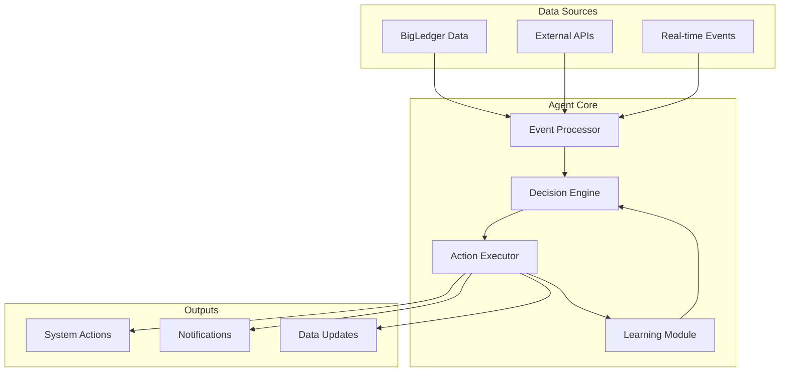

AIMatrix AI Agents are autonomous software entities that observe, decide, act, and learn within your business environment. Built on the AIMatrix platform, these agents seamlessly integrate with your existing systems to provide intelligent automation and decision-making capabilities.

## What are AI Agents?

AI Agents in AIMatrix are intelligent software components that:

- **Observe** - Continuously monitor data streams and business events
- **Decide** - Make intelligent decisions using rules, ML models, and contextual understanding  
- **Act** - Execute actions across multiple systems and channels
- **Learn** - Continuously improve performance through feedback and experience

## Key Capabilities

### 🤖 Autonomous Operation
- Execute complex multi-step business processes independently
- Handle exceptions and edge cases intelligently
- Make decisions within defined parameters and constraints
- Collaborate with other agents to solve complex problems

### 🔄 Real-time Processing
- Process events and data in real-time
- Respond to changing conditions instantly
- Scale automatically based on workload
- Maintain state across interactions

### 🧠 Intelligent Decision Making
- Use machine learning models for predictions
- Apply business rules and logic
- Consider context and historical patterns
- Incorporate feedback for continuous improvement

### 🔗 System Integration
- Native BigLedger integration
- Connect to external APIs and services
- Work across multiple channels and interfaces
- Maintain data consistency and integrity

## Agent Types

### Rule-Based Agents
Simple if-then logic for straightforward automation:
- Workflow automation
- Basic decision routing
- Alert and notification systems
- Compliance monitoring

### ML-Powered Agents
Leverage machine learning for intelligent predictions:
- Demand forecasting
- Fraud detection
- Customer behavior analysis
- Predictive maintenance

### Conversational Agents
Natural language interaction capabilities:
- Customer service chatbots
- Internal support systems
- Voice assistants
- Multi-language support

### Hybrid Agents
Combine multiple approaches for complex scenarios:
- Sales opportunity management
- Customer journey orchestration
- Financial planning and analysis
- Supply chain optimization

### Multi-Agent Systems
Coordinated agent teams for enterprise-scale automation:
- Cross-functional process automation
- Distributed decision making
- Resource optimization
- Complex workflow orchestration

## Pre-built Agent Library

AIMatrix provides 50+ pre-built agents for immediate deployment:

### Sales & Marketing
- Lead scoring and qualification
- Sales forecasting
- Campaign optimization
- Customer segmentation
- Churn prediction

### Customer Service
- Intelligent ticket routing
- Response automation
- Sentiment analysis
- Knowledge base queries
- Escalation management

### Operations
- Inventory optimization
- Supply chain monitoring
- Quality control
- Resource scheduling
- Performance monitoring

### Finance
- Fraud detection
- Risk assessment
- Automated reconciliation
- Expense processing
- Compliance monitoring

## Agent Architecture

## Getting Started

### Quick Deployment (5 minutes)
1. **Browse Marketplace** - Choose from 50+ pre-built agents
2. **Configure** - Set business rules and parameters
3. **Connect Data** - Link to BigLedger and other systems
4. **Deploy** - Activate and monitor performance

### Custom Agent Development
1. **Define Purpose** - Identify business problem and success metrics
2. **Design Logic** - Create decision rules and ML models
3. **Implement Actions** - Define what the agent can do
4. **Test & Validate** - Ensure accuracy and reliability
5. **Deploy & Monitor** - Launch with continuous monitoring

## Performance & Scalability

AIMatrix agents are built for enterprise scale:

- **Processing Speed**: 100,000+ decisions per second
- **Concurrent Agents**: Support for 10,000+ simultaneous agents
- **Response Time**: <50ms for real-time decisions
- **Availability**: 99.99% uptime SLA
- **Learning Speed**: Continuous model updates

## Security & Compliance

### Enterprise Security
- End-to-end encryption for all communications
- Role-based access control and permissions
- Audit logging for all agent decisions and actions
- Data residency and sovereignty options

### Compliance Support
- SOC 2 Type II certified
- GDPR and privacy regulation compliance
- Industry-specific compliance modules
- Automated compliance reporting

## Use Cases by Industry

### Manufacturing
- **Predictive Maintenance**: Reduce equipment downtime by 40%
- **Quality Control**: AI-powered visual inspection
- **Supply Chain**: Intelligent inventory and logistics optimization

### Retail
- **Demand Forecasting**: Predict product demand with 95% accuracy
- **Price Optimization**: Dynamic pricing based on market conditions
- **Personalization**: Individualized customer experiences

### Financial Services
- **Fraud Detection**: Real-time transaction monitoring
- **Risk Assessment**: Automated credit scoring and risk analysis
- **Compliance**: Automated regulatory compliance monitoring

### Healthcare
- **Patient Flow**: Optimize resource allocation and scheduling
- **Clinical Decision Support**: Evidence-based recommendations
- **Administrative Automation**: Streamline operations

## Next Steps

Ready to deploy AI agents in your business? Here are your next steps:

### For Business Users
- [Explore Pre-built Agents →](/business/products/amx-engine/)
- [View Use Cases →](/business/use-cases/)
- [Contact Sales →](/business/contact/)

### For Developers
- [Creating Custom Agents →](/technical/intelligent-systems/ai-agents/creating-agents/)
- [Agent Development Guide →](/technical/developers/agent-development/)
- [API Documentation →](/technical/apis/)

### For System Administrators
- [Deployment Strategies →](/technical/applications/deployment-strategies/)
- [Monitoring & Observability →](/technical/supabase-platform/monitoring-observability/)
- [Security Configuration →](/technical/architecture/)

---

> **Ready to get started?** Deploy your first AI agent in under 5 minutes with our Quick Start guide, or explore our marketplace of pre-built agents for immediate business value.