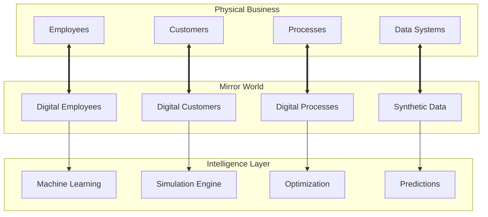

Intelligent Digital Twins (IDT) transform traditional digital twin concepts from manufacturing-focused replicas to comprehensive business ecosystem models. Unlike conventional digital twins that mirror physical assets, IDT creates living, breathing representations of entire business operations, processes, and organizational dynamics.

## What are Digital Twins?

Digital twins in AIMatrix are intelligent virtual representations that:

- **Mirror Reality** - Create accurate digital replicas of business processes and systems
- **Predict Future** - Simulate scenarios and forecast outcomes before implementation
- **Optimize Performance** - Continuously improve operations through virtual testing
- **Enable Innovation** - Provide safe environments for experimenting with changes

## Core Capabilities

### 🔄 Business Process Modeling
- Transform static process documentation into dynamic, executable models
- Simulate thousands of process variations to identify optimal configurations
- Predict bottlenecks and resource requirements under different scenarios
- Enable "what-if" analysis for process changes and improvements

### 📊 Supply Chain Intelligence
- Model complex multi-tier supplier networks with risk assessment
- Simulate disruption scenarios and identify alternative sourcing strategies
- Optimize inventory levels balancing carrying costs with service levels
- Predict demand patterns and seasonal variations

### 🏢 Organizational Dynamics
- Model team performance and collaboration patterns
- Simulate organizational changes and their impact on productivity
- Analyze skill gaps and predict training needs
- Optimize resource allocation across projects and departments

### 💰 Financial Scenario Planning
- Create sophisticated financial models with real-time market data
- Run Monte Carlo simulations for risk assessment
- Model revenue streams and their sensitivity to market conditions
- Forecast cash flows and optimize working capital management

## Mirror Worlds Technology

Mirror worlds represent the pinnacle of digital twin technology—complete, synchronized replicas of business environments that exist in parallel with the physical world.

## Simulation Capabilities

### Business Process Simulation
Run millions of virtual process executions to understand:
- Average completion times and variability
- Resource utilization patterns
- Bottleneck identification and resolution
- Impact of process changes before implementation

### Synthetic Data Generation
Create realistic business datasets that maintain:
- Statistical properties of real data
- Business logic consistency
- Privacy compliance
- Scenario-specific variations

### Predictive Maintenance
Apply predictive maintenance concepts to business operations:
- Monitor process health in real-time
- Predict performance degradation
- Recommend preventive interventions
- Automate optimization adjustments

## Integration Architecture

### Real-time Data Synchronization
- Connect to ERP, CRM, and other business systems
- Stream real-time operational data
- Maintain consistency between physical and digital environments
- Support both batch and real-time data processing

### API-First Design
- RESTful APIs for all digital twin operations
- GraphQL support for complex data queries
- WebSocket connections for real-time updates
- OpenAPI specifications for easy integration

### Scalable Infrastructure
- Cloud-native architecture for elastic scaling
- Distributed simulation processing
- High-availability deployment options
- Global data replication capabilities

## Applications by Industry

### Manufacturing
- Production line optimization and capacity planning
- Quality control and defect prediction
- Maintenance scheduling and resource allocation
- Supply chain visibility and risk management

### Financial Services
- Risk modeling and stress testing
- Trading strategy optimization
- Regulatory compliance simulation
- Customer journey analysis

### Healthcare
- Patient flow optimization
- Resource allocation and scheduling
- Treatment pathway analysis
- Capacity planning for surges

### Retail
- Demand forecasting and inventory optimization
- Store layout and customer flow analysis
- Supply chain optimization
- Pricing strategy simulation

## Getting Started

### 1. Define Your Business Process
Start by identifying the business process or system you want to model:
- Map current state processes
- Identify key performance metrics
- Gather historical data
- Define success criteria

### 2. Create Your Digital Twin
Use AIMatrix tools to build your digital twin:
- Import process models (BPMN, flowcharts)
- Connect data sources (ERP, CRM, databases)
- Configure simulation parameters
- Set up monitoring and alerts

### 3. Run Simulations
Test scenarios and optimize performance:
- Baseline current performance
- Test improvement scenarios
- Analyze results and insights
- Implement recommended changes

### 4. Monitor and Optimize
Continuously improve with real-time insights:
- Monitor live performance metrics
- Compare actual vs. predicted outcomes
- Refine models with new data
- Automate optimization recommendations

## Performance Metrics

Our digital twin platform delivers:
- **Simulation Speed**: 1M+ iterations per hour
- **Real-time Updates**: <100ms latency for data synchronization
- **Accuracy**: 95%+ prediction accuracy for business processes
- **Scale**: Support for 10,000+ concurrent simulations

## Next Steps

Ready to transform your business with digital twins?

### For Business Leaders
- [Explore Business Applications →](/business/use-cases/)
- [View ROI Calculator →](/business/overview/)
- [Schedule Consultation →](/business/contact/)

### For Technical Teams
- [Implementation Guide →](/technical/intelligent-systems/digital-twins/implementation/)
- [API Documentation →](/technical/apis/)
- [Integration Patterns →](/technical/architecture/)

### For Developers
- [SDK Documentation →](/technical/sdks/)
- [Code Examples →](/technical/tutorials/)
- [GitHub Repository →](https://github.com/aimatrix/digital-twins)

---

Transform your business operations with the power of digital twins. Start your journey toward intelligent, predictive, and optimized business processes today.