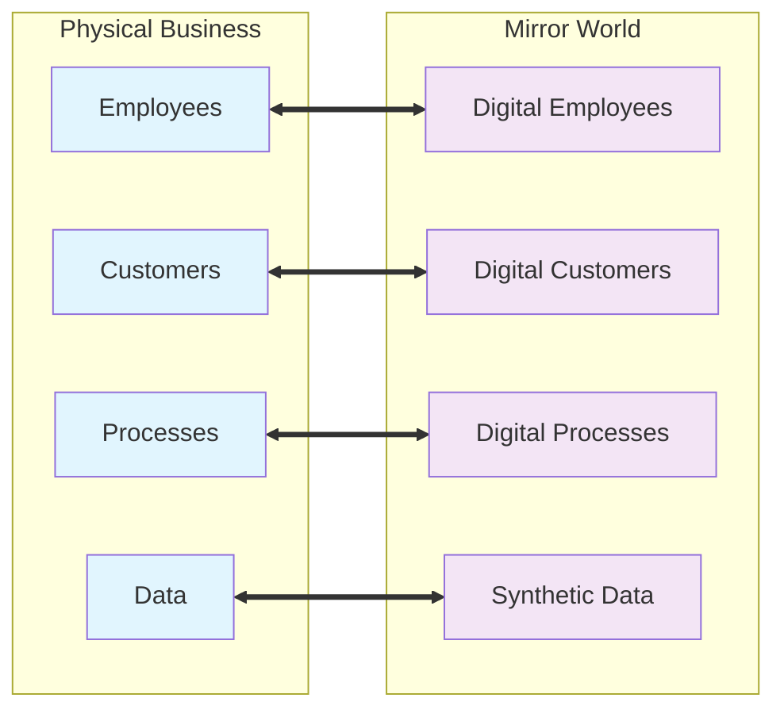
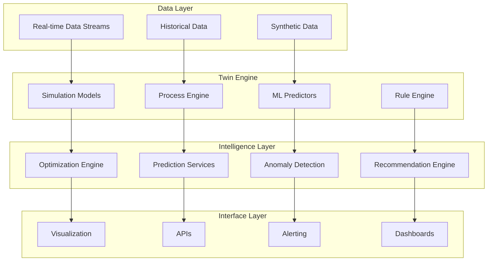

The Intelligent Digital Twin (IDT) transforms traditional digital twin concepts from manufacturing-focused replicas to comprehensive business ecosystem models. Unlike conventional digital twins that mirror physical assets, IDT creates living, breathing representations of entire business operations, processes, and organizational dynamics.

## Core Concepts

### Beyond Manufacturing: Business Digital Twins

While traditional digital twins focus on physical assets like machinery and production lines, AIMatrix IDT extends this concept to capture:

- **Process Dynamics**: Workflow patterns, decision trees, and approval chains
- **Organizational Behavior**: Team interactions, communication patterns, and cultural dynamics  
- **Market Relationships**: Customer journeys, supplier networks, and partner ecosystems
- **Financial Flows**: Revenue streams, cost structures, and investment patterns

### Mirror Worlds: Complete Business Replication

Mirror worlds represent the pinnacle of digital twin technology—complete, synchronized replicas of business environments that exist in parallel with the physical world.



## Simulation Capabilities

### Business Process Simulation

Transform static process documentation into dynamic, executable models:

#### Workflow Optimization
```python
# Example: Customer Onboarding Process Simulation
from aimatrix.idt import ProcessSimulator, WorkflowModel

# Define the process structure
onboarding_process = WorkflowModel(
    name="customer_onboarding",
    stages=[
        {
            "name": "application_review",
            "duration_range": (2, 8),  # hours
            "success_rate": 0.85,
            "bottleneck_probability": 0.15
        },
        {
            "name": "identity_verification", 
            "duration_range": (0.5, 4),
            "success_rate": 0.95,
            "dependency": "application_review"
        },
        {
            "name": "account_setup",
            "duration_range": (1, 3),
            "success_rate": 0.98,
            "dependency": "identity_verification"
        }
    ]
)

# Simulate thousands of process executions
simulator = ProcessSimulator()
results = simulator.run(
    process=onboarding_process,
    iterations=10000,
    customer_profiles=["premium", "standard", "basic"]
)

# Analyze bottlenecks and optimization opportunities
print(f"Average completion time: {results.avg_duration:.2f} hours")
print(f"Success rate: {results.success_rate:.2%}")
print(f"Primary bottleneck: {results.primary_bottleneck}")
```

#### Process Intelligence Insights
- **Bottleneck Detection**: Identify stages causing delays across different scenarios
- **Resource Optimization**: Determine optimal staffing levels for each process stage
- **Exception Handling**: Model how processes behave under stress conditions
- **Capacity Planning**: Predict resource needs for different volume scenarios

### Supply Chain Optimization

Create comprehensive models of supply chain networks with predictive capabilities:

#### Multi-Tier Supplier Networks
```python
from aimatrix.idt import SupplyChainTwin, SupplierNode, DemandForecast

# Define supplier network structure
supply_chain = SupplyChainTwin()

# Add suppliers with risk profiles
tier1_supplier = SupplierNode(
    id="SUPP_001",
    name="Primary Component Supplier",
    capacity=10000,
    lead_time_range=(5, 14),  # days
    quality_score=0.96,
    risk_factors=["geopolitical", "weather", "capacity"]
)

tier2_supplier = SupplierNode(
    id="SUPP_002", 
    name="Raw Materials Provider",
    capacity=50000,
    lead_time_range=(10, 21),
    quality_score=0.92,
    dependencies=["SUPP_001"]
)

supply_chain.add_suppliers([tier1_supplier, tier2_supplier])

# Simulate demand scenarios
demand_scenarios = [
    DemandForecast(pattern="seasonal", amplitude=0.3),
    DemandForecast(pattern="growth", rate=0.15),
    DemandForecast(pattern="disruption", probability=0.05)
]

# Run optimization simulation
optimization = supply_chain.optimize(
    scenarios=demand_scenarios,
    objectives=["cost", "reliability", "speed"]
)

print(f"Recommended safety stock: {optimization.safety_stock}")
print(f"Alternative supplier recommendations: {optimization.alternatives}")
```

#### Supply Chain Intelligence
- **Risk Propagation Modeling**: Track how disruptions cascade through supplier networks
- **Inventory Optimization**: Balance carrying costs with stockout risks
- **Supplier Performance Prediction**: Forecast delivery reliability and quality metrics
- **Alternative Sourcing**: Identify backup suppliers and switching costs

### Human Resource Modeling

Model organizational dynamics and workforce optimization:

#### Team Performance Simulation
```python
from aimatrix.idt import OrganizationTwin, TeamModel, SkillMatrix

# Define team structure
engineering_team = TeamModel(
    name="Product Engineering",
    size=12,
    skills=SkillMatrix({
        "frontend": [0.8, 0.9, 0.6, 0.7],  # skill levels 0-1
        "backend": [0.9, 0.8, 0.8, 0.9], 
        "devops": [0.6, 0.7, 0.9, 0.5],
        "leadership": [0.3, 0.8, 0.4, 0.6]
    }),
    communication_patterns="agile_scrum",
    productivity_factors={
        "remote_work": 0.95,
        "meeting_overhead": 0.15,
        "context_switching": 0.8
    }
)

# Simulate project assignments
org_twin = OrganizationTwin()
project_simulation = org_twin.simulate_project(
    team=engineering_team,
    project_complexity="high",
    duration_weeks=12,
    resource_constraints={"budget": 500000, "external_dependencies": 3}
)

print(f"Predicted completion: {project_simulation.completion_probability:.1%}")
print(f"Skill gaps identified: {project_simulation.skill_gaps}")
print(f"Optimal team composition: {project_simulation.recommended_changes}")
```

#### Workforce Intelligence
- **Skill Gap Analysis**: Predict future skill needs and training requirements
- **Performance Optimization**: Model team dynamics and productivity factors
- **Succession Planning**: Simulate leadership transitions and knowledge transfer
- **Culture Modeling**: Track cultural metrics and their impact on performance

### Financial Scenario Planning

Advanced financial modeling with real-time market integration:

#### Revenue Forecasting and Optimization
```python
from aimatrix.idt import FinancialTwin, RevenueModel, MarketConditions

# Define revenue streams
revenue_model = RevenueModel(
    streams=[
        {
            "name": "subscription",
            "base_value": 2000000,  # monthly
            "growth_rate": 0.05,
            "churn_rate": 0.03,
            "seasonality": True
        },
        {
            "name": "professional_services", 
            "base_value": 500000,
            "variability": 0.4,
            "market_correlation": 0.7
        }
    ]
)

# Simulate market scenarios  
market_conditions = MarketConditions(
    scenarios=["bull_market", "bear_market", "recession", "recovery"],
    probabilities=[0.3, 0.2, 0.1, 0.4]
)

financial_twin = FinancialTwin()
forecast = financial_twin.simulate(
    model=revenue_model,
    conditions=market_conditions,
    time_horizon_months=24
)

print(f"Expected revenue range: ${forecast.range_min/1e6:.1f}M - ${forecast.range_max/1e6:.1f}M")
print(f"Scenario sensitivities: {forecast.scenario_impact}")
```

## Kalásim Integration

### Domain-Specific Language (DSL) for Business Modeling

Kalásim provides a powerful DSL for expressing complex business logic and simulations:

#### Process Definition DSL
```kotlin
// Kalásim DSL for customer service process
simulation("customer_service_optimization") {
    
    // Define resources
    val support_agents = Resource("support_agents", capacity = 10)
    val escalation_team = Resource("escalation_team", capacity = 3)
    
    // Customer arrival process
    exponential(180.0) { // customers arrive every 3 minutes on average
        Customer().apply {
            priority = when (segment) {
                "enterprise" -> 1
                "professional" -> 2  
                "basic" -> 3
                else -> 4
            }
            
            // First level support
            request(support_agents, quantity = 1) {
                hold(triangular(2.0, 5.0, 15.0)) // support time
                
                if (uniform() < escalationProbability) {
                    // Escalate to specialized team
                    request(escalation_team) {
                        hold(triangular(10.0, 20.0, 45.0))
                        satisfactionScore = normal(0.85, 0.1)
                    }
                } else {
                    satisfactionScore = normal(0.75, 0.15)
                }
            }
        }
    }
    
    // Collect metrics
    monitor {
        avgWaitTime by support_agents.requesters.queueLength
        escalationRate by escalation_team.requesters.queueLength  
        customerSatisfaction by Customer::satisfactionScore.mean()
    }
}
```

#### Advanced Simulation Patterns
```kotlin
// Multi-entity business ecosystem simulation
ecosystem("retail_business") {
    
    // Define entity types
    entityType<Customer> {
        attributes {
            segment by categorical("premium", "regular", "occasional")
            lifetime_value by exponential(1000.0)
            churn_probability by beta(2.0, 8.0)
        }
        
        behaviors {
            purchaseFrequency = when (segment) {
                "premium" -> exponential(7.0)      // weekly
                "regular" -> exponential(14.0)     // bi-weekly  
                "occasional" -> exponential(45.0)  // monthly+
            }
        }
    }
    
    entityType<Product> {
        attributes {
            category by categorical("electronics", "clothing", "home")
            margin by uniform(0.2, 0.6)
            inventory_level by discreteUniform(0, 1000)
        }
        
        behaviors {
            demandPattern = seasonalDemand(category)
            stockoutPenalty = exponential(0.1)
        }
    }
    
    // Define interactions
    interaction<Customer, Product>("purchase") {
        trigger = customer.nextPurchaseTime
        
        condition = product.inventory_level > 0 && 
                   customer.affordabilityScore(product) > threshold
        
        effects {
            customer.lifetime_value += product.price * product.margin
            product.inventory_level -= 1
            
            // Update customer satisfaction
            if (product.inventory_level == 0) {
                customer.satisfactionScore *= 0.9  // stockout penalty
            }
        }
    }
}
```

## Synthetic Data Generation

### Business-Realistic Data Synthesis

Generate training datasets and test scenarios that maintain business logic consistency:

#### Customer Behavior Synthesis
```python
from aimatrix.idt import SyntheticDataGenerator, CustomerProfile, BehaviorPattern

# Define customer archetypes
profiles = [
    CustomerProfile(
        segment="enterprise",
        characteristics={
            "purchase_frequency": "weekly",
            "price_sensitivity": "low", 
            "feature_usage": "advanced",
            "support_tier": "premium"
        }
    ),
    CustomerProfile(
        segment="smb", 
        characteristics={
            "purchase_frequency": "monthly",
            "price_sensitivity": "medium",
            "feature_usage": "standard", 
            "support_tier": "standard"
        }
    )
]

# Generate synthetic customer data
generator = SyntheticDataGenerator()
synthetic_customers = generator.generate_customers(
    profiles=profiles,
    count=100000,
    time_period="2_years",
    maintain_consistency=True
)

# Generate corresponding transaction patterns
transactions = generator.generate_transactions(
    customers=synthetic_customers,
    product_catalog=product_catalog,
    seasonal_patterns=True,
    economic_factors=market_conditions
)

# Validate data quality
validation = generator.validate_realism(
    synthetic_data=transactions,
    reference_data=historical_transactions,
    metrics=["distribution_similarity", "correlation_preservation", "business_logic_consistency"]
)

print(f"Realism score: {validation.overall_score:.2f}")
print(f"Business logic violations: {validation.violations}")
```

#### Process Data Generation
```python
# Generate realistic process execution data
process_data = generator.generate_process_executions(
    process_model=onboarding_process,
    volume=50000,
    conditions={
        "seasonal_variations": True,
        "staff_availability": "realistic",
        "system_outages": 0.02,  # 2% probability
        "exception_scenarios": 0.15  # 15% of cases
    }
)

# Include realistic failure modes
failure_patterns = [
    {"type": "document_incomplete", "probability": 0.08, "recovery_time": "2-24h"},
    {"type": "system_timeout", "probability": 0.03, "recovery_time": "5-30m"}, 
    {"type": "manual_intervention", "probability": 0.05, "recovery_time": "1-4h"}
]

enriched_data = generator.add_failure_patterns(
    base_data=process_data,
    patterns=failure_patterns
)
```

## Predictive Maintenance for Business Processes

### Process Health Monitoring

Apply predictive maintenance concepts to business operations:

#### Early Warning Systems
```python
from aimatrix.idt import ProcessHealthMonitor, HealthMetrics

# Define process health indicators
health_monitor = ProcessHealthMonitor(
    process="customer_onboarding",
    metrics=HealthMetrics([
        "throughput_rate",
        "error_frequency", 
        "completion_time_variance",
        "resource_utilization",
        "customer_satisfaction"
    ])
)

# Set up predictive models
health_monitor.configure_predictors([
    {
        "metric": "throughput_rate",
        "model": "time_series_anomaly_detection",
        "lookback_window": "7d",
        "prediction_horizon": "24h"
    },
    {
        "metric": "error_frequency",
        "model": "gradient_boosting",
        "features": ["staff_workload", "system_load", "time_of_day"],
        "alert_threshold": 0.15
    }
])

# Monitor in real-time
while True:
    current_state = health_monitor.assess_current_health()
    predictions = health_monitor.predict_future_health(horizon_hours=24)
    
    if predictions.deterioration_risk > 0.7:
        alerts = health_monitor.generate_alerts()
        recommendations = health_monitor.suggest_interventions()
        
        print(f"Process health warning: {alerts}")
        print(f"Recommended actions: {recommendations}")
    
    time.sleep(300)  # Check every 5 minutes
```

#### Automated Process Optimization
```python
# Self-healing process optimization
class ProcessOptimizer:
    def __init__(self, process_twin):
        self.twin = process_twin
        self.optimization_history = []
    
    def optimize_continuously(self):
        """Continuously optimize process based on performance"""
        
        # Detect performance degradation
        current_performance = self.twin.get_current_metrics()
        baseline_performance = self.twin.get_baseline_metrics()
        
        if current_performance.efficiency < baseline_performance.efficiency * 0.9:
            # Performance has degraded, find optimization
            optimization_candidates = self.twin.simulate_optimizations([
                "increase_parallel_processing",
                "adjust_resource_allocation", 
                "modify_approval_thresholds",
                "implement_smart_routing"
            ])
            
            # Select best optimization
            best_optimization = max(optimization_candidates, 
                                  key=lambda x: x.predicted_improvement)
            
            # Implement gradually with A/B testing
            self.twin.implement_optimization(
                optimization=best_optimization,
                rollout_percentage=10,  # Start with 10% of traffic
                monitoring_window="24h"
            )
            
            # Monitor results
            results = self.twin.monitor_optimization_results()
            if results.improvement_confirmed:
                self.twin.scale_optimization(rollout_percentage=100)
            else:
                self.twin.rollback_optimization()

# Usage
optimizer = ProcessOptimizer(onboarding_twin)
optimizer.optimize_continuously()
```

## Architecture and Performance

### IDT Architecture Overview



### Performance Benchmarks

#### Simulation Performance
- **Process Simulations**: 1M+ iterations per hour on standard hardware
- **Supply Chain Models**: Handle 10,000+ nodes with sub-second response times
- **Financial Scenarios**: Monte Carlo simulations with 100,000+ paths in minutes
- **Real-time Updates**: < 100ms latency for live data integration

#### Scalability Metrics
- **Concurrent Users**: Support 1,000+ simultaneous simulation sessions
- **Data Volume**: Process TBs of historical data for model training
- **Model Complexity**: Handle 100,000+ parameters in optimization problems
- **Integration Points**: Real-time sync with 50+ enterprise systems

## Integration Patterns

### Enterprise System Integration

#### ERP Integration
```python
from aimatrix.idt import ERPConnector, DataMapping

# Connect to SAP/Oracle/Dynamics
erp_connector = ERPConnector(
    system_type="sap_s4hana",
    connection_params={
        "host": "erp.company.com",
        "client": "100", 
        "auth": "oauth2"
    }
)

# Map ERP data to digital twin
data_mapping = DataMapping({
    "purchase_orders": "idt.supply_chain.orders",
    "inventory_levels": "idt.supply_chain.inventory",
    "production_schedule": "idt.operations.schedule",
    "financial_postings": "idt.finance.transactions"
})

# Set up real-time sync
erp_connector.setup_real_time_sync(
    entities=["purchase_orders", "inventory_levels"],
    sync_frequency="5_minutes",
    data_mapping=data_mapping
)
```

#### CRM Integration
```python
# Salesforce/HubSpot integration for customer journey modeling
crm_connector = CRMConnector("salesforce")
crm_connector.sync_customer_data(
    objects=["accounts", "opportunities", "cases", "activities"],
    update_frequency="real_time",
    mapping_rules={
        "account.annual_revenue": "customer.financial_profile.revenue",
        "opportunity.stage": "customer.journey.current_stage",
        "case.priority": "customer.support.priority_level"
    }
)
```

### API-First Architecture

```yaml
# OpenAPI specification for IDT services
openapi: 3.0.0
info:
  title: AIMatrix Intelligent Digital Twin API
  version: 2.0.0

paths:
  /twins/{twin_id}/simulate:
    post:
      summary: Run simulation on digital twin
      parameters:
        - name: twin_id
          in: path
          required: true
          schema:
            type: string
      requestBody:
        content:
          application/json:
            schema:
              type: object
              properties:
                scenario:
                  type: object
                iterations:
                  type: integer
                  minimum: 1
                  maximum: 1000000
                time_horizon:
                  type: string
                  format: duration
      responses:
        200:
          description: Simulation results
          content:
            application/json:
              schema:
                $ref: '#/components/schemas/SimulationResults'

  /twins/{twin_id}/optimize:
    post:
      summary: Optimize digital twin parameters
      requestBody:
        content:
          application/json:
            schema:
              type: object
              properties:
                objectives:
                  type: array
                  items:
                    type: string
                    enum: [cost, time, quality, risk]
                constraints:
                  type: object
                optimization_algorithm:
                  type: string
                  enum: [genetic, simulated_annealing, gradient_descent]
```

## Real-World Use Cases

### Case Study 1: Global Logistics Company

**Challenge**: Optimize multi-modal supply chain with 500+ suppliers across 50 countries

**Solution**:
- Created comprehensive IDT of entire supply network
- Modeled 15 different transportation modes and their interactions
- Implemented predictive maintenance for logistics processes
- Integrated real-time tracking and IoT sensor data

**Results**:
- 23% reduction in transportation costs
- 40% improvement in delivery time predictability  
- 60% fewer supply chain disruptions
- $12M annual savings from optimized inventory levels

### Case Study 2: Healthcare Network

**Challenge**: Optimize patient flow and resource allocation across 20 hospitals

**Solution**:
- Built IDT models for each hospital's operational processes
- Simulated patient pathways and treatment protocols
- Predicted demand surges and resource bottlenecks
- Automated staff scheduling and equipment allocation

**Results**:
- 35% reduction in patient wait times
- 28% improvement in bed utilization
- 50% better staff satisfaction scores
- $8M saved through optimized resource allocation

### Case Study 3: Financial Services Firm

**Challenge**: Model and optimize complex trading and risk management processes

**Solution**:
- Created IDT of trading floor operations and decision processes
- Simulated market scenarios and trading strategies
- Modeled regulatory compliance processes
- Implemented real-time risk monitoring

**Results**:
- 45% improvement in trading strategy performance
- 80% reduction in compliance violations
- 30% faster settlement processing
- $25M additional revenue from optimized strategies

## Getting Started with IDT

### Quick Start Guide

1. **Define Your Business Process**
   ```python
   from aimatrix.idt import ProcessModel
   
   my_process = ProcessModel.from_bpmn("process_diagram.bpmn")
   ```

2. **Create Digital Twin**
   ```python
   twin = DigitalTwin.create(
       name="my_business_process",
       model=my_process,
       data_sources=["erp", "crm", "logs"]
   )
   ```

3. **Run Initial Simulation**
   ```python
   results = twin.simulate(
       scenarios=["baseline", "growth", "stress"],
       iterations=10000
   )
   ```

4. **Analyze and Optimize**
   ```python
   insights = twin.analyze_results(results)
   optimizations = twin.suggest_optimizations(insights)
   ```

### Next Steps

- **[Explore AI Agents Architecture](/technical/intelligent-systems/ai-agents-architecture/)** - Learn how agents interact with digital twins
- **[Understand LLM OS Integration](/technical/intelligent-systems/llm-os/)** - See how AI models orchestrate twin operations
- **[Check Integration Patterns](/technical/applications/)** - Connect IDT with your existing systems

The Intelligent Digital Twin represents the foundation of truly intelligent business operations—where every process, relationship, and decision can be modeled, predicted, and optimized in real-time.