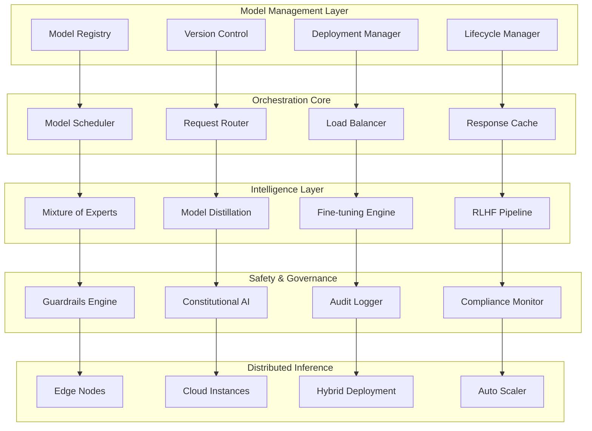

# LLM OS / LLM Lite

The LLM OS (Large Language Model Operating System) and LLM Lite represent AIMatrix's central orchestration platform for managing AI models across enterprise environments. Unlike traditional AI platforms that treat models as isolated services, LLM OS creates a unified ecosystem where AI models operate as collaborative, intelligent components within a larger business intelligence framework.

## Architecture Overview

### Core Components



## Central Orchestration Platform

### Model Management and Coordination

```python
from aimatrix.llm_os import ModelOrchestrator, ModelRegistry, DeploymentManager

class LLMOSOrchestrator(ModelOrchestrator):
    def __init__(self):
        super().__init__()
        self.model_registry = ModelRegistry()
        self.deployment_manager = DeploymentManager()
        self.request_router = IntelligentRequestRouter()
        self.performance_monitor = ModelPerformanceMonitor()
    
    async def deploy_model_ecosystem(self, ecosystem_config):
        """Deploy coordinated ecosystem of AI models"""
        
        # Validate ecosystem configuration
        validation_result = await self.validate_ecosystem_config(ecosystem_config)
        if not validation_result.is_valid:
            raise EcosystemConfigError(validation_result.errors)
        
        ecosystem = ModelEcosystem(config=ecosystem_config)
        
        # Deploy models with dependency resolution
        deployment_plan = await self.create_deployment_plan(ecosystem_config)
        
        for stage in deployment_plan.stages:
            deployment_tasks = []
            
            for model_config in stage.models:
                deployment_task = asyncio.create_task(
                    self.deploy_single_model(
                        model_config=model_config,
                        ecosystem_context=ecosystem
                    )
                )
                deployment_tasks.append(deployment_task)
            
            # Deploy models in current stage concurrently
            stage_results = await asyncio.gather(*deployment_tasks)
            
            # Validate stage deployment before proceeding
            stage_validation = await self.validate_stage_deployment(stage_results)
            if not stage_validation.all_successful:
                await self.rollback_stage_deployment(stage, stage_results)
                raise StageDeploymentError(stage_validation.failures)
            
            # Update ecosystem with deployed models
            ecosystem.add_deployed_models(stage_results)
        
        # Configure inter-model communication
        await self.configure_model_communication(ecosystem)
        
        # Set up monitoring and alerting
        await self.setup_ecosystem_monitoring(ecosystem)
        
        return ecosystem
    
    async def orchestrate_multi_model_request(self, request, routing_strategy="adaptive"):
        """Orchestrate requests across multiple models intelligently"""
        
        # Analyze request complexity and requirements
        request_analysis = await self.analyze_request(request)
        
        # Select optimal model combination
        model_selection = await self.select_optimal_models(
            request_analysis=request_analysis,
            available_models=self.get_available_models(),
            performance_requirements=request.performance_requirements
        )
        
        # Execute coordinated inference
        if model_selection.execution_pattern == "sequential":
            return await self.execute_sequential_inference(request, model_selection)
        elif model_selection.execution_pattern == "parallel":
            return await self.execute_parallel_inference(request, model_selection)
        elif model_selection.execution_pattern == "hierarchical":
            return await self.execute_hierarchical_inference(request, model_selection)
        else:
            return await self.execute_ensemble_inference(request, model_selection)

class IntelligentRequestRouter:
    """Route requests to optimal models based on content and performance requirements"""
    
    def __init__(self):
        self.routing_engine = RoutingEngine()
        self.performance_predictor = PerformancePredictor()
        self.cost_optimizer = CostOptimizer()
    
    async def route_request(self, request, available_models):
        """Intelligently route request to best model(s)"""
        
        # Analyze request characteristics
        request_features = self.extract_request_features(request)
        
        # Predict model performance for this request
        performance_predictions = {}
        for model in available_models:
            prediction = await self.performance_predictor.predict(
                model=model,
                request_features=request_features
            )
            performance_predictions[model.id] = prediction
        
        # Optimize routing decision
        routing_decision = await self.cost_optimizer.optimize_routing(
            request=request,
            performance_predictions=performance_predictions,
            constraints=request.constraints,
            objectives=request.optimization_objectives
        )
        
        return routing_decision
    
    def extract_request_features(self, request):
        """Extract features for routing decisions"""
        return RequestFeatures(
            content_type=self.classify_content_type(request.content),
            complexity_score=self.calculate_complexity_score(request.content),
            domain=self.identify_domain(request.content),
            length=len(request.content),
            language=self.detect_language(request.content),
            urgency=request.urgency_level,
            quality_requirements=request.quality_requirements
        )
```

### Distributed Model Serving

```python
from aimatrix.llm_os import DistributedInference, EdgeNode, CloudInstance

class DistributedModelServing:
    def __init__(self):
        self.edge_nodes = EdgeNodeManager()
        self.cloud_instances = CloudInstanceManager()
        self.hybrid_coordinator = HybridCoordinator()
        self.load_balancer = IntelligentLoadBalancer()
    
    async def setup_distributed_deployment(self, model, deployment_strategy):
        """Set up distributed model deployment across edge and cloud"""
        
        # Analyze model characteristics
        model_analysis = await self.analyze_model_characteristics(model)
        
        # Determine optimal distribution strategy
        distribution_plan = await self.create_distribution_plan(
            model=model,
            model_analysis=model_analysis,
            deployment_strategy=deployment_strategy,
            available_infrastructure=await self.get_available_infrastructure()
        )
        
        # Deploy to edge nodes
        edge_deployments = []
        for edge_config in distribution_plan.edge_deployments:
            edge_deployment = await self.edge_nodes.deploy_model(
                model=model,
                config=edge_config,
                optimization_level="edge_optimized"
            )
            edge_deployments.append(edge_deployment)
        
        # Deploy to cloud instances
        cloud_deployments = []
        for cloud_config in distribution_plan.cloud_deployments:
            cloud_deployment = await self.cloud_instances.deploy_model(
                model=model,
                config=cloud_config,
                optimization_level="cloud_optimized"
            )
            cloud_deployments.append(cloud_deployment)
        
        # Configure hybrid coordination
        hybrid_deployment = await self.hybrid_coordinator.coordinate_deployments(
            edge_deployments=edge_deployments,
            cloud_deployments=cloud_deployments,
            coordination_strategy=distribution_plan.coordination_strategy
        )
        
        return DistributedDeployment(
            model=model,
            edge_nodes=edge_deployments,
            cloud_instances=cloud_deployments,
            coordinator=hybrid_deployment
        )
    
    async def handle_distributed_inference(self, request, distributed_deployment):
        """Handle inference across distributed deployment"""
        
        # Determine optimal inference location
        inference_location = await self.select_inference_location(
            request=request,
            deployment=distributed_deployment
        )
        
        if inference_location.type == "edge":
            # Execute on edge with cloud fallback
            try:
                result = await self.execute_edge_inference(
                    request=request,
                    edge_node=inference_location.node,
                    timeout=request.edge_timeout
                )
                
                if result.meets_quality_threshold():
                    return result
                else:
                    # Quality insufficient, fallback to cloud
                    return await self.execute_cloud_inference(
                        request=request,
                        cloud_instance=distributed_deployment.primary_cloud_instance
                    )
                    
            except EdgeInferenceTimeout:
                # Edge timeout, fallback to cloud
                return await self.execute_cloud_inference(
                    request=request,
                    cloud_instance=distributed_deployment.primary_cloud_instance
                )
        
        else:
            # Execute on cloud with edge assistance
            return await self.execute_hybrid_inference(
                request=request,
                deployment=distributed_deployment
            )

class EdgeNode:
    """Edge deployment node for low-latency inference"""
    
    def __init__(self, node_id, hardware_specs):
        self.node_id = node_id
        self.hardware_specs = hardware_specs
        self.model_cache = ModelCache()
        self.inference_engine = EdgeInferenceEngine()
    
    async def deploy_optimized_model(self, model, optimization_config):
        """Deploy model optimized for edge constraints"""
        
        # Apply edge-specific optimizations
        optimized_model = await self.apply_edge_optimizations(
            model=model,
            hardware_constraints=self.hardware_specs,
            optimization_config=optimization_config
        )
        
        # Load into inference engine
        await self.inference_engine.load_model(optimized_model)
        
        # Cache frequently used model components
        await self.model_cache.cache_critical_components(optimized_model)
        
        return EdgeModelDeployment(
            model_id=model.id,
            node_id=self.node_id,
            optimization_applied=optimization_config,
            memory_usage=optimized_model.memory_footprint,
            expected_latency=optimized_model.inference_latency
        )
    
    async def apply_edge_optimizations(self, model, hardware_constraints, config):
        """Apply optimizations for edge deployment"""
        
        optimizations = []
        
        # Quantization
        if config.enable_quantization:
            quantized_model = await self.quantize_model(
                model=model,
                precision=config.quantization_precision
            )
            optimizations.append("quantization")
        else:
            quantized_model = model
        
        # Pruning
        if config.enable_pruning:
            pruned_model = await self.prune_model(
                model=quantized_model,
                sparsity_target=config.pruning_sparsity
            )
            optimizations.append("pruning")
        else:
            pruned_model = quantized_model
        
        # Knowledge Distillation
        if config.enable_distillation:
            distilled_model = await self.distill_model(
                teacher_model=pruned_model,
                student_size=config.student_model_size
            )
            optimizations.append("distillation")
        else:
            distilled_model = pruned_model
        
        # Compilation optimization
        if config.enable_compilation:
            compiled_model = await self.compile_for_hardware(
                model=distilled_model,
                target_hardware=hardware_constraints
            )
            optimizations.append("compilation")
        else:
            compiled_model = distilled_model
        
        compiled_model.applied_optimizations = optimizations
        return compiled_model
```

## Fine-Tuning Pipelines for Small Models

### Automated Fine-Tuning System

```python
from aimatrix.llm_os import FineTuningPipeline, DatasetManager, TrainingScheduler

class SmallModelFineTuner:
    """Specialized fine-tuning system for small, efficient models"""
    
    def __init__(self):
        self.dataset_manager = DatasetManager()
        self.training_scheduler = TrainingScheduler()
        self.hyperparameter_optimizer = HyperparameterOptimizer()
        self.model_evaluator = ModelEvaluator()
    
    async def create_fine_tuning_pipeline(self, base_model, domain_data, objectives):
        """Create optimized fine-tuning pipeline for small models"""
        
        # Analyze domain data characteristics
        data_analysis = await self.dataset_manager.analyze_dataset(domain_data)
        
        # Select optimal base model size
        optimal_base_model = await self.select_optimal_base_model(
            base_model_candidates=base_model,
            domain_characteristics=data_analysis,
            performance_requirements=objectives.performance_requirements
        )
        
        # Create training configuration
        training_config = await self.create_training_configuration(
            base_model=optimal_base_model,
            data_characteristics=data_analysis,
            objectives=objectives
        )
        
        # Set up fine-tuning pipeline
        pipeline = FineTuningPipeline(
            base_model=optimal_base_model,
            training_config=training_config,
            evaluation_framework=self.create_evaluation_framework(objectives)
        )
        
        return pipeline
    
    async def execute_multi_stage_fine_tuning(self, pipeline, domain_data):
        """Execute multi-stage fine-tuning with progressive specialization"""
        
        # Stage 1: General domain adaptation
        general_adaptation = await pipeline.stage_1_general_adaptation(
            dataset=domain_data.general_corpus,
            training_params=pipeline.config.stage_1_params
        )
        
        # Stage 2: Task-specific fine-tuning
        task_specific = await pipeline.stage_2_task_specific(
            adapted_model=general_adaptation.model,
            dataset=domain_data.task_specific_data,
            training_params=pipeline.config.stage_2_params
        )
        
        # Stage 3: Performance optimization
        optimized_model = await pipeline.stage_3_optimization(
            model=task_specific.model,
            optimization_dataset=domain_data.optimization_data,
            performance_targets=pipeline.config.performance_targets
        )
        
        # Stage 4: Safety and alignment
        final_model = await pipeline.stage_4_safety_alignment(
            model=optimized_model.model,
            safety_data=domain_data.safety_examples,
            alignment_config=pipeline.config.alignment_config
        )
        
        return FineTuningResult(
            final_model=final_model.model,
            training_history=pipeline.get_training_history(),
            performance_metrics=await self.evaluate_final_performance(final_model.model),
            deployment_recommendations=self.generate_deployment_recommendations(final_model.model)
        )

class HyperparameterOptimizer:
    """Advanced hyperparameter optimization for small model fine-tuning"""
    
    def __init__(self):
        self.optimization_algorithms = {
            "bayesian": BayesianOptimizer(),
            "evolutionary": EvolutionaryOptimizer(),
            "population_based": PopulationBasedOptimizer(),
            "gradient_based": GradientBasedOptimizer()
        }
        self.early_stopping = EarlyStopping()
    
    async def optimize_hyperparameters(self, base_model, training_data, search_space):
        """Optimize hyperparameters using multi-strategy approach"""
        
        # Initial search using Bayesian optimization
        bayesian_results = await self.optimization_algorithms["bayesian"].optimize(
            model=base_model,
            data=training_data,
            search_space=search_space,
            max_iterations=50
        )
        
        # Refine using evolutionary optimization
        evolutionary_results = await self.optimization_algorithms["evolutionary"].optimize(
            model=base_model,
            data=training_data,
            initial_population=bayesian_results.top_candidates,
            generations=20
        )
        
        # Final optimization using gradient-based methods
        final_optimization = await self.optimization_algorithms["gradient_based"].optimize(
            model=base_model,
            data=training_data,
            starting_point=evolutionary_results.best_candidate,
            max_steps=100
        )
        
        return HyperparameterOptimizationResult(
            optimal_hyperparameters=final_optimization.best_hyperparameters,
            expected_performance=final_optimization.expected_performance,
            optimization_history=self.compile_optimization_history([
                bayesian_results, evolutionary_results, final_optimization
            ])
        )
```

### Model Distillation Framework

```python
from aimatrix.llm_os import KnowledgeDistillation, TeacherModel, StudentModel

class AdvancedModelDistillation:
    """Advanced knowledge distillation for creating efficient small models"""
    
    def __init__(self):
        self.distillation_strategies = {
            "standard": StandardDistillation(),
            "progressive": ProgressiveDistillation(),
            "attention_transfer": AttentionTransferDistillation(),
            "feature_matching": FeatureMatchingDistillation(),
            "relationship_preserving": RelationshipPreservingDistillation()
        }
    
    async def distill_model(self, teacher_model, student_architecture, distillation_config):
        """Perform advanced knowledge distillation"""
        
        # Initialize student model
        student_model = StudentModel(architecture=student_architecture)
        
        # Select optimal distillation strategy
        strategy = self.select_distillation_strategy(
            teacher=teacher_model,
            student=student_model,
            config=distillation_config
        )
        
        # Execute multi-phase distillation
        distillation_result = await self.execute_multi_phase_distillation(
            teacher=teacher_model,
            student=student_model,
            strategy=strategy,
            config=distillation_config
        )
        
        return distillation_result
    
    async def execute_multi_phase_distillation(self, teacher, student, strategy, config):
        """Execute distillation in multiple phases for optimal knowledge transfer"""
        
        # Phase 1: Structure distillation
        structure_distilled = await strategy.distill_structure(
            teacher=teacher,
            student=student,
            structure_config=config.structure_phase
        )
        
        # Phase 2: Attention pattern distillation  
        attention_distilled = await strategy.distill_attention_patterns(
            teacher=teacher,
            student=structure_distilled.student,
            attention_config=config.attention_phase
        )
        
        # Phase 3: Output distribution matching
        output_distilled = await strategy.distill_output_distributions(
            teacher=teacher,
            student=attention_distilled.student,
            output_config=config.output_phase
        )
        
        # Phase 4: Task-specific knowledge transfer
        final_student = await strategy.distill_task_knowledge(
            teacher=teacher,
            student=output_distilled.student,
            task_data=config.task_specific_data
        )
        
        return DistillationResult(
            student_model=final_student.student,
            compression_ratio=teacher.size / final_student.student.size,
            performance_retention=final_student.performance / teacher.baseline_performance,
            distillation_metrics=self.compile_distillation_metrics([
                structure_distilled, attention_distilled, output_distilled, final_student
            ])
        )

class ProgressiveDistillation:
    """Progressive knowledge distillation with intermediate teacher models"""
    
    async def execute_progressive_distillation(self, large_teacher, small_student, config):
        """Create intermediate teacher models for smoother knowledge transfer"""
        
        # Create intermediate teacher models
        intermediate_teachers = await self.create_intermediate_teachers(
            large_teacher=large_teacher,
            small_student=small_student,
            num_intermediates=config.num_intermediate_steps
        )
        
        current_student = small_student
        
        # Distill through intermediate teachers progressively
        for i, intermediate_teacher in enumerate(intermediate_teachers):
            distillation_step = await self.distill_single_step(
                teacher=intermediate_teacher,
                student=current_student,
                step_config=config.step_configs[i]
            )
            
            current_student = distillation_step.improved_student
            
            # Validate step performance
            step_validation = await self.validate_distillation_step(
                step_result=distillation_step,
                expected_performance=config.step_targets[i]
            )
            
            if not step_validation.meets_criteria:
                # Adjust strategy and retry
                adjusted_config = await self.adjust_distillation_config(
                    current_config=config.step_configs[i],
                    validation_feedback=step_validation
                )
                
                distillation_step = await self.distill_single_step(
                    teacher=intermediate_teacher,
                    student=current_student,
                    step_config=adjusted_config
                )
                
                current_student = distillation_step.improved_student
        
        return ProgressiveDistillationResult(
            final_student=current_student,
            intermediate_steps=len(intermediate_teachers),
            performance_progression=self.track_performance_progression(intermediate_teachers)
        )
```

## Guardrails and Safety Mechanisms

### Constitutional AI Implementation

```python
from aimatrix.llm_os import ConstitutionalAI, SafetyFramework, EthicalConstraints

class ConstitutionalAISystem:
    """Comprehensive Constitutional AI implementation for model safety"""
    
    def __init__(self):
        self.constitution = AIConstitution()
        self.safety_evaluator = SafetyEvaluator()
        self.ethical_framework = EthicalFramework()
        self.harm_detector = HarmDetector()
        self.response_filter = ResponseFilter()
    
    async def apply_constitutional_training(self, model, constitutional_data):
        """Apply Constitutional AI training to improve model safety and alignment"""
        
        # Phase 1: Constitutional instruction following
        instruction_trained = await self.train_constitutional_instruction_following(
            model=model,
            constitutional_examples=constitutional_data.instruction_examples
        )
        
        # Phase 2: Constitutional critique and revision
        critique_trained = await self.train_constitutional_critique(
            model=instruction_trained,
            critique_examples=constitutional_data.critique_examples
        )
        
        # Phase 3: Constitutional reinforcement learning
        rl_trained = await self.apply_constitutional_rl(
            model=critique_trained,
            constitutional_preferences=constitutional_data.preference_data
        )
        
        return ConstitutionallyTrainedModel(
            model=rl_trained,
            constitution_adherence_score=await self.evaluate_constitution_adherence(rl_trained),
            safety_metrics=await self.evaluate_safety_metrics(rl_trained)
        )
    
    async def train_constitutional_instruction_following(self, model, constitutional_examples):
        """Train model to follow constitutional principles in instruction following"""
        
        training_data = []
        
        for example in constitutional_examples:
            # Generate initial response
            initial_response = await model.generate_response(example.prompt)
            
            # Evaluate against constitution
            constitutional_evaluation = await self.constitution.evaluate_response(
                prompt=example.prompt,
                response=initial_response,
                principles=example.applicable_principles
            )
            
            if not constitutional_evaluation.is_compliant:
                # Generate constitutional critique
                critique = await self.generate_constitutional_critique(
                    response=initial_response,
                    violations=constitutional_evaluation.violations,
                    principles=example.applicable_principles
                )
                
                # Generate improved response
                improved_response = await model.generate_response(
                    prompt=f"{example.prompt}\n\nCritique of previous response: {critique}\n\nPlease provide an improved response:",
                    conditioning={"follow_constitution": True}
                )
                
                # Create training example
                training_data.append(ConstitutionalTrainingExample(
                    original_prompt=example.prompt,
                    constitutional_response=improved_response,
                    critique=critique,
                    principles_applied=example.applicable_principles
                ))
        
        # Fine-tune model on constitutional examples
        constitutionally_improved = await self.fine_tune_on_constitutional_data(
            model=model,
            training_data=training_data
        )
        
        return constitutionally_improved

class SafetyFramework:
    """Comprehensive safety framework for AI model deployment"""
    
    def __init__(self):
        self.safety_layers = [
            InputSanitizationLayer(),
            ContentFilteringLayer(), 
            BehaviorAnalysisLayer(),
            OutputValidationLayer(),
            FeedbackIntegrationLayer()
        ]
        self.risk_assessor = RiskAssessmentEngine()
        self.incident_manager = IncidentManager()
    
    async def apply_safety_layers(self, request, model_response):
        """Apply multiple layers of safety checks"""
        
        safety_context = SafetyContext(
            original_request=request,
            model_response=model_response,
            safety_level=request.required_safety_level
        )
        
        # Apply each safety layer sequentially
        for layer in self.safety_layers:
            layer_result = await layer.process(safety_context)
            
            if layer_result.requires_intervention:
                intervention_result = await self.handle_safety_intervention(
                    layer=layer,
                    result=layer_result,
                    context=safety_context
                )
                
                if intervention_result.block_response:
                    return SafetyFilteredResponse(
                        original_response=model_response,
                        safety_action="blocked",
                        reason=intervention_result.reason,
                        alternative_response=intervention_result.safe_alternative
                    )
                
                elif intervention_result.modify_response:
                    safety_context.model_response = intervention_result.modified_response
            
            # Update safety context with layer results
            safety_context.add_layer_result(layer, layer_result)
        
        # Final safety validation
        final_validation = await self.perform_final_safety_validation(safety_context)
        
        return SafetyApprovedResponse(
            response=safety_context.model_response,
            safety_score=final_validation.safety_score,
            applied_safeguards=safety_context.get_applied_safeguards()
        )

class HarmDetector:
    """Advanced harm detection across multiple dimensions"""
    
    def __init__(self):
        self.harm_categories = {
            "violence": ViolenceDetector(),
            "hate_speech": HateSpeechDetector(),
            "misinformation": MisinformationDetector(),
            "privacy_violation": PrivacyViolationDetector(),
            "manipulation": ManipulationDetector(),
            "bias": BiasDetector(),
            "toxicity": ToxicityDetector()
        }
        self.ensemble_classifier = EnsembleHarmClassifier()
    
    async def detect_potential_harms(self, content, context=None):
        """Comprehensive harm detection across all categories"""
        
        harm_scores = {}
        detected_harms = []
        
        # Run specialized detectors
        for category, detector in self.harm_categories.items():
            detection_result = await detector.analyze(content, context)
            harm_scores[category] = detection_result.harm_score
            
            if detection_result.harm_detected:
                detected_harms.append(DetectedHarm(
                    category=category,
                    severity=detection_result.severity,
                    confidence=detection_result.confidence,
                    evidence=detection_result.evidence,
                    mitigation_suggestions=detection_result.mitigation_suggestions
                ))
        
        # Ensemble classification for complex harm patterns
        ensemble_result = await self.ensemble_classifier.classify(
            content=content,
            individual_scores=harm_scores,
            context=context
        )
        
        return HarmDetectionResult(
            overall_harm_score=ensemble_result.composite_score,
            individual_harm_scores=harm_scores,
            detected_harms=detected_harms,
            risk_level=self.calculate_risk_level(ensemble_result.composite_score),
            recommended_actions=self.recommend_harm_mitigation_actions(detected_harms)
        )
```

### RLHF Implementation

```python
from aimatrix.llm_os import RLHF, RewardModel, PolicyOptimization

class RLHFPipeline:
    """Comprehensive RLHF implementation for model alignment"""
    
    def __init__(self):
        self.reward_model = RewardModel()
        self.policy_optimizer = PolicyOptimization()
        self.preference_collector = PreferenceDataCollector()
        self.alignment_evaluator = AlignmentEvaluator()
    
    async def execute_rlhf_training(self, base_model, preference_data, training_config):
        """Execute full RLHF training pipeline"""
        
        # Phase 1: Train reward model on preference data
        reward_model = await self.train_reward_model(
            preference_data=preference_data,
            reward_model_config=training_config.reward_model_config
        )
        
        # Phase 2: Policy optimization using trained reward model
        optimized_policy = await self.optimize_policy(
            base_model=base_model,
            reward_model=reward_model,
            optimization_config=training_config.policy_config
        )
        
        # Phase 3: Iterative refinement
        refined_model = await self.iterative_refinement(
            initial_policy=optimized_policy,
            reward_model=reward_model,
            refinement_config=training_config.refinement_config
        )
        
        return RLHFTrainingResult(
            aligned_model=refined_model,
            reward_model=reward_model,
            alignment_metrics=await self.evaluate_alignment(refined_model),
            training_statistics=self.compile_training_statistics()
        )
    
    async def train_reward_model(self, preference_data, config):
        """Train reward model from human preference data"""
        
        # Prepare training data
        training_pairs = []
        for preference_example in preference_data:
            # Create comparison pairs
            pair = PreferencePair(
                prompt=preference_example.prompt,
                preferred_response=preference_example.preferred,
                dispreferred_response=preference_example.dispreferred,
                preference_strength=preference_example.strength
            )
            training_pairs.append(pair)
        
        # Train reward model using preference learning
        reward_model = RewardModel(architecture=config.architecture)
        
        training_loop = RewardModelTrainingLoop(
            model=reward_model,
            training_data=training_pairs,
            config=config
        )
        
        trained_reward_model = await training_loop.train()
        
        # Validate reward model quality
        validation_result = await self.validate_reward_model(
            reward_model=trained_reward_model,
            validation_data=preference_data.validation_split
        )
        
        if validation_result.quality_score < config.minimum_quality_threshold:
            # Retrain with adjusted configuration
            adjusted_config = self.adjust_reward_model_config(
                original_config=config,
                validation_feedback=validation_result
            )
            return await self.train_reward_model(preference_data, adjusted_config)
        
        return trained_reward_model
    
    async def optimize_policy(self, base_model, reward_model, config):
        """Optimize policy using reward model guidance"""
        
        policy_optimizer = PPOOptimizer(config=config.ppo_config)
        
        current_policy = PolicyModel(base_model=base_model)
        
        for iteration in range(config.num_iterations):
            # Generate responses using current policy
            responses = await self.generate_policy_responses(
                policy=current_policy,
                prompts=config.training_prompts,
                generation_config=config.generation_config
            )
            
            # Score responses using reward model
            rewards = await reward_model.score_responses(responses)
            
            # Compute policy gradients
            policy_gradients = await policy_optimizer.compute_gradients(
                policy=current_policy,
                responses=responses,
                rewards=rewards
            )
            
            # Update policy
            updated_policy = await policy_optimizer.update_policy(
                current_policy=current_policy,
                gradients=policy_gradients
            )
            
            # Evaluate updated policy
            evaluation_result = await self.evaluate_policy_iteration(
                policy=updated_policy,
                iteration=iteration,
                baseline_policy=current_policy
            )
            
            if evaluation_result.improvement_significant:
                current_policy = updated_policy
            else:
                # Apply learning rate decay or other adjustments
                config.ppo_config.learning_rate *= config.lr_decay_factor
            
            # Log iteration results
            await self.log_policy_iteration(iteration, evaluation_result)
        
        return current_policy
```

## Mixture of Experts (MoE) Architecture

### Advanced MoE Implementation

```python
from aimatrix.llm_os import MixtureOfExperts, ExpertRouter, ExpertSpecialization

class BusinessMoESystem:
    """Business-optimized Mixture of Experts system"""
    
    def __init__(self):
        self.expert_manager = ExpertManager()
        self.routing_system = IntelligentExpertRouter()
        self.load_balancer = ExpertLoadBalancer()
        self.specialization_engine = ExpertSpecializationEngine()
    
    async def create_business_moe(self, base_models, specialization_domains):
        """Create MoE system specialized for business domains"""
        
        # Specialize experts for different business domains
        specialized_experts = []
        for i, domain in enumerate(specialization_domains):
            expert = await self.specialization_engine.specialize_expert(
                base_model=base_models[i % len(base_models)],
                domain=domain,
                specialization_config=self.create_domain_config(domain)
            )
            specialized_experts.append(expert)
        
        # Create intelligent routing system
        router = await self.routing_system.create_domain_aware_router(
            experts=specialized_experts,
            domains=specialization_domains
        )
        
        # Set up load balancing
        load_balancer = await self.load_balancer.configure_for_experts(
            experts=specialized_experts,
            balancing_strategy="performance_aware"
        )
        
        # Assemble MoE system
        moe_system = MoESystem(
            experts=specialized_experts,
            router=router,
            load_balancer=load_balancer,
            coordination_strategy="collaborative"
        )
        
        return moe_system
    
    def create_domain_config(self, domain):
        """Create specialization configuration for business domains"""
        
        domain_configs = {
            "finance": FinanceDomainConfig(
                specializations=["financial_analysis", "risk_assessment", "compliance"],
                required_accuracy=0.95,
                regulatory_constraints=["sox", "basel_iii", "gdpr"]
            ),
            
            "legal": LegalDomainConfig(
                specializations=["contract_analysis", "regulatory_compliance", "litigation_support"],
                required_accuracy=0.98,
                jurisdiction_awareness=True
            ),
            
            "hr": HRDomainConfig(
                specializations=["talent_acquisition", "performance_management", "policy_compliance"],
                privacy_requirements="strict",
                bias_mitigation=True
            ),
            
            "sales": SalesDomainConfig(
                specializations=["lead_qualification", "proposal_generation", "customer_analysis"],
                personalization_level="high",
                crm_integration=True
            ),
            
            "operations": OperationsDomainConfig(
                specializations=["process_optimization", "resource_planning", "quality_control"],
                real_time_processing=True,
                iot_integration=True
            )
        }
        
        return domain_configs.get(domain, DefaultDomainConfig())

class IntelligentExpertRouter:
    """Advanced routing system for MoE expert selection"""
    
    def __init__(self):
        self.routing_models = {
            "content_based": ContentBasedRouter(),
            "performance_based": PerformanceBasedRouter(),
            "load_aware": LoadAwareRouter(),
            "learning_based": LearningBasedRouter()
        }
        self.ensemble_router = EnsembleRouter()
    
    async def route_request(self, request, available_experts):
        """Intelligently route request to optimal expert(s)"""
        
        # Analyze request characteristics
        request_analysis = await self.analyze_request_for_routing(request)
        
        # Get routing recommendations from different strategies
        routing_recommendations = {}
        
        for strategy_name, router in self.routing_models.items():
            recommendation = await router.recommend_experts(
                request=request,
                request_analysis=request_analysis,
                available_experts=available_experts
            )
            routing_recommendations[strategy_name] = recommendation
        
        # Ensemble routing decision
        final_routing = await self.ensemble_router.make_routing_decision(
            request=request,
            individual_recommendations=routing_recommendations,
            expert_current_loads=await self.get_expert_loads(available_experts)
        )
        
        return final_routing
    
    async def adaptive_routing_optimization(self, routing_history):
        """Continuously optimize routing decisions based on performance feedback"""
        
        # Analyze routing performance patterns
        performance_analysis = await self.analyze_routing_performance(routing_history)
        
        # Identify suboptimal routing patterns
        optimization_opportunities = performance_analysis.optimization_opportunities
        
        for opportunity in optimization_opportunities:
            if opportunity.type == "expert_underutilization":
                await self.adjust_routing_weights(
                    underutilized_expert=opportunity.expert,
                    adjustment_factor=1.2
                )
            
            elif opportunity.type == "domain_misrouting":
                await self.retrain_domain_classifier(
                    misclassified_examples=opportunity.examples
                )
            
            elif opportunity.type == "load_imbalance":
                await self.rebalance_expert_loads(
                    load_distribution=opportunity.current_distribution,
                    target_distribution=opportunity.optimal_distribution
                )
        
        # Update routing models with learned improvements
        await self.update_routing_models(performance_analysis.learned_patterns)

class ExpertSpecializationEngine:
    """Engine for creating and managing expert specializations"""
    
    async def specialize_expert(self, base_model, domain, config):
        """Create domain-specialized expert from base model"""
        
        # Collect domain-specific training data
        domain_data = await self.collect_domain_data(domain, config)
        
        # Apply domain-specific fine-tuning
        specialized_model = await self.apply_domain_fine_tuning(
            base_model=base_model,
            domain_data=domain_data,
            specialization_config=config
        )
        
        # Enhance with domain-specific capabilities
        enhanced_model = await self.add_domain_capabilities(
            model=specialized_model,
            domain=domain,
            capabilities=config.required_capabilities
        )
        
        # Validate specialization quality
        validation_result = await self.validate_specialization(
            specialized_model=enhanced_model,
            domain=domain,
            validation_config=config.validation_config
        )
        
        if validation_result.meets_requirements:
            return DomainExpert(
                model=enhanced_model,
                domain=domain,
                specialization_score=validation_result.specialization_score,
                capabilities=config.required_capabilities
            )
        else:
            # Iteratively improve specialization
            return await self.improve_specialization(
                current_model=enhanced_model,
                validation_feedback=validation_result,
                config=config
            )
```

## Performance Optimization and Monitoring

### Advanced Performance Monitoring

```python
from aimatrix.llm_os import PerformanceMonitor, MetricsCollector, AlertingSystem

class LLMOSPerformanceMonitor:
    """Comprehensive performance monitoring for LLM OS"""
    
    def __init__(self):
        self.metrics_collector = AdvancedMetricsCollector()
        self.performance_analyzer = PerformanceAnalyzer()
        self.alerting_system = IntelligentAlertingSystem()
        self.optimization_engine = PerformanceOptimizationEngine()
    
    async def monitor_system_performance(self):
        """Continuous performance monitoring and optimization"""
        
        while self.is_monitoring:
            try:
                # Collect comprehensive metrics
                metrics = await self.collect_all_metrics()
                
                # Analyze performance patterns
                analysis = await self.performance_analyzer.analyze(metrics)
                
                # Detect anomalies and performance degradation
                anomalies = await self.detect_performance_anomalies(metrics)
                
                # Generate alerts for critical issues
                if anomalies.critical_issues:
                    await self.alerting_system.send_critical_alerts(anomalies.critical_issues)
                
                # Auto-optimize performance where possible
                if analysis.optimization_opportunities:
                    await self.auto_optimize_performance(analysis.optimization_opportunities)
                
                # Update performance baselines
                await self.update_performance_baselines(metrics, analysis)
                
                await asyncio.sleep(self.monitoring_interval)
                
            except Exception as e:
                await self.handle_monitoring_error(e)
    
    async def collect_all_metrics(self):
        """Collect comprehensive performance metrics"""
        
        metrics = PerformanceMetrics()
        
        # Model performance metrics
        metrics.model_metrics = await self.metrics_collector.collect_model_metrics([
            "inference_latency", "throughput", "memory_usage", "gpu_utilization",
            "accuracy", "quality_scores", "error_rates"
        ])
        
        # System resource metrics
        metrics.system_metrics = await self.metrics_collector.collect_system_metrics([
            "cpu_usage", "memory_usage", "disk_io", "network_io", 
            "queue_lengths", "connection_counts"
        ])
        
        # Business metrics
        metrics.business_metrics = await self.metrics_collector.collect_business_metrics([
            "request_volume", "user_satisfaction", "task_completion_rates",
            "cost_per_request", "revenue_impact"
        ])
        
        # Expert routing metrics (for MoE systems)
        metrics.routing_metrics = await self.metrics_collector.collect_routing_metrics([
            "expert_utilization", "routing_accuracy", "load_balance",
            "routing_latency", "expert_performance"
        ])
        
        return metrics

class PerformanceOptimizationEngine:
    """Automated performance optimization for LLM OS"""
    
    def __init__(self):
        self.optimization_strategies = {
            "caching": CachingOptimizer(),
            "load_balancing": LoadBalancingOptimizer(),
            "resource_scaling": ResourceScalingOptimizer(),
            "model_selection": ModelSelectionOptimizer(),
            "batching": BatchingOptimizer()
        }
    
    async def auto_optimize_performance(self, optimization_opportunities):
        """Automatically apply performance optimizations"""
        
        applied_optimizations = []
        
        for opportunity in optimization_opportunities:
            # Select appropriate optimization strategy
            strategy = self.select_optimization_strategy(opportunity)
            
            if strategy in self.optimization_strategies:
                optimizer = self.optimization_strategies[strategy]
                
                # Apply optimization
                optimization_result = await optimizer.optimize(opportunity)
                
                if optimization_result.successful:
                    applied_optimizations.append(optimization_result)
                    
                    # Monitor optimization impact
                    await self.monitor_optimization_impact(optimization_result)
        
        return applied_optimizations
    
    async def optimize_model_serving(self, model_performance_data):
        """Optimize model serving configuration"""
        
        current_config = model_performance_data.current_serving_config
        performance_baseline = model_performance_data.baseline_metrics
        
        # Generate optimization candidates
        optimization_candidates = await self.generate_serving_optimizations(
            current_config=current_config,
            performance_data=model_performance_data
        )
        
        # Evaluate optimization candidates
        best_optimization = None
        best_score = 0
        
        for candidate in optimization_candidates:
            # Simulate optimization impact
            simulation_result = await self.simulate_optimization_impact(
                baseline=performance_baseline,
                optimization=candidate
            )
            
            if simulation_result.improvement_score > best_score:
                best_score = simulation_result.improvement_score
                best_optimization = candidate
        
        # Apply best optimization
        if best_optimization and best_score > 0.05:  # 5% improvement threshold
            optimization_result = await self.apply_serving_optimization(best_optimization)
            return optimization_result
        
        return NoOptimizationNeeded(reason="No significant improvement opportunities found")
```

## Integration with Business Systems

### Enterprise System Integration

```python
from aimatrix.integration import EnterpriseConnector, SystemAdapter

class LLMOSEnterpriseIntegration:
    """Enterprise system integration for LLM OS"""
    
    def __init__(self):
        self.system_connectors = {
            "erp": ERPSystemConnector(),
            "crm": CRMSystemConnector(), 
            "hr": HRSystemConnector(),
            "finance": FinanceSystemConnector(),
            "compliance": ComplianceSystemConnector()
        }
        self.data_harmonizer = DataHarmonizer()
        self.workflow_orchestrator = WorkflowOrchestrator()
    
    async def integrate_enterprise_systems(self, integration_config):
        """Integrate LLM OS with enterprise systems"""
        
        integrated_systems = {}
        
        for system_name, config in integration_config.systems.items():
            if system_name in self.system_connectors:
                connector = self.system_connectors[system_name]
                
                # Establish connection
                connection = await connector.connect(config.connection_params)
                
                # Set up data synchronization
                sync_config = await self.configure_data_synchronization(
                    system=system_name,
                    connection=connection,
                    sync_requirements=config.sync_requirements
                )
                
                # Create system adapter
                adapter = SystemAdapter(
                    connection=connection,
                    sync_config=sync_config,
                    data_mappings=config.data_mappings
                )
                
                integrated_systems[system_name] = adapter
        
        # Configure cross-system workflows
        workflow_config = await self.configure_cross_system_workflows(
            integrated_systems=integrated_systems,
            workflow_definitions=integration_config.workflows
        )
        
        return EnterpriseIntegration(
            systems=integrated_systems,
            workflows=workflow_config,
            data_harmonizer=self.data_harmonizer
        )
```

## Real-World Applications

### Case Study: Financial Services Firm

**Challenge**: Deploy AI across 50+ business processes while maintaining regulatory compliance

**Solution**:
- **LLM OS Deployment**: Central orchestration for 15 specialized AI models
- **Constitutional AI**: Integrated compliance checking for all AI outputs
- **MoE Architecture**: Domain experts for trading, risk, compliance, and customer service
- **RLHF Pipeline**: Continuous alignment with business objectives and regulatory requirements

**Results**:
- **90% reduction** in model deployment time
- **99.7% compliance** rate with regulatory requirements
- **45% improvement** in decision-making speed
- **$32M annual savings** from optimized AI operations

### Case Study: Healthcare Network

**Challenge**: Manage AI models across 200+ healthcare facilities with strict privacy requirements

**Solution**:
- **Distributed Deployment**: Edge nodes in each facility with cloud coordination
- **Privacy-Preserving Fine-tuning**: Local model adaptation without data sharing
- **Safety Guardrails**: Multi-layer safety checks for medical AI applications
- **Constitutional AI**: Ethical decision-making framework for healthcare AI

**Results**:
- **60% improvement** in diagnostic accuracy
- **100% HIPAA compliance** maintained across all AI applications
- **25% reduction** in medical errors
- **$18M annual savings** from improved operational efficiency

## Getting Started with LLM OS

### Quick Deployment

```python
from aimatrix.llm_os import LLMOSCluster

# 1. Initialize LLM OS cluster
cluster = LLMOSCluster.create(
    cluster_name="business_ai_platform",
    config=LLMOSConfig(
        orchestration_mode="distributed",
        safety_level="enterprise",
        integration_endpoints=["erp", "crm", "hr"]
    )
)

# 2. Deploy model ecosystem
ecosystem = await cluster.deploy_model_ecosystem(
    models=[
        {"name": "business_planner", "type": "planning", "size": "7b"},
        {"name": "financial_analyst", "type": "specialist", "domain": "finance"},
        {"name": "hr_assistant", "type": "coworker", "domain": "hr"}
    ],
    deployment_strategy="progressive"
)

# 3. Configure safety and compliance
await cluster.configure_safety_framework(
    constitutional_ai=True,
    guardrails_level="strict",
    compliance_requirements=["gdpr", "sox", "hipaa"]
)

# 4. Start intelligent operations
await cluster.start_intelligent_operations()
```

### Next Steps

- **[Connect with Digital Twins](../intelligent-digital-twin/)** - Integrate with business process models
- **[Deploy AI Agents](../ai-agents-architecture/)** - Add autonomous agent capabilities
- **[Explore Integration Patterns](../../integration/)** - Connect with enterprise systems

The LLM OS represents the central nervous system of intelligent business operationsorchestrating AI models, ensuring safety and compliance, and enabling truly autonomous business intelligence that learns, adapts, and optimizes continuously.