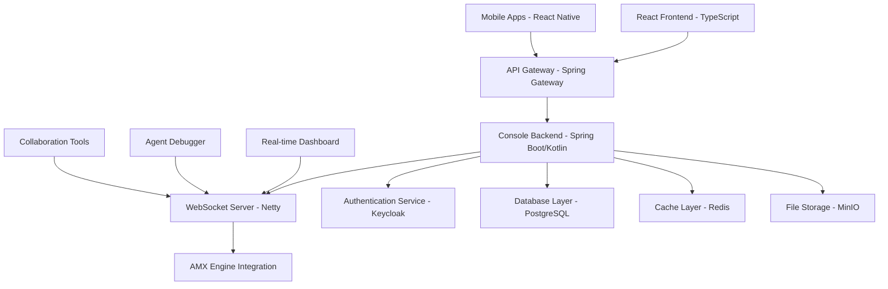

AMX Console is the universal web-based management interface for AIMatrix, providing real-time monitoring, agent interaction, debugging capabilities, and team collaboration tools. Built with modern web technologies and designed for enterprise scalability.

## Architecture Overview

### System Components



### Technology Stack

**Frontend Layer**
- **Framework**: React 18.2+ with TypeScript 5.0+
- **State Management**: Redux Toolkit + RTK Query
- **UI Framework**: Material-UI v5 + Custom Design System
- **Routing**: React Router v6
- **Real-time**: Socket.IO Client
- **Build Tools**: Vite 4.0+ with ESBuild
- **Testing**: Vitest + React Testing Library
- **Deployment**: Static hosting with CDN

**Backend Layer**
- **Runtime**: JVM 17+ (GraalVM Native Image support)
- **Framework**: Spring Boot 3.1+ with Kotlin
- **WebSocket**: Spring WebSocket + STOMP
- **Database**: PostgreSQL 15+ with R2DBC
- **Cache**: Redis 7.0+ with Lettuce
- **Message Queue**: Apache Kafka 3.0+
- **Security**: Spring Security 6 + OAuth2/OIDC
- **API Documentation**: SpringDoc OpenAPI 3

## Frontend Architecture

### Application Structure

```typescript
// Project structure
src/
├── components/           # Reusable UI components
│   ├── common/          # Generic components
│   ├── charts/          # Data visualization
│   ├── forms/           # Form components
│   └── layouts/         # Layout components
├── features/            # Feature-based modules
│   ├── agents/          # Agent management
│   ├── dashboard/       # Main dashboard
│   ├── monitoring/      # System monitoring
│   ├── collaboration/   # Team features
│   └── settings/        # Configuration
├── hooks/               # Custom React hooks
├── services/            # API and business logic
├── store/               # Redux store configuration
├── types/               # TypeScript definitions
├── utils/               # Utility functions
└── App.tsx             # Root application component
```

### State Management Architecture

```typescript
// Store configuration with RTK Query
import { configureStore } from '@reduxjs/toolkit';
import { setupListeners } from '@reduxjs/toolkit/query';
import { consoleApi } from './services/consoleApi';
import { authSlice } from './features/auth/authSlice';
import { dashboardSlice } from './features/dashboard/dashboardSlice';
import { websocketMiddleware } from './middleware/websocketMiddleware';

export const store = configureStore({
  reducer: {
    auth: authSlice.reducer,
    dashboard: dashboardSlice.reducer,
    [consoleApi.reducerPath]: consoleApi.reducer,
  },
  middleware: (getDefaultMiddleware) =>
    getDefaultMiddleware({
      serializableCheck: {
        ignoredActions: ['websocket/message'],
      },
    })
      .concat(consoleApi.middleware)
      .concat(websocketMiddleware),
});

// RTK Query API service
export const consoleApi = createApi({
  reducerPath: 'consoleApi',
  baseQuery: fetchBaseQuery({
    baseUrl: '/api/v1/',
    prepareHeaders: (headers, { getState }) => {
      const token = (getState() as RootState).auth.token;
      if (token) {
        headers.set('authorization', `Bearer ${token}`);
      }
      return headers;
    },
  }),
  tagTypes: ['Agent', 'Dashboard', 'Workflow', 'User'],
  endpoints: (builder) => ({
    // Agent management endpoints
    getAgents: builder.query<Agent[], AgentFilters>({
      query: (filters) => ({
        url: 'agents',
        params: filters,
      }),
      providesTags: ['Agent'],
    }),
    
    getAgentDetails: builder.query<AgentDetails, string>({
      query: (agentId) => `agents/${agentId}`,
      providesTags: (result, error, agentId) => [
        { type: 'Agent', id: agentId }
      ],
    }),
    
    updateAgent: builder.mutation<Agent, UpdateAgentRequest>({
      query: ({ id, ...patch }) => ({
        url: `agents/${id}`,
        method: 'PATCH',
        body: patch,
      }),
      invalidatesTags: (result, error, { id }) => [
        { type: 'Agent', id }
      ],
    }),
    
    // Real-time dashboard endpoints
    getDashboardMetrics: builder.query<DashboardMetrics, TimeRange>({
      query: (timeRange) => ({
        url: 'dashboard/metrics',
        params: timeRange,
      }),
      providesTags: ['Dashboard'],
    }),
    
    // Workflow management
    getWorkflows: builder.query<Workflow[], WorkflowFilters>({
      query: (filters) => 'workflows',
      providesTags: ['Workflow'],
    }),
  }),
});
```

### Real-time Communication Layer

```typescript
// WebSocket service with automatic reconnection
class WebSocketService {
  private socket: Socket | null = null;
  private reconnectAttempts = 0;
  private maxReconnectAttempts = 5;
  private reconnectInterval = 1000;

  constructor(private dispatch: AppDispatch) {}

  connect(token: string): Promise<void> {
    return new Promise((resolve, reject) => {
      this.socket = io(process.env.REACT_APP_WEBSOCKET_URL, {
        auth: { token },
        transports: ['websocket'],
        upgrade: false,
      });

      this.socket.on('connect', () => {
        console.log('WebSocket connected');
        this.reconnectAttempts = 0;
        resolve();
      });

      this.socket.on('disconnect', (reason) => {
        console.log('WebSocket disconnected:', reason);
        if (reason === 'io server disconnect') {
          // Server disconnected, attempt reconnect
          this.attemptReconnect();
        }
      });

      // Agent status updates
      this.socket.on('agent:status', (data: AgentStatusUpdate) => {
        this.dispatch(updateAgentStatus(data));
      });

      // Real-time metrics
      this.socket.on('metrics:update', (data: MetricsUpdate) => {
        this.dispatch(updateDashboardMetrics(data));
      });

      // System alerts
      this.socket.on('system:alert', (data: SystemAlert) => {
        this.dispatch(addSystemAlert(data));
      });

      // Agent log streaming
      this.socket.on('agent:log', (data: AgentLogEntry) => {
        this.dispatch(addAgentLog(data));
      });

      this.socket.on('connect_error', (error) => {
        console.error('WebSocket connection error:', error);
        reject(error);
      });
    });
  }

  private attemptReconnect(): void {
    if (this.reconnectAttempts < this.maxReconnectAttempts) {
      this.reconnectAttempts++;
      const delay = this.reconnectInterval * Math.pow(2, this.reconnectAttempts - 1);
      
      setTimeout(() => {
        console.log(`Attempting WebSocket reconnect (${this.reconnectAttempts}/${this.maxReconnectAttempts})`);
        this.socket?.connect();
      }, delay);
    }
  }

  subscribeToAgent(agentId: string): void {
    this.socket?.emit('agent:subscribe', { agentId });
  }

  unsubscribeFromAgent(agentId: string): void {
    this.socket?.emit('agent:unsubscribe', { agentId });
  }

  sendAgentCommand(agentId: string, command: AgentCommand): void {
    this.socket?.emit('agent:command', { agentId, command });
  }

  disconnect(): void {
    this.socket?.disconnect();
    this.socket = null;
  }
}

// WebSocket middleware for Redux integration
export const websocketMiddleware: Middleware = (store) => (next) => (action) => {
  const result = next(action);
  
  if (action.type === 'auth/loginSuccess') {
    const { token } = action.payload;
    websocketService.connect(token);
  }
  
  if (action.type === 'auth/logout') {
    websocketService.disconnect();
  }
  
  return result;
};
```

### Dashboard Component Architecture

```typescript
// Main dashboard component with real-time updates
export const Dashboard: React.FC = () => {
  const dispatch = useAppDispatch();
  const { 
    metrics, 
    agents, 
    systemHealth, 
    alerts 
  } = useAppSelector(state => state.dashboard);

  const [timeRange, setTimeRange] = useState<TimeRange>({
    start: subHours(new Date(), 24),
    end: new Date(),
  });

  const { 
    data: dashboardData, 
    isLoading, 
    error,
    refetch 
  } = useGetDashboardMetricsQuery(timeRange, {
    pollingInterval: 30000, // Poll every 30 seconds as fallback
  });

  useEffect(() => {
    // Subscribe to real-time updates
    const unsubscribe = dispatch(
      websocketSubscribe(['dashboard:metrics', 'system:health'])
    );

    return () => {
      unsubscribe();
    };
  }, [dispatch]);

  const handleTimeRangeChange = useCallback((newRange: TimeRange) => {
    setTimeRange(newRange);
  }, []);

  if (isLoading) return <DashboardSkeleton />;
  if (error) return <ErrorBoundary error={error} retry={refetch} />;

  return (
    <DashboardLayout>
      <Grid container spacing={3}>
        {/* System Health Overview */}
        <Grid item xs={12} lg={8}>
          <SystemHealthCard 
            health={systemHealth}
            timeRange={timeRange}
            onTimeRangeChange={handleTimeRangeChange}
          />
        </Grid>
        
        <Grid item xs={12} lg={4}>
          <SystemAlertsCard alerts={alerts} />
        </Grid>

        {/* Agent Status Grid */}
        <Grid item xs={12} md={6} lg={4}>
          <AgentStatusCard agents={agents} />
        </Grid>

        <Grid item xs={12} md={6} lg={4}>
          <PerformanceMetricsCard metrics={metrics} />
        </Grid>

        <Grid item xs={12} md={6} lg={4}>
          <ResourceUtilizationCard 
            cpu={metrics.cpu}
            memory={metrics.memory}
            disk={metrics.disk}
          />
        </Grid>

        {/* Real-time Charts */}
        <Grid item xs={12} lg={8}>
          <RealtimeChartsPanel 
            metrics={metrics}
            timeRange={timeRange}
          />
        </Grid>

        <Grid item xs={12} lg={4}>
          <ActiveWorkflowsCard workflows={dashboardData?.workflows} />
        </Grid>
      </Grid>
    </DashboardLayout>
  );
};
```

### Agent Interaction & Debugging Interface

```typescript
// Agent debugging interface with real-time log streaming
export const AgentDebugger: React.FC<{ agentId: string }> = ({ agentId }) => {
  const [logs, setLogs] = useState<AgentLogEntry[]>([]);
  const [isStreaming, setIsStreaming] = useState(false);
  const [filters, setFilters] = useState<LogFilters>({
    level: 'ALL',
    category: 'ALL',
  });

  const { data: agentDetails } = useGetAgentDetailsQuery(agentId);
  const [sendCommand] = useSendAgentCommandMutation();

  useEffect(() => {
    if (isStreaming) {
      const unsubscribe = websocketService.subscribeToAgentLogs(
        agentId, 
        (logEntry: AgentLogEntry) => {
          if (shouldShowLog(logEntry, filters)) {
            setLogs(prev => [...prev.slice(-999), logEntry]); // Keep last 1000 logs
          }
        }
      );

      return () => {
        unsubscribe();
      };
    }
  }, [agentId, isStreaming, filters]);

  const handleCommand = async (command: AgentCommand) => {
    try {
      await sendCommand({ agentId, command }).unwrap();
      // Command sent successfully
    } catch (error) {
      console.error('Failed to send command:', error);
    }
  };

  const toggleStreaming = () => {
    setIsStreaming(!isStreaming);
  };

  const clearLogs = () => {
    setLogs([]);
  };

  return (
    <Card>
      <CardHeader
        title={
          <Box display="flex" alignItems="center">
            <BugReportIcon sx={{ mr: 1 }} />
            Agent Debugger - {agentDetails?.name}
          </Box>
        }
        action={
          <Box>
            <IconButton onClick={toggleStreaming}>
              {isStreaming ? <PauseIcon /> : <PlayArrowIcon />}
            </IconButton>
            <IconButton onClick={clearLogs}>
              <ClearIcon />
            </IconButton>
          </Box>
        }
      />
      
      <CardContent>
        <Grid container spacing={2}>
          {/* Agent Status Panel */}
          <Grid item xs={12} md={4}>
            <AgentStatusPanel 
              agent={agentDetails}
              onCommand={handleCommand}
            />
          </Grid>

          {/* Log Stream */}
          <Grid item xs={12} md={8}>
            <Box sx={{ height: '600px', display: 'flex', flexDirection: 'column' }}>
              <LogFiltersToolbar 
                filters={filters} 
                onFiltersChange={setFilters} 
              />
              
              <VirtualizedLogViewer 
                logs={logs}
                isStreaming={isStreaming}
                sx={{ flexGrow: 1 }}
              />
            </Box>
          </Grid>

          {/* Agent Memory Inspector */}
          <Grid item xs={12}>
            <AgentMemoryInspector agentId={agentId} />
          </Grid>

          {/* Performance Metrics */}
          <Grid item xs={12}>
            <AgentPerformanceChart 
              agentId={agentId}
              timeRange={{ start: subHours(new Date(), 1), end: new Date() }}
            />
          </Grid>
        </Grid>
      </CardContent>
    </Card>
  );
};

// Virtualized log viewer for performance with large log volumes
const VirtualizedLogViewer: React.FC<{
  logs: AgentLogEntry[];
  isStreaming: boolean;
  sx?: SxProps;
}> = ({ logs, isStreaming, sx }) => {
  const listRef = useRef<VariableSizeList>(null);

  useEffect(() => {
    // Auto-scroll to bottom when new logs arrive and streaming is active
    if (isStreaming && listRef.current && logs.length > 0) {
      listRef.current.scrollToItem(logs.length - 1, 'end');
    }
  }, [logs.length, isStreaming]);

  const getItemSize = (index: number): number => {
    const log = logs[index];
    // Calculate height based on log entry content
    const baseHeight = 40;
    const messageLines = Math.ceil((log.message?.length || 0) / 80);
    return baseHeight + (messageLines * 20);
  };

  const LogItem = ({ index, style }: ListChildComponentProps) => {
    const log = logs[index];
    
    return (
      <div style={style}>
        <LogEntry 
          log={log} 
          showTimestamp 
          showLevel 
          showCategory 
        />
      </div>
    );
  };

  return (
    <Box sx={{ ...sx, border: '1px solid', borderColor: 'divider' }}>
      <VariableSizeList
        ref={listRef}
        height={600}
        itemCount={logs.length}
        itemSize={getItemSize}
        overscanCount={5}
      >
        {LogItem}
      </VariableSizeList>
    </Box>
  );
};
```

## Backend API Specifications

### Spring Boot Application Architecture

```kotlin
// Main application class with security and configuration
@SpringBootApplication
@EnableWebSocket
@EnableJpaRepositories
@EnableRedisRepositories
@EnableScheduling
class AmxConsoleApplication {
    companion object {
        @JvmStatic
        fun main(args: Array<String>) {
            runApplication<AmxConsoleApplication>(*args)
        }
    }
}

// Security configuration
@Configuration
@EnableWebSecurity
@EnableMethodSecurity(prePostEnabled = true)
class SecurityConfig {

    @Bean
    fun securityFilterChain(http: HttpSecurity): SecurityFilterChain {
        return http
            .csrf { it.disable() }
            .sessionManagement { 
                it.sessionCreationPolicy(SessionCreationPolicy.STATELESS) 
            }
            .oauth2ResourceServer { oauth2 ->
                oauth2.jwt { jwt ->
                    jwt.jwtAuthenticationConverter(jwtAuthenticationConverter())
                }
            }
            .authorizeHttpRequests { authz ->
                authz
                    .requestMatchers("/api/public/**", "/health/**", "/websocket/**").permitAll()
                    .requestMatchers("/api/admin/**").hasRole("ADMIN")
                    .requestMatchers("/api/v1/**").authenticated()
                    .anyRequest().denyAll()
            }
            .build()
    }

    @Bean
    fun jwtAuthenticationConverter(): JwtAuthenticationConverter {
        val converter = JwtAuthenticationConverter()
        converter.setJwtGrantedAuthoritiesConverter { jwt ->
            val authorities = mutableListOf<SimpleGrantedAuthority>()
            
            // Extract roles from token
            val roles = jwt.getClaimAsStringList("roles") ?: emptyList()
            roles.forEach { role ->
                authorities.add(SimpleGrantedAuthority("ROLE_$role"))
            }
            
            // Extract permissions
            val permissions = jwt.getClaimAsStringList("permissions") ?: emptyList()
            permissions.forEach { permission ->
                authorities.add(SimpleGrantedAuthority(permission))
            }
            
            authorities
        }
        return converter
    }
}
```

### REST API Controllers

```kotlin
// Agent management REST controller
@RestController
@RequestMapping("/api/v1/agents")
@PreAuthorize("hasRole('USER')")
class AgentController(
    private val agentService: AgentService,
    private val agentMetricsService: AgentMetricsService,
    private val websocketService: WebSocketService
) {

    @GetMapping
    fun getAgents(
        @RequestParam(defaultValue = "0") page: Int,
        @RequestParam(defaultValue = "20") size: Int,
        @RequestParam(required = false) status: AgentStatus?,
        @RequestParam(required = false) type: String?,
        @RequestParam(required = false) search: String?
    ): ResponseEntity<Page<AgentSummaryDto>> {
        val pageable = PageRequest.of(page, size, Sort.by("lastActivity").descending())
        val filters = AgentFilters(status, type, search)
        val agents = agentService.findAgents(filters, pageable)
        
        return ResponseEntity.ok(agents.map { it.toSummaryDto() })
    }

    @GetMapping("/{agentId}")
    @PreAuthorize("@agentService.hasAgentAccess(#agentId, authentication.name)")
    fun getAgentDetails(@PathVariable agentId: String): ResponseEntity<AgentDetailsDto> {
        val agent = agentService.findByIdOrThrow(agentId)
        val metrics = agentMetricsService.getLatestMetrics(agentId)
        
        return ResponseEntity.ok(agent.toDetailsDto(metrics))
    }

    @PatchMapping("/{agentId}")
    @PreAuthorize("@agentService.hasAgentWriteAccess(#agentId, authentication.name)")
    fun updateAgent(
        @PathVariable agentId: String,
        @RequestBody @Valid request: UpdateAgentRequest
    ): ResponseEntity<AgentDetailsDto> {
        val updatedAgent = agentService.updateAgent(agentId, request)
        
        // Notify connected clients via WebSocket
        websocketService.broadcastAgentUpdate(updatedAgent)
        
        return ResponseEntity.ok(updatedAgent.toDetailsDto())
    }

    @PostMapping("/{agentId}/commands")
    @PreAuthorize("@agentService.hasAgentWriteAccess(#agentId, authentication.name)")
    fun sendCommand(
        @PathVariable agentId: String,
        @RequestBody @Valid command: AgentCommand,
        authentication: Authentication
    ): ResponseEntity<CommandResponse> {
        val response = agentService.sendCommand(agentId, command, authentication.name)
        
        // Log command execution
        auditService.logAgentCommand(agentId, command, authentication.name)
        
        return ResponseEntity.ok(response)
    }

    @GetMapping("/{agentId}/logs")
    @PreAuthorize("@agentService.hasAgentAccess(#agentId, authentication.name)")
    fun getAgentLogs(
        @PathVariable agentId: String,
        @RequestParam(defaultValue = "0") page: Int,
        @RequestParam(defaultValue = "100") size: Int,
        @RequestParam(required = false) level: LogLevel?,
        @RequestParam(required = false) category: String?,
        @RequestParam(required = false) since: Instant?
    ): ResponseEntity<Page<AgentLogEntryDto>> {
        val pageable = PageRequest.of(page, size, Sort.by("timestamp").descending())
        val filters = LogFilters(level, category, since)
        val logs = agentService.getAgentLogs(agentId, filters, pageable)
        
        return ResponseEntity.ok(logs.map { it.toDto() })
    }

    @GetMapping("/{agentId}/metrics")
    @PreAuthorize("@agentService.hasAgentAccess(#agentId, authentication.name)")
    fun getAgentMetrics(
        @PathVariable agentId: String,
        @RequestParam start: Instant,
        @RequestParam end: Instant,
        @RequestParam(defaultValue = "1h") granularity: String
    ): ResponseEntity<AgentMetricsDto> {
        val timeRange = TimeRange(start, end)
        val metrics = agentMetricsService.getMetrics(agentId, timeRange, granularity)
        
        return ResponseEntity.ok(metrics.toDto())
    }
}

// Dashboard metrics controller
@RestController
@RequestMapping("/api/v1/dashboard")
@PreAuthorize("hasRole('USER')")
class DashboardController(
    private val dashboardService: DashboardService,
    private val systemMetricsService: SystemMetricsService
) {

    @GetMapping("/metrics")
    fun getDashboardMetrics(
        @RequestParam start: Instant,
        @RequestParam end: Instant
    ): ResponseEntity<DashboardMetricsDto> {
        val timeRange = TimeRange(start, end)
        val metrics = dashboardService.getDashboardMetrics(timeRange)
        
        return ResponseEntity.ok(metrics)
    }

    @GetMapping("/system-health")
    fun getSystemHealth(): ResponseEntity<SystemHealthDto> {
        val health = systemMetricsService.getCurrentHealth()
        return ResponseEntity.ok(health)
    }

    @GetMapping("/alerts")
    fun getSystemAlerts(
        @RequestParam(defaultValue = "0") page: Int,
        @RequestParam(defaultValue = "20") size: Int,
        @RequestParam(required = false) severity: AlertSeverity?,
        @RequestParam(required = false) status: AlertStatus?
    ): ResponseEntity<Page<SystemAlertDto>> {
        val pageable = PageRequest.of(page, size, Sort.by("timestamp").descending())
        val filters = AlertFilters(severity, status)
        val alerts = dashboardService.getAlerts(filters, pageable)
        
        return ResponseEntity.ok(alerts.map { it.toDto() })
    }
}
```

### Service Layer Implementation

```kotlin
// Agent service with AMX Engine integration
@Service
@Transactional
class AgentService(
    private val agentRepository: AgentRepository,
    private val amxEngineClient: AmxEngineClient,
    private val websocketService: WebSocketService,
    private val cacheManager: CacheManager
) {

    @Cacheable("agents")
    fun findAgents(filters: AgentFilters, pageable: Pageable): Page<Agent> {
        return agentRepository.findWithFilters(filters, pageable)
    }

    @Cacheable("agent-details", key = "#agentId")
    fun findByIdOrThrow(agentId: String): Agent {
        return agentRepository.findByIdAndActiveTrue(agentId)
            ?: throw AgentNotFoundException("Agent not found: $agentId")
    }

    @CacheEvict("agent-details", key = "#agentId")
    suspend fun updateAgent(agentId: String, request: UpdateAgentRequest): Agent {
        val agent = findByIdOrThrow(agentId)
        
        // Update local database
        val updatedAgent = agent.copy(
            name = request.name ?: agent.name,
            description = request.description ?: agent.description,
            configuration = request.configuration ?: agent.configuration,
            tags = request.tags ?: agent.tags,
            lastModified = Instant.now()
        )
        
        agentRepository.save(updatedAgent)
        
        // Update AMX Engine if agent is running
        if (updatedAgent.status == AgentStatus.RUNNING) {
            try {
                amxEngineClient.updateAgent(agentId, updatedAgent.toEngineUpdateRequest())
            } catch (e: Exception) {
                logger.error("Failed to update agent in AMX Engine", e)
                // Consider reverting database changes or queuing for retry
            }
        }
        
        return updatedAgent
    }

    suspend fun sendCommand(
        agentId: String, 
        command: AgentCommand, 
        userId: String
    ): CommandResponse {
        val agent = findByIdOrThrow(agentId)
        
        // Validate command
        if (!isValidCommand(agent, command)) {
            throw InvalidCommandException("Command not supported by agent")
        }
        
        try {
            // Send command to AMX Engine
            val response = amxEngineClient.sendCommand(agentId, command)
            
            // Record command execution
            val execution = CommandExecution(
                id = UUID.randomUUID().toString(),
                agentId = agentId,
                command = command,
                userId = userId,
                status = CommandStatus.EXECUTED,
                timestamp = Instant.now(),
                response = response
            )
            
            commandExecutionRepository.save(execution)
            
            // Broadcast real-time update
            websocketService.broadcastAgentCommand(agentId, command, response)
            
            return response
            
        } catch (e: AmxEngineException) {
            logger.error("Failed to execute command on agent $agentId", e)
            throw CommandExecutionException("Failed to execute command: ${e.message}")
        }
    }

    fun getAgentLogs(
        agentId: String, 
        filters: LogFilters, 
        pageable: Pageable
    ): Page<AgentLogEntry> {
        // First check if we have recent logs in cache
        val cacheKey = "agent-logs:$agentId:${filters.hashCode()}"
        val cached = cacheManager.getCache("agent-logs")?.get(cacheKey, Page::class.java)
        
        return cached as? Page<AgentLogEntry> ?: run {
            // Fetch from database
            val logs = agentLogRepository.findByAgentIdWithFilters(agentId, filters, pageable)
            
            // Cache for 5 minutes
            cacheManager.getCache("agent-logs")
                ?.put(cacheKey, logs, Duration.ofMinutes(5))
            
            logs
        }
    }

    fun hasAgentAccess(agentId: String, userId: String): Boolean {
        // Check if user owns the agent or has read access
        return agentRepository.existsByIdAndOwnerUserId(agentId, userId) ||
               hasPermission(userId, "agents:$agentId:read") ||
               hasPermission(userId, "agents:read")
    }

    fun hasAgentWriteAccess(agentId: String, userId: String): Boolean {
        // Check if user owns the agent or has write access
        return agentRepository.existsByIdAndOwnerUserId(agentId, userId) ||
               hasPermission(userId, "agents:$agentId:write") ||
               hasPermission(userId, "agents:write")
    }

    private fun hasPermission(userId: String, permission: String): Boolean {
        // Integration with authorization service
        return authorizationService.hasPermission(userId, permission)
    }
}

// Dashboard service with real-time metrics aggregation
@Service
class DashboardService(
    private val agentRepository: AgentRepository,
    private val metricsRepository: MetricsRepository,
    private val systemHealthService: SystemHealthService,
    private val alertRepository: AlertRepository
) {

    suspend fun getDashboardMetrics(timeRange: TimeRange): DashboardMetricsDto {
        val startTime = Instant.now()
        
        // Fetch metrics in parallel
        val agentMetrics = async { getAgentMetrics(timeRange) }
        val systemMetrics = async { getSystemMetrics(timeRange) }
        val workflowMetrics = async { getWorkflowMetrics(timeRange) }
        val performanceMetrics = async { getPerformanceMetrics(timeRange) }
        
        val result = DashboardMetricsDto(
            agents = agentMetrics.await(),
            system = systemMetrics.await(),
            workflows = workflowMetrics.await(),
            performance = performanceMetrics.await(),
            timestamp = Instant.now(),
            generationTime = Duration.between(startTime, Instant.now())
        )
        
        logger.debug("Generated dashboard metrics in ${result.generationTime.toMillis()}ms")
        return result
    }

    private suspend fun getAgentMetrics(timeRange: TimeRange): AgentMetricsDto {
        val totalAgents = agentRepository.countByActiveTrue()
        val activeAgents = agentRepository.countByStatus(AgentStatus.RUNNING)
        val errorAgents = agentRepository.countByStatus(AgentStatus.ERROR)
        val pendingAgents = agentRepository.countByStatus(AgentStatus.PENDING)
        
        val throughputData = metricsRepository.getAgentThroughputMetrics(timeRange)
        val errorRateData = metricsRepository.getAgentErrorRateMetrics(timeRange)
        
        return AgentMetricsDto(
            total = totalAgents,
            active = activeAgents,
            error = errorAgents,
            pending = pendingAgents,
            throughput = throughputData,
            errorRate = errorRateData,
            averageResponseTime = metricsRepository.getAverageResponseTime(timeRange)
        )
    }

    private suspend fun getSystemMetrics(timeRange: TimeRange): SystemMetricsDto {
        val health = systemHealthService.getCurrentHealth()
        val resourceUsage = metricsRepository.getResourceUsageMetrics(timeRange)
        
        return SystemMetricsDto(
            health = health,
            cpu = resourceUsage.cpu,
            memory = resourceUsage.memory,
            disk = resourceUsage.disk,
            network = resourceUsage.network,
            uptime = systemHealthService.getUptime()
        )
    }
}
```

## WebSocket Real-time Communication

### WebSocket Configuration

```kotlin
// WebSocket configuration with STOMP protocol
@Configuration
@EnableWebSocketMessageBroker
class WebSocketConfig : WebSocketMessageBrokerConfigurer {

    override fun configureMessageBroker(registry: MessageBrokerRegistry) {
        registry.enableSimpleBroker("/topic", "/queue")
        registry.setApplicationDestinationPrefixes("/app")
        registry.setUserDestinationPrefix("/user")
    }

    override fun registerStompEndpoints(registry: StompEndpointRegistry) {
        registry.addEndpoint("/websocket")
            .setAllowedOriginPatterns("*")
            .withSockJS()
    }

    @Bean
    fun webSocketSecurity(): WebSocketSecurity {
        return WebSocketSecurity.builder()
            .requiresAuthorization()
            .authenticationConverter { exchange ->
                // Extract JWT token from WebSocket handshake
                val token = extractTokenFromHandshake(exchange)
                jwtAuthenticationProvider.validateToken(token)
            }
            .build()
    }
}

// WebSocket service for real-time updates
@Service
class WebSocketService(
    private val messagingTemplate: SimpMessagingTemplate,
    private val sessionRegistry: WebSocketSessionRegistry
) {

    private val logger = LoggerFactory.getLogger(javaClass)

    fun broadcastAgentUpdate(agent: Agent) {
        val update = AgentUpdateMessage(
            agentId = agent.id,
            status = agent.status,
            lastActivity = agent.lastActivity,
            metrics = agent.currentMetrics
        )
        
        messagingTemplate.convertAndSend("/topic/agents/${agent.id}", update)
        logger.debug("Broadcasted agent update for ${agent.id}")
    }

    fun broadcastSystemAlert(alert: SystemAlert) {
        val alertMessage = SystemAlertMessage(
            id = alert.id,
            severity = alert.severity,
            title = alert.title,
            message = alert.message,
            timestamp = alert.timestamp
        )
        
        messagingTemplate.convertAndSend("/topic/system/alerts", alertMessage)
        logger.info("Broadcasted system alert: ${alert.title}")
    }

    fun sendUserNotification(userId: String, notification: UserNotification) {
        messagingTemplate.convertAndSendToUser(
            userId, 
            "/queue/notifications", 
            notification
        )
    }

    fun broadcastMetricsUpdate(metrics: DashboardMetricsDto) {
        messagingTemplate.convertAndSend("/topic/dashboard/metrics", metrics)
    }

    fun subscribeToAgentLogs(agentId: String, userId: String) {
        // Check permissions
        if (!agentService.hasAgentAccess(agentId, userId)) {
            throw AccessDeniedException("User does not have access to agent logs")
        }
        
        sessionRegistry.addSubscription(userId, "agent-logs:$agentId")
        logger.debug("User $userId subscribed to logs for agent $agentId")
    }

    fun unsubscribeFromAgentLogs(agentId: String, userId: String) {
        sessionRegistry.removeSubscription(userId, "agent-logs:$agentId")
        logger.debug("User $userId unsubscribed from logs for agent $agentId")
    }

    fun streamAgentLog(agentId: String, logEntry: AgentLogEntry) {
        // Find all users subscribed to this agent's logs
        val subscribedUsers = sessionRegistry.getSubscribedUsers("agent-logs:$agentId")
        
        subscribedUsers.forEach { userId ->
            messagingTemplate.convertAndSendToUser(
                userId,
                "/queue/agent/${agentId}/logs",
                AgentLogMessage.from(logEntry)
            )
        }
    }
}

// WebSocket message handlers
@Controller
class WebSocketController(
    private val agentService: AgentService,
    private val websocketService: WebSocketService,
    private val authorizationService: AuthorizationService
) {

    @MessageMapping("/agent/{agentId}/subscribe")
    fun subscribeToAgent(
        @DestinationVariable agentId: String,
        principal: Principal
    ) {
        val userId = principal.name
        
        if (!agentService.hasAgentAccess(agentId, userId)) {
            throw AccessDeniedException("No access to agent $agentId")
        }
        
        websocketService.subscribeToAgentUpdates(agentId, userId)
    }

    @MessageMapping("/agent/{agentId}/command")
    @PreAuthorize("@agentService.hasAgentWriteAccess(#agentId, authentication.name)")
    suspend fun sendAgentCommand(
        @DestinationVariable agentId: String,
        @Payload command: AgentCommand,
        principal: Principal
    ) {
        try {
            val response = agentService.sendCommand(agentId, command, principal.name)
            
            // Send response back to sender
            websocketService.sendUserMessage(
                principal.name,
                "/queue/agent/$agentId/commands/response",
                CommandResponseMessage(command.id, response)
            )
            
        } catch (e: Exception) {
            websocketService.sendUserMessage(
                principal.name,
                "/queue/agent/$agentId/commands/error",
                CommandErrorMessage(command.id, e.message ?: "Command failed")
            )
        }
    }

    @EventListener
    fun handleAgentStatusChange(event: AgentStatusChangeEvent) {
        websocketService.broadcastAgentUpdate(event.agent)
    }

    @EventListener
    fun handleSystemAlert(event: SystemAlertEvent) {
        websocketService.broadcastSystemAlert(event.alert)
    }

    @EventListener
    fun handleAgentLogEntry(event: AgentLogEntryEvent) {
        websocketService.streamAgentLog(event.agentId, event.logEntry)
    }
}
```

### Real-time Data Streaming

```kotlin
// Real-time metrics streaming service
@Service
class MetricsStreamingService(
    private val websocketService: WebSocketService,
    private val metricsCollector: MetricsCollector,
    private val redisTemplate: RedisTemplate<String, Any>
) {

    private val scheduler = Executors.newScheduledThreadPool(4)
    
    @PostConstruct
    fun startMetricsStreaming() {
        // Stream dashboard metrics every 30 seconds
        scheduler.scheduleAtFixedRate({
            try {
                val metrics = metricsCollector.collectDashboardMetrics()
                websocketService.broadcastMetricsUpdate(metrics)
            } catch (e: Exception) {
                logger.error("Failed to stream metrics", e)
            }
        }, 0, 30, TimeUnit.SECONDS)
        
        // Stream agent status updates every 10 seconds
        scheduler.scheduleAtFixedRate({
            streamAgentStatusUpdates()
        }, 0, 10, TimeUnit.SECONDS)
    }

    private fun streamAgentStatusUpdates() {
        try {
            val agentUpdates = metricsCollector.getAgentStatusUpdates()
            agentUpdates.forEach { update ->
                websocketService.broadcastAgentUpdate(update)
            }
        } catch (e: Exception) {
            logger.error("Failed to stream agent status updates", e)
        }
    }

    @EventListener
    fun handleRealTimeMetric(event: RealTimeMetricEvent) {
        // Store in Redis for immediate availability
        val key = "metrics:${event.type}:${event.entityId}:${event.timestamp.epochSecond}"
        redisTemplate.opsForValue().set(key, event.value, Duration.ofMinutes(30))
        
        // Broadcast to interested clients
        websocketService.broadcastMetricUpdate(event)
    }

    @PreDestroy
    fun shutdown() {
        scheduler.shutdown()
        try {
            if (!scheduler.awaitTermination(10, TimeUnit.SECONDS)) {
                scheduler.shutdownNow()
            }
        } catch (e: InterruptedException) {
            scheduler.shutdownNow()
        }
    }
}

// Log streaming service with filtering
@Service
class LogStreamingService(
    private val websocketService: WebSocketService,
    private val logRepository: AgentLogRepository
) {

    private val logSubscriptions = ConcurrentHashMap<String, MutableSet<LogSubscription>>()

    fun subscribeToLogs(subscription: LogSubscription) {
        val agentId = subscription.agentId
        logSubscriptions.computeIfAbsent(agentId) { mutableSetOf() }.add(subscription)
    }

    fun unsubscribeFromLogs(subscription: LogSubscription) {
        logSubscriptions[subscription.agentId]?.remove(subscription)
    }

    @EventListener
    fun handleNewLogEntry(event: AgentLogEntryEvent) {
        val agentId = event.agentId
        val logEntry = event.logEntry
        
        // Find matching subscriptions
        logSubscriptions[agentId]?.forEach { subscription ->
            if (subscription.matches(logEntry)) {
                websocketService.sendUserMessage(
                    subscription.userId,
                    "/queue/agent/$agentId/logs",
                    AgentLogMessage.from(logEntry)
                )
            }
        }
    }

    data class LogSubscription(
        val userId: String,
        val agentId: String,
        val filters: LogFilters
    ) {
        fun matches(logEntry: AgentLogEntry): Boolean {
            if (filters.level != null && logEntry.level.ordinal < filters.level.ordinal) {
                return false
            }
            
            if (filters.category != null && logEntry.category != filters.category) {
                return false
            }
            
            if (filters.since != null && logEntry.timestamp.isBefore(filters.since)) {
                return false
            }
            
            return true
        }
    }
}
```

## Authentication & Authorization

### OAuth2/OIDC Integration

```kotlin
// OAuth2 configuration with Keycloak
@Configuration
@EnableOAuth2ResourceServer
class OAuth2Config {

    @Bean
    fun jwtDecoder(): JwtDecoder {
        val jwtDecoder = JwtDecoders.fromIssuerLocation(
            "https://keycloak.aimatrix.com/auth/realms/aimatrix"
        ) as NimbusJwtDecoder
        
        // Configure JWT validation rules
        jwtDecoder.setJwtValidator(jwtValidator())
        
        return jwtDecoder
    }

    @Bean
    fun jwtValidator(): Oauth2TokenValidator<Jwt> {
        val validators = listOf(
            JwtTimestampValidator(),
            JwtIssuerValidator("https://keycloak.aimatrix.com/auth/realms/aimatrix"),
            JwtAudienceValidator("amx-console")
        )
        
        return DelegatingOAuth2TokenValidator(validators)
    }

    @Bean
    fun corsConfigurationSource(): CorsConfigurationSource {
        val configuration = CorsConfiguration()
        configuration.allowedOriginPatterns = listOf("*")
        configuration.allowedMethods = listOf("GET", "POST", "PUT", "PATCH", "DELETE", "OPTIONS")
        configuration.allowedHeaders = listOf("*")
        configuration.allowCredentials = true
        
        val source = UrlBasedCorsConfigurationSource()
        source.registerCorsConfiguration("/**", configuration)
        return source
    }
}

// User service with role and permission management
@Service
class UserService(
    private val userRepository: UserRepository,
    private val roleRepository: RoleRepository,
    private val keycloakClient: KeycloakClient
) {

    fun getCurrentUser(authentication: Authentication): UserDto? {
        val userId = authentication.name
        return userRepository.findById(userId)?.let { user ->
            UserDto(
                id = user.id,
                username = user.username,
                email = user.email,
                firstName = user.firstName,
                lastName = user.lastName,
                roles = user.roles.map { it.name },
                permissions = user.getAllPermissions(),
                lastLogin = user.lastLogin,
                isActive = user.isActive
            )
        }
    }

    fun updateUserRoles(userId: String, roleNames: List<String>) {
        val user = userRepository.findById(userId)
            ?: throw UserNotFoundException("User not found: $userId")
        
        val roles = roleRepository.findByNameIn(roleNames)
        if (roles.size != roleNames.size) {
            throw InvalidRoleException("Some roles do not exist")
        }
        
        user.roles = roles.toMutableSet()
        userRepository.save(user)
        
        // Update in Keycloak
        keycloakClient.updateUserRoles(userId, roleNames)
    }

    fun hasPermission(userId: String, permission: String): Boolean {
        val user = userRepository.findById(userId) ?: return false
        return user.hasPermission(permission)
    }

    fun createUser(request: CreateUserRequest): UserDto {
        // Create user in Keycloak first
        val keycloakUserId = keycloakClient.createUser(request)
        
        try {
            // Create user record locally
            val user = User(
                id = keycloakUserId,
                username = request.username,
                email = request.email,
                firstName = request.firstName,
                lastName = request.lastName,
                isActive = true,
                createdAt = Instant.now()
            )
            
            val savedUser = userRepository.save(user)
            return savedUser.toDto()
            
        } catch (e: Exception) {
            // Cleanup Keycloak user if local creation fails
            keycloakClient.deleteUser(keycloakUserId)
            throw e
        }
    }
}

// Permission-based authorization service
@Service
class AuthorizationService(
    private val userService: UserService,
    private val permissionCache: PermissionCache
) {

    fun hasPermission(userId: String, permission: String): Boolean {
        return permissionCache.get(userId)?.contains(permission) ?: run {
            val userPermissions = userService.getUserPermissions(userId)
            permissionCache.put(userId, userPermissions)
            userPermissions.contains(permission)
        }
    }

    fun checkAgentAccess(userId: String, agentId: String, accessType: AccessType): Boolean {
        // Check specific agent permissions
        if (hasPermission(userId, "agents:$agentId:${accessType.name.toLowerCase()}")) {
            return true
        }
        
        // Check general agent permissions
        if (hasPermission(userId, "agents:${accessType.name.toLowerCase()}")) {
            return true
        }
        
        // Check agent ownership
        return agentService.isOwner(agentId, userId)
    }

    fun checkWorkflowAccess(userId: String, workflowId: String, accessType: AccessType): Boolean {
        return hasPermission(userId, "workflows:$workflowId:${accessType.name.toLowerCase()}") ||
               hasPermission(userId, "workflows:${accessType.name.toLowerCase()}") ||
               workflowService.isOwner(workflowId, userId)
    }

    enum class AccessType {
        READ, WRITE, EXECUTE, DELETE, ADMIN
    }
}
```

## Performance Optimization

### Caching Strategy

```kotlin
// Multi-level caching configuration
@Configuration
@EnableCaching
class CacheConfig {

    @Bean
    fun cacheManager(): CacheManager {
        val cacheManager = RedisCacheManager.builder(redisConnectionFactory())
            .cacheDefaults(cacheConfiguration())
            .transactionAware()
            .build()
        
        return cacheManager
    }

    private fun cacheConfiguration(): RedisCacheConfiguration {
        return RedisCacheConfiguration.defaultCacheConfig()
            .entryTtl(Duration.ofMinutes(30))
            .disableCachingNullValues()
            .serializeKeysWith(
                RedisSerializationContext.SerializationPair.fromSerializer(
                    StringRedisSerializer()
                )
            )
            .serializeValuesWith(
                RedisSerializationContext.SerializationPair.fromSerializer(
                    GenericJackson2JsonRedisSerializer()
                )
            )
    }

    @Bean
    fun caffeineCache(): Cache<String, Any> {
        return Caffeine.newBuilder()
            .maximumSize(10000)
            .expireAfterWrite(10, TimeUnit.MINUTES)
            .recordStats()
            .build()
    }
}

// Service with intelligent caching
@Service
class OptimizedAgentService(
    private val agentRepository: AgentRepository,
    private val redisTemplate: RedisTemplate<String, Any>,
    private val localCache: Cache<String, Any>
) {

    @Cacheable("agent-summary", key = "#agentId")
    fun getAgentSummary(agentId: String): AgentSummaryDto? {
        // First check local cache
        localCache.getIfPresent("agent-summary:$agentId")?.let {
            return it as AgentSummaryDto
        }
        
        // Then check Redis
        val cached = redisTemplate.opsForValue().get("agent-summary:$agentId")
        if (cached != null) {
            localCache.put("agent-summary:$agentId", cached)
            return cached as AgentSummaryDto
        }
        
        // Finally query database
        val agent = agentRepository.findById(agentId)?.toSummaryDto()
        if (agent != null) {
            // Cache in both levels
            localCache.put("agent-summary:$agentId", agent)
            redisTemplate.opsForValue().set("agent-summary:$agentId", agent, Duration.ofMinutes(30))
        }
        
        return agent
    }

    @CacheEvict("agent-summary", key = "#agentId")
    fun invalidateAgentSummary(agentId: String) {
        localCache.invalidate("agent-summary:$agentId")
        redisTemplate.delete("agent-summary:$agentId")
    }

    // Bulk operations with batch caching
    fun getAgentSummaries(agentIds: List<String>): List<AgentSummaryDto> {
        val results = mutableListOf<AgentSummaryDto>()
        val uncachedIds = mutableListOf<String>()
        
        // Check local cache first
        agentIds.forEach { agentId ->
            localCache.getIfPresent("agent-summary:$agentId")?.let {
                results.add(it as AgentSummaryDto)
            } ?: run {
                uncachedIds.add(agentId)
            }
        }
        
        if (uncachedIds.isNotEmpty()) {
            // Check Redis for remaining
            val redisResults = redisTemplate.opsForValue().multiGet(
                uncachedIds.map { "agent-summary:$it" }
            ).filterNotNull()
            
            results.addAll(redisResults.map { it as AgentSummaryDto })
            
            // Find still missing IDs
            val foundIds = redisResults.map { (it as AgentSummaryDto).id }.toSet()
            val stillMissingIds = uncachedIds.filter { it !in foundIds }
            
            if (stillMissingIds.isNotEmpty()) {
                // Query database for remaining
                val dbResults = agentRepository.findByIdIn(stillMissingIds)
                    .map { it.toSummaryDto() }
                
                results.addAll(dbResults)
                
                // Cache the results
                dbResults.forEach { summary ->
                    localCache.put("agent-summary:${summary.id}", summary)
                    redisTemplate.opsForValue().set(
                        "agent-summary:${summary.id}", 
                        summary, 
                        Duration.ofMinutes(30)
                    )
                }
            }
        }
        
        return results
    }
}
```

### Database Optimization

```kotlin
// Optimized repository with custom queries
@Repository
interface AgentRepository : JpaRepository<Agent, String>, AgentRepositoryCustom {

    @Query("""
        SELECT a FROM Agent a 
        WHERE a.active = true 
        AND (:status IS NULL OR a.status = :status)
        AND (:type IS NULL OR a.type = :type)
        AND (:search IS NULL OR LOWER(a.name) LIKE LOWER(CONCAT('%', :search, '%')))
        ORDER BY a.lastActivity DESC
    """)
    fun findWithFilters(
        @Param("status") status: AgentStatus?,
        @Param("type") type: String?,
        @Param("search") search: String?,
        pageable: Pageable
    ): Page<Agent>

    @Query("SELECT COUNT(a) FROM Agent a WHERE a.active = true")
    fun countByActiveTrue(): Long

    @Query("SELECT COUNT(a) FROM Agent a WHERE a.active = true AND a.status = :status")
    fun countByStatus(@Param("status") status: AgentStatus): Long

    @Modifying
    @Query("UPDATE Agent a SET a.lastActivity = :timestamp WHERE a.id = :agentId")
    fun updateLastActivity(@Param("agentId") agentId: String, @Param("timestamp") timestamp: Instant)

    @Query("""
        SELECT new com.aimatrix.console.dto.AgentStatusCount(a.status, COUNT(a))
        FROM Agent a 
        WHERE a.active = true
        GROUP BY a.status
    """)
    fun getStatusCounts(): List<AgentStatusCount>
}

// Custom repository implementation with optimized queries
@Repository
class AgentRepositoryImpl(
    private val entityManager: EntityManager,
    private val jdbcTemplate: JdbcTemplate
) : AgentRepositoryCustom {

    override fun findAgentsWithMetrics(filters: AgentFilters, pageable: Pageable): Page<AgentWithMetrics> {
        val sql = """
            SELECT a.id, a.name, a.status, a.last_activity,
                   m.cpu_usage, m.memory_usage, m.message_count, m.error_count
            FROM agents a
            LEFT JOIN agent_metrics m ON a.id = m.agent_id AND m.timestamp > ?
            WHERE a.active = true
            ${if (filters.status != null) "AND a.status = ?" else ""}
            ${if (filters.type != null) "AND a.type = ?" else ""}
            ${if (filters.search != null) "AND LOWER(a.name) LIKE ?" else ""}
            ORDER BY a.last_activity DESC
            LIMIT ? OFFSET ?
        """.trimIndent()

        val params = mutableListOf<Any>()
        params.add(Instant.now().minus(1, ChronoUnit.HOURS))
        
        filters.status?.let { params.add(it.name) }
        filters.type?.let { params.add(it) }
        filters.search?.let { params.add("%${it.toLowerCase()}%") }
        
        params.add(pageable.pageSize)
        params.add(pageable.offset)

        val results = jdbcTemplate.query(sql, params.toTypedArray()) { rs, _ ->
            AgentWithMetrics(
                id = rs.getString("id"),
                name = rs.getString("name"),
                status = AgentStatus.valueOf(rs.getString("status")),
                lastActivity = rs.getTimestamp("last_activity").toInstant(),
                metrics = AgentMetrics(
                    cpuUsage = rs.getDouble("cpu_usage"),
                    memoryUsage = rs.getDouble("memory_usage"),
                    messageCount = rs.getLong("message_count"),
                    errorCount = rs.getLong("error_count")
                )
            )
        }

        val total = countWithFilters(filters)
        return PageImpl(results, pageable, total)
    }

    override fun bulkUpdateStatus(agentIds: List<String>, status: AgentStatus) {
        val sql = "UPDATE agents SET status = ?, last_modified = ? WHERE id = ANY(?)"
        jdbcTemplate.update(
            sql, 
            status.name, 
            Instant.now(),
            agentIds.toTypedArray()
        )
    }
}
```

## Mobile App Architecture

### React Native Implementation

```typescript
// Mobile app structure
mobile/
├── src/
│   ├── components/        # Reusable components
│   ├── screens/          # Screen components
│   ├── navigation/       # Navigation configuration
│   ├── services/         # API and business logic
│   ├── hooks/           # Custom hooks
│   ├── store/           # Redux store
│   ├── utils/           # Utilities
│   └── types/           # TypeScript definitions
├── android/             # Android-specific code
├── ios/                 # iOS-specific code
└── package.json

// App.tsx - Main app component
import React from 'react';
import { Provider } from 'react-redux';
import { NavigationContainer } from '@react-navigation/native';
import { createBottomTabNavigator } from '@react-navigation/bottom-tabs';
import { PaperProvider } from 'react-native-paper';
import { store } from './src/store';
import { DashboardScreen } from './src/screens/DashboardScreen';
import { AgentsScreen } from './src/screens/AgentsScreen';
import { MonitoringScreen } from './src/screens/MonitoringScreen';
import { SettingsScreen } from './src/screens/SettingsScreen';
import { AuthProvider } from './src/context/AuthContext';
import { WebSocketProvider } from './src/context/WebSocketContext';
import { theme } from './src/theme';

const Tab = createBottomTabNavigator();

export default function App() {
  return (
    <Provider store={store}>
      <PaperProvider theme={theme}>
        <AuthProvider>
          <WebSocketProvider>
            <NavigationContainer>
              <Tab.Navigator
                screenOptions={{
                  headerShown: false,
                  tabBarStyle: {
                    backgroundColor: theme.colors.surface,
                  },
                }}
              >
                <Tab.Screen 
                  name="Dashboard" 
                  component={DashboardScreen}
                  options={{
                    tabBarIcon: ({ color }) => (
                      <MaterialCommunityIcons name="view-dashboard" size={24} color={color} />
                    ),
                  }}
                />
                <Tab.Screen 
                  name="Agents" 
                  component={AgentsScreen}
                  options={{
                    tabBarIcon: ({ color }) => (
                      <MaterialCommunityIcons name="robot" size={24} color={color} />
                    ),
                  }}
                />
                <Tab.Screen 
                  name="Monitoring" 
                  component={MonitoringScreen}
                  options={{
                    tabBarIcon: ({ color }) => (
                      <MaterialCommunityIcons name="monitor" size={24} color={color} />
                    ),
                  }}
                />
                <Tab.Screen 
                  name="Settings" 
                  component={SettingsScreen}
                  options={{
                    tabBarIcon: ({ color }) => (
                      <MaterialCommunityIcons name="cog" size={24} color={color} />
                    ),
                  }}
                />
              </Tab.Navigator>
            </NavigationContainer>
          </WebSocketProvider>
        </AuthProvider>
      </PaperProvider>
    </Provider>
  );
}

// Mobile dashboard screen
import React, { useEffect, useState } from 'react';
import {
  ScrollView,
  RefreshControl,
  View,
  StyleSheet,
  Dimensions,
} from 'react-native';
import {
  Card,
  Title,
  Paragraph,
  Button,
  Surface,
  useTheme,
} from 'react-native-paper';
import { LineChart, PieChart } from 'react-native-chart-kit';
import { useAppDispatch, useAppSelector } from '../hooks/redux';
import { fetchDashboardMetrics } from '../store/slices/dashboardSlice';
import { AgentStatusCard } from '../components/AgentStatusCard';
import { SystemHealthCard } from '../components/SystemHealthCard';
import { QuickActionsCard } from '../components/QuickActionsCard';

const screenWidth = Dimensions.get('window').width;

export const DashboardScreen: React.FC = () => {
  const theme = useTheme();
  const dispatch = useAppDispatch();
  const [refreshing, setRefreshing] = useState(false);
  
  const { 
    metrics, 
    systemHealth, 
    agents,
    loading,
    lastUpdated 
  } = useAppSelector(state => state.dashboard);

  useEffect(() => {
    dispatch(fetchDashboardMetrics());
  }, [dispatch]);

  const onRefresh = async () => {
    setRefreshing(true);
    await dispatch(fetchDashboardMetrics()).unwrap();
    setRefreshing(false);
  };

  const chartConfig = {
    backgroundColor: theme.colors.surface,
    backgroundGradientFrom: theme.colors.surface,
    backgroundGradientTo: theme.colors.surface,
    decimalPlaces: 2,
    color: (opacity = 1) => `rgba(${theme.colors.primary}, ${opacity})`,
    labelColor: (opacity = 1) => `rgba(${theme.colors.onSurface}, ${opacity})`,
    style: {
      borderRadius: 16,
    },
  };

  return (
    <ScrollView
      style={styles.container}
      refreshControl={
        <RefreshControl
          refreshing={refreshing}
          onRefresh={onRefresh}
          colors={[theme.colors.primary]}
        />
      }
    >
      {/* System Health Overview */}
      <SystemHealthCard health={systemHealth} />
      
      {/* Agent Status */}
      <AgentStatusCard agents={agents} />
      
      {/* Performance Chart */}
      <Card style={styles.card}>
        <Card.Content>
          <Title>Performance Metrics</Title>
          {metrics.performance && (
            <LineChart
              data={{
                labels: metrics.performance.labels,
                datasets: [
                  {
                    data: metrics.performance.responseTime,
                    color: (opacity = 1) => `rgba(134, 65, 244, ${opacity})`,
                    strokeWidth: 2,
                  },
                ],
              }}
              width={screenWidth - 40}
              height={220}
              chartConfig={chartConfig}
              bezier
            />
          )}
        </Card.Content>
      </Card>

      {/* Resource Usage */}
      <Card style={styles.card}>
        <Card.Content>
          <Title>Resource Usage</Title>
          {metrics.system && (
            <PieChart
              data={[
                {
                  name: 'CPU',
                  usage: metrics.system.cpu.usage,
                  color: '#FF6B6B',
                  legendFontColor: theme.colors.onSurface,
                  legendFontSize: 15,
                },
                {
                  name: 'Memory',
                  usage: metrics.system.memory.usage,
                  color: '#4ECDC4',
                  legendFontColor: theme.colors.onSurface,
                  legendFontSize: 15,
                },
                {
                  name: 'Disk',
                  usage: metrics.system.disk.usage,
                  color: '#45B7D1',
                  legendFontColor: theme.colors.onSurface,
                  legendFontSize: 15,
                },
              ]}
              width={screenWidth - 40}
              height={220}
              chartConfig={chartConfig}
              accessor="usage"
              backgroundColor="transparent"
              paddingLeft="15"
            />
          )}
        </Card.Content>
      </Card>

      {/* Quick Actions */}
      <QuickActionsCard />
    </ScrollView>
  );
};

const styles = StyleSheet.create({
  container: {
    flex: 1,
    padding: 16,
  },
  card: {
    marginBottom: 16,
  },
});
```

### Native iOS Implementation (Swift)

```swift
// iOS specific features integration
import SwiftUI
import Combine
import UserNotifications
import CoreData

@main
struct AMXConsoleApp: App {
    let persistenceController = PersistenceController.shared
    @StateObject private var authManager = AuthManager()
    @StateObject private var websocketManager = WebSocketManager()
    @StateObject private var notificationManager = NotificationManager()
    
    var body: some Scene {
        WindowGroup {
            ContentView()
                .environment(\.managedObjectContext, persistenceController.container.viewContext)
                .environmentObject(authManager)
                .environmentObject(websocketManager)
                .environmentObject(notificationManager)
                .onAppear {
                    setupNotifications()
                    setupWebSocket()
                }
        }
    }
    
    private func setupNotifications() {
        UNUserNotificationCenter.current().requestAuthorization(
            options: [.alert, .badge, .sound]
        ) { granted, error in
            if granted {
                DispatchQueue.main.async {
                    UIApplication.shared.registerForRemoteNotifications()
                }
            }
        }
    }
    
    private func setupWebSocket() {
        if authManager.isAuthenticated {
            websocketManager.connect(token: authManager.accessToken)
        }
    }
}

// Main dashboard view with native iOS features
struct DashboardView: View {
    @EnvironmentObject private var websocketManager: WebSocketManager
    @StateObject private var viewModel = DashboardViewModel()
    @State private var showingAgentDetails = false
    @State private var selectedAgent: Agent?
    
    var body: some View {
        NavigationView {
            ScrollView {
                LazyVStack(spacing: 16) {
                    // System Health Card
                    SystemHealthCardView(health: viewModel.systemHealth)
                    
                    // Agent Status Grid
                    AgentStatusGridView(
                        agents: viewModel.agents,
                        onAgentTap: { agent in
                            selectedAgent = agent
                            showingAgentDetails = true
                        }
                    )
                    
                    // Performance Charts
                    PerformanceChartView(metrics: viewModel.performanceMetrics)
                    
                    // Recent Activities
                    RecentActivitiesView(activities: viewModel.recentActivities)
                }
                .padding()
            }
            .navigationTitle("Dashboard")
            .navigationBarTitleDisplayMode(.large)
            .refreshable {
                await viewModel.refresh()
            }
            .sheet(isPresented: $showingAgentDetails) {
                if let agent = selectedAgent {
                    AgentDetailView(agent: agent)
                }
            }
        }
        .onAppear {
            viewModel.startRealTimeUpdates()
        }
        .onDisappear {
            viewModel.stopRealTimeUpdates()
        }
    }
}

// WebSocket manager for real-time updates
class WebSocketManager: NSObject, ObservableObject {
    @Published var connectionStatus: ConnectionStatus = .disconnected
    @Published var agentUpdates: [AgentUpdate] = []
    @Published var systemAlerts: [SystemAlert] = []
    
    private var webSocketTask: URLSessionWebSocketTask?
    private var cancellables = Set<AnyCancellable>()
    
    enum ConnectionStatus {
        case connected, disconnected, connecting, reconnecting
    }
    
    func connect(token: String) {
        connectionStatus = .connecting
        
        guard let url = URL(string: "wss://api.aimatrix.com/websocket") else { return }
        
        var request = URLRequest(url: url)
        request.setValue("Bearer \(token)", forHTTPHeaderField: "Authorization")
        
        webSocketTask = URLSession.shared.webSocketTask(with: request)
        webSocketTask?.resume()
        
        connectionStatus = .connected
        startListening()
    }
    
    private func startListening() {
        webSocketTask?.receive { [weak self] result in
            switch result {
            case .failure(let error):
                print("WebSocket error: \(error)")
                self?.reconnect()
            case .success(let message):
                self?.handleMessage(message)
                self?.startListening() // Continue listening
            }
        }
    }
    
    private func handleMessage(_ message: URLSessionWebSocketTask.Message) {
        switch message {
        case .string(let text):
            handleTextMessage(text)
        case .data(let data):
            handleDataMessage(data)
        @unknown default:
            break
        }
    }
    
    private func handleTextMessage(_ text: String) {
        guard let data = text.data(using: .utf8) else { return }
        
        do {
            let decoder = JSONDecoder()
            decoder.dateDecodingStrategy = .iso8601
            
            if let agentUpdate = try? decoder.decode(AgentUpdate.self, from: data) {
                DispatchQueue.main.async {
                    self.agentUpdates.append(agentUpdate)
                }
            } else if let alert = try? decoder.decode(SystemAlert.self, from: data) {
                DispatchQueue.main.async {
                    self.systemAlerts.append(alert)
                    self.showLocalNotification(for: alert)
                }
            }
        } catch {
            print("Failed to decode message: \(error)")
        }
    }
    
    private func showLocalNotification(for alert: SystemAlert) {
        let content = UNMutableNotificationContent()
        content.title = alert.title
        content.body = alert.message
        content.sound = alert.severity == .critical ? .defaultCritical : .default
        
        let request = UNNotificationRequest(
            identifier: alert.id,
            content: content,
            trigger: nil
        )
        
        UNUserNotificationCenter.current().add(request)
    }
    
    private func reconnect() {
        guard connectionStatus != .reconnecting else { return }
        
        connectionStatus = .reconnecting
        
        DispatchQueue.main.asyncAfter(deadline: .now() + 5) {
            // Attempt to reconnect with exponential backoff
            self.connect(token: AuthManager.shared.accessToken)
        }
    }
    
    func disconnect() {
        webSocketTask?.cancel()
        connectionStatus = .disconnected
    }
}

// Widget extension for iOS home screen
import WidgetKit
import SwiftUI

struct AMXConsoleWidget: Widget {
    let kind: String = "AMXConsoleWidget"
    
    var body: some WidgetConfiguration {
        StaticConfiguration(kind: kind, provider: Provider()) { entry in
            AMXConsoleWidgetEntryView(entry: entry)
        }
        .configurationDisplayName("AMX Console")
        .description("Monitor your agents and system health")
        .supportedFamilies([.systemSmall, .systemMedium, .systemLarge])
    }
}

struct AMXConsoleWidgetEntryView: View {
    let entry: Provider.Entry
    
    var body: some View {
        VStack(alignment: .leading) {
            HStack {
                Image(systemName: "cpu")
                    .foregroundColor(.primary)
                Text("AMX Console")
                    .font(.headline)
                Spacer()
            }
            
            Divider()
            
            HStack {
                VStack(alignment: .leading) {
                    Text("Active Agents")
                        .font(.caption)
                        .foregroundColor(.secondary)
                    Text("\(entry.activeAgents)")
                        .font(.title2)
                        .fontWeight(.semibold)
                }
                Spacer()
                VStack(alignment: .trailing) {
                    Text("System Health")
                        .font(.caption)
                        .foregroundColor(.secondary)
                    Text(entry.systemHealth)
                        .font(.title2)
                        .fontWeight(.semibold)
                        .foregroundColor(entry.healthColor)
                }
            }
            
            if entry.hasAlerts {
                HStack {
                    Image(systemName: "exclamationmark.triangle")
                        .foregroundColor(.orange)
                    Text("\(entry.alertCount) alert\(entry.alertCount == 1 ? "" : "s")")
                        .font(.caption)
                }
            }
        }
        .padding()
    }
}
```

This comprehensive technical specification provides developers with detailed implementation guidance for AMX Console, covering all aspects from frontend React architecture to backend Spring Boot services, WebSocket real-time communication, mobile app development, and performance optimization strategies. The documentation includes complete code examples and best practices for building a scalable, enterprise-grade management interface for AIMatrix.