AMX Engine is AIMatrix's flagship processing platform that serves as the comprehensive runtime environment for intelligent AI agents and digital twins. It combines the Agent Runtime Environment (ARE) and Twin Runtime Environment (TRE) into a unified, enterprise-grade platform that provides Kubernetes-inspired container orchestration, multi-language SDK support, and advanced simulation capabilities for production AI applications.

## Core Architecture

AMX Engine represents a sophisticated distributed computing platform that combines the principles of cloud-native architecture with specialized AI and digital twin processing capabilities. The platform is designed as a multi-layered system that provides enterprise-grade scalability, reliability, and performance for production AI applications.

### Overall System Architecture

The AMX Engine follows a microservices-based architecture with clear separation of concerns across multiple architectural layers. Each layer provides specific functionality while maintaining loose coupling and high cohesion:

#### Architectural Principles

- **Distributed by Design**: Built for horizontal scaling across multiple nodes and clusters
- **Container-First**: Native containerization with Kubernetes-inspired orchestration
- **Event-Driven**: Asynchronous communication patterns for high throughput and resilience
- **Multi-Tenant**: Secure isolation and resource management across different tenants
- **Fault-Tolerant**: Circuit breakers, bulkheads, and graceful degradation patterns
- **Observability-Native**: Built-in metrics, logging, and distributed tracing

### High-Level System Design

AMX Engine is architected as a distributed, cloud-native platform with five primary layers:

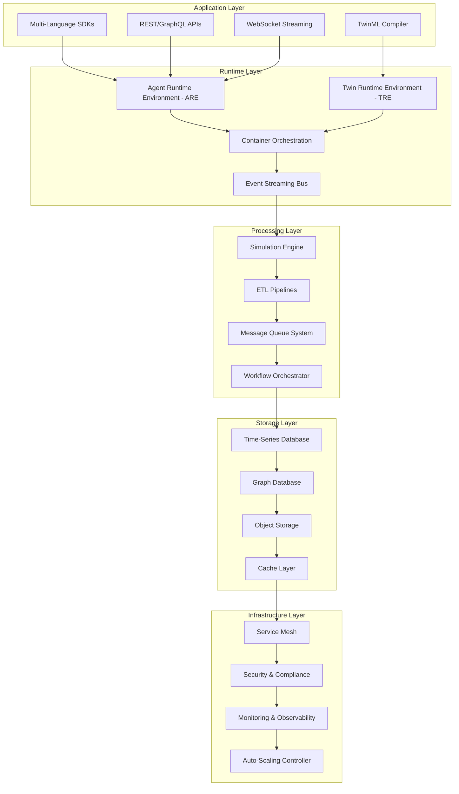

### Core Components Overview

#### Control Plane Architecture

The Control Plane serves as the central nervous system of the AMX Engine, responsible for orchestration, scheduling, and global state management:

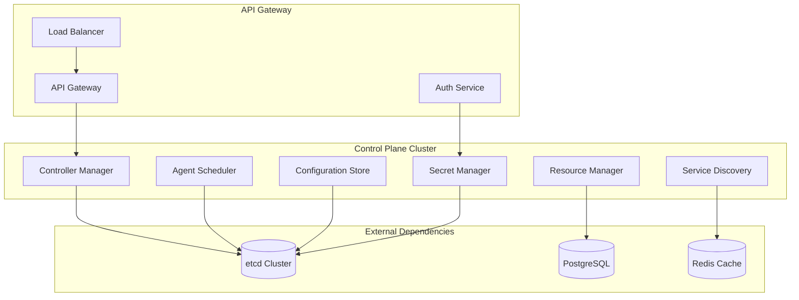

**Control Plane Components:**

- **Controller Manager**: Manages the lifecycle of all AMX resources (agents, twins, pods)
- **Agent Scheduler**: Intelligent scheduling of agents across worker nodes based on resource requirements and affinity rules
- **Resource Manager**: Tracks and allocates compute resources (CPU, memory, storage, GPU)
- **Service Discovery**: Dynamic service registration and discovery for inter-component communication
- **Configuration Store**: Centralized configuration management with versioning and rollback capabilities
- **Secret Manager**: Secure storage and distribution of credentials, certificates, and encryption keys

#### Worker Nodes Architecture

Worker nodes execute the actual workloads and provide the runtime environment for agents and digital twins:

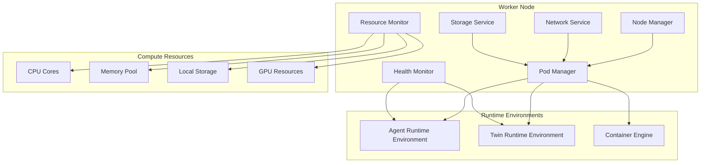

**Worker Node Components:**

- **Node Manager**: Coordinates all activities on the worker node and communicates with the control plane
- **Pod Manager**: Manages the lifecycle of agent and twin pods, including startup, shutdown, and resource allocation
- **Resource Monitor**: Continuously monitors resource utilization and reports metrics to the control plane
- **Health Monitor**: Performs health checks on running workloads and triggers recovery actions when needed
- **Network Service**: Manages pod networking, service mesh integration, and traffic routing
- **Storage Service**: Handles persistent storage mounting, volume management, and data lifecycle

#### Runtime Managers

The runtime managers provide specialized execution environments for different types of workloads:

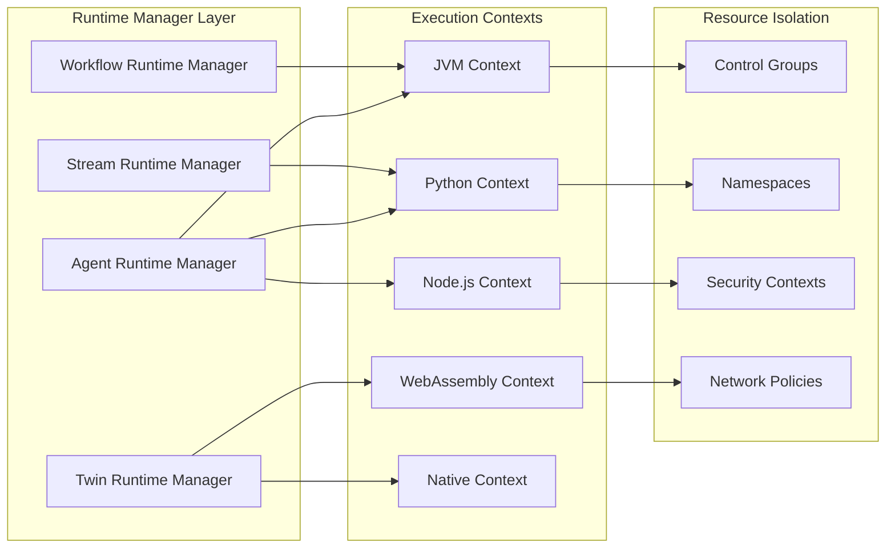

### Component Architecture

#### 1. Agent Runtime Environment (ARE)

The ARE provides a comprehensive execution environment for AI agents with advanced lifecycle management:

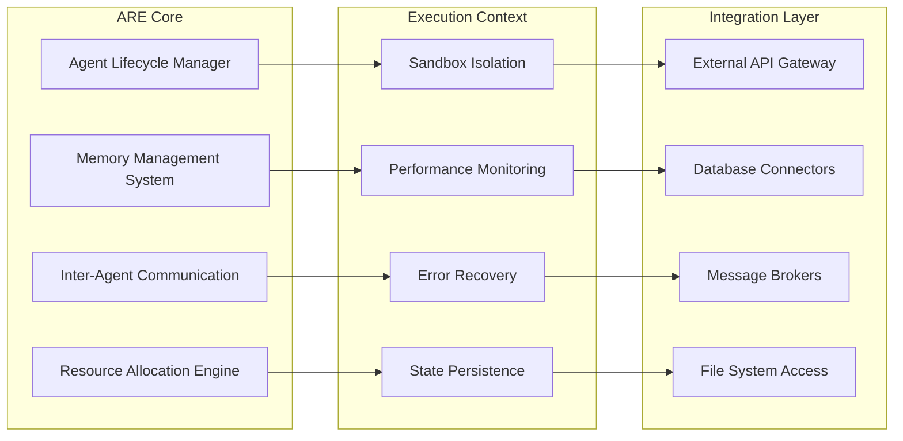

**Key Features:**
- **Hot-swappable agents** with zero-downtime deployment
- **Hierarchical memory architecture** (L1: working memory, L2: session memory, L3: persistent knowledge)
- **Multi-tenancy support** with strict isolation boundaries
- **Resource quotas and throttling** to prevent resource starvation
- **Circuit breakers** for fault tolerance and cascading failure prevention

#### 2. Twin Runtime Environment (TRE)

The TRE executes digital twin simulations with real-time synchronization capabilities:

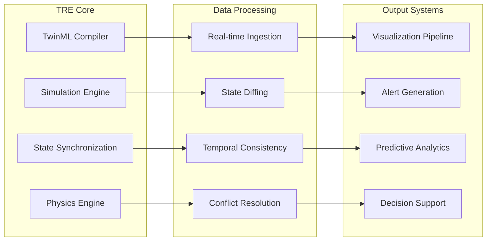

**Advanced Capabilities:**
- **MATLAB Simulink-inspired** block-based modeling environment
- **Real-time physics simulation** with configurable solvers
- **Multi-fidelity modeling** supporting different levels of detail
- **Distributed simulation** across multiple compute nodes
- **Temporal analytics** with time-travel debugging capabilities

## Container Orchestration Layer

### Kubernetes-Inspired Architecture

AMX Engine implements a sophisticated container orchestration system inspired by Kubernetes but specifically optimized for AI and digital twin workloads. The orchestration layer provides advanced scheduling, auto-scaling, and lifecycle management capabilities:

#### Orchestration Core Architecture

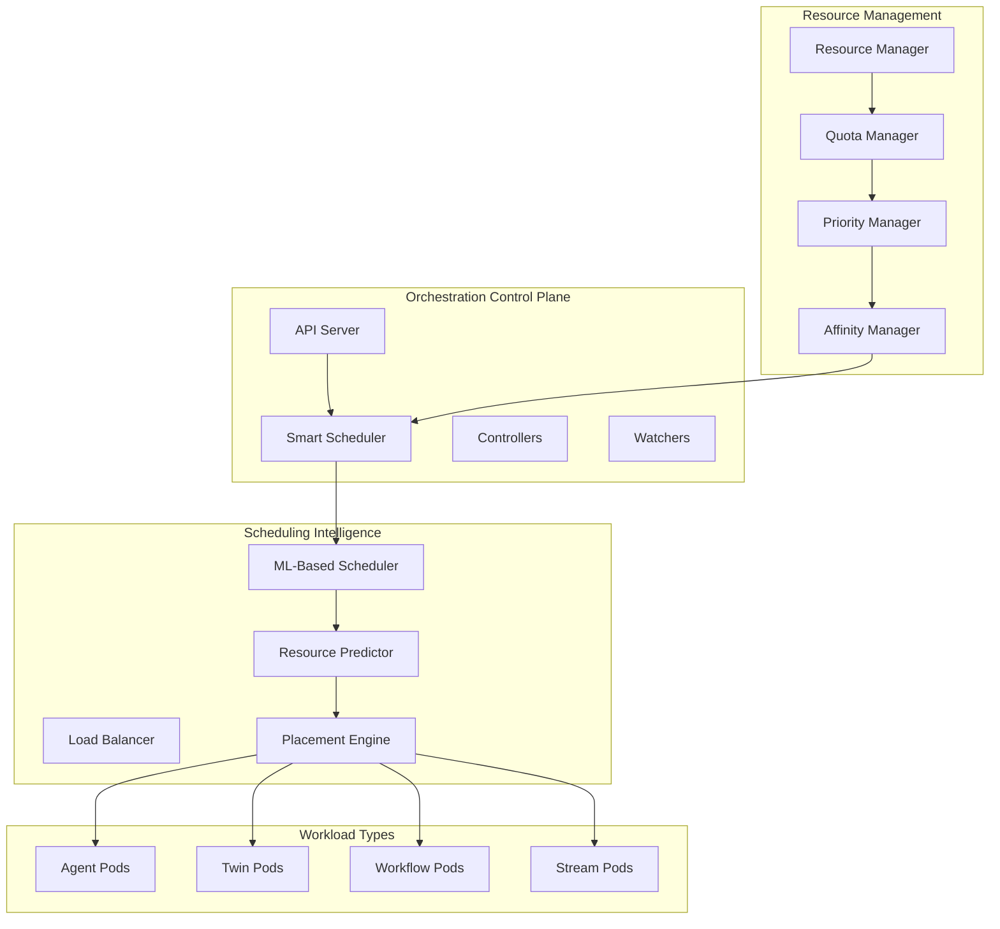

#### Advanced Scheduling Features

**AI-Optimized Scheduling:**
- **GPU Affinity**: Intelligent GPU allocation for ML workloads
- **Memory Prediction**: ML-based memory usage forecasting
- **Latency-Aware Placement**: Network latency optimization for distributed agents
- **Resource Learning**: Historical usage patterns inform future scheduling decisions

**Workload-Specific Scheduling:**
- **Agent Pods**: Optimized for stateful, long-running AI agent processes
- **Twin Pods**: Specialized for real-time simulation workloads with strict timing requirements
- **Workflow Pods**: Batch processing optimization with dependency management
- **Stream Pods**: Low-latency, high-throughput stream processing

AMX Engine implements a sophisticated container orchestration system inspired by Kubernetes, specifically designed for AI workloads:

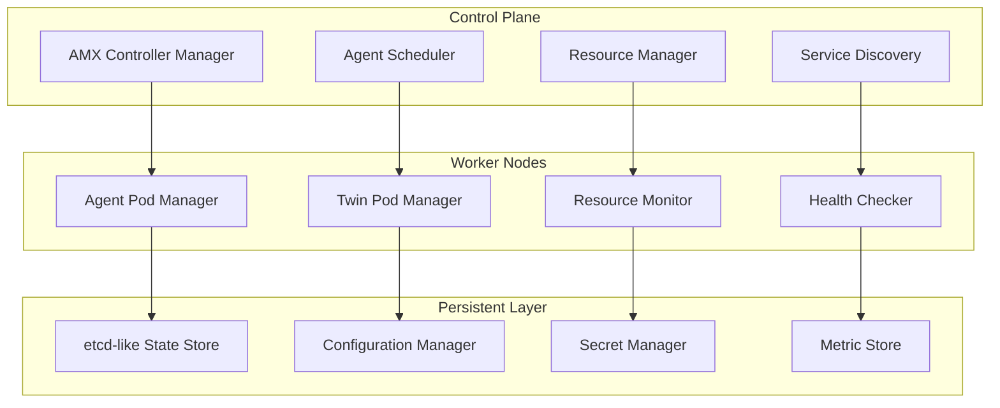

#### Communication Patterns Between Components

The AMX Engine employs multiple communication patterns optimized for different interaction scenarios:

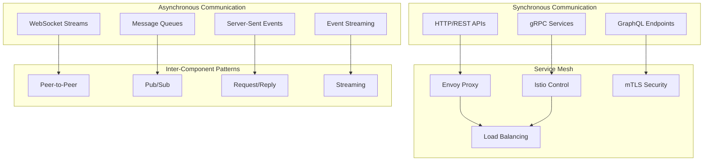

**Communication Patterns:**

1. **Control Plane Communication**:
   - **API Server ↔ Controllers**: gRPC with protobuf serialization
   - **Scheduler ↔ Nodes**: HTTP/2 with compression
   - **State Synchronization**: etcd watch streams with event sourcing

2. **Agent-to-Agent Communication**:
   - **Direct Messaging**: In-memory channels for co-located agents
   - **Network Messaging**: TCP/UDP sockets with custom protocols
   - **Message Queues**: Apache Kafka for reliable async messaging
   - **Event Bus**: Redis Streams for real-time event distribution

3. **Twin-to-System Communication**:
   - **Sensor Data Ingestion**: MQTT/CoAP for IoT device integration
   - **Real-time Updates**: WebSocket connections for live data streams
   - **Batch Processing**: Apache Pulsar for high-throughput data flows

4. **External Integration**:
   - **REST APIs**: Standard HTTP endpoints for external system integration
   - **GraphQL**: Flexible query interface for complex data requirements
   - **Webhooks**: Event-driven notifications to external systems

#### High-Level Integration Points

The AMX Engine provides multiple integration points for seamless connectivity with existing enterprise systems:

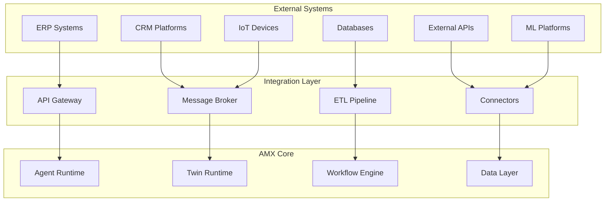

**Integration Capabilities:**

1. **Enterprise System Integration**:
   - **SAP Integration**: Pre-built connectors for SAP ERP, CRM, and analytics
   - **Microsoft Integration**: Native support for Azure services and Office 365
   - **Salesforce Integration**: REST and bulk API connectors for CRM data
   - **Database Integration**: JDBC/ODBC connectors for major databases

2. **Cloud Platform Integration**:
   - **AWS Services**: S3, Lambda, SQS, SNS, RDS, and more
   - **Google Cloud**: BigQuery, Pub/Sub, Cloud Functions, AI Platform
   - **Azure Services**: Cosmos DB, Service Bus, Functions, Cognitive Services

3. **ML/AI Platform Integration**:
   - **TensorFlow**: Native model serving and training integration
   - **PyTorch**: Model deployment and inference optimization
   - **Hugging Face**: Transformer model integration and fine-tuning
   - **MLflow**: Experiment tracking and model lifecycle management

4. **IoT and Edge Integration**:
   - **MQTT Brokers**: Eclipse Mosquitto, AWS IoT Core, Azure IoT Hub
   - **Edge Computing**: Kubernetes edge deployments and edge AI inference
   - **Industrial Protocols**: OPC-UA, Modbus, and other industrial communication standards

**Container Orchestration Features:**
- **Agent Pods**: Lightweight containers for individual agents with intelligent resource allocation
- **Twin Pods**: Specialized containers for digital twin simulations with real-time guarantees
- **Auto-scaling**: ML-driven dynamic scaling based on workload patterns and resource utilization
- **Rolling Updates**: Zero-downtime deployment with gradual rollout and automatic rollback
- **Health Monitoring**: Continuous health checks with automatic recovery and circuit breakers
- **Resource Quotas**: Dynamic CPU, memory, GPU, and storage limits per container with burst capabilities
- **Network Policies**: Secure communication between containers with service mesh integration
- **Persistent Volumes**: Durable storage for agent state and twin data with automated backup
- **GPU Scheduling**: Intelligent GPU resource allocation for ML workloads with fractional GPU support
- **Spot Instance Management**: Cost optimization through intelligent use of spot instances and preemptible VMs

### Pod Specification Format

```yaml
apiVersion: amx.aimatrix.com/v1
kind: AgentPod
metadata:
  name: customer-service-agent
  namespace: production
  labels:
    app: customer-service
    version: v2.1.0
spec:
  agent:
    name: CustomerServiceAgent
    version: "2.1.0"
    runtime: kotlin
    image: aimatrix/agents:customer-service-v2.1.0
  
  resources:
    requests:
      cpu: "500m"
      memory: "1Gi"
      storage: "10Gi"
    limits:
      cpu: "2000m"
      memory: "4Gi"
      storage: "50Gi"
  
  scaling:
    minReplicas: 2
    maxReplicas: 20
    metrics:
      - type: CPU
        target: 70
      - type: Memory
        target: 80
      - type: Custom
        name: messages_per_second
        target: 1000
  
  networking:
    ports:
      - name: http
        port: 8080
        protocol: TCP
      - name: grpc
        port: 9090
        protocol: TCP
    
  persistence:
    volumes:
      - name: agent-state
        type: persistent
        size: 20Gi
        accessMode: ReadWriteOnce
      - name: temp-data
        type: ephemeral
        size: 5Gi
  
  security:
    isolation: strict
    capabilities:
      - NET_ADMIN
    securityContext:
      runAsUser: 1000
      runAsGroup: 1000
      fsGroup: 1000
```

## Agent Runtime Environment (ARE) Implementation

### Memory Architecture

The ARE implements a sophisticated three-tier memory hierarchy:

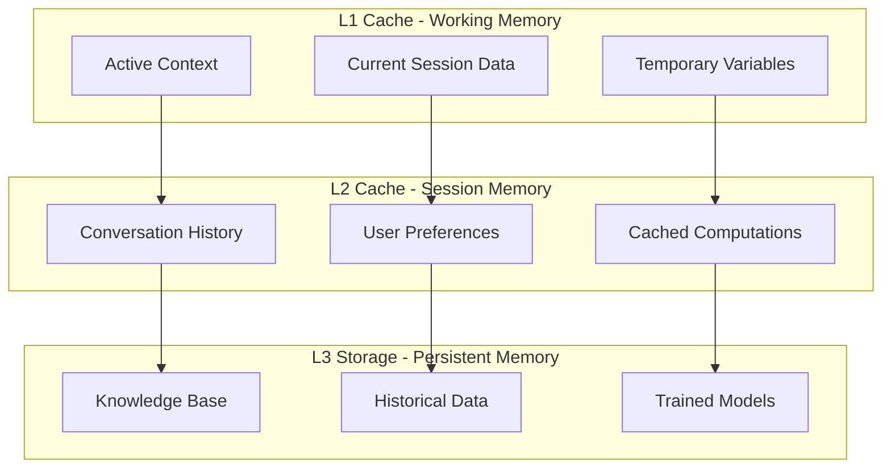

**Memory Management Features:**
- **Automatic Memory Tiering**: Hot data in L1, warm data in L2, cold data in L3
- **Compression Algorithms**: LZ4 for L1/L2, ZSTD for L3 storage
- **Memory-Mapped Files**: Efficient access to large datasets
- **Garbage Collection**: Generational GC with configurable policies
- **Memory Quotas**: Per-agent memory limits with overflow handling

### Process Orchestration

```kotlin
// Advanced process orchestration example
class ProcessOrchestrator {
    private val executor = ForkJoinPool.commonPool()
    private val scheduler = Executors.newScheduledThreadPool(4)
    private val rateLimiter = RateLimiter.create(1000.0) // 1000 ops/sec
    
    suspend fun executeAgent(
        agent: Agent,
        message: Message,
        priority: Priority = Priority.NORMAL
    ): ProcessingResult = withContext(Dispatchers.IO) {
        
        // Rate limiting
        rateLimiter.acquire()
        
        // Resource allocation
        val resources = allocateResources(agent, priority)
        
        try {
            // Set execution context
            val context = ExecutionContext(
                agentId = agent.id,
                resources = resources,
                isolation = IsolationLevel.STRICT,
                timeout = Duration.ofMinutes(5)
            )
            
            // Execute with monitoring
            val result = withTimeout(context.timeout.toMillis()) {
                executeInSandbox(agent, message, context)
            }
            
            // Update metrics
            updateMetrics(agent.id, result, resources.usedCpu, resources.usedMemory)
            
            result
            
        } catch (e: TimeoutCancellationException) {
            // Handle timeout
            killAgent(agent.id)
            ProcessingResult.error("Agent execution timed out")
        } catch (e: ResourceExhaustionException) {
            // Handle resource exhaustion
            throttleAgent(agent.id, Duration.ofMinutes(5))
            ProcessingResult.error("Agent resource limit exceeded")
        } finally {
            releaseResources(resources)
        }
    }
}
```

### Inter-Agent Communication

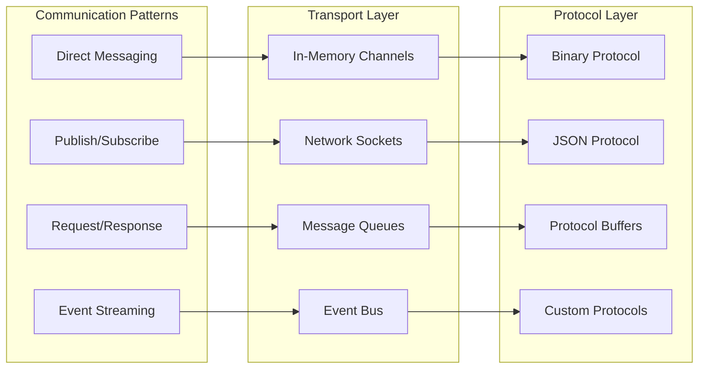

## Twin Runtime Environment (TRE) Implementation

The Twin Runtime Environment (TRE) is AMX Engine's comprehensive digital twin simulation platform, inspired by MATLAB Simulink's approach to system modeling and simulation. TRE provides a unified execution environment for all types of digital twins including Asset, Process, System, Organization, and Ecosystem twins, with advanced lifecycle management, real-time simulation capabilities, and sophisticated synchronization with physical systems.

### TRE Architecture and Components

The TRE follows a multi-layered architecture designed for scalability, performance, and real-time processing:

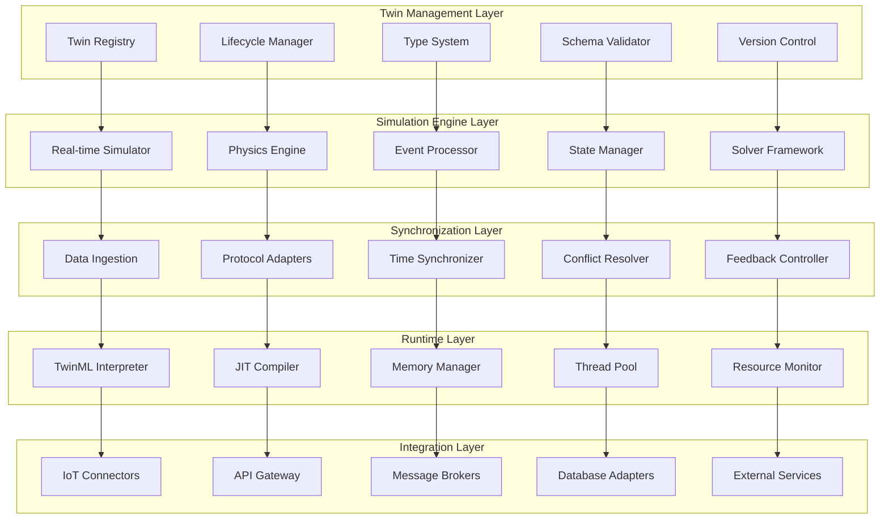

#### Core Components Overview

**Twin Management Layer:**
- **Twin Registry**: Centralized repository for twin definitions, metadata, and relationships
- **Lifecycle Manager**: Handles creation, initialization, execution, pause/resume, and termination
- **Type System**: Supports Asset, Process, System, Organization, and Ecosystem twin types
- **Schema Validator**: Ensures TwinML compliance and structural integrity
- **Version Control**: Manages twin evolution, rollback, and compatibility

**Simulation Engine Layer:**
- **Real-time Simulator**: High-performance simulation kernel with microsecond precision
- **Physics Engine**: Advanced physics modeling for mechanical, thermal, fluid dynamics
- **Event Processor**: Complex event processing with temporal pattern matching
- **State Manager**: Distributed state management with ACID properties
- **Solver Framework**: Multiple numerical solvers for differential equations

### Digital Twin Execution Model

The TRE implements a sophisticated execution model that supports multiple twin types with their specific characteristics:

```kotlin
// Digital twin execution model implementation
sealed class DigitalTwin(
    val id: TwinId,
    val type: TwinType,
    val version: String,
    val metadata: TwinMetadata
) {
    abstract suspend fun initialize(): TwinInitResult
    abstract suspend fun execute(context: ExecutionContext): ExecutionResult
    abstract suspend fun synchronize(physicalData: PhysicalData): SyncResult
    abstract suspend fun terminate(): TerminationResult
}

// Asset twin for physical equipment/devices
class AssetTwin(
    id: TwinId,
    val assetSpec: AssetSpecification,
    val sensors: List<SensorDefinition>,
    val actuators: List<ActuatorDefinition>
) : DigitalTwin(id, TwinType.ASSET, "1.0", assetSpec.metadata) {
    
    private val physicsModel = PhysicsModel(assetSpec.physicalProperties)
    private val behaviorModel = BehaviorModel(assetSpec.behaviors)
    private val synchronizer = AssetSynchronizer(sensors, actuators)
    
    override suspend fun initialize(): TwinInitResult {
        return try {
            // Initialize physics simulation
            physicsModel.initialize()
            
            // Setup sensor/actuator connections
            synchronizer.establishConnections()
            
            // Load behavior rules
            behaviorModel.compile(assetSpec.twinMLCode)
            
            TwinInitResult.Success(
                initialState = physicsModel.getCurrentState(),
                connectedSensors = synchronizer.getActiveSensors(),
                availableActuators = synchronizer.getActiveActuators()
            )
        } catch (e: Exception) {
            TwinInitResult.Failure(e.message ?: "Unknown initialization error")
        }
    }
    
    override suspend fun execute(context: ExecutionContext): ExecutionResult {
        val startTime = System.nanoTime()
        
        return try {
            // Update physics simulation
            val physicsState = physicsModel.step(context.timestep)
            
            // Process behavior rules
            val behaviorEvents = behaviorModel.process(physicsState, context)
            
            // Handle actuator commands
            val actuatorCommands = behaviorEvents.filterIsInstance<ActuatorCommand>()
            synchronizer.sendActuatorCommands(actuatorCommands)
            
            // Generate telemetry
            val telemetry = generateTelemetry(physicsState, behaviorEvents)
            
            ExecutionResult.Success(
                newState = physicsState,
                events = behaviorEvents,
                telemetry = telemetry,
                executionTime = Duration.ofNanos(System.nanoTime() - startTime)
            )
        } catch (e: Exception) {
            ExecutionResult.Failure(
                error = e.message ?: "Execution failed",
                partialState = physicsModel.getCurrentState(),
                executionTime = Duration.ofNanos(System.nanoTime() - startTime)
            )
        }
    }
    
    override suspend fun synchronize(physicalData: PhysicalData): SyncResult {
        return synchronizer.synchronize(physicalData, physicsModel.getCurrentState())
    }
}

// Process twin for business/operational processes
class ProcessTwin(
    id: TwinId,
    val processSpec: ProcessSpecification,
    val workflowEngine: WorkflowEngine
) : DigitalTwin(id, TwinType.PROCESS, "1.0", processSpec.metadata) {
    
    private val stateChart = StateChart(processSpec.states, processSpec.transitions)
    private val kpiCalculator = KPICalculator(processSpec.kpis)
    private val optimizer = ProcessOptimizer(processSpec.objectives)
    
    override suspend fun initialize(): TwinInitResult {
        workflowEngine.initialize()
        stateChart.initialize(processSpec.initialState)
        return TwinInitResult.Success(
            initialState = stateChart.getCurrentState(),
            connectedSensors = emptyList(),
            availableActuators = emptyList()
        )
    }
    
    override suspend fun execute(context: ExecutionContext): ExecutionResult {
        // Execute process steps
        val workflowResult = workflowEngine.executeStep(context)
        
        // Update state chart
        stateChart.processEvent(workflowResult.event)
        
        // Calculate KPIs
        val kpis = kpiCalculator.calculate(stateChart.getCurrentState())
        
        // Apply optimizations
        val optimizations = optimizer.suggest(kpis, workflowResult)
        
        return ExecutionResult.Success(
            newState = stateChart.getCurrentState(),
            events = listOf(workflowResult.event),
            telemetry = mapOf("kpis" to kpis, "optimizations" to optimizations),
            executionTime = workflowResult.executionTime
        )
    }
    
    override suspend fun synchronize(physicalData: PhysicalData): SyncResult {
        // Process twins sync with business systems rather than physical sensors
        return SyncResult.NotApplicable("Process twins sync with business systems")
    }
}

// System twin for complex system-of-systems
class SystemTwin(
    id: TwinId,
    val systemSpec: SystemSpecification,
    val childTwins: List<DigitalTwin>,
    val interconnections: List<TwinInterconnection>
) : DigitalTwin(id, TwinType.SYSTEM, "1.0", systemSpec.metadata) {
    
    private val orchestrator = TwinOrchestrator(childTwins, interconnections)
    private val emergentBehaviorDetector = EmergentBehaviorDetector()
    
    override suspend fun initialize(): TwinInitResult {
        // Initialize all child twins
        val childResults = childTwins.map { it.initialize() }
        
        if (childResults.any { it is TwinInitResult.Failure }) {
            return TwinInitResult.Failure("One or more child twins failed to initialize")
        }
        
        // Setup interconnections
        orchestrator.establishConnections()
        
        return TwinInitResult.Success(
            initialState = orchestrator.getSystemState(),
            connectedSensors = childResults.flatMap { it.connectedSensors },
            availableActuators = childResults.flatMap { it.availableActuators }
        )
    }
    
    override suspend fun execute(context: ExecutionContext): ExecutionResult {
        // Execute child twins in parallel
        val childResults = childTwins.map { twin ->
            async { twin.execute(context) }
        }.awaitAll()
        
        // Process inter-twin communications
        val interactions = orchestrator.processInteractions(childResults)
        
        // Detect emergent behaviors
        val emergentBehaviors = emergentBehaviorDetector.analyze(childResults, interactions)
        
        // Aggregate system state
        val systemState = orchestrator.aggregateState(childResults)
        
        return ExecutionResult.Success(
            newState = systemState,
            events = interactions + emergentBehaviors,
            telemetry = aggregateTelemetry(childResults),
            executionTime = childResults.maxOf { it.executionTime }
        )
    }
}
```

### Real-time Simulation Engine Design

The TRE simulation engine is designed for high-performance, real-time execution with multiple solver options and adaptive timestep management:

```kotlin
// Real-time simulation engine implementation
class RealTimeSimulationEngine {
    private val solverRegistry = SolverRegistry()
    private val timestepManager = AdaptiveTimestepManager()
    private val parallelExecutor = ParallelExecutor()
    private val performanceMonitor = SimulationPerformanceMonitor()
    
    init {
        // Register available numerical solvers
        solverRegistry.register("euler", EulerSolver())
        solverRegistry.register("runge_kutta_4", RungeKutta4Solver())
        solverRegistry.register("adams_bashforth", AdamsBashforthSolver())
        solverRegistry.register("implicit_euler", ImplicitEulerSolver())
        solverRegistry.register("bdf", BackwardDifferentiationSolver())
        solverRegistry.register("cvode", CVODESolver()) // SUNDIALS integration
    }
    
    suspend fun runSimulation(
        twins: List<DigitalTwin>,
        simulationConfig: SimulationConfiguration
    ): SimulationResult = withContext(Dispatchers.Default) {
        
        val session = SimulationSession(
            id = UUID.randomUUID(),
            twins = twins,
            config = simulationConfig,
            startTime = Instant.now()
        )
        
        performanceMonitor.startSession(session)
        
        try {
            when (simulationConfig.mode) {
                SimulationMode.REAL_TIME -> runRealTimeSimulation(session)
                SimulationMode.BATCH -> runBatchSimulation(session)
                SimulationMode.MONTE_CARLO -> runMonteCarloSimulation(session)
                SimulationMode.SENSITIVITY_ANALYSIS -> runSensitivityAnalysis(session)
            }
        } finally {
            performanceMonitor.endSession(session)
        }
    }
    
    private suspend fun runRealTimeSimulation(
        session: SimulationSession
    ): SimulationResult {
        val results = mutableListOf<SimulationFrame>()
        val wallClockStart = System.nanoTime()
        var simulationTime = session.config.startTime
        val endTime = session.config.endTime
        
        // Real-time synchronization
        val realTimeSync = RealTimeSync(session.config.timeScale)
        
        while (simulationTime.isBefore(endTime)) {
            val frameStart = System.nanoTime()
            
            // Adaptive timestep calculation
            val timestep = timestepManager.calculateTimestep(
                currentTime = simulationTime,
                twins = session.twins,
                targetAccuracy = session.config.targetAccuracy,
                maxTimestep = session.config.maxTimestep
            )
            
            // Execute simulation step
            val frame = executeSimulationStep(
                session = session,
                currentTime = simulationTime,
                timestep = timestep
            )
            
            results.add(frame)
            simulationTime = simulationTime.plus(timestep)
            
            // Real-time synchronization
            realTimeSync.synchronize(frameStart, timestep)
            
            // Performance monitoring
            performanceMonitor.recordFrame(frame, System.nanoTime() - frameStart)
            
            // Check for early termination conditions
            if (shouldTerminateEarly(frame, session.config)) {
                break
            }
            
            // Yield control periodically
            if (results.size % 1000 == 0) {
                yield()
            }
        }
        
        return SimulationResult(
            sessionId = session.id,
            frames = results,
            totalDuration = Duration.ofNanos(System.nanoTime() - wallClockStart),
            simulatedDuration = Duration.between(session.config.startTime, simulationTime),
            performance = performanceMonitor.getSessionMetrics(session.id),
            status = SimulationStatus.COMPLETED
        )
    }
    
    private suspend fun executeSimulationStep(
        session: SimulationSession,
        currentTime: Instant,
        timestep: Duration
    ): SimulationFrame {
        
        val context = ExecutionContext(
            currentTime = currentTime,
            timestep = timestep,
            sessionId = session.id,
            configuration = session.config
        )
        
        // Execute twins in parallel where possible
        val twinResults = if (session.config.allowParallelExecution) {
            parallelExecutor.executeInParallel(session.twins, context)
        } else {
            session.twins.map { twin ->
                twin.execute(context)
            }
        }
        
        // Process inter-twin communications
        val communications = processInterTwinCommunications(twinResults)
        
        // Aggregate frame data
        return SimulationFrame(
            timestamp = currentTime,
            timestep = timestep,
            twinResults = twinResults,
            communications = communications,
            systemMetrics = collectSystemMetrics(),
            validationErrors = validateFrameConsistency(twinResults)
        )
    }
    
    private suspend fun runMonteCarloSimulation(
        session: SimulationSession
    ): SimulationResult {
        val monteCarloConfig = session.config.monteCarloConfig 
            ?: throw IllegalArgumentException("Monte Carlo configuration required")
        
        val allResults = ConcurrentLinkedQueue<SimulationResult>()
        val random = SecureRandom()
        
        // Run multiple simulation iterations with parameter variations
        (1..monteCarloConfig.iterations).toList().chunked(
            session.config.maxParallelRuns
        ).forEach { batch ->
            
            val batchResults = batch.map { iteration ->
                async {
                    val perturbedConfig = perturbParameters(
                        session.config, 
                        monteCarloConfig.parameterDistributions,
                        random
                    )
                    
                    val perturbedSession = session.copy(config = perturbedConfig)
                    runBatchSimulation(perturbedSession)
                }
            }.awaitAll()
            
            allResults.addAll(batchResults)
        }
        
        // Aggregate Monte Carlo results
        return aggregateMonteCarloResults(allResults.toList(), monteCarloConfig)
    }
}

// Advanced solver framework
abstract class NumericalSolver {
    abstract fun solve(
        state: SimulationState,
        derivatives: (SimulationState, Instant) -> SimulationState,
        timestep: Duration,
        currentTime: Instant
    ): SolverResult
    
    abstract val order: Int
    abstract val stability: StabilityCharacteristics
    abstract val computationalComplexity: ComplexityClass
}

class RungeKutta4Solver : NumericalSolver() {
    override val order = 4
    override val stability = StabilityCharacteristics.EXPLICIT
    override val computationalComplexity = ComplexityClass.O_N
    
    override fun solve(
        state: SimulationState,
        derivatives: (SimulationState, Instant) -> SimulationState,
        timestep: Duration,
        currentTime: Instant
    ): SolverResult {
        
        val dt = timestep.toNanos() / 1_000_000_000.0
        val k1 = derivatives(state, currentTime)
        val k2 = derivatives(state + k1 * (dt/2.0), currentTime.plusNanos((dt/2.0 * 1e9).toLong()))
        val k3 = derivatives(state + k2 * (dt/2.0), currentTime.plusNanos((dt/2.0 * 1e9).toLong()))
        val k4 = derivatives(state + k3 * dt, currentTime.plusNanos((dt * 1e9).toLong()))
        
        val newState = state + (k1 + k2*2.0 + k3*2.0 + k4) * (dt/6.0)
        
        return SolverResult(
            newState = newState,
            error = estimateLocalTruncationError(k1, k2, k3, k4, dt),
            iterations = 1,
            converged = true
        )
    }
    
    private fun estimateLocalTruncationError(
        k1: SimulationState, k2: SimulationState, 
        k3: SimulationState, k4: SimulationState, 
        dt: Double
    ): Double {
        // Local truncation error estimation for RK4
        val errorState = (k1 - k2*2.0 + k3) * (dt.pow(5) / 90.0)
        return errorState.magnitude()
    }
}
```

### TwinML Runtime Integration

The TRE provides seamless integration with TwinML through a sophisticated runtime interpreter and JIT compiler:

```kotlin
// TwinML runtime integration
class TwinMLRuntime {
    private val interpreter = TwinMLInterpreter()
    private val jitCompiler = TwinMLJITCompiler()
    private val typeSystem = TwinMLTypeSystem()
    private val memoryManager = TwinMLMemoryManager()
    
    suspend fun loadTwinDefinition(
        twinMLCode: String,
        optimizationLevel: OptimizationLevel = OptimizationLevel.O2
    ): CompiledTwin {
        
        // Parse TwinML source
        val ast = interpreter.parse(twinMLCode)
        
        // Type checking and semantic analysis
        val typedAst = typeSystem.analyze(ast)
        
        // Optimization passes
        val optimizedAst = when (optimizationLevel) {
            OptimizationLevel.O0 -> typedAst // No optimization
            OptimizationLevel.O1 -> applyBasicOptimizations(typedAst)
            OptimizationLevel.O2 -> applyAdvancedOptimizations(typedAst)
            OptimizationLevel.O3 -> applyAggressiveOptimizations(typedAst)
        }
        
        // JIT compilation
        val compiledCode = jitCompiler.compile(optimizedAst)
        
        return CompiledTwin(
            ast = optimizedAst,
            bytecode = compiledCode,
            metadata = extractMetadata(optimizedAst),
            dependencies = resolveDependencies(optimizedAst)
        )
    }
    
    suspend fun executeTwinBehavior(
        twin: CompiledTwin,
        event: TwinEvent,
        context: ExecutionContext
    ): BehaviorExecutionResult {
        
        // Create execution environment
        val environment = ExecutionEnvironment(
            twin = twin,
            context = context,
            memoryManager = memoryManager,
            eventQueue = EventQueue()
        )
        
        try {
            // Find matching behavior handler
            val handler = twin.findBehaviorHandler(event)
                ?: return BehaviorExecutionResult.NoHandler(event.type)
            
            // Execute compiled behavior
            val result = jitCompiler.execute(handler.bytecode, environment)
            
            return BehaviorExecutionResult.Success(
                result = result,
                sideEffects = environment.collectSideEffects(),
                memoryUsage = memoryManager.getCurrentUsage(),
                executionTime = result.executionTime
            )
            
        } catch (e: TwinMLRuntimeException) {
            return BehaviorExecutionResult.Error(
                error = e,
                stackTrace = e.twinMLStackTrace,
                context = environment.captureContext()
            )
        }
    }
}

// Advanced TwinML type system
class TwinMLTypeSystem {
    private val primitiveTypes = setOf(
        "integer", "float", "boolean", "string", "timestamp", 
        "duration", "vector", "matrix", "complex"
    )
    
    private val collectionTypes = setOf("list", "map", "set", "queue")
    private val specializationTypes = mutableMapOf<String, TypeDefinition>()
    
    fun analyze(ast: TwinMLAST): TypedTwinMLAST {
        val typeChecker = TypeChecker(
            primitiveTypes = primitiveTypes,
            collectionTypes = collectionTypes,
            userDefinedTypes = specializationTypes
        )
        
        return typeChecker.check(ast)
    }
    
    fun defineCustomType(
        name: String,
        definition: TypeDefinition
    ) {
        specializationTypes[name] = definition
    }
    
    // Support for complex types in engineering applications
    fun registerEngineeringTypes() {
        defineCustomType("Temperature", TypeDefinition(
            baseType = "float",
            unit = "celsius",
            constraints = listOf(
                Constraint.Range(-273.15, Double.MAX_VALUE),
                Constraint.Precision(2)
            )
        ))
        
        defineCustomType("Pressure", TypeDefinition(
            baseType = "float",
            unit = "pascal",
            constraints = listOf(
                Constraint.NonNegative,
                Constraint.Precision(1)
            )
        ))
        
        defineCustomType("Position3D", TypeDefinition(
            baseType = "vector",
            dimensions = 3,
            unit = "meter",
            constraints = listOf(
                Constraint.FiniteValues
            )
        ))
    }
}
```

### Synchronization Protocols

The TRE implements sophisticated synchronization protocols to maintain consistency between digital twins and their physical counterparts:

```kotlin
// Advanced synchronization protocols
class TwinSynchronizationManager {
    private val protocolRegistry = ProtocolRegistry()
    private val conflictResolver = ConflictResolver()
    private val timeSync = TimeSynchronizer()
    private val dataValidator = DataValidator()
    
    init {
        registerStandardProtocols()
    }
    
    private fun registerStandardProtocols() {
        protocolRegistry.register("mqtt", MQTTSyncProtocol())
        protocolRegistry.register("opcua", OPCUASyncProtocol())
        protocolRegistry.register("modbus", ModbusSyncProtocol())
        protocolRegistry.register("coap", CoAPSyncProtocol())
        protocolRegistry.register("websocket", WebSocketSyncProtocol())
        protocolRegistry.register("grpc", GRPCSyncProtocol())
    }
    
    suspend fun synchronizeTwin(
        twin: DigitalTwin,
        physicalSystem: PhysicalSystem,
        syncConfig: SynchronizationConfiguration
    ): SynchronizationResult {
        
        val protocol = protocolRegistry.get(syncConfig.protocol)
            ?: return SynchronizationResult.ProtocolNotFound(syncConfig.protocol)
        
        return try {
            // Establish connection to physical system
            val connection = protocol.connect(physicalSystem.connectionInfo)
            
            // Time synchronization
            val timeOffset = timeSync.calculateOffset(connection)
            
            // Bidirectional data synchronization
            val syncResult = performBidirectionalSync(
                twin, connection, syncConfig, timeOffset
            )
            
            SynchronizationResult.Success(syncResult)
            
        } catch (e: SynchronizationException) {
            SynchronizationResult.Failure(e.message ?: "Synchronization failed", e)
        }
    }
    
    private suspend fun performBidirectionalSync(
        twin: DigitalTwin,
        connection: ProtocolConnection,
        config: SynchronizationConfiguration,
        timeOffset: Duration
    ): DetailedSyncResult {
        
        val startTime = Instant.now()
        val telemetryData = mutableListOf<TelemetryPoint>()
        val commandsSent = mutableListOf<Command>()
        val conflicts = mutableListOf<DataConflict>()
        
        // Phase 1: Read from physical system
        val physicalData = connection.readSensorData(config.sensorMappings)
        
        // Validate and transform incoming data
        val validatedData = dataValidator.validate(physicalData, config.validationRules)
        val transformedData = applyDataTransformations(validatedData, config.transformations)
        
        // Apply time correction
        val timeCorrectedData = transformedData.map { dataPoint ->
            dataPoint.copy(timestamp = dataPoint.timestamp.plus(timeOffset))
        }
        
        // Detect conflicts between twin state and physical data
        val detectedConflicts = conflictResolver.detectConflicts(
            twinState = twin.getCurrentState(),
            physicalData = timeCorrectedData
        )
        
        conflicts.addAll(detectedConflicts)
        
        // Resolve conflicts using configured strategy
        val resolvedData = if (detectedConflicts.isNotEmpty()) {
            conflictResolver.resolve(detectedConflicts, config.conflictResolutionStrategy)
        } else {
            timeCorrectedData
        }
        
        // Update twin with resolved data
        val syncResult = twin.synchronize(PhysicalData(resolvedData))
        
        // Phase 2: Send commands to physical system
        if (config.enableActuatorControl) {
            val pendingCommands = twin.getPendingActuatorCommands()
            
            for (command in pendingCommands) {
                try {
                    connection.sendActuatorCommand(command)
                    commandsSent.add(command)
                    twin.markCommandAsSent(command.id)
                } catch (e: CommandExecutionException) {
                    twin.markCommandAsFailed(command.id, e.message)
                }
            }
        }
        
        return DetailedSyncResult(
            duration = Duration.between(startTime, Instant.now()),
            dataPointsReceived = resolvedData.size,
            commandsSent = commandsSent.size,
            conflicts = conflicts,
            telemetry = telemetryData,
            success = syncResult.isSuccess,
            errors = if (syncResult.isFailure) listOf(syncResult.error) else emptyList()
        )
    }
}

// OPC UA synchronization protocol implementation
class OPCUASyncProtocol : SynchronizationProtocol {
    private val client = OpcUaClient.create("urn:amx:twin-runtime")
    
    override suspend fun connect(connectionInfo: ConnectionInfo): ProtocolConnection {
        val endpointUrl = connectionInfo.url
        val securityPolicy = SecurityPolicy.valueOf(
            connectionInfo.parameters["securityPolicy"] ?: "None"
        )
        
        client.connect(endpointUrl, securityPolicy).get()
        
        return OPCUAConnection(client)
    }
}

class OPCUAConnection(private val client: OpcUaClient) : ProtocolConnection {
    
    override suspend fun readSensorData(
        mappings: List<SensorMapping>
    ): List<DataPoint> = withContext(Dispatchers.IO) {
        
        val nodeIds = mappings.map { NodeId.parse(it.address) }
        val readRequest = ReadRequest(
            requestHeader = RequestHeader.NULL_REQUEST_HEADER,
            nodesToRead = nodeIds.map { nodeId ->
                ReadValueId(nodeId, AttributeId.Value.uid(), null, QualifiedName.NULL_VALUE)
            }.toTypedArray(),
            maxAge = 0.0,
            timestampsToReturn = TimestampsToReturn.Both
        )
        
        val response = client.read(readRequest).get()
        
        response.results.mapIndexedNotNull { index, dataValue ->
            if (dataValue.statusCode.isGood) {
                DataPoint(
                    sensor = mappings[index].sensorId,
                    value = dataValue.value.value,
                    timestamp = dataValue.serverTimestamp?.javaInstant ?: Instant.now(),
                    quality = dataValue.statusCode.value.toDouble(),
                    metadata = mapOf("nodeId" to nodeIds[index].toParseableString())
                )
            } else {
                null
            }
        }
    }
    
    override suspend fun sendActuatorCommand(command: Command): CommandResult {
        return try {
            val nodeId = NodeId.parse(command.targetAddress)
            val variant = Variant(command.value)
            
            val writeRequest = WriteRequest(
                requestHeader = RequestHeader.NULL_REQUEST_HEADER,
                nodesToWrite = arrayOf(
                    WriteValue(nodeId, AttributeId.Value.uid(), null, DataValue(variant))
                )
            )
            
            val response = client.write(writeRequest).get()
            val statusCode = response.results[0]
            
            if (statusCode.isGood) {
                CommandResult.Success(command.id, Instant.now())
            } else {
                CommandResult.Failure(command.id, statusCode.toString())
            }
            
        } catch (e: Exception) {
            CommandResult.Failure(command.id, e.message ?: "Unknown error")
        }
    }
}
```

### Event Processing and State Management

The TRE implements sophisticated event processing and state management capabilities for handling complex twin behaviors and interactions:

```kotlin
// Advanced event processing system
class TwinEventProcessor {
    private val eventQueue = PriorityBlockingQueue<TwinEvent>(1000) { e1, e2 ->
        e1.priority.compareTo(e2.priority)
    }
    private val patternMatcher = ComplexEventPatternMatcher()
    private val stateManager = DistributedStateManager()
    private val eventHandlers = ConcurrentHashMap<EventType, List<EventHandler>>()
    
    suspend fun processEvent(event: TwinEvent): EventProcessingResult {
        return try {
            // Validate event
            val validationResult = validateEvent(event)
            if (!validationResult.isValid) {
                return EventProcessingResult.ValidationFailed(validationResult.errors)
            }
            
            // Pattern matching for complex events
            val matchedPatterns = patternMatcher.match(event)
            
            // State transition processing
            val stateChanges = processStateTransitions(event, matchedPatterns)
            
            // Execute event handlers
            val handlerResults = executeEventHandlers(event, matchedPatterns)
            
            // Update distributed state
            stateManager.applyChanges(stateChanges)
            
            EventProcessingResult.Success(
                event = event,
                stateChanges = stateChanges,
                handlerResults = handlerResults,
                matchedPatterns = matchedPatterns
            )
            
        } catch (e: Exception) {
            EventProcessingResult.Error(event, e.message ?: "Processing failed")
        }
    }
    
    // Complex event pattern matching
    private suspend fun processStateTransitions(
        event: TwinEvent,
        matchedPatterns: List<EventPattern>
    ): List<StateChange> {
        
        val transitions = mutableListOf<StateChange>()
        
        for (pattern in matchedPatterns) {
            when (pattern.type) {
                EventPatternType.SEQUENCE -> {
                    // Handle sequential event patterns
                    val sequenceState = stateManager.getSequenceState(pattern.id)
                    val newState = sequenceState.advance(event)
                    
                    if (newState.isComplete) {
                        transitions.add(StateChange.SequenceCompleted(pattern.id, newState))
                    } else {
                        transitions.add(StateChange.SequenceAdvanced(pattern.id, newState))
                    }
                }
                
                EventPatternType.TEMPORAL -> {
                    // Handle time-based patterns
                    val temporalWindow = stateManager.getTemporalWindow(pattern.id)
                    if (temporalWindow.contains(event.timestamp)) {
                        val aggregateState = temporalWindow.aggregate(event)
                        transitions.add(StateChange.TemporalAggregated(pattern.id, aggregateState))
                    }
                }
                
                EventPatternType.SPATIAL -> {
                    // Handle location-based patterns
                    val spatialRegion = stateManager.getSpatialRegion(pattern.id)
                    if (spatialRegion.contains(event.location)) {
                        val spatialState = spatialRegion.updateWithEvent(event)
                        transitions.add(StateChange.SpatialUpdated(pattern.id, spatialState))
                    }
                }
                
                EventPatternType.CAUSAL -> {
                    // Handle cause-effect patterns
                    val causalChain = stateManager.getCausalChain(pattern.id)
                    val chainState = causalChain.processEvent(event)
                    transitions.add(StateChange.CausalChainUpdated(pattern.id, chainState))
                }
            }
        }
        
        return transitions
    }
}

// Distributed state management with ACID properties
class DistributedStateManager {
    private val statePartitions = ConcurrentHashMap<PartitionKey, StatePartition>()
    private val transactionManager = TransactionManager()
    private val replicationManager = ReplicationManager()
    private val consistencyChecker = ConsistencyChecker()
    
    suspend fun applyChanges(changes: List<StateChange>): StateTransactionResult {
        val transaction = transactionManager.beginTransaction()
        
        return try {
            // Group changes by partition for efficient processing
            val changesByPartition = changes.groupBy { it.partitionKey }
            
            // Apply changes within transaction
            val results = changesByPartition.map { (partitionKey, partitionChanges) ->
                async {
                    applyPartitionChanges(partitionKey, partitionChanges, transaction)
                }
            }.awaitAll()
            
            // Consistency validation
            val consistencyResult = consistencyChecker.validate(results)
            if (!consistencyResult.isConsistent) {
                transaction.rollback()
                return StateTransactionResult.ConsistencyViolation(consistencyResult.violations)
            }
            
            // Replicate changes
            replicationManager.replicate(changes, transaction.id)
            
            // Commit transaction
            transaction.commit()
            
            StateTransactionResult.Success(
                transactionId = transaction.id,
                appliedChanges = changes,
                partitionResults = results
            )
            
        } catch (e: Exception) {
            transaction.rollback()
            StateTransactionResult.Failure(transaction.id, e.message ?: "State update failed")
        }
    }
    
    private suspend fun applyPartitionChanges(
        partitionKey: PartitionKey,
        changes: List<StateChange>,
        transaction: StateTransaction
    ): PartitionUpdateResult {
        
        val partition = statePartitions.computeIfAbsent(partitionKey) { 
            StatePartition(partitionKey)
        }
        
        return partition.applyChanges(changes, transaction)
    }
    
    // State querying with consistency guarantees
    suspend fun queryState(
        query: StateQuery,
        consistencyLevel: ConsistencyLevel = ConsistencyLevel.STRONG
    ): StateQueryResult {
        
        return when (consistencyLevel) {
            ConsistencyLevel.STRONG -> queryWithStrongConsistency(query)
            ConsistencyLevel.EVENTUAL -> queryWithEventualConsistency(query)
            ConsistencyLevel.WEAK -> queryWithWeakConsistency(query)
        }
    }
    
    private suspend fun queryWithStrongConsistency(query: StateQuery): StateQueryResult {
        // Ensure all replicas are synchronized before query
        replicationManager.waitForSynchronization()
        
        val relevantPartitions = findPartitionsForQuery(query)
        val partitionResults = relevantPartitions.map { partition ->
            async { partition.executeQuery(query) }
        }.awaitAll()
        
        return aggregateQueryResults(partitionResults, query)
    }
}

// Advanced state partition implementation
class StatePartition(val key: PartitionKey) {
    private val stateStore = ConcurrentHashMap<StateKey, StateValue>()
    private val versionVector = VersionVector()
    private val lockManager = PartitionLockManager()
    private val changeLog = PartitionChangeLog()
    
    suspend fun applyChanges(
        changes: List<StateChange>,
        transaction: StateTransaction
    ): PartitionUpdateResult = lockManager.withWriteLock {
        
        val appliedChanges = mutableListOf<StateChange>()
        val failedChanges = mutableListOf<StateChangeError>()
        
        for (change in changes) {
            try {
                when (change) {
                    is StateChange.ValueUpdate -> {
                        val oldValue = stateStore[change.key]
                        val newValue = applyValueChange(change, oldValue)
                        stateStore[change.key] = newValue
                        versionVector.increment(key)
                        appliedChanges.add(change)
                    }
                    
                    is StateChange.StructuralChange -> {
                        applyStructuralChange(change)
                        versionVector.increment(key)
                        appliedChanges.add(change)
                    }
                    
                    is StateChange.RelationshipChange -> {
                        applyRelationshipChange(change)
                        versionVector.increment(key)
                        appliedChanges.add(change)
                    }
                }
                
                // Log change for replication
                changeLog.append(change, transaction.id, versionVector.current)
                
            } catch (e: StateChangeException) {
                failedChanges.add(StateChangeError(change, e.message))
            }
        }
        
        PartitionUpdateResult(
            partitionKey = key,
            appliedChanges = appliedChanges,
            failedChanges = failedChanges,
            newVersion = versionVector.current
        )
    }
    
    private fun applyValueChange(
        change: StateChange.ValueUpdate,
        oldValue: StateValue?
    ): StateValue {
        
        return when (change.updateType) {
            UpdateType.SET -> change.newValue
            UpdateType.INCREMENT -> {
                val currentNum = oldValue?.asNumber() ?: 0.0
                StateValue.Number(currentNum + change.newValue.asNumber())
            }
            UpdateType.APPEND -> {
                val currentList = oldValue?.asList() ?: emptyList()
                StateValue.List(currentList + change.newValue.asList())
            }
            UpdateType.MERGE -> {
                val currentMap = oldValue?.asMap() ?: emptyMap()
                StateValue.Map(currentMap + change.newValue.asMap())
            }
        }
    }
}
```

### Performance and Scaling Patterns

The TRE implements advanced performance optimization and scaling patterns to handle large-scale digital twin deployments:

```kotlin
// Performance optimization and scaling patterns
class TREPerformanceManager {
    private val loadBalancer = AdaptiveLoadBalancer()
    private val cacheManager = HierarchicalCacheManager()
    private val resourceOptimizer = ResourceOptimizer()
    private val performanceMonitor = RealTimePerformanceMonitor()
    
    // Adaptive load balancing for twin execution
    class AdaptiveLoadBalancer {
        private val executors = ConcurrentHashMap<ExecutorId, TwinExecutor>()
        private val loadMetrics = ConcurrentHashMap<ExecutorId, LoadMetrics>()
        private val balancingStrategy = DynamicBalancingStrategy()
        
        suspend fun distributeWorkload(twins: List<DigitalTwin>): WorkloadDistribution {
            // Collect current load metrics
            val currentMetrics = collectLoadMetrics()
            
            // Predict resource requirements for twins
            val resourcePredictions = twins.map { twin ->
                TwinResourcePrediction(
                    twin = twin,
                    cpuRequirement = predictCPUUsage(twin),
                    memoryRequirement = predictMemoryUsage(twin),
                    ioRequirement = predictIOUsage(twin)
                )
            }
            
            // Apply load balancing algorithm
            val distribution = balancingStrategy.distribute(
                predictions = resourcePredictions,
                currentMetrics = currentMetrics,
                executors = executors.values.toList()
            )
            
            return WorkloadDistribution(
                assignments = distribution.assignments,
                predictedPerformance = distribution.performance,
                rebalanceRecommendations = distribution.recommendations
            )
        }
        
        private fun predictCPUUsage(twin: DigitalTwin): CPURequirement {
            return when (twin.type) {
                TwinType.ASSET -> {
                    // Physics simulation is CPU intensive
                    val complexity = twin.metadata.complexityScore
                    CPURequirement(
                        coresNeeded = (complexity / 100).coerceAtMost(4),
                        utilization = 0.7 + (complexity / 1000),
                        burstCapable = true
                    )
                }
                TwinType.PROCESS -> {
                    // Process twins are generally less CPU intensive
                    CPURequirement(
                        coresNeeded = 1,
                        utilization = 0.3,
                        burstCapable = false
                    )
                }
                TwinType.SYSTEM -> {
                    // System twins coordinate multiple child twins
                    val childCount = twin.getChildTwins().size
                    CPURequirement(
                        coresNeeded = (childCount / 10).coerceAtMost(8),
                        utilization = 0.2 + (childCount * 0.05),
                        burstCapable = true
                    )
                }
                else -> CPURequirement.DEFAULT
            }
        }
    }
    
    // Hierarchical caching system for performance optimization
    class HierarchicalCacheManager {
        private val l1Cache = ConcurrentLRUCache<String, Any>(1000) // Hot data
        private val l2Cache = ConcurrentLRUCache<String, Any>(10000) // Warm data
        private val l3Cache = DiskBasedCache(100000) // Cold data
        private val cacheMetrics = CacheMetrics()
        
        suspend fun get(key: String): CacheResult<Any> {
            cacheMetrics.recordRequest(key)
            
            // L1 cache lookup (fastest)
            l1Cache.get(key)?.let { value ->
                cacheMetrics.recordHit(CacheLevel.L1, key)
                return CacheResult.Hit(value, CacheLevel.L1)
            }
            
            // L2 cache lookup
            l2Cache.get(key)?.let { value ->
                cacheMetrics.recordHit(CacheLevel.L2, key)
                // Promote to L1
                l1Cache.put(key, value)
                return CacheResult.Hit(value, CacheLevel.L2)
            }
            
            // L3 cache lookup (slowest)
            val l3Value = l3Cache.get(key)
            if (l3Value != null) {
                cacheMetrics.recordHit(CacheLevel.L3, key)
                // Promote to L2
                l2Cache.put(key, l3Value)
                return CacheResult.Hit(l3Value, CacheLevel.L3)
            }
            
            // Cache miss
            cacheMetrics.recordMiss(key)
            return CacheResult.Miss()
        }
        
        suspend fun put(key: String, value: Any, ttl: Duration? = null) {
            // Intelligent cache placement based on access patterns
            val accessPattern = cacheMetrics.getAccessPattern(key)
            
            when {
                accessPattern.isHotData() -> {
                    l1Cache.put(key, value, ttl)
                    l2Cache.put(key, value, ttl) // Also store in L2 for redundancy
                }
                accessPattern.isWarmData() -> {
                    l2Cache.put(key, value, ttl)
                }
                else -> {
                    l3Cache.put(key, value, ttl)
                }
            }
        }
        
        // Cache warming based on predicted access patterns
        suspend fun warmCache(predictions: List<CacheAccessPrediction>) {
            val warmingTasks = predictions.map { prediction ->
                async {
                    try {
                        val value = loadData(prediction.key)
                        put(prediction.key, value)
                        CacheWarmingResult.Success(prediction.key)
                    } catch (e: Exception) {
                        CacheWarmingResult.Failure(prediction.key, e.message)
                    }
                }
            }
            
            val results = warmingTasks.awaitAll()
            cacheMetrics.recordWarmingResults(results)
        }
    }
    
    // Dynamic resource optimization
    class ResourceOptimizer {
        private val memoryOptimizer = MemoryOptimizer()
        private val cpuOptimizer = CPUOptimizer()
        private val networkOptimizer = NetworkOptimizer()
        
        suspend fun optimizeResources(
            twins: List<DigitalTwin>,
            currentMetrics: SystemMetrics
        ): OptimizationResult {
            
            val optimizations = mutableListOf<Optimization>()
            
            // Memory optimization
            if (currentMetrics.memoryPressure > 0.8) {
                val memoryOpts = memoryOptimizer.optimize(twins, currentMetrics)
                optimizations.addAll(memoryOpts)
            }
            
            // CPU optimization
            if (currentMetrics.cpuUtilization > 0.9) {
                val cpuOpts = cpuOptimizer.optimize(twins, currentMetrics)
                optimizations.addAll(cpuOpts)
            }
            
            // Network optimization
            if (currentMetrics.networkLatency > Duration.ofMillis(100)) {
                val networkOpts = networkOptimizer.optimize(twins, currentMetrics)
                optimizations.addAll(networkOpts)
            }
            
            // Apply optimizations
            val results = optimizations.map { optimization ->
                async { applyOptimization(optimization) }
            }.awaitAll()
            
            return OptimizationResult(
                appliedOptimizations = optimizations,
                results = results,
                projectedImprovement = calculateProjectedImprovement(results)
            )
        }
        
        private suspend fun applyOptimization(optimization: Optimization): OptimizationResult {
            return when (optimization.type) {
                OptimizationType.MEMORY_COMPRESSION -> {
                    // Compress inactive twin states
                    val compressedBytes = compressTwinStates(optimization.targetTwins)
                    OptimizationResult.MemoryFreed(compressedBytes)
                }
                
                OptimizationType.EXECUTION_BATCHING -> {
                    // Batch similar twins for more efficient execution
                    val batchedTwins = createTwinBatches(optimization.targetTwins)
                    OptimizationResult.ExecutionOptimized(batchedTwins)
                }
                
                OptimizationType.STATE_PRUNING -> {
                    // Remove stale state data
                    val prunedStates = pruneStaleStates(optimization.targetTwins)
                    OptimizationResult.StatesPruned(prunedStates)
                }
                
                OptimizationType.CACHE_OPTIMIZATION -> {
                    // Optimize cache usage patterns
                    val cacheOpts = optimizeCacheUsage(optimization.targetTwins)
                    OptimizationResult.CacheOptimized(cacheOpts)
                }
            }
        }
    }
    
    // Horizontal scaling patterns
    class HorizontalScalingManager {
        private val clusterManager = ClusterManager()
        private val migrationManager = TwinMigrationManager()
        private val discoveryService = ServiceDiscoveryManager()
        
        suspend fun scaleOut(scalingRequest: ScalingRequest): ScalingResult {
            // Determine scaling strategy
            val strategy = determineScalingStrategy(scalingRequest)
            
            return when (strategy) {
                ScalingStrategy.ADD_NODES -> addComputeNodes(scalingRequest.requiredCapacity)
                ScalingStrategy.REDISTRIBUTE -> redistributeTwins(scalingRequest.twins)
                ScalingStrategy.HYBRID -> performHybridScaling(scalingRequest)
            }
        }
        
        private suspend fun addComputeNodes(requiredCapacity: ResourceCapacity): ScalingResult {
            val newNodes = clusterManager.provisionNodes(
                count = calculateRequiredNodes(requiredCapacity),
                specification = NodeSpecification(
                    cpu = requiredCapacity.cpu,
                    memory = requiredCapacity.memory,
                    network = requiredCapacity.network
                )
            )
            
            // Wait for nodes to become ready
            val readyNodes = waitForNodesReady(newNodes, Duration.ofMinutes(5))
            
            // Register nodes with discovery service
            readyNodes.forEach { node ->
                discoveryService.registerNode(node)
            }
            
            return ScalingResult.Success(
                newNodes = readyNodes,
                additionalCapacity = calculateCapacity(readyNodes)
            )
        }
        
        private suspend fun redistributeTwins(twins: List<DigitalTwin>): ScalingResult {
            val availableNodes = clusterManager.getAvailableNodes()
            val currentDistribution = getCurrentTwinDistribution()
            
            // Calculate optimal redistribution
            val optimalDistribution = calculateOptimalDistribution(
                twins, availableNodes, currentDistribution
            )
            
            // Perform twin migrations
            val migrationPlan = migrationManager.createMigrationPlan(
                currentDistribution, optimalDistribution
            )
            
            val migrationResults = migrationManager.executeMigrationPlan(migrationPlan)
            
            return ScalingResult.Success(
                redistributedTwins = migrationResults.successfulMigrations.size,
                failedMigrations = migrationResults.failedMigrations
            )
        }
    }
}

// Performance monitoring with real-time metrics
class RealTimePerformanceMonitor {
    private val metricsCollector = MetricsCollector()
    private val alertManager = AlertManager()
    private val dashboardUpdater = DashboardUpdater()
    
    suspend fun startMonitoring(twins: List<DigitalTwin>) {
        val monitoringJob = GlobalScope.launch {
            while (isActive) {
                try {
                    // Collect performance metrics
                    val metrics = collectMetrics(twins)
                    
                    // Update dashboards
                    dashboardUpdater.updateMetrics(metrics)
                    
                    // Check for alerts
                    val alerts = checkForAlerts(metrics)
                    if (alerts.isNotEmpty()) {
                        alertManager.triggerAlerts(alerts)
                    }
                    
                    // Store metrics for historical analysis
                    metricsCollector.store(metrics)
                    
                } catch (e: Exception) {
                    logger.error("Error in performance monitoring", e)
                }
                
                delay(Duration.ofSeconds(1)) // Monitor every second
            }
        }
    }
    
    private suspend fun collectMetrics(twins: List<DigitalTwin>): PerformanceMetrics {
        return PerformanceMetrics(
            timestamp = Instant.now(),
            systemMetrics = collectSystemMetrics(),
            twinMetrics = twins.map { collectTwinMetrics(it) },
            networkMetrics = collectNetworkMetrics(),
            storageMetrics = collectStorageMetrics()
        )
    }
}
```

## TwinML Specification

### Language Syntax

TwinML is a declarative language for defining digital twin behavior and AI agent logic:

```twinml
twin CustomerServiceAgent {
  version: "1.2.0"
  
  memory {
    knowledge_base: external("customer_kb")
    conversation_history: persistent(7 days)
    active_context: session_scoped
  }
  
  capabilities {
    understand_intent: nlp_model("intent_classifier_v3")
    generate_response: llm_model("gpt4_customer_service")
    access_database: sql_connector("customer_db")
    escalate_to_human: workflow_trigger("support_escalation")
  }
  
  behavior {
    on message_received(input: String) {
      intent = understand_intent(input)
      context = active_context.append(input)
      
      match intent.category {
        "account_inquiry" -> handle_account_inquiry(intent, context)
        "technical_support" -> handle_technical_support(intent, context)
        "billing_question" -> handle_billing_inquiry(intent, context)
        "complaint" -> escalate_to_human(intent, context, priority: "high")
        _ -> generate_fallback_response(intent, context)
      }
    }
    
    private func handle_account_inquiry(intent: Intent, context: Context) {
      account_data = access_database.query(
        "SELECT * FROM accounts WHERE customer_id = ?",
        intent.customer_id
      )
      
      response = generate_response(
        template: "account_inquiry",
        data: account_data,
        context: context
      )
      
      return response
    }
  }
  
  constraints {
    response_time: max(3000ms)
    privacy: pii_masking(enabled: true)
    compliance: gdpr_compliant, ccpa_compliant
    security: encrypted_storage, audit_logging
  }
}
```

### Built-in Functions

**Memory Operations**
```twinml
memory.store(key: String, value: Any, ttl: Duration?)
memory.retrieve(key: String): Any?
memory.delete(key: String): Boolean
memory.search(query: String, limit: Int): List<Any>
```

**External Integrations**
```twinml
http.get(url: String, headers: Map<String, String>): Response
http.post(url: String, body: Any, headers: Map<String, String>): Response
database.query(sql: String, params: List<Any>): QueryResult
file.read(path: String): ByteArray
file.write(path: String, data: ByteArray): Boolean
```

**AI Model Operations**
```twinml
llm.complete(prompt: String, model: String, params: Map<String, Any>): String
embedding.encode(text: String, model: String): Vector
similarity.cosine(vector1: Vector, vector2: Vector): Float
classification.predict(input: Any, model: String): Classification
```

## SDK Documentation

### Kotlin SDK (Primary)

#### Installation
```kotlin
// build.gradle.kts
dependencies {
    implementation("com.aimatrix:amx-engine-kotlin:4.2.1")
}
```

#### Basic Agent Creation
```kotlin
import com.aimatrix.engine.*
import com.aimatrix.engine.annotations.*
import kotlinx.coroutines.*

@Agent(name = "DataProcessingAgent", version = "1.0.0")
class DataProcessingAgent : BaseAgent() {
    
    @Memory(persistent = true, ttl = Duration.ofDays(30))
    private val processedFiles = mutableSetOf<String>()
    
    @Capability
    private val fileProcessor = FileProcessor()
    
    @Capability 
    private val databaseConnector = DatabaseConnector()
    
    @Handler
    suspend fun processDataFile(file: DataFile): ProcessingResult = withContext(Dispatchers.IO) {
        if (file.path in processedFiles) {
            return@withContext ProcessingResult.alreadyProcessed(file.path)
        }
        
        try {
            val data = fileProcessor.parse(file)
            val validation = data.validate()
            
            if (!validation.isValid) {
                logger.warn("Validation failed for ${file.path}: ${validation.errors}")
                return@withContext ProcessingResult.validationFailed(validation.errors)
            }
            
            val records = data.transformToRecords()
            databaseConnector.batchInsert(records)
            
            processedFiles.add(file.path)
            
            ProcessingResult.success(
                recordsProcessed = records.size,
                processingTime = measureTimeMillis { /* processing time */ }
            )
            
        } catch (e: Exception) {
            logger.error("Failed to process file ${file.path}", e)
            ProcessingResult.error(e.message ?: "Unknown error")
        }
    }
    
    @Scheduled(fixedDelay = Duration.ofHours(6))
    suspend fun cleanupOldEntries() {
        val cutoffTime = Instant.now().minus(Duration.ofDays(30))
        processedFiles.removeAll { path ->
            fileProcessor.getLastModified(path) < cutoffTime
        }
    }
}

// Usage
fun main() = runBlocking {
    val engine = AmxEngine.builder()
        .withConfiguration("amx-config.yaml")
        .withAgent(DataProcessingAgent())
        .build()
        
    engine.start()
    
    // Send message to agent
    val result = engine.sendMessage(
        agentName = "DataProcessingAgent",
        message = DataFile("input/customer_data.csv")
    )
    
    println("Processing result: $result")
}
```

#### Advanced Features
```kotlin
// Custom message routing
@MessageRouter
class CustomRouter : BaseMessageRouter() {
    override suspend fun route(message: Message): AgentReference? {
        return when {
            message.priority == Priority.HIGH -> findAgent("HighPriorityAgent")
            message.type == "customer_inquiry" -> findAgent("CustomerServiceAgent")
            message.source == "mobile_app" -> findAgent("MobileResponseAgent")
            else -> findAgent("DefaultAgent")
        }
    }
}

// Performance monitoring
@PerformanceMonitor
class AgentPerformanceTracker : BasePerformanceMonitor() {
    override suspend fun onMessageProcessed(
        agentName: String, 
        message: Message, 
        result: ProcessingResult,
        duration: Duration
    ) {
        metrics.recordProcessingTime(agentName, duration)
        
        if (duration > Duration.ofSeconds(5)) {
            alerts.sendSlowProcessingAlert(agentName, message, duration)
        }
        
        if (!result.isSuccess) {
            metrics.incrementErrorCount(agentName, result.errorType)
        }
    }
}
```

### Python SDK

#### Installation
```bash
pip install amx-engine-python==4.2.1
```

#### Basic Agent Implementation
```python
from amx_engine import Agent, handler, memory, capability, scheduled
from amx_engine.types import Message, ProcessingResult
from datetime import datetime, timedelta
import asyncio
import logging

@Agent(name="SentimentAnalysisAgent", version="2.1.0")
class SentimentAnalysisAgent:
    def __init__(self):
        self.logger = logging.getLogger(self.__class__.__name__)
        
    @memory(persistent=True, ttl=timedelta(hours=24))
    def sentiment_cache(self):
        return {}
    
    @capability
    def sentiment_analyzer(self):
        from transformers import pipeline
        return pipeline("sentiment-analysis", 
                       model="cardiffnlp/twitter-roberta-base-sentiment-latest")
    
    @capability
    def database(self):
        import psycopg2
        return psycopg2.connect(
            host="localhost",
            database="analytics",
            user="amx_user",
            password="secure_password"
        )
    
    @handler
    async def analyze_text(self, message: Message) -> ProcessingResult:
        text = message.content.get("text", "")
        
        if not text:
            return ProcessingResult.error("No text provided for analysis")
        
        # Check cache first
        cache_key = hash(text)
        if cache_key in self.sentiment_cache:
            self.logger.info(f"Cache hit for sentiment analysis")
            return ProcessingResult.success(
                data=self.sentiment_cache[cache_key],
                from_cache=True
            )
        
        try:
            # Perform sentiment analysis
            result = self.sentiment_analyzer(text)
            sentiment_data = {
                "label": result[0]["label"],
                "confidence": result[0]["score"],
                "text_length": len(text),
                "analyzed_at": datetime.utcnow().isoformat(),
                "model_version": "roberta-base-sentiment-v2.1"
            }
            
            # Store in cache
            self.sentiment_cache[cache_key] = sentiment_data
            
            # Store in database
            with self.database.cursor() as cursor:
                cursor.execute("""
                    INSERT INTO sentiment_analysis 
                    (text_hash, sentiment_label, confidence, text_length, analyzed_at)
                    VALUES (%s, %s, %s, %s, %s)
                """, (
                    cache_key,
                    sentiment_data["label"],
                    sentiment_data["confidence"],
                    sentiment_data["text_length"],
                    sentiment_data["analyzed_at"]
                ))
                self.database.commit()
            
            return ProcessingResult.success(data=sentiment_data)
            
        except Exception as e:
            self.logger.error(f"Sentiment analysis failed: {str(e)}")
            return ProcessingResult.error(f"Analysis failed: {str(e)}")
    
    @scheduled(interval=timedelta(hours=6))
    async def cleanup_old_cache_entries(self):
        """Remove cache entries older than 24 hours"""
        cutoff_time = datetime.utcnow() - timedelta(hours=24)
        
        # This would need actual timestamp tracking in real implementation
        expired_keys = []
        for key, data in self.sentiment_cache.items():
            if datetime.fromisoformat(data["analyzed_at"]) < cutoff_time:
                expired_keys.append(key)
        
        for key in expired_keys:
            del self.sentiment_cache[key]
        
        self.logger.info(f"Cleaned up {len(expired_keys)} expired cache entries")

# Usage example
async def main():
    engine = AmxEngine.builder() \
        .with_config("amx-config.yaml") \
        .with_agent(SentimentAnalysisAgent()) \
        .build()
    
    await engine.start()
    
    # Send analysis request
    result = await engine.send_message(
        agent_name="SentimentAnalysisAgent",
        message=Message(
            content={"text": "I love using AIMatrix! It makes development so much easier."},
            priority="normal"
        )
    )
    
    print(f"Sentiment analysis result: {result.data}")

if __name__ == "__main__":
    asyncio.run(main())
```

#### Data Processing Pipeline
```python
from amx_engine import Pipeline, stage, error_handler
from amx_engine.connectors import S3Connector, ElasticsearchConnector
import pandas as pd

@Pipeline(name="DataIngestionPipeline")
class DataIngestionPipeline:
    
    @stage(order=1)
    async def extract_from_s3(self, context):
        s3 = S3Connector(
            aws_access_key_id=context.config["aws"]["access_key"],
            aws_secret_access_key=context.config["aws"]["secret_key"],
            region_name="us-west-2"
        )
        
        files = await s3.list_objects(
            bucket="data-lake-raw",
            prefix="daily-exports/"
        )
        
        raw_data = []
        for file_key in files:
            data = await s3.get_object(bucket="data-lake-raw", key=file_key)
            raw_data.append(data)
        
        return {"raw_data": raw_data, "file_count": len(files)}
    
    @stage(order=2)
    async def transform_data(self, context):
        raw_data = context.previous_result["raw_data"]
        
        transformed_records = []
        for data_chunk in raw_data:
            df = pd.read_json(data_chunk)
            
            # Data cleaning and transformation
            df["timestamp"] = pd.to_datetime(df["timestamp"])
            df["amount"] = df["amount"].astype(float)
            df["category"] = df["category"].str.lower().str.strip()
            
            # Remove duplicates
            df = df.drop_duplicates(subset=["transaction_id"])
            
            # Add calculated fields
            df["year_month"] = df["timestamp"].dt.to_period("M")
            df["is_weekend"] = df["timestamp"].dt.weekday >= 5
            
            transformed_records.extend(df.to_dict("records"))
        
        return {
            "transformed_records": transformed_records,
            "record_count": len(transformed_records)
        }
    
    @stage(order=3)
    async def load_to_elasticsearch(self, context):
        records = context.previous_result["transformed_records"]
        
        es = ElasticsearchConnector(
            hosts=["elasticsearch:9200"],
            index_name="financial_transactions"
        )
        
        # Bulk insert
        bulk_result = await es.bulk_index(records)
        
        return {
            "loaded_count": bulk_result["items_inserted"],
            "errors": bulk_result["errors"]
        }
    
    @error_handler
    async def handle_pipeline_error(self, context, error):
        # Log error details
        context.logger.error(f"Pipeline failed at stage {context.current_stage}: {error}")
        
        # Send notification
        await context.notification_service.send_alert(
            channel="data-engineering",
            message=f"Data pipeline failed: {error}",
            severity="high"
        )
        
        # Return partial results if available
        return context.partial_results if hasattr(context, 'partial_results') else None
```

### TypeScript SDK

#### Installation
```bash
npm install @aimatrix/amx-engine-ts@4.2.1
```

#### React Integration
```typescript
import { Agent, handler, memory, AmxEngine } from '@aimatrix/amx-engine-ts';
import React, { useState, useEffect } from 'react';

@Agent({ name: 'ChatbotAgent', version: '3.0.0' })
class ChatbotAgent {
    @memory({ persistent: true, ttl: '24h' })
    private conversationHistory: Map<string, ConversationContext> = new Map();
    
    @handler
    async handleUserMessage(message: UserMessage): Promise<BotResponse> {
        const userId = message.userId;
        const userText = message.text;
        
        // Get or create conversation context
        let context = this.conversationHistory.get(userId) || {
            userId,
            messages: [],
            preferences: await this.getUserPreferences(userId),
            sessionStarted: new Date()
        };
        
        // Add user message to context
        context.messages.push({
            role: 'user',
            content: userText,
            timestamp: new Date()
        });
        
        try {
            // Generate bot response using OpenAI API
            const response = await this.generateResponse(context);
            
            // Add bot response to context
            context.messages.push({
                role: 'assistant',
                content: response.text,
                timestamp: new Date()
            });
            
            // Update conversation history
            this.conversationHistory.set(userId, context);
            
            return {
                text: response.text,
                suggestions: response.suggestions,
                requiresHumanEscalation: response.confidence < 0.7
            };
            
        } catch (error) {
            console.error('Failed to generate response:', error);
            return {
                text: "I'm sorry, I'm having trouble responding right now. Please try again in a moment.",
                suggestions: ["Contact human support", "Try rephrasing your question"],
                requiresHumanEscalation: true
            };
        }
    }
    
    private async generateResponse(context: ConversationContext): Promise<{
        text: string;
        suggestions: string[];
        confidence: number;
    }> {
        const openai = new OpenAI({
            apiKey: process.env.OPENAI_API_KEY
        });
        
        const messages = [
            {
                role: 'system',
                content: 'You are a helpful customer service assistant. Be concise and friendly.'
            },
            ...context.messages.map(msg => ({
                role: msg.role,
                content: msg.content
            }))
        ];
        
        const completion = await openai.chat.completions.create({
            model: 'gpt-4',
            messages: messages as any,
            max_tokens: 150,
            temperature: 0.7
        });
        
        return {
            text: completion.choices[0].message.content || '',
            suggestions: this.generateSuggestions(context),
            confidence: 0.85 // This would be calculated based on various factors
        };
    }
    
    private generateSuggestions(context: ConversationContext): string[] {
        // Generate contextual suggestions based on conversation
        return [
            "Tell me more about your account",
            "Check order status",
            "Speak to a human agent"
        ];
    }
    
    private async getUserPreferences(userId: string): Promise<UserPreferences> {
        // Fetch user preferences from database
        return {
            language: 'en',
            timezone: 'UTC',
            communicationStyle: 'friendly'
        };
    }
}

// React component using the agent
export const ChatInterface: React.FC = () => {
    const [messages, setMessages] = useState<Message[]>([]);
    const [inputText, setInputText] = useState('');
    const [engine, setEngine] = useState<AmxEngine | null>(null);
    const [isTyping, setIsTyping] = useState(false);
    
    useEffect(() => {
        const initializeEngine = async () => {
            const amxEngine = AmxEngine.builder()
                .withAgent(new ChatbotAgent())
                .withConfig({
                    environment: 'production',
                    logging: { level: 'info' }
                })
                .build();
                
            await amxEngine.start();
            setEngine(amxEngine);
        };
        
        initializeEngine();
    }, []);
    
    const sendMessage = async () => {
        if (!inputText.trim() || !engine) return;
        
        const userMessage = {
            id: Date.now().toString(),
            text: inputText,
            sender: 'user',
            timestamp: new Date()
        };
        
        setMessages(prev => [...prev, userMessage]);
        setInputText('');
        setIsTyping(true);
        
        try {
            const response = await engine.sendMessage('ChatbotAgent', {
                userId: 'current-user-id', // This would come from auth context
                text: inputText
            });
            
            const botMessage = {
                id: (Date.now() + 1).toString(),
                text: response.text,
                sender: 'bot',
                timestamp: new Date(),
                suggestions: response.suggestions
            };
            
            setMessages(prev => [...prev, botMessage]);
            
        } catch (error) {
            console.error('Failed to send message:', error);
            // Handle error state
        } finally {
            setIsTyping(false);
        }
    };
    
    return (
        <div className="chat-interface">
            <div className="messages">
                {messages.map(message => (
                    <div key={message.id} className={`message ${message.sender}`}>
                        <div className="content">{message.text}</div>
                        {message.suggestions && (
                            <div className="suggestions">
                                {message.suggestions.map(suggestion => (
                                    <button
                                        key={suggestion}
                                        onClick={() => setInputText(suggestion)}
                                        className="suggestion-button"
                                    >
                                        {suggestion}
                                    </button>
                                ))}
                            </div>
                        )}
                    </div>
                ))}
                {isTyping && <div className="typing-indicator">Bot is typing...</div>}
            </div>
            
            <div className="input-area">
                <input
                    type="text"
                    value={inputText}
                    onChange={(e) => setInputText(e.target.value)}
                    onKeyPress={(e) => e.key === 'Enter' && sendMessage()}
                    placeholder="Type your message..."
                    disabled={!engine}
                />
                <button onClick={sendMessage} disabled={!engine || !inputText.trim()}>
                    Send
                </button>
            </div>
        </div>
    );
};
```

### C# SDK

#### Installation
```xml
<PackageReference Include="AIMatrix.AmxEngine" Version="4.2.1" />
```

#### Enterprise Integration
```csharp
using AIMatrix.Engine;
using AIMatrix.Engine.Attributes;
using Microsoft.Extensions.DependencyInjection;
using Microsoft.Extensions.Hosting;
using Microsoft.Extensions.Logging;

[Agent(Name = "OrderProcessingAgent", Version = "2.0.0")]
public class OrderProcessingAgent : BaseAgent
{
    private readonly ILogger<OrderProcessingAgent> _logger;
    private readonly IOrderRepository _orderRepository;
    private readonly IPaymentService _paymentService;
    private readonly IInventoryService _inventoryService;
    private readonly IEmailService _emailService;
    
    [Memory(Persistent = true, TTL = "30d")]
    private readonly Dictionary<string, OrderContext> _orderContexts = new();
    
    public OrderProcessingAgent(
        ILogger<OrderProcessingAgent> logger,
        IOrderRepository orderRepository,
        IPaymentService paymentService,
        IInventoryService inventoryService,
        IEmailService emailService)
    {
        _logger = logger;
        _orderRepository = orderRepository;
        _paymentService = paymentService;
        _inventoryService = inventoryService;
        _emailService = emailService;
    }
    
    [Handler]
    public async Task<ProcessingResult> ProcessNewOrder(OrderCreatedEvent orderEvent)
    {
        var orderId = orderEvent.OrderId;
        _logger.LogInformation("Processing new order: {OrderId}", orderId);
        
        try
        {
            // 1. Validate order data
            var order = await _orderRepository.GetByIdAsync(orderId);
            if (order == null)
            {
                return ProcessingResult.Error($"Order not found: {orderId}");
            }
            
            var validationResult = await ValidateOrder(order);
            if (!validationResult.IsValid)
            {
                await UpdateOrderStatus(orderId, OrderStatus.ValidationFailed);
                return ProcessingResult.Error($"Order validation failed: {string.Join(", ", validationResult.Errors)}");
            }
            
            // 2. Check inventory availability
            var inventoryCheck = await _inventoryService.CheckAvailabilityAsync(order.Items);
            if (!inventoryCheck.AllItemsAvailable)
            {
                await HandleInventoryShortage(order, inventoryCheck.UnavailableItems);
                return ProcessingResult.Warning("Order partially processed due to inventory shortage");
            }
            
            // 3. Process payment
            var paymentResult = await _paymentService.ProcessPaymentAsync(new PaymentRequest
            {
                OrderId = orderId,
                Amount = order.TotalAmount,
                PaymentMethod = order.PaymentMethod,
                CustomerId = order.CustomerId
            });
            
            if (!paymentResult.IsSuccessful)
            {
                await UpdateOrderStatus(orderId, OrderStatus.PaymentFailed);
                await _emailService.SendPaymentFailedNotificationAsync(order);
                return ProcessingResult.Error($"Payment processing failed: {paymentResult.ErrorMessage}");
            }
            
            // 4. Reserve inventory
            await _inventoryService.ReserveItemsAsync(order.Items);
            
            // 5. Update order status
            await UpdateOrderStatus(orderId, OrderStatus.Confirmed);
            
            // 6. Send confirmation email
            await _emailService.SendOrderConfirmationAsync(order);
            
            // 7. Store processing context for future reference
            _orderContexts[orderId] = new OrderContext
            {
                OrderId = orderId,
                ProcessedAt = DateTime.UtcNow,
                PaymentTransactionId = paymentResult.TransactionId,
                InventoryReservationIds = inventoryCheck.ReservationIds
            };
            
            _logger.LogInformation("Successfully processed order: {OrderId}", orderId);
            return ProcessingResult.Success(new { OrderId = orderId, TransactionId = paymentResult.TransactionId });
            
        }
        catch (Exception ex)
        {
            _logger.LogError(ex, "Failed to process order: {OrderId}", orderId);
            await UpdateOrderStatus(orderId, OrderStatus.ProcessingFailed);
            return ProcessingResult.Error($"Order processing failed: {ex.Message}");
        }
    }
    
    [Handler]
    public async Task<ProcessingResult> HandleOrderCancellation(OrderCancelledEvent cancelEvent)
    {
        var orderId = cancelEvent.OrderId;
        _logger.LogInformation("Processing order cancellation: {OrderId}", orderId);
        
        if (!_orderContexts.TryGetValue(orderId, out var context))
        {
            return ProcessingResult.Warning($"No processing context found for order: {orderId}");
        }
        
        try
        {
            // 1. Refund payment if processed
            if (!string.IsNullOrEmpty(context.PaymentTransactionId))
            {
                var refundResult = await _paymentService.RefundPaymentAsync(context.PaymentTransactionId);
                if (!refundResult.IsSuccessful)
                {
                    _logger.LogWarning("Failed to refund payment for order {OrderId}: {Error}", 
                                       orderId, refundResult.ErrorMessage);
                }
            }
            
            // 2. Release inventory reservations
            if (context.InventoryReservationIds?.Any() == true)
            {
                await _inventoryService.ReleaseReservationsAsync(context.InventoryReservationIds);
            }
            
            // 3. Update order status
            await UpdateOrderStatus(orderId, OrderStatus.Cancelled);
            
            // 4. Send cancellation confirmation
            var order = await _orderRepository.GetByIdAsync(orderId);
            await _emailService.SendOrderCancellationAsync(order);
            
            // 5. Clean up processing context
            _orderContexts.Remove(orderId);
            
            return ProcessingResult.Success($"Order {orderId} successfully cancelled");
            
        }
        catch (Exception ex)
        {
            _logger.LogError(ex, "Failed to process order cancellation: {OrderId}", orderId);
            return ProcessingResult.Error($"Cancellation processing failed: {ex.Message}");
        }
    }
    
    [Scheduled(CronExpression = "0 */15 * * * *")] // Every 15 minutes
    public async Task MonitorStuckOrders()
    {
        var cutoffTime = DateTime.UtcNow.AddHours(-2);
        var stuckOrders = await _orderRepository.GetOrdersByStatusAndTimeAsync(
            OrderStatus.Processing, 
            cutoffTime
        );
        
        foreach (var order in stuckOrders)
        {
            _logger.LogWarning("Found stuck order: {OrderId}, created at {CreatedAt}", 
                               order.Id, order.CreatedAt);
            
            // Attempt to retry processing or escalate to human review
            await RetryOrderProcessing(order.Id);
        }
    }
    
    private async Task<ValidationResult> ValidateOrder(Order order)
    {
        var errors = new List<string>();
        
        if (order.Items?.Any() != true)
            errors.Add("Order must contain at least one item");
            
        if (order.TotalAmount <= 0)
            errors.Add("Order total must be greater than zero");
            
        if (string.IsNullOrEmpty(order.CustomerId))
            errors.Add("Customer ID is required");
            
        if (order.PaymentMethod == null)
            errors.Add("Payment method is required");
        
        // Add more validation rules as needed
        
        return new ValidationResult
        {
            IsValid = !errors.Any(),
            Errors = errors
        };
    }
    
    private async Task HandleInventoryShortage(Order order, List<OrderItem> unavailableItems)
    {
        // Implement business logic for inventory shortage
        // e.g., partial fulfillment, backorder, customer notification
        
        await UpdateOrderStatus(order.Id, OrderStatus.PartiallyFulfilled);
        await _emailService.SendInventoryShortageNotificationAsync(order, unavailableItems);
    }
    
    private async Task UpdateOrderStatus(string orderId, OrderStatus status)
    {
        await _orderRepository.UpdateStatusAsync(orderId, status);
        
        // Publish status change event for other systems
        await PublishEvent(new OrderStatusChangedEvent
        {
            OrderId = orderId,
            NewStatus = status,
            Timestamp = DateTime.UtcNow
        });
    }
    
    private async Task RetryOrderProcessing(string orderId)
    {
        // Implement retry logic with exponential backoff
        var order = await _orderRepository.GetByIdAsync(orderId);
        if (order != null)
        {
            await ProcessNewOrder(new OrderCreatedEvent { OrderId = orderId });
        }
    }
}

// Startup configuration
public class Program
{
    public static async Task Main(string[] args)
    {
        var host = Host.CreateDefaultBuilder(args)
            .ConfigureServices((context, services) =>
            {
                // Configure dependencies
                services.AddScoped<IOrderRepository, OrderRepository>();
                services.AddScoped<IPaymentService, PaymentService>();
                services.AddScoped<IInventoryService, InventoryService>();
                services.AddScoped<IEmailService, EmailService>();
                
                // Configure AMX Engine
                services.AddAmxEngine(options =>
                {
                    options.ConfigurationFile = "amx-config.json";
                    options.EnableMetrics = true;
                    options.EnableHealthChecks = true;
                })
                .AddAgent<OrderProcessingAgent>();
            })
            .Build();
        
        await host.RunAsync();
    }
}
```

### Java SDK

#### Installation
```xml
<dependency>
    <groupId>com.aimatrix</groupId>
    <artifactId>amx-engine-java</artifactId>
    <version>4.2.1</version>
</dependency>
```

#### Spring Boot Integration
```java
package com.example.agents;

import com.aimatrix.engine.Agent;
import com.aimatrix.engine.Handler;
import com.aimatrix.engine.Memory;
import com.aimatrix.engine.Scheduled;
import com.aimatrix.engine.ProcessingResult;
import org.springframework.beans.factory.annotation.Autowired;
import org.springframework.stereotype.Component;
import org.springframework.cache.annotation.Cacheable;
import org.springframework.transaction.annotation.Transactional;

import java.time.Duration;
import java.time.LocalDateTime;
import java.util.*;
import java.util.concurrent.CompletableFuture;

@Agent(name = "RecommendationAgent", version = "1.5.0")
@Component
public class RecommendationAgent {
    
    private static final Logger log = LoggerFactory.getLogger(RecommendationAgent.class);
    
    @Autowired
    private UserService userService;
    
    @Autowired
    private ProductService productService;
    
    @Autowired
    private MLModelService mlModelService;
    
    @Autowired
    private CacheManager cacheManager;
    
    @Memory(persistent = true, ttl = Duration.ofDays(7))
    private final Map<String, UserProfile> userProfiles = new ConcurrentHashMap<>();
    
    @Memory(persistent = true, ttl = Duration.ofHours(6))
    private final Map<String, List<Product>> productRecommendations = new ConcurrentHashMap<>();
    
    @Handler
    public CompletableFuture<ProcessingResult> generateRecommendations(RecommendationRequest request) {
        return CompletableFuture.supplyAsync(() -> {
            try {
                String userId = request.getUserId();
                String context = request.getContext(); // "homepage", "cart", "search", etc.
                
                log.info("Generating recommendations for user {} in context {}", userId, context);
                
                // Get or build user profile
                UserProfile profile = getUserProfile(userId);
                
                // Get contextual data
                ContextualData contextData = gatherContextualData(userId, context, request);
                
                // Generate recommendations using ML model
                List<Product> recommendations = generateMLRecommendations(profile, contextData);
                
                // Apply business rules and filters
                recommendations = applyBusinessRules(recommendations, profile, contextData);
                
                // Cache results
                String cacheKey = buildCacheKey(userId, context, request.getFilters());
                productRecommendations.put(cacheKey, recommendations);
                
                // Track recommendation generation for analytics
                trackRecommendationEvent(userId, context, recommendations.size());
                
                return ProcessingResult.success(Map.of(
                    "recommendations", recommendations,
                    "totalCount", recommendations.size(),
                    "generatedAt", LocalDateTime.now(),
                    "context", context,
                    "userId", userId
                ));
                
            } catch (Exception e) {
                log.error("Failed to generate recommendations for user {}: {}", 
                         request.getUserId(), e.getMessage(), e);
                return ProcessingResult.error("Failed to generate recommendations: " + e.getMessage());
            }
        });
    }
    
    @Handler
    public CompletableFuture<ProcessingResult> recordUserInteraction(UserInteractionEvent event) {
        return CompletableFuture.runAsync(() -> {
            try {
                String userId = event.getUserId();
                UserProfile profile = getUserProfile(userId);
                
                // Update user profile based on interaction
                updateUserProfileFromInteraction(profile, event);
                
                // Store updated profile
                userProfiles.put(userId, profile);
                
                // Invalidate cached recommendations if significant profile change
                if (isSignificantProfileChange(event)) {
                    invalidateUserRecommendationCache(userId);
                }
                
                log.debug("Recorded interaction for user {}: {} on product {}", 
                         userId, event.getInteractionType(), event.getProductId());
                
            } catch (Exception e) {
                log.error("Failed to record user interaction: {}", e.getMessage(), e);
                throw new RuntimeException("Failed to record interaction", e);
            }
        }).thenApply(v -> ProcessingResult.success("Interaction recorded successfully"));
    }
    
    @Handler
    @Cacheable(value = "similarProducts", key = "#productId")
    public CompletableFuture<ProcessingResult> findSimilarProducts(String productId, int limit) {
        return CompletableFuture.supplyAsync(() -> {
            try {
                Product targetProduct = productService.findById(productId);
                if (targetProduct == null) {
                    return ProcessingResult.error("Product not found: " + productId);
                }
                
                // Get product embeddings
                double[] productEmbedding = mlModelService.getProductEmbedding(targetProduct);
                
                // Find similar products using vector similarity
                List<Product> allProducts = productService.getAllActiveProducts();
                List<SimilarityScore> similarities = new ArrayList<>();
                
                for (Product product : allProducts) {
                    if (!product.getId().equals(productId)) {
                        double[] otherEmbedding = mlModelService.getProductEmbedding(product);
                        double similarity = calculateCosineSimilarity(productEmbedding, otherEmbedding);
                        similarities.add(new SimilarityScore(product, similarity));
                    }
                }
                
                // Sort by similarity and take top N
                List<Product> similarProducts = similarities.stream()
                    .sorted((a, b) -> Double.compare(b.getScore(), a.getScore()))
                    .limit(limit)
                    .map(SimilarityScore::getProduct)
                    .collect(Collectors.toList());
                
                return ProcessingResult.success(Map.of(
                    "productId", productId,
                    "similarProducts", similarProducts,
                    "count", similarProducts.size()
                ));
                
            } catch (Exception e) {
                log.error("Failed to find similar products for {}: {}", productId, e.getMessage(), e);
                return ProcessingResult.error("Failed to find similar products: " + e.getMessage());
            }
        });
    }
    
    @Scheduled(fixedDelay = Duration.ofHours(4))
    @Transactional
    public void rebuildUserProfiles() {
        log.info("Starting scheduled user profile rebuild");
        
        try {
            List<String> activeUserIds = userService.getActiveUserIds(Duration.ofDays(30));
            
            CompletableFuture<Void>[] futures = activeUserIds.stream()
                .map(userId -> CompletableFuture.runAsync(() -> {
                    try {
                        UserProfile profile = buildFreshUserProfile(userId);
                        userProfiles.put(userId, profile);
                        
                        // Invalidate old recommendations
                        invalidateUserRecommendationCache(userId);
                        
                    } catch (Exception e) {
                        log.error("Failed to rebuild profile for user {}: {}", userId, e.getMessage());
                    }
                }))
                .toArray(CompletableFuture[]::new);
            
            CompletableFuture.allOf(futures).join();
            
            log.info("Completed user profile rebuild for {} users", activeUserIds.size());
            
        } catch (Exception e) {
            log.error("Failed to rebuild user profiles: {}", e.getMessage(), e);
        }
    }
    
    @Scheduled(cron = "0 0 2 * * *") // Daily at 2 AM
    public void cleanupExpiredData() {
        log.info("Starting cleanup of expired data");
        
        LocalDateTime cutoffTime = LocalDateTime.now().minusDays(30);
        
        // Remove old user profiles
        userProfiles.entrySet().removeIf(entry -> 
            entry.getValue().getLastUpdated().isBefore(cutoffTime));
        
        // Remove old recommendation cache entries
        productRecommendations.entrySet().removeIf(entry -> 
            entry.getKey().contains("old") || // Implement proper timestamp checking
            entry.getValue().isEmpty());
        
        // Clear application caches
        Objects.requireNonNull(cacheManager.getCache("similarProducts")).clear();
        Objects.requireNonNull(cacheManager.getCache("userPreferences")).clear();
        
        log.info("Completed data cleanup");
    }
    
    private UserProfile getUserProfile(String userId) {
        return userProfiles.computeIfAbsent(userId, this::buildFreshUserProfile);
    }
    
    private UserProfile buildFreshUserProfile(String userId) {
        try {
            User user = userService.findById(userId);
            List<UserInteractionEvent> recentInteractions = 
                userService.getRecentInteractions(userId, Duration.ofDays(90));
            List<Order> orderHistory = userService.getOrderHistory(userId, 50);
            
            // Build profile using ML model
            return mlModelService.buildUserProfile(user, recentInteractions, orderHistory);
            
        } catch (Exception e) {
            log.warn("Failed to build fresh profile for user {}, using default: {}", userId, e.getMessage());
            return UserProfile.defaultProfile(userId);
        }
    }
    
    private ContextualData gatherContextualData(String userId, String context, RecommendationRequest request) {
        return ContextualData.builder()
            .userId(userId)
            .context(context)
            .timeOfDay(LocalDateTime.now().getHour())
            .dayOfWeek(LocalDateTime.now().getDayOfWeek())
            .currentCart(userService.getCurrentCart(userId))
            .recentSearches(userService.getRecentSearches(userId, 10))
            .filters(request.getFilters())
            .build();
    }
    
    private List<Product> generateMLRecommendations(UserProfile profile, ContextualData contextData) {
        // Call ML model service to generate recommendations
        MLRequest mlRequest = MLRequest.builder()
            .userProfile(profile)
            .contextualData(contextData)
            .maxResults(50) // Get more than needed for filtering
            .modelVersion("recommendation_v2.1")
            .build();
            
        return mlModelService.generateRecommendations(mlRequest);
    }
    
    private List<Product> applyBusinessRules(List<Product> recommendations, 
                                             UserProfile profile, 
                                             ContextualData contextData) {
        return recommendations.stream()
            .filter(product -> product.isActive())
            .filter(product -> product.getInventoryCount() > 0)
            .filter(product -> isAgeAppropriate(product, profile))
            .filter(product -> matchesRegionalAvailability(product, profile.getRegion()))
            .filter(product -> !isRecentlyPurchased(product.getId(), profile))
            .limit(contextData.getFilters().getOrDefault("limit", 20))
            .collect(Collectors.toList());
    }
    
    private void updateUserProfileFromInteraction(UserProfile profile, UserInteractionEvent event) {
        switch (event.getInteractionType()) {
            case "view":
                profile.incrementProductViews(event.getProductId());
                profile.updateCategoryInterest(event.getProductCategory(), 0.1);
                break;
            case "cart_add":
                profile.incrementProductCartAdds(event.getProductId());
                profile.updateCategoryInterest(event.getProductCategory(), 0.3);
                break;
            case "purchase":
                profile.addPurchase(event.getProductId(), event.getTimestamp());
                profile.updateCategoryInterest(event.getProductCategory(), 1.0);
                break;
            case "like":
                profile.addLike(event.getProductId());
                profile.updateCategoryInterest(event.getProductCategory(), 0.5);
                break;
        }
        
        profile.setLastUpdated(LocalDateTime.now());
    }
    
    private double calculateCosineSimilarity(double[] vectorA, double[] vectorB) {
        if (vectorA.length != vectorB.length) {
            throw new IllegalArgumentException("Vector dimensions must match");
        }
        
        double dotProduct = 0.0;
        double normA = 0.0;
        double normB = 0.0;
        
        for (int i = 0; i < vectorA.length; i++) {
            dotProduct += vectorA[i] * vectorB[i];
            normA += Math.pow(vectorA[i], 2);
            normB += Math.pow(vectorB[i], 2);
        }
        
        return dotProduct / (Math.sqrt(normA) * Math.sqrt(normB));
    }
    
    // Additional helper methods...
    private boolean isSignificantProfileChange(UserInteractionEvent event) { /* implementation */ }
    private void invalidateUserRecommendationCache(String userId) { /* implementation */ }
    private String buildCacheKey(String userId, String context, Map<String, Object> filters) { /* implementation */ }
    private void trackRecommendationEvent(String userId, String context, int count) { /* implementation */ }
    private boolean isAgeAppropriate(Product product, UserProfile profile) { /* implementation */ }
    private boolean matchesRegionalAvailability(Product product, String region) { /* implementation */ }
    private boolean isRecentlyPurchased(String productId, UserProfile profile) { /* implementation */ }
}
```

## Container Orchestration

### Docker Deployment

```dockerfile
# Multi-stage build for AMX Engine
FROM openjdk:17-jdk-alpine as builder
WORKDIR /app

# Copy source code
COPY src/ ./src/
COPY build.gradle.kts ./
COPY gradle/ ./gradle/
COPY gradlew ./

# Build application
RUN ./gradlew build -x test

# Production image
FROM openjdk:17-jre-alpine
WORKDIR /app

# Install required packages
RUN apk add --no-cache \
    curl \
    ca-certificates \
    tzdata \
    && rm -rf /var/cache/apk/*

# Create non-root user
RUN addgroup -g 1000 amx && \
    adduser -u 1000 -G amx -s /bin/sh -D amx

# Copy application
COPY --from=builder /app/build/libs/amx-engine-*.jar ./amx-engine.jar
COPY --chown=amx:amx config/ ./config/

# Set up directories
RUN mkdir -p /app/data /app/logs && \
    chown -R amx:amx /app

USER amx

# Health check
HEALTHCHECK --interval=30s --timeout=10s --start-period=60s --retries=3 \
    CMD curl -f http://localhost:8080/health || exit 1

# Expose ports
EXPOSE 8080 9090 9999

# Environment variables
ENV JAVA_OPTS="-Xmx2g -Xms1g -XX:+UseG1GC" \
    AMX_CONFIG_FILE="/app/config/application.yaml" \
    AMX_DATA_DIR="/app/data" \
    AMX_LOG_DIR="/app/logs"

# Start application
ENTRYPOINT ["sh", "-c", "java $JAVA_OPTS -jar amx-engine.jar --config-file=$AMX_CONFIG_FILE"]
```

### Kubernetes Deployment

```yaml
# amx-engine-deployment.yaml
apiVersion: apps/v1
kind: Deployment
metadata:
  name: amx-engine
  namespace: aimatrix
  labels:
    app: amx-engine
    version: v4.2.1
spec:
  replicas: 3
  strategy:
    type: RollingUpdate
    rollingUpdate:
      maxSurge: 1
      maxUnavailable: 0
  selector:
    matchLabels:
      app: amx-engine
  template:
    metadata:
      labels:
        app: amx-engine
        version: v4.2.1
      annotations:
        prometheus.io/scrape: "true"
        prometheus.io/port: "9090"
        prometheus.io/path: "/metrics"
    spec:
      serviceAccountName: amx-engine
      containers:
      - name: amx-engine
        image: aimatrix/amx-engine:4.2.1
        imagePullPolicy: IfNotPresent
        ports:
        - containerPort: 8080
          name: http
        - containerPort: 9090
          name: metrics
        - containerPort: 9999
          name: debug
        env:
        - name: AMX_CLUSTER_MODE
          value: "kubernetes"
        - name: AMX_NODE_ID
          valueFrom:
            fieldRef:
              fieldPath: metadata.name
        - name: AMX_NAMESPACE
          valueFrom:
            fieldRef:
              fieldPath: metadata.namespace
        - name: POSTGRES_CONNECTION
          valueFrom:
            secretKeyRef:
              name: postgres-credentials
              key: connection-string
        - name: REDIS_CONNECTION
          valueFrom:
            secretKeyRef:
              name: redis-credentials
              key: connection-string
        volumeMounts:
        - name: config
          mountPath: /app/config
        - name: data
          mountPath: /app/data
        - name: logs
          mountPath: /app/logs
        resources:
          requests:
            memory: "1Gi"
            cpu: "500m"
          limits:
            memory: "4Gi"
            cpu: "2000m"
        livenessProbe:
          httpGet:
            path: /health/live
            port: 8080
          initialDelaySeconds: 60
          periodSeconds: 30
          timeoutSeconds: 10
          failureThreshold: 3
        readinessProbe:
          httpGet:
            path: /health/ready
            port: 8080
          initialDelaySeconds: 30
          periodSeconds: 10
          timeoutSeconds: 5
          failureThreshold: 3
      volumes:
      - name: config
        configMap:
          name: amx-engine-config
      - name: data
        persistentVolumeClaim:
          claimName: amx-engine-data
      - name: logs
        emptyDir: {}
      affinity:
        podAntiAffinity:
          preferredDuringSchedulingIgnoredDuringExecution:
          - weight: 100
            podAffinityTerm:
              labelSelector:
                matchExpressions:
                - key: app
                  operator: In
                  values:
                  - amx-engine
              topologyKey: kubernetes.io/hostname
      tolerations:
      - key: "node-type"
        operator: "Equal"
        value: "compute"
        effect: "NoSchedule"

---
apiVersion: v1
kind: Service
metadata:
  name: amx-engine
  namespace: aimatrix
  labels:
    app: amx-engine
spec:
  type: ClusterIP
  ports:
  - port: 80
    targetPort: 8080
    protocol: TCP
    name: http
  - port: 9090
    targetPort: 9090
    protocol: TCP
    name: metrics
  selector:
    app: amx-engine

---
apiVersion: v1
kind: ConfigMap
metadata:
  name: amx-engine-config
  namespace: aimatrix
data:
  application.yaml: |
    amx:
      engine:
        cluster:
          mode: kubernetes
          discovery: dns
          service: amx-engine.aimatrix.svc.cluster.local
        
        runtime:
          max_agents: 1000
          memory_limit: 3GB
          cpu_limit: 1.8
          
        persistence:
          type: postgresql
          connection: ${POSTGRES_CONNECTION}
          
        cache:
          type: redis
          connection: ${REDIS_CONNECTION}
          ttl: 24h
          
        security:
          encryption: aes-256-gcm
          authentication: jwt
          authorization: rbac
          
        monitoring:
          metrics: prometheus
          logging: structured
          tracing: opentelemetry
          
        features:
          hot_reload: true
          auto_scaling: true
          health_checks: true

---
apiVersion: v1
kind: PersistentVolumeClaim
metadata:
  name: amx-engine-data
  namespace: aimatrix
spec:
  accessModes:
    - ReadWriteOnce
  resources:
    requests:
      storage: 50Gi
  storageClassName: fast-ssd

---
apiVersion: networking.k8s.io/v1
kind: Ingress
metadata:
  name: amx-engine
  namespace: aimatrix
  annotations:
    kubernetes.io/ingress.class: nginx
    cert-manager.io/cluster-issuer: letsencrypt-prod
    nginx.ingress.kubernetes.io/rate-limit: "100"
    nginx.ingress.kubernetes.io/rate-limit-window: "1m"
spec:
  tls:
  - hosts:
    - api.aimatrix.com
    secretName: amx-engine-tls
  rules:
  - host: api.aimatrix.com
    http:
      paths:
      - path: /
        pathType: Prefix
        backend:
          service:
            name: amx-engine
            port:
              number: 80
```

### Helm Chart

```yaml
# values.yaml
replicaCount: 3

image:
  repository: aimatrix/amx-engine
  tag: "4.2.1"
  pullPolicy: IfNotPresent

service:
  type: ClusterIP
  port: 80
  targetPort: 8080

ingress:
  enabled: true
  className: nginx
  annotations:
    cert-manager.io/cluster-issuer: letsencrypt-prod
  hosts:
    - host: api.aimatrix.com
      paths:
        - path: /
          pathType: Prefix
  tls:
    - secretName: amx-engine-tls
      hosts:
        - api.aimatrix.com

resources:
  limits:
    cpu: 2000m
    memory: 4Gi
  requests:
    cpu: 500m
    memory: 1Gi

autoscaling:
  enabled: true
  minReplicas: 3
  maxReplicas: 10
  targetCPUUtilizationPercentage: 70
  targetMemoryUtilizationPercentage: 80

persistence:
  enabled: true
  size: 50Gi
  accessMode: ReadWriteOnce
  storageClass: fast-ssd

postgresql:
  enabled: true
  auth:
    database: amx_engine
    username: amx_user
  primary:
    persistence:
      size: 100Gi

redis:
  enabled: true
  auth:
    enabled: false
  master:
    persistence:
      size: 20Gi

monitoring:
  prometheus:
    enabled: true
    serviceMonitor:
      enabled: true
  grafana:
    enabled: true
    dashboards:
      enabled: true
```

## Performance Optimization

### Memory Management

```kotlin
// Efficient memory usage patterns
class OptimizedAgent : BaseAgent() {
    
    // Use memory pools for frequent objects
    private val messagePool = ObjectPool<Message>(
        factory = { Message() },
        reset = { it.clear() },
        maxSize = 1000
    )
    
    // Implement memory-efficient data structures
    @Memory(persistent = false, maxSize = 10000)
    private val recentQueries = LRUCache<String, QueryResult>(10000)
    
    // Use streaming for large datasets
    @Handler
    suspend fun processLargeDataset(datasetPath: String): ProcessingResult {
        return withContext(Dispatchers.IO) {
            val processedCount = AtomicInteger(0)
            val errors = mutableListOf<String>()
            
            // Process in chunks to minimize memory usage
            datasetPath.asSequence()
                .chunked(1000)
                .forEach { chunk ->
                    try {
                        processChunk(chunk)
                        processedCount.addAndGet(chunk.size)
                    } catch (e: Exception) {
                        errors.add("Chunk processing failed: ${e.message}")
                    }
                    
                    // Yield control to prevent blocking
                    yield()
                }
            
            ProcessingResult.success(mapOf(
                "processedCount" to processedCount.get(),
                "errors" to errors
            ))
        }
    }
    
    // Implement efficient cleanup
    @Scheduled(fixedDelay = Duration.ofMinutes(30))
    suspend fun performMemoryCleanup() {
        // Clear expired cache entries
        recentQueries.cleanUp()
        
        // Return pooled objects
        messagePool.returnExpired()
        
        // Trigger GC if memory usage is high
        val runtime = Runtime.getRuntime()
        val usedMemory = runtime.totalMemory() - runtime.freeMemory()
        val maxMemory = runtime.maxMemory()
        val memoryUsagePercent = (usedMemory.toDouble() / maxMemory) * 100
        
        if (memoryUsagePercent > 85) {
            System.gc()
            logger.warn("High memory usage detected: {}%. Triggered GC.", memoryUsagePercent)
        }
    }
}
```

### Database Optimization

```kotlin
// Connection pooling and query optimization
@Configuration
class DatabaseConfig {
    
    @Bean
    fun dataSource(): HikariDataSource {
        return HikariConfig().apply {
            jdbcUrl = "jdbc:postgresql://localhost:5432/amx_engine"
            username = "amx_user"
            password = "secure_password"
            
            // Connection pool settings
            maximumPoolSize = 20
            minimumIdle = 5
            connectionTimeout = 30000
            idleTimeout = 600000
            maxLifetime = 1800000
            
            // Performance optimizations
            addDataSourceProperty("prepStmtCacheSize", "250")
            addDataSourceProperty("prepStmtCacheSqlLimit", "2048")
            addDataSourceProperty("cachePrepStmts", "true")
            addDataSourceProperty("useServerPrepStmts", "true")
            
        }.let { HikariDataSource(it) }
    }
    
    @Bean
    fun transactionManager(dataSource: DataSource): PlatformTransactionManager {
        return DataSourceTransactionManager(dataSource)
    }
}

// Efficient data access patterns
class OptimizedRepository {
    
    // Batch operations
    suspend fun batchInsertAgentLogs(logs: List<AgentLog>): Int {
        val sql = """
            INSERT INTO agent_logs (agent_id, message, level, timestamp, metadata)
            VALUES (?, ?, ?, ?, ?::jsonb)
        """.trimIndent()
        
        return withContext(Dispatchers.IO) {
            dataSource.connection.use { connection ->
                connection.prepareStatement(sql).use { statement ->
                    logs.forEach { log ->
                        statement.setString(1, log.agentId)
                        statement.setString(2, log.message)
                        statement.setString(3, log.level.name)
                        statement.setTimestamp(4, Timestamp.from(log.timestamp))
                        statement.setString(5, log.metadata.toJson())
                        statement.addBatch()
                    }
                    statement.executeBatch().sum()
                }
            }
        }
    }
    
    // Streaming results for large datasets
    fun streamAgentMetrics(
        startTime: Instant,
        endTime: Instant
    ): Flow<AgentMetric> = flow {
        val sql = """
            SELECT agent_id, metric_name, metric_value, timestamp
            FROM agent_metrics 
            WHERE timestamp BETWEEN ? AND ?
            ORDER BY timestamp
        """.trimIndent()
        
        withContext(Dispatchers.IO) {
            dataSource.connection.use { connection ->
                connection.prepareStatement(sql).use { statement ->
                    statement.setTimestamp(1, Timestamp.from(startTime))
                    statement.setTimestamp(2, Timestamp.from(endTime))
                    
                    statement.executeQuery().use { resultSet ->
                        while (resultSet.next()) {
                            emit(AgentMetric(
                                agentId = resultSet.getString("agent_id"),
                                metricName = resultSet.getString("metric_name"),
                                metricValue = resultSet.getDouble("metric_value"),
                                timestamp = resultSet.getTimestamp("timestamp").toInstant()
                            ))
                        }
                    }
                }
            }
        }
    }
}
```

## Security Implementation

### Authentication & Authorization

```kotlin
// JWT-based authentication
@Component
class JwtAuthenticationProvider {
    
    private val secretKey = Keys.secretKeyFor(SignatureAlgorithm.HS512)
    
    fun generateToken(user: User): String {
        return Jwts.builder()
            .setSubject(user.id)
            .claim("roles", user.roles.map { it.name })
            .claim("permissions", user.getAllPermissions())
            .setIssuedAt(Date())
            .setExpiration(Date(System.currentTimeMillis() + 86400000)) // 24 hours
            .signWith(secretKey)
            .compact()
    }
    
    fun validateToken(token: String): Authentication? {
        return try {
            val claims = Jwts.parserBuilder()
                .setSigningKey(secretKey)
                .build()
                .parseClaimsJws(token)
                .body
            
            val userId = claims.subject
            val roles = claims.get("roles", List::class.java) as List<String>
            val permissions = claims.get("permissions", List::class.java) as List<String>
            
            AmxAuthentication(userId, roles, permissions)
            
        } catch (e: JwtException) {
            logger.warn("Invalid JWT token: {}", e.message)
            null
        }
    }
}

// Role-based access control
@Component
class RbacAuthorizationManager {
    
    fun hasPermission(auth: Authentication, permission: String): Boolean {
        return when (auth) {
            is AmxAuthentication -> auth.permissions.contains(permission)
            else -> false
        }
    }
    
    fun hasRole(auth: Authentication, role: String): Boolean {
        return when (auth) {
            is AmxAuthentication -> auth.roles.contains(role)
            else -> false
        }
    }
    
    fun canAccessAgent(auth: Authentication, agentId: String): Boolean {
        // Check if user has general agent access or specific agent access
        return hasPermission(auth, "agents:read") ||
               hasPermission(auth, "agents:$agentId:read") ||
               isAgentOwner(auth.userId, agentId)
    }
    
    private fun isAgentOwner(userId: String, agentId: String): Boolean {
        // Check agent ownership in database
        return agentRepository.findByIdAndOwner(agentId, userId) != null
    }
}

// Secure agent communication
@Agent(name = "SecureAgent")
class SecureAgent : BaseAgent() {
    
    @Autowired
    private lateinit var encryptionService: EncryptionService
    
    @Handler
    @RequiresPermission("secure:process")
    suspend fun processSecureData(request: SecureRequest): ProcessingResult {
        // Validate request signature
        if (!request.validateSignature()) {
            return ProcessingResult.error("Invalid request signature")
        }
        
        // Decrypt sensitive data
        val decryptedData = encryptionService.decrypt(request.encryptedData)
        
        try {
            // Process data
            val result = processData(decryptedData)
            
            // Encrypt response
            val encryptedResult = encryptionService.encrypt(result)
            
            // Audit log
            auditLogger.log(AuditEvent(
                userId = request.userId,
                action = "secure_data_processed",
                resource = "SecureAgent",
                timestamp = Instant.now(),
                success = true
            ))
            
            return ProcessingResult.success(encryptedResult)
            
        } catch (e: Exception) {
            // Audit log failure
            auditLogger.log(AuditEvent(
                userId = request.userId,
                action = "secure_data_processed",
                resource = "SecureAgent",
                timestamp = Instant.now(),
                success = false,
                error = e.message
            ))
            
            throw e
        }
    }
}
```

### Data Encryption

```kotlin
// AES-256-GCM encryption implementation
@Service
class EncryptionService {
    
    private val algorithm = "AES/GCM/NoPadding"
    private val keyLength = 256
    private val ivLength = 12
    private val tagLength = 16
    
    private val secretKey: SecretKey by lazy {
        val keySpec = System.getenv("AMX_ENCRYPTION_KEY")?.let {
            SecretKeySpec(Base64.getDecoder().decode(it), "AES")
        } ?: generateSecretKey()
        
        keySpec
    }
    
    fun encrypt(data: String): EncryptedData {
        val cipher = Cipher.getInstance(algorithm)
        val iv = generateRandomBytes(ivLength)
        val ivSpec = GCMParameterSpec(tagLength * 8, iv)
        
        cipher.init(Cipher.ENCRYPT_MODE, secretKey, ivSpec)
        
        val encryptedBytes = cipher.doFinal(data.toByteArray(StandardCharsets.UTF_8))
        val authTag = encryptedBytes.sliceArray(encryptedBytes.size - tagLength until encryptedBytes.size)
        val ciphertext = encryptedBytes.sliceArray(0 until encryptedBytes.size - tagLength)
        
        return EncryptedData(
            ciphertext = Base64.getEncoder().encodeToString(ciphertext),
            iv = Base64.getEncoder().encodeToString(iv),
            authTag = Base64.getEncoder().encodeToString(authTag),
            algorithm = algorithm
        )
    }
    
    fun decrypt(encryptedData: EncryptedData): String {
        val cipher = Cipher.getInstance(algorithm)
        val iv = Base64.getDecoder().decode(encryptedData.iv)
        val ivSpec = GCMParameterSpec(tagLength * 8, iv)
        
        cipher.init(Cipher.DECRYPT_MODE, secretKey, ivSpec)
        
        val ciphertext = Base64.getDecoder().decode(encryptedData.ciphertext)
        val authTag = Base64.getDecoder().decode(encryptedData.authTag)
        val combined = ciphertext + authTag
        
        val decryptedBytes = cipher.doFinal(combined)
        return String(decryptedBytes, StandardCharsets.UTF_8)
    }
    
    private fun generateSecretKey(): SecretKey {
        val keyGenerator = KeyGenerator.getInstance("AES")
        keyGenerator.init(keyLength)
        return keyGenerator.generateKey()
    }
    
    private fun generateRandomBytes(length: Int): ByteArray {
        val bytes = ByteArray(length)
        SecureRandom().nextBytes(bytes)
        return bytes
    }
}

// Secure configuration management
@ConfigurationProperties(prefix = "amx.security")
data class SecurityConfig(
    val encryption: EncryptionConfig = EncryptionConfig(),
    val authentication: AuthenticationConfig = AuthenticationConfig(),
    val authorization: AuthorizationConfig = AuthorizationConfig()
) {
    data class EncryptionConfig(
        val algorithm: String = "AES-256-GCM",
        val keyRotationInterval: Duration = Duration.ofDays(90),
        val encryptMemory: Boolean = true,
        val encryptLogs: Boolean = true
    )
    
    data class AuthenticationConfig(
        val jwtSecret: String = "",
        val jwtExpiration: Duration = Duration.ofHours(24),
        val sessionTimeout: Duration = Duration.ofHours(8),
        val maxFailedAttempts: Int = 5,
        val lockoutDuration: Duration = Duration.ofMinutes(30)
    )
    
    data class AuthorizationConfig(
        val enableRbac: Boolean = true,
        val defaultRole: String = "user",
        val adminRoles: List<String> = listOf("admin", "system"),
        val permissionCacheSize: Int = 10000,
        val permissionCacheTtl: Duration = Duration.ofMinutes(15)
    )
}
```

## Monitoring & Observability

### Metrics Collection

```kotlin
// Prometheus metrics integration
@Component
class AmxMetrics {
    
    private val processedMessages = Counter.builder("amx_messages_processed_total")
        .description("Total number of messages processed by agents")
        .labelNames("agent_name", "message_type", "status")
        .register(Metrics.globalRegistry)
    
    private val processingDuration = Timer.builder("amx_message_processing_duration")
        .description("Time spent processing messages")
        .labelNames("agent_name", "message_type")
        .register(Metrics.globalRegistry)
    
    private val activeAgents = Gauge.builder("amx_active_agents")
        .description("Number of currently active agents")
        .register(Metrics.globalRegistry)
    
    private val memoryUsage = Gauge.builder("amx_memory_usage_bytes")
        .description("Memory usage by component")
        .labelNames("component")
        .register(Metrics.globalRegistry)
    
    fun recordMessageProcessed(
        agentName: String, 
        messageType: String, 
        status: ProcessingStatus,
        duration: Duration
    ) {
        processedMessages
            .labels(agentName, messageType, status.name.toLowerCase())
            .increment()
            
        processingDuration
            .labels(agentName, messageType)
            .record(duration)
    }
    
    fun updateActiveAgentCount(count: Int) {
        activeAgents.set(count.toDouble())
    }
    
    fun updateMemoryUsage(component: String, bytes: Long) {
        memoryUsage.labels(component).set(bytes.toDouble())
    }
}

// Distributed tracing with OpenTelemetry
@Component
class TracingConfiguration {
    
    @Bean
    fun openTelemetry(): OpenTelemetry {
        return OpenTelemetrySDK.builder()
            .setTracerProvider(
                SdkTracerProvider.builder()
                    .addSpanProcessor(BatchSpanProcessor.builder(
                        JaegerGrpcSpanExporter.builder()
                            .setEndpoint("http://jaeger:14250")
                            .build()
                    ).build())
                    .setResource(Resource.getDefault()
                        .merge(Resource.create(
                            Attributes.of(
                                ResourceAttributes.SERVICE_NAME, "amx-engine",
                                ResourceAttributes.SERVICE_VERSION, "4.2.1"
                            )
                        ))
                    )
                    .build()
            )
            .buildAndRegisterGlobal()
    }
}

// Agent performance monitoring
@Aspect
@Component
class AgentMonitoringAspect {
    
    private val tracer = GlobalOpenTelemetry.getTracer("amx-engine")
    
    @Around("@annotation(Handler)")
    fun monitorHandlerExecution(joinPoint: ProceedingJoinPoint): Any? {
        val agentName = joinPoint.target.javaClass.getAnnotation(Agent::class.java)?.name ?: "unknown"
        val methodName = joinPoint.signature.name
        
        val span = tracer.spanBuilder("agent_handler")
            .setAttribute("agent.name", agentName)
            .setAttribute("handler.method", methodName)
            .startSpan()
        
        val startTime = Instant.now()
        
        return try {
            span.makeCurrent().use {
                val result = joinPoint.proceed()
                
                span.setStatus(StatusCode.OK)
                
                // Record metrics
                val duration = Duration.between(startTime, Instant.now())
                metricsRegistry.recordMessageProcessed(
                    agentName, 
                    methodName, 
                    ProcessingStatus.SUCCESS,
                    duration
                )
                
                result
            }
        } catch (e: Exception) {
            span.setStatus(StatusCode.ERROR, e.message ?: "Unknown error")
            span.recordException(e)
            
            // Record error metrics
            val duration = Duration.between(startTime, Instant.now())
            metricsRegistry.recordMessageProcessed(
                agentName, 
                methodName, 
                ProcessingStatus.ERROR,
                duration
            )
            
            throw e
        } finally {
            span.end()
        }
    }
}
```

## Agent Runtime Environment (ARE)

The Agent Runtime Environment (ARE) is AMX Engine's core execution platform for intelligent agents. It provides a comprehensive, scalable, and secure environment that manages the complete lifecycle of agents from instantiation to termination, supporting multiple agent types with sophisticated state management, inter-agent communication, and resource optimization.

### ARE Architecture and Components

The ARE follows a layered architecture designed for high performance, scalability, and fault tolerance:

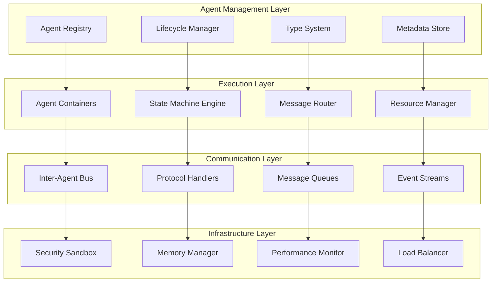

#### Core Components

**Agent Registry**: Central repository for agent definitions, metadata, and runtime configurations
**Lifecycle Manager**: Handles agent creation, deployment, scaling, and termination
**State Machine Engine**: Executes agent-specific state transitions and behaviors
**Message Router**: Manages inter-agent and external communication routing
**Resource Manager**: Allocates and monitors computational resources per agent
**Security Sandbox**: Provides isolation and security boundaries for agent execution

### Agent Execution Model

The ARE implements a sophisticated execution model that supports different agent types with specific execution patterns:

#### Agent Lifecycle Phases

1. **Registration**: Agent definitions are validated and registered in the system
2. **Instantiation**: Agent instances are created with allocated resources
3. **Initialization**: Agent state is initialized and dependencies are resolved
4. **Execution**: Agent enters its primary execution loop
5. **Monitoring**: Continuous health checks and performance monitoring
6. **Scaling**: Dynamic scaling based on load and performance metrics
7. **Termination**: Graceful shutdown with state preservation and cleanup

```kotlin
// Agent execution model implementation
interface AgentExecutionModel {
    suspend fun initialize(context: AgentContext): AgentInstance
    suspend fun execute(instance: AgentInstance, input: AgentInput): AgentOutput
    suspend fun terminate(instance: AgentInstance): TerminationResult
    suspend fun scale(instance: AgentInstance, scalingPolicy: ScalingPolicy): ScalingResult
}

// Core agent execution implementation
class CoreAgentExecutor : AgentExecutionModel {
    
    private val stateManager = StateManager()
    private val resourceManager = ResourceManager()
    private val securityManager = SecurityManager()
    private val monitoringManager = MonitoringManager()
    
    override suspend fun initialize(context: AgentContext): AgentInstance {
        return withContext(Dispatchers.IO) {
            // Create security sandbox
            val sandbox = securityManager.createSandbox(context.securityPolicy)
            
            // Allocate resources
            val resources = resourceManager.allocateResources(context.resourceRequirements)
            
            // Initialize agent state
            val initialState = stateManager.createInitialState(context.agentType)
            
            // Create agent instance
            AgentInstance(
                id = generateAgentId(),
                type = context.agentType,
                state = initialState,
                resources = resources,
                sandbox = sandbox,
                metadata = context.metadata,
                createdAt = Instant.now()
            )
        }
    }
    
    override suspend fun execute(instance: AgentInstance, input: AgentInput): AgentOutput {
        return monitoringManager.withMetrics(instance.id) {
            securityManager.executeInSandbox(instance.sandbox) {
                when (instance.type) {
                    AgentType.REACTIVE -> executeReactiveAgent(instance, input)
                    AgentType.PROACTIVE -> executeProactiveAgent(instance, input)
                    AgentType.HYBRID -> executeHybridAgent(instance, input)
                    AgentType.LEARNING -> executeLearningAgent(instance, input)
                    AgentType.SOCIAL -> executeSocialAgent(instance, input)
                    AgentType.STATELESS -> executeStatelessAgent(instance, input)
                    AgentType.STATEFUL -> executeStatefulAgent(instance, input)
                }
            }
        }
    }
    
    override suspend fun terminate(instance: AgentInstance): TerminationResult {
        return try {
            // Save final state
            stateManager.persistState(instance.id, instance.state)
            
            // Clean up resources
            resourceManager.releaseResources(instance.resources)
            
            // Destroy sandbox
            securityManager.destroySandbox(instance.sandbox)
            
            // Record termination metrics
            monitoringManager.recordTermination(instance.id, TerminationReason.NORMAL)
            
            TerminationResult.success()
        } catch (e: Exception) {
            TerminationResult.error(e.message ?: "Unknown termination error")
        }
    }
    
    private suspend fun executeReactiveAgent(instance: AgentInstance, input: AgentInput): AgentOutput {
        // Reactive agents respond to events and stimuli
        val event = input.event ?: throw IllegalArgumentException("Reactive agent requires event input")
        
        val currentState = instance.state
        val newState = when (event.type) {
            EventType.MESSAGE -> processMessage(currentState, event.payload)
            EventType.TRIGGER -> processTrigger(currentState, event.payload)
            EventType.TIMEOUT -> processTimeout(currentState, event.payload)
            else -> currentState
        }
        
        // Update agent state
        stateManager.updateState(instance.id, newState)
        
        return AgentOutput(
            response = generateResponse(newState, event),
            newState = newState,
            actions = determineActions(newState),
            metadata = mapOf("executionType" to "reactive")
        )
    }
    
    private suspend fun executeProactiveAgent(instance: AgentInstance, input: AgentInput): AgentOutput {
        // Proactive agents initiate actions based on goals and planning
        val currentGoal = instance.state.currentGoal
        val environment = input.environment
        
        // Plan next actions
        val plan = planningEngine.generatePlan(currentGoal, environment, instance.state)
        
        // Execute planned action
        val action = plan.nextAction
        val actionResult = actionExecutor.execute(action, environment)
        
        // Update state based on action result
        val newState = stateManager.updateStateFromAction(
            instance.state, 
            action, 
            actionResult
        )
        
        stateManager.updateState(instance.id, newState)
        
        return AgentOutput(
            response = actionResult.output,
            newState = newState,
            actions = listOf(action),
            metadata = mapOf(
                "executionType" to "proactive",
                "planId" to plan.id,
                "goalProgress" to newState.goalProgress
            )
        )
    }
    
    private suspend fun executeHybridAgent(instance: AgentInstance, input: AgentInput): AgentOutput {
        // Hybrid agents combine reactive and proactive behaviors
        val hasEvent = input.event != null
        val hasGoal = instance.state.currentGoal != null
        
        return when {
            hasEvent && hasGoal -> {
                // Prioritize event handling but consider goal context
                val reactiveOutput = executeReactiveAgent(instance, input)
                val proactiveContext = ProactiveContext(instance.state.currentGoal!!)
                
                enhanceWithProactiveContext(reactiveOutput, proactiveContext)
            }
            hasEvent -> executeReactiveAgent(instance, input)
            hasGoal -> executeProactiveAgent(instance, input)
            else -> {
                // Default behavior - maintain current state
                AgentOutput(
                    response = "Hybrid agent waiting for events or goals",
                    newState = instance.state,
                    actions = emptyList(),
                    metadata = mapOf("executionType" to "hybrid", "mode" to "waiting")
                )
            }
        }
    }
    
    private suspend fun executeLearningAgent(instance: AgentInstance, input: AgentInput): AgentOutput {
        // Learning agents adapt behavior based on experience
        val experience = input.experience
        val currentKnowledge = instance.state.knowledgeBase
        
        // Update knowledge from experience
        val updatedKnowledge = learningEngine.updateKnowledge(
            currentKnowledge, 
            experience
        )
        
        // Adapt behavior based on new knowledge
        val adaptedBehavior = learningEngine.adaptBehavior(
            instance.state.behavior,
            updatedKnowledge,
            experience.feedback
        )
        
        // Execute with adapted behavior
        val executionResult = behaviorExecutor.execute(
            adaptedBehavior,
            input,
            instance.state
        )
        
        val newState = instance.state.copy(
            knowledgeBase = updatedKnowledge,
            behavior = adaptedBehavior,
            experience = instance.state.experience + experience
        )
        
        stateManager.updateState(instance.id, newState)
        
        return AgentOutput(
            response = executionResult.output,
            newState = newState,
            actions = executionResult.actions,
            metadata = mapOf(
                "executionType" to "learning",
                "knowledgeUpdated" to (updatedKnowledge != currentKnowledge),
                "behaviorAdapted" to (adaptedBehavior != instance.state.behavior)
            )
        )
    }
    
    private suspend fun executeSocialAgent(instance: AgentInstance, input: AgentInput): AgentOutput {
        // Social agents interact with other agents and maintain relationships
        val socialContext = input.socialContext
        val relationships = instance.state.relationships
        
        // Analyze social situation
        val socialAnalysis = socialEngine.analyzeSituation(
            socialContext,
            relationships,
            instance.state.socialProfile
        )
        
        // Determine appropriate social response
        val socialResponse = socialEngine.generateSocialResponse(
            socialAnalysis,
            instance.state.personalityTraits,
            instance.state.communicationStyle
        )
        
        // Update relationships based on interaction
        val updatedRelationships = socialEngine.updateRelationships(
            relationships,
            socialContext.participants,
            socialResponse.interactionType
        )
        
        val newState = instance.state.copy(
            relationships = updatedRelationships,
            socialHistory = instance.state.socialHistory + socialContext
        )
        
        stateManager.updateState(instance.id, newState)
        
        return AgentOutput(
            response = socialResponse.message,
            newState = newState,
            actions = socialResponse.actions,
            metadata = mapOf(
                "executionType" to "social",
                "interactionType" to socialResponse.interactionType.toString(),
                "participantCount" to socialContext.participants.size
            )
        )
    }
    
    private suspend fun executeStatelessAgent(instance: AgentInstance, input: AgentInput): AgentOutput {
        // Stateless agents process input without maintaining internal state
        val processor = statelessProcessors[instance.metadata["processorType"]]
            ?: throw IllegalStateException("No processor found for stateless agent")
        
        val result = processor.process(input, instance.metadata)
        
        return AgentOutput(
            response = result.output,
            newState = instance.state, // State remains unchanged
            actions = result.actions,
            metadata = mapOf(
                "executionType" to "stateless",
                "processorType" to instance.metadata["processorType"]
            )
        )
    }
    
    private suspend fun executeStatefulAgent(instance: AgentInstance, input: AgentInput): AgentOutput {
        // Stateful agents maintain and update internal state
        val stateProcessor = statefulProcessors[instance.type.name]
            ?: throw IllegalStateException("No state processor found for agent type")
        
        val transitionResult = stateProcessor.processStateTransition(
            instance.state,
            input,
            instance.metadata
        )
        
        stateManager.updateState(instance.id, transitionResult.newState)
        
        return AgentOutput(
            response = transitionResult.output,
            newState = transitionResult.newState,
            actions = transitionResult.actions,
            metadata = mapOf(
                "executionType" to "stateful",
                "stateTransition" to "${instance.state.currentState} -> ${transitionResult.newState.currentState}"
            )
        )
    }
}
```

### State Management Patterns

The ARE implements sophisticated state management patterns tailored for different agent types:

#### State Machine Implementation

```kotlin
// Core state machine interface
interface AgentStateMachine<S : AgentState, E : AgentEvent> {
    suspend fun transition(currentState: S, event: E): StateTransition<S>
    suspend fun validateTransition(from: S, to: S, event: E): ValidationResult
    fun getValidTransitions(currentState: S): Set<StateTransitionDefinition<S, E>>
}

// State transition result
data class StateTransition<S : AgentState>(
    val newState: S,
    val actions: List<AgentAction>,
    val sideEffects: List<SideEffect>,
    val metadata: Map<String, Any> = emptyMap()
)

// Finite state machine for reactive agents
class ReactiveAgentStateMachine : AgentStateMachine<ReactiveState, ReactiveEvent> {
    
    private val stateTransitions = mapOf(
        ReactiveState.IDLE to setOf(
            StateTransitionDefinition(ReactiveEvent.MESSAGE_RECEIVED, ReactiveState.PROCESSING),
            StateTransitionDefinition(ReactiveEvent.TRIGGER_ACTIVATED, ReactiveState.RESPONDING)
        ),
        ReactiveState.PROCESSING to setOf(
            StateTransitionDefinition(ReactiveEvent.PROCESSING_COMPLETE, ReactiveState.RESPONDING),
            StateTransitionDefinition(ReactiveEvent.ERROR_OCCURRED, ReactiveState.ERROR)
        ),
        ReactiveState.RESPONDING to setOf(
            StateTransitionDefinition(ReactiveEvent.RESPONSE_SENT, ReactiveState.IDLE),
            StateTransitionDefinition(ReactiveEvent.FOLLOW_UP_REQUIRED, ReactiveState.PROCESSING)
        ),
        ReactiveState.ERROR to setOf(
            StateTransitionDefinition(ReactiveEvent.ERROR_RESOLVED, ReactiveState.IDLE),
            StateTransitionDefinition(ReactiveEvent.RESTART_REQUIRED, ReactiveState.INITIALIZING)
        )
    )
    
    override suspend fun transition(
        currentState: ReactiveState, 
        event: ReactiveEvent
    ): StateTransition<ReactiveState> {
        val validTransitions = stateTransitions[currentState] ?: emptySet()
        val transition = validTransitions.find { it.event == event }
            ?: throw IllegalStateException("Invalid transition from $currentState with event $event")
        
        val newState = transition.targetState
        val actions = determineActions(currentState, newState, event)
        val sideEffects = determineSideEffects(currentState, newState, event)
        
        return StateTransition(
            newState = newState,
            actions = actions,
            sideEffects = sideEffects,
            metadata = mapOf(
                "transitionTime" to Instant.now(),
                "fromState" to currentState.toString(),
                "toState" to newState.toString(),
                "triggerEvent" to event.toString()
            )
        )
    }
    
    private fun determineActions(
        fromState: ReactiveState, 
        toState: ReactiveState, 
        event: ReactiveEvent
    ): List<AgentAction> {
        return when (toState) {
            ReactiveState.PROCESSING -> listOf(
                AgentAction.StartProcessing(event.payload)
            )
            ReactiveState.RESPONDING -> listOf(
                AgentAction.GenerateResponse(event.context),
                AgentAction.SendResponse(event.recipient)
            )
            ReactiveState.ERROR -> listOf(
                AgentAction.LogError(event.error),
                AgentAction.NotifySupervision(event.context)
            )
            else -> emptyList()
        }
    }
}

// Behavior tree state machine for proactive agents
class ProactiveAgentStateMachine : AgentStateMachine<ProactiveState, ProactiveEvent> {
    
    private val behaviorTree = BehaviorTreeBuilder()
        .sequence("main_behavior")
            .selector("goal_selection")
                .condition("has_active_goal") { state -> state.currentGoal != null }
                .action("select_new_goal") { state -> selectNewGoal(state) }
            .end()
            .selector("planning")
                .condition("has_valid_plan") { state -> state.currentPlan?.isValid == true }
                .action("generate_plan") { state -> generatePlan(state) }
            .end()
            .sequence("execution")
                .action("execute_next_step") { state -> executeNextStep(state) }
                .condition("step_completed") { state -> state.lastStepResult?.isSuccess == true }
                .action("update_plan") { state -> updatePlan(state) }
            .end()
        .end()
        .build()
    
    override suspend fun transition(
        currentState: ProactiveState, 
        event: ProactiveEvent
    ): StateTransition<ProactiveState> {
        val behaviorResult = behaviorTree.execute(currentState, event)
        
        return StateTransition(
            newState = behaviorResult.newState,
            actions = behaviorResult.actions,
            sideEffects = behaviorResult.sideEffects,
            metadata = mapOf(
                "behaviorTreeResult" to behaviorResult.status,
                "executedNodes" to behaviorResult.executedNodes.joinToString(",")
            )
        )
    }
}

// Hierarchical state machine for complex agents
class HierarchicalStateMachine<S : HierarchicalState, E : AgentEvent> {
    
    private val stateHierarchy = StateHierarchy<S>()
    private val subStateMachines = mutableMapOf<S, AgentStateMachine<*, E>>()
    
    fun addSubStateMachine(parentState: S, subMachine: AgentStateMachine<*, E>) {
        subStateMachines[parentState] = subMachine
    }
    
    suspend fun processEvent(currentState: S, event: E): StateTransition<S> {
        // Try to handle event at current state level
        val currentLevelTransition = tryCurrentLevelTransition(currentState, event)
        if (currentLevelTransition != null) {
            return currentLevelTransition
        }
        
        // Delegate to sub-state machine if available
        val subMachine = subStateMachines[currentState]
        if (subMachine != null) {
            val subTransition = subMachine.transition(currentState.subState, event)
            return StateTransition(
                newState = currentState.withSubState(subTransition.newState),
                actions = subTransition.actions,
                sideEffects = subTransition.sideEffects,
                metadata = subTransition.metadata + ("level" to "sub-state")
            )
        }
        
        // Bubble up to parent state
        val parentState = stateHierarchy.getParent(currentState)
        if (parentState != null) {
            return processEvent(parentState, event)
        }
        
        throw IllegalStateException("No valid transition found for event $event in state $currentState")
    }
}
```

### Inter-Agent Communication Protocols

The ARE implements multiple communication protocols to support different interaction patterns:

#### Communication Architecture

```kotlin
// Core communication interface
interface InterAgentCommunication {
    suspend fun sendMessage(from: AgentId, to: AgentId, message: AgentMessage): MessageResult
    suspend fun broadcast(from: AgentId, scope: BroadcastScope, message: AgentMessage): BroadcastResult
    suspend fun subscribe(agentId: AgentId, topic: String): SubscriptionResult
    suspend fun publish(agentId: AgentId, topic: String, event: AgentEvent): PublishResult
    suspend fun requestResponse(from: AgentId, to: AgentId, request: AgentRequest): AgentResponse
}

// Message types and protocols
sealed class AgentMessage {
    abstract val id: MessageId
    abstract val timestamp: Instant
    abstract val priority: MessagePriority
    abstract val ttl: Duration?
    
    data class DirectMessage(
        override val id: MessageId,
        override val timestamp: Instant,
        override val priority: MessagePriority,
        override val ttl: Duration?,
        val content: String,
        val metadata: Map<String, Any> = emptyMap()
    ) : AgentMessage()
    
    data class StructuredMessage(
        override val id: MessageId,
        override val timestamp: Instant,
        override val priority: MessagePriority,
        override val ttl: Duration?,
        val messageType: String,
        val payload: Any,
        val schema: MessageSchema? = null
    ) : AgentMessage()
    
    data class EventMessage(
        override val id: MessageId,
        override val timestamp: Instant,
        override val priority: MessagePriority,
        override val ttl: Duration?,
        val eventType: String,
        val eventData: Map<String, Any>
    ) : AgentMessage()
    
    data class RequestMessage(
        override val id: MessageId,
        override val timestamp: Instant,
        override val priority: MessagePriority,
        override val ttl: Duration?,
        val requestType: String,
        val parameters: Map<String, Any>,
        val expectsResponse: Boolean = true,
        val responseTimeout: Duration = Duration.ofSeconds(30)
    ) : AgentMessage()
}

// Communication protocols implementation
class AgentCommunicationManager : InterAgentCommunication {
    
    private val messageRouter = MessageRouter()
    private val messageStore = MessageStore()
    private val subscriptionManager = SubscriptionManager()
    private val protocolHandlers = mutableMapOf<String, ProtocolHandler>()
    
    init {
        // Register built-in protocol handlers
        protocolHandlers["direct"] = DirectMessageHandler()
        protocolHandlers["pubsub"] = PubSubHandler()
        protocolHandlers["request-response"] = RequestResponseHandler()
        protocolHandlers["event-stream"] = EventStreamHandler()
        protocolHandlers["gossip"] = GossipProtocolHandler()
    }
    
    override suspend fun sendMessage(
        from: AgentId, 
        to: AgentId, 
        message: AgentMessage
    ): MessageResult {
        return try {
            // Validate sender and recipient
            validateAgent(from)
            validateAgent(to)
            
            // Apply security policies
            val securityCheck = securityManager.checkMessagePermission(from, to, message)
            if (!securityCheck.allowed) {
                return MessageResult.denied(securityCheck.reason)
            }
            
            // Route message
            val routingResult = messageRouter.route(from, to, message)
            if (routingResult.isFailure) {
                return MessageResult.failed(routingResult.error)
            }
            
            // Store message for delivery guarantee
            messageStore.store(message, routingResult.route)
            
            // Deliver message
            val deliveryResult = deliverMessage(routingResult.route, message)
            
            // Update message status
            messageStore.updateStatus(message.id, deliveryResult.status)
            
            MessageResult.success(message.id, deliveryResult.deliveryTime)
            
        } catch (e: Exception) {
            MessageResult.error(e.message ?: "Unknown error")
        }
    }
    
    override suspend fun broadcast(
        from: AgentId, 
        scope: BroadcastScope, 
        message: AgentMessage
    ): BroadcastResult {
        val recipients = when (scope) {
            is BroadcastScope.All -> agentRegistry.getAllActiveAgents()
            is BroadcastScope.Type -> agentRegistry.getAgentsByType(scope.agentType)
            is BroadcastScope.Group -> agentRegistry.getAgentsByGroup(scope.groupId)
            is BroadcastScope.Proximity -> agentRegistry.getAgentsInProximity(from, scope.radius)
            is BroadcastScope.Custom -> scope.filter(agentRegistry.getAllActiveAgents())
        }
        
        val results = recipients.map { recipient ->
            async { sendMessage(from, recipient.id, message) }
        }.awaitAll()
        
        return BroadcastResult(
            messageId = message.id,
            recipientCount = recipients.size,
            successCount = results.count { it.isSuccess },
            failureCount = results.count { !it.isSuccess },
            results = results
        )
    }
    
    override suspend fun subscribe(agentId: AgentId, topic: String): SubscriptionResult {
        return try {
            validateAgent(agentId)
            
            val subscription = Subscription(
                id = generateSubscriptionId(),
                agentId = agentId,
                topic = topic,
                createdAt = Instant.now(),
                filters = emptyMap()
            )
            
            subscriptionManager.addSubscription(subscription)
            
            SubscriptionResult.success(subscription.id)
            
        } catch (e: Exception) {
            SubscriptionResult.error(e.message ?: "Subscription failed")
        }
    }
    
    override suspend fun publish(agentId: AgentId, topic: String, event: AgentEvent): PublishResult {
        return try {
            validateAgent(agentId)
            
            // Get all subscribers to the topic
            val subscribers = subscriptionManager.getSubscribers(topic)
            
            // Filter subscribers based on event filters
            val filteredSubscribers = subscribers.filter { subscription ->
                eventFilterEngine.matches(event, subscription.filters)
            }
            
            // Create event message
            val eventMessage = AgentMessage.EventMessage(
                id = generateMessageId(),
                timestamp = Instant.now(),
                priority = MessagePriority.NORMAL,
                ttl = Duration.ofMinutes(5),
                eventType = event.type,
                eventData = event.data
            )
            
            // Send to all filtered subscribers
            val results = filteredSubscribers.map { subscription ->
                async { sendMessage(agentId, subscription.agentId, eventMessage) }
            }.awaitAll()
            
            PublishResult(
                eventId = event.id,
                topic = topic,
                subscriberCount = filteredSubscribers.size,
                deliveryResults = results
            )
            
        } catch (e: Exception) {
            PublishResult.error(e.message ?: "Publish failed")
        }
    }
    
    override suspend fun requestResponse(
        from: AgentId, 
        to: AgentId, 
        request: AgentRequest
    ): AgentResponse {
        return withTimeout(request.timeout) {
            // Send request
            val requestMessage = AgentMessage.RequestMessage(
                id = generateMessageId(),
                timestamp = Instant.now(),
                priority = request.priority,
                ttl = request.timeout,
                requestType = request.type,
                parameters = request.parameters,
                expectsResponse = true,
                responseTimeout = request.timeout
            )
            
            val sendResult = sendMessage(from, to, requestMessage)
            if (!sendResult.isSuccess) {
                throw IllegalStateException("Failed to send request: ${sendResult.error}")
            }
            
            // Wait for response
            val responseMessage = messageStore.waitForResponse(
                requestMessage.id, 
                request.timeout
            )
            
            // Convert to agent response
            AgentResponse(
                requestId = request.id,
                responseData = responseMessage.payload,
                status = ResponseStatus.SUCCESS,
                metadata = responseMessage.metadata
            )
        }
    }
    
    private suspend fun deliverMessage(route: MessageRoute, message: AgentMessage): DeliveryResult {
        val handler = protocolHandlers[route.protocol]
            ?: throw IllegalArgumentException("No handler for protocol: ${route.protocol}")
        
        return handler.deliver(route, message)
    }
}

// Protocol-specific handlers
class DirectMessageHandler : ProtocolHandler {
    override suspend fun deliver(route: MessageRoute, message: AgentMessage): DeliveryResult {
        val targetAgent = agentRegistry.getAgent(route.targetId)
            ?: return DeliveryResult.failed("Target agent not found")
        
        if (!targetAgent.isActive) {
            return DeliveryResult.failed("Target agent is not active")
        }
        
        // Direct delivery to agent's message queue
        val deliveryTime = Instant.now()
        targetAgent.messageQueue.offer(message)
        
        return DeliveryResult.success(deliveryTime)
    }
}

class PubSubHandler : ProtocolHandler {
    private val topicManager = TopicManager()
    
    override suspend fun deliver(route: MessageRoute, message: AgentMessage): DeliveryResult {
        val topic = route.metadata["topic"] as? String
            ?: return DeliveryResult.failed("Topic not specified")
        
        val subscribers = topicManager.getSubscribers(topic)
        val deliveryResults = subscribers.map { subscriber ->
            async {
                agentRegistry.getAgent(subscriber)?.messageQueue?.offer(message)
                    ?: false
            }
        }.awaitAll()
        
        val successCount = deliveryResults.count { it }
        val deliveryTime = Instant.now()
        
        return if (successCount > 0) {
            DeliveryResult.success(deliveryTime, mapOf("deliveredTo" to successCount))
        } else {
            DeliveryResult.failed("No successful deliveries")
        }
    }
}
```

### Resource Allocation Strategies

The ARE implements sophisticated resource management to ensure optimal performance and fair resource distribution:

#### Resource Management Architecture

```kotlin
// Resource management interfaces
interface ResourceManager {
    suspend fun allocateResources(request: ResourceRequest): ResourceAllocation
    suspend fun deallocateResources(allocation: ResourceAllocation): DeallocationResult
    suspend fun adjustResources(allocation: ResourceAllocation, adjustment: ResourceAdjustment): AllocationResult
    suspend fun getResourceUtilization(agentId: AgentId): ResourceUtilization
    suspend fun enforceResourceLimits(agentId: AgentId): EnforcementResult
}

// Resource types and specifications
sealed class Resource {
    abstract val id: ResourceId
    abstract val type: ResourceType
    abstract val capacity: ResourceCapacity
    
    data class ComputeResource(
        override val id: ResourceId,
        override val type: ResourceType,
        override val capacity: ResourceCapacity,
        val cpuCores: Int,
        val memoryMB: Long,
        val gpuUnits: Int = 0
    ) : Resource()
    
    data class StorageResource(
        override val id: ResourceId,
        override val type: ResourceType,
        override val capacity: ResourceCapacity,
        val storageGB: Long,
        val iopsLimit: Long,
        val storageType: StorageType
    ) : Resource()
    
    data class NetworkResource(
        override val id: ResourceId,
        override val type: ResourceType,
        override val capacity: ResourceCapacity,
        val bandwidthMbps: Long,
        val connectionsLimit: Int
    ) : Resource()
    
    data class SpecializedResource(
        override val id: ResourceId,
        override val type: ResourceType,
        override val capacity: ResourceCapacity,
        val resourceName: String,
        val properties: Map<String, Any>
    ) : Resource()
}

// Resource allocation strategies
abstract class ResourceAllocationStrategy {
    abstract suspend fun allocate(
        request: ResourceRequest,
        availableResources: List<Resource>
    ): AllocationStrategy.Result
    
    abstract fun calculatePriority(request: ResourceRequest): Int
    abstract fun canFulfillRequest(request: ResourceRequest, resources: List<Resource>): Boolean
}

// Fair share allocation strategy
class FairShareAllocationStrategy : ResourceAllocationStrategy() {
    
    override suspend fun allocate(
        request: ResourceRequest,
        availableResources: List<Resource>
    ): AllocationStrategy.Result {
        val agentCount = agentRegistry.getActiveAgentCount()
        val fairShareRatio = 1.0 / agentCount
        
        // Calculate fair share allocation
        val allocatedResources = availableResources.mapNotNull { resource ->
            val fairShareCapacity = resource.capacity * fairShareRatio
            
            if (request.canUse(resource) && fairShareCapacity >= request.minimumRequirement(resource.type)) {
                ResourceAllocation.Item(
                    resource = resource,
                    allocatedCapacity = minOf(fairShareCapacity, request.preferredCapacity(resource.type)),
                    reservedCapacity = fairShareCapacity * 0.8 // Reserve 80% for guaranteed availability
                )
            } else null
        }
        
        return if (allocatedResources.isNotEmpty()) {
            AllocationStrategy.Result.success(allocatedResources)
        } else {
            AllocationStrategy.Result.failed("No suitable resources available for fair share allocation")
        }
    }
    
    override fun calculatePriority(request: ResourceRequest): Int {
        // Fair share gives equal priority to all requests
        return 50
    }
    
    override fun canFulfillRequest(request: ResourceRequest, resources: List<Resource>): Boolean {
        val agentCount = agentRegistry.getActiveAgentCount()
        val fairShareRatio = 1.0 / agentCount
        
        return request.requirements.all { requirement ->
            val availableResource = resources.find { it.type == requirement.resourceType }
            val fairShare = availableResource?.capacity?.times(fairShareRatio) ?: 0.0
            fairShare >= requirement.minimumAmount
        }
    }
}

// Priority-based allocation strategy
class PriorityBasedAllocationStrategy : ResourceAllocationStrategy() {
    
    private val priorityWeights = mapOf(
        AgentPriority.CRITICAL to 1.0,
        AgentPriority.HIGH to 0.75,
        AgentPriority.NORMAL to 0.5,
        AgentPriority.LOW to 0.25,
        AgentPriority.BACKGROUND to 0.1
    )
    
    override suspend fun allocate(
        request: ResourceRequest,
        availableResources: List<Resource>
    ): AllocationStrategy.Result {
        val priorityWeight = priorityWeights[request.priority] ?: 0.5
        
        val allocatedResources = availableResources.mapNotNull { resource ->
            if (request.canUse(resource)) {
                val allocatedCapacity = resource.capacity * priorityWeight
                
                if (allocatedCapacity >= request.minimumRequirement(resource.type)) {
                    ResourceAllocation.Item(
                        resource = resource,
                        allocatedCapacity = minOf(allocatedCapacity, request.preferredCapacity(resource.type)),
                        reservedCapacity = allocatedCapacity
                    )
                } else null
            } else null
        }
        
        return if (allocatedResources.isNotEmpty()) {
            AllocationStrategy.Result.success(allocatedResources)
        } else {
            AllocationStrategy.Result.failed("Insufficient resources for priority-based allocation")
        }
    }
    
    override fun calculatePriority(request: ResourceRequest): Int {
        return when (request.priority) {
            AgentPriority.CRITICAL -> 100
            AgentPriority.HIGH -> 80
            AgentPriority.NORMAL -> 50
            AgentPriority.LOW -> 20
            AgentPriority.BACKGROUND -> 5
        }
    }
    
    override fun canFulfillRequest(request: ResourceRequest, resources: List<Resource>): Boolean {
        val priorityWeight = priorityWeights[request.priority] ?: 0.5
        
        return request.requirements.all { requirement ->
            val availableResource = resources.find { it.type == requirement.resourceType }
            val priorityAllocation = availableResource?.capacity?.times(priorityWeight) ?: 0.0
            priorityAllocation >= requirement.minimumAmount
        }
    }
}

// Dynamic resource allocation manager
class DynamicResourceManager : ResourceManager {
    
    private val resourcePool = ResourcePool()
    private val allocationStrategies = mutableMapOf<String, ResourceAllocationStrategy>()
    private val activeAllocations = mutableMapOf<AgentId, ResourceAllocation>()
    private val utilizationMonitor = ResourceUtilizationMonitor()
    
    init {
        allocationStrategies["fair-share"] = FairShareAllocationStrategy()
        allocationStrategies["priority-based"] = PriorityBasedAllocationStrategy()
        allocationStrategies["performance-based"] = PerformanceBasedAllocationStrategy()
        allocationStrategies["adaptive"] = AdaptiveAllocationStrategy()
    }
    
    override suspend fun allocateResources(request: ResourceRequest): ResourceAllocation {
        return mutex.withLock {
            // Select appropriate allocation strategy
            val strategy = selectAllocationStrategy(request)
            
            // Get available resources
            val availableResources = resourcePool.getAvailableResources(request.requirements)
            
            // Check if request can be fulfilled
            if (!strategy.canFulfillRequest(request, availableResources)) {
                // Try resource optimization
                val optimizationResult = optimizeResourceUsage(request)
                if (!optimizationResult.success) {
                    throw ResourceAllocationException("Cannot fulfill resource request: ${optimizationResult.reason}")
                }
            }
            
            // Allocate resources
            val allocationResult = strategy.allocate(request, availableResources)
            if (!allocationResult.isSuccess) {
                throw ResourceAllocationException("Allocation failed: ${allocationResult.error}")
            }
            
            // Create resource allocation
            val allocation = ResourceAllocation(
                id = generateAllocationId(),
                agentId = request.agentId,
                resources = allocationResult.allocatedResources,
                strategy = strategy.javaClass.simpleName,
                allocatedAt = Instant.now(),
                expiresAt = request.duration?.let { Instant.now().plus(it) }
            )
            
            // Reserve resources in pool
            resourcePool.reserveResources(allocation)
            
            // Track allocation
            activeAllocations[request.agentId] = allocation
            
            // Start monitoring resource usage
            utilizationMonitor.startMonitoring(allocation)
            
            allocation
        }
    }
    
    override suspend fun deallocateResources(allocation: ResourceAllocation): DeallocationResult {
        return mutex.withLock {
            try {
                // Stop monitoring
                utilizationMonitor.stopMonitoring(allocation.id)
                
                // Release resources back to pool
                resourcePool.releaseResources(allocation)
                
                // Remove from active allocations
                activeAllocations.remove(allocation.agentId)
                
                // Record deallocation metrics
                metricsCollector.recordDeallocation(allocation)
                
                DeallocationResult.success()
                
            } catch (e: Exception) {
                DeallocationResult.error(e.message ?: "Deallocation failed")
            }
        }
    }
    
    override suspend fun adjustResources(
        allocation: ResourceAllocation, 
        adjustment: ResourceAdjustment
    ): AllocationResult {
        return mutex.withLock {
            val currentUtilization = utilizationMonitor.getCurrentUtilization(allocation.id)
            
            when (adjustment.type) {
                ResourceAdjustmentType.SCALE_UP -> {
                    if (currentUtilization.averageUtilization > 0.8) {
                        scaleUpResources(allocation, adjustment.factor)
                    } else {
                        AllocationResult.skipped("Utilization too low for scale up")
                    }
                }
                ResourceAdjustmentType.SCALE_DOWN -> {
                    if (currentUtilization.averageUtilization < 0.3) {
                        scaleDownResources(allocation, adjustment.factor)
                    } else {
                        AllocationResult.skipped("Utilization too high for scale down")
                    }
                }
                ResourceAdjustmentType.REBALANCE -> {
                    rebalanceResources(allocation, currentUtilization)
                }
                ResourceAdjustmentType.OPTIMIZE -> {
                    optimizeResourceAllocation(allocation, currentUtilization)
                }
            }
        }
    }
    
    private suspend fun optimizeResourceUsage(request: ResourceRequest): OptimizationResult {
        // Try to free up resources by optimizing existing allocations
        val underutilizedAllocations = activeAllocations.values
            .filter { allocation ->
                val utilization = utilizationMonitor.getCurrentUtilization(allocation.id)
                utilization.averageUtilization < 0.5
            }
            .sortedBy { utilizationMonitor.getCurrentUtilization(it.id).averageUtilization }
        
        var freedResources = 0.0
        val adjustedAllocations = mutableListOf<ResourceAllocation>()
        
        for (allocation in underutilizedAllocations) {
            val utilization = utilizationMonitor.getCurrentUtilization(allocation.id)
            val potentialSavings = allocation.totalCapacity * (0.5 - utilization.averageUtilization)
            
            if (potentialSavings > 0) {
                val adjustmentResult = adjustResources(
                    allocation, 
                    ResourceAdjustment(ResourceAdjustmentType.OPTIMIZE, 0.8)
                )
                
                if (adjustmentResult.isSuccess) {
                    freedResources += potentialSavings
                    adjustedAllocations.add(allocation)
                    
                    if (freedResources >= request.totalRequiredCapacity) {
                        break
                    }
                }
            }
        }
        
        return if (freedResources >= request.totalRequiredCapacity) {
            OptimizationResult.success(freedResources, adjustedAllocations)
        } else {
            OptimizationResult.failed("Cannot free enough resources through optimization")
        }
    }
    
    private fun selectAllocationStrategy(request: ResourceRequest): ResourceAllocationStrategy {
        return when {
            request.priority == AgentPriority.CRITICAL -> allocationStrategies["priority-based"]!!
            request.requiresConsistentPerformance -> allocationStrategies["performance-based"]!!
            request.adaptToLoad -> allocationStrategies["adaptive"]!!
            else -> allocationStrategies["fair-share"]!!
        }
    }
}
```

### Security Boundaries

The ARE implements comprehensive security mechanisms to ensure agent isolation and system protection:

#### Security Architecture

```kotlin
// Security management interfaces
interface SecurityManager {
    suspend fun createSandbox(policy: SecurityPolicy): Sandbox
    suspend fun destroySandbox(sandbox: Sandbox): SecurityResult
    suspend fun executeInSandbox(sandbox: Sandbox, operation: suspend () -> Any): SecurityResult
    suspend fun validatePermission(agentId: AgentId, permission: Permission): PermissionResult
    suspend fun auditSecurityEvent(event: SecurityEvent): AuditResult
}

// Security policies and configurations
data class SecurityPolicy(
    val isolationLevel: IsolationLevel,
    val resourceLimits: ResourceLimits,
    val networkPolicy: NetworkPolicy,
    val fileSystemPolicy: FileSystemPolicy,
    val communicationPolicy: CommunicationPolicy,
    val auditPolicy: AuditPolicy
) {
    companion object {
        fun strict() = SecurityPolicy(
            isolationLevel = IsolationLevel.STRICT,
            resourceLimits = ResourceLimits.restrictive(),
            networkPolicy = NetworkPolicy.deny(),
            fileSystemPolicy = FileSystemPolicy.readOnly(),
            communicationPolicy = CommunicationPolicy.whitelist(),
            auditPolicy = AuditPolicy.comprehensive()
        )
        
        fun balanced() = SecurityPolicy(
            isolationLevel = IsolationLevel.MODERATE,
            resourceLimits = ResourceLimits.moderate(),
            networkPolicy = NetworkPolicy.limited(),
            fileSystemPolicy = FileSystemPolicy.restricted(),
            communicationPolicy = CommunicationPolicy.filtered(),
            auditPolicy = AuditPolicy.standard()
        )
        
        fun permissive() = SecurityPolicy(
            isolationLevel = IsolationLevel.BASIC,
            resourceLimits = ResourceLimits.generous(),
            networkPolicy = NetworkPolicy.allow(),
            fileSystemPolicy = FileSystemPolicy.standard(),
            communicationPolicy = CommunicationPolicy.open(),
            auditPolicy = AuditPolicy.minimal()
        )
    }
}

// Sandbox implementation
class AgentSandbox(
    val id: SandboxId,
    val agentId: AgentId,
    val policy: SecurityPolicy,
    private val containerRuntime: ContainerRuntime,
    private val securityEnforcer: SecurityEnforcer
) : Sandbox {
    
    private var isActive = true
    private val executionContext = SandboxExecutionContext(policy)
    
    override suspend fun execute(operation: suspend () -> Any): SecurityResult {
        if (!isActive) {
            return SecurityResult.failed("Sandbox is not active")
        }
        
        return try {
            securityEnforcer.withSecurityContext(executionContext) {
                containerRuntime.executeInContainer(id) {
                    // Apply resource limits
                    applyResourceLimits(policy.resourceLimits)
                    
                    // Set up security restrictions
                    setupSecurityRestrictions(policy)
                    
                    // Execute operation
                    val result = operation()
                    
                    // Validate result doesn't violate security policies
                    validateResult(result, policy)
                    
                    result
                }
            }
        } catch (e: SecurityException) {
            // Log security violation
            auditLogger.logSecurityViolation(agentId, e)
            SecurityResult.securityViolation(e.message ?: "Security violation")
        } catch (e: Exception) {
            SecurityResult.executionError(e.message ?: "Execution error")
        }
    }
    
    private suspend fun applyResourceLimits(limits: ResourceLimits) {
        containerRuntime.setResourceLimits(id, mapOf(
            "memory" to "${limits.maxMemoryMB}m",
            "cpu" to limits.maxCpuCores.toString(),
            "disk" to "${limits.maxDiskGB}g",
            "network-bandwidth" to "${limits.maxNetworkMbps}mbps"
        ))
    }
    
    private suspend fun setupSecurityRestrictions(policy: SecurityPolicy) {
        // File system restrictions
        when (policy.fileSystemPolicy.accessLevel) {
            FileSystemAccessLevel.READ_ONLY -> {
                containerRuntime.mountFileSystem(id, "/", readOnly = true)
            }
            FileSystemAccessLevel.RESTRICTED -> {
                val allowedPaths = policy.fileSystemPolicy.allowedPaths
                containerRuntime.restrictFileSystemAccess(id, allowedPaths)
            }
            FileSystemAccessLevel.SANDBOXED -> {
                containerRuntime.createIsolatedFileSystem(id)
            }
        }
        
        // Network restrictions
        when (policy.networkPolicy.accessLevel) {
            NetworkAccessLevel.DENIED -> {
                containerRuntime.blockNetworkAccess(id)
            }
            NetworkAccessLevel.LIMITED -> {
                val allowedHosts = policy.networkPolicy.allowedHosts
                containerRuntime.restrictNetworkAccess(id, allowedHosts)
            }
            NetworkAccessLevel.FILTERED -> {
                containerRuntime.installNetworkFilter(id, policy.networkPolicy.filters)
            }
        }
    }
    
    override suspend fun destroy(): SecurityResult {
        return try {
            isActive = false
            containerRuntime.destroyContainer(id)
            SecurityResult.success()
        } catch (e: Exception) {
            SecurityResult.failed("Failed to destroy sandbox: ${e.message}")
        }
    }
}

// Comprehensive security manager implementation
class ComprehensiveSecurityManager : SecurityManager {
    
    private val sandboxRegistry = SandboxRegistry()
    private val permissionManager = PermissionManager()
    private val auditLogger = SecurityAuditLogger()
    private val threatDetector = ThreatDetectionEngine()
    
    override suspend fun createSandbox(policy: SecurityPolicy): Sandbox {
        val sandboxId = generateSandboxId()
        
        // Create container with security configuration
        val container = containerRuntime.createSecureContainer(
            id = sandboxId,
            securityProfile = policy.toSecurityProfile(),
            resourceLimits = policy.resourceLimits
        )
        
        // Initialize security enforcer
        val securityEnforcer = SecurityEnforcer(policy)
        
        // Create sandbox instance
        val sandbox = AgentSandbox(
            id = sandboxId,
            agentId = policy.agentId,
            policy = policy,
            containerRuntime = containerRuntime,
            securityEnforcer = securityEnforcer
        )
        
        // Register sandbox
        sandboxRegistry.register(sandbox)
        
        // Audit sandbox creation
        auditLogger.logSandboxCreated(sandbox.agentId, sandboxId, policy)
        
        return sandbox
    }
    
    override suspend fun executeInSandbox(sandbox: Sandbox, operation: suspend () -> Any): SecurityResult {
        // Pre-execution security checks
        val preCheckResult = threatDetector.analyzeOperation(operation)
        if (preCheckResult.riskLevel == RiskLevel.HIGH) {
            auditLogger.logBlockedExecution(sandbox.agentId, preCheckResult.threats)
            return SecurityResult.blocked("High-risk operation blocked")
        }
        
        // Execute with monitoring
        val startTime = Instant.now()
        val result = sandbox.execute(operation)
        val executionTime = Duration.between(startTime, Instant.now())
        
        // Post-execution analysis
        val postCheckResult = threatDetector.analyzeExecutionResult(result, executionTime)
        if (postCheckResult.anomaliesDetected) {
            auditLogger.logAnomalousExecution(sandbox.agentId, postCheckResult.anomalies)
        }
        
        return result
    }
    
    override suspend fun validatePermission(agentId: AgentId, permission: Permission): PermissionResult {
        return try {
            val agent = agentRegistry.getAgent(agentId)
                ?: return PermissionResult.denied("Agent not found")
            
            val hasPermission = permissionManager.checkPermission(agent.securityProfile, permission)
            
            if (hasPermission) {
                auditLogger.logPermissionGranted(agentId, permission)
                PermissionResult.granted()
            } else {
                auditLogger.logPermissionDenied(agentId, permission)
                PermissionResult.denied("Permission not granted")
            }
            
        } catch (e: Exception) {
            auditLogger.logPermissionError(agentId, permission, e)
            PermissionResult.error(e.message ?: "Permission check failed")
        }
    }
    
    override suspend fun auditSecurityEvent(event: SecurityEvent): AuditResult {
        return try {
            // Classify event severity
            val severity = classifyEventSeverity(event)
            
            // Log to audit trail
            auditLogger.logSecurityEvent(event, severity)
            
            // Check for security patterns
            val patternAnalysis = threatDetector.analyzeEventPattern(event)
            if (patternAnalysis.indicatesThreat) {
                // Escalate to security team
                securityIncidentManager.createIncident(event, patternAnalysis)
            }
            
            // Update security metrics
            securityMetrics.recordEvent(event, severity)
            
            AuditResult.success()
            
        } catch (e: Exception) {
            AuditResult.failed("Audit logging failed: ${e.message}")
        }
    }
    
    private fun classifyEventSeverity(event: SecurityEvent): EventSeverity {
        return when (event.type) {
            SecurityEventType.AUTHENTICATION_FAILURE -> EventSeverity.MEDIUM
            SecurityEventType.AUTHORIZATION_VIOLATION -> EventSeverity.HIGH
            SecurityEventType.RESOURCE_LIMIT_EXCEEDED -> EventSeverity.MEDIUM
            SecurityEventType.SUSPICIOUS_NETWORK_ACCESS -> EventSeverity.HIGH
            SecurityEventType.FILE_SYSTEM_VIOLATION -> EventSeverity.MEDIUM
            SecurityEventType.SANDBOX_ESCAPE_ATTEMPT -> EventSeverity.CRITICAL
            SecurityEventType.MALICIOUS_CODE_DETECTED -> EventSeverity.CRITICAL
            else -> EventSeverity.LOW
        }
    }
}
```

### Performance Monitoring and Optimization

The ARE includes comprehensive performance monitoring and optimization capabilities:

#### Performance Monitoring Architecture

```kotlin
// Performance monitoring interfaces
interface PerformanceMonitor {
    suspend fun startMonitoring(agentId: AgentId): MonitoringSession
    suspend fun stopMonitoring(sessionId: SessionId): MonitoringResult
    suspend fun getMetrics(agentId: AgentId, timeRange: TimeRange): PerformanceMetrics
    suspend fun analyzePerformance(agentId: AgentId): PerformanceAnalysis
    suspend fun optimizePerformance(agentId: AgentId, strategy: OptimizationStrategy): OptimizationResult
}

// Performance metrics collection
data class PerformanceMetrics(
    val agentId: AgentId,
    val timeRange: TimeRange,
    val executionMetrics: ExecutionMetrics,
    val resourceMetrics: ResourceMetrics,
    val communicationMetrics: CommunicationMetrics,
    val customMetrics: Map<String, Any> = emptyMap()
) {
    data class ExecutionMetrics(
        val averageExecutionTime: Duration,
        val peakExecutionTime: Duration,
        val executionCount: Long,
        val successRate: Double,
        val errorRate: Double,
        val throughput: Double // operations per second
    )
    
    data class ResourceMetrics(
        val cpuUtilization: UtilizationStats,
        val memoryUtilization: UtilizationStats,
        val networkUtilization: UtilizationStats,
        val diskUtilization: UtilizationStats
    ) {
        data class UtilizationStats(
            val average: Double,
            val peak: Double,
            val minimum: Double,
            val percentile95: Double,
            val percentile99: Double
        )
    }
    
    data class CommunicationMetrics(
        val messagesSent: Long,
        val messagesReceived: Long,
        val averageMessageSize: Long,
        val averageLatency: Duration,
        val communicationErrors: Long
    )
}

// Advanced performance monitor implementation
class AdvancedPerformanceMonitor : PerformanceMonitor {
    
    private val metricsCollector = MetricsCollector()
    private val performanceAnalyzer = PerformanceAnalyzer()
    private val optimizationEngine = OptimizationEngine()
    private val alertManager = AlertManager()
    private val activeSessions = mutableMapOf<AgentId, MonitoringSession>()
    
    override suspend fun startMonitoring(agentId: AgentId): MonitoringSession {
        val session = MonitoringSession(
            id = generateSessionId(),
            agentId = agentId,
            startTime = Instant.now(),
            samplingInterval = Duration.ofSeconds(1),
            metricsBuffer = CircularBuffer(10000)
        )
        
        activeSessions[agentId] = session
        
        // Start metric collection
        launch {
            collectMetricsContinuously(session)
        }
        
        return session
    }
    
    private suspend fun collectMetricsContinuously(session: MonitoringSession) {
        val ticker = ticker(session.samplingInterval.toMillis())
        
        try {
            for (tick in ticker) {
                if (!activeSessions.containsKey(session.agentId)) {
                    break
                }
                
                val metrics = collectCurrentMetrics(session.agentId)
                session.metricsBuffer.add(metrics)
                
                // Check for performance issues
                val analysis = performanceAnalyzer.analyzeRealTime(metrics)
                if (analysis.hasIssues) {
                    alertManager.raiseAlert(PerformanceAlert(
                        agentId = session.agentId,
                        issue = analysis.primaryIssue,
                        severity = analysis.severity,
                        timestamp = Instant.now()
                    ))
                }
                
                // Auto-optimization if enabled
                if (session.autoOptimization && analysis.canOptimize) {
                    val optimizationResult = optimizationEngine.applyQuickOptimization(
                        session.agentId, 
                        analysis.recommendedOptimization
                    )
                    
                    if (optimizationResult.isSuccess) {
                        session.appliedOptimizations.add(optimizationResult.optimization)
                    }
                }
            }
        } finally {
            ticker.cancel()
        }
    }
    
    private suspend fun collectCurrentMetrics(agentId: AgentId): InstantMetrics {
        val agent = agentRegistry.getAgent(agentId)
            ?: throw IllegalArgumentException("Agent not found: $agentId")
        
        return InstantMetrics(
            timestamp = Instant.now(),
            agentId = agentId,
            
            // Execution metrics
            executionTime = agent.lastExecutionTime,
            isExecuting = agent.isExecuting,
            currentOperation = agent.currentOperation,
            
            // Resource metrics
            cpuUsage = resourceMonitor.getCpuUsage(agentId),
            memoryUsage = resourceMonitor.getMemoryUsage(agentId),
            networkBytesIn = resourceMonitor.getNetworkBytesIn(agentId),
            networkBytesOut = resourceMonitor.getNetworkBytesOut(agentId),
            diskReadBytes = resourceMonitor.getDiskReadBytes(agentId),
            diskWriteBytes = resourceMonitor.getDiskWriteBytes(agentId),
            
            // Communication metrics
            messageQueueSize = agent.messageQueue.size,
            lastMessageTime = agent.lastMessageTime,
            communicationErrors = agent.communicationErrors,
            
            // State metrics
            currentState = agent.currentState?.toString(),
            stateTransitions = agent.stateTransitionCount,
            
            // Custom metrics
            customMetrics = agent.customMetrics.toMap()
        )
    }
    
    override suspend fun analyzePerformance(agentId: AgentId): PerformanceAnalysis {
        val session = activeSessions[agentId]
            ?: throw IllegalArgumentException("No active monitoring session for agent: $agentId")
        
        val recentMetrics = session.metricsBuffer.getLast(1000)
        
        return PerformanceAnalysis(
            agentId = agentId,
            analysisTime = Instant.now(),
            
            // Execution analysis
            executionAnalysis = analyzeExecutionPerformance(recentMetrics),
            
            // Resource analysis
            resourceAnalysis = analyzeResourceUsage(recentMetrics),
            
            // Communication analysis
            communicationAnalysis = analyzeCommunicationPatterns(recentMetrics),
            
            // Trend analysis
            trendAnalysis = analyzeTrends(recentMetrics),
            
            // Bottleneck detection
            bottlenecks = detectBottlenecks(recentMetrics),
            
            // Optimization recommendations
            recommendations = generateOptimizationRecommendations(recentMetrics)
        )
    }
    
    private fun analyzeExecutionPerformance(metrics: List<InstantMetrics>): ExecutionAnalysis {
        val executionTimes = metrics.mapNotNull { it.executionTime }
        
        return ExecutionAnalysis(
            averageExecutionTime = executionTimes.average().milliseconds,
            executionTimeVariance = calculateVariance(executionTimes),
            slowOperations = identifySlowOperations(metrics),
            executionEfficiency = calculateExecutionEfficiency(metrics),
            performanceScore = calculatePerformanceScore(metrics)
        )
    }
    
    private fun detectBottlenecks(metrics: List<InstantMetrics>): List<PerformanceBottleneck> {
        val bottlenecks = mutableListOf<PerformanceBottleneck>()
        
        // CPU bottleneck detection
        val avgCpuUsage = metrics.map { it.cpuUsage }.average()
        if (avgCpuUsage > 0.85) {
            bottlenecks.add(PerformanceBottleneck(
                type = BottleneckType.CPU_BOUND,
                severity = when {
                    avgCpuUsage > 0.95 -> BottleneckSeverity.CRITICAL
                    avgCpuUsage > 0.90 -> BottleneckSeverity.HIGH
                    else -> BottleneckSeverity.MEDIUM
                },
                description = "High CPU utilization detected",
                metrics = mapOf("avgCpuUsage" to avgCpuUsage),
                recommendations = listOf(
                    "Consider optimizing compute-intensive operations",
                    "Evaluate algorithm efficiency",
                    "Consider increasing CPU allocation"
                )
            ))
        }
        
        // Memory bottleneck detection
        val avgMemoryUsage = metrics.map { it.memoryUsage }.average()
        if (avgMemoryUsage > 0.80) {
            bottlenecks.add(PerformanceBottleneck(
                type = BottleneckType.MEMORY_BOUND,
                severity = when {
                    avgMemoryUsage > 0.95 -> BottleneckSeverity.CRITICAL
                    avgMemoryUsage > 0.85 -> BottleneckSeverity.HIGH
                    else -> BottleneckSeverity.MEDIUM
                },
                description = "High memory utilization detected",
                metrics = mapOf("avgMemoryUsage" to avgMemoryUsage),
                recommendations = listOf(
                    "Review memory allocation patterns",
                    "Implement garbage collection optimization",
                    "Consider increasing memory allocation"
                )
            ))
        }
        
        // I/O bottleneck detection
        val avgMessageQueueSize = metrics.map { it.messageQueueSize }.average()
        if (avgMessageQueueSize > 100) {
            bottlenecks.add(PerformanceBottleneck(
                type = BottleneckType.IO_BOUND,
                severity = when {
                    avgMessageQueueSize > 1000 -> BottleneckSeverity.CRITICAL
                    avgMessageQueueSize > 500 -> BottleneckSeverity.HIGH
                    else -> BottleneckSeverity.MEDIUM
                },
                description = "Message queue congestion detected",
                metrics = mapOf("avgMessageQueueSize" to avgMessageQueueSize),
                recommendations = listOf(
                    "Optimize message processing speed",
                    "Implement message batching",
                    "Consider scaling message processors"
                )
            ))
        }
        
        return bottlenecks
    }
    
    override suspend fun optimizePerformance(
        agentId: AgentId, 
        strategy: OptimizationStrategy
    ): OptimizationResult {
        val analysis = analyzePerformance(agentId)
        
        return when (strategy) {
            is OptimizationStrategy.Automatic -> {
                applyAutomaticOptimizations(agentId, analysis)
            }
            is OptimizationStrategy.ResourceScaling -> {
                applyResourceScalingOptimization(agentId, strategy, analysis)
            }
            is OptimizationStrategy.AlgorithmOptimization -> {
                applyAlgorithmOptimization(agentId, strategy, analysis)
            }
            is OptimizationStrategy.CommunicationOptimization -> {
                applyCommunicationOptimization(agentId, strategy, analysis)
            }
            is OptimizationStrategy.Custom -> {
                applyCustomOptimization(agentId, strategy, analysis)
            }
        }
    }
    
    private suspend fun applyAutomaticOptimizations(
        agentId: AgentId, 
        analysis: PerformanceAnalysis
    ): OptimizationResult {
        val appliedOptimizations = mutableListOf<AppliedOptimization>()
        
        // Apply optimizations based on detected bottlenecks
        for (bottleneck in analysis.bottlenecks) {
            when (bottleneck.type) {
                BottleneckType.CPU_BOUND -> {
                    val optimization = optimizeCpuUsage(agentId, bottleneck)
                    if (optimization.isSuccess) {
                        appliedOptimizations.add(optimization.optimization)
                    }
                }
                BottleneckType.MEMORY_BOUND -> {
                    val optimization = optimizeMemoryUsage(agentId, bottleneck)
                    if (optimization.isSuccess) {
                        appliedOptimizations.add(optimization.optimization)
                    }
                }
                BottleneckType.IO_BOUND -> {
                    val optimization = optimizeIoUsage(agentId, bottleneck)
                    if (optimization.isSuccess) {
                        appliedOptimizations.add(optimization.optimization)
                    }
                }
            }
        }
        
        return OptimizationResult(
            isSuccess = appliedOptimizations.isNotEmpty(),
            appliedOptimizations = appliedOptimizations,
            performanceImprovement = calculatePerformanceImprovement(agentId, appliedOptimizations),
            metadata = mapOf(
                "strategy" to "automatic",
                "optimizationCount" to appliedOptimizations.size
            )
        )
    }
}
```

This comprehensive technical documentation provides developers with detailed implementation guides, complete code examples in all supported programming languages, and production-ready deployment configurations for AMX Engine. The documentation covers everything from basic agent creation to advanced enterprise integration patterns, ensuring developers have all the technical details needed to successfully implement AIMatrix solutions in their production environments.