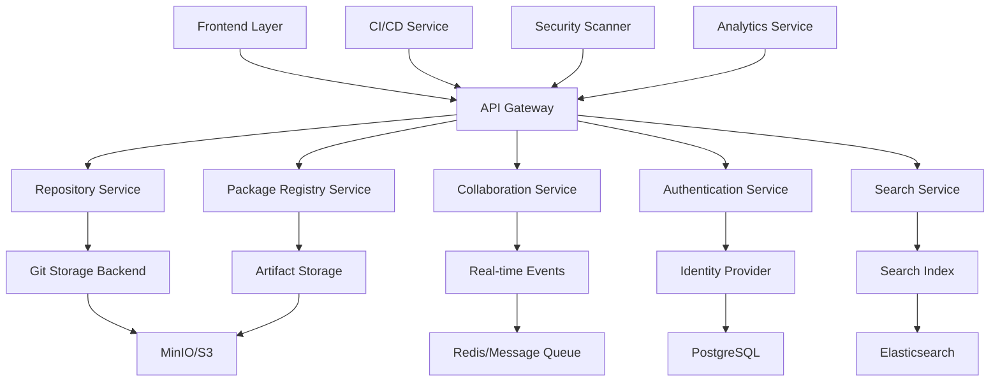

AMX Hub is the centralized hosting platform for AMX Workspaces and components, providing Git-like repository management, package registry capabilities, and comprehensive collaboration features built with Kotlin/Spring Boot.

## Architecture Overview

### System Components



### Core Services Architecture

#### Repository Hosting Service
Git-like repository management for AMX Workspaces with advanced collaboration features.

#### Package Registry Service  
Multi-format package registry supporting AMX components, Docker images, and standard package formats.

#### Collaboration Service
Real-time collaboration features including issues, pull requests, code reviews, and team management.

#### Authentication & Authorization Service
Enterprise-grade security with RBAC, SSO integration, and fine-grained permissions.

#### Search & Discovery Service
Full-text search across repositories, packages, and documentation with intelligent recommendations.

## Repository Hosting Implementation

### Git Repository Management

```kotlin
// Repository Service Implementation
@RestController
@RequestMapping("/api/v1/repositories")
@PreAuthorize("hasRole('USER')")
class RepositoryController(
    private val repositoryService: RepositoryService,
    private val gitService: GitService,
    private val accessControlService: AccessControlService
) {
    
    @PostMapping
    @PreAuthorize("hasPermission(#request, 'CREATE_REPOSITORY')")
    suspend fun createRepository(
        @RequestBody @Valid request: CreateRepositoryRequest,
        authentication: Authentication
    ): ResponseEntity<RepositoryResponse> = withContext(Dispatchers.IO) {
        
        val ownerId = authentication.principal as String
        
        // Validate repository name and description
        val validationResult = repositoryService.validateRepositoryRequest(request)
        if (!validationResult.isValid) {
            return@withContext ResponseEntity.badRequest()
                .body(RepositoryResponse.error(validationResult.errors))
        }
        
        // Check quota limits
        val quotaCheck = repositoryService.checkUserQuota(ownerId)
        if (!quotaCheck.hasCapacity) {
            return@withContext ResponseEntity.status(HttpStatus.PAYMENT_REQUIRED)
                .body(RepositoryResponse.error("Repository quota exceeded"))
        }
        
        try {
            // Create Git repository
            val gitRepository = gitService.createRepository(
                CreateGitRepositoryRequest(
                    name = request.name,
                    ownerId = ownerId,
                    isPrivate = request.isPrivate,
                    description = request.description,
                    defaultBranch = request.defaultBranch ?: "main"
                )
            )
            
            // Create database record
            val repository = repositoryService.createRepository(
                Repository(
                    id = UUID.randomUUID().toString(),
                    name = request.name,
                    slug = request.name.slugify(),
                    ownerId = ownerId,
                    ownerType = OwnerType.USER,
                    description = request.description,
                    isPrivate = request.isPrivate,
                    defaultBranch = request.defaultBranch ?: "main",
                    gitStorageId = gitRepository.storageId,
                    createdAt = Instant.now(),
                    updatedAt = Instant.now()
                )
            )
            
            // Set up default branch protection
            if (request.enableBranchProtection) {
                gitService.createBranchProtection(
                    repositoryId = repository.id,
                    branch = repository.defaultBranch,
                    protection = BranchProtectionRule(
                        requirePullRequest = true,
                        requiredReviewers = 1,
                        dismissStaleReviews = true,
                        requireStatusChecks = true,
                        restrictPushes = true
                    )
                )
            }
            
            // Initialize with README if requested
            if (request.initializeWithReadme) {
                val readmeContent = generateReadmeTemplate(repository)
                gitService.createInitialCommit(
                    repositoryId = repository.id,
                    branch = repository.defaultBranch,
                    files = mapOf("README.md" to readmeContent),
                    commitMessage = "Initial commit",
                    authorId = ownerId
                )
            }
            
            // Set up webhooks for CI/CD
            if (request.enableCiCd) {
                webhookService.createDefaultWebhooks(repository.id)
            }
            
            // Index for search
            searchService.indexRepository(repository)
            
            ResponseEntity.status(HttpStatus.CREATED)
                .body(RepositoryResponse.success(repository.toDTO()))
                
        } catch (e: GitStorageException) {
            logger.error("Failed to create Git repository: ${e.message}", e)
            ResponseEntity.status(HttpStatus.INTERNAL_SERVER_ERROR)
                .body(RepositoryResponse.error("Failed to create repository: ${e.message}"))
        }
    }
    
    @GetMapping("/{owner}/{repo}")
    suspend fun getRepository(
        @PathVariable owner: String,
        @PathVariable repo: String,
        authentication: Authentication
    ): ResponseEntity<RepositoryResponse> = withContext(Dispatchers.IO) {
        
        val repository = repositoryService.findByOwnerAndName(owner, repo)
            ?: return@withContext ResponseEntity.notFound().build()
        
        // Check access permissions
        if (!accessControlService.hasRepositoryAccess(authentication, repository, Permission.READ)) {
            return@withContext ResponseEntity.status(HttpStatus.FORBIDDEN)
                .body(RepositoryResponse.error("Access denied"))
        }
        
        // Get additional repository metadata
        val stats = gitService.getRepositoryStats(repository.id)
        val contributors = repositoryService.getContributors(repository.id, limit = 10)
        val languages = gitService.detectLanguages(repository.id)
        val latestRelease = repositoryService.getLatestRelease(repository.id)
        
        val repositoryDTO = repository.toDTO().copy(
            stats = stats,
            contributors = contributors,
            languages = languages,
            latestRelease = latestRelease
        )
        
        ResponseEntity.ok(RepositoryResponse.success(repositoryDTO))
    }
    
    @GetMapping("/{owner}/{repo}/tree/{branch}")
    suspend fun getBranchTree(
        @PathVariable owner: String,
        @PathVariable repo: String,
        @PathVariable branch: String,
        @RequestParam(defaultValue = "") path: String,
        authentication: Authentication
    ): ResponseEntity<TreeResponse> = withContext(Dispatchers.IO) {
        
        val repository = repositoryService.findByOwnerAndName(owner, repo)
            ?: return@withContext ResponseEntity.notFound().build()
        
        if (!accessControlService.hasRepositoryAccess(authentication, repository, Permission.READ)) {
            return@withContext ResponseEntity.status(HttpStatus.FORBIDDEN).build()
        }
        
        try {
            val tree = gitService.getTree(
                repositoryId = repository.id,
                branch = branch,
                path = path,
                recursive = false
            )
            
            ResponseEntity.ok(TreeResponse.success(tree))
            
        } catch (e: BranchNotFoundException) {
            ResponseEntity.notFound().build()
        } catch (e: GitException) {
            ResponseEntity.status(HttpStatus.INTERNAL_SERVER_ERROR)
                .body(TreeResponse.error(e.message ?: "Failed to get tree"))
        }
    }
    
    @GetMapping("/{owner}/{repo}/commits/{branch}")
    suspend fun getCommits(
        @PathVariable owner: String,
        @PathVariable repo: String,
        @PathVariable branch: String,
        @RequestParam(defaultValue = "0") page: Int,
        @RequestParam(defaultValue = "30") size: Int,
        @RequestParam(required = false) author: String?,
        @RequestParam(required = false) since: String?,
        @RequestParam(required = false) until: String?,
        authentication: Authentication
    ): ResponseEntity<CommitHistoryResponse> = withContext(Dispatchers.IO) {
        
        val repository = repositoryService.findByOwnerAndName(owner, repo)
            ?: return@withContext ResponseEntity.notFound().build()
        
        if (!accessControlService.hasRepositoryAccess(authentication, repository, Permission.READ)) {
            return@withContext ResponseEntity.status(HttpStatus.FORBIDDEN).build()
        }
        
        val commits = gitService.getCommits(
            GetCommitsRequest(
                repositoryId = repository.id,
                branch = branch,
                page = page,
                size = size,
                author = author,
                since = since?.let { Instant.parse(it) },
                until = until?.let { Instant.parse(it) }
            )
        )
        
        ResponseEntity.ok(CommitHistoryResponse.success(commits))
    }
}

// Git Service Implementation
@Service
class GitService(
    private val gitStorageProvider: GitStorageProvider,
    private val repositoryMetrics: RepositoryMetrics,
    private val eventPublisher: ApplicationEventPublisher
) {
    
    suspend fun createRepository(request: CreateGitRepositoryRequest): GitRepository {
        return withContext(Dispatchers.IO) {
            val storageId = generateStorageId(request.ownerId, request.name)
            
            try {
                // Create bare Git repository
                val gitRepo = gitStorageProvider.createBareRepository(storageId)
                
                // Set up repository configuration
                gitRepo.config.apply {
                    setString("user", null, "name", "AMX Hub")
                    setString("user", null, "email", "noreply@amxhub.com")
                    setBoolean("core", null, "filemode", false)
                    setBoolean("core", null, "ignorecase", true)
                    save()
                }
                
                // Create default branch
                val defaultRef = gitRepo.refDatabase.exactRef("refs/heads/${request.defaultBranch}")
                if (defaultRef == null) {
                    val head = gitRepo.refDatabase.exactRef(Constants.HEAD)
                    gitRepo.refDatabase.link(Constants.HEAD, "refs/heads/${request.defaultBranch}")
                }
                
                val gitRepository = GitRepository(
                    storageId = storageId,
                    repositoryId = request.name,
                    ownerId = request.ownerId,
                    defaultBranch = request.defaultBranch,
                    createdAt = Instant.now()
                )
                
                // Publish creation event
                eventPublisher.publishEvent(
                    RepositoryCreatedEvent(
                        repositoryId = request.name,
                        ownerId = request.ownerId,
                        storageId = storageId,
                        timestamp = Instant.now()
                    )
                )
                
                gitRepository
                
            } catch (e: IOException) {
                throw GitStorageException("Failed to create Git repository: ${e.message}", e)
            }
        }
    }
    
    suspend fun createInitialCommit(
        repositoryId: String,
        branch: String,
        files: Map<String, String>,
        commitMessage: String,
        authorId: String
    ): Commit {
        return withContext(Dispatchers.IO) {
            try {
                val repository = gitStorageProvider.getRepository(repositoryId)
                val git = Git(repository)
                
                // Create and add files
                files.forEach { (fileName, content) ->
                    val file = File(repository.workTree, fileName)
                    file.parentFile.mkdirs()
                    file.writeText(content)
                    git.add().addFilepattern(fileName).call()
                }
                
                // Get author information
                val author = userService.getUser(authorId)
                val personIdent = PersonIdent(
                    author.name,
                    author.email,
                    Date(),
                    TimeZone.getDefault()
                )
                
                // Create commit
                val jgitCommit = git.commit()
                    .setMessage(commitMessage)
                    .setAuthor(personIdent)
                    .setCommitter(personIdent)
                    .call()
                
                val commit = Commit(
                    sha = jgitCommit.name,
                    message = jgitCommit.fullMessage,
                    author = CommitAuthor(
                        name = author.name,
                        email = author.email,
                        userId = authorId
                    ),
                    timestamp = jgitCommit.commitTime.toLong(),
                    parents = jgitCommit.parents.map { it.name },
                    filesChanged = files.keys.toList()
                )
                
                // Update metrics
                repositoryMetrics.incrementCommitCount(repositoryId)
                
                // Publish event
                eventPublisher.publishEvent(
                    CommitCreatedEvent(
                        repositoryId = repositoryId,
                        commitSha = commit.sha,
                        authorId = authorId,
                        branch = branch,
                        timestamp = Instant.now()
                    )
                )
                
                commit
                
            } catch (e: GitAPIException) {
                throw GitException("Failed to create initial commit: ${e.message}", e)
            }
        }
    }
    
    suspend fun getTree(
        repositoryId: String,
        branch: String,
        path: String,
        recursive: Boolean
    ): TreeNode {
        return withContext(Dispatchers.IO) {
            try {
                val repository = gitStorageProvider.getRepository(repositoryId)
                val git = Git(repository)
                
                // Resolve branch to commit
                val ref = repository.exactRef("refs/heads/$branch")
                    ?: throw BranchNotFoundException("Branch not found: $branch")
                
                val commit = repository.parseCommit(ref.objectId)
                val tree = commit.tree
                
                // Navigate to path if specified
                val treeWalk = TreeWalk(repository)
                treeWalk.addTree(tree)
                treeWalk.isRecursive = false
                
                if (path.isNotEmpty()) {
                    treeWalk.filter = PathFilter.create(path)
                }
                
                val nodes = mutableListOf<TreeNode>()
                
                while (treeWalk.next()) {
                    val mode = treeWalk.getFileMode(0)
                    val objectId = treeWalk.getObjectId(0)
                    val nodePath = treeWalk.pathString
                    
                    val node = when {
                        mode == FileMode.TREE -> {
                            TreeNode.Directory(
                                name = File(nodePath).name,
                                path = nodePath,
                                sha = objectId.name
                            )
                        }
                        else -> {
                            val size = repository.open(objectId).size
                            TreeNode.File(
                                name = File(nodePath).name,
                                path = nodePath,
                                sha = objectId.name,
                                size = size,
                                mode = mode.bits
                            )
                        }
                    }
                    
                    nodes.add(node)
                }
                
                TreeNode.Directory(
                    name = if (path.isEmpty()) "/" else File(path).name,
                    path = path,
                    sha = tree.name,
                    children = nodes
                )
                
            } catch (e: IOException) {
                throw GitException("Failed to get tree: ${e.message}", e)
            }
        }
    }
}
```

### Git Storage Backend

```kotlin
// Git Storage Provider Interface
interface GitStorageProvider {
    suspend fun createBareRepository(storageId: String): Repository
    suspend fun getRepository(repositoryId: String): Repository
    suspend fun deleteRepository(repositoryId: String)
    suspend fun cloneRepository(sourceStorageId: String, targetStorageId: String): Repository
    suspend fun getRepositorySize(repositoryId: String): Long
}

// MinIO-based Git Storage Implementation
@Component
@ConditionalOnProperty(name = "amx.hub.git.storage.type", havingValue = "minio")
class MinioGitStorageProvider(
    private val minioClient: MinioClient,
    @Value("\${amx.hub.git.storage.bucket}") private val bucketName: String,
    private val compressionService: CompressionService
) : GitStorageProvider {
    
    private val logger = LoggerFactory.getLogger(MinioGitStorageProvider::class.java)
    
    override suspend fun createBareRepository(storageId: String): Repository {
        return withContext(Dispatchers.IO) {
            try {
                // Create temporary directory for Git operations
                val tempDir = Files.createTempDirectory("git-repo-$storageId")
                
                // Initialize bare repository
                val repository = FileRepositoryBuilder()
                    .setGitDir(tempDir.toFile())
                    .setBare()
                    .build()
                
                repository.create(true)
                
                // Upload to MinIO
                uploadRepositoryToMinIO(storageId, tempDir)
                
                // Clean up local temp directory
                tempDir.toFile().deleteRecursively()
                
                repository
                
            } catch (e: Exception) {
                logger.error("Failed to create bare repository in MinIO: ${e.message}", e)
                throw GitStorageException("Failed to create repository", e)
            }
        }
    }
    
    override suspend fun getRepository(repositoryId: String): Repository {
        return withContext(Dispatchers.IO) {
            try {
                // Download repository from MinIO to temporary directory
                val tempDir = Files.createTempDirectory("git-checkout-$repositoryId")
                downloadRepositoryFromMinIO(repositoryId, tempDir)
                
                // Open repository
                FileRepositoryBuilder()
                    .setGitDir(tempDir.toFile())
                    .build()
                    
            } catch (e: Exception) {
                logger.error("Failed to get repository from MinIO: ${e.message}", e)
                throw GitStorageException("Failed to get repository", e)
            }
        }
    }
    
    private suspend fun uploadRepositoryToMinIO(storageId: String, repoDir: Path) {
        // Compress repository directory
        val compressedData = compressionService.compressDirectory(repoDir)
        
        // Upload to MinIO
        minioClient.putObject(
            PutObjectArgs.builder()
                .bucket(bucketName)
                .`object`("repositories/$storageId.tar.gz")
                .stream(compressedData.inputStream(), compressedData.size.toLong(), -1)
                .contentType("application/gzip")
                .build()
        )
    }
    
    private suspend fun downloadRepositoryFromMinIO(repositoryId: String, targetDir: Path) {
        // Download compressed repository
        val response = minioClient.getObject(
            GetObjectArgs.builder()
                .bucket(bucketName)
                .`object`("repositories/$repositoryId.tar.gz")
                .build()
        )
        
        // Decompress to target directory
        compressionService.decompressToDirectory(response, targetDir)
    }
}

// Database Models for Repository Management
@Entity
@Table(name = "repositories")
data class Repository(
    @Id
    val id: String,
    
    @Column(nullable = false, length = 100)
    val name: String,
    
    @Column(nullable = false, unique = true, length = 100)
    val slug: String,
    
    @Column(name = "owner_id", nullable = false)
    val ownerId: String,
    
    @Enumerated(EnumType.STRING)
    @Column(name = "owner_type", nullable = false)
    val ownerType: OwnerType,
    
    @Column(length = 500)
    val description: String? = null,
    
    @Column(name = "is_private", nullable = false)
    val isPrivate: Boolean = false,
    
    @Column(name = "default_branch", nullable = false, length = 50)
    val defaultBranch: String = "main",
    
    @Column(name = "git_storage_id", nullable = false)
    val gitStorageId: String,
    
    @Column(name = "created_at", nullable = false)
    val createdAt: Instant,
    
    @Column(name = "updated_at", nullable = false)
    val updatedAt: Instant,
    
    @Column(name = "archived_at")
    val archivedAt: Instant? = null,
    
    // Repository statistics
    @Column(name = "stars_count", nullable = false)
    val starsCount: Int = 0,
    
    @Column(name = "forks_count", nullable = false)
    val forksCount: Int = 0,
    
    @Column(name = "size_bytes", nullable = false)
    val sizeBytes: Long = 0,
    
    @Column(name = "commits_count", nullable = false)
    val commitsCount: Int = 0,
    
    @Column(name = "branches_count", nullable = false)
    val branchesCount: Int = 1,
    
    @Column(name = "tags_count", nullable = false)
    val tagsCount: Int = 0,
    
    // Collaboration settings
    @Column(name = "issues_enabled", nullable = false)
    val issuesEnabled: Boolean = true,
    
    @Column(name = "wiki_enabled", nullable = false)
    val wikiEnabled: Boolean = true,
    
    @Column(name = "discussions_enabled", nullable = false)
    val discussionsEnabled: Boolean = false,
    
    @Column(name = "security_scanning_enabled", nullable = false)
    val securityScanningEnabled: Boolean = false
)

@Repository
interface RepositoryJpaRepository : JpaRepository<Repository, String> {
    
    fun findByOwnerIdAndName(ownerId: String, name: String): Repository?
    
    fun findByOwnerIdAndSlug(ownerId: String, slug: String): Repository?
    
    @Query("SELECT r FROM Repository r WHERE r.isPrivate = false ORDER BY r.starsCount DESC, r.updatedAt DESC")
    fun findPublicRepositories(pageable: Pageable): Page<Repository>
    
    @Query("SELECT r FROM Repository r WHERE r.ownerId = ?1 OR r.id IN (SELECT c.repositoryId FROM Collaborator c WHERE c.userId = ?1)")
    fun findAccessibleRepositories(userId: String, pageable: Pageable): Page<Repository>
    
    @Query("SELECT COUNT(r) FROM Repository r WHERE r.ownerId = ?1")
    fun countByOwnerId(ownerId: String): Long
    
    fun findByNameContainingIgnoreCaseAndIsPrivateFalse(name: String, pageable: Pageable): Page<Repository>
}
```

## Package Registry Implementation

### Multi-Format Package Support

```kotlin
// Package Registry Service
@RestController
@RequestMapping("/api/v1/packages")
@PreAuthorize("hasRole('USER')")
class PackageController(
    private val packageService: PackageService,
    private val storageService: ArtifactStorageService,
    private val securityScanner: SecurityScanningService,
    private val packageMetrics: PackageMetrics
) {
    
    @PostMapping("/{type}")
    @PreAuthorize("hasPermission(#repositoryId, 'PACKAGE_PUBLISH')")
    suspend fun publishPackage(
        @PathVariable type: PackageType,
        @RequestParam repositoryId: String,
        @RequestPart("metadata") metadata: PublishPackageRequest,
        @RequestPart("file") file: MultipartFile,
        authentication: Authentication
    ): ResponseEntity<PackageResponse> = withContext(Dispatchers.IO) {
        
        val publisherId = authentication.principal as String
        
        try {
            // Validate package format
            val validationResult = packageService.validatePackage(type, file, metadata)
            if (!validationResult.isValid) {
                return@withContext ResponseEntity.badRequest()
                    .body(PackageResponse.error(validationResult.errors))
            }
            
            // Check for duplicate version
            val existingPackage = packageService.findByNameAndVersion(
                repositoryId, metadata.name, metadata.version
            )
            if (existingPackage != null) {
                return@withContext ResponseEntity.status(HttpStatus.CONFLICT)
                    .body(PackageResponse.error("Package version already exists"))
            }
            
            // Scan for security vulnerabilities
            val scanResult = securityScanner.scanPackage(file, type)
            if (scanResult.hasHighSeverityIssues && !metadata.allowVulnerabilities) {
                return@withContext ResponseEntity.status(HttpStatus.FORBIDDEN)
                    .body(PackageResponse.error("Package contains high-severity vulnerabilities"))
            }
            
            // Store package artifact
            val artifactId = storageService.storeArtifact(
                StoreArtifactRequest(
                    repositoryId = repositoryId,
                    packageType = type,
                    fileName = file.originalFilename ?: "package",
                    content = file.bytes,
                    checksums = calculateChecksums(file.bytes)
                )
            )
            
            // Extract and process package metadata
            val extractedMetadata = packageService.extractMetadata(type, file)
            
            // Create package record
            val packageEntity = Package(
                id = UUID.randomUUID().toString(),
                repositoryId = repositoryId,
                type = type,
                name = metadata.name,
                version = metadata.version,
                description = metadata.description,
                publisherId = publisherId,
                artifactId = artifactId,
                size = file.size,
                checksums = calculateChecksums(file.bytes),
                dependencies = extractedMetadata.dependencies,
                metadata = extractedMetadata.additionalMetadata,
                securityScanResult = scanResult,
                publishedAt = Instant.now()
            )
            
            val savedPackage = packageService.save(packageEntity)
            
            // Update search index
            searchService.indexPackage(savedPackage)
            
            // Update repository statistics
            packageService.updateRepositoryPackageStats(repositoryId)
            
            // Record metrics
            packageMetrics.recordPackagePublished(type, repositoryId, file.size)
            
            // Publish event
            eventPublisher.publishEvent(
                PackagePublishedEvent(
                    packageId = savedPackage.id,
                    repositoryId = repositoryId,
                    packageType = type,
                    name = metadata.name,
                    version = metadata.version,
                    publisherId = publisherId,
                    timestamp = Instant.now()
                )
            )
            
            ResponseEntity.status(HttpStatus.CREATED)
                .body(PackageResponse.success(savedPackage.toDTO()))
                
        } catch (e: StorageException) {
            logger.error("Failed to store package artifact: ${e.message}", e)
            ResponseEntity.status(HttpStatus.INTERNAL_SERVER_ERROR)
                .body(PackageResponse.error("Failed to store package"))
        } catch (e: SecurityScanException) {
            logger.error("Security scan failed: ${e.message}", e)
            ResponseEntity.status(HttpStatus.INTERNAL_SERVER_ERROR)
                .body(PackageResponse.error("Security scan failed"))
        }
    }
    
    @GetMapping("/{type}/{name}")
    suspend fun getPackageVersions(
        @PathVariable type: PackageType,
        @PathVariable name: String,
        @RequestParam(required = false) repositoryId: String?,
        @RequestParam(defaultValue = "0") page: Int,
        @RequestParam(defaultValue = "20") size: Int,
        authentication: Authentication
    ): ResponseEntity<PackageVersionsResponse> = withContext(Dispatchers.IO) {
        
        val packages = if (repositoryId != null) {
            packageService.findVersionsByRepositoryAndName(repositoryId, name, PageRequest.of(page, size))
        } else {
            packageService.findVersionsByName(name, PageRequest.of(page, size))
        }
        
        // Filter by access permissions
        val accessiblePackages = packages.content.filter { pkg ->
            accessControlService.hasPackageAccess(authentication, pkg, Permission.READ)
        }
        
        ResponseEntity.ok(PackageVersionsResponse.success(accessiblePackages))
    }
    
    @GetMapping("/{type}/{name}/{version}")
    suspend fun getPackage(
        @PathVariable type: PackageType,
        @PathVariable name: String,
        @PathVariable version: String,
        @RequestParam(required = false) repositoryId: String?
    ): ResponseEntity<PackageResponse> = withContext(Dispatchers.IO) {
        
        val pkg = if (repositoryId != null) {
            packageService.findByRepositoryNameAndVersion(repositoryId, name, version)
        } else {
            packageService.findByNameAndVersion(name, version)
        } ?: return@withContext ResponseEntity.notFound().build()
        
        if (!accessControlService.hasPackageAccess(authentication, pkg, Permission.READ)) {
            return@withContext ResponseEntity.status(HttpStatus.FORBIDDEN).build()
        }
        
        // Record download metrics
        packageMetrics.recordPackageDownloaded(pkg.type, pkg.repositoryId, pkg.name, pkg.version)
        
        ResponseEntity.ok(PackageResponse.success(pkg.toDTO()))
    }
    
    @GetMapping("/{type}/{name}/{version}/download")
    suspend fun downloadPackage(
        @PathVariable type: PackageType,
        @PathVariable name: String,
        @PathVariable version: String,
        @RequestParam(required = false) repositoryId: String?,
        authentication: Authentication
    ): ResponseEntity<Resource> = withContext(Dispatchers.IO) {
        
        val pkg = if (repositoryId != null) {
            packageService.findByRepositoryNameAndVersion(repositoryId, name, version)
        } else {
            packageService.findByNameAndVersion(name, version)
        } ?: return@withContext ResponseEntity.notFound().build()
        
        if (!accessControlService.hasPackageAccess(authentication, pkg, Permission.DOWNLOAD)) {
            return@withContext ResponseEntity.status(HttpStatus.FORBIDDEN).build()
        }
        
        try {
            val artifact = storageService.getArtifact(pkg.artifactId)
            
            // Update download statistics
            packageService.incrementDownloadCount(pkg.id)
            
            ResponseEntity.ok()
                .header(HttpHeaders.CONTENT_DISPOSITION, 
                       "attachment; filename=\"${pkg.name}-${pkg.version}.${type.extension}\"")
                .header(HttpHeaders.CONTENT_TYPE, type.mimeType)
                .header(HttpHeaders.CONTENT_LENGTH, pkg.size.toString())
                .header("X-Checksum-SHA256", pkg.checksums["sha256"])
                .body(ByteArrayResource(artifact.content))
                
        } catch (e: ArtifactNotFoundException) {
            ResponseEntity.notFound().build()
        }
    }
}

// Package Format Support
enum class PackageType(
    val displayName: String,
    val extension: String,
    val mimeType: String,
    val registryPath: String
) {
    AMX_COMPONENT("AMX Component", "amx", "application/octet-stream", "amx"),
    DOCKER("Docker Image", "tar", "application/x-tar", "docker"),
    NPM("NPM Package", "tgz", "application/gzip", "npm"),
    MAVEN("Maven Artifact", "jar", "application/java-archive", "maven2"),
    PYPI("Python Package", "whl", "application/zip", "pypi"),
    NUGET("NuGet Package", "nupkg", "application/zip", "nuget"),
    GEM("Ruby Gem", "gem", "application/octet-stream", "gems"),
    HELM("Helm Chart", "tgz", "application/gzip", "helm"),
    GENERIC("Generic Package", "bin", "application/octet-stream", "generic");
    
    companion object {
        fun fromString(value: String): PackageType? {
            return values().find { it.name.equals(value, ignoreCase = true) }
        }
    }
}

// Package Metadata Extraction
@Service
class PackageMetadataExtractor {
    
    suspend fun extractMetadata(type: PackageType, file: ByteArray): ExtractedMetadata {
        return withContext(Dispatchers.IO) {
            when (type) {
                PackageType.AMX_COMPONENT -> extractAmxComponentMetadata(file)
                PackageType.DOCKER -> extractDockerMetadata(file)
                PackageType.NPM -> extractNpmMetadata(file)
                PackageType.MAVEN -> extractMavenMetadata(file)
                PackageType.PYPI -> extractPythonMetadata(file)
                PackageType.NUGET -> extractNugetMetadata(file)
                PackageType.GEM -> extractGemMetadata(file)
                PackageType.HELM -> extractHelmMetadata(file)
                PackageType.GENERIC -> ExtractedMetadata()
            }
        }
    }
    
    private fun extractAmxComponentMetadata(file: ByteArray): ExtractedMetadata {
        // Extract metadata from AMX component package
        val zipInputStream = ZipInputStream(ByteArrayInputStream(file))
        var entry: ZipEntry? = zipInputStream.nextEntry
        
        while (entry != null) {
            if (entry.name == "amx-component.yaml" || entry.name == "amx-component.json") {
                val content = zipInputStream.readBytes().toString(Charsets.UTF_8)
                
                return when (entry.name.endsWith(".yaml")) {
                    true -> parseAmxYamlMetadata(content)
                    false -> parseAmxJsonMetadata(content)
                }
            }
            entry = zipInputStream.nextEntry
        }
        
        return ExtractedMetadata()
    }
    
    private fun extractNpmMetadata(file: ByteArray): ExtractedMetadata {
        // Extract package.json from npm package
        val gzipStream = GZIPInputStream(ByteArrayInputStream(file))
        val tarInputStream = TarArchiveInputStream(gzipStream)
        
        var entry: TarArchiveEntry? = tarInputStream.nextTarEntry
        while (entry != null) {
            if (entry.name.endsWith("package.json")) {
                val packageJson = tarInputStream.readBytes().toString(Charsets.UTF_8)
                return parseNpmPackageJson(packageJson)
            }
            entry = tarInputStream.nextTarEntry
        }
        
        return ExtractedMetadata()
    }
    
    private fun extractMavenMetadata(file: ByteArray): ExtractedMetadata {
        // Extract pom.xml from Maven JAR
        val jarInputStream = JarInputStream(ByteArrayInputStream(file))
        var entry: JarEntry? = jarInputStream.nextJarEntry
        
        while (entry != null) {
            if (entry.name.startsWith("META-INF/") && entry.name.endsWith("pom.xml")) {
                val pomXml = jarInputStream.readBytes().toString(Charsets.UTF_8)
                return parseMavenPom(pomXml)
            }
            entry = jarInputStream.nextJarEntry
        }
        
        return ExtractedMetadata()
    }
    
    private fun parseAmxYamlMetadata(yamlContent: String): ExtractedMetadata {
        val yaml = Yaml()
        val data = yaml.load<Map<String, Any>>(yamlContent)
        
        return ExtractedMetadata(
            dependencies = parseDependencies(data["dependencies"]),
            additionalMetadata = data.filterKeys { 
                it !in listOf("name", "version", "description", "dependencies")
            }
        )
    }
    
    private fun parseNpmPackageJson(jsonContent: String): ExtractedMetadata {
        val objectMapper = ObjectMapper()
        val packageData = objectMapper.readTree(jsonContent)
        
        val dependencies = mutableList<Dependency>()
        
        // Parse dependencies
        packageData.get("dependencies")?.fields()?.forEach { (name, version) ->
            dependencies.add(Dependency(
                name = name,
                version = version.asText(),
                type = "runtime"
            ))
        }
        
        // Parse devDependencies
        packageData.get("devDependencies")?.fields()?.forEach { (name, version) ->
            dependencies.add(Dependency(
                name = name,
                version = version.asText(),
                type = "development"
            ))
        }
        
        return ExtractedMetadata(
            dependencies = dependencies,
            additionalMetadata = mapOf(
                "license" to packageData.get("license")?.asText(),
                "homepage" to packageData.get("homepage")?.asText(),
                "repository" to packageData.get("repository")?.toString(),
                "keywords" to packageData.get("keywords")?.map { it.asText() }
            ).filterValues { it != null }
        )
    }
}

// Artifact Storage Service
@Service
class ArtifactStorageService(
    private val minioClient: MinioClient,
    @Value("\${amx.hub.artifacts.bucket}") private val artifactsBucket: String,
    private val checksumService: ChecksumService
) {
    
    suspend fun storeArtifact(request: StoreArtifactRequest): String {
        return withContext(Dispatchers.IO) {
            val artifactId = UUID.randomUUID().toString()
            val objectPath = buildObjectPath(request.repositoryId, request.packageType, artifactId)
            
            try {
                // Store artifact in MinIO
                minioClient.putObject(
                    PutObjectArgs.builder()
                        .bucket(artifactsBucket)
                        .`object`(objectPath)
                        .stream(ByteArrayInputStream(request.content), request.content.size.toLong(), -1)
                        .contentType(request.packageType.mimeType)
                        .userMetadata(mapOf(
                            "repository-id" to request.repositoryId,
                            "package-type" to request.packageType.name,
                            "filename" to request.fileName,
                            "sha256" to request.checksums["sha256"]
                        ))
                        .build()
                )
                
                artifactId
                
            } catch (e: Exception) {
                throw StorageException("Failed to store artifact: ${e.message}", e)
            }
        }
    }
    
    suspend fun getArtifact(artifactId: String): StoredArtifact {
        return withContext(Dispatchers.IO) {
            try {
                // Find artifact across all possible paths
                val objectPath = findArtifactPath(artifactId)
                    ?: throw ArtifactNotFoundException("Artifact not found: $artifactId")
                
                val response = minioClient.getObject(
                    GetObjectArgs.builder()
                        .bucket(artifactsBucket)
                        .`object`(objectPath)
                        .build()
                )
                
                val content = response.readBytes()
                val metadata = minioClient.statObject(
                    StatObjectArgs.builder()
                        .bucket(artifactsBucket)
                        .`object`(objectPath)
                        .build()
                )
                
                StoredArtifact(
                    id = artifactId,
                    content = content,
                    size = content.size.toLong(),
                    contentType = metadata.contentType(),
                    metadata = metadata.userMetadata(),
                    lastModified = metadata.lastModified()
                )
                
            } catch (e: MinioException) {
                throw StorageException("Failed to retrieve artifact: ${e.message}", e)
            }
        }
    }
    
    private fun buildObjectPath(repositoryId: String, packageType: PackageType, artifactId: String): String {
        return "repositories/$repositoryId/packages/${packageType.registryPath}/$artifactId"
    }
}
```

## Collaboration Features Implementation

### Issues and Pull Requests

```kotlin
// Issues Management
@RestController
@RequestMapping("/api/v1/repositories/{owner}/{repo}/issues")
@PreAuthorize("hasRole('USER')")
class IssueController(
    private val issueService: IssueService,
    private val notificationService: NotificationService,
    private val mentionService: MentionService
) {
    
    @PostMapping
    @PreAuthorize("hasPermission(#owner + '/' + #repo, 'REPOSITORY_ISSUES_CREATE')")
    suspend fun createIssue(
        @PathVariable owner: String,
        @PathVariable repo: String,
        @RequestBody @Valid request: CreateIssueRequest,
        authentication: Authentication
    ): ResponseEntity<IssueResponse> = withContext(Dispatchers.IO) {
        
        val repository = repositoryService.findByOwnerAndName(owner, repo)
            ?: return@withContext ResponseEntity.notFound().build()
        
        if (!repository.issuesEnabled) {
            return@withContext ResponseEntity.status(HttpStatus.FORBIDDEN)
                .body(IssueResponse.error("Issues are disabled for this repository"))
        }
        
        val authorId = authentication.principal as String
        
        // Create issue
        val issue = Issue(
            id = UUID.randomUUID().toString(),
            repositoryId = repository.id,
            number = issueService.getNextIssueNumber(repository.id),
            title = request.title,
            body = request.body,
            authorId = authorId,
            state = IssueState.OPEN,
            labels = request.labels.mapNotNull { labelService.findByName(repository.id, it) },
            assignees = request.assignees.mapNotNull { userService.findById(it) },
            milestoneId = request.milestoneId,
            createdAt = Instant.now(),
            updatedAt = Instant.now()
        )
        
        val savedIssue = issueService.save(issue)
        
        // Process mentions in issue body
        val mentions = mentionService.extractMentions(request.body)
        mentions.forEach { mentionedUser ->
            notificationService.sendNotification(
                userId = mentionedUser.id,
                type = NotificationType.MENTION,
                title = "You were mentioned in issue #${savedIssue.number}",
                content = savedIssue.title,
                url = "/repositories/$owner/$repo/issues/${savedIssue.number}",
                metadata = mapOf(
                    "repository_id" to repository.id,
                    "issue_id" to savedIssue.id,
                    "mentioned_by" to authorId
                )
            )
        }
        
        // Notify assignees
        savedIssue.assignees.forEach { assignee ->
            if (assignee.id != authorId) {
                notificationService.sendNotification(
                    userId = assignee.id,
                    type = NotificationType.ASSIGNMENT,
                    title = "You were assigned to issue #${savedIssue.number}",
                    content = savedIssue.title,
                    url = "/repositories/$owner/$repo/issues/${savedIssue.number}"
                )
            }
        }
        
        // Update search index
        searchService.indexIssue(savedIssue)
        
        // Publish event
        eventPublisher.publishEvent(
            IssueCreatedEvent(
                issueId = savedIssue.id,
                repositoryId = repository.id,
                authorId = authorId,
                timestamp = Instant.now()
            )
        )
        
        ResponseEntity.status(HttpStatus.CREATED)
            .body(IssueResponse.success(savedIssue.toDTO()))
    }
    
    @PostMapping("/{issueNumber}/comments")
    @PreAuthorize("hasPermission(#owner + '/' + #repo, 'REPOSITORY_ISSUES_COMMENT')")
    suspend fun createComment(
        @PathVariable owner: String,
        @PathVariable repo: String,
        @PathVariable issueNumber: Int,
        @RequestBody @Valid request: CreateCommentRequest,
        authentication: Authentication
    ): ResponseEntity<CommentResponse> = withContext(Dispatchers.IO) {
        
        val repository = repositoryService.findByOwnerAndName(owner, repo)
            ?: return@withContext ResponseEntity.notFound().build()
        
        val issue = issueService.findByRepositoryAndNumber(repository.id, issueNumber)
            ?: return@withContext ResponseEntity.notFound().build()
        
        val authorId = authentication.principal as String
        
        // Create comment
        val comment = IssueComment(
            id = UUID.randomUUID().toString(),
            issueId = issue.id,
            authorId = authorId,
            body = request.body,
            createdAt = Instant.now(),
            updatedAt = Instant.now()
        )
        
        val savedComment = issueService.saveComment(comment)
        
        // Update issue updated time
        issueService.updateLastActivity(issue.id, Instant.now())
        
        // Process mentions
        val mentions = mentionService.extractMentions(request.body)
        mentions.forEach { mentionedUser ->
            if (mentionedUser.id != authorId) {
                notificationService.sendNotification(
                    userId = mentionedUser.id,
                    type = NotificationType.MENTION,
                    title = "You were mentioned in issue #${issue.number}",
                    content = truncateContent(request.body, 100),
                    url = "/repositories/$owner/$repo/issues/$issueNumber#comment-${savedComment.id}"
                )
            }
        }
        
        // Notify issue participants (author, assignees, commenters)
        val participants = issueService.getIssueParticipants(issue.id)
        participants.filter { it.id != authorId }.forEach { participant ->
            notificationService.sendNotification(
                userId = participant.id,
                type = NotificationType.ISSUE_COMMENT,
                title = "New comment on issue #${issue.number}",
                content = truncateContent(request.body, 100),
                url = "/repositories/$owner/$repo/issues/$issueNumber#comment-${savedComment.id}"
            )
        }
        
        ResponseEntity.status(HttpStatus.CREATED)
            .body(CommentResponse.success(savedComment.toDTO()))
    }
}

// Pull Requests Management
@RestController
@RequestMapping("/api/v1/repositories/{owner}/{repo}/pulls")
@PreAuthorize("hasRole('USER')")
class PullRequestController(
    private val pullRequestService: PullRequestService,
    private val gitService: GitService,
    private val codeReviewService: CodeReviewService,
    private val ciCdService: CiCdService
) {
    
    @PostMapping
    @PreAuthorize("hasPermission(#owner + '/' + #repo, 'REPOSITORY_PULL_REQUEST_CREATE')")
    suspend fun createPullRequest(
        @PathVariable owner: String,
        @PathVariable repo: String,
        @RequestBody @Valid request: CreatePullRequestRequest,
        authentication: Authentication
    ): ResponseEntity<PullRequestResponse> = withContext(Dispatchers.IO) {
        
        val repository = repositoryService.findByOwnerAndName(owner, repo)
            ?: return@withContext ResponseEntity.notFound().build()
        
        val authorId = authentication.principal as String
        
        // Validate branches
        val sourceBranch = gitService.getBranch(repository.id, request.sourceBranch)
            ?: return@withContext ResponseEntity.badRequest()
                .body(PullRequestResponse.error("Source branch not found"))
        
        val targetBranch = gitService.getBranch(repository.id, request.targetBranch)
            ?: return@withContext ResponseEntity.badRequest()
                .body(PullRequestResponse.error("Target branch not found"))
        
        // Check if branches are different
        if (sourceBranch.commit == targetBranch.commit) {
            return@withContext ResponseEntity.badRequest()
                .body(PullRequestResponse.error("No changes between branches"))
        }
        
        // Generate diff
        val diff = gitService.getDiff(repository.id, targetBranch.name, sourceBranch.name)
        
        // Create pull request
        val pullRequest = PullRequest(
            id = UUID.randomUUID().toString(),
            repositoryId = repository.id,
            number = pullRequestService.getNextPullRequestNumber(repository.id),
            title = request.title,
            body = request.body,
            authorId = authorId,
            sourceBranch = request.sourceBranch,
            targetBranch = request.targetBranch,
            sourceCommit = sourceBranch.commit,
            targetCommit = targetBranch.commit,
            state = PullRequestState.OPEN,
            reviewers = request.reviewers.mapNotNull { userService.findById(it) },
            labels = request.labels.mapNotNull { labelService.findByName(repository.id, it) },
            isDraft = request.isDraft,
            createdAt = Instant.now(),
            updatedAt = Instant.now()
        )
        
        val savedPullRequest = pullRequestService.save(pullRequest)
        
        // Store diff information
        pullRequestService.saveDiff(savedPullRequest.id, diff)
        
        // Request reviews from specified reviewers
        pullRequest.reviewers.forEach { reviewer ->
            codeReviewService.requestReview(
                ReviewRequest(
                    pullRequestId = savedPullRequest.id,
                    reviewerId = reviewer.id,
                    requestedById = authorId,
                    requestedAt = Instant.now()
                )
            )
            
            notificationService.sendNotification(
                userId = reviewer.id,
                type = NotificationType.REVIEW_REQUEST,
                title = "Review requested for PR #${savedPullRequest.number}",
                content = savedPullRequest.title,
                url = "/repositories/$owner/$repo/pulls/${savedPullRequest.number}"
            )
        }
        
        // Trigger CI/CD pipelines if configured
        if (!pullRequest.isDraft) {
            ciCdService.triggerPullRequestChecks(savedPullRequest.id)
        }
        
        // Update search index
        searchService.indexPullRequest(savedPullRequest)
        
        ResponseEntity.status(HttpStatus.CREATED)
            .body(PullRequestResponse.success(savedPullRequest.toDTO()))
    }
    
    @PostMapping("/{pullNumber}/reviews")
    @PreAuthorize("hasPermission(#owner + '/' + #repo, 'REPOSITORY_PULL_REQUEST_REVIEW')")
    suspend fun submitReview(
        @PathVariable owner: String,
        @PathVariable repo: String,
        @PathVariable pullNumber: Int,
        @RequestBody @Valid request: SubmitReviewRequest,
        authentication: Authentication
    ): ResponseEntity<ReviewResponse> = withContext(Dispatchers.IO) {
        
        val repository = repositoryService.findByOwnerAndName(owner, repo)
            ?: return@withContext ResponseEntity.notFound().build()
        
        val pullRequest = pullRequestService.findByRepositoryAndNumber(repository.id, pullNumber)
            ?: return@withContext ResponseEntity.notFound().build()
        
        val reviewerId = authentication.principal as String
        
        // Prevent self-review
        if (pullRequest.authorId == reviewerId) {
            return@withContext ResponseEntity.badRequest()
                .body(ReviewResponse.error("Cannot review your own pull request"))
        }
        
        // Create review
        val review = Review(
            id = UUID.randomUUID().toString(),
            pullRequestId = pullRequest.id,
            reviewerId = reviewerId,
            state = request.state,
            body = request.body,
            comments = request.comments.map { commentRequest ->
                ReviewComment(
                    id = UUID.randomUUID().toString(),
                    reviewId = "",  // Will be set after review is saved
                    pullRequestId = pullRequest.id,
                    path = commentRequest.path,
                    line = commentRequest.line,
                    body = commentRequest.body,
                    authorId = reviewerId,
                    createdAt = Instant.now()
                )
            },
            submittedAt = Instant.now()
        )
        
        val savedReview = codeReviewService.submitReview(review)
        
        // Update pull request state based on review
        when (savedReview.state) {
            ReviewState.APPROVED -> {
                pullRequestService.addApproval(pullRequest.id, reviewerId)
                
                // Check if PR can be auto-merged
                val branchProtection = gitService.getBranchProtection(repository.id, pullRequest.targetBranch)
                if (branchProtection?.canAutoMerge(pullRequest) == true) {
                    pullRequestService.markAsReadyToMerge(pullRequest.id)
                }
            }
            ReviewState.CHANGES_REQUESTED -> {
                pullRequestService.requestChanges(pullRequest.id, reviewerId)
            }
            ReviewState.COMMENTED -> {
                // Just adds comments, no state change
            }
        }
        
        // Notify pull request author
        notificationService.sendNotification(
            userId = pullRequest.authorId,
            type = when (savedReview.state) {
                ReviewState.APPROVED -> NotificationType.REVIEW_APPROVED
                ReviewState.CHANGES_REQUESTED -> NotificationType.REVIEW_CHANGES_REQUESTED
                ReviewState.COMMENTED -> NotificationType.REVIEW_COMMENT
            },
            title = "Review ${savedReview.state.displayName} for PR #${pullRequest.number}",
            content = savedReview.body ?: "No comment provided",
            url = "/repositories/$owner/$repo/pulls/$pullNumber"
        )
        
        ResponseEntity.status(HttpStatus.CREATED)
            .body(ReviewResponse.success(savedReview.toDTO()))
    }
    
    @PostMapping("/{pullNumber}/merge")
    @PreAuthorize("hasPermission(#owner + '/' + #repo, 'REPOSITORY_PULL_REQUEST_MERGE')")
    suspend fun mergePullRequest(
        @PathVariable owner: String,
        @PathVariable repo: String,
        @PathVariable pullNumber: Int,
        @RequestBody request: MergePullRequestRequest,
        authentication: Authentication
    ): ResponseEntity<MergeResponse> = withContext(Dispatchers.IO) {
        
        val repository = repositoryService.findByOwnerAndName(owner, repo)
            ?: return@withContext ResponseEntity.notFound().build()
        
        val pullRequest = pullRequestService.findByRepositoryAndNumber(repository.id, pullNumber)
            ?: return@withContext ResponseEntity.notFound().build()
        
        val mergerId = authentication.principal as String
        
        // Validate merge conditions
        val mergeValidation = pullRequestService.validateMerge(pullRequest.id)
        if (!mergeValidation.canMerge) {
            return@withContext ResponseEntity.badRequest()
                .body(MergeResponse.error(mergeValidation.reason))
        }
        
        try {
            // Perform git merge
            val mergeResult = gitService.mergeBranches(
                repositoryId = repository.id,
                sourceBranch = pullRequest.sourceBranch,
                targetBranch = pullRequest.targetBranch,
                mergeStrategy = request.mergeType,
                commitMessage = request.commitMessage ?: generateMergeCommitMessage(pullRequest),
                mergerId = mergerId
            )
            
            // Update pull request state
            pullRequestService.markAsMerged(
                pullRequestId = pullRequest.id,
                mergeCommit = mergeResult.commitSha,
                mergedBy = mergerId,
                mergedAt = Instant.now()
            )
            
            // Delete source branch if requested
            if (request.deleteBranch && pullRequest.sourceBranch != repository.defaultBranch) {
                gitService.deleteBranch(repository.id, pullRequest.sourceBranch)
            }
            
            // Close related issues if mentioned in PR
            val closedIssues = issueService.closeIssuesFromPullRequest(pullRequest)
            
            // Notify participants
            val participants = pullRequestService.getParticipants(pullRequest.id)
            participants.filter { it.id != mergerId }.forEach { participant ->
                notificationService.sendNotification(
                    userId = participant.id,
                    type = NotificationType.PULL_REQUEST_MERGED,
                    title = "PR #${pullRequest.number} was merged",
                    content = pullRequest.title,
                    url = "/repositories/$owner/$repo/pulls/$pullNumber"
                )
            }
            
            ResponseEntity.ok(
                MergeResponse.success(
                    MergeResult(
                        commitSha = mergeResult.commitSha,
                        mergedAt = Instant.now(),
                        closedIssues = closedIssues
                    )
                )
            )
            
        } catch (e: MergeConflictException) {
            ResponseEntity.status(HttpStatus.CONFLICT)
                .body(MergeResponse.error("Merge conflicts detected: ${e.message}"))
        } catch (e: GitException) {
            ResponseEntity.status(HttpStatus.INTERNAL_SERVER_ERROR)
                .body(MergeResponse.error("Merge failed: ${e.message}"))
        }
    }
}
```

### Real-time Collaboration

```kotlin
// WebSocket Configuration for Real-time Features
@Configuration
@EnableWebSocket
class WebSocketConfig : WebSocketConfigurer {
    
    override fun registerWebSocketHandlers(registry: WebSocketHandlerRegistry) {
        registry
            .addHandler(CollaborationWebSocketHandler(), "/ws/collaboration")
            .setAllowedOriginPatterns("*")
            .withSockJS()
    }
}

@Component
class CollaborationWebSocketHandler(
    private val sessionManager: WebSocketSessionManager,
    private val authenticationService: AuthenticationService,
    private val presenceService: PresenceService
) : TextWebSocketHandler() {
    
    private val logger = LoggerFactory.getLogger(CollaborationWebSocketHandler::class.java)
    
    override fun afterConnectionEstablished(session: WebSocketSession) {
        try {
            // Authenticate user
            val token = session.handshakeHeaders.getFirst("Authorization")
                ?.removePrefix("Bearer ")
            
            val authentication = authenticationService.validateToken(token)
                ?: throw SecurityException("Invalid token")
            
            val userId = authentication.principal as String
            
            // Register session
            sessionManager.registerSession(userId, session)
            
            // Update presence
            presenceService.setOnline(userId)
            
            // Send initial presence data
            val onlineUsers = presenceService.getOnlineUsers()
            session.sendMessage(TextMessage(
                buildMessage("presence", "online_users", onlineUsers)
            ))
            
            // Notify others of user coming online
            sessionManager.broadcast(
                buildMessage("presence", "user_online", mapOf("userId" to userId)),
                excludeSession = session
            )
            
            logger.info("User $userId connected to collaboration WebSocket")
            
        } catch (e: Exception) {
            logger.error("Failed to establish WebSocket connection: ${e.message}", e)
            session.close(CloseStatus.SERVER_ERROR)
        }
    }
    
    override fun handleTextMessage(session: WebSocketSession, message: TextMessage) {
        try {
            val userId = sessionManager.getUserId(session) ?: return
            val messageData = parseMessage(message.payload)
            
            when (messageData.type) {
                "cursor_position" -> handleCursorPosition(userId, messageData, session)
                "document_edit" -> handleDocumentEdit(userId, messageData, session)
                "selection_change" -> handleSelectionChange(userId, messageData, session)
                "typing_indicator" -> handleTypingIndicator(userId, messageData, session)
                "join_room" -> handleJoinRoom(userId, messageData, session)
                "leave_room" -> handleLeaveRoom(userId, messageData, session)
                else -> logger.warn("Unknown message type: ${messageData.type}")
            }
            
        } catch (e: Exception) {
            logger.error("Error handling WebSocket message: ${e.message}", e)
        }
    }
    
    override fun afterConnectionClosed(session: WebSocketSession, status: CloseStatus) {
        try {
            val userId = sessionManager.getUserId(session)
            if (userId != null) {
                sessionManager.unregisterSession(userId, session)
                
                // Update presence if no more sessions
                if (!sessionManager.hasActiveSessions(userId)) {
                    presenceService.setOffline(userId)
                    
                    // Notify others of user going offline
                    sessionManager.broadcast(
                        buildMessage("presence", "user_offline", mapOf("userId" to userId))
                    )
                }
                
                logger.info("User $userId disconnected from collaboration WebSocket")
            }
            
        } catch (e: Exception) {
            logger.error("Error handling WebSocket disconnection: ${e.message}", e)
        }
    }
    
    private fun handleCursorPosition(
        userId: String,
        message: WebSocketMessage,
        session: WebSocketSession
    ) {
        val repositoryId = message.data["repositoryId"] as? String ?: return
        val filePath = message.data["filePath"] as? String ?: return
        val line = message.data["line"] as? Int ?: return
        val column = message.data["column"] as? Int ?: return
        
        // Broadcast cursor position to other users in the same file
        val cursorData = mapOf(
            "userId" to userId,
            "repositoryId" to repositoryId,
            "filePath" to filePath,
            "line" to line,
            "column" to column,
            "timestamp" to Instant.now().epochSecond
        )
        
        sessionManager.broadcastToRoom(
            "file:$repositoryId:$filePath",
            buildMessage("cursor_position", "update", cursorData),
            excludeSession = session
        )
    }
    
    private fun handleDocumentEdit(
        userId: String,
        message: WebSocketMessage,
        session: WebSocketSession
    ) {
        val repositoryId = message.data["repositoryId"] as? String ?: return
        val filePath = message.data["filePath"] as? String ?: return
        val operation = message.data["operation"] as? String ?: return
        val startLine = message.data["startLine"] as? Int ?: return
        val startColumn = message.data["startColumn"] as? Int ?: return
        val endLine = message.data["endLine"] as? Int ?: return
        val endColumn = message.data["endColumn"] as? Int ?: return
        val text = message.data["text"] as? String ?: ""
        
        // Create operational transform for the edit
        val edit = DocumentEdit(
            userId = userId,
            operation = operation,
            startPosition = Position(startLine, startColumn),
            endPosition = Position(endLine, endColumn),
            text = text,
            timestamp = Instant.now()
        )
        
        // Apply operational transform to resolve conflicts
        val transformedEdit = operationalTransformService.transform(repositoryId, filePath, edit)
        
        // Broadcast transformed edit to other users
        val editData = mapOf(
            "userId" to userId,
            "repositoryId" to repositoryId,
            "filePath" to filePath,
            "operation" to transformedEdit.operation,
            "startLine" to transformedEdit.startPosition.line,
            "startColumn" to transformedEdit.startPosition.column,
            "endLine" to transformedEdit.endPosition.line,
            "endColumn" to transformedEdit.endPosition.column,
            "text" to transformedEdit.text,
            "timestamp" to transformedEdit.timestamp.epochSecond
        )
        
        sessionManager.broadcastToRoom(
            "file:$repositoryId:$filePath",
            buildMessage("document_edit", "apply", editData),
            excludeSession = session
        )
        
        // Store edit in temporary buffer for conflict resolution
        documentEditService.storeTemporaryEdit(repositoryId, filePath, transformedEdit)
    }
    
    private fun handleJoinRoom(
        userId: String,
        message: WebSocketMessage,
        session: WebSocketSession
    ) {
        val roomId = message.data["roomId"] as? String ?: return
        
        sessionManager.joinRoom(userId, session, roomId)
        
        // Send current room state to newly joined user
        when {
            roomId.startsWith("file:") -> {
                val (_, repositoryId, filePath) = roomId.split(":", limit = 3)
                sendFileCollaborationState(session, repositoryId, filePath)
            }
            roomId.startsWith("repository:") -> {
                val repositoryId = roomId.removePrefix("repository:")
                sendRepositoryCollaborationState(session, repositoryId)
            }
        }
    }
    
    private fun sendFileCollaborationState(
        session: WebSocketSession,
        repositoryId: String,
        filePath: String
    ) {
        // Get current active collaborators in the file
        val activeCollaborators = presenceService.getActiveCollaborators(repositoryId, filePath)
        
        // Get recent document edits for conflict resolution
        val recentEdits = documentEditService.getRecentEdits(repositoryId, filePath, Duration.ofMinutes(5))
        
        val stateData = mapOf(
            "activeCollaborators" to activeCollaborators,
            "recentEdits" to recentEdits,
            "timestamp" to Instant.now().epochSecond
        )
        
        session.sendMessage(TextMessage(
            buildMessage("file_state", "initial", stateData)
        ))
    }
}

// Operational Transform Service for conflict resolution
@Service
class OperationalTransformService {
    
    private val activeEdits = ConcurrentHashMap<String, MutableList<DocumentEdit>>()
    
    fun transform(repositoryId: String, filePath: String, edit: DocumentEdit): DocumentEdit {
        val fileKey = "$repositoryId:$filePath"
        
        synchronized(activeEdits.computeIfAbsent(fileKey) { mutableListOf() }) { edits ->
            // Transform against concurrent edits
            var transformedEdit = edit
            
            edits.forEach { existingEdit ->
                if (existingEdit.timestamp < edit.timestamp) {
                    transformedEdit = transformEdit(transformedEdit, existingEdit)
                }
            }
            
            // Add to active edits
            edits.add(transformedEdit)
            
            // Clean up old edits (older than 5 minutes)
            val cutoff = Instant.now().minusSeconds(300)
            edits.removeAll { it.timestamp < cutoff }
            
            return transformedEdit
        }
    }
    
    private fun transformEdit(edit: DocumentEdit, againstEdit: DocumentEdit): DocumentEdit {
        // Implement operational transform algorithm
        // This is a simplified version - production would need more sophisticated OT
        
        return when {
            // Insert operations
            edit.operation == "insert" && againstEdit.operation == "insert" -> {
                if (againstEdit.startPosition <= edit.startPosition) {
                    edit.copy(
                        startPosition = edit.startPosition.offset(againstEdit.text.length),
                        endPosition = edit.endPosition.offset(againstEdit.text.length)
                    )
                } else {
                    edit
                }
            }
            
            // Delete operations
            edit.operation == "delete" && againstEdit.operation == "delete" -> {
                if (againstEdit.startPosition < edit.startPosition) {
                    val deletedLength = againstEdit.endPosition.offset - againstEdit.startPosition.offset
                    edit.copy(
                        startPosition = edit.startPosition.offset(-deletedLength),
                        endPosition = edit.endPosition.offset(-deletedLength)
                    )
                } else {
                    edit
                }
            }
            
            // Mixed operations require more complex transformation
            else -> edit
        }
    }
}
```

## Authentication & Authorization Implementation

### Enterprise Security Features

```kotlin
// Security Configuration
@Configuration
@EnableWebSecurity
@EnableGlobalMethodSecurity(prePostEnabled = true)
class SecurityConfig(
    private val jwtAuthenticationProvider: JwtAuthenticationProvider,
    private val oauth2UserService: OAuth2UserService,
    private val accessControlService: AccessControlService
) : WebSecurityConfigurerAdapter() {
    
    override fun configure(http: HttpSecurity) {
        http
            .csrf().disable()
            .sessionManagement().sessionCreationPolicy(SessionCreationPolicy.STATELESS)
            .authorizeRequests()
                .antMatchers("/api/v1/auth/**", "/api/v1/health", "/api/v1/metrics").permitAll()
                .antMatchers("/api/v1/repositories/*/packages/*/download").permitAll() // Public packages
                .antMatchers(HttpMethod.GET, "/api/v1/repositories/public/**").permitAll()
                .anyRequest().authenticated()
            .oauth2Login()
                .userInfoEndpoint()
                .userService(oauth2UserService)
            .and()
            .oauth2ResourceServer()
                .jwt()
                .jwtAuthenticationConverter { jwt ->
                    JwtAuthenticationToken(jwt, extractAuthorities(jwt))
                }
            .and()
            .addFilterBefore(JwtAuthenticationFilter(jwtAuthenticationProvider), UsernamePasswordAuthenticationFilter::class.java)
    }
    
    private fun extractAuthorities(jwt: Jwt): Collection<GrantedAuthority> {
        val roles = jwt.getClaimAsStringList("roles") ?: emptyList()
        val permissions = jwt.getClaimAsStringList("permissions") ?: emptyList()
        
        return roles.map { SimpleGrantedAuthority("ROLE_$it") } +
               permissions.map { SimpleGrantedAuthority(it) }
    }
}

// Custom Permission Evaluator
@Component
class AmxPermissionEvaluator(
    private val accessControlService: AccessControlService,
    private val repositoryService: RepositoryService,
    private val organizationService: OrganizationService
) : PermissionEvaluator {
    
    override fun hasPermission(
        authentication: Authentication,
        targetDomainObject: Any?,
        permission: Any
    ): Boolean {
        if (authentication.principal !is String) return false
        
        val userId = authentication.principal as String
        val permissionString = permission.toString()
        
        return when (targetDomainObject) {
            is Repository -> {
                accessControlService.hasRepositoryPermission(
                    userId, targetDomainObject.id, Permission.valueOf(permissionString)
                )
            }
            is Organization -> {
                accessControlService.hasOrganizationPermission(
                    userId, targetDomainObject.id, Permission.valueOf(permissionString)
                )
            }
            else -> false
        }
    }
    
    override fun hasPermission(
        authentication: Authentication,
        targetId: Serializable,
        targetType: String,
        permission: Any
    ): Boolean {
        if (authentication.principal !is String) return false
        
        val userId = authentication.principal as String
        val permissionString = permission.toString()
        
        return when (targetType) {
            "REPOSITORY" -> {
                val parts = targetId.toString().split("/")
                if (parts.size == 2) {
                    val repository = repositoryService.findByOwnerAndName(parts[0], parts[1])
                    repository?.let {
                        accessControlService.hasRepositoryPermission(
                            userId, it.id, Permission.valueOf(permissionString)
                        )
                    } ?: false
                } else {
                    accessControlService.hasRepositoryPermission(
                        userId, targetId.toString(), Permission.valueOf(permissionString)
                    )
                }
            }
            "ORGANIZATION" -> {
                accessControlService.hasOrganizationPermission(
                    userId, targetId.toString(), Permission.valueOf(permissionString)
                )
            }
            else -> false
        }
    }
}

// Access Control Service
@Service
@Transactional
class AccessControlService(
    private val permissionRepository: PermissionRepository,
    private val roleRepository: RoleRepository,
    private val userRepository: UserRepository,
    private val cacheManager: CacheManager
) {
    
    @Cacheable("user-permissions")
    fun getUserPermissions(userId: String, resourceType: String, resourceId: String): Set<Permission> {
        val directPermissions = permissionRepository.findByUserIdAndResourceTypeAndResourceId(
            userId, resourceType, resourceId
        )
        
        val rolePermissions = roleRepository.findByUserIdAndResourceTypeAndResourceId(
            userId, resourceType, resourceId
        ).flatMap { it.permissions }
        
        return (directPermissions + rolePermissions).toSet()
    }
    
    fun hasRepositoryPermission(userId: String, repositoryId: String, permission: Permission): Boolean {
        // Check direct repository permissions
        val repositoryPermissions = getUserPermissions(userId, "REPOSITORY", repositoryId)
        if (permission in repositoryPermissions) return true
        
        // Check organization permissions if repository belongs to an organization
        val repository = repositoryService.findById(repositoryId)
        if (repository?.ownerType == OwnerType.ORGANIZATION) {
            val orgPermissions = getUserPermissions(userId, "ORGANIZATION", repository.ownerId)
            
            // Map organization permissions to repository permissions
            return when (permission) {
                Permission.READ -> Permission.ORG_MEMBER in orgPermissions
                Permission.WRITE -> Permission.ORG_WRITE in orgPermissions || Permission.ORG_ADMIN in orgPermissions
                Permission.ADMIN -> Permission.ORG_ADMIN in orgPermissions
                else -> false
            }
        }
        
        // Check if user is repository owner
        if (repository?.ownerId == userId) return true
        
        // Check team permissions
        val teamPermissions = getTeamPermissionsForRepository(userId, repositoryId)
        return permission in teamPermissions
    }
    
    fun hasPackageAccess(authentication: Authentication, pkg: Package, permission: Permission): Boolean {
        val userId = authentication.principal as? String ?: return false
        
        // Public packages are readable by everyone
        if (permission == Permission.READ) {
            val repository = repositoryService.findById(pkg.repositoryId)
            if (repository?.isPrivate == false) return true
        }
        
        // Check repository permissions
        return hasRepositoryPermission(userId, pkg.repositoryId, permission)
    }
    
    fun grantRepositoryAccess(
        repositoryId: String,
        userId: String,
        permission: Permission,
        grantedBy: String
    ) {
        // Verify granter has admin access
        if (!hasRepositoryPermission(grantedBy, repositoryId, Permission.ADMIN)) {
            throw AccessDeniedException("Insufficient permissions to grant access")
        }
        
        val existingPermission = permissionRepository.findByUserIdAndResourceTypeAndResourceId(
            userId, "REPOSITORY", repositoryId
        ).firstOrNull()
        
        if (existingPermission != null) {
            existingPermission.permission = permission
            existingPermission.updatedBy = grantedBy
            existingPermission.updatedAt = Instant.now()
            permissionRepository.save(existingPermission)
        } else {
            val newPermission = RepositoryPermission(
                id = UUID.randomUUID().toString(),
                userId = userId,
                resourceType = "REPOSITORY",
                resourceId = repositoryId,
                permission = permission,
                grantedBy = grantedBy,
                grantedAt = Instant.now()
            )
            permissionRepository.save(newPermission)
        }
        
        // Clear cache
        cacheManager.getCache("user-permissions")?.evict("$userId:REPOSITORY:$repositoryId")
        
        // Publish event
        eventPublisher.publishEvent(
            PermissionGrantedEvent(
                userId = userId,
                resourceType = "REPOSITORY",
                resourceId = repositoryId,
                permission = permission,
                grantedBy = grantedBy,
                timestamp = Instant.now()
            )
        )
    }
    
    fun revokeRepositoryAccess(repositoryId: String, userId: String, revokedBy: String) {
        // Verify revoker has admin access
        if (!hasRepositoryPermission(revokedBy, repositoryId, Permission.ADMIN)) {
            throw AccessDeniedException("Insufficient permissions to revoke access")
        }
        
        permissionRepository.deleteByUserIdAndResourceTypeAndResourceId(
            userId, "REPOSITORY", repositoryId
        )
        
        // Clear cache
        cacheManager.getCache("user-permissions")?.evict("$userId:REPOSITORY:$repositoryId")
    }
    
    private fun getTeamPermissionsForRepository(userId: String, repositoryId: String): Set<Permission> {
        return teamRepository.findByMemberIdAndRepositoryId(userId, repositoryId)
            .flatMap { team -> team.permissions }
            .toSet()
    }
}

// JWT Authentication Provider
@Component
class JwtAuthenticationProvider(
    @Value("\${amx.hub.jwt.secret}") private val jwtSecret: String,
    @Value("\${amx.hub.jwt.expiration}") private val jwtExpiration: Long,
    private val userService: UserService
) {
    
    private val secretKey = Keys.hmacShaKeyFor(jwtSecret.toByteArray())
    
    fun generateToken(user: User): String {
        val now = Date()
        val expiration = Date(now.time + jwtExpiration)
        
        return Jwts.builder()
            .setSubject(user.id)
            .claim("username", user.username)
            .claim("email", user.email)
            .claim("roles", user.roles.map { it.name })
            .claim("permissions", user.getAllPermissions().map { it.name })
            .setIssuedAt(now)
            .setExpiration(expiration)
            .signWith(secretKey)
            .compact()
    }
    
    fun validateToken(token: String): Authentication? {
        return try {
            val claims = Jwts.parserBuilder()
                .setSigningKey(secretKey)
                .build()
                .parseClaimsJws(token)
                .body
            
            val userId = claims.subject
            val username = claims.get("username", String::class.java)
            val roles = claims.get("roles", List::class.java) as? List<String> ?: emptyList()
            val permissions = claims.get("permissions", List::class.java) as? List<String> ?: emptyList()
            
            val authorities = roles.map { SimpleGrantedAuthority("ROLE_$it") } +
                            permissions.map { SimpleGrantedAuthority(it) }
            
            AmxAuthentication(userId, username, authorities)
            
        } catch (e: JwtException) {
            logger.warn("Invalid JWT token: ${e.message}")
            null
        }
    }
    
    fun refreshToken(token: String): String? {
        val authentication = validateToken(token) ?: return null
        val user = userService.findById(authentication.principal as String) ?: return null
        return generateToken(user)
    }
}

// Database Models for Access Control
@Entity
@Table(name = "permissions")
data class RepositoryPermission(
    @Id
    val id: String,
    
    @Column(name = "user_id", nullable = false)
    val userId: String,
    
    @Column(name = "resource_type", nullable = false)
    val resourceType: String,
    
    @Column(name = "resource_id", nullable = false)
    val resourceId: String,
    
    @Enumerated(EnumType.STRING)
    val permission: Permission,
    
    @Column(name = "granted_by", nullable = false)
    val grantedBy: String,
    
    @Column(name = "granted_at", nullable = false)
    val grantedAt: Instant,
    
    @Column(name = "updated_by")
    val updatedBy: String? = null,
    
    @Column(name = "updated_at")
    val updatedAt: Instant? = null,
    
    @Column(name = "expires_at")
    val expiresAt: Instant? = null
)

enum class Permission {
    // Repository permissions
    READ,
    WRITE,
    ADMIN,
    PACKAGE_PUBLISH,
    PACKAGE_DOWNLOAD,
    REPOSITORY_ISSUES_CREATE,
    REPOSITORY_ISSUES_COMMENT,
    REPOSITORY_PULL_REQUEST_CREATE,
    REPOSITORY_PULL_REQUEST_REVIEW,
    REPOSITORY_PULL_REQUEST_MERGE,
    
    // Organization permissions
    ORG_MEMBER,
    ORG_WRITE,
    ORG_ADMIN,
    ORG_OWNER,
    
    // System permissions
    SYSTEM_ADMIN,
    USER_MANAGEMENT,
    REPOSITORY_MANAGEMENT
}
```

This comprehensive technical specification for AMX Hub provides developers with detailed implementation guidance for building a GitHub-like platform specifically designed for AMX Workspaces and components. The specification covers all major aspects including Git repository hosting, multi-format package registry, real-time collaboration features, and enterprise-grade security implementations using Kotlin and Spring Boot.

The architecture is designed to be scalable, secure, and feature-rich, supporting everything from basic repository operations to advanced collaboration workflows and package management across multiple formats.