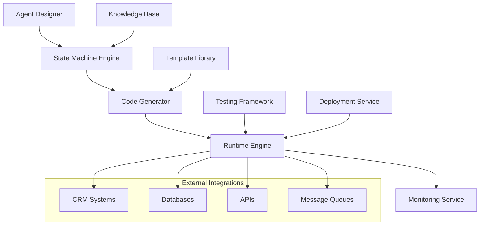

Agent Design Service (ADS) provides a comprehensive platform for designing, implementing, and deploying intelligent AI agents with enterprise-grade reliability and scalability. This technical documentation covers implementation patterns, APIs, testing frameworks, and integration strategies.

## Architecture Overview

### Core Components



### Agent Lifecycle Management

```kotlin
// Agent lifecycle states and transitions
enum class AgentState {
    DESIGN,        // Being designed/configured
    TESTING,       // Under testing and validation
    STAGING,       // Deployed to staging environment
    PRODUCTION,    // Live in production
    MAINTENANCE,   // Temporarily disabled for updates
    DEPRECATED,    // Scheduled for removal
    ARCHIVED       // Stored for historical reference
}

// State transition management
@Component
class AgentLifecycleManager {
    
    suspend fun transitionAgent(
        agentId: String, 
        fromState: AgentState, 
        toState: AgentState,
        context: TransitionContext
    ): TransitionResult {
        return when (fromState to toState) {
            AgentState.DESIGN to AgentState.TESTING -> deployToTesting(agentId, context)
            AgentState.TESTING to AgentState.STAGING -> promoteToStaging(agentId, context)
            AgentState.STAGING to AgentState.PRODUCTION -> promoteToProduction(agentId, context)
            AgentState.PRODUCTION to AgentState.MAINTENANCE -> enterMaintenance(agentId, context)
            AgentState.MAINTENANCE to AgentState.PRODUCTION -> exitMaintenance(agentId, context)
            else -> throw InvalidTransitionException(fromState, toState)
        }
    }
}
```

## State Machine Implementation

### Finite State Machine Design

The core of Agent Design Service is built on a robust finite state machine that manages conversation flows, business logic, and decision trees.

#### State Machine Definition Language (SMDL)

```yaml
# Example: Customer Service Agent State Machine
agent: customer-service-v2
version: "2.1.0"

states:
  initial:
    type: entry
    actions:
      - initialize_conversation_context
      - load_customer_profile
    transitions:
      - condition: "intent == 'greeting'"
        target: greeting_handler
      - condition: "intent == 'complaint'"
        target: complaint_handler
      - condition: "intent == 'inquiry'"
        target: inquiry_handler
      - default: unknown_intent_handler

  greeting_handler:
    type: processing
    actions:
      - generate_personalized_greeting
      - log_interaction_start
    transitions:
      - condition: "greeting_complete"
        target: await_user_request
    
  complaint_handler:
    type: processing
    actions:
      - categorize_complaint
      - check_escalation_criteria
      - load_resolution_templates
    transitions:
      - condition: "severity >= 'high'"
        target: escalate_to_human
      - condition: "auto_resolvable"
        target: auto_resolve_complaint
      - default: manual_complaint_handling
    
  inquiry_handler:
    type: processing
    actions:
      - classify_inquiry_type
      - search_knowledge_base
      - prepare_response_options
    transitions:
      - condition: "confidence >= 0.8"
        target: provide_direct_answer
      - condition: "requires_data_lookup"
        target: data_lookup_handler
      - default: clarification_needed
    
  escalate_to_human:
    type: processing
    actions:
      - create_support_ticket
      - notify_available_agents
      - prepare_context_handoff
    transitions:
      - condition: "agent_available"
        target: human_handoff
      - condition: "queue_full"
        target: schedule_callback
    
  auto_resolve_complaint:
    type: processing
    actions:
      - apply_resolution_template
      - update_customer_record
      - schedule_follow_up
    transitions:
      - condition: "resolution_accepted"
        target: satisfaction_survey
      - condition: "resolution_rejected"
        target: escalate_to_human
    
  provide_direct_answer:
    type: processing
    actions:
      - format_response_with_sources
      - log_successful_resolution
      - offer_additional_help
    transitions:
      - condition: "follow_up_questions"
        target: await_user_request
      - condition: "conversation_complete"
        target: conversation_end
    
  conversation_end:
    type: terminal
    actions:
      - save_conversation_summary
      - update_customer_satisfaction_metrics
      - cleanup_temporary_resources

# Global configuration
configuration:
  max_conversation_turns: 50
  session_timeout: 30m
  escalation_threshold: 0.3
  confidence_threshold: 0.7
  
  integrations:
    crm_system:
      type: salesforce
      endpoint: "https://api.salesforce.com"
      timeout: 10s
    
    knowledge_base:
      type: elasticsearch
      endpoint: "https://kb.company.com"
      index: "customer_support_v2"
    
    ticketing_system:
      type: jira
      endpoint: "https://company.atlassian.net"
      project: "SUPPORT"

# Event handlers
event_handlers:
  on_state_enter:
    - log_state_transition
    - update_conversation_metrics
    - check_timeout_conditions
  
  on_state_exit:
    - cleanup_state_resources
    - persist_state_data
  
  on_error:
    - log_error_details
    - attempt_error_recovery
    - escalate_if_critical
```

#### State Machine Runtime Implementation

```kotlin
@Component
class StateMachineEngine {
    
    private val logger = LoggerFactory.getLogger(StateMachineEngine::class.java)
    
    suspend fun processEvent(
        agentId: String,
        sessionId: String,
        event: ConversationEvent
    ): ProcessingResult {
        
        val session = sessionManager.getSession(sessionId)
            ?: return ProcessingResult.error("Session not found: $sessionId")
        
        val stateMachine = loadStateMachine(agentId)
        val currentState = session.currentState
        
        try {
            // Find applicable transition
            val transition = findApplicableTransition(stateMachine, currentState, event)
                ?: return handleNoTransitionFound(currentState, event)
            
            // Execute exit actions for current state
            executeExitActions(currentState, session, event)
            
            // Perform state transition
            val newState = transition.targetState
            session.currentState = newState
            session.lastTransition = transition
            
            // Execute entry actions for new state
            val actionResults = executeEntryActions(newState, session, event)
            
            // Update session and persist
            session.lastActivity = Instant.now()
            sessionManager.updateSession(session)
            
            // Log state transition
            logStateTransition(agentId, sessionId, currentState, newState, event)
            
            return ProcessingResult.success(
                data = mapOf(
                    "newState" to newState.name,
                    "actionResults" to actionResults,
                    "sessionId" to sessionId
                )
            )
            
        } catch (e: Exception) {
            logger.error("State machine processing failed", e)
            return handleStateMachineError(agentId, sessionId, currentState, event, e)
        }
    }
    
    private suspend fun executeEntryActions(
        state: AgentState,
        session: ConversationSession,
        event: ConversationEvent
    ): List<ActionResult> {
        
        return state.entryActions.map { action ->
            try {
                val result = actionExecutor.execute(action, session, event)
                ActionResult.success(action.name, result)
            } catch (e: Exception) {
                logger.warn("Action execution failed: ${action.name}", e)
                ActionResult.failure(action.name, e.message ?: "Unknown error")
            }
        }
    }
    
    private suspend fun findApplicableTransition(
        stateMachine: StateMachine,
        currentState: AgentState,
        event: ConversationEvent
    ): StateTransition? {
        
        return currentState.transitions.firstOrNull { transition ->
            evaluateTransitionCondition(transition.condition, event)
        } ?: currentState.transitions.find { it.isDefault }
    }
    
    private fun evaluateTransitionCondition(
        condition: String,
        event: ConversationEvent
    ): Boolean {
        return try {
            // Use expression evaluator (e.g., SpEL, MVEL)
            expressionEvaluator.evaluate(condition, event)
        } catch (e: Exception) {
            logger.warn("Condition evaluation failed: $condition", e)
            false
        }
    }
}
```

### Advanced State Machine Features

#### Hierarchical State Machines

```kotlin
// Support for nested state machines and composite states
class CompositeState(
    override val name: String,
    val subStateMachine: StateMachine,
    override val entryActions: List<Action>,
    override val exitActions: List<Action>
) : AgentState {
    
    suspend fun processEventInSubState(
        event: ConversationEvent,
        session: ConversationSession
    ): ProcessingResult {
        
        // Delegate to sub-state machine
        return subStateMachine.processEvent(event, session)
    }
}

// Example: Multi-step form handling with sub-states
val orderProcessingState = CompositeState(
    name = "order_processing",
    subStateMachine = StateMachine(
        initialState = "collect_shipping_info",
        states = mapOf(
            "collect_shipping_info" to ProcessingState(
                name = "collect_shipping_info",
                entryActions = listOf(
                    DisplayFormAction("shipping_form"),
                    ValidateRequiredFieldsAction()
                ),
                transitions = listOf(
                    StateTransition(
                        condition = "form.shipping.isComplete()",
                        targetState = "collect_payment_info"
                    )
                )
            ),
            "collect_payment_info" to ProcessingState(
                name = "collect_payment_info",
                entryActions = listOf(
                    DisplayFormAction("payment_form"),
                    ValidatePaymentMethodAction()
                ),
                transitions = listOf(
                    StateTransition(
                        condition = "form.payment.isValid()",
                        targetState = "confirm_order"
                    )
                )
            ),
            "confirm_order" to ProcessingState(
                name = "confirm_order",
                entryActions = listOf(
                    DisplayOrderSummaryAction(),
                    RequestConfirmationAction()
                ),
                transitions = listOf(
                    StateTransition(
                        condition = "user.confirmed == true",
                        targetState = "process_payment"
                    )
                )
            )
        )
    ),
    entryActions = listOf(InitializeOrderContextAction()),
    exitActions = listOf(CleanupOrderContextAction())
)
```

#### Parallel State Execution

```kotlin
// Support for parallel state execution (orthogonal regions)
class ParallelState(
    override val name: String,
    val regions: List<StateMachine>
) : AgentState {
    
    suspend fun processEvent(
        event: ConversationEvent,
        session: ConversationSession
    ): ProcessingResult {
        
        // Process event in all parallel regions
        val results = regions.map { region ->
            async { region.processEvent(event, session) }
        }.awaitAll()
        
        // Combine results from all regions
        return combineParallelResults(results)
    }
}

// Example: Concurrent processing of user intent and sentiment analysis
val conversationAnalysisState = ParallelState(
    name = "conversation_analysis",
    regions = listOf(
        // Intent analysis region
        StateMachine(
            initialState = "analyze_intent",
            states = mapOf(
                "analyze_intent" to ProcessingState(
                    entryActions = listOf(ClassifyIntentAction())
                )
            )
        ),
        // Sentiment analysis region  
        StateMachine(
            initialState = "analyze_sentiment",
            states = mapOf(
                "analyze_sentiment" to ProcessingState(
                    entryActions = listOf(AnalyzeSentimentAction())
                )
            )
        ),
        // Context extraction region
        StateMachine(
            initialState = "extract_context",
            states = mapOf(
                "extract_context" to ProcessingState(
                    entryActions = listOf(ExtractEntitiesAction())
                )
            )
        )
    )
)
```

## Code Generation Framework

### Template-Based Code Generation

Agent Design Service includes a powerful code generation framework that automatically creates production-ready agent implementations from high-level specifications.

#### Code Generation Templates

**Kotlin Agent Template:**

```kotlin
// Generated agent implementation
// DO NOT EDIT - This file is auto-generated from agent specification
// Generated at: {{generation_timestamp}}
// Template version: {{template_version}}

package {{package_name}}

import com.aimatrix.engine.*
import com.aimatrix.engine.annotations.*
import kotlinx.coroutines.*
import org.springframework.stereotype.Component
import org.slf4j.LoggerFactory

@Agent(
    name = "{{agent_name}}",
    version = "{{agent_version}}",
    description = "{{agent_description}}"
)
@Component
class {{agent_class_name}} : BaseAgent() {
    
    companion object {
        private val logger = LoggerFactory.getLogger({{agent_class_name}}::class.java)
    }
    
    {{#each memory_definitions}}
    @Memory(persistent = {{persistent}}, ttl = Duration.{{ttl}})
    private val {{name}}: {{type}} = {{default_value}}
    {{/each}}
    
    {{#each capabilities}}
    @Capability
    private val {{name}}: {{type}} by lazy {
        {{initialization_code}}
    }
    {{/each}}
    
    {{#each handlers}}
    @Handler
    suspend fun {{method_name}}({{parameters}}): ProcessingResult = withContext(Dispatchers.IO) {
        logger.info("Processing {{handler_type}} request: ${{{input_parameter}}.javaClass.simpleName}")
        
        try {
            {{#each validation_rules}}
            if ({{condition}}) {
                return@withContext ProcessingResult.error("{{error_message}}")
            }
            {{/each}}
            
            {{processing_logic}}
            
            val result = {{result_expression}}
            
            logger.info("Successfully processed {{handler_type}} request")
            return@withContext ProcessingResult.success(result)
            
        } catch (e: Exception) {
            logger.error("Failed to process {{handler_type}} request", e)
            return@withContext ProcessingResult.error("Processing failed: ${e.message}")
        }
    }
    
    {{/each}}
    
    {{#each scheduled_tasks}}
    @Scheduled({{schedule_expression}})
    suspend fun {{method_name}}() {
        logger.debug("Executing scheduled task: {{method_name}}")
        
        try {
            {{task_logic}}
        } catch (e: Exception) {
            logger.error("Scheduled task failed: {{method_name}}", e)
        }
    }
    {{/each}}
    
    {{#each private_methods}}
    private suspend fun {{method_name}}({{parameters}}): {{return_type}} {
        {{method_body}}
    }
    {{/each}}
    
    override suspend fun onStart() {
        logger.info("Agent {{agent_name}} starting up")
        {{startup_logic}}
        super.onStart()
    }
    
    override suspend fun onStop() {
        logger.info("Agent {{agent_name}} shutting down")
        {{shutdown_logic}}
        super.onStop()
    }
}
```

**Python Agent Template:**

```python
# Generated agent implementation
# DO NOT EDIT - This file is auto-generated from agent specification
# Generated at: {{generation_timestamp}}
# Template version: {{template_version}}

from amx_engine import Agent, handler, memory, capability, scheduled
from amx_engine.types import ProcessingResult, Message
from datetime import datetime, timedelta
from typing import Dict, List, Any, Optional
import asyncio
import logging

logger = logging.getLogger(__name__)

@Agent(
    name="{{agent_name}}",
    version="{{agent_version}}",
    description="{{agent_description}}"
)
class {{agent_class_name}}:
    def __init__(self):
        self.logger = logger
        {{#each initialization_code}}
        {{this}}
        {{/each}}
    
    {{#each memory_definitions}}
    @memory(persistent={{persistent}}, ttl=timedelta({{ttl}}))
    def {{name}}(self):
        return {{default_value}}
    {{/each}}
    
    {{#each capabilities}}
    @capability
    def {{name}}(self):
        {{initialization_code}}
        return {{instance_creation}}
    {{/each}}
    
    {{#each handlers}}
    @handler
    async def {{method_name}}(self, {{parameters}}) -> ProcessingResult:
        self.logger.info(f"Processing {{handler_type}} request: {type({{input_parameter}}).__name__}")
        
        try:
            {{#each validation_rules}}
            if {{condition}}:
                return ProcessingResult.error("{{error_message}}")
            {{/each}}
            
            {{processing_logic}}
            
            result = {{result_expression}}
            
            self.logger.info("Successfully processed {{handler_type}} request")
            return ProcessingResult.success(result)
            
        except Exception as e:
            self.logger.error(f"Failed to process {{handler_type}} request: {str(e)}")
            return ProcessingResult.error(f"Processing failed: {str(e)}")
    
    {{/each}}
    
    {{#each scheduled_tasks}}
    @scheduled({{schedule_expression}})
    async def {{method_name}}(self):
        self.logger.debug("Executing scheduled task: {{method_name}}")
        
        try:
            {{task_logic}}
        except Exception as e:
            self.logger.error(f"Scheduled task failed: {{method_name}}: {str(e)}")
    {{/each}}
    
    {{#each private_methods}}
    async def {{method_name}}(self, {{parameters}}) -> {{return_type}}:
        {{method_body}}
    {{/each}}
    
    async def on_start(self):
        self.logger.info("Agent {{agent_name}} starting up")
        {{startup_logic}}
    
    async def on_stop(self):
        self.logger.info("Agent {{agent_name}} shutting down")
        {{shutdown_logic}}
```

#### Code Generation API

```typescript
// TypeScript interfaces for code generation service
interface CodeGenerationRequest {
  agentSpecification: AgentSpecification
  targetLanguage: 'kotlin' | 'python' | 'typescript' | 'csharp' | 'java'
  templateVersion?: string
  customTemplates?: Record<string, string>
  outputFormat: 'single-file' | 'multi-file' | 'project-structure'
  includeTests: boolean
  includeDocumentation: boolean
}

interface AgentSpecification {
  metadata: {
    name: string
    version: string
    description: string
    author: string
    license?: string
  }
  
  stateMachine: StateMachineDefinition
  
  capabilities: Array<{
    name: string
    type: string
    configuration: Record<string, any>
  }>
  
  memory: Array<{
    name: string
    type: string
    persistent: boolean
    ttl?: string
    defaultValue?: any
  }>
  
  handlers: Array<{
    name: string
    inputType: string
    outputType: string
    validationRules: Array<ValidationRule>
    businessLogic: string
  }>
  
  scheduledTasks: Array<{
    name: string
    schedule: string
    taskLogic: string
  }>
  
  integrations: Array<{
    type: string
    name: string
    configuration: Record<string, any>
  }>
}

interface CodeGenerationResult {
  success: boolean
  files: Array<{
    path: string
    content: string
    type: 'source' | 'test' | 'config' | 'documentation'
  }>
  metadata: {
    generatedAt: string
    templateVersion: string
    targetLanguage: string
  }
  warnings: string[]
  errors: string[]
}

// Code generation service implementation
class CodeGenerationService {
  
  async generateAgent(
    request: CodeGenerationRequest
  ): Promise<CodeGenerationResult> {
    
    // Validate input specification
    const validation = await this.validateSpecification(request.agentSpecification)
    if (!validation.isValid) {
      return {
        success: false,
        files: [],
        metadata: {
          generatedAt: new Date().toISOString(),
          templateVersion: request.templateVersion || 'latest',
          targetLanguage: request.targetLanguage
        },
        warnings: [],
        errors: validation.errors
      }
    }
    
    // Load appropriate templates
    const templates = await this.loadTemplates(
      request.targetLanguage,
      request.templateVersion,
      request.customTemplates
    )
    
    // Generate code files
    const files: Array<{ path: string; content: string; type: string }> = []
    
    // Generate main agent file
    const mainAgentCode = await this.generateFromTemplate(
      templates.agentTemplate,
      request.agentSpecification
    )
    files.push({
      path: this.getMainFilePath(request.agentSpecification.metadata.name, request.targetLanguage),
      content: mainAgentCode,
      type: 'source'
    })
    
    // Generate test files if requested
    if (request.includeTests) {
      const testCode = await this.generateFromTemplate(
        templates.testTemplate,
        request.agentSpecification
      )
      files.push({
        path: this.getTestFilePath(request.agentSpecification.metadata.name, request.targetLanguage),
        content: testCode,
        type: 'test'
      })
    }
    
    // Generate configuration files
    const configCode = await this.generateConfigurationFiles(request.agentSpecification)
    files.push(...configCode)
    
    // Generate documentation if requested
    if (request.includeDocumentation) {
      const docCode = await this.generateDocumentation(request.agentSpecification)
      files.push(...docCode)
    }
    
    return {
      success: true,
      files,
      metadata: {
        generatedAt: new Date().toISOString(),
        templateVersion: request.templateVersion || 'latest',
        targetLanguage: request.targetLanguage
      },
      warnings: [],
      errors: []
    }
  }
  
  private async generateFromTemplate(
    template: string,
    specification: AgentSpecification
  ): Promise<string> {
    
    const handlebars = Handlebars.create()
    
    // Register custom helpers
    handlebars.registerHelper('pascalCase', (str: string) => {
      return str.replace(/(?:^|\s)\S/g, (a) => a.toUpperCase()).replace(/\s/g, '')
    })
    
    handlebars.registerHelper('camelCase', (str: string) => {
      const pascal = str.replace(/(?:^|\s)\S/g, (a) => a.toUpperCase()).replace(/\s/g, '')
      return pascal.charAt(0).toLowerCase() + pascal.slice(1)
    })
    
    handlebars.registerHelper('formatDuration', (duration: string) => {
      // Convert human-readable duration to appropriate format for target language
      return this.formatDurationForLanguage(duration, this.currentTargetLanguage)
    })
    
    // Compile and execute template
    const compiledTemplate = handlebars.compile(template)
    return compiledTemplate(specification)
  }
}
```

## Testing Framework

### Automated Testing Infrastructure

Agent Design Service provides comprehensive testing capabilities including unit tests, integration tests, performance tests, and conversation flow validation.

#### Agent Testing DSL

```kotlin
// Domain-Specific Language for agent testing
@Component
class AgentTestFramework {
    
    fun agentTest(agentName: String, block: AgentTestBuilder.() -> Unit): AgentTestSuite {
        val builder = AgentTestBuilder(agentName)
        builder.block()
        return builder.build()
    }
}

class AgentTestBuilder(private val agentName: String) {
    private val testCases = mutableListOf<AgentTestCase>()
    private val setupActions = mutableListOf<TestAction>()
    private val teardownActions = mutableListOf<TestAction>()
    
    fun setup(block: TestSetupBuilder.() -> Unit) {
        val setupBuilder = TestSetupBuilder()
        setupBuilder.block()
        setupActions.addAll(setupBuilder.actions)
    }
    
    fun teardown(block: TestTeardownBuilder.() -> Unit) {
        val teardownBuilder = TestTeardownBuilder()
        teardownBuilder.block()
        teardownActions.addAll(teardownBuilder.actions)
    }
    
    fun conversation(name: String, block: ConversationTestBuilder.() -> Unit) {
        val conversationBuilder = ConversationTestBuilder(name)
        conversationBuilder.block()
        testCases.add(conversationBuilder.build())
    }
    
    fun build(): AgentTestSuite {
        return AgentTestSuite(
            agentName = agentName,
            setupActions = setupActions,
            teardownActions = teardownActions,
            testCases = testCases
        )
    }
}

class ConversationTestBuilder(private val name: String) {
    private val steps = mutableListOf<ConversationStep>()
    private val expectations = mutableListOf<TestExpectation>()
    
    fun userSays(message: String, context: Map<String, Any> = emptyMap()) {
        steps.add(ConversationStep.UserInput(message, context))
    }
    
    fun agentResponds(block: ResponseExpectationBuilder.() -> Unit) {
        val responseBuilder = ResponseExpectationBuilder()
        responseBuilder.block()
        steps.add(ConversationStep.AgentResponse(responseBuilder.build()))
    }
    
    fun expectState(stateName: String) {
        expectations.add(StateExpectation(stateName))
    }
    
    fun expectMemoryContains(key: String, value: Any) {
        expectations.add(MemoryExpectation(key, value))
    }
    
    fun expectResponseTime(maxDuration: Duration) {
        expectations.add(PerformanceExpectation.ResponseTime(maxDuration))
    }
    
    fun expectExternalCall(serviceName: String, method: String, parameters: Map<String, Any>) {
        expectations.add(ExternalCallExpectation(serviceName, method, parameters))
    }
    
    fun build(): AgentTestCase {
        return ConversationTestCase(name, steps, expectations)
    }
}

// Example usage of testing DSL
@Test
fun customerServiceAgentTests() = runTest {
    
    val testSuite = agentTestFramework.agentTest("customer-service-agent") {
        
        setup {
            createTestCustomer("test_customer_123") {
                name = "John Doe"
                email = "john.doe@example.com"
                accountType = "premium"
                recentOrders = listOf("order_456", "order_789")
            }
            
            mockExternalService("crm-api") {
                when("getCustomerProfile") {
                    returns(customerProfile("test_customer_123"))
                }
                when("createTicket") {
                    returns(ticketCreated("TICKET-001"))
                }
            }
        }
        
        conversation("greeting_and_inquiry") {
            userSays("Hello, I have a question about my recent order")
            
            agentResponds {
                contains("Hello John")
                contains("recent order")
                responseTime(lessThan = 2.seconds)
            }
            
            expectState("inquiry_handler")
            expectMemoryContains("customer_id", "test_customer_123")
            expectExternalCall("crm-api", "getCustomerProfile", mapOf("id" to "test_customer_123"))
            
            userSays("I haven't received order 456 yet")
            
            agentResponds {
                contains("order 456")
                contains("tracking information")
                containsAny(listOf("shipping", "delivery", "tracking"))
            }
            
            expectState("order_inquiry_handler")
            expectResponseTime(3.seconds)
        }
        
        conversation("complaint_escalation") {
            userSays("This is completely unacceptable! I want to speak to a manager now!")
            
            agentResponds {
                contains("apologize")
                contains("manager")
                tone(isEmpathetic = true)
            }
            
            expectState("escalate_to_human")
            expectExternalCall("ticketing-system", "createTicket", mapOf(
                "priority" to "high",
                "category" to "complaint"
            ))
        }
        
        conversation("complex_multi_turn") {
            userSays("I need help with setting up automatic payments")
            
            agentResponds {
                contains("automatic payments")
                offers("guide you through")
            }
            
            expectState("payment_setup_wizard")
            
            userSays("Yes, please help me")
            
            agentResponds {
                contains("first step")
                containsFormField("payment_method")
            }
            
            userSays("I want to use my credit card ending in 1234")
            
            agentResponds {
                contains("credit card ending 1234")
                containsFormField("billing_frequency")
            }
            
            expectMemoryContains("payment_setup.method", "credit_card_1234")
        }
        
        teardown {
            cleanupTestCustomer("test_customer_123")
            resetExternalServiceMocks()
        }
    }
    
    // Execute test suite
    val results = agentTestRunner.execute(testSuite)
    
    // Verify results
    assert(results.allPassed) { "Some tests failed: ${results.failures}" }
    assert(results.averageResponseTime < 2.seconds) { "Performance requirements not met" }
}
```

#### Performance Testing Framework

```kotlin
@Component
class AgentPerformanceTestFramework {
    
    suspend fun loadTest(
        agentName: String,
        configuration: LoadTestConfiguration
    ): LoadTestResult {
        
        val testExecutor = CoroutineScope(Dispatchers.Default + SupervisorJob())
        val metrics = ConcurrentHashMap<String, AtomicLong>()
        val responseTimes = ConcurrentLinkedQueue<Duration>()
        val errors = ConcurrentLinkedQueue<TestError>()
        
        try {
            // Warm-up phase
            repeat(configuration.warmupRequests) {
                testExecutor.launch {
                    executeTestRequest(agentName, configuration.testScenarios.random())
                }
            }
            delay(configuration.warmupDuration)
            
            // Main test phase
            val startTime = Instant.now()
            val testJobs = (1..configuration.totalRequests).map { requestId ->
                testExecutor.launch {
                    val scenario = configuration.testScenarios.random()
                    val requestStart = Instant.now()
                    
                    try {
                        val result = executeTestRequest(agentName, scenario)
                        val duration = Duration.between(requestStart, Instant.now())
                        
                        responseTimes.offer(duration)
                        metrics.getOrPut("successful_requests") { AtomicLong(0) }.incrementAndGet()
                        
                        if (duration > configuration.maxAcceptableResponseTime) {
                            metrics.getOrPut("slow_requests") { AtomicLong(0) }.incrementAndGet()
                        }
                        
                    } catch (e: Exception) {
                        errors.offer(TestError(requestId, scenario.name, e.message ?: "Unknown error"))
                        metrics.getOrPut("failed_requests") { AtomicLong(0) }.incrementAndGet()
                    }
                }
            }
            
            // Apply load pattern
            when (configuration.loadPattern) {
                LoadPattern.CONSTANT -> {
                    testJobs.forEach { it.join() }
                }
                LoadPattern.RAMP_UP -> {
                    val batchSize = testJobs.size / 10
                    testJobs.chunked(batchSize).forEach { batch ->
                        batch.forEach { it.join() }
                        delay(configuration.rampUpInterval)
                    }
                }
                LoadPattern.SPIKE -> {
                    // Execute 80% of requests gradually, then spike the remaining 20%
                    val gradualCount = (testJobs.size * 0.8).toInt()
                    testJobs.take(gradualCount).forEach { 
                        it.join()
                        delay(50) // Small delay between requests
                    }
                    testJobs.drop(gradualCount).forEach { it.join() } // Spike
                }
            }
            
            val endTime = Instant.now()
            val totalDuration = Duration.between(startTime, endTime)
            
            return LoadTestResult(
                agentName = agentName,
                configuration = configuration,
                totalDuration = totalDuration,
                totalRequests = configuration.totalRequests,
                successfulRequests = metrics["successful_requests"]?.get() ?: 0,
                failedRequests = metrics["failed_requests"]?.get() ?: 0,
                slowRequests = metrics["slow_requests"]?.get() ?: 0,
                averageResponseTime = responseTimes.average(),
                percentiles = calculatePercentiles(responseTimes.toList()),
                throughput = configuration.totalRequests.toDouble() / totalDuration.toSeconds(),
                errors = errors.toList()
            )
            
        } finally {
            testExecutor.cancel()
        }
    }
    
    private fun calculatePercentiles(responseTimes: List<Duration>): ResponseTimePercentiles {
        val sortedTimes = responseTimes.sorted()
        val size = sortedTimes.size
        
        return ResponseTimePercentiles(
            p50 = sortedTimes[size / 2],
            p90 = sortedTimes[(size * 0.9).toInt()],
            p95 = sortedTimes[(size * 0.95).toInt()],
            p99 = sortedTimes[(size * 0.99).toInt()]
        )
    }
}

// Load testing configuration
data class LoadTestConfiguration(
    val totalRequests: Int,
    val concurrentUsers: Int,
    val testDuration: Duration,
    val warmupDuration: Duration,
    val warmupRequests: Int,
    val maxAcceptableResponseTime: Duration,
    val loadPattern: LoadPattern,
    val rampUpInterval: Duration,
    val testScenarios: List<TestScenario>
)

enum class LoadPattern {
    CONSTANT,    // Steady load throughout test
    RAMP_UP,     // Gradually increase load
    SPIKE        // Sudden load spikes
}

// Example performance test
@Test
fun agentPerformanceTest() = runTest {
    
    val loadTestConfig = LoadTestConfiguration(
        totalRequests = 10000,
        concurrentUsers = 100,
        testDuration = Duration.ofMinutes(5),
        warmupDuration = Duration.ofMinutes(1),
        warmupRequests = 500,
        maxAcceptableResponseTime = Duration.ofSeconds(2),
        loadPattern = LoadPattern.RAMP_UP,
        rampUpInterval = Duration.ofSeconds(30),
        testScenarios = listOf(
            TestScenario("simple_greeting", "Hello"),
            TestScenario("complex_inquiry", "I need help with my order #12345 that was supposed to arrive yesterday"),
            TestScenario("complaint", "This is the worst service I've ever experienced!"),
            TestScenario("information_request", "What are your business hours?")
        )
    )
    
    val results = performanceTestFramework.loadTest("customer-service-agent", loadTestConfig)
    
    // Verify performance requirements
    assert(results.averageResponseTime < Duration.ofSeconds(1)) {
        "Average response time too high: ${results.averageResponseTime}"
    }
    
    assert(results.percentiles.p95 < Duration.ofSeconds(2)) {
        "95th percentile response time too high: ${results.percentiles.p95}"
    }
    
    assert(results.successRate > 0.99) {
        "Success rate too low: ${results.successRate}"
    }
    
    assert(results.throughput > 100) {
        "Throughput too low: ${results.throughput} req/sec"
    }
}
```

### Integration Testing

```kotlin
@Component
class AgentIntegrationTestFramework {
    
    @Testcontainers
    class CustomerServiceAgentIntegrationTest {
        
        companion object {
            @Container
            val postgres = PostgreSQLContainer("postgres:13")
                .withDatabaseName("test_agents")
                .withUsername("test_user")
                .withPassword("test_password")
            
            @Container
            val redis = GenericContainer("redis:6-alpine")
                .withExposedPorts(6379)
            
            @Container
            val elasticsearch = ElasticsearchContainer("elasticsearch:7.15.0")
                .withEnv("discovery.type", "single-node")
                .withEnv("ES_JAVA_OPTS", "-Xms512m -Xmx512m")
            
            @Container
            val wiremock = WireMockContainer("wiremock/wiremock:2.27.2")
                .withMapping("crm-api")
        }
        
        @Test
        fun `should handle complete customer service workflow`() = runTest {
            
            // Setup test data
            setupCustomerData()
            setupKnowledgeBase()
            setupExternalServiceMocks()
            
            val agentEngine = startAgentEngine()
            val conversationId = UUID.randomUUID().toString()
            
            try {
                // Step 1: Customer initiates conversation
                var response = agentEngine.sendMessage(
                    agentId = "customer-service-agent",
                    conversationId = conversationId,
                    message = ConversationMessage(
                        text = "Hello, I have a question about my order",
                        userId = "customer_123",
                        metadata = mapOf("channel" to "web_chat")
                    )
                )
                
                // Verify initial greeting and customer recognition
                assert(response.success)
                assert(response.text.contains("Hello"))
                assert(response.context["customer_recognized"] == true)
                
                // Step 2: Customer asks specific question
                response = agentEngine.sendMessage(
                    agentId = "customer-service-agent", 
                    conversationId = conversationId,
                    message = ConversationMessage(
                        text = "Where is my order #ORD-2024-001?",
                        userId = "customer_123"
                    )
                )
                
                // Verify order lookup and tracking information
                assert(response.success)
                assert(response.text.contains("ORD-2024-001"))
                assert(response.text.contains("tracking"))
                verifyExternalApiCall("/api/orders/ORD-2024-001", "GET")
                
                // Step 3: Customer expresses dissatisfaction
                response = agentEngine.sendMessage(
                    agentId = "customer-service-agent",
                    conversationId = conversationId, 
                    message = ConversationMessage(
                        text = "This is unacceptable! The order was supposed to arrive yesterday!",
                        userId = "customer_123"
                    )
                )
                
                // Verify escalation handling
                assert(response.success)
                assert(response.text.contains("apologize") || response.text.contains("sorry"))
                assert(response.metadata["escalation_triggered"] == true)
                verifyTicketCreation("COMPLAINT", "HIGH")
                
                // Step 4: Agent offers resolution
                response = agentEngine.sendMessage(
                    agentId = "customer-service-agent",
                    conversationId = conversationId,
                    message = ConversationMessage(
                        text = "Yes, I would like a refund",
                        userId = "customer_123"
                    )
                )
                
                // Verify refund processing
                assert(response.success)
                assert(response.text.contains("refund"))
                verifyExternalApiCall("/api/refunds", "POST")
                
                // Verify conversation summary and metrics
                val conversationSummary = agentEngine.getConversationSummary(conversationId)
                assert(conversationSummary.totalTurns > 0)
                assert(conversationSummary.resolutionStatus == "RESOLVED")
                assert(conversationSummary.customerSatisfactionScore != null)
                
            } finally {
                agentEngine.shutdown()
                cleanupTestData()
            }
        }
        
        @Test
        fun `should handle high concurrency with multiple customers`() = runTest {
            
            val agentEngine = startAgentEngine()
            val numberOfConcurrentCustomers = 50
            val conversationsPerCustomer = 10
            
            try {
                val results = (1..numberOfConcurrentCustomers).map { customerId ->
                    async {
                        val customerResults = mutableListOf<ConversationResult>()
                        
                        repeat(conversationsPerCustomer) { conversationIndex ->
                            val conversationId = "customer_${customerId}_conv_${conversationIndex}"
                            
                            val result = agentEngine.sendMessage(
                                agentId = "customer-service-agent",
                                conversationId = conversationId,
                                message = ConversationMessage(
                                    text = "I need help with customer_${customerId}",
                                    userId = "customer_${customerId}"
                                )
                            )
                            
                            customerResults.add(
                                ConversationResult(
                                    customerId = customerId,
                                    conversationId = conversationId,
                                    success = result.success,
                                    responseTime = result.processingTime
                                )
                            )
                        }
                        
                        customerResults
                    }
                }.awaitAll().flatten()
                
                // Verify all conversations succeeded
                val successRate = results.count { it.success }.toDouble() / results.size
                assert(successRate > 0.95) { "Success rate too low: $successRate" }
                
                // Verify performance under load
                val averageResponseTime = results.map { it.responseTime }.average()
                assert(averageResponseTime < Duration.ofSeconds(3)) {
                    "Average response time too high under load: ${averageResponseTime}"
                }
                
            } finally {
                agentEngine.shutdown()
            }
        }
        
        private fun setupExternalServiceMocks() {
            // Mock CRM API
            wiremock.stubFor(
                get(urlPathEqualTo("/api/customers/customer_123"))
                    .willReturn(
                        aResponse()
                            .withStatus(200)
                            .withHeader("Content-Type", "application/json")
                            .withBody("""
                                {
                                    "id": "customer_123",
                                    "name": "John Doe",
                                    "email": "john.doe@example.com",
                                    "tier": "premium",
                                    "recentOrders": ["ORD-2024-001", "ORD-2024-002"]
                                }
                            """.trimIndent())
                    )
            )
            
            // Mock order tracking API
            wiremock.stubFor(
                get(urlPathEqualTo("/api/orders/ORD-2024-001"))
                    .willReturn(
                        aResponse()
                            .withStatus(200)
                            .withHeader("Content-Type", "application/json")
                            .withBody("""
                                {
                                    "orderId": "ORD-2024-001",
                                    "status": "SHIPPED",
                                    "trackingNumber": "1234567890",
                                    "estimatedDelivery": "2024-01-15",
                                    "carrier": "FedEx"
                                }
                            """.trimIndent())
                    )
            )
            
            // Mock ticketing system
            wiremock.stubFor(
                post(urlPathEqualTo("/api/tickets"))
                    .willReturn(
                        aResponse()
                            .withStatus(201)
                            .withHeader("Content-Type", "application/json")
                            .withBody("""
                                {
                                    "ticketId": "TICKET-2024-001",
                                    "status": "OPEN",
                                    "priority": "HIGH"
                                }
                            """.trimIndent())
                    )
            )
        }
    }
}
```

This comprehensive technical documentation provides developers with detailed implementation patterns, code examples, and testing frameworks for building production-ready AI agents using the Agent Design Service. The documentation covers state machine implementation, code generation, testing strategies, and integration patterns needed for enterprise deployment.