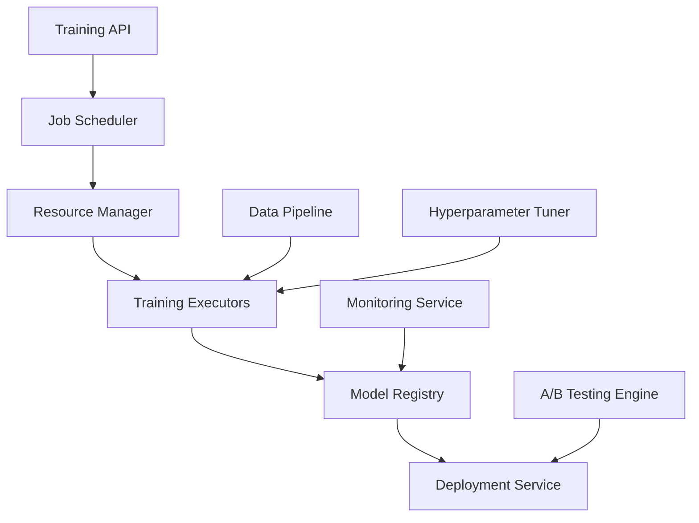

The AI Model Training Service provides enterprise-grade machine learning operations (MLOps) capabilities for training, deploying, and managing AI models at scale.

## Service Overview

The AI Model Training Service orchestrates the complete machine learning lifecycle from data preparation through model deployment and monitoring. It supports various ML frameworks including TensorFlow, PyTorch, scikit-learn, and custom model architectures.

### Key Capabilities

- **Distributed Training**: Support for multi-GPU and multi-node training
- **AutoML Integration**: Automated hyperparameter tuning and architecture search  
- **Model Versioning**: Complete model lifecycle management with MLflow
- **Real-time Monitoring**: Performance tracking and drift detection
- **A/B Testing**: Gradual model rollouts and performance comparison
- **Resource Management**: Dynamic scaling based on training requirements

## Architecture Design

### Core Components



### System Architecture

```kotlin
// Core service architecture
@Service
@Component("aiModelTrainingService")
class ModelTrainingService(
    private val jobScheduler: TrainingJobScheduler,
    private val resourceManager: ResourceManager,
    private val modelRegistry: ModelRegistry,
    private val metricsCollector: MetricsCollector,
    private val deploymentService: ModelDeploymentService
) {
    
    suspend fun submitTrainingJob(request: TrainingJobRequest): TrainingJobResponse {
        // Validate training configuration
        validateTrainingConfig(request.config)
        
        // Allocate resources
        val resources = resourceManager.allocateResources(
            gpuCount = request.config.gpuCount,
            memoryGb = request.config.memoryGb,
            cpuCores = request.config.cpuCores
        )
        
        // Submit to scheduler
        val job = jobScheduler.scheduleJob(
            config = request.config,
            resources = resources,
            priority = request.priority
        )
        
        return TrainingJobResponse(
            jobId = job.id,
            status = job.status,
            estimatedDuration = job.estimatedDuration
        )
    }
}
```

## API Specifications

### REST API Endpoints

#### Training Job Management

```yaml
# OpenAPI Specification
openapi: 3.0.3
info:
  title: AI Model Training Service API
  version: 1.0.0
  description: Enterprise MLOps training service

paths:
  /api/v1/training/jobs:
    post:
      summary: Submit training job
      operationId: submitTrainingJob
      requestBody:
        required: true
        content:
          application/json:
            schema:
              $ref: '#/components/schemas/TrainingJobRequest'
      responses:
        '201':
          description: Training job created
          content:
            application/json:
              schema:
                $ref: '#/components/schemas/TrainingJobResponse'
        '400':
          description: Invalid training configuration
        '429':
          description: Resource quota exceeded

    get:
      summary: List training jobs
      parameters:
        - name: status
          in: query
          schema:
            type: string
            enum: [pending, running, completed, failed, cancelled]
        - name: user_id
          in: query
          schema:
            type: string
        - name: limit
          in: query
          schema:
            type: integer
            default: 50
        - name: offset
          in: query
          schema:
            type: integer
            default: 0
      responses:
        '200':
          description: List of training jobs
          content:
            application/json:
              schema:
                $ref: '#/components/schemas/TrainingJobList'

  /api/v1/training/jobs/{jobId}:
    get:
      summary: Get training job details
      parameters:
        - name: jobId
          in: path
          required: true
          schema:
            type: string
      responses:
        '200':
          description: Training job details
          content:
            application/json:
              schema:
                $ref: '#/components/schemas/TrainingJob'
        '404':
          description: Training job not found

    delete:
      summary: Cancel training job
      parameters:
        - name: jobId
          in: path
          required: true
          schema:
            type: string
      responses:
        '204':
          description: Training job cancelled
        '404':
          description: Training job not found
        '409':
          description: Cannot cancel completed job

  /api/v1/training/jobs/{jobId}/logs:
    get:
      summary: Stream training logs
      parameters:
        - name: jobId
          in: path
          required: true
          schema:
            type: string
        - name: follow
          in: query
          schema:
            type: boolean
            default: false
      responses:
        '200':
          description: Training logs
          content:
            text/plain:
              schema:
                type: string
            application/x-ndjson:
              schema:
                $ref: '#/components/schemas/LogEntry'

  /api/v1/models:
    get:
      summary: List trained models
      parameters:
        - name: framework
          in: query
          schema:
            type: string
            enum: [tensorflow, pytorch, sklearn, xgboost, custom]
        - name: status
          in: query
          schema:
            type: string
            enum: [training, ready, deployed, deprecated]
      responses:
        '200':
          description: List of models
          content:
            application/json:
              schema:
                $ref: '#/components/schemas/ModelList'

    post:
      summary: Register external model
      requestBody:
        required: true
        content:
          application/json:
            schema:
              $ref: '#/components/schemas/ModelRegistrationRequest'
      responses:
        '201':
          description: Model registered
          content:
            application/json:
              schema:
                $ref: '#/components/schemas/Model'

  /api/v1/models/{modelId}/deploy:
    post:
      summary: Deploy model to serving infrastructure
      parameters:
        - name: modelId
          in: path
          required: true
          schema:
            type: string
      requestBody:
        required: true
        content:
          application/json:
            schema:
              $ref: '#/components/schemas/DeploymentConfig'
      responses:
        '202':
          description: Deployment initiated
          content:
            application/json:
              schema:
                $ref: '#/components/schemas/DeploymentResponse'

components:
  schemas:
    TrainingJobRequest:
      type: object
      required:
        - name
        - framework
        - config
      properties:
        name:
          type: string
          example: "customer-churn-model-v2"
        description:
          type: string
        framework:
          type: string
          enum: [tensorflow, pytorch, sklearn, xgboost, custom]
        config:
          $ref: '#/components/schemas/TrainingConfig'
        priority:
          type: string
          enum: [low, medium, high, critical]
          default: medium
        tags:
          type: array
          items:
            type: string

    TrainingConfig:
      type: object
      required:
        - script_path
        - dataset_path
      properties:
        script_path:
          type: string
          description: "Path to training script in artifact store"
          example: "s3://models/churn-detection/train.py"
        dataset_path:
          type: string
          description: "Path to training dataset"
          example: "s3://data/churn/train_data.parquet"
        parameters:
          type: object
          additionalProperties: true
          example:
            learning_rate: 0.001
            batch_size: 32
            epochs: 100
        resource_requirements:
          $ref: '#/components/schemas/ResourceRequirements'
        environment:
          type: object
          properties:
            docker_image:
              type: string
              example: "aimatrix/training:pytorch-1.12"
            environment_variables:
              type: object
              additionalProperties: 
                type: string

    ResourceRequirements:
      type: object
      properties:
        gpu_count:
          type: integer
          minimum: 0
          maximum: 8
          default: 1
        gpu_type:
          type: string
          enum: [v100, a100, h100, t4]
          default: v100
        memory_gb:
          type: integer
          minimum: 4
          maximum: 512
          default: 16
        cpu_cores:
          type: integer
          minimum: 2
          maximum: 64
          default: 8
        disk_gb:
          type: integer
          minimum: 20
          maximum: 2000
          default: 100

    TrainingJobResponse:
      type: object
      properties:
        job_id:
          type: string
          format: uuid
        name:
          type: string
        status:
          type: string
          enum: [pending, running, completed, failed, cancelled]
        created_at:
          type: string
          format: date-time
        estimated_duration:
          type: string
          description: "ISO 8601 duration"
          example: "PT2H30M"
        resource_allocation:
          $ref: '#/components/schemas/ResourceAllocation'

    TrainingJob:
      allOf:
        - $ref: '#/components/schemas/TrainingJobResponse'
        - type: object
          properties:
            config:
              $ref: '#/components/schemas/TrainingConfig'
            progress:
              $ref: '#/components/schemas/TrainingProgress'
            metrics:
              type: array
              items:
                $ref: '#/components/schemas/TrainingMetric'
            artifacts:
              type: array
              items:
                $ref: '#/components/schemas/Artifact'

    TrainingProgress:
      type: object
      properties:
        current_epoch:
          type: integer
        total_epochs:
          type: integer
        current_step:
          type: integer
        total_steps:
          type: integer
        percentage_complete:
          type: number
          minimum: 0
          maximum: 100
        elapsed_time:
          type: string
          description: "ISO 8601 duration"
        remaining_time:
          type: string
          description: "ISO 8601 duration (estimated)"

    TrainingMetric:
      type: object
      properties:
        name:
          type: string
          example: "loss"
        value:
          type: number
        step:
          type: integer
        epoch:
          type: integer
        timestamp:
          type: string
          format: date-time

    Model:
      type: object
      properties:
        id:
          type: string
          format: uuid
        name:
          type: string
        version:
          type: string
        framework:
          type: string
        status:
          type: string
          enum: [training, ready, deployed, deprecated]
        training_job_id:
          type: string
          format: uuid
        created_at:
          type: string
          format: date-time
        metrics:
          type: object
          additionalProperties:
            type: number
          example:
            accuracy: 0.94
            precision: 0.92
            recall: 0.89
            f1_score: 0.905
        artifacts:
          type: array
          items:
            $ref: '#/components/schemas/Artifact'
        deployment_config:
          $ref: '#/components/schemas/DeploymentConfig'

    DeploymentConfig:
      type: object
      required:
        - environment
      properties:
        environment:
          type: string
          enum: [development, staging, production]
        replicas:
          type: integer
          minimum: 1
          maximum: 100
          default: 2
        resource_limits:
          $ref: '#/components/schemas/ResourceRequirements'
        scaling_policy:
          $ref: '#/components/schemas/AutoScalingPolicy'
        traffic_split:
          type: object
          description: "For A/B testing"
          properties:
            percentage:
              type: integer
              minimum: 0
              maximum: 100
            target_models:
              type: array
              items:
                type: string

    AutoScalingPolicy:
      type: object
      properties:
        min_replicas:
          type: integer
          default: 1
        max_replicas:
          type: integer
          default: 10
        target_cpu_utilization:
          type: integer
          minimum: 1
          maximum: 100
          default: 70
        target_memory_utilization:
          type: integer
          minimum: 1
          maximum: 100
          default: 80
        scale_up_cooldown:
          type: string
          description: "ISO 8601 duration"
          default: "PT5M"
        scale_down_cooldown:
          type: string
          description: "ISO 8601 duration"
          default: "PT5M"

  securitySchemes:
    BearerAuth:
      type: http
      scheme: bearer
      bearerFormat: JWT
    ApiKeyAuth:
      type: apiKey
      in: header
      name: X-API-Key

security:
  - BearerAuth: []
  - ApiKeyAuth: []
```

### GraphQL API

```graphql
# GraphQL schema for advanced querying
type Query {
  trainingJobs(
    filter: TrainingJobFilter
    sort: TrainingJobSort
    pagination: PaginationInput
  ): TrainingJobConnection!
  
  trainingJob(id: ID!): TrainingJob
  
  models(
    filter: ModelFilter
    sort: ModelSort
    pagination: PaginationInput
  ): ModelConnection!
  
  model(id: ID!): Model
  
  trainingMetrics(
    jobId: ID!
    metricNames: [String!]
    timeRange: TimeRangeInput
  ): [TrainingMetricSeries!]!
}

type Mutation {
  submitTrainingJob(input: TrainingJobInput!): TrainingJobPayload!
  cancelTrainingJob(id: ID!): TrainingJobPayload!
  deployModel(input: ModelDeploymentInput!): ModelDeploymentPayload!
  updateModelStatus(id: ID!, status: ModelStatus!): ModelPayload!
}

type Subscription {
  trainingJobUpdates(jobId: ID!): TrainingJobUpdate!
  trainingMetrics(jobId: ID!): TrainingMetricUpdate!
  modelDeploymentUpdates(deploymentId: ID!): DeploymentUpdate!
}

# Core types
type TrainingJob {
  id: ID!
  name: String!
  status: TrainingJobStatus!
  config: TrainingConfig!
  progress: TrainingProgress
  metrics: [TrainingMetric!]!
  artifacts: [Artifact!]!
  createdAt: DateTime!
  updatedAt: DateTime!
  startedAt: DateTime
  completedAt: DateTime
  estimatedDuration: Duration
  resourceAllocation: ResourceAllocation
  logs(last: Int = 100): [LogEntry!]!
}

enum TrainingJobStatus {
  PENDING
  RUNNING
  COMPLETED
  FAILED
  CANCELLED
}

type TrainingConfig {
  scriptPath: String!
  datasetPath: String!
  framework: MLFramework!
  parameters: JSON!
  resourceRequirements: ResourceRequirements!
  environment: Environment!
}

type Model {
  id: ID!
  name: String!
  version: String!
  framework: MLFramework!
  status: ModelStatus!
  trainingJob: TrainingJob
  metrics: ModelMetrics!
  artifacts: [Artifact!]!
  deployments: [ModelDeployment!]!
  createdAt: DateTime!
  updatedAt: DateTime!
}

enum ModelStatus {
  TRAINING
  READY
  DEPLOYED
  DEPRECATED
}

type ModelDeployment {
  id: ID!
  model: Model!
  environment: DeploymentEnvironment!
  status: DeploymentStatus!
  config: DeploymentConfig!
  endpoint: String
  metrics: DeploymentMetrics
  createdAt: DateTime!
  updatedAt: DateTime!
}

# Custom scalars
scalar DateTime
scalar Duration
scalar JSON
```

### gRPC Service Definition

```protobuf
// training_service.proto
syntax = "proto3";

package aimatrix.training.v1;

import "google/protobuf/timestamp.proto";
import "google/protobuf/duration.proto";
import "google/protobuf/struct.proto";

// Training Service Definition
service TrainingService {
  // Submit a new training job
  rpc SubmitTrainingJob(SubmitTrainingJobRequest) returns (SubmitTrainingJobResponse);
  
  // Get training job status
  rpc GetTrainingJob(GetTrainingJobRequest) returns (TrainingJob);
  
  // List training jobs
  rpc ListTrainingJobs(ListTrainingJobsRequest) returns (ListTrainingJobsResponse);
  
  // Cancel training job
  rpc CancelTrainingJob(CancelTrainingJobRequest) returns (CancelTrainingJobResponse);
  
  // Stream training logs
  rpc StreamTrainingLogs(StreamTrainingLogsRequest) returns (stream LogEntry);
  
  // Stream training metrics
  rpc StreamTrainingMetrics(StreamTrainingMetricsRequest) returns (stream TrainingMetric);
  
  // Model management
  rpc ListModels(ListModelsRequest) returns (ListModelsResponse);
  rpc GetModel(GetModelRequest) returns (Model);
  rpc DeployModel(DeployModelRequest) returns (DeployModelResponse);
}

// Request/Response Messages
message SubmitTrainingJobRequest {
  string name = 1;
  string description = 2;
  TrainingConfig config = 3;
  Priority priority = 4;
  repeated string tags = 5;
}

message SubmitTrainingJobResponse {
  string job_id = 1;
  TrainingJobStatus status = 2;
  google.protobuf.Timestamp created_at = 3;
  google.protobuf.Duration estimated_duration = 4;
  ResourceAllocation resource_allocation = 5;
}

message TrainingConfig {
  string script_path = 1;
  string dataset_path = 2;
  MLFramework framework = 3;
  google.protobuf.Struct parameters = 4;
  ResourceRequirements resource_requirements = 5;
  Environment environment = 6;
}

message ResourceRequirements {
  int32 gpu_count = 1;
  GPUType gpu_type = 2;
  int32 memory_gb = 3;
  int32 cpu_cores = 4;
  int32 disk_gb = 5;
}

message TrainingJob {
  string id = 1;
  string name = 2;
  TrainingJobStatus status = 3;
  TrainingConfig config = 4;
  TrainingProgress progress = 5;
  repeated TrainingMetric metrics = 6;
  repeated Artifact artifacts = 7;
  google.protobuf.Timestamp created_at = 8;
  google.protobuf.Timestamp updated_at = 9;
  google.protobuf.Timestamp started_at = 10;
  google.protobuf.Timestamp completed_at = 11;
}

message TrainingProgress {
  int32 current_epoch = 1;
  int32 total_epochs = 2;
  int64 current_step = 3;
  int64 total_steps = 4;
  float percentage_complete = 5;
  google.protobuf.Duration elapsed_time = 6;
  google.protobuf.Duration remaining_time = 7;
}

message TrainingMetric {
  string name = 1;
  double value = 2;
  int64 step = 3;
  int32 epoch = 4;
  google.protobuf.Timestamp timestamp = 5;
  map<string, string> tags = 6;
}

// Enums
enum TrainingJobStatus {
  TRAINING_JOB_STATUS_UNSPECIFIED = 0;
  TRAINING_JOB_STATUS_PENDING = 1;
  TRAINING_JOB_STATUS_RUNNING = 2;
  TRAINING_JOB_STATUS_COMPLETED = 3;
  TRAINING_JOB_STATUS_FAILED = 4;
  TRAINING_JOB_STATUS_CANCELLED = 5;
}

enum MLFramework {
  ML_FRAMEWORK_UNSPECIFIED = 0;
  ML_FRAMEWORK_TENSORFLOW = 1;
  ML_FRAMEWORK_PYTORCH = 2;
  ML_FRAMEWORK_SKLEARN = 3;
  ML_FRAMEWORK_XGBOOST = 4;
  ML_FRAMEWORK_CUSTOM = 5;
}

enum GPUType {
  GPU_TYPE_UNSPECIFIED = 0;
  GPU_TYPE_V100 = 1;
  GPU_TYPE_A100 = 2;
  GPU_TYPE_H100 = 3;
  GPU_TYPE_T4 = 4;
}

enum Priority {
  PRIORITY_UNSPECIFIED = 0;
  PRIORITY_LOW = 1;
  PRIORITY_MEDIUM = 2;
  PRIORITY_HIGH = 3;
  PRIORITY_CRITICAL = 4;
}
```

## Implementation Examples

### Kotlin/Spring Boot Service Implementation

```kotlin
// Main service implementation
@Service
@Transactional
@Component("modelTrainingService")
class ModelTrainingServiceImpl(
    private val trainingJobRepository: TrainingJobRepository,
    private val modelRepository: ModelRepository,
    private val resourceManager: ResourceManager,
    private val jobScheduler: KubernetesJobScheduler,
    private val metricsCollector: MetricsCollector,
    private val artifactStore: ArtifactStore,
    private val notificationService: NotificationService
) : ModelTrainingService {

    private val logger = LoggerFactory.getLogger(ModelTrainingServiceImpl::class.java)

    @Async
    override suspend fun submitTrainingJob(request: TrainingJobRequest): TrainingJobResponse {
        logger.info("Submitting training job: ${request.name}")
        
        // Validate configuration
        validateTrainingConfig(request.config)
        
        // Check resource quotas
        val quotaCheck = resourceManager.checkQuota(
            userId = request.userId,
            resources = request.config.resourceRequirements
        )
        
        if (!quotaCheck.isAllowed) {
            throw ResourceQuotaExceededException(
                "User ${request.userId} has exceeded resource quota: ${quotaCheck.reason}"
            )
        }
        
        // Create training job record
        val trainingJob = TrainingJob(
            id = UUID.randomUUID().toString(),
            name = request.name,
            description = request.description,
            userId = request.userId,
            config = request.config,
            status = TrainingJobStatus.PENDING,
            priority = request.priority,
            tags = request.tags,
            createdAt = Instant.now()
        )
        
        trainingJobRepository.save(trainingJob)
        
        // Schedule job execution
        val scheduledJob = jobScheduler.scheduleTrainingJob(trainingJob)
        
        // Update job with scheduling information
        trainingJob.scheduledAt = scheduledJob.scheduledAt
        trainingJob.estimatedDuration = scheduledJob.estimatedDuration
        trainingJob.resourceAllocation = scheduledJob.resourceAllocation
        
        trainingJobRepository.save(trainingJob)
        
        // Send notification
        notificationService.sendTrainingJobSubmitted(trainingJob)
        
        return TrainingJobResponse(
            jobId = trainingJob.id,
            status = trainingJob.status,
            createdAt = trainingJob.createdAt,
            estimatedDuration = trainingJob.estimatedDuration,
            resourceAllocation = trainingJob.resourceAllocation
        )
    }

    override suspend fun getTrainingJob(jobId: String): TrainingJob? {
        return trainingJobRepository.findById(jobId)
    }

    override suspend fun listTrainingJobs(
        userId: String?,
        status: TrainingJobStatus?,
        limit: Int,
        offset: Int
    ): List<TrainingJob> {
        return trainingJobRepository.findJobs(
            userId = userId,
            status = status,
            limit = limit,
            offset = offset
        )
    }

    @Async
    override suspend fun cancelTrainingJob(jobId: String): Boolean {
        val trainingJob = trainingJobRepository.findById(jobId)
            ?: throw TrainingJobNotFoundException(jobId)
        
        if (trainingJob.status in setOf(TrainingJobStatus.COMPLETED, TrainingJobStatus.CANCELLED, TrainingJobStatus.FAILED)) {
            throw IllegalStateException("Cannot cancel job in status: ${trainingJob.status}")
        }
        
        // Cancel Kubernetes job
        val cancelled = jobScheduler.cancelJob(trainingJob.kubernetesJobName)
        
        if (cancelled) {
            trainingJob.status = TrainingJobStatus.CANCELLED
            trainingJob.completedAt = Instant.now()
            trainingJobRepository.save(trainingJob)
            
            // Release resources
            resourceManager.releaseResources(trainingJob.resourceAllocation)
            
            // Send notification
            notificationService.sendTrainingJobCancelled(trainingJob)
        }
        
        return cancelled
    }

    override suspend fun streamTrainingLogs(jobId: String): Flow<LogEntry> {
        val trainingJob = trainingJobRepository.findById(jobId)
            ?: throw TrainingJobNotFoundException(jobId)
        
        return jobScheduler.streamJobLogs(trainingJob.kubernetesJobName)
    }

    override suspend fun streamTrainingMetrics(jobId: String): Flow<TrainingMetric> {
        return metricsCollector.streamMetrics(jobId)
    }

    private fun validateTrainingConfig(config: TrainingConfig) {
        // Validate script path exists
        if (!artifactStore.exists(config.scriptPath)) {
            throw ValidationException("Training script not found: ${config.scriptPath}")
        }
        
        // Validate dataset path exists
        if (!artifactStore.exists(config.datasetPath)) {
            throw ValidationException("Dataset not found: ${config.datasetPath}")
        }
        
        // Validate resource requirements
        if (config.resourceRequirements.gpuCount > 8) {
            throw ValidationException("Maximum 8 GPUs allowed per training job")
        }
        
        if (config.resourceRequirements.memoryGb > 512) {
            throw ValidationException("Maximum 512GB memory allowed per training job")
        }
        
        // Validate framework-specific parameters
        when (config.framework) {
            MLFramework.TENSORFLOW -> validateTensorFlowConfig(config)
            MLFramework.PYTORCH -> validatePyTorchConfig(config)
            MLFramework.SKLEARN -> validateSklearnConfig(config)
            MLFramework.XGBOOST -> validateXGBoostConfig(config)
            else -> {} // Custom frameworks have no validation
        }
    }
    
    private fun validateTensorFlowConfig(config: TrainingConfig) {
        val params = config.parameters
        
        // Validate learning rate
        val learningRate = params["learning_rate"] as? Number
        if (learningRate != null && (learningRate.toDouble() <= 0 || learningRate.toDouble() > 1)) {
            throw ValidationException("Learning rate must be between 0 and 1")
        }
        
        // Validate batch size
        val batchSize = params["batch_size"] as? Number
        if (batchSize != null && batchSize.toInt() <= 0) {
            throw ValidationException("Batch size must be positive")
        }
    }
    
    private fun validatePyTorchConfig(config: TrainingConfig) {
        // Similar validation for PyTorch-specific parameters
        val params = config.parameters
        
        val optimizer = params["optimizer"] as? String
        if (optimizer != null && optimizer !in setOf("adam", "sgd", "rmsprop", "adagrad")) {
            throw ValidationException("Unsupported optimizer: $optimizer")
        }
    }
    
    private fun validateSklearnConfig(config: TrainingConfig) {
        // Validate scikit-learn parameters
        val params = config.parameters
        
        val algorithm = params["algorithm"] as? String
        if (algorithm != null && algorithm !in setOf(
            "random_forest", "svm", "logistic_regression", 
            "gradient_boosting", "neural_network"
        )) {
            throw ValidationException("Unsupported algorithm: $algorithm")
        }
    }
    
    private fun validateXGBoostConfig(config: TrainingConfig) {
        // Validate XGBoost parameters
        val params = config.parameters
        
        val objective = params["objective"] as? String
        if (objective != null && objective !in setOf(
            "reg:squarederror", "binary:logistic", "multi:softmax", "multi:softprob"
        )) {
            throw ValidationException("Unsupported objective: $objective")
        }
    }
}

// Job scheduler for Kubernetes
@Component
class KubernetesJobScheduler(
    private val kubernetesClient: KubernetesClient,
    private val resourceCalculator: ResourceCalculator
) {
    
    suspend fun scheduleTrainingJob(trainingJob: TrainingJob): ScheduledJob {
        val jobName = "training-${trainingJob.id.substring(0, 8)}"
        
        // Calculate resource allocation
        val resources = resourceCalculator.calculateResources(
            trainingJob.config.resourceRequirements
        )
        
        // Create Kubernetes job manifest
        val job = createJobManifest(trainingJob, jobName, resources)
        
        // Submit to Kubernetes
        kubernetesClient.batch().v1().jobs()
            .inNamespace("aimatrix-training")
            .create(job)
        
        return ScheduledJob(
            jobName = jobName,
            scheduledAt = Instant.now(),
            estimatedDuration = estimateTrainingDuration(trainingJob),
            resourceAllocation = resources
        )
    }
    
    private fun createJobManifest(
        trainingJob: TrainingJob, 
        jobName: String, 
        resources: ResourceAllocation
    ): Job {
        return Job().apply {
            metadata = ObjectMeta().apply {
                name = jobName
                namespace = "aimatrix-training"
                labels = mapOf(
                    "app" to "aimatrix-training",
                    "job-id" to trainingJob.id,
                    "framework" to trainingJob.config.framework.name.lowercase(),
                    "user-id" to trainingJob.userId
                )
            }
            
            spec = JobSpec().apply {
                template = PodTemplateSpec().apply {
                    metadata = ObjectMeta().apply {
                        labels = mapOf(
                            "app" to "aimatrix-training",
                            "job-id" to trainingJob.id
                        )
                    }
                    
                    spec = PodSpec().apply {
                        restartPolicy = "Never"
                        
                        containers = listOf(
                            Container().apply {
                                name = "trainer"
                                image = trainingJob.config.environment.dockerImage
                                command = listOf("/bin/bash", "-c")
                                args = listOf(createTrainingCommand(trainingJob))
                                
                                env = trainingJob.config.environment.environmentVariables.map { (key, value) ->
                                    EnvVar(key, value, null)
                                } + listOf(
                                    EnvVar("JOB_ID", trainingJob.id, null),
                                    EnvVar("TRAINING_SCRIPT", trainingJob.config.scriptPath, null),
                                    EnvVar("DATASET_PATH", trainingJob.config.datasetPath, null)
                                )
                                
                                resources = io.fabric8.kubernetes.api.model.ResourceRequirements().apply {
                                    requests = mapOf(
                                        "cpu" to Quantity(resources.cpuCores.toString()),
                                        "memory" to Quantity("${resources.memoryGb}Gi"),
                                        "nvidia.com/gpu" to Quantity(resources.gpuCount.toString())
                                    )
                                    limits = mapOf(
                                        "cpu" to Quantity((resources.cpuCores * 2).toString()),
                                        "memory" to Quantity("${resources.memoryGb * 2}Gi"),
                                        "nvidia.com/gpu" to Quantity(resources.gpuCount.toString())
                                    )
                                }
                                
                                volumeMounts = listOf(
                                    VolumeMount().apply {
                                        name = "artifact-storage"
                                        mountPath = "/artifacts"
                                    },
                                    VolumeMount().apply {
                                        name = "data-storage"
                                        mountPath = "/data"
                                    }
                                )
                            }
                        )
                        
                        volumes = listOf(
                            Volume().apply {
                                name = "artifact-storage"
                                persistentVolumeClaim = PersistentVolumeClaimVolumeSource("artifact-storage", false)
                            },
                            Volume().apply {
                                name = "data-storage"
                                persistentVolumeClaim = PersistentVolumeClaimVolumeSource("data-storage", false)
                            }
                        )
                        
                        nodeSelector = mapOf(
                            "nvidia.com/gpu.product" to resources.gpuType.toString().lowercase()
                        )
                        
                        tolerations = listOf(
                            Toleration().apply {
                                key = "nvidia.com/gpu"
                                operator = "Exists"
                                effect = "NoSchedule"
                            }
                        )
                    }
                }
            }
        }
    }
    
    private fun createTrainingCommand(trainingJob: TrainingJob): String {
        val config = trainingJob.config
        val parametersJson = objectMapper.writeValueAsString(config.parameters)
        
        return """
            # Download training script and data
            aws s3 cp ${config.scriptPath} /tmp/train.py
            aws s3 sync ${config.datasetPath} /data/
            
            # Set up MLflow tracking
            export MLFLOW_TRACKING_URI=http://mlflow-server:5000
            export MLFLOW_EXPERIMENT_NAME="${trainingJob.name}"
            export MLFLOW_RUN_NAME="${trainingJob.id}"
            
            # Execute training
            cd /tmp
            python train.py \
                --job-id=${trainingJob.id} \
                --data-path=/data \
                --output-path=/artifacts \
                --parameters='$parametersJson'
                
            # Upload artifacts
            aws s3 sync /artifacts s3://aimatrix-models/${trainingJob.id}/
        """.trimIndent()
    }
}

// Metrics collection service
@Component
class TrainingMetricsCollector(
    private val metricsRepository: TrainingMetricsRepository,
    private val meterRegistry: MeterRegistry
) {
    
    private val activeJobs = ConcurrentHashMap<String, Job>()
    
    fun startMetricsCollection(jobId: String) {
        val job = CoroutineScope(Dispatchers.IO).launch {
            collectMetricsForJob(jobId)
        }
        activeJobs[jobId] = job
    }
    
    fun stopMetricsCollection(jobId: String) {
        activeJobs[jobId]?.cancel()
        activeJobs.remove(jobId)
    }
    
    private suspend fun collectMetricsForJob(jobId: String) {
        while (isActive) {
            try {
                val metrics = fetchMetricsFromMLflow(jobId)
                metrics.forEach { metric ->
                    metricsRepository.save(metric)
                    
                    // Update Micrometer metrics
                    meterRegistry.gauge(
                        "training.metric.${metric.name}",
                        Tags.of(
                            "job_id", jobId,
                            "metric_type", metric.name
                        ),
                        metric.value
                    )
                }
                
                delay(10.seconds)
            } catch (e: Exception) {
                logger.error("Error collecting metrics for job $jobId", e)
                delay(30.seconds)
            }
        }
    }
    
    private suspend fun fetchMetricsFromMLflow(jobId: String): List<TrainingMetric> {
        // Integration with MLflow tracking server
        val response = mlflowClient.getRun(jobId)
        
        return response.metrics.map { (name, value) ->
            TrainingMetric(
                jobId = jobId,
                name = name,
                value = value.toDouble(),
                step = response.step ?: 0,
                timestamp = Instant.now()
            )
        }
    }
    
    suspend fun streamMetrics(jobId: String): Flow<TrainingMetric> = flow {
        while (currentCoroutineContext().isActive) {
            val metrics = metricsRepository.findRecentMetrics(jobId, limit = 100)
            metrics.forEach { emit(it) }
            delay(5.seconds)
        }
    }
}
```

## Database Schema & Models

### PostgreSQL Schema

```sql
-- Training jobs table
CREATE TABLE training_jobs (
    id UUID PRIMARY KEY DEFAULT gen_random_uuid(),
    name VARCHAR(255) NOT NULL,
    description TEXT,
    user_id UUID NOT NULL,
    status VARCHAR(50) NOT NULL DEFAULT 'pending',
    priority VARCHAR(20) NOT NULL DEFAULT 'medium',
    framework VARCHAR(50) NOT NULL,
    
    -- Configuration (JSONB for flexibility)
    config JSONB NOT NULL,
    
    -- Kubernetes job information
    kubernetes_job_name VARCHAR(255),
    
    -- Resource allocation
    resource_allocation JSONB,
    
    -- Timing
    created_at TIMESTAMP WITH TIME ZONE DEFAULT NOW(),
    updated_at TIMESTAMP WITH TIME ZONE DEFAULT NOW(),
    started_at TIMESTAMP WITH TIME ZONE,
    completed_at TIMESTAMP WITH TIME ZONE,
    scheduled_at TIMESTAMP WITH TIME ZONE,
    estimated_duration INTERVAL,
    
    -- Tags for organization
    tags TEXT[] DEFAULT '{}',
    
    -- Indexes
    CONSTRAINT training_jobs_status_check CHECK (
        status IN ('pending', 'running', 'completed', 'failed', 'cancelled')
    ),
    CONSTRAINT training_jobs_priority_check CHECK (
        priority IN ('low', 'medium', 'high', 'critical')
    ),
    CONSTRAINT training_jobs_framework_check CHECK (
        framework IN ('tensorflow', 'pytorch', 'sklearn', 'xgboost', 'custom')
    )
);

-- Indexes for performance
CREATE INDEX idx_training_jobs_user_status ON training_jobs(user_id, status);
CREATE INDEX idx_training_jobs_status_created ON training_jobs(status, created_at DESC);
CREATE INDEX idx_training_jobs_framework ON training_jobs(framework);
CREATE INDEX idx_training_jobs_tags ON training_jobs USING GIN(tags);
CREATE INDEX idx_training_jobs_config ON training_jobs USING GIN(config);

-- Training metrics table (time-series data)
CREATE TABLE training_metrics (
    id BIGSERIAL PRIMARY KEY,
    job_id UUID NOT NULL REFERENCES training_jobs(id) ON DELETE CASCADE,
    name VARCHAR(100) NOT NULL,
    value DOUBLE PRECISION NOT NULL,
    step BIGINT,
    epoch INTEGER,
    timestamp TIMESTAMP WITH TIME ZONE DEFAULT NOW(),
    
    -- Additional metadata
    tags JSONB DEFAULT '{}'::jsonb
);

-- Partitioning for metrics (by month)
CREATE TABLE training_metrics_y2024m01 PARTITION OF training_metrics
    FOR VALUES FROM ('2024-01-01') TO ('2024-02-01');

CREATE TABLE training_metrics_y2024m02 PARTITION OF training_metrics
    FOR VALUES FROM ('2024-02-01') TO ('2024-03-01');

-- Continue partitioning for other months...

-- Indexes for metrics
CREATE INDEX idx_training_metrics_job_time ON training_metrics(job_id, timestamp DESC);
CREATE INDEX idx_training_metrics_name_time ON training_metrics(name, timestamp DESC);
CREATE INDEX idx_training_metrics_tags ON training_metrics USING GIN(tags);

-- Models table
CREATE TABLE models (
    id UUID PRIMARY KEY DEFAULT gen_random_uuid(),
    name VARCHAR(255) NOT NULL,
    version VARCHAR(100) NOT NULL,
    framework VARCHAR(50) NOT NULL,
    status VARCHAR(50) NOT NULL DEFAULT 'training',
    
    -- Foreign key to training job
    training_job_id UUID REFERENCES training_jobs(id),
    
    -- Model metadata
    description TEXT,
    tags TEXT[] DEFAULT '{}',
    
    -- Model metrics (stored as JSONB)
    metrics JSONB DEFAULT '{}'::jsonb,
    
    -- Artifact locations
    artifacts JSONB DEFAULT '[]'::jsonb,
    
    -- Timing
    created_at TIMESTAMP WITH TIME ZONE DEFAULT NOW(),
    updated_at TIMESTAMP WITH TIME ZONE DEFAULT NOW(),
    
    -- Unique constraint on name + version
    UNIQUE(name, version),
    
    -- Status check
    CONSTRAINT models_status_check CHECK (
        status IN ('training', 'ready', 'deployed', 'deprecated')
    )
);

-- Indexes for models
CREATE INDEX idx_models_status ON models(status);
CREATE INDEX idx_models_framework ON models(framework);
CREATE INDEX idx_models_training_job ON models(training_job_id);
CREATE INDEX idx_models_tags ON models USING GIN(tags);
CREATE INDEX idx_models_metrics ON models USING GIN(metrics);

-- Model deployments table
CREATE TABLE model_deployments (
    id UUID PRIMARY KEY DEFAULT gen_random_uuid(),
    model_id UUID NOT NULL REFERENCES models(id) ON DELETE CASCADE,
    name VARCHAR(255) NOT NULL,
    environment VARCHAR(50) NOT NULL,
    status VARCHAR(50) NOT NULL DEFAULT 'deploying',
    
    -- Deployment configuration
    config JSONB NOT NULL,
    
    -- Service endpoint
    endpoint_url VARCHAR(500),
    
    -- Deployment metrics
    metrics JSONB DEFAULT '{}'::jsonb,
    
    -- Timing
    created_at TIMESTAMP WITH TIME ZONE DEFAULT NOW(),
    updated_at TIMESTAMP WITH TIME ZONE DEFAULT NOW(),
    deployed_at TIMESTAMP WITH TIME ZONE,
    
    -- Status check
    CONSTRAINT deployments_status_check CHECK (
        status IN ('deploying', 'active', 'inactive', 'failed', 'terminated')
    ),
    CONSTRAINT deployments_environment_check CHECK (
        environment IN ('development', 'staging', 'production')
    )
);

-- Indexes for deployments
CREATE INDEX idx_deployments_model ON model_deployments(model_id);
CREATE INDEX idx_deployments_status ON model_deployments(status);
CREATE INDEX idx_deployments_environment ON model_deployments(environment);

-- Artifacts table
CREATE TABLE artifacts (
    id UUID PRIMARY KEY DEFAULT gen_random_uuid(),
    job_id UUID REFERENCES training_jobs(id) ON DELETE CASCADE,
    model_id UUID REFERENCES models(id) ON DELETE CASCADE,
    
    -- Artifact information
    name VARCHAR(255) NOT NULL,
    type VARCHAR(100) NOT NULL,
    path VARCHAR(1000) NOT NULL,
    size_bytes BIGINT,
    checksum VARCHAR(64),
    
    -- Metadata
    metadata JSONB DEFAULT '{}'::jsonb,
    
    -- Timing
    created_at TIMESTAMP WITH TIME ZONE DEFAULT NOW(),
    
    -- At least one of job_id or model_id must be set
    CONSTRAINT artifacts_reference_check CHECK (
        job_id IS NOT NULL OR model_id IS NOT NULL
    )
);

-- Indexes for artifacts
CREATE INDEX idx_artifacts_job ON artifacts(job_id);
CREATE INDEX idx_artifacts_model ON artifacts(model_id);
CREATE INDEX idx_artifacts_type ON artifacts(type);
CREATE INDEX idx_artifacts_path ON artifacts(path);

-- Resource quotas table
CREATE TABLE resource_quotas (
    id UUID PRIMARY KEY DEFAULT gen_random_uuid(),
    user_id UUID NOT NULL,
    
    -- Quota limits
    max_concurrent_jobs INTEGER NOT NULL DEFAULT 5,
    max_gpu_hours_per_month INTEGER NOT NULL DEFAULT 100,
    max_cpu_hours_per_month INTEGER NOT NULL DEFAULT 1000,
    max_storage_gb INTEGER NOT NULL DEFAULT 1000,
    
    -- Current usage
    current_concurrent_jobs INTEGER DEFAULT 0,
    current_gpu_hours_this_month INTEGER DEFAULT 0,
    current_cpu_hours_this_month INTEGER DEFAULT 0,
    current_storage_gb INTEGER DEFAULT 0,
    
    -- Timing
    created_at TIMESTAMP WITH TIME ZONE DEFAULT NOW(),
    updated_at TIMESTAMP WITH TIME ZONE DEFAULT NOW(),
    
    -- Unique per user
    UNIQUE(user_id)
);

-- Resource usage tracking
CREATE TABLE resource_usage_log (
    id BIGSERIAL PRIMARY KEY,
    user_id UUID NOT NULL,
    job_id UUID REFERENCES training_jobs(id),
    
    -- Resource usage
    gpu_hours DECIMAL(10,2) DEFAULT 0,
    cpu_hours DECIMAL(10,2) DEFAULT 0,
    storage_gb_hours DECIMAL(10,2) DEFAULT 0,
    
    -- Cost calculation
    cost_usd DECIMAL(10,4) DEFAULT 0,
    
    -- Time period
    period_start TIMESTAMP WITH TIME ZONE NOT NULL,
    period_end TIMESTAMP WITH TIME ZONE NOT NULL,
    
    created_at TIMESTAMP WITH TIME ZONE DEFAULT NOW()
);

-- Partitioning for usage log (by month)
CREATE TABLE resource_usage_log_y2024m01 PARTITION OF resource_usage_log
    FOR VALUES FROM ('2024-01-01') TO ('2024-02-01');

-- Continue partitioning...

-- Indexes for resource usage
CREATE INDEX idx_usage_log_user_period ON resource_usage_log(user_id, period_start DESC);
CREATE INDEX idx_usage_log_job ON resource_usage_log(job_id);

-- Job execution logs table
CREATE TABLE job_execution_logs (
    id BIGSERIAL PRIMARY KEY,
    job_id UUID NOT NULL REFERENCES training_jobs(id) ON DELETE CASCADE,
    
    -- Log entry details
    timestamp TIMESTAMP WITH TIME ZONE DEFAULT NOW(),
    level VARCHAR(20) NOT NULL DEFAULT 'INFO',
    message TEXT NOT NULL,
    source VARCHAR(100),
    
    -- Additional context
    context JSONB DEFAULT '{}'::jsonb
);

-- Partitioning for logs (by week)
CREATE TABLE job_execution_logs_2024w01 PARTITION OF job_execution_logs
    FOR VALUES FROM ('2024-01-01') TO ('2024-01-08');

-- Continue partitioning...

-- Indexes for logs
CREATE INDEX idx_job_logs_job_time ON job_execution_logs(job_id, timestamp DESC);
CREATE INDEX idx_job_logs_level ON job_execution_logs(level);
CREATE INDEX idx_job_logs_source ON job_execution_logs(source);

-- Functions and triggers
CREATE OR REPLACE FUNCTION update_updated_at_column()
RETURNS TRIGGER AS $$
BEGIN
    NEW.updated_at = NOW();
    RETURN NEW;
END;
$$ language 'plpgsql';

-- Apply update triggers
CREATE TRIGGER update_training_jobs_updated_at BEFORE UPDATE
    ON training_jobs FOR EACH ROW EXECUTE FUNCTION update_updated_at_column();

CREATE TRIGGER update_models_updated_at BEFORE UPDATE
    ON models FOR EACH ROW EXECUTE FUNCTION update_updated_at_column();

CREATE TRIGGER update_deployments_updated_at BEFORE UPDATE
    ON model_deployments FOR EACH ROW EXECUTE FUNCTION update_updated_at_column();

CREATE TRIGGER update_quotas_updated_at BEFORE UPDATE
    ON resource_quotas FOR EACH ROW EXECUTE FUNCTION update_updated_at_column();

-- Views for common queries
CREATE VIEW active_training_jobs AS
SELECT 
    tj.*,
    COUNT(tm.id) as metric_count,
    MAX(tm.timestamp) as last_metric_timestamp
FROM training_jobs tj
LEFT JOIN training_metrics tm ON tj.id = tm.job_id
WHERE tj.status IN ('pending', 'running')
GROUP BY tj.id;

CREATE VIEW user_resource_summary AS
SELECT 
    rq.user_id,
    rq.max_concurrent_jobs,
    rq.current_concurrent_jobs,
    rq.max_gpu_hours_per_month,
    rq.current_gpu_hours_this_month,
    (rq.current_gpu_hours_this_month::decimal / rq.max_gpu_hours_per_month * 100) as gpu_utilization_percent
FROM resource_quotas rq;

CREATE VIEW model_performance_summary AS
SELECT 
    m.id,
    m.name,
    m.version,
    m.framework,
    m.status,
    (m.metrics->>'accuracy')::decimal as accuracy,
    (m.metrics->>'precision')::decimal as precision,
    (m.metrics->>'recall')::decimal as recall,
    (m.metrics->>'f1_score')::decimal as f1_score,
    COUNT(md.id) as deployment_count
FROM models m
LEFT JOIN model_deployments md ON m.id = md.model_id
GROUP BY m.id;
```

### JPA Entity Models

```kotlin
// Training Job Entity
@Entity
@Table(name = "training_jobs")
@EntityListeners(AuditingEntityListener::class)
data class TrainingJobEntity(
    @Id
    @GeneratedValue(strategy = GenerationType.AUTO)
    val id: UUID = UUID.randomUUID(),
    
    @Column(nullable = false)
    var name: String,
    
    @Column(columnDefinition = "TEXT")
    var description: String? = null,
    
    @Column(name = "user_id", nullable = false)
    var userId: UUID,
    
    @Enumerated(EnumType.STRING)
    var status: TrainingJobStatus = TrainingJobStatus.PENDING,
    
    @Enumerated(EnumType.STRING)
    var priority: Priority = Priority.MEDIUM,
    
    @Enumerated(EnumType.STRING)
    var framework: MLFramework,
    
    @Type(JsonType::class)
    @Column(columnDefinition = "jsonb")
    var config: TrainingConfig,
    
    @Column(name = "kubernetes_job_name")
    var kubernetesJobName: String? = null,
    
    @Type(JsonType::class)
    @Column(name = "resource_allocation", columnDefinition = "jsonb")
    var resourceAllocation: ResourceAllocation? = null,
    
    @CreatedDate
    @Column(name = "created_at", nullable = false, updatable = false)
    var createdAt: Instant? = null,
    
    @LastModifiedDate
    @Column(name = "updated_at")
    var updatedAt: Instant? = null,
    
    @Column(name = "started_at")
    var startedAt: Instant? = null,
    
    @Column(name = "completed_at")
    var completedAt: Instant? = null,
    
    @Column(name = "scheduled_at")
    var scheduledAt: Instant? = null,
    
    @Column(name = "estimated_duration")
    var estimatedDuration: Duration? = null,
    
    @Type(ArrayType::class)
    @Column(columnDefinition = "text[]")
    var tags: Array<String> = emptyArray(),
    
    // Relationships
    @OneToMany(mappedBy = "trainingJob", cascade = [CascadeType.ALL], fetch = FetchType.LAZY)
    var metrics: MutableList<TrainingMetricEntity> = mutableListOf(),
    
    @OneToMany(mappedBy = "trainingJob", cascade = [CascadeType.ALL], fetch = FetchType.LAZY)
    var artifacts: MutableList<ArtifactEntity> = mutableListOf(),
    
    @OneToMany(mappedBy = "trainingJob", cascade = [CascadeType.ALL], fetch = FetchType.LAZY)
    var logs: MutableList<JobExecutionLogEntity> = mutableListOf()
)

// Training Metric Entity
@Entity
@Table(name = "training_metrics")
data class TrainingMetricEntity(
    @Id
    @GeneratedValue(strategy = GenerationType.IDENTITY)
    val id: Long? = null,
    
    @ManyToOne(fetch = FetchType.LAZY)
    @JoinColumn(name = "job_id", nullable = false)
    var trainingJob: TrainingJobEntity,
    
    @Column(nullable = false)
    var name: String,
    
    @Column(nullable = false)
    var value: Double,
    
    var step: Long? = null,
    
    var epoch: Int? = null,
    
    @Column(nullable = false)
    var timestamp: Instant = Instant.now(),
    
    @Type(JsonType::class)
    @Column(columnDefinition = "jsonb")
    var tags: Map<String, String> = emptyMap()
)

// Model Entity
@Entity
@Table(name = "models")
@EntityListeners(AuditingEntityListener::class)
data class ModelEntity(
    @Id
    @GeneratedValue(strategy = GenerationType.AUTO)
    val id: UUID = UUID.randomUUID(),
    
    @Column(nullable = false)
    var name: String,
    
    @Column(nullable = false)
    var version: String,
    
    @Enumerated(EnumType.STRING)
    var framework: MLFramework,
    
    @Enumerated(EnumType.STRING)
    var status: ModelStatus = ModelStatus.TRAINING,
    
    @ManyToOne(fetch = FetchType.LAZY)
    @JoinColumn(name = "training_job_id")
    var trainingJob: TrainingJobEntity? = null,
    
    @Column(columnDefinition = "TEXT")
    var description: String? = null,
    
    @Type(ArrayType::class)
    @Column(columnDefinition = "text[]")
    var tags: Array<String> = emptyArray(),
    
    @Type(JsonType::class)
    @Column(columnDefinition = "jsonb")
    var metrics: Map<String, Double> = emptyMap(),
    
    @Type(JsonType::class)
    @Column(columnDefinition = "jsonb")
    var artifacts: List<ArtifactInfo> = emptyList(),
    
    @CreatedDate
    @Column(name = "created_at", nullable = false, updatable = false)
    var createdAt: Instant? = null,
    
    @LastModifiedDate
    @Column(name = "updated_at")
    var updatedAt: Instant? = null,
    
    // Relationships
    @OneToMany(mappedBy = "model", cascade = [CascadeType.ALL], fetch = FetchType.LAZY)
    var deployments: MutableList<ModelDeploymentEntity> = mutableListOf()
)

// Enums
enum class TrainingJobStatus {
    PENDING, RUNNING, COMPLETED, FAILED, CANCELLED
}

enum class ModelStatus {
    TRAINING, READY, DEPLOYED, DEPRECATED  
}

enum class MLFramework {
    TENSORFLOW, PYTORCH, SKLEARN, XGBOOST, CUSTOM
}

enum class Priority {
    LOW, MEDIUM, HIGH, CRITICAL
}

// Data classes for complex types
@JsonTypeInfo(use = JsonTypeInfo.Id.NAME, property = "type")
@JsonSubTypes(
    JsonSubTypes.Type(value = TensorFlowConfig::class, name = "tensorflow"),
    JsonSubTypes.Type(value = PyTorchConfig::class, name = "pytorch"),
    JsonSubTypes.Type(value = SklearnConfig::class, name = "sklearn"),
    JsonSubTypes.Type(value = XGBoostConfig::class, name = "xgboost"),
    JsonSubTypes.Type(value = CustomConfig::class, name = "custom")
)
data class TrainingConfig(
    val scriptPath: String,
    val datasetPath: String,
    val framework: MLFramework,
    val parameters: Map<String, Any>,
    val resourceRequirements: ResourceRequirements,
    val environment: Environment
)

data class ResourceRequirements(
    val gpuCount: Int = 1,
    val gpuType: GPUType = GPUType.V100,
    val memoryGb: Int = 16,
    val cpuCores: Int = 8,
    val diskGb: Int = 100
)

data class Environment(
    val dockerImage: String,
    val environmentVariables: Map<String, String> = emptyMap()
)

data class ResourceAllocation(
    val gpuCount: Int,
    val gpuType: GPUType,
    val memoryGb: Int,
    val cpuCores: Int,
    val allocatedNodes: List<String>
)

enum class GPUType {
    V100, A100, H100, T4
}
```

## Message Queue Patterns

### Apache Kafka Integration

```kotlin
// Kafka configuration
@Configuration
@EnableKafka
class KafkaConfig {
    
    @Value("\${spring.kafka.bootstrap-servers}")
    private lateinit var bootstrapServers: String
    
    @Bean
    fun producerFactory(): ProducerFactory<String, Any> {
        return DefaultKafkaProducerFactory(producerConfigs())
    }
    
    @Bean
    fun producerConfigs(): Map<String, Any> {
        return mapOf(
            ProducerConfig.BOOTSTRAP_SERVERS_CONFIG to bootstrapServers,
            ProducerConfig.KEY_SERIALIZER_CLASS_CONFIG to StringSerializer::class.java,
            ProducerConfig.VALUE_SERIALIZER_CLASS_CONFIG to JsonSerializer::class.java,
            ProducerConfig.ACKS_CONFIG to "all",
            ProducerConfig.RETRIES_CONFIG to 3,
            ProducerConfig.BATCH_SIZE_CONFIG to 16384,
            ProducerConfig.LINGER_MS_CONFIG to 5,
            ProducerConfig.COMPRESSION_TYPE_CONFIG to "snappy"
        )
    }
    
    @Bean
    fun kafkaTemplate(): KafkaTemplate<String, Any> {
        return KafkaTemplate(producerFactory())
    }
    
    @Bean
    fun consumerFactory(): ConsumerFactory<String, Any> {
        return DefaultKafkaConsumerFactory(consumerConfigs())
    }
    
    @Bean
    fun consumerConfigs(): Map<String, Any> {
        return mapOf(
            ConsumerConfig.BOOTSTRAP_SERVERS_CONFIG to bootstrapServers,
            ConsumerConfig.KEY_DESERIALIZER_CLASS_CONFIG to StringDeserializer::class.java,
            ConsumerConfig.VALUE_DESERIALIZER_CLASS_CONFIG to JsonDeserializer::class.java,
            ConsumerConfig.GROUP_ID_CONFIG to "training-service",
            ConsumerConfig.AUTO_OFFSET_RESET_CONFIG to "earliest",
            ConsumerConfig.ENABLE_AUTO_COMMIT_CONFIG to false,
            ConsumerConfig.MAX_POLL_RECORDS_CONFIG to 100
        )
    }
}

// Event publisher
@Component
class TrainingEventPublisher(
    private val kafkaTemplate: KafkaTemplate<String, Any>
) {
    
    private val logger = LoggerFactory.getLogger(TrainingEventPublisher::class.java)
    
    suspend fun publishJobSubmitted(trainingJob: TrainingJobEntity) {
        val event = TrainingJobSubmittedEvent(
            jobId = trainingJob.id.toString(),
            userId = trainingJob.userId.toString(),
            name = trainingJob.name,
            framework = trainingJob.framework,
            priority = trainingJob.priority,
            timestamp = trainingJob.createdAt ?: Instant.now()
        )
        
        kafkaTemplate.send("training.job.submitted", trainingJob.id.toString(), event)
            .addCallback(
                { result ->
                    logger.info("Published job submitted event: ${result?.recordMetadata}")
                },
                { failure ->
                    logger.error("Failed to publish job submitted event", failure)
                }
            )
    }
    
    suspend fun publishJobStatusChanged(trainingJob: TrainingJobEntity, previousStatus: TrainingJobStatus) {
        val event = TrainingJobStatusChangedEvent(
            jobId = trainingJob.id.toString(),
            previousStatus = previousStatus,
            currentStatus = trainingJob.status,
            timestamp = Instant.now()
        )
        
        kafkaTemplate.send("training.job.status-changed", trainingJob.id.toString(), event)
    }
    
    suspend fun publishModelReady(model: ModelEntity) {
        val event = ModelReadyEvent(
            modelId = model.id.toString(),
            name = model.name,
            version = model.version,
            framework = model.framework,
            metrics = model.metrics,
            timestamp = Instant.now()
        )
        
        kafkaTemplate.send("training.model.ready", model.id.toString(), event)
    }
}

// Event listeners
@Component
class TrainingEventListener(
    private val notificationService: NotificationService,
    private val modelDeploymentService: ModelDeploymentService,
    private val metricsService: MetricsService
) {
    
    private val logger = LoggerFactory.getLogger(TrainingEventListener::class.java)
    
    @KafkaListener(
        topics = ["training.job.status-changed"],
        groupId = "notification-service"
    )
    fun handleJobStatusChanged(event: TrainingJobStatusChangedEvent) {
        logger.info("Handling job status change: ${event.jobId} -> ${event.currentStatus}")
        
        when (event.currentStatus) {
            TrainingJobStatus.COMPLETED -> {
                notificationService.sendJobCompletedNotification(event.jobId)
            }
            TrainingJobStatus.FAILED -> {
                notificationService.sendJobFailedNotification(event.jobId)
            }
            TrainingJobStatus.CANCELLED -> {
                notificationService.sendJobCancelledNotification(event.jobId)
            }
            else -> {}
        }
    }
    
    @KafkaListener(
        topics = ["training.model.ready"],
        groupId = "deployment-service"
    )
    fun handleModelReady(event: ModelReadyEvent) {
        logger.info("Handling model ready: ${event.modelId}")
        
        // Auto-deploy models to staging if they meet criteria
        if (shouldAutoDeployToStaging(event)) {
            modelDeploymentService.deployToStaging(event.modelId)
        }
        
        // Update model registry
        metricsService.recordModelReady(event)
    }
    
    @KafkaListener(
        topics = ["training.job.submitted"],
        groupId = "resource-manager"
    )
    fun handleJobSubmitted(event: TrainingJobSubmittedEvent) {
        logger.info("Handling job submission: ${event.jobId}")
        
        // Update resource usage tracking
        metricsService.recordJobSubmission(event)
        
        // Check resource quotas
        // This is handled in the service layer, but we can also log here
    }
    
    private fun shouldAutoDeployToStaging(event: ModelReadyEvent): Boolean {
        // Auto-deploy if model meets minimum performance criteria
        val accuracy = event.metrics["accuracy"] ?: return false
        val precision = event.metrics["precision"] ?: return false
        val recall = event.metrics["recall"] ?: return false
        
        return accuracy > 0.8 && precision > 0.8 && recall > 0.8
    }
}

// Event DTOs
data class TrainingJobSubmittedEvent(
    val jobId: String,
    val userId: String,
    val name: String,
    val framework: MLFramework,
    val priority: Priority,
    val timestamp: Instant
)

data class TrainingJobStatusChangedEvent(
    val jobId: String,
    val previousStatus: TrainingJobStatus,
    val currentStatus: TrainingJobStatus,
    val timestamp: Instant
)

data class ModelReadyEvent(
    val modelId: String,
    val name: String,
    val version: String,
    val framework: MLFramework,
    val metrics: Map<String, Double>,
    val timestamp: Instant
)

data class TrainingMetricEvent(
    val jobId: String,
    val metrics: List<TrainingMetric>,
    val timestamp: Instant
)
```

## Performance & Scaling

### Horizontal Pod Autoscaling

```yaml
# HPA configuration for training service
apiVersion: autoscaling/v2
kind: HorizontalPodAutoscaler
metadata:
  name: training-service-hpa
  namespace: aimatrix
spec:
  scaleTargetRef:
    apiVersion: apps/v1
    kind: Deployment
    name: training-service
  minReplicas: 2
  maxReplicas: 20
  metrics:
  - type: Resource
    resource:
      name: cpu
      target:
        type: Utilization
        averageUtilization: 70
  - type: Resource
    resource:
      name: memory
      target:
        type: Utilization
        averageUtilization: 80
  - type: Pods
    pods:
      metric:
        name: training_jobs_queue_size
      target:
        type: AverageValue
        averageValue: "10"
  behavior:
    scaleUp:
      stabilizationWindowSeconds: 60
      policies:
      - type: Percent
        value: 100
        periodSeconds: 60
      - type: Pods
        value: 5
        periodSeconds: 60
      selectPolicy: Max
    scaleDown:
      stabilizationWindowSeconds: 300
      policies:
      - type: Percent
        value: 50
        periodSeconds: 60
      selectPolicy: Min

---
# Service Monitor for custom metrics
apiVersion: monitoring.coreos.com/v1
kind: ServiceMonitor
metadata:
  name: training-service-metrics
  namespace: aimatrix
spec:
  selector:
    matchLabels:
      app: training-service
  endpoints:
  - port: metrics
    interval: 30s
    path: /actuator/prometheus
```

### Database Optimization

```kotlin
// Connection pool configuration
@Configuration
class DatabaseConfig {
    
    @Bean
    @Primary
    @ConfigurationProperties("spring.datasource.hikari")
    fun dataSource(): HikariDataSource {
        val config = HikariConfig().apply {
            // Connection pool sizing
            maximumPoolSize = 20
            minimumIdle = 5
            connectionTimeout = 30000
            idleTimeout = 600000
            maxLifetime = 1800000
            
            // Performance optimizations
            leakDetectionThreshold = 60000
            
            // Connection validation
            connectionTestQuery = "SELECT 1"
            validationTimeout = 5000
            
            // PostgreSQL specific optimizations
            addDataSourceProperty("cachePrepStmts", "true")
            addDataSourceProperty("prepStmtCacheSize", "250")
            addDataSourceProperty("prepStmtCacheSqlLimit", "2048")
            addDataSourceProperty("useServerPrepStmts", "true")
            addDataSourceProperty("useLocalSessionState", "true")
            addDataSourceProperty("rewriteBatchedStatements", "true")
            addDataSourceProperty("cacheResultSetMetadata", "true")
            addDataSourceProperty("cacheServerConfiguration", "true")
            addDataSourceProperty("elideSetAutoCommits", "true")
            addDataSourceProperty("maintainTimeStats", "false")
        }
        
        return HikariDataSource(config)
    }
}

// Repository optimizations
@Repository
@Transactional(readOnly = true)
class OptimizedTrainingJobRepository(
    private val entityManager: EntityManager
) {
    
    // Batch loading with pagination
    fun findJobsWithMetrics(
        userId: String? = null,
        status: TrainingJobStatus? = null,
        limit: Int = 50,
        offset: Int = 0
    ): List<TrainingJobProjection> {
        
        val queryBuilder = StringBuilder("""
            SELECT 
                tj.id, tj.name, tj.status, tj.framework, tj.priority,
                tj.created_at, tj.started_at, tj.completed_at,
                COUNT(tm.id) as metric_count,
                MAX(tm.timestamp) as last_metric_time,
                AVG(CASE WHEN tm.name = 'loss' THEN tm.value END) as avg_loss,
                AVG(CASE WHEN tm.name = 'accuracy' THEN tm.value END) as avg_accuracy
            FROM training_jobs tj
            LEFT JOIN training_metrics tm ON tj.id = tm.job_id
            WHERE 1=1
        """)
        
        val parameters = mutableMapOf<String, Any>()
        
        if (userId != null) {
            queryBuilder.append(" AND tj.user_id = :userId")
            parameters["userId"] = UUID.fromString(userId)
        }
        
        if (status != null) {
            queryBuilder.append(" AND tj.status = :status")
            parameters["status"] = status.name
        }
        
        queryBuilder.append("""
            GROUP BY tj.id, tj.name, tj.status, tj.framework, tj.priority,
                     tj.created_at, tj.started_at, tj.completed_at
            ORDER BY tj.created_at DESC
            LIMIT :limit OFFSET :offset
        """)
        
        val query = entityManager.createNativeQuery(queryBuilder.toString())
        parameters.forEach { (key, value) -> query.setParameter(key, value) }
        query.setParameter("limit", limit)
        query.setParameter("offset", offset)
        
        @Suppress("UNCHECKED_CAST")
        val results = query.resultList as List<Array<Any>>
        
        return results.map { row ->
            TrainingJobProjection(
                id = row[0] as UUID,
                name = row[1] as String,
                status = TrainingJobStatus.valueOf(row[2] as String),
                framework = MLFramework.valueOf(row[3] as String),
                priority = Priority.valueOf(row[4] as String),
                createdAt = (row[5] as java.sql.Timestamp).toInstant(),
                startedAt = (row[6] as java.sql.Timestamp?)?.toInstant(),
                completedAt = (row[7] as java.sql.Timestamp?)?.toInstant(),
                metricCount = (row[8] as Number).toInt(),
                lastMetricTime = (row[9] as java.sql.Timestamp?)?.toInstant(),
                avgLoss = (row[10] as Number?)?.toDouble(),
                avgAccuracy = (row[11] as Number?)?.toDouble()
            )
        }
    }
    
    // Bulk insert for metrics
    @Transactional
    fun batchInsertMetrics(metrics: List<TrainingMetricEntity>) {
        val batchSize = 100
        
        metrics.chunked(batchSize).forEach { batch ->
            batch.forEach { metric ->
                entityManager.persist(metric)
            }
            entityManager.flush()
            entityManager.clear()
        }
    }
    
    // Native query for complex aggregations
    fun getTrainingStatsByFramework(
        startDate: Instant,
        endDate: Instant
    ): List<FrameworkStatsProjection> {
        
        val query = entityManager.createNativeQuery("""
            SELECT 
                framework,
                COUNT(*) as total_jobs,
                COUNT(CASE WHEN status = 'COMPLETED' THEN 1 END) as completed_jobs,
                COUNT(CASE WHEN status = 'FAILED' THEN 1 END) as failed_jobs,
                AVG(EXTRACT(EPOCH FROM (completed_at - started_at))) as avg_duration_seconds,
                SUM(CASE WHEN ra.resource_allocation ? 'gpuCount' 
                         THEN (ra.resource_allocation->>'gpuCount')::integer 
                         ELSE 0 END) as total_gpu_hours
            FROM training_jobs tj
            WHERE tj.created_at BETWEEN :startDate AND :endDate
            GROUP BY framework
            ORDER BY total_jobs DESC
        """)
        
        query.setParameter("startDate", java.sql.Timestamp.from(startDate))
        query.setParameter("endDate", java.sql.Timestamp.from(endDate))
        
        @Suppress("UNCHECKED_CAST")
        val results = query.resultList as List<Array<Any>>
        
        return results.map { row ->
            FrameworkStatsProjection(
                framework = MLFramework.valueOf(row[0] as String),
                totalJobs = (row[1] as Number).toInt(),
                completedJobs = (row[2] as Number).toInt(),
                failedJobs = (row[3] as Number).toInt(),
                avgDurationSeconds = (row[4] as Number?)?.toDouble(),
                totalGpuHours = (row[5] as Number?)?.toInt() ?: 0
            )
        }
    }
}

// Projection classes for optimized queries
data class TrainingJobProjection(
    val id: UUID,
    val name: String,
    val status: TrainingJobStatus,
    val framework: MLFramework,
    val priority: Priority,
    val createdAt: Instant,
    val startedAt: Instant?,
    val completedAt: Instant?,
    val metricCount: Int,
    val lastMetricTime: Instant?,
    val avgLoss: Double?,
    val avgAccuracy: Double?
)

data class FrameworkStatsProjection(
    val framework: MLFramework,
    val totalJobs: Int,
    val completedJobs: Int,
    val failedJobs: Int,
    val avgDurationSeconds: Double?,
    val totalGpuHours: Int
)
```

### Caching Strategy

```kotlin
// Redis caching configuration
@Configuration
@EnableCaching
class CacheConfig {
    
    @Bean
    fun cacheManager(redisConnectionFactory: RedisConnectionFactory): CacheManager {
        val config = RedisCacheConfiguration.defaultCacheConfig()
            .entryTtl(Duration.ofMinutes(30))
            .serializeKeysWith(RedisSerializationContext.SerializationPair.fromSerializer(StringRedisSerializer()))
            .serializeValuesWith(RedisSerializationContext.SerializationPair.fromSerializer(GenericJackson2JsonRedisSerializer()))
            .disableCachingNullValues()
        
        val cacheConfigurations = mapOf(
            "training-jobs" to config.entryTtl(Duration.ofMinutes(5)),
            "models" to config.entryTtl(Duration.ofMinutes(15)),
            "user-quotas" to config.entryTtl(Duration.ofMinutes(10)),
            "training-metrics" to config.entryTtl(Duration.ofMinutes(2))
        )
        
        return RedisCacheManager.builder(redisConnectionFactory)
            .cacheDefaults(config)
            .withInitialCacheConfigurations(cacheConfigurations)
            .build()
    }
}

// Cached service layer
@Service
class CachedTrainingService(
    private val trainingService: ModelTrainingService,
    private val cacheManager: CacheManager
) {
    
    @Cacheable(
        value = ["training-jobs"],
        key = "#jobId",
        unless = "#result == null"
    )
    suspend fun getTrainingJob(jobId: String): TrainingJob? {
        return trainingService.getTrainingJob(jobId)
    }
    
    @Cacheable(
        value = ["user-quotas"],
        key = "#userId",
        unless = "#result == null"
    )
    suspend fun getUserQuota(userId: String): ResourceQuota? {
        return trainingService.getUserQuota(userId)
    }
    
    @CacheEvict(
        value = ["training-jobs"],
        key = "#jobId"
    )
    suspend fun evictTrainingJobCache(jobId: String) {
        // Cache eviction handled by annotation
    }
    
    @CacheEvict(
        value = ["user-quotas"],
        key = "#userId"
    )
    suspend fun evictUserQuotaCache(userId: String) {
        // Cache eviction handled by annotation
    }
    
    // Custom cache management for metrics
    suspend fun cacheTrainingMetrics(jobId: String, metrics: List<TrainingMetric>) {
        val cache = cacheManager.getCache("training-metrics")
        cache?.put("metrics:$jobId", metrics)
    }
    
    suspend fun getCachedTrainingMetrics(jobId: String): List<TrainingMetric>? {
        val cache = cacheManager.getCache("training-metrics")
        return cache?.get("metrics:$jobId", List::class.java) as? List<TrainingMetric>
    }
}
```

## Security Implementation

### Authentication & Authorization

```kotlin
// Security configuration
@Configuration
@EnableWebFluxSecurity
@EnableReactiveMethodSecurity
class SecurityConfig {
    
    @Bean
    fun securityWebFilterChain(
        http: ServerHttpSecurity,
        jwtAuthenticationManager: ReactiveAuthenticationManager,
        jwtConverter: ServerAuthenticationConverter
    ): SecurityWebFilterChain {
        
        return http
            .csrf().disable()
            .httpBasic().disable()
            .formLogin().disable()
            .logout().disable()
            .authorizeExchange { exchanges ->
                exchanges
                    .pathMatchers("/actuator/health", "/actuator/info").permitAll()
                    .pathMatchers("/api/v1/training/**").hasRole("USER")
                    .pathMatchers("/api/v1/admin/**").hasRole("ADMIN")
                    .pathMatchers("/api/v1/models/*/deploy").hasRole("MODEL_DEPLOYER")
                    .anyExchange().authenticated()
            }
            .oauth2ResourceServer { oauth2 ->
                oauth2.jwt { jwt ->
                    jwt.authenticationManager(jwtAuthenticationManager)
                    jwt.jwtAuthenticationConverter(jwtConverter)
                }
            }
            .build()
    }
    
    @Bean
    fun jwtDecoder(): ReactiveJwtDecoder {
        return ReactiveJwtDecoders.fromIssuerLocation("https://auth.aimatrix.com")
    }
    
    @Bean
    fun jwtAuthenticationConverter(): Converter<Jwt, Mono<AbstractAuthenticationToken>> {
        val jwtAuthenticationConverter = JwtAuthenticationConverter()
        jwtAuthenticationConverter.setJwtGrantedAuthoritiesConverter { jwt ->
            val authorities = mutableListOf<GrantedAuthority>()
            
            // Extract roles from JWT
            jwt.getClaimAsStringList("roles")?.forEach { role ->
                authorities.add(SimpleGrantedAuthority("ROLE_$role"))
            }
            
            // Extract permissions from JWT
            jwt.getClaimAsStringList("permissions")?.forEach { permission ->
                authorities.add(SimpleGrantedAuthority(permission))
            }
            
            authorities
        }
        
        return ReactiveJwtAuthenticationConverterAdapter(jwtAuthenticationConverter)
    }
}

// Method-level security
@Service
@PreAuthorize("hasRole('USER')")
class SecureTrainingService(
    private val trainingService: ModelTrainingService,
    private val auditService: AuditService
) {
    
    @PreAuthorize("hasPermission(#request.userId, 'User', 'SUBMIT_TRAINING_JOB') or #request.userId == authentication.name")
    suspend fun submitTrainingJob(request: TrainingJobRequest): TrainingJobResponse {
        auditService.logTrainingJobSubmission(request)
        return trainingService.submitTrainingJob(request)
    }
    
    @PreAuthorize("hasPermission(#jobId, 'TrainingJob', 'READ') or @trainingJobService.isOwner(#jobId, authentication.name)")
    suspend fun getTrainingJob(jobId: String): TrainingJob? {
        return trainingService.getTrainingJob(jobId)
    }
    
    @PreAuthorize("hasPermission(#jobId, 'TrainingJob', 'CANCEL') or @trainingJobService.isOwner(#jobId, authentication.name)")
    suspend fun cancelTrainingJob(jobId: String): Boolean {
        auditService.logTrainingJobCancellation(jobId)
        return trainingService.cancelTrainingJob(jobId)
    }
    
    @PreAuthorize("hasRole('MODEL_DEPLOYER')")
    suspend fun deployModel(modelId: String, config: DeploymentConfig): DeploymentResponse {
        auditService.logModelDeployment(modelId, config)
        return trainingService.deployModel(modelId, config)
    }
}

// Custom permission evaluator
@Component
class TrainingPermissionEvaluator : PermissionEvaluator {
    
    override fun hasPermission(
        authentication: Authentication?,
        targetDomainObject: Any?,
        permission: Any?
    ): Boolean {
        if (authentication == null || targetDomainObject == null || permission == null) {
            return false
        }
        
        return when (targetDomainObject) {
            is String -> hasPermission(authentication, targetDomainObject, null, permission)
            else -> false
        }
    }
    
    override fun hasPermission(
        authentication: Authentication?,
        targetId: Serializable?,
        targetType: String?,
        permission: Any?
    ): Boolean {
        if (authentication == null || targetId == null || targetType == null || permission == null) {
            return false
        }
        
        val userId = authentication.name
        val permissionStr = permission.toString()
        
        return when (targetType.lowercase()) {
            "user" -> hasUserPermission(userId, targetId.toString(), permissionStr)
            "trainingjob" -> hasTrainingJobPermission(userId, targetId.toString(), permissionStr)
            "model" -> hasModelPermission(userId, targetId.toString(), permissionStr)
            else -> false
        }
    }
    
    private fun hasUserPermission(currentUserId: String, targetUserId: String, permission: String): Boolean {
        // Users can perform actions on their own resources
        if (currentUserId == targetUserId) return true
        
        // Check for admin permissions
        return when (permission) {
            "SUBMIT_TRAINING_JOB" -> true // All users can submit jobs
            "VIEW_ALL_JOBS" -> hasRole(currentUserId, "ADMIN")
            else -> false
        }
    }
    
    private fun hasTrainingJobPermission(userId: String, jobId: String, permission: String): Boolean {
        // Check if user owns the job
        val isOwner = trainingJobRepository.isOwner(jobId, userId)
        if (isOwner) return true
        
        // Check for specific permissions
        return when (permission) {
            "READ" -> hasRole(userId, "ADMIN") || hasRole(userId, "VIEWER")
            "CANCEL" -> hasRole(userId, "ADMIN")
            "DELETE" -> hasRole(userId, "ADMIN")
            else -> false
        }
    }
    
    private fun hasModelPermission(userId: String, modelId: String, permission: String): Boolean {
        return when (permission) {
            "DEPLOY" -> hasRole(userId, "MODEL_DEPLOYER") || hasRole(userId, "ADMIN")
            "DELETE" -> hasRole(userId, "ADMIN")
            else -> false
        }
    }
    
    private fun hasRole(userId: String, role: String): Boolean {
        // Integration with user service to check roles
        return userRoleService.hasRole(userId, role)
    }
}
```

### Data Encryption

```kotlin
// Encryption service
@Service
class DataEncryptionService {
    
    private val cipher = Cipher.getInstance("AES/GCM/NoPadding")
    private val keySpec = SecretKeySpec(getEncryptionKey(), "AES")
    
    fun encrypt(data: String): String {
        cipher.init(Cipher.ENCRYPT_MODE, keySpec)
        val iv = cipher.iv
        val encryptedData = cipher.doFinal(data.toByteArray())
        
        // Combine IV and encrypted data
        val combined = ByteArray(iv.size + encryptedData.size)
        System.arraycopy(iv, 0, combined, 0, iv.size)
        System.arraycopy(encryptedData, 0, combined, iv.size, encryptedData.size)
        
        return Base64.getEncoder().encodeToString(combined)
    }
    
    fun decrypt(encryptedData: String): String {
        val combined = Base64.getDecoder().decode(encryptedData)
        
        // Extract IV and encrypted data
        val iv = ByteArray(12) // GCM standard IV size
        val encrypted = ByteArray(combined.size - iv.size)
        System.arraycopy(combined, 0, iv, 0, iv.size)
        System.arraycopy(combined, iv.size, encrypted, 0, encrypted.size)
        
        // Decrypt
        val spec = GCMParameterSpec(128, iv)
        cipher.init(Cipher.DECRYPT_MODE, keySpec, spec)
        
        return String(cipher.doFinal(encrypted))
    }
    
    private fun getEncryptionKey(): ByteArray {
        // In production, get from secure key management service
        val keyString = System.getenv("ENCRYPTION_KEY") ?: "default-key-32-chars-long-here!"
        return keyString.toByteArray().sliceArray(0..31) // 256-bit key
    }
}

// JPA entity encryption
@Component
class EncryptedAttributeConverter(
    private val encryptionService: DataEncryptionService
) : AttributeConverter<String, String> {
    
    override fun convertToDatabaseColumn(attribute: String?): String? {
        return attribute?.let { encryptionService.encrypt(it) }
    }
    
    override fun convertToEntityAttribute(dbData: String?): String? {
        return dbData?.let { encryptionService.decrypt(it) }
    }
}

// Usage in entity
@Entity
data class EncryptedTrainingConfig(
    @Id val id: UUID = UUID.randomUUID(),
    
    @Convert(converter = EncryptedAttributeConverter::class)
    val apiKey: String,
    
    @Convert(converter = EncryptedAttributeConverter::class)
    val databasePassword: String,
    
    @Convert(converter = EncryptedAttributeConverter::class)
    val privateKey: String
)
```

---

**Next Steps:**
- Implement MLflow integration for experiment tracking
- Set up automated model validation pipelines  
- Configure distributed training with Ray or Horovod
- Add support for federated learning scenarios
- Implement model explainability and bias detection tools