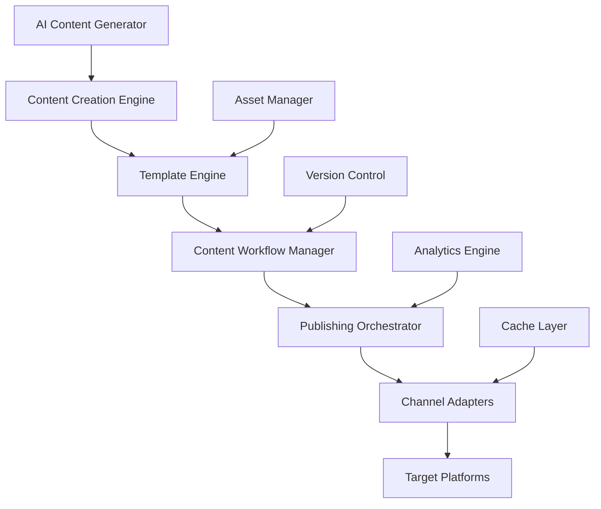

The Content Publishing Service provides enterprise-grade content management and publishing capabilities for automated content creation, multi-channel distribution, and workflow management.

## Service Overview

The Content Publishing Service orchestrates the complete content lifecycle from creation through publication across multiple channels. It supports automated content generation, template-based publishing, workflow management, and real-time content synchronization across platforms.

### Key Capabilities

- **Multi-Channel Publishing**: Simultaneous publishing to websites, social media, email, mobile apps, and APIs
- **Template Engine**: Advanced templating with dynamic content generation and personalization
- **Content Workflows**: Approval workflows, scheduling, versioning, and collaboration tools
- **AI Content Generation**: Automated content creation using large language models
- **Real-time Sync**: Live content updates across all publishing channels
- **Content Analytics**: Performance tracking, engagement metrics, and optimization recommendations

## Architecture Design

### Core Components



### System Architecture

```kotlin
// Core service architecture
@Service
@Component("contentPublishingService")
class ContentPublishingService(
    private val contentEngine: ContentCreationEngine,
    private val templateEngine: TemplateEngine,
    private val workflowManager: ContentWorkflowManager,
    private val publishingOrchestrator: PublishingOrchestrator,
    private val channelManager: ChannelManager,
    private val analyticsEngine: ContentAnalyticsEngine,
    private val versionManager: ContentVersionManager
) {
    
    suspend fun createContent(request: ContentCreationRequest): ContentResponse {
        // Validate content request
        validateContentRequest(request)
        
        // Create content instance
        val content = Content(
            id = UUID.randomUUID().toString(),
            title = request.title,
            type = request.type,
            metadata = request.metadata,
            status = ContentStatus.DRAFT
        )
        
        // Generate content using AI if requested
        if (request.useAI) {
            val generatedContent = contentEngine.generateContent(request)
            content.body = generatedContent.body
            content.metadata = content.metadata + generatedContent.metadata
        }
        
        // Apply template if specified
        if (request.templateId != null) {
            val template = templateEngine.getTemplate(request.templateId)
            content.body = templateEngine.applyTemplate(template, content)
        }
        
        // Save content
        contentRepository.save(content)
        
        return ContentResponse(
            contentId = content.id,
            status = content.status,
            createdAt = content.createdAt
        )
    }
}
```

## API Specifications

### REST API Endpoints

#### Content Management

```yaml
# OpenAPI Specification
openapi: 3.0.3
info:
  title: Content Publishing Service API
  version: 1.0.0
  description: Enterprise content management and multi-channel publishing service

paths:
  /api/v1/content:
    post:
      summary: Create content
      operationId: createContent
      requestBody:
        required: true
        content:
          application/json:
            schema:
              $ref: '#/components/schemas/ContentCreationRequest'
      responses:
        '201':
          description: Content created
          content:
            application/json:
              schema:
                $ref: '#/components/schemas/ContentResponse'
        '400':
          description: Invalid content request
        '429':
          description: Content creation quota exceeded

    get:
      summary: List content
      parameters:
        - name: status
          in: query
          schema:
            type: string
            enum: [draft, review, approved, published, archived]
        - name: type
          in: query
          schema:
            type: string
            enum: [article, blog_post, social_post, email, page, product_description]
        - name: author_id
          in: query
          schema:
            type: string
        - name: tag
          in: query
          schema:
            type: array
            items:
              type: string
        - name: created_after
          in: query
          schema:
            type: string
            format: date-time
        - name: limit
          in: query
          schema:
            type: integer
            default: 50
        - name: offset
          in: query
          schema:
            type: integer
            default: 0
      responses:
        '200':
          description: List of content
          content:
            application/json:
              schema:
                $ref: '#/components/schemas/ContentList'

  /api/v1/content/{contentId}:
    get:
      summary: Get content details
      parameters:
        - name: contentId
          in: path
          required: true
          schema:
            type: string
        - name: version
          in: query
          schema:
            type: string
            description: "Specific version to retrieve"
      responses:
        '200':
          description: Content details
          content:
            application/json:
              schema:
                $ref: '#/components/schemas/Content'
        '404':
          description: Content not found

    put:
      summary: Update content
      parameters:
        - name: contentId
          in: path
          required: true
          schema:
            type: string
      requestBody:
        required: true
        content:
          application/json:
            schema:
              $ref: '#/components/schemas/ContentUpdateRequest'
      responses:
        '200':
          description: Content updated
          content:
            application/json:
              schema:
                $ref: '#/components/schemas/Content'
        '404':
          description: Content not found
        '409':
          description: Content is locked for editing

    delete:
      summary: Delete content
      parameters:
        - name: contentId
          in: path
          required: true
          schema:
            type: string
      responses:
        '204':
          description: Content deleted
        '404':
          description: Content not found
        '409':
          description: Cannot delete published content

  /api/v1/content/{contentId}/versions:
    get:
      summary: List content versions
      parameters:
        - name: contentId
          in: path
          required: true
          schema:
            type: string
      responses:
        '200':
          description: Content versions
          content:
            application/json:
              schema:
                $ref: '#/components/schemas/ContentVersionList'

    post:
      summary: Create new content version
      parameters:
        - name: contentId
          in: path
          required: true
          schema:
            type: string
      requestBody:
        required: true
        content:
          application/json:
            schema:
              $ref: '#/components/schemas/ContentVersionRequest'
      responses:
        '201':
          description: Version created
          content:
            application/json:
              schema:
                $ref: '#/components/schemas/ContentVersion'

  /api/v1/content/{contentId}/publish:
    post:
      summary: Publish content to channels
      parameters:
        - name: contentId
          in: path
          required: true
          schema:
            type: string
      requestBody:
        required: true
        content:
          application/json:
            schema:
              $ref: '#/components/schemas/PublishRequest'
      responses:
        '202':
          description: Publishing initiated
          content:
            application/json:
              schema:
                $ref: '#/components/schemas/PublishResponse'
        '400':
          description: Content not ready for publishing
        '404':
          description: Content not found

  /api/v1/content/{contentId}/unpublish:
    post:
      summary: Unpublish content from channels
      parameters:
        - name: contentId
          in: path
          required: true
          schema:
            type: string
      requestBody:
        content:
          application/json:
            schema:
              $ref: '#/components/schemas/UnpublishRequest'
      responses:
        '202':
          description: Unpublishing initiated
          content:
            application/json:
              schema:
                $ref: '#/components/schemas/UnpublishResponse'

  /api/v1/templates:
    get:
      summary: List content templates
      parameters:
        - name: category
          in: query
          schema:
            type: string
        - name: type
          in: query
          schema:
            type: string
        - name: tag
          in: query
          schema:
            type: array
            items:
              type: string
      responses:
        '200':
          description: Content templates
          content:
            application/json:
              schema:
                $ref: '#/components/schemas/TemplateList'

    post:
      summary: Create content template
      requestBody:
        required: true
        content:
          application/json:
            schema:
              $ref: '#/components/schemas/TemplateCreationRequest'
      responses:
        '201':
          description: Template created
          content:
            application/json:
              schema:
                $ref: '#/components/schemas/Template'

  /api/v1/templates/{templateId}:
    get:
      summary: Get template details
      parameters:
        - name: templateId
          in: path
          required: true
          schema:
            type: string
      responses:
        '200':
          description: Template details
          content:
            application/json:
              schema:
                $ref: '#/components/schemas/Template'
        '404':
          description: Template not found

    put:
      summary: Update template
      parameters:
        - name: templateId
          in: path
          required: true
          schema:
            type: string
      requestBody:
        required: true
        content:
          application/json:
            schema:
              $ref: '#/components/schemas/TemplateUpdateRequest'
      responses:
        '200':
          description: Template updated
          content:
            application/json:
              schema:
                $ref: '#/components/schemas/Template'

  /api/v1/templates/{templateId}/render:
    post:
      summary: Render template with data
      parameters:
        - name: templateId
          in: path
          required: true
          schema:
            type: string
      requestBody:
        required: true
        content:
          application/json:
            schema:
              $ref: '#/components/schemas/TemplateRenderRequest'
      responses:
        '200':
          description: Rendered content
          content:
            application/json:
              schema:
                $ref: '#/components/schemas/TemplateRenderResponse'
        '400':
          description: Template rendering failed

  /api/v1/workflows:
    get:
      summary: List content workflows
      parameters:
        - name: status
          in: query
          schema:
            type: string
            enum: [active, inactive, archived]
        - name: type
          in: query
          schema:
            type: string
      responses:
        '200':
          description: Content workflows
          content:
            application/json:
              schema:
                $ref: '#/components/schemas/WorkflowList'

    post:
      summary: Create content workflow
      requestBody:
        required: true
        content:
          application/json:
            schema:
              $ref: '#/components/schemas/WorkflowCreationRequest'
      responses:
        '201':
          description: Workflow created
          content:
            application/json:
              schema:
                $ref: '#/components/schemas/Workflow'

  /api/v1/workflows/{workflowId}/execute:
    post:
      summary: Execute workflow for content
      parameters:
        - name: workflowId
          in: path
          required: true
          schema:
            type: string
      requestBody:
        required: true
        content:
          application/json:
            schema:
              $ref: '#/components/schemas/WorkflowExecutionRequest'
      responses:
        '202':
          description: Workflow execution started
          content:
            application/json:
              schema:
                $ref: '#/components/schemas/WorkflowExecutionResponse'

  /api/v1/channels:
    get:
      summary: List publishing channels
      parameters:
        - name: type
          in: query
          schema:
            type: string
            enum: [web, social, email, mobile, api]
        - name: status
          in: query
          schema:
            type: string
            enum: [active, inactive, error]
      responses:
        '200':
          description: Publishing channels
          content:
            application/json:
              schema:
                $ref: '#/components/schemas/ChannelList'

    post:
      summary: Register publishing channel
      requestBody:
        required: true
        content:
          application/json:
            schema:
              $ref: '#/components/schemas/ChannelRegistrationRequest'
      responses:
        '201':
          description: Channel registered
          content:
            application/json:
              schema:
                $ref: '#/components/schemas/Channel'

  /api/v1/channels/{channelId}/test:
    post:
      summary: Test channel connectivity
      parameters:
        - name: channelId
          in: path
          required: true
          schema:
            type: string
      responses:
        '200':
          description: Channel test results
          content:
            application/json:
              schema:
                $ref: '#/components/schemas/ChannelTestResult'

  /api/v1/content/{contentId}/analytics:
    get:
      summary: Get content analytics
      parameters:
        - name: contentId
          in: path
          required: true
          schema:
            type: string
        - name: timeRange
          in: query
          schema:
            type: string
            enum: [1h, 24h, 7d, 30d, 90d]
            default: 7d
        - name: metrics
          in: query
          schema:
            type: array
            items:
              type: string
              enum: [views, engagement, clicks, shares, conversions]
      responses:
        '200':
          description: Content analytics
          content:
            application/json:
              schema:
                $ref: '#/components/schemas/ContentAnalytics'

  /api/v1/content/generate:
    post:
      summary: Generate content using AI
      requestBody:
        required: true
        content:
          application/json:
            schema:
              $ref: '#/components/schemas/AIContentGenerationRequest'
      responses:
        '200':
          description: Generated content
          content:
            application/json:
              schema:
                $ref: '#/components/schemas/AIContentGenerationResponse'
        '400':
          description: Invalid generation request
        '429':
          description: AI generation quota exceeded

components:
  schemas:
    ContentCreationRequest:
      type: object
      required:
        - title
        - type
      properties:
        title:
          type: string
          example: "Product Launch Announcement"
        type:
          type: string
          enum: [article, blog_post, social_post, email, page, product_description]
        body:
          type: string
        metadata:
          type: object
          additionalProperties: true
        template_id:
          type: string
        use_ai:
          type: boolean
          default: false
        ai_prompt:
          type: string
        target_audience:
          type: string
        tone:
          type: string
          enum: [professional, casual, friendly, formal, technical]
        tags:
          type: array
          items:
            type: string
        category:
          type: string
        author_id:
          type: string

    Content:
      type: object
      properties:
        id:
          type: string
          format: uuid
        title:
          type: string
        type:
          type: string
        body:
          type: string
        summary:
          type: string
        metadata:
          type: object
          additionalProperties: true
        status:
          type: string
          enum: [draft, review, approved, published, archived]
        version:
          type: string
        author_id:
          type: string
        tags:
          type: array
          items:
            type: string
        category:
          type: string
        created_at:
          type: string
          format: date-time
        updated_at:
          type: string
          format: date-time
        published_at:
          type: string
          format: date-time
        scheduled_at:
          type: string
          format: date-time
        analytics:
          $ref: '#/components/schemas/ContentAnalytics'

    Template:
      type: object
      properties:
        id:
          type: string
          format: uuid
        name:
          type: string
        category:
          type: string
        type:
          type: string
        template:
          type: string
          description: "Template content with placeholders"
        variables:
          type: array
          items:
            $ref: '#/components/schemas/TemplateVariable'
        metadata:
          type: object
        tags:
          type: array
          items:
            type: string
        created_at:
          type: string
          format: date-time
        updated_at:
          type: string
          format: date-time

    TemplateVariable:
      type: object
      properties:
        name:
          type: string
        type:
          type: string
          enum: [text, number, boolean, date, image, url]
        required:
          type: boolean
        default_value:
          type: string
        description:
          type: string
        validation:
          type: object

    PublishRequest:
      type: object
      required:
        - channels
      properties:
        channels:
          type: array
          items:
            type: string
          description: "Channel IDs to publish to"
        schedule_time:
          type: string
          format: date-time
          description: "Optional scheduled publish time"
        publish_options:
          type: object
          additionalProperties: true
          description: "Channel-specific publishing options"

    Channel:
      type: object
      properties:
        id:
          type: string
          format: uuid
        name:
          type: string
        type:
          type: string
          enum: [web, social, email, mobile, api]
        platform:
          type: string
          example: "wordpress, facebook, twitter, mailchimp"
        config:
          type: object
          description: "Channel-specific configuration"
        status:
          type: string
          enum: [active, inactive, error]
        capabilities:
          type: array
          items:
            type: string
            enum: [text, images, video, scheduling, analytics]
        rate_limits:
          type: object
          properties:
            requests_per_hour:
              type: integer
            requests_per_day:
              type: integer
        created_at:
          type: string
          format: date-time

    ContentAnalytics:
      type: object
      properties:
        content_id:
          type: string
        time_range:
          type: string
        metrics:
          type: object
          properties:
            views:
              type: integer
              format: int64
            unique_views:
              type: integer
              format: int64
            engagement_rate:
              type: number
              minimum: 0
              maximum: 1
            clicks:
              type: integer
              format: int64
            shares:
              type: integer
              format: int64
            comments:
              type: integer
              format: int64
            conversions:
              type: integer
              format: int64
            time_on_page:
              type: number
              description: "Average time in seconds"
        channel_breakdown:
          type: object
          additionalProperties:
            type: object
        demographics:
          type: object
        trends:
          type: array
          items:
            type: object
            properties:
              timestamp:
                type: string
                format: date-time
              metric:
                type: string
              value:
                type: number

    AIContentGenerationRequest:
      type: object
      required:
        - prompt
        - type
      properties:
        prompt:
          type: string
          example: "Write a blog post about sustainable energy solutions"
        type:
          type: string
          enum: [article, blog_post, social_post, email, product_description]
        tone:
          type: string
          enum: [professional, casual, friendly, formal, technical]
          default: professional
        length:
          type: string
          enum: [short, medium, long]
          default: medium
        target_audience:
          type: string
        keywords:
          type: array
          items:
            type: string
        language:
          type: string
          default: "en"
        temperature:
          type: number
          minimum: 0
          maximum: 2
          default: 0.7
        max_tokens:
          type: integer
          minimum: 1
          maximum: 4000
          default: 1000

  securitySchemes:
    BearerAuth:
      type: http
      scheme: bearer
      bearerFormat: JWT
    ApiKeyAuth:
      type: apiKey
      in: header
      name: X-API-Key

security:
  - BearerAuth: []
  - ApiKeyAuth: []
```

### GraphQL API

```graphql
# GraphQL schema for content publishing
type Query {
  content(
    filter: ContentFilter
    sort: ContentSort
    pagination: PaginationInput
  ): ContentConnection!
  
  contentById(id: ID!): Content
  
  templates(
    filter: TemplateFilter
    pagination: PaginationInput
  ): TemplateConnection!
  
  template(id: ID!): Template
  
  workflows(
    filter: WorkflowFilter
    pagination: PaginationInput
  ): WorkflowConnection!
  
  channels(
    filter: ChannelFilter
    pagination: PaginationInput
  ): ChannelConnection!
  
  contentAnalytics(
    contentId: ID!
    timeRange: TimeRange!
    metrics: [AnalyticsMetric!]
  ): ContentAnalytics!
}

type Mutation {
  createContent(input: ContentInput!): ContentPayload!
  updateContent(id: ID!, input: ContentUpdateInput!): ContentPayload!
  deleteContent(id: ID!): DeletePayload!
  
  publishContent(id: ID!, input: PublishInput!): PublishPayload!
  unpublishContent(id: ID!, input: UnpublishInput!): UnpublishPayload!
  
  createTemplate(input: TemplateInput!): TemplatePayload!
  updateTemplate(id: ID!, input: TemplateUpdateInput!): TemplatePayload!
  
  renderTemplate(id: ID!, variables: JSON!): TemplateRenderPayload!
  
  createWorkflow(input: WorkflowInput!): WorkflowPayload!
  executeWorkflow(id: ID!, input: WorkflowExecutionInput!): WorkflowExecutionPayload!
  
  registerChannel(input: ChannelInput!): ChannelPayload!
  testChannel(id: ID!): ChannelTestPayload!
  
  generateContent(input: AIContentGenerationInput!): AIContentGenerationPayload!
}

type Subscription {
  contentUpdates(contentId: ID): ContentUpdate!
  publishingProgress(contentId: ID!): PublishingProgress!
  workflowProgress(workflowId: ID!): WorkflowProgress!
  analyticsUpdates(contentId: ID!): AnalyticsUpdate!
}

# Core types
type Content {
  id: ID!
  title: String!
  type: ContentType!
  body: String
  summary: String
  metadata: JSON
  status: ContentStatus!
  version: String!
  author: User!
  tags: [String!]!
  category: String
  template: Template
  workflows: [WorkflowExecution!]!
  publications: [Publication!]!
  analytics: ContentAnalytics
  createdAt: DateTime!
  updatedAt: DateTime!
  publishedAt: DateTime
  scheduledAt: DateTime
}

enum ContentType {
  ARTICLE
  BLOG_POST
  SOCIAL_POST
  EMAIL
  PAGE
  PRODUCT_DESCRIPTION
}

enum ContentStatus {
  DRAFT
  REVIEW
  APPROVED
  PUBLISHED
  ARCHIVED
}

type Template {
  id: ID!
  name: String!
  category: String!
  type: ContentType!
  template: String!
  variables: [TemplateVariable!]!
  metadata: JSON
  tags: [String!]!
  usage: TemplateUsage!
  createdAt: DateTime!
  updatedAt: DateTime!
}

type Channel {
  id: ID!
  name: String!
  type: ChannelType!
  platform: String!
  config: JSON!
  status: ChannelStatus!
  capabilities: [ChannelCapability!]!
  rateLimits: RateLimits!
  publications: [Publication!]!
  analytics: ChannelAnalytics!
  createdAt: DateTime!
}

enum ChannelType {
  WEB
  SOCIAL
  EMAIL
  MOBILE
  API
}

# Custom scalars
scalar DateTime
scalar JSON
```

### gRPC Service Definition

```protobuf
// content_publishing.proto
syntax = "proto3";

package aimatrix.content.v1;

import "google/protobuf/timestamp.proto";
import "google/protobuf/struct.proto";
import "google/protobuf/empty.proto";

// Content Publishing Service
service ContentPublishingService {
  // Content management
  rpc CreateContent(CreateContentRequest) returns (CreateContentResponse);
  rpc GetContent(GetContentRequest) returns (Content);
  rpc ListContent(ListContentRequest) returns (ListContentResponse);
  rpc UpdateContent(UpdateContentRequest) returns (Content);
  rpc DeleteContent(DeleteContentRequest) returns (google.protobuf.Empty);
  
  // Publishing operations
  rpc PublishContent(PublishContentRequest) returns (PublishContentResponse);
  rpc UnpublishContent(UnpublishContentRequest) returns (UnpublishContentResponse);
  rpc GetPublicationStatus(GetPublicationStatusRequest) returns (PublicationStatus);
  
  // Template management
  rpc CreateTemplate(CreateTemplateRequest) returns (Template);
  rpc GetTemplate(GetTemplateRequest) returns (Template);
  rpc RenderTemplate(RenderTemplateRequest) returns (RenderTemplateResponse);
  
  // AI content generation
  rpc GenerateContent(GenerateContentRequest) returns (GenerateContentResponse);
}

// Channel Management Service
service ChannelService {
  rpc RegisterChannel(RegisterChannelRequest) returns (Channel);
  rpc ListChannels(ListChannelsRequest) returns (ListChannelsResponse);
  rpc TestChannel(TestChannelRequest) returns (ChannelTestResult);
}

// Analytics Service
service ContentAnalyticsService {
  rpc GetContentAnalytics(GetContentAnalyticsRequest) returns (ContentAnalytics);
  rpc StreamAnalytics(StreamAnalyticsRequest) returns (stream AnalyticsUpdate);
}

// Request/Response Messages
message CreateContentRequest {
  string title = 1;
  ContentType type = 2;
  string body = 3;
  google.protobuf.Struct metadata = 4;
  string template_id = 5;
  bool use_ai = 6;
  string ai_prompt = 7;
  repeated string tags = 8;
  string category = 9;
  string author_id = 10;
}

message CreateContentResponse {
  string content_id = 1;
  ContentStatus status = 2;
  google.protobuf.Timestamp created_at = 3;
}

message Content {
  string id = 1;
  string title = 2;
  ContentType type = 3;
  string body = 4;
  string summary = 5;
  google.protobuf.Struct metadata = 6;
  ContentStatus status = 7;
  string version = 8;
  string author_id = 9;
  repeated string tags = 10;
  string category = 11;
  google.protobuf.Timestamp created_at = 12;
  google.protobuf.Timestamp updated_at = 13;
  google.protobuf.Timestamp published_at = 14;
  google.protobuf.Timestamp scheduled_at = 15;
}

message PublishContentRequest {
  string content_id = 1;
  repeated string channel_ids = 2;
  google.protobuf.Timestamp schedule_time = 3;
  google.protobuf.Struct publish_options = 4;
}

message Template {
  string id = 1;
  string name = 2;
  string category = 3;
  ContentType type = 4;
  string template = 5;
  repeated TemplateVariable variables = 6;
  google.protobuf.Struct metadata = 7;
  repeated string tags = 8;
  google.protobuf.Timestamp created_at = 9;
  google.protobuf.Timestamp updated_at = 10;
}

message Channel {
  string id = 1;
  string name = 2;
  ChannelType type = 3;
  string platform = 4;
  google.protobuf.Struct config = 5;
  ChannelStatus status = 6;
  repeated ChannelCapability capabilities = 7;
  google.protobuf.Timestamp created_at = 8;
}

// Enums
enum ContentType {
  CONTENT_TYPE_UNSPECIFIED = 0;
  CONTENT_TYPE_ARTICLE = 1;
  CONTENT_TYPE_BLOG_POST = 2;
  CONTENT_TYPE_SOCIAL_POST = 3;
  CONTENT_TYPE_EMAIL = 4;
  CONTENT_TYPE_PAGE = 5;
  CONTENT_TYPE_PRODUCT_DESCRIPTION = 6;
}

enum ContentStatus {
  CONTENT_STATUS_UNSPECIFIED = 0;
  CONTENT_STATUS_DRAFT = 1;
  CONTENT_STATUS_REVIEW = 2;
  CONTENT_STATUS_APPROVED = 3;
  CONTENT_STATUS_PUBLISHED = 4;
  CONTENT_STATUS_ARCHIVED = 5;
}

enum ChannelType {
  CHANNEL_TYPE_UNSPECIFIED = 0;
  CHANNEL_TYPE_WEB = 1;
  CHANNEL_TYPE_SOCIAL = 2;
  CHANNEL_TYPE_EMAIL = 3;
  CHANNEL_TYPE_MOBILE = 4;
  CHANNEL_TYPE_API = 5;
}

enum ChannelStatus {
  CHANNEL_STATUS_UNSPECIFIED = 0;
  CHANNEL_STATUS_ACTIVE = 1;
  CHANNEL_STATUS_INACTIVE = 2;
  CHANNEL_STATUS_ERROR = 3;
}

enum ChannelCapability {
  CHANNEL_CAPABILITY_UNSPECIFIED = 0;
  CHANNEL_CAPABILITY_TEXT = 1;
  CHANNEL_CAPABILITY_IMAGES = 2;
  CHANNEL_CAPABILITY_VIDEO = 3;
  CHANNEL_CAPABILITY_SCHEDULING = 4;
  CHANNEL_CAPABILITY_ANALYTICS = 5;
}
```

## Implementation Examples

### Kotlin/Spring Boot Service Implementation

```kotlin
// Main service implementation
@Service
@Transactional
@Component("contentPublishingService")
class ContentPublishingServiceImpl(
    private val contentRepository: ContentRepository,
    private val templateEngine: TemplateEngine,
    private val workflowManager: ContentWorkflowManager,
    private val publishingOrchestrator: PublishingOrchestrator,
    private val channelManager: ChannelManager,
    private val aiContentGenerator: AIContentGenerator,
    private val versionManager: ContentVersionManager,
    private val analyticsEngine: ContentAnalyticsEngine,
    private val assetManager: AssetManager
) : ContentPublishingService {

    private val logger = LoggerFactory.getLogger(ContentPublishingServiceImpl::class.java)

    @Async
    override suspend fun createContent(request: ContentCreationRequest): ContentResponse {
        logger.info("Creating content: ${request.title}")
        
        // Validate request
        validateContentRequest(request)
        
        // Create content entity
        val content = ContentEntity(
            id = UUID.randomUUID().toString(),
            title = request.title,
            type = request.type,
            body = request.body,
            metadata = request.metadata,
            status = ContentStatus.DRAFT,
            authorId = request.authorId,
            tags = request.tags,
            category = request.category,
            createdAt = Instant.now()
        )
        
        try {
            // Generate AI content if requested
            if (request.useAI && request.aiPrompt != null) {
                val generatedContent = aiContentGenerator.generateContent(
                    AIContentGenerationRequest(
                        prompt = request.aiPrompt,
                        type = request.type,
                        tone = request.tone,
                        targetAudience = request.targetAudience,
                        keywords = request.keywords
                    )
                )
                content.body = generatedContent.content
                content.summary = generatedContent.summary
                content.metadata = content.metadata + generatedContent.metadata
            }
            
            // Apply template if specified
            if (request.templateId != null) {
                val template = templateEngine.getTemplate(request.templateId)
                val templateData = buildTemplateData(content, request)
                val renderedContent = templateEngine.render(template, templateData)
                
                content.body = renderedContent.body
                content.summary = renderedContent.summary
                content.metadata = content.metadata + renderedContent.metadata
            }
            
            // Process and store assets (images, videos, etc.)
            if (content.metadata.containsKey("assets")) {
                val processedAssets = assetManager.processAssets(content.metadata["assets"] as List<*>)
                content.metadata = content.metadata + mapOf("processed_assets" to processedAssets)
            }
            
            // Create initial version
            val version = versionManager.createVersion(content)
            content.version = version.versionNumber
            
            // Save content
            contentRepository.save(content)
            
            // Start workflow if configured
            if (request.workflowId != null) {
                workflowManager.startWorkflow(request.workflowId, content.id)
            }
            
            logger.info("Content created successfully: ${content.id}")
            
            return ContentResponse(
                contentId = content.id,
                status = content.status,
                version = content.version,
                createdAt = content.createdAt
            )
            
        } catch (e: Exception) {
            logger.error("Failed to create content: ${request.title}", e)
            throw ContentCreationException("Failed to create content", e)
        }
    }

    override suspend fun publishContent(
        contentId: String,
        request: PublishRequest
    ): PublishResponse {
        val content = contentRepository.findById(contentId)
            ?: throw ContentNotFoundException(contentId)
        
        if (content.status != ContentStatus.APPROVED) {
            throw IllegalStateException("Content must be approved before publishing")
        }
        
        logger.info("Publishing content: $contentId to ${request.channels.size} channels")
        
        try {
            // Create publication job
            val publicationJob = PublicationJob(
                id = UUID.randomUUID().toString(),
                contentId = contentId,
                channels = request.channels,
                scheduledAt = request.scheduleTime,
                status = PublicationStatus.PENDING,
                createdAt = Instant.now()
            )
            
            // Schedule publication
            val publications = if (request.scheduleTime != null) {
                publishingOrchestrator.schedulePublication(publicationJob)
            } else {
                publishingOrchestrator.publishImmediately(publicationJob)
            }
            
            // Update content status
            content.status = if (request.scheduleTime != null) ContentStatus.SCHEDULED else ContentStatus.PUBLISHED
            content.publishedAt = if (request.scheduleTime == null) Instant.now() else null
            content.scheduledAt = request.scheduleTime
            content.updatedAt = Instant.now()
            
            contentRepository.save(content)
            
            return PublishResponse(
                publicationJobId = publicationJob.id,
                publications = publications,
                status = publicationJob.status,
                scheduledAt = request.scheduleTime
            )
            
        } catch (e: Exception) {
            logger.error("Failed to publish content: $contentId", e)
            throw PublishingException("Failed to publish content", e)
        }
    }

    override suspend fun generateContent(request: AIContentGenerationRequest): AIContentGenerationResponse {
        logger.info("Generating AI content: ${request.type}")
        
        try {
            // Validate generation request
            validateAIGenerationRequest(request)
            
            // Generate content using AI service
            val generatedContent = aiContentGenerator.generateContent(request)
            
            // Post-process generated content
            val processedContent = postProcessGeneratedContent(generatedContent, request)
            
            return AIContentGenerationResponse(
                content = processedContent.content,
                summary = processedContent.summary,
                metadata = processedContent.metadata,
                confidence = processedContent.confidence,
                generatedAt = Instant.now()
            )
            
        } catch (e: Exception) {
            logger.error("Failed to generate AI content", e)
            throw AIGenerationException("Failed to generate content", e)
        }
    }

    override suspend fun getContentAnalytics(
        contentId: String,
        timeRange: TimeRange,
        metrics: List<AnalyticsMetric>
    ): ContentAnalytics {
        val content = contentRepository.findById(contentId)
            ?: throw ContentNotFoundException(contentId)
        
        return analyticsEngine.getAnalytics(contentId, timeRange, metrics)
    }

    private fun validateContentRequest(request: ContentCreationRequest) {
        if (request.title.isBlank()) {
            throw ValidationException("Content title cannot be blank")
        }
        
        if (request.useAI && request.aiPrompt.isNullOrBlank()) {
            throw ValidationException("AI prompt is required when using AI generation")
        }
        
        if (request.templateId != null && !templateEngine.templateExists(request.templateId)) {
            throw ValidationException("Template not found: ${request.templateId}")
        }
    }

    private fun buildTemplateData(content: ContentEntity, request: ContentCreationRequest): Map<String, Any> {
        return mapOf(
            "title" to content.title,
            "body" to (content.body ?: ""),
            "metadata" to content.metadata,
            "tags" to content.tags,
            "category" to (content.category ?: ""),
            "author_id" to content.authorId,
            "created_at" to content.createdAt,
            "custom_data" to (request.templateData ?: emptyMap())
        )
    }
}

// Template engine implementation
@Component
class TemplateEngine(
    private val templateRepository: TemplateRepository,
    private val mustacheFactory: MustacheFactory,
    private val velocityEngine: VelocityEngine,
    private val freemarkerConfiguration: Configuration
) {
    
    suspend fun render(template: TemplateEntity, data: Map<String, Any>): RenderedContent {
        return when (template.engine) {
            TemplateEngine.MUSTACHE -> renderMustache(template, data)
            TemplateEngine.VELOCITY -> renderVelocity(template, data)
            TemplateEngine.FREEMARKER -> renderFreemarker(template, data)
            TemplateEngine.CUSTOM -> renderCustom(template, data)
        }
    }
    
    private suspend fun renderMustache(template: TemplateEntity, data: Map<String, Any>): RenderedContent {
        val mustache = mustacheFactory.compile(StringReader(template.template), template.id)
        val writer = StringWriter()
        mustache.execute(writer, data)
        
        return RenderedContent(
            body = writer.toString(),
            summary = extractSummary(writer.toString()),
            metadata = extractMetadata(data)
        )
    }
    
    private suspend fun renderVelocity(template: TemplateEntity, data: Map<String, Any>): RenderedContent {
        val context = VelocityContext()
        data.forEach { (key, value) -> context.put(key, value) }
        
        val writer = StringWriter()
        velocityEngine.evaluate(context, writer, template.id, template.template)
        
        return RenderedContent(
            body = writer.toString(),
            summary = extractSummary(writer.toString()),
            metadata = extractMetadata(data)
        )
    }
    
    private suspend fun renderFreemarker(template: TemplateEntity, data: Map<String, Any>): RenderedContent {
        val freemarkerTemplate = freemarkerConfiguration.getTemplate(template.id)
        val writer = StringWriter()
        freemarkerTemplate.process(data, writer)
        
        return RenderedContent(
            body = writer.toString(),
            summary = extractSummary(writer.toString()),
            metadata = extractMetadata(data)
        )
    }
    
    fun validateTemplate(template: String, engine: TemplateEngine): ValidationResult {
        return try {
            when (engine) {
                TemplateEngine.MUSTACHE -> {
                    mustacheFactory.compile(StringReader(template), "validation")
                    ValidationResult.success()
                }
                TemplateEngine.VELOCITY -> {
                    velocityEngine.evaluate(VelocityContext(), StringWriter(), "validation", template)
                    ValidationResult.success()
                }
                TemplateEngine.FREEMARKER -> {
                    Template("validation", StringReader(template), freemarkerConfiguration)
                    ValidationResult.success()
                }
                else -> ValidationResult.success()
            }
        } catch (e: Exception) {
            ValidationResult.failure(e.message ?: "Template validation failed")
        }
    }
    
    private fun extractSummary(content: String): String {
        // Extract first paragraph or first 200 characters
        val firstParagraph = content.split("\n\n").first()
        return if (firstParagraph.length > 200) {
            firstParagraph.substring(0, 200) + "..."
        } else {
            firstParagraph
        }
    }
    
    private fun extractMetadata(data: Map<String, Any>): Map<String, Any> {
        return data.filterKeys { key ->
            key.startsWith("meta_") || key == "seo_data" || key == "social_data"
        }
    }
}

// AI content generator
@Component
class AIContentGenerator(
    private val openAIService: OpenAIService,
    private val anthropicService: AnthropicService,
    private val contentEnhancer: ContentEnhancer
) {
    
    suspend fun generateContent(request: AIContentGenerationRequest): GeneratedContent {
        val prompt = buildPrompt(request)
        
        val generatedText = when (request.model) {
            AIModel.GPT4 -> openAIService.generateText(prompt, request.maxTokens, request.temperature)
            AIModel.CLAUDE -> anthropicService.generateText(prompt, request.maxTokens, request.temperature)
            else -> openAIService.generateText(prompt, request.maxTokens, request.temperature)
        }
        
        // Post-process and enhance content
        val enhancedContent = contentEnhancer.enhance(generatedText, request)
        
        return GeneratedContent(
            content = enhancedContent.content,
            summary = enhancedContent.summary,
            metadata = mapOf(
                "generated_at" to Instant.now(),
                "model" to request.model,
                "prompt" to prompt,
                "word_count" to countWords(enhancedContent.content),
                "reading_time" to estimateReadingTime(enhancedContent.content),
                "keywords" to extractKeywords(enhancedContent.content)
            ),
            confidence = enhancedContent.confidence
        )
    }
    
    private fun buildPrompt(request: AIContentGenerationRequest): String {
        val promptBuilder = StringBuilder()
        
        promptBuilder.append("Create ${request.type.displayName} content with the following requirements:\n\n")
        promptBuilder.append("Topic: ${request.prompt}\n")
        
        if (request.tone != null) {
            promptBuilder.append("Tone: ${request.tone}\n")
        }
        
        if (request.targetAudience != null) {
            promptBuilder.append("Target Audience: ${request.targetAudience}\n")
        }
        
        if (request.keywords.isNotEmpty()) {
            promptBuilder.append("Keywords to include: ${request.keywords.joinToString(", ")}\n")
        }
        
        when (request.length) {
            ContentLength.SHORT -> promptBuilder.append("Length: Short (200-400 words)\n")
            ContentLength.MEDIUM -> promptBuilder.append("Length: Medium (400-800 words)\n")
            ContentLength.LONG -> promptBuilder.append("Length: Long (800+ words)\n")
        }
        
        promptBuilder.append("\nPlease create engaging, well-structured content that meets these requirements.")
        
        return promptBuilder.toString()
    }
}

// Publishing orchestrator
@Component
class PublishingOrchestrator(
    private val channelManager: ChannelManager,
    private val publicationRepository: PublicationRepository,
    private val schedulingService: SchedulingService,
    private val notificationService: NotificationService
) {
    
    suspend fun publishImmediately(job: PublicationJob): List<Publication> {
        val publications = mutableListOf<Publication>()
        
        job.channels.forEach { channelId ->
            try {
                val channel = channelManager.getChannel(channelId)
                val publication = publishToChannel(job.contentId, channel)
                publications.add(publication)
                
                logger.info("Successfully published content ${job.contentId} to channel $channelId")
                
            } catch (e: Exception) {
                logger.error("Failed to publish content ${job.contentId} to channel $channelId", e)
                
                val failedPublication = Publication(
                    id = UUID.randomUUID().toString(),
                    contentId = job.contentId,
                    channelId = channelId,
                    status = PublicationStatus.FAILED,
                    errorMessage = e.message,
                    createdAt = Instant.now()
                )
                publications.add(failedPublication)
            }
        }
        
        // Update job status
        val overallStatus = if (publications.all { it.status == PublicationStatus.PUBLISHED }) {
            PublicationStatus.COMPLETED
        } else if (publications.any { it.status == PublicationStatus.PUBLISHED }) {
            PublicationStatus.PARTIALLY_COMPLETED
        } else {
            PublicationStatus.FAILED
        }
        
        job.status = overallStatus
        job.completedAt = Instant.now()
        
        // Send notifications
        notificationService.sendPublicationNotification(job, publications)
        
        return publications
    }
    
    suspend fun schedulePublication(job: PublicationJob): List<Publication> {
        val scheduledPublications = job.channels.map { channelId ->
            Publication(
                id = UUID.randomUUID().toString(),
                contentId = job.contentId,
                channelId = channelId,
                status = PublicationStatus.SCHEDULED,
                scheduledAt = job.scheduledAt,
                createdAt = Instant.now()
            )
        }
        
        // Save scheduled publications
        publicationRepository.saveAll(scheduledPublications)
        
        // Schedule the actual publication
        schedulingService.scheduleJob(
            jobId = job.id,
            executeAt = job.scheduledAt!!,
            task = { publishImmediately(job) }
        )
        
        return scheduledPublications
    }
    
    private suspend fun publishToChannel(contentId: String, channel: ChannelEntity): Publication {
        val content = contentRepository.findById(contentId)
            ?: throw ContentNotFoundException(contentId)
        
        val adapter = channelManager.getChannelAdapter(channel.type)
        val publishResult = adapter.publish(content, channel)
        
        return Publication(
            id = UUID.randomUUID().toString(),
            contentId = contentId,
            channelId = channel.id,
            status = PublicationStatus.PUBLISHED,
            externalId = publishResult.externalId,
            externalUrl = publishResult.externalUrl,
            publishedAt = Instant.now(),
            createdAt = Instant.now(),
            metadata = publishResult.metadata
        )
    }
}
```

## Database Schema & Models

### PostgreSQL Schema

```sql
-- Content table
CREATE TABLE content (
    id UUID PRIMARY KEY DEFAULT gen_random_uuid(),
    title VARCHAR(500) NOT NULL,
    type VARCHAR(50) NOT NULL,
    body TEXT,
    summary TEXT,
    metadata JSONB DEFAULT '{}'::jsonb,
    status VARCHAR(50) NOT NULL DEFAULT 'draft',
    version VARCHAR(50) NOT NULL DEFAULT '1.0',
    
    -- Author and attribution
    author_id UUID NOT NULL,
    created_by UUID NOT NULL,
    updated_by UUID,
    
    -- Categorization
    category VARCHAR(100),
    tags TEXT[] DEFAULT '{}',
    
    -- Timestamps
    created_at TIMESTAMP WITH TIME ZONE DEFAULT NOW(),
    updated_at TIMESTAMP WITH TIME ZONE DEFAULT NOW(),
    published_at TIMESTAMP WITH TIME ZONE,
    scheduled_at TIMESTAMP WITH TIME ZONE,
    archived_at TIMESTAMP WITH TIME ZONE,
    
    -- Template and workflow
    template_id UUID,
    workflow_id UUID,
    
    -- SEO and social
    seo_data JSONB DEFAULT '{}'::jsonb,
    social_data JSONB DEFAULT '{}'::jsonb,
    
    -- Full-text search
    search_vector tsvector,
    
    -- Constraints
    CONSTRAINT content_type_check CHECK (
        type IN ('article', 'blog_post', 'social_post', 'email', 'page', 'product_description')
    ),
    CONSTRAINT content_status_check CHECK (
        status IN ('draft', 'review', 'approved', 'published', 'archived', 'scheduled')
    )
);

-- Indexes
CREATE INDEX idx_content_author ON content(author_id);
CREATE INDEX idx_content_status ON content(status);
CREATE INDEX idx_content_type ON content(type);
CREATE INDEX idx_content_category ON content(category);
CREATE INDEX idx_content_created ON content(created_at DESC);
CREATE INDEX idx_content_published ON content(published_at DESC);
CREATE INDEX idx_content_tags ON content USING GIN(tags);
CREATE INDEX idx_content_metadata ON content USING GIN(metadata);
CREATE INDEX idx_content_search ON content USING GIN(search_vector);

-- Full-text search trigger
CREATE OR REPLACE FUNCTION update_content_search_vector()
RETURNS TRIGGER AS $$
BEGIN
    NEW.search_vector := 
        setweight(to_tsvector('english', coalesce(NEW.title, '')), 'A') ||
        setweight(to_tsvector('english', coalesce(NEW.summary, '')), 'B') ||
        setweight(to_tsvector('english', coalesce(NEW.body, '')), 'C') ||
        setweight(to_tsvector('english', array_to_string(NEW.tags, ' ')), 'D');
    RETURN NEW;
END;
$$ LANGUAGE plpgsql;

CREATE TRIGGER trigger_update_content_search_vector
    BEFORE INSERT OR UPDATE ON content
    FOR EACH ROW EXECUTE FUNCTION update_content_search_vector();

-- Content versions table
CREATE TABLE content_versions (
    id UUID PRIMARY KEY DEFAULT gen_random_uuid(),
    content_id UUID NOT NULL REFERENCES content(id) ON DELETE CASCADE,
    version_number VARCHAR(50) NOT NULL,
    
    -- Snapshot of content at this version
    title VARCHAR(500) NOT NULL,
    body TEXT,
    summary TEXT,
    metadata JSONB DEFAULT '{}'::jsonb,
    
    -- Version metadata
    change_description TEXT,
    created_by UUID NOT NULL,
    created_at TIMESTAMP WITH TIME ZONE DEFAULT NOW(),
    
    -- Unique version per content
    UNIQUE(content_id, version_number)
);

-- Templates table
CREATE TABLE templates (
    id UUID PRIMARY KEY DEFAULT gen_random_uuid(),
    name VARCHAR(255) NOT NULL,
    category VARCHAR(100) NOT NULL,
    type VARCHAR(50) NOT NULL,
    
    -- Template content
    template TEXT NOT NULL,
    template_engine VARCHAR(50) DEFAULT 'mustache',
    
    -- Template variables definition
    variables JSONB DEFAULT '[]'::jsonb,
    
    -- Metadata
    metadata JSONB DEFAULT '{}'::jsonb,
    description TEXT,
    tags TEXT[] DEFAULT '{}',
    
    -- Usage tracking
    usage_count INTEGER DEFAULT 0,
    last_used_at TIMESTAMP WITH TIME ZONE,
    
    -- Status
    status VARCHAR(50) DEFAULT 'active',
    
    -- Timestamps
    created_at TIMESTAMP WITH TIME ZONE DEFAULT NOW(),
    updated_at TIMESTAMP WITH TIME ZONE DEFAULT NOW(),
    
    -- Constraints
    CONSTRAINT templates_type_check CHECK (
        type IN ('article', 'blog_post', 'social_post', 'email', 'page', 'product_description')
    ),
    CONSTRAINT templates_engine_check CHECK (
        template_engine IN ('mustache', 'velocity', 'freemarker', 'custom')
    ),
    CONSTRAINT templates_status_check CHECK (
        status IN ('active', 'inactive', 'archived')
    )
);

-- Indexes for templates
CREATE INDEX idx_templates_category ON templates(category);
CREATE INDEX idx_templates_type ON templates(type);
CREATE INDEX idx_templates_status ON templates(status);
CREATE INDEX idx_templates_tags ON templates USING GIN(tags);

-- Workflows table
CREATE TABLE workflows (
    id UUID PRIMARY KEY DEFAULT gen_random_uuid(),
    name VARCHAR(255) NOT NULL,
    description TEXT,
    
    -- Workflow definition
    workflow_definition JSONB NOT NULL,
    
    -- Settings
    auto_start BOOLEAN DEFAULT false,
    parallel_execution BOOLEAN DEFAULT false,
    
    -- Status
    status VARCHAR(50) DEFAULT 'active',
    
    -- Timestamps
    created_at TIMESTAMP WITH TIME ZONE DEFAULT NOW(),
    updated_at TIMESTAMP WITH TIME ZONE DEFAULT NOW(),
    
    -- Constraints
    CONSTRAINT workflows_status_check CHECK (
        status IN ('active', 'inactive', 'archived')
    )
);

-- Workflow executions table
CREATE TABLE workflow_executions (
    id UUID PRIMARY KEY DEFAULT gen_random_uuid(),
    workflow_id UUID NOT NULL REFERENCES workflows(id) ON DELETE CASCADE,
    content_id UUID NOT NULL REFERENCES content(id) ON DELETE CASCADE,
    
    -- Execution details
    status VARCHAR(50) NOT NULL DEFAULT 'pending',
    current_step VARCHAR(100),
    
    -- Execution data
    execution_data JSONB DEFAULT '{}'::jsonb,
    
    -- Timing
    started_at TIMESTAMP WITH TIME ZONE,
    completed_at TIMESTAMP WITH TIME ZONE,
    
    -- Results
    result JSONB,
    error_message TEXT,
    
    created_at TIMESTAMP WITH TIME ZONE DEFAULT NOW(),
    
    -- Constraints
    CONSTRAINT workflow_executions_status_check CHECK (
        status IN ('pending', 'running', 'completed', 'failed', 'cancelled')
    )
);

-- Publishing channels table
CREATE TABLE publishing_channels (
    id UUID PRIMARY KEY DEFAULT gen_random_uuid(),
    name VARCHAR(255) NOT NULL,
    type VARCHAR(50) NOT NULL,
    platform VARCHAR(100) NOT NULL,
    
    -- Channel configuration
    config JSONB NOT NULL,
    credentials JSONB,
    
    -- Capabilities
    capabilities TEXT[] DEFAULT '{}',
    
    -- Rate limiting
    rate_limit_config JSONB DEFAULT '{}'::jsonb,
    
    -- Status and health
    status VARCHAR(50) DEFAULT 'active',
    last_health_check TIMESTAMP WITH TIME ZONE,
    health_status VARCHAR(50) DEFAULT 'unknown',
    
    -- Timestamps
    created_at TIMESTAMP WITH TIME ZONE DEFAULT NOW(),
    updated_at TIMESTAMP WITH TIME ZONE DEFAULT NOW(),
    
    -- Constraints
    CONSTRAINT channels_type_check CHECK (
        type IN ('web', 'social', 'email', 'mobile', 'api')
    ),
    CONSTRAINT channels_status_check CHECK (
        status IN ('active', 'inactive', 'error')
    )
);

-- Publications table
CREATE TABLE publications (
    id UUID PRIMARY KEY DEFAULT gen_random_uuid(),
    content_id UUID NOT NULL REFERENCES content(id) ON DELETE CASCADE,
    channel_id UUID NOT NULL REFERENCES publishing_channels(id) ON DELETE CASCADE,
    
    -- Publication details
    status VARCHAR(50) NOT NULL DEFAULT 'pending',
    external_id VARCHAR(255),
    external_url VARCHAR(1000),
    
    -- Timing
    scheduled_at TIMESTAMP WITH TIME ZONE,
    published_at TIMESTAMP WITH TIME ZONE,
    
    -- Results
    metadata JSONB DEFAULT '{}'::jsonb,
    error_message TEXT,
    retry_count INTEGER DEFAULT 0,
    
    created_at TIMESTAMP WITH TIME ZONE DEFAULT NOW(),
    
    -- Constraints
    CONSTRAINT publications_status_check CHECK (
        status IN ('pending', 'scheduled', 'published', 'failed', 'cancelled')
    ),
    
    -- Unique publication per content-channel pair
    UNIQUE(content_id, channel_id)
);

-- Indexes for publications
CREATE INDEX idx_publications_content ON publications(content_id);
CREATE INDEX idx_publications_channel ON publications(channel_id);
CREATE INDEX idx_publications_status ON publications(status);
CREATE INDEX idx_publications_scheduled ON publications(scheduled_at);
CREATE INDEX idx_publications_published ON publications(published_at DESC);

-- Content analytics table (time-series data)
CREATE TABLE content_analytics (
    id BIGSERIAL PRIMARY KEY,
    content_id UUID NOT NULL REFERENCES content(id) ON DELETE CASCADE,
    channel_id UUID REFERENCES publishing_channels(id) ON DELETE SET NULL,
    
    -- Metric details
    metric_name VARCHAR(100) NOT NULL,
    metric_value BIGINT NOT NULL,
    
    -- Dimensions
    dimensions JSONB DEFAULT '{}'::jsonb,
    
    -- Time bucket (for aggregation)
    time_bucket TIMESTAMP WITH TIME ZONE NOT NULL,
    
    -- Timestamp
    recorded_at TIMESTAMP WITH TIME ZONE DEFAULT NOW()
);

-- Partitioning for analytics (by month)
CREATE TABLE content_analytics_y2024m01 PARTITION OF content_analytics
    FOR VALUES FROM ('2024-01-01') TO ('2024-02-01');

-- Continue partitioning...

-- Indexes for analytics
CREATE INDEX idx_content_analytics_content_time ON content_analytics(content_id, time_bucket DESC);
CREATE INDEX idx_content_analytics_metric ON content_analytics(metric_name);
CREATE INDEX idx_content_analytics_channel ON content_analytics(channel_id);

-- Asset management table
CREATE TABLE content_assets (
    id UUID PRIMARY KEY DEFAULT gen_random_uuid(),
    content_id UUID REFERENCES content(id) ON DELETE CASCADE,
    
    -- Asset details
    name VARCHAR(255) NOT NULL,
    type VARCHAR(50) NOT NULL,
    mime_type VARCHAR(100),
    size_bytes BIGINT,
    
    -- Storage
    storage_path VARCHAR(1000) NOT NULL,
    storage_provider VARCHAR(50) DEFAULT 's3',
    
    -- Image/video specific
    width INTEGER,
    height INTEGER,
    duration INTEGER,
    
    -- Processing
    processing_status VARCHAR(50) DEFAULT 'pending',
    processed_variants JSONB DEFAULT '[]'::jsonb,
    
    -- Metadata
    metadata JSONB DEFAULT '{}'::jsonb,
    alt_text VARCHAR(500),
    caption TEXT,
    
    -- Timestamps
    created_at TIMESTAMP WITH TIME ZONE DEFAULT NOW(),
    updated_at TIMESTAMP WITH TIME ZONE DEFAULT NOW(),
    
    -- Constraints
    CONSTRAINT assets_type_check CHECK (
        type IN ('image', 'video', 'audio', 'document', 'other')
    ),
    CONSTRAINT assets_processing_status_check CHECK (
        processing_status IN ('pending', 'processing', 'completed', 'failed')
    )
);

-- Indexes for assets
CREATE INDEX idx_assets_content ON content_assets(content_id);
CREATE INDEX idx_assets_type ON content_assets(type);
CREATE INDEX idx_assets_processing ON content_assets(processing_status);

-- Functions and triggers
CREATE OR REPLACE FUNCTION update_updated_at_column()
RETURNS TRIGGER AS $$
BEGIN
    NEW.updated_at = NOW();
    RETURN NEW;
END;
$$ language 'plpgsql';

-- Apply update triggers
CREATE TRIGGER update_content_updated_at BEFORE UPDATE
    ON content FOR EACH ROW EXECUTE FUNCTION update_updated_at_column();

CREATE TRIGGER update_templates_updated_at BEFORE UPDATE
    ON templates FOR EACH ROW EXECUTE FUNCTION update_updated_at_column();

CREATE TRIGGER update_channels_updated_at BEFORE UPDATE
    ON publishing_channels FOR EACH ROW EXECUTE FUNCTION update_updated_at_column();

CREATE TRIGGER update_assets_updated_at BEFORE UPDATE
    ON content_assets FOR EACH ROW EXECUTE FUNCTION update_updated_at_column();

-- Views for common queries
CREATE VIEW content_with_analytics AS
SELECT 
    c.*,
    COUNT(p.id) as publication_count,
    COUNT(CASE WHEN p.status = 'published' THEN 1 END) as published_count,
    COALESCE(SUM(CASE WHEN ca.metric_name = 'views' THEN ca.metric_value END), 0) as total_views,
    COALESCE(SUM(CASE WHEN ca.metric_name = 'engagement' THEN ca.metric_value END), 0) as total_engagement
FROM content c
LEFT JOIN publications p ON c.id = p.content_id
LEFT JOIN content_analytics ca ON c.id = ca.content_id 
    AND ca.time_bucket >= CURRENT_DATE - INTERVAL '30 days'
GROUP BY c.id;

CREATE VIEW template_usage_stats AS
SELECT 
    t.*,
    COUNT(c.id) as content_count,
    MAX(c.created_at) as last_used_at_actual,
    AVG(CASE WHEN ca.metric_name = 'views' THEN ca.metric_value END) as avg_views_per_content
FROM templates t
LEFT JOIN content c ON t.id = c.template_id
LEFT JOIN content_analytics ca ON c.id = ca.content_id
GROUP BY t.id;

CREATE VIEW channel_performance AS
SELECT 
    ch.*,
    COUNT(p.id) as total_publications,
    COUNT(CASE WHEN p.status = 'published' THEN 1 END) as successful_publications,
    COUNT(CASE WHEN p.status = 'failed' THEN 1 END) as failed_publications,
    AVG(CASE WHEN ca.metric_name = 'engagement_rate' THEN ca.metric_value END) as avg_engagement_rate
FROM publishing_channels ch
LEFT JOIN publications p ON ch.id = p.channel_id
LEFT JOIN content_analytics ca ON ch.id = ca.channel_id
    AND ca.time_bucket >= CURRENT_DATE - INTERVAL '30 days'
GROUP BY ch.id;
```

### JPA Entity Models

```kotlin
// Content Entity
@Entity
@Table(name = "content")
@EntityListeners(AuditingEntityListener::class)
data class ContentEntity(
    @Id
    @GeneratedValue(strategy = GenerationType.AUTO)
    val id: String = UUID.randomUUID().toString(),
    
    @Column(nullable = false, length = 500)
    var title: String,
    
    @Enumerated(EnumType.STRING)
    var type: ContentType,
    
    @Column(columnDefinition = "TEXT")
    var body: String? = null,
    
    @Column(columnDefinition = "TEXT")
    var summary: String? = null,
    
    @Type(JsonType::class)
    @Column(columnDefinition = "jsonb")
    var metadata: Map<String, Any> = emptyMap(),
    
    @Enumerated(EnumType.STRING)
    var status: ContentStatus = ContentStatus.DRAFT,
    
    @Column(nullable = false)
    var version: String = "1.0",
    
    @Column(name = "author_id", nullable = false)
    var authorId: UUID,
    
    @Column(name = "created_by", nullable = false)
    var createdBy: UUID,
    
    @Column(name = "updated_by")
    var updatedBy: UUID? = null,
    
    var category: String? = null,
    
    @Type(ArrayType::class)
    @Column(columnDefinition = "text[]")
    var tags: Array<String> = emptyArray(),
    
    @CreatedDate
    @Column(name = "created_at", nullable = false, updatable = false)
    var createdAt: Instant? = null,
    
    @LastModifiedDate
    @Column(name = "updated_at")
    var updatedAt: Instant? = null,
    
    @Column(name = "published_at")
    var publishedAt: Instant? = null,
    
    @Column(name = "scheduled_at")
    var scheduledAt: Instant? = null,
    
    @Column(name = "archived_at")
    var archivedAt: Instant? = null,
    
    @Column(name = "template_id")
    var templateId: UUID? = null,
    
    @Column(name = "workflow_id")
    var workflowId: UUID? = null,
    
    @Type(JsonType::class)
    @Column(name = "seo_data", columnDefinition = "jsonb")
    var seoData: Map<String, Any> = emptyMap(),
    
    @Type(JsonType::class)
    @Column(name = "social_data", columnDefinition = "jsonb")
    var socialData: Map<String, Any> = emptyMap(),
    
    // Relationships
    @OneToMany(mappedBy = "content", cascade = [CascadeType.ALL], fetch = FetchType.LAZY)
    var versions: MutableList<ContentVersionEntity> = mutableListOf(),
    
    @OneToMany(mappedBy = "content", cascade = [CascadeType.ALL], fetch = FetchType.LAZY)
    var publications: MutableList<PublicationEntity> = mutableListOf(),
    
    @OneToMany(mappedBy = "content", cascade = [CascadeType.ALL], fetch = FetchType.LAZY)
    var assets: MutableList<ContentAssetEntity> = mutableListOf(),
    
    @OneToMany(mappedBy = "content", cascade = [CascadeType.ALL], fetch = FetchType.LAZY)
    var analytics: MutableList<ContentAnalyticsEntity> = mutableListOf()
)

// Template Entity
@Entity
@Table(name = "templates")
@EntityListeners(AuditingEntityListener::class)
data class TemplateEntity(
    @Id
    @GeneratedValue(strategy = GenerationType.AUTO)
    val id: UUID = UUID.randomUUID(),
    
    @Column(nullable = false)
    var name: String,
    
    @Column(nullable = false)
    var category: String,
    
    @Enumerated(EnumType.STRING)
    var type: ContentType,
    
    @Column(columnDefinition = "TEXT", nullable = false)
    var template: String,
    
    @Enumerated(EnumType.STRING)
    @Column(name = "template_engine")
    var templateEngine: TemplateEngine = TemplateEngine.MUSTACHE,
    
    @Type(JsonType::class)
    @Column(columnDefinition = "jsonb")
    var variables: List<TemplateVariable> = emptyList(),
    
    @Type(JsonType::class)
    @Column(columnDefinition = "jsonb")
    var metadata: Map<String, Any> = emptyMap(),
    
    @Column(columnDefinition = "TEXT")
    var description: String? = null,
    
    @Type(ArrayType::class)
    @Column(columnDefinition = "text[]")
    var tags: Array<String> = emptyArray(),
    
    @Column(name = "usage_count")
    var usageCount: Int = 0,
    
    @Column(name = "last_used_at")
    var lastUsedAt: Instant? = null,
    
    @Enumerated(EnumType.STRING)
    var status: TemplateStatus = TemplateStatus.ACTIVE,
    
    @CreatedDate
    @Column(name = "created_at", nullable = false, updatable = false)
    var createdAt: Instant? = null,
    
    @LastModifiedDate
    @Column(name = "updated_at")
    var updatedAt: Instant? = null
)

// Publishing Channel Entity
@Entity
@Table(name = "publishing_channels")
@EntityListeners(AuditingEntityListener::class)
data class PublishingChannelEntity(
    @Id
    @GeneratedValue(strategy = GenerationType.AUTO)
    val id: UUID = UUID.randomUUID(),
    
    @Column(nullable = false)
    var name: String,
    
    @Enumerated(EnumType.STRING)
    var type: ChannelType,
    
    @Column(nullable = false)
    var platform: String,
    
    @Type(JsonType::class)
    @Column(columnDefinition = "jsonb")
    var config: Map<String, Any>,
    
    @Type(JsonType::class)
    @Column(columnDefinition = "jsonb")
    var credentials: Map<String, Any>? = null,
    
    @Type(ArrayType::class)
    @Column(columnDefinition = "text[]")
    var capabilities: Array<String> = emptyArray(),
    
    @Type(JsonType::class)
    @Column(name = "rate_limit_config", columnDefinition = "jsonb")
    var rateLimitConfig: Map<String, Any> = emptyMap(),
    
    @Enumerated(EnumType.STRING)
    var status: ChannelStatus = ChannelStatus.ACTIVE,
    
    @Column(name = "last_health_check")
    var lastHealthCheck: Instant? = null,
    
    @Enumerated(EnumType.STRING)
    @Column(name = "health_status")
    var healthStatus: HealthStatus = HealthStatus.UNKNOWN,
    
    @CreatedDate
    @Column(name = "created_at", nullable = false, updatable = false)
    var createdAt: Instant? = null,
    
    @LastModifiedDate
    @Column(name = "updated_at")
    var updatedAt: Instant? = null,
    
    // Relationships
    @OneToMany(mappedBy = "channel", cascade = [CascadeType.ALL], fetch = FetchType.LAZY)
    var publications: MutableList<PublicationEntity> = mutableListOf()
)

// Publication Entity
@Entity
@Table(name = "publications")
data class PublicationEntity(
    @Id
    @GeneratedValue(strategy = GenerationType.AUTO)
    val id: UUID = UUID.randomUUID(),
    
    @ManyToOne(fetch = FetchType.LAZY)
    @JoinColumn(name = "content_id", nullable = false)
    var content: ContentEntity,
    
    @ManyToOne(fetch = FetchType.LAZY)
    @JoinColumn(name = "channel_id", nullable = false)
    var channel: PublishingChannelEntity,
    
    @Enumerated(EnumType.STRING)
    var status: PublicationStatus = PublicationStatus.PENDING,
    
    @Column(name = "external_id")
    var externalId: String? = null,
    
    @Column(name = "external_url", length = 1000)
    var externalUrl: String? = null,
    
    @Column(name = "scheduled_at")
    var scheduledAt: Instant? = null,
    
    @Column(name = "published_at")
    var publishedAt: Instant? = null,
    
    @Type(JsonType::class)
    @Column(columnDefinition = "jsonb")
    var metadata: Map<String, Any> = emptyMap(),
    
    @Column(name = "error_message", columnDefinition = "TEXT")
    var errorMessage: String? = null,
    
    @Column(name = "retry_count")
    var retryCount: Int = 0,
    
    @CreatedDate
    @Column(name = "created_at", nullable = false, updatable = false)
    var createdAt: Instant? = null
)

// Enums
enum class ContentType {
    ARTICLE, BLOG_POST, SOCIAL_POST, EMAIL, PAGE, PRODUCT_DESCRIPTION
}

enum class ContentStatus {
    DRAFT, REVIEW, APPROVED, PUBLISHED, ARCHIVED, SCHEDULED
}

enum class TemplateEngine {
    MUSTACHE, VELOCITY, FREEMARKER, CUSTOM
}

enum class TemplateStatus {
    ACTIVE, INACTIVE, ARCHIVED
}

enum class ChannelType {
    WEB, SOCIAL, EMAIL, MOBILE, API
}

enum class ChannelStatus {
    ACTIVE, INACTIVE, ERROR
}

enum class PublicationStatus {
    PENDING, SCHEDULED, PUBLISHED, FAILED, CANCELLED
}

enum class HealthStatus {
    HEALTHY, DEGRADED, UNHEALTHY, UNKNOWN
}

// Data classes for complex types
data class TemplateVariable(
    val name: String,
    val type: String,
    val required: Boolean = false,
    val defaultValue: String? = null,
    val description: String? = null,
    val validation: Map<String, Any> = emptyMap()
)

data class GeneratedContent(
    val content: String,
    val summary: String,
    val metadata: Map<String, Any>,
    val confidence: Double
)

data class RenderedContent(
    val body: String,
    val summary: String,
    val metadata: Map<String, Any>
)
```

## Message Queue Patterns

### Apache Kafka Integration for Content Publishing

```kotlin
// Kafka configuration for content publishing
@Configuration
@EnableKafka
class ContentPublishingKafkaConfig {
    
    @Value("\${spring.kafka.bootstrap-servers}")
    private lateinit var bootstrapServers: String
    
    @Bean
    fun contentProducerFactory(): ProducerFactory<String, Any> {
        return DefaultKafkaProducerFactory(contentProducerConfigs())
    }
    
    @Bean
    fun contentProducerConfigs(): Map<String, Any> {
        return mapOf(
            ProducerConfig.BOOTSTRAP_SERVERS_CONFIG to bootstrapServers,
            ProducerConfig.KEY_SERIALIZER_CLASS_CONFIG to StringSerializer::class.java,
            ProducerConfig.VALUE_SERIALIZER_CLASS_CONFIG to JsonSerializer::class.java,
            ProducerConfig.ACKS_CONFIG to "all",
            ProducerConfig.RETRIES_CONFIG to 3,
            ProducerConfig.BATCH_SIZE_CONFIG to 16384,
            ProducerConfig.LINGER_MS_CONFIG to 5,
            ProducerConfig.COMPRESSION_TYPE_CONFIG to "snappy",
            ProducerConfig.IDEMPOTENCE_CONFIG to true
        )
    }
    
    @Bean
    fun contentKafkaTemplate(): KafkaTemplate<String, Any> {
        return KafkaTemplate(contentProducerFactory()).apply {
            setDefaultTopic("content-publishing.events")
        }
    }
}

// Content publishing event publisher
@Component
class ContentPublishingEventPublisher(
    private val kafkaTemplate: KafkaTemplate<String, Any>
) {
    
    private val logger = LoggerFactory.getLogger(ContentPublishingEventPublisher::class.java)
    
    suspend fun publishContentCreated(content: ContentEntity) {
        val event = ContentCreatedEvent(
            contentId = content.id,
            title = content.title,
            type = content.type,
            status = content.status,
            authorId = content.authorId.toString(),
            tags = content.tags.toList(),
            category = content.category,
            timestamp = content.createdAt ?: Instant.now()
        )
        
        kafkaTemplate.send("content.created", content.id, event)
            .addCallback(
                { result ->
                    logger.info("Published content created event: ${result?.recordMetadata}")
                },
                { failure ->
                    logger.error("Failed to publish content created event", failure)
                }
            )
    }
    
    suspend fun publishContentPublished(content: ContentEntity, publications: List<PublicationEntity>) {
        val event = ContentPublishedEvent(
            contentId = content.id,
            title = content.title,
            type = content.type,
            channels = publications.map { 
                ChannelInfo(it.channel.id.toString(), it.channel.name, it.channel.type) 
            },
            publishedAt = content.publishedAt ?: Instant.now(),
            timestamp = Instant.now()
        )
        
        kafkaTemplate.send("content.published", content.id, event)
    }
    
    suspend fun publishPublicationCompleted(publication: PublicationEntity) {
        val event = PublicationCompletedEvent(
            publicationId = publication.id.toString(),
            contentId = publication.content.id,
            channelId = publication.channel.id.toString(),
            channelName = publication.channel.name,
            status = publication.status,
            externalId = publication.externalId,
            externalUrl = publication.externalUrl,
            errorMessage = publication.errorMessage,
            timestamp = publication.publishedAt ?: Instant.now()
        )
        
        kafkaTemplate.send("publication.completed", publication.content.id, event)
    }
    
    suspend fun publishAnalyticsUpdate(contentId: String, analytics: ContentAnalytics) {
        val event = AnalyticsUpdateEvent(
            contentId = contentId,
            metrics = analytics.metrics,
            timeRange = analytics.timeRange,
            channelBreakdown = analytics.channelBreakdown,
            timestamp = Instant.now()
        )
        
        kafkaTemplate.send("content.analytics.updated", contentId, event)
    }
    
    suspend fun publishWorkflowProgress(workflowExecution: WorkflowExecutionEntity) {
        val event = WorkflowProgressEvent(
            executionId = workflowExecution.id,
            workflowId = workflowExecution.workflow.id.toString(),
            contentId = workflowExecution.content.id,
            currentStep = workflowExecution.currentStep,
            status = workflowExecution.status,
            progress = calculateProgress(workflowExecution),
            timestamp = Instant.now()
        )
        
        kafkaTemplate.send("workflow.progress", workflowExecution.content.id, event)
    }
}

// Content processing with Kafka Streams
@Component
class ContentProcessingStreams(
    private val contentAnalyticsService: ContentAnalyticsService,
    private val notificationService: NotificationService,
    private val cacheService: CacheService
) {
    
    @Bean
    fun buildContentProcessingTopology(): Topology {
        val builder = StreamsBuilder()
        
        // Content events stream
        val contentEventsStream = builder.stream<String, String>("content.events")
        
        // Analytics processing
        val analyticsStream = contentEventsStream
            .filter { _, event -> isAnalyticsEvent(event) }
            .mapValues { event -> parseAnalyticsEvent(event) }
            .groupByKey()
            .aggregate(
                { AnalyticsAggregation() },
                { _, event, agg -> agg.add(event) },
                Materialized.`as`<String, AnalyticsAggregation, KeyValueStore<Bytes, ByteArray>>("analytics-store")
            )
        
        // Real-time analytics updates
        analyticsStream.toStream()
            .foreach { contentId, aggregation ->
                contentAnalyticsService.updateRealTimeAnalytics(contentId, aggregation)
            }
        
        // Content status changes
        val statusChangesStream = contentEventsStream
            .filter { _, event -> isStatusChangeEvent(event) }
            .mapValues { event -> parseStatusChangeEvent(event) }
        
        // Notifications for status changes
        statusChangesStream.foreach { contentId, statusChange ->
            when (statusChange.newStatus) {
                ContentStatus.PUBLISHED -> {
                    notificationService.sendPublicationNotification(contentId)
                }
                ContentStatus.APPROVED -> {
                    notificationService.sendApprovalNotification(contentId)
                }
                else -> {}
            }
        }
        
        // Cache invalidation
        val cacheInvalidationStream = contentEventsStream
            .filter { _, event -> shouldInvalidateCache(event) }
        
        cacheInvalidationStream.foreach { contentId, _ ->
            cacheService.invalidateContentCache(contentId)
        }
        
        return builder.build()
    }
    
    private fun isAnalyticsEvent(event: String): Boolean {
        // Parse event and check type
        return event.contains("\"type\":\"analytics\"")
    }
    
    private fun isStatusChangeEvent(event: String): Boolean {
        return event.contains("\"type\":\"status_change\"")
    }
    
    private fun shouldInvalidateCache(event: String): Boolean {
        return event.contains("content.updated") || 
               event.contains("content.published") || 
               event.contains("content.unpublished")
    }
}

// Event DTOs
data class ContentCreatedEvent(
    val contentId: String,
    val title: String,
    val type: ContentType,
    val status: ContentStatus,
    val authorId: String,
    val tags: List<String>,
    val category: String?,
    val timestamp: Instant
)

data class ContentPublishedEvent(
    val contentId: String,
    val title: String,
    val type: ContentType,
    val channels: List<ChannelInfo>,
    val publishedAt: Instant,
    val timestamp: Instant
)

data class PublicationCompletedEvent(
    val publicationId: String,
    val contentId: String,
    val channelId: String,
    val channelName: String,
    val status: PublicationStatus,
    val externalId: String?,
    val externalUrl: String?,
    val errorMessage: String?,
    val timestamp: Instant
)

data class AnalyticsUpdateEvent(
    val contentId: String,
    val metrics: Map<String, Long>,
    val timeRange: String,
    val channelBreakdown: Map<String, Map<String, Long>>,
    val timestamp: Instant
)

data class WorkflowProgressEvent(
    val executionId: String,
    val workflowId: String,
    val contentId: String,
    val currentStep: String?,
    val status: WorkflowExecutionStatus,
    val progress: Double,
    val timestamp: Instant
)

data class ChannelInfo(
    val id: String,
    val name: String,
    val type: ChannelType
)

data class StatusChangeEvent(
    val contentId: String,
    val oldStatus: ContentStatus,
    val newStatus: ContentStatus,
    val userId: String,
    val timestamp: Instant
)
```

## Performance & Scaling

### Caching Strategy

```kotlin
// Multi-level caching configuration
@Configuration
@EnableCaching
class ContentCacheConfig {
    
    @Bean
    fun cacheManager(redisConnectionFactory: RedisConnectionFactory): CacheManager {
        val defaultConfig = RedisCacheConfiguration.defaultCacheConfig()
            .entryTtl(Duration.ofMinutes(30))
            .serializeKeysWith(RedisSerializationContext.SerializationPair.fromSerializer(StringRedisSerializer()))
            .serializeValuesWith(RedisSerializationContext.SerializationPair.fromSerializer(GenericJackson2JsonRedisSerializer()))
            .disableCachingNullValues()
        
        val cacheConfigurations = mapOf(
            "content" to defaultConfig.entryTtl(Duration.ofHours(1)),
            "templates" to defaultConfig.entryTtl(Duration.ofHours(4)),
            "rendered-content" to defaultConfig.entryTtl(Duration.ofMinutes(15)),
            "analytics" to defaultConfig.entryTtl(Duration.ofMinutes(5)),
            "channel-status" to defaultConfig.entryTtl(Duration.ofMinutes(2))
        )
        
        return RedisCacheManager.builder(redisConnectionFactory)
            .cacheDefaults(defaultConfig)
            .withInitialCacheConfigurations(cacheConfigurations)
            .build()
    }
}

// Cached content service
@Service
class CachedContentService(
    private val contentService: ContentPublishingService,
    private val cacheManager: CacheManager
) {
    
    @Cacheable(
        value = ["content"],
        key = "#contentId",
        unless = "#result == null"
    )
    suspend fun getContent(contentId: String): ContentEntity? {
        return contentService.getContent(contentId)
    }
    
    @Cacheable(
        value = ["rendered-content"],
        key = "#templateId + ':' + #contentId",
        unless = "#result == null"
    )
    suspend fun getRenderedContent(templateId: String, contentId: String): RenderedContent? {
        val template = templateEngine.getTemplate(templateId)
        val content = getContent(contentId)
        return template?.let { t -> 
            content?.let { c -> templateEngine.render(t, buildTemplateData(c)) }
        }
    }
    
    @CacheEvict(
        value = ["content", "rendered-content"],
        key = "#contentId"
    )
    suspend fun evictContentCache(contentId: String) {
        // Also evict related caches
        val pattern = "rendered-content:*:$contentId"
        val cache = cacheManager.getCache("rendered-content")
        cache?.let { c ->
            if (c is RedisCache) {
                val redisTemplate = c.nativeCache as RedisTemplate<*, *>
                val keys = redisTemplate.keys(pattern)
                if (keys.isNotEmpty()) {
                    redisTemplate.delete(keys)
                }
            }
        }
    }
}
```

### Database Optimization

```kotlin
// Repository optimizations with custom queries
@Repository
@Transactional(readOnly = true)
class OptimizedContentRepository(
    private val entityManager: EntityManager
) {
    
    // Efficient content listing with pagination and filtering
    fun findContentWithFilters(
        status: ContentStatus? = null,
        type: ContentType? = null,
        authorId: UUID? = null,
        tags: List<String> = emptyList(),
        createdAfter: Instant? = null,
        limit: Int = 50,
        offset: Int = 0
    ): List<ContentProjection> {
        
        val queryBuilder = StringBuilder("""
            SELECT 
                c.id, c.title, c.type, c.status, c.author_id,
                c.created_at, c.published_at, c.updated_at,
                array_length(c.tags, 1) as tag_count,
                COUNT(p.id) as publication_count,
                COALESCE(SUM(CASE WHEN ca.metric_name = 'views' THEN ca.metric_value END), 0) as total_views
            FROM content c
            LEFT JOIN publications p ON c.id = p.content_id AND p.status = 'published'
            LEFT JOIN content_analytics ca ON c.id = ca.content_id 
                AND ca.time_bucket >= CURRENT_DATE - INTERVAL '7 days'
            WHERE 1=1
        """)
        
        val parameters = mutableMapOf<String, Any>()
        
        if (status != null) {
            queryBuilder.append(" AND c.status = :status")
            parameters["status"] = status.name
        }
        
        if (type != null) {
            queryBuilder.append(" AND c.type = :type")
            parameters["type"] = type.name
        }
        
        if (authorId != null) {
            queryBuilder.append(" AND c.author_id = :authorId")
            parameters["authorId"] = authorId
        }
        
        if (tags.isNotEmpty()) {
            queryBuilder.append(" AND c.tags && :tags")
            parameters["tags"] = tags.toTypedArray()
        }
        
        if (createdAfter != null) {
            queryBuilder.append(" AND c.created_at >= :createdAfter")
            parameters["createdAfter"] = java.sql.Timestamp.from(createdAfter)
        }
        
        queryBuilder.append("""
            GROUP BY c.id, c.title, c.type, c.status, c.author_id,
                     c.created_at, c.published_at, c.updated_at
            ORDER BY c.created_at DESC
            LIMIT :limit OFFSET :offset
        """)
        
        val query = entityManager.createNativeQuery(queryBuilder.toString())
        parameters.forEach { (key, value) -> query.setParameter(key, value) }
        query.setParameter("limit", limit)
        query.setParameter("offset", offset)
        
        @Suppress("UNCHECKED_CAST")
        val results = query.resultList as List<Array<Any>>
        
        return results.map { row ->
            ContentProjection(
                id = row[0] as String,
                title = row[1] as String,
                type = ContentType.valueOf(row[2] as String),
                status = ContentStatus.valueOf(row[3] as String),
                authorId = row[4] as UUID,
                createdAt = (row[5] as java.sql.Timestamp).toInstant(),
                publishedAt = (row[6] as java.sql.Timestamp?)?.toInstant(),
                updatedAt = (row[7] as java.sql.Timestamp?)?.toInstant(),
                tagCount = (row[8] as Number?)?.toInt() ?: 0,
                publicationCount = (row[9] as Number).toInt(),
                totalViews = (row[10] as Number).toLong()
            )
        }
    }
    
    // Bulk analytics aggregation
    fun getAnalyticsAggregation(
        contentIds: List<String>,
        timeRange: TimeRange
    ): Map<String, ContentAnalyticsSummary> {
        
        val (startTime, endTime) = timeRange.toTimestamps()
        
        val query = entityManager.createNativeQuery("""
            SELECT 
                ca.content_id,
                ca.metric_name,
                SUM(ca.metric_value) as total_value,
                AVG(ca.metric_value) as avg_value,
                COUNT(*) as data_points
            FROM content_analytics ca
            WHERE ca.content_id = ANY(:contentIds)
                AND ca.time_bucket BETWEEN :startTime AND :endTime
            GROUP BY ca.content_id, ca.metric_name
        """)
        
        query.setParameter("contentIds", contentIds.toTypedArray())
        query.setParameter("startTime", java.sql.Timestamp.from(startTime))
        query.setParameter("endTime", java.sql.Timestamp.from(endTime))
        
        @Suppress("UNCHECKED_CAST")
        val results = query.resultList as List<Array<Any>>
        
        return results.groupBy { it[0] as String }
            .mapValues { (_, metrics) ->
                ContentAnalyticsSummary(
                    metrics = metrics.associate { row ->
                        (row[1] as String) to AnalyticsMetricSummary(
                            totalValue = (row[2] as Number).toLong(),
                            avgValue = (row[3] as Number).toDouble(),
                            dataPoints = (row[4] as Number).toInt()
                        )
                    }
                )
            }
    }
}

data class ContentProjection(
    val id: String,
    val title: String,
    val type: ContentType,
    val status: ContentStatus,
    val authorId: UUID,
    val createdAt: Instant,
    val publishedAt: Instant?,
    val updatedAt: Instant?,
    val tagCount: Int,
    val publicationCount: Int,
    val totalViews: Long
)

data class ContentAnalyticsSummary(
    val metrics: Map<String, AnalyticsMetricSummary>
)

data class AnalyticsMetricSummary(
    val totalValue: Long,
    val avgValue: Double,
    val dataPoints: Int
)
```

## Security Implementation

### Authentication & Authorization

```kotlin
// Security configuration
@Configuration
@EnableWebFluxSecurity
@EnableReactiveMethodSecurity
class ContentSecurityConfig {
    
    @Bean
    fun securityWebFilterChain(
        http: ServerHttpSecurity,
        jwtAuthenticationManager: ReactiveAuthenticationManager
    ): SecurityWebFilterChain {
        
        return http
            .csrf().disable()
            .httpBasic().disable()
            .formLogin().disable()
            .authorizeExchange { exchanges ->
                exchanges
                    .pathMatchers("/actuator/health", "/actuator/info").permitAll()
                    .pathMatchers(HttpMethod.GET, "/api/v1/content/public/**").permitAll()
                    .pathMatchers("/api/v1/content/**").hasRole("CONTENT_USER")
                    .pathMatchers("/api/v1/templates/**").hasRole("TEMPLATE_USER")
                    .pathMatchers("/api/v1/channels/**").hasRole("CHANNEL_MANAGER")
                    .pathMatchers("/api/v1/workflows/**").hasRole("WORKFLOW_USER")
                    .pathMatchers("/api/v1/admin/**").hasRole("ADMIN")
                    .anyExchange().authenticated()
            }
            .oauth2ResourceServer { oauth2 ->
                oauth2.jwt { jwt ->
                    jwt.authenticationManager(jwtAuthenticationManager)
                }
            }
            .build()
    }
}

// Method-level security
@Service
@PreAuthorize("hasRole('CONTENT_USER')")
class SecureContentService(
    private val contentService: ContentPublishingService,
    private val auditService: AuditService
) {
    
    @PreAuthorize("hasPermission(#request, 'CREATE_CONTENT')")
    suspend fun createContent(request: ContentCreationRequest): ContentResponse {
        auditService.logContentCreation(request)
        return contentService.createContent(request)
    }
    
    @PreAuthorize("@contentSecurityService.canAccessContent(#contentId, authentication.name)")
    suspend fun getContent(contentId: String): ContentEntity? {
        return contentService.getContent(contentId)
    }
    
    @PreAuthorize("@contentSecurityService.canEditContent(#contentId, authentication.name)")
    suspend fun updateContent(contentId: String, request: ContentUpdateRequest): ContentEntity {
        auditService.logContentUpdate(contentId, request)
        return contentService.updateContent(contentId, request)
    }
    
    @PreAuthorize("hasRole('PUBLISHER') or @contentSecurityService.isOwner(#contentId, authentication.name)")
    suspend fun publishContent(contentId: String, request: PublishRequest): PublishResponse {
        auditService.logContentPublication(contentId, request)
        return contentService.publishContent(contentId, request)
    }
}

// Content security service
@Component
class ContentSecurityService(
    private val contentRepository: ContentRepository
) {
    
    fun canAccessContent(contentId: String, userId: String): Boolean {
        val content = contentRepository.findById(contentId) ?: return false
        
        return when (content.status) {
            ContentStatus.PUBLISHED -> true  // Published content is public
            ContentStatus.DRAFT, ContentStatus.REVIEW -> isOwnerOrCollaborator(content, userId)
            else -> isOwnerOrHasRole(content, userId, "CONTENT_REVIEWER")
        }
    }
    
    fun canEditContent(contentId: String, userId: String): Boolean {
        val content = contentRepository.findById(contentId) ?: return false
        
        return when (content.status) {
            ContentStatus.DRAFT -> isOwnerOrCollaborator(content, userId)
            ContentStatus.REVIEW -> hasRole(userId, "CONTENT_REVIEWER")
            ContentStatus.PUBLISHED -> hasRole(userId, "CONTENT_ADMIN")
            else -> false
        }
    }
    
    fun isOwner(contentId: String, userId: String): Boolean {
        val content = contentRepository.findById(contentId) ?: return false
        return content.authorId.toString() == userId
    }
    
    private fun isOwnerOrCollaborator(content: ContentEntity, userId: String): Boolean {
        // Check if user is owner
        if (content.authorId.toString() == userId) return true
        
        // Check if user is in collaborators list
        val collaborators = content.metadata["collaborators"] as? List<*>
        return collaborators?.contains(userId) == true
    }
    
    private fun isOwnerOrHasRole(content: ContentEntity, userId: String, role: String): Boolean {
        return isOwnerOrCollaborator(content, userId) || hasRole(userId, role)
    }
    
    private fun hasRole(userId: String, role: String): Boolean {
        return SecurityContextHolder.getContext().authentication
            ?.authorities
            ?.any { it.authority == "ROLE_$role" } ?: false
    }
}
```

### Content Sanitization and Validation

```kotlin
// Content sanitization service
@Component
class ContentSanitizationService {
    
    private val htmlSanitizer = Jsoup.cleaner(
        Safelist.relaxed()
            .addTags("video", "audio", "source", "iframe")
            .addAttributes("video", "controls", "width", "height", "src")
            .addAttributes("audio", "controls", "src")
            .addAttributes("iframe", "src", "width", "height", "frameborder")
            .addProtocols("iframe", "src", "https", "http")
    )
    
    fun sanitizeContent(content: ContentEntity): ContentEntity {
        return content.copy(
            title = sanitizeText(content.title),
            body = sanitizeHtml(content.body),
            summary = sanitizeText(content.summary),
            metadata = sanitizeMetadata(content.metadata)
        )
    }
    
    private fun sanitizeText(text: String?): String? {
        if (text.isNullOrBlank()) return text
        
        // Remove potential script injections
        return text
            .replace(Regex("<script[^>]*>.*?</script>", RegexOption.IGNORE_CASE), "")
            .replace(Regex("javascript:", RegexOption.IGNORE_CASE), "")
            .replace(Regex("on\\w+\\s*=", RegexOption.IGNORE_CASE), "")
            .trim()
    }
    
    private fun sanitizeHtml(html: String?): String? {
        if (html.isNullOrBlank()) return html
        
        return htmlSanitizer.clean(html)
    }
    
    private fun sanitizeMetadata(metadata: Map<String, Any>): Map<String, Any> {
        return metadata.mapValues { (_, value) ->
            when (value) {
                is String -> sanitizeText(value) ?: ""
                is List<*> -> value.filterIsInstance<String>().map { sanitizeText(it) ?: "" }
                is Map<*, *> -> sanitizeMetadata(value as Map<String, Any>)
                else -> value
            }
        }
    }
}
```

---

**Next Steps:**
- Implement advanced content personalization using machine learning
- Set up A/B testing framework for content optimization
- Add support for multimedia content processing and optimization
- Implement advanced SEO optimization and meta tag generation
- Create content recommendation engine based on performance analytics