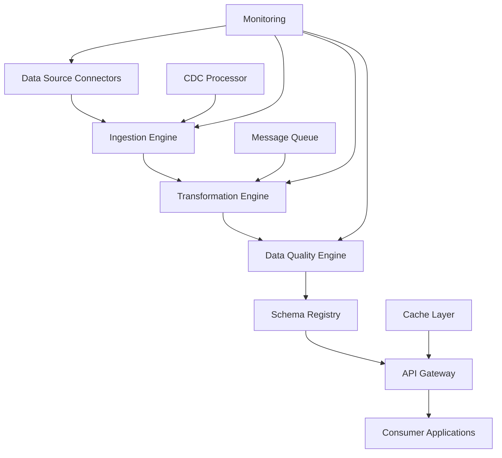

The Data Hub Integration Service provides enterprise-grade data integration capabilities for connecting, transforming, and synchronizing data across heterogeneous systems and data sources.

## Service Overview

The Data Hub Integration Service acts as a centralized data integration platform that connects various enterprise data sources, applies transformations, and provides unified access to data through standardized APIs. It supports real-time and batch integration patterns with built-in data governance and compliance features.

### Key Capabilities

- **Universal Connectors**: Pre-built connectors for 200+ enterprise systems and data sources
- **API Gateway**: Centralized API management with rate limiting, authentication, and monitoring
- **Data Transformation**: Visual and code-based transformation pipelines with lineage tracking
- **Real-time Sync**: Change data capture (CDC) and event-driven synchronization
- **Data Governance**: Schema registry, data quality monitoring, and compliance enforcement
- **Hybrid Deployment**: Cloud, on-premises, and edge deployment options

## Architecture Design

### Core Components



### System Architecture

```kotlin
// Core service architecture
@Service
@Component("dataHubIntegrationService")
class DataHubIntegrationService(
    private val connectorManager: ConnectorManager,
    private val ingestionEngine: IngestionEngine,
    private val transformationEngine: TransformationEngine,
    private val dataQualityEngine: DataQualityEngine,
    private val schemaRegistry: SchemaRegistry,
    private val apiGateway: APIGateway,
    private val governanceService: DataGovernanceService
) {
    
    suspend fun createIntegration(request: IntegrationRequest): IntegrationResponse {
        // Validate integration configuration
        validateIntegrationConfig(request.config)
        
        // Create integration instance
        val integration = Integration(
            id = UUID.randomUUID().toString(),
            name = request.name,
            config = request.config,
            status = IntegrationStatus.CREATING
        )
        
        // Deploy integration components
        val deployment = deployIntegrationComponents(integration)
        
        // Register API endpoints
        apiGateway.registerEndpoints(integration.id, deployment.endpoints)
        
        return IntegrationResponse(
            integrationId = integration.id,
            status = integration.status,
            endpoints = deployment.endpoints
        )
    }
}
```

## API Specifications

### REST API Endpoints

#### Integration Management

```yaml
# OpenAPI Specification
openapi: 3.0.3
info:
  title: Data Hub Integration Service API
  version: 1.0.0
  description: Enterprise data integration and API gateway service

paths:
  /api/v1/integrations:
    post:
      summary: Create data integration
      operationId: createIntegration
      requestBody:
        required: true
        content:
          application/json:
            schema:
              $ref: '#/components/schemas/IntegrationRequest'
      responses:
        '201':
          description: Integration created
          content:
            application/json:
              schema:
                $ref: '#/components/schemas/IntegrationResponse'
        '400':
          description: Invalid integration configuration
        '429':
          description: Integration quota exceeded

    get:
      summary: List integrations
      parameters:
        - name: status
          in: query
          schema:
            type: string
            enum: [creating, active, inactive, failed, deleted]
        - name: type
          in: query
          schema:
            type: string
            enum: [real-time, batch, hybrid]
        - name: source_type
          in: query
          schema:
            type: string
        - name: limit
          in: query
          schema:
            type: integer
            default: 50
        - name: offset
          in: query
          schema:
            type: integer
            default: 0
      responses:
        '200':
          description: List of integrations
          content:
            application/json:
              schema:
                $ref: '#/components/schemas/IntegrationList'

  /api/v1/integrations/{integrationId}:
    get:
      summary: Get integration details
      parameters:
        - name: integrationId
          in: path
          required: true
          schema:
            type: string
      responses:
        '200':
          description: Integration details
          content:
            application/json:
              schema:
                $ref: '#/components/schemas/Integration'
        '404':
          description: Integration not found

    patch:
      summary: Update integration configuration
      parameters:
        - name: integrationId
          in: path
          required: true
          schema:
            type: string
      requestBody:
        required: true
        content:
          application/json:
            schema:
              $ref: '#/components/schemas/IntegrationUpdateRequest'
      responses:
        '200':
          description: Integration updated
          content:
            application/json:
              schema:
                $ref: '#/components/schemas/Integration'
        '404':
          description: Integration not found
        '409':
          description: Cannot update active integration

    delete:
      summary: Delete integration
      parameters:
        - name: integrationId
          in: path
          required: true
          schema:
            type: string
      responses:
        '204':
          description: Integration deleted
        '404':
          description: Integration not found
        '409':
          description: Cannot delete active integration

  /api/v1/integrations/{integrationId}/start:
    post:
      summary: Start integration
      parameters:
        - name: integrationId
          in: path
          required: true
          schema:
            type: string
      responses:
        '202':
          description: Integration start initiated
          content:
            application/json:
              schema:
                $ref: '#/components/schemas/IntegrationOperationResponse'

  /api/v1/integrations/{integrationId}/stop:
    post:
      summary: Stop integration
      parameters:
        - name: integrationId
          in: path
          required: true
          schema:
            type: string
      responses:
        '202':
          description: Integration stop initiated
          content:
            application/json:
              schema:
                $ref: '#/components/schemas/IntegrationOperationResponse'

  /api/v1/integrations/{integrationId}/sync:
    post:
      summary: Trigger manual synchronization
      parameters:
        - name: integrationId
          in: path
          required: true
          schema:
            type: string
      requestBody:
        content:
          application/json:
            schema:
              $ref: '#/components/schemas/SyncRequest'
      responses:
        '202':
          description: Synchronization initiated
          content:
            application/json:
              schema:
                $ref: '#/components/schemas/SyncResponse'

  /api/v1/connectors:
    get:
      summary: List available connectors
      parameters:
        - name: category
          in: query
          schema:
            type: string
            enum: [database, crm, erp, cloud, file, api]
        - name: vendor
          in: query
          schema:
            type: string
      responses:
        '200':
          description: Available connectors
          content:
            application/json:
              schema:
                $ref: '#/components/schemas/ConnectorList'

    post:
      summary: Register custom connector
      requestBody:
        required: true
        content:
          application/json:
            schema:
              $ref: '#/components/schemas/CustomConnectorRequest'
      responses:
        '201':
          description: Connector registered
          content:
            application/json:
              schema:
                $ref: '#/components/schemas/Connector'

  /api/v1/connectors/{connectorId}/test:
    post:
      summary: Test connector connectivity
      parameters:
        - name: connectorId
          in: path
          required: true
          schema:
            type: string
      requestBody:
        required: true
        content:
          application/json:
            schema:
              $ref: '#/components/schemas/ConnectorTestRequest'
      responses:
        '200':
          description: Connection test results
          content:
            application/json:
              schema:
                $ref: '#/components/schemas/ConnectorTestResult'

  /api/v1/schemas:
    get:
      summary: List registered schemas
      parameters:
        - name: subject
          in: query
          schema:
            type: string
        - name: version
          in: query
          schema:
            type: string
      responses:
        '200':
          description: Registered schemas
          content:
            application/json:
              schema:
                $ref: '#/components/schemas/SchemaList'

    post:
      summary: Register new schema
      requestBody:
        required: true
        content:
          application/json:
            schema:
              $ref: '#/components/schemas/SchemaRegistrationRequest'
      responses:
        '201':
          description: Schema registered
          content:
            application/json:
              schema:
                $ref: '#/components/schemas/Schema'

  /api/v1/schemas/{subject}/versions/{version}:
    get:
      summary: Get specific schema version
      parameters:
        - name: subject
          in: path
          required: true
          schema:
            type: string
        - name: version
          in: path
          required: true
          schema:
            type: string
      responses:
        '200':
          description: Schema version
          content:
            application/json:
              schema:
                $ref: '#/components/schemas/Schema'
        '404':
          description: Schema version not found

  /api/v1/transformations:
    get:
      summary: List data transformations
      parameters:
        - name: integration_id
          in: query
          schema:
            type: string
        - name: type
          in: query
          schema:
            type: string
            enum: [mapping, validation, enrichment, aggregation]
      responses:
        '200':
          description: Data transformations
          content:
            application/json:
              schema:
                $ref: '#/components/schemas/TransformationList'

    post:
      summary: Create data transformation
      requestBody:
        required: true
        content:
          application/json:
            schema:
              $ref: '#/components/schemas/TransformationRequest'
      responses:
        '201':
          description: Transformation created
          content:
            application/json:
              schema:
                $ref: '#/components/schemas/Transformation'

  /api/v1/transformations/{transformationId}/execute:
    post:
      summary: Execute transformation
      parameters:
        - name: transformationId
          in: path
          required: true
          schema:
            type: string
      requestBody:
        required: true
        content:
          application/json:
            schema:
              $ref: '#/components/schemas/TransformationExecutionRequest'
      responses:
        '200':
          description: Transformation results
          content:
            application/json:
              schema:
                $ref: '#/components/schemas/TransformationExecutionResult'

  /api/v1/data-quality/rules:
    get:
      summary: List data quality rules
      parameters:
        - name: integration_id
          in: query
          schema:
            type: string
        - name: rule_type
          in: query
          schema:
            type: string
            enum: [completeness, validity, uniqueness, consistency, accuracy]
      responses:
        '200':
          description: Data quality rules
          content:
            application/json:
              schema:
                $ref: '#/components/schemas/DataQualityRuleList'

    post:
      summary: Create data quality rule
      requestBody:
        required: true
        content:
          application/json:
            schema:
              $ref: '#/components/schemas/DataQualityRuleRequest'
      responses:
        '201':
          description: Rule created
          content:
            application/json:
              schema:
                $ref: '#/components/schemas/DataQualityRule'

  /api/v1/data-quality/violations:
    get:
      summary: List data quality violations
      parameters:
        - name: integration_id
          in: query
          schema:
            type: string
        - name: rule_id
          in: query
          schema:
            type: string
        - name: status
          in: query
          schema:
            type: string
            enum: [open, acknowledged, resolved, false_positive]
        - name: severity
          in: query
          schema:
            type: string
            enum: [low, medium, high, critical]
      responses:
        '200':
          description: Data quality violations
          content:
            application/json:
              schema:
                $ref: '#/components/schemas/DataQualityViolationList'

components:
  schemas:
    IntegrationRequest:
      type: object
      required:
        - name
        - config
      properties:
        name:
          type: string
          example: "salesforce-customer-integration"
        description:
          type: string
        config:
          $ref: '#/components/schemas/IntegrationConfig'
        tags:
          type: array
          items:
            type: string

    IntegrationConfig:
      type: object
      required:
        - type
        - source
        - destination
      properties:
        type:
          type: string
          enum: [real-time, batch, hybrid]
        source:
          $ref: '#/components/schemas/DataSourceConfig'
        destination:
          $ref: '#/components/schemas/DataDestinationConfig'
        transformations:
          type: array
          items:
            $ref: '#/components/schemas/TransformationConfig'
        schedule:
          $ref: '#/components/schemas/ScheduleConfig'
        quality_rules:
          type: array
          items:
            $ref: '#/components/schemas/DataQualityRuleConfig'

    DataSourceConfig:
      type: object
      required:
        - connector_type
        - connection
      properties:
        connector_type:
          type: string
          example: "salesforce"
        connection:
          $ref: '#/components/schemas/ConnectionConfig'
        query:
          type: string
          description: "SQL query or API filter"
        incremental_column:
          type: string
          description: "Column for incremental sync"
        batch_size:
          type: integer
          default: 1000

    DataDestinationConfig:
      type: object
      required:
        - connector_type
        - connection
      properties:
        connector_type:
          type: string
          example: "postgresql"
        connection:
          $ref: '#/components/schemas/ConnectionConfig'
        table_name:
          type: string
        write_mode:
          type: string
          enum: [append, overwrite, merge]
          default: append

    ConnectionConfig:
      type: object
      properties:
        host:
          type: string
        port:
          type: integer
        database:
          type: string
        username:
          type: string
        password:
          type: string
          format: password
        url:
          type: string
          format: uri
        api_key:
          type: string
        oauth_config:
          $ref: '#/components/schemas/OAuthConfig'
        ssl_config:
          $ref: '#/components/schemas/SSLConfig'
        connection_pool:
          $ref: '#/components/schemas/ConnectionPoolConfig'

    TransformationConfig:
      type: object
      required:
        - type
        - config
      properties:
        id:
          type: string
        name:
          type: string
        type:
          type: string
          enum: [mapping, validation, enrichment, aggregation, filtering]
        config:
          type: object
          additionalProperties: true
        dependencies:
          type: array
          items:
            type: string

    Integration:
      type: object
      properties:
        id:
          type: string
          format: uuid
        name:
          type: string
        description:
          type: string
        status:
          type: string
          enum: [creating, active, inactive, failed, deleted]
        config:
          $ref: '#/components/schemas/IntegrationConfig'
        statistics:
          $ref: '#/components/schemas/IntegrationStatistics'
        created_at:
          type: string
          format: date-time
        updated_at:
          type: string
          format: date-time
        last_sync_at:
          type: string
          format: date-time

    IntegrationStatistics:
      type: object
      properties:
        records_processed:
          type: integer
          format: int64
        records_per_second:
          type: number
        error_rate:
          type: number
          minimum: 0
          maximum: 1
        data_quality_score:
          type: number
          minimum: 0
          maximum: 1
        uptime_percentage:
          type: number
          minimum: 0
          maximum: 100

    Connector:
      type: object
      properties:
        id:
          type: string
        name:
          type: string
        category:
          type: string
        vendor:
          type: string
        version:
          type: string
        supported_operations:
          type: array
          items:
            type: string
            enum: [read, write, incremental_read, change_data_capture]
        configuration_schema:
          type: object
          description: "JSON Schema for connector configuration"
        documentation_url:
          type: string
          format: uri

    Schema:
      type: object
      properties:
        id:
          type: string
        subject:
          type: string
        version:
          type: string
        schema_type:
          type: string
          enum: [json, avro, protobuf]
        schema_definition:
          type: object
        compatibility:
          type: string
          enum: [backward, forward, full, none]
        created_at:
          type: string
          format: date-time

    Transformation:
      type: object
      properties:
        id:
          type: string
          format: uuid
        name:
          type: string
        type:
          type: string
        config:
          type: object
        input_schema:
          type: object
        output_schema:
          type: object
        test_cases:
          type: array
          items:
            $ref: '#/components/schemas/TransformationTestCase'
        created_at:
          type: string
          format: date-time

    DataQualityRule:
      type: object
      properties:
        id:
          type: string
          format: uuid
        name:
          type: string
        type:
          type: string
          enum: [completeness, validity, uniqueness, consistency, accuracy]
        config:
          type: object
        severity:
          type: string
          enum: [low, medium, high, critical]
        enabled:
          type: boolean
        threshold:
          type: number
        description:
          type: string

  securitySchemes:
    BearerAuth:
      type: http
      scheme: bearer
      bearerFormat: JWT
    ApiKeyAuth:
      type: apiKey
      in: header
      name: X-API-Key

security:
  - BearerAuth: []
  - ApiKeyAuth: []
```

### GraphQL API

```graphql
# GraphQL schema for data hub integration
type Query {
  integrations(
    filter: IntegrationFilter
    sort: IntegrationSort
    pagination: PaginationInput
  ): IntegrationConnection!
  
  integration(id: ID!): Integration
  
  connectors(
    filter: ConnectorFilter
    pagination: PaginationInput
  ): ConnectorConnection!
  
  connector(id: ID!): Connector
  
  schemas(
    filter: SchemaFilter
    pagination: PaginationInput
  ): SchemaConnection!
  
  transformations(
    integrationId: ID
    type: TransformationType
    pagination: PaginationInput
  ): TransformationConnection!
  
  dataQualityViolations(
    integrationId: ID
    severity: Severity
    status: ViolationStatus
    pagination: PaginationInput
  ): DataQualityViolationConnection!
}

type Mutation {
  createIntegration(input: IntegrationInput!): IntegrationPayload!
  updateIntegration(id: ID!, input: IntegrationUpdateInput!): IntegrationPayload!
  deleteIntegration(id: ID!): DeletePayload!
  
  startIntegration(id: ID!): IntegrationOperationPayload!
  stopIntegration(id: ID!): IntegrationOperationPayload!
  syncIntegration(id: ID!, input: SyncInput): SyncPayload!
  
  registerConnector(input: ConnectorInput!): ConnectorPayload!
  testConnector(id: ID!, config: JSON!): ConnectorTestPayload!
  
  registerSchema(input: SchemaInput!): SchemaPayload!
  
  createTransformation(input: TransformationInput!): TransformationPayload!
  executeTransformation(id: ID!, data: JSON!): TransformationExecutionPayload!
  
  createDataQualityRule(input: DataQualityRuleInput!): DataQualityRulePayload!
  resolveDataQualityViolation(id: ID!, resolution: String!): DataQualityViolationPayload!
}

type Subscription {
  integrationStatusUpdates(integrationId: ID!): IntegrationStatusUpdate!
  integrationMetrics(integrationId: ID!): IntegrationMetricsUpdate!
  dataQualityAlerts(integrationId: ID): DataQualityAlert!
  syncProgress(integrationId: ID!): SyncProgressUpdate!
}

# Core types
type Integration {
  id: ID!
  name: String!
  description: String
  status: IntegrationStatus!
  config: IntegrationConfig!
  statistics: IntegrationStatistics
  source: DataSource!
  destination: DataDestination!
  transformations: [Transformation!]!
  qualityRules: [DataQualityRule!]!
  violations: [DataQualityViolation!]!
  createdAt: DateTime!
  updatedAt: DateTime!
  lastSyncAt: DateTime
}

enum IntegrationStatus {
  CREATING
  ACTIVE
  INACTIVE
  FAILED
  DELETED
}

type DataSource {
  id: ID!
  connector: Connector!
  connection: ConnectionInfo!
  query: String
  incrementalColumn: String
  batchSize: Int
}

type Connector {
  id: ID!
  name: String!
  category: ConnectorCategory!
  vendor: String!
  version: String!
  supportedOperations: [ConnectorOperation!]!
  configurationSchema: JSON!
  documentationUrl: String
}

enum ConnectorCategory {
  DATABASE
  CRM
  ERP
  CLOUD
  FILE
  API
}

# Custom scalars
scalar DateTime
scalar JSON
```

### gRPC Service Definition

```protobuf
// data_hub_integration.proto
syntax = "proto3";

package aimatrix.datahub.v1;

import "google/protobuf/timestamp.proto";
import "google/protobuf/struct.proto";
import "google/protobuf/empty.proto";

// Data Hub Integration Service
service DataHubIntegrationService {
  // Integration management
  rpc CreateIntegration(CreateIntegrationRequest) returns (CreateIntegrationResponse);
  rpc GetIntegration(GetIntegrationRequest) returns (Integration);
  rpc ListIntegrations(ListIntegrationsRequest) returns (ListIntegrationsResponse);
  rpc UpdateIntegration(UpdateIntegrationRequest) returns (Integration);
  rpc DeleteIntegration(DeleteIntegrationRequest) returns (google.protobuf.Empty);
  
  // Integration operations
  rpc StartIntegration(IntegrationOperationRequest) returns (IntegrationOperationResponse);
  rpc StopIntegration(IntegrationOperationRequest) returns (IntegrationOperationResponse);
  rpc SyncIntegration(SyncIntegrationRequest) returns (SyncIntegrationResponse);
  
  // Monitoring
  rpc GetIntegrationMetrics(GetIntegrationMetricsRequest) returns (IntegrationMetrics);
  rpc StreamIntegrationLogs(StreamLogsRequest) returns (stream LogEntry);
}

// Connector Service
service ConnectorService {
  rpc ListConnectors(ListConnectorsRequest) returns (ListConnectorsResponse);
  rpc GetConnector(GetConnectorRequest) returns (Connector);
  rpc RegisterConnector(RegisterConnectorRequest) returns (Connector);
  rpc TestConnector(TestConnectorRequest) returns (ConnectorTestResult);
}

// Schema Registry Service
service SchemaRegistryService {
  rpc RegisterSchema(RegisterSchemaRequest) returns (Schema);
  rpc GetSchema(GetSchemaRequest) returns (Schema);
  rpc ListSchemas(ListSchemasRequest) returns (ListSchemasResponse);
  rpc UpdateSchema(UpdateSchemaRequest) returns (Schema);
}

// Request/Response Messages
message CreateIntegrationRequest {
  string name = 1;
  string description = 2;
  IntegrationConfig config = 3;
  repeated string tags = 4;
}

message CreateIntegrationResponse {
  string integration_id = 1;
  IntegrationStatus status = 2;
  google.protobuf.Timestamp created_at = 3;
  repeated Endpoint endpoints = 4;
}

message Integration {
  string id = 1;
  string name = 2;
  string description = 3;
  IntegrationStatus status = 4;
  IntegrationConfig config = 5;
  IntegrationStatistics statistics = 6;
  google.protobuf.Timestamp created_at = 7;
  google.protobuf.Timestamp updated_at = 8;
  google.protobuf.Timestamp last_sync_at = 9;
}

message IntegrationConfig {
  IntegrationType type = 1;
  DataSourceConfig source = 2;
  DataDestinationConfig destination = 3;
  repeated TransformationConfig transformations = 4;
  ScheduleConfig schedule = 5;
  repeated DataQualityRuleConfig quality_rules = 6;
}

message DataSourceConfig {
  string connector_type = 1;
  ConnectionConfig connection = 2;
  string query = 3;
  string incremental_column = 4;
  int32 batch_size = 5;
}

message Connector {
  string id = 1;
  string name = 2;
  ConnectorCategory category = 3;
  string vendor = 4;
  string version = 5;
  repeated ConnectorOperation supported_operations = 6;
  google.protobuf.Struct configuration_schema = 7;
  string documentation_url = 8;
}

// Enums
enum IntegrationStatus {
  INTEGRATION_STATUS_UNSPECIFIED = 0;
  INTEGRATION_STATUS_CREATING = 1;
  INTEGRATION_STATUS_ACTIVE = 2;
  INTEGRATION_STATUS_INACTIVE = 3;
  INTEGRATION_STATUS_FAILED = 4;
  INTEGRATION_STATUS_DELETED = 5;
}

enum IntegrationType {
  INTEGRATION_TYPE_UNSPECIFIED = 0;
  INTEGRATION_TYPE_REAL_TIME = 1;
  INTEGRATION_TYPE_BATCH = 2;
  INTEGRATION_TYPE_HYBRID = 3;
}

enum ConnectorCategory {
  CONNECTOR_CATEGORY_UNSPECIFIED = 0;
  CONNECTOR_CATEGORY_DATABASE = 1;
  CONNECTOR_CATEGORY_CRM = 2;
  CONNECTOR_CATEGORY_ERP = 3;
  CONNECTOR_CATEGORY_CLOUD = 4;
  CONNECTOR_CATEGORY_FILE = 5;
  CONNECTOR_CATEGORY_API = 6;
}

enum ConnectorOperation {
  CONNECTOR_OPERATION_UNSPECIFIED = 0;
  CONNECTOR_OPERATION_READ = 1;
  CONNECTOR_OPERATION_WRITE = 2;
  CONNECTOR_OPERATION_INCREMENTAL_READ = 3;
  CONNECTOR_OPERATION_CHANGE_DATA_CAPTURE = 4;
}
```

## Implementation Examples

### Kotlin/Spring Boot Service Implementation

```kotlin
// Main service implementation
@Service
@Transactional
@Component("dataHubIntegrationService")
class DataHubIntegrationServiceImpl(
    private val integrationRepository: IntegrationRepository,
    private val connectorManager: ConnectorManager,
    private val ingestionEngine: IngestionEngine,
    private val transformationEngine: TransformationEngine,
    private val dataQualityEngine: DataQualityEngine,
    private val schemaRegistry: SchemaRegistry,
    private val apiGateway: APIGateway,
    private val metricsCollector: MetricsCollector,
    private val auditService: AuditService
) : DataHubIntegrationService {

    private val logger = LoggerFactory.getLogger(DataHubIntegrationServiceImpl::class.java)

    @Async
    override suspend fun createIntegration(request: IntegrationRequest): IntegrationResponse {
        logger.info("Creating integration: ${request.name}")
        
        // Validate configuration
        validateIntegrationConfig(request.config)
        
        // Test source and destination connectivity
        testConnectivity(request.config.source, request.config.destination)
        
        // Create integration entity
        val integration = IntegrationEntity(
            id = UUID.randomUUID().toString(),
            name = request.name,
            description = request.description,
            config = request.config,
            status = IntegrationStatus.CREATING,
            tags = request.tags,
            createdAt = Instant.now()
        )
        
        integrationRepository.save(integration)
        
        try {
            // Deploy integration components
            val deployment = deployIntegrationComponents(integration)
            
            // Register schemas
            registerSchemas(integration)
            
            // Set up transformations
            setupTransformations(integration)
            
            // Configure data quality rules
            configureDataQuality(integration)
            
            // Register API endpoints
            val endpoints = apiGateway.registerEndpoints(integration.id, deployment.endpoints)
            
            // Update integration status
            integration.status = IntegrationStatus.INACTIVE // Ready to start
            integration.updatedAt = Instant.now()
            integrationRepository.save(integration)
            
            // Audit log
            auditService.logIntegrationCreated(integration)
            
            return IntegrationResponse(
                integrationId = integration.id,
                status = integration.status,
                endpoints = endpoints,
                createdAt = integration.createdAt
            )
            
        } catch (e: Exception) {
            logger.error("Failed to create integration: ${integration.id}", e)
            integration.status = IntegrationStatus.FAILED
            integration.updatedAt = Instant.now()
            integrationRepository.save(integration)
            throw IntegrationCreationException("Failed to create integration", e)
        }
    }

    override suspend fun startIntegration(integrationId: String): IntegrationOperationResponse {
        val integration = integrationRepository.findById(integrationId)
            ?: throw IntegrationNotFoundException(integrationId)
        
        if (integration.status !in setOf(IntegrationStatus.INACTIVE, IntegrationStatus.FAILED)) {
            throw IllegalStateException("Cannot start integration in status: ${integration.status}")
        }
        
        logger.info("Starting integration: $integrationId")
        
        try {
            // Start ingestion based on integration type
            when (integration.config.type) {
                IntegrationType.REAL_TIME -> startRealTimeIntegration(integration)
                IntegrationType.BATCH -> startBatchIntegration(integration)
                IntegrationType.HYBRID -> startHybridIntegration(integration)
            }
            
            integration.status = IntegrationStatus.ACTIVE
            integration.startedAt = Instant.now()
            integration.updatedAt = Instant.now()
            integrationRepository.save(integration)
            
            // Start metrics collection
            metricsCollector.startCollection(integrationId)
            
            // Audit log
            auditService.logIntegrationStarted(integration)
            
            return IntegrationOperationResponse(
                integrationId = integrationId,
                operation = "start",
                status = "success",
                timestamp = Instant.now()
            )
            
        } catch (e: Exception) {
            logger.error("Failed to start integration: $integrationId", e)
            integration.status = IntegrationStatus.FAILED
            integration.updatedAt = Instant.now()
            integrationRepository.save(integration)
            throw IntegrationOperationException("Failed to start integration", e)
        }
    }

    override suspend fun syncIntegration(
        integrationId: String,
        request: SyncRequest
    ): SyncResponse {
        val integration = integrationRepository.findById(integrationId)
            ?: throw IntegrationNotFoundException(integrationId)
        
        logger.info("Triggering sync for integration: $integrationId")
        
        val syncJob = SyncJob(
            integrationId = integrationId,
            type = request.type ?: SyncType.FULL,
            filters = request.filters,
            startedAt = Instant.now()
        )
        
        try {
            // Execute synchronization
            val result = when (request.type) {
                SyncType.FULL -> performFullSync(integration)
                SyncType.INCREMENTAL -> performIncrementalSync(integration, request.lastSyncTime)
                SyncType.PARTIAL -> performPartialSync(integration, request.filters)
                else -> performFullSync(integration)
            }
            
            syncJob.completedAt = Instant.now()
            syncJob.recordsProcessed = result.recordsProcessed
            syncJob.recordsSuccess = result.recordsSuccess
            syncJob.recordsError = result.recordsError
            syncJob.status = if (result.recordsError == 0L) SyncStatus.COMPLETED else SyncStatus.COMPLETED_WITH_ERRORS
            
            // Update last sync time
            integration.lastSyncAt = syncJob.completedAt
            integration.updatedAt = Instant.now()
            integrationRepository.save(integration)
            
            return SyncResponse(
                syncId = syncJob.id,
                status = syncJob.status,
                recordsProcessed = syncJob.recordsProcessed,
                recordsSuccess = syncJob.recordsSuccess,
                recordsError = syncJob.recordsError,
                startedAt = syncJob.startedAt,
                completedAt = syncJob.completedAt
            )
            
        } catch (e: Exception) {
            logger.error("Sync failed for integration: $integrationId", e)
            syncJob.status = SyncStatus.FAILED
            syncJob.completedAt = Instant.now()
            syncJob.errorMessage = e.message
            throw SyncException("Synchronization failed", e)
        }
    }

    private suspend fun startRealTimeIntegration(integration: IntegrationEntity) {
        val sourceConfig = integration.config.source
        val destinationConfig = integration.config.destination
        
        // Set up change data capture if supported
        val sourceConnector = connectorManager.getConnector(sourceConfig.connectorType)
        if (sourceConnector.supportedOperations.contains(ConnectorOperation.CHANGE_DATA_CAPTURE)) {
            setupChangeDataCapture(integration)
        } else {
            // Fallback to polling
            setupPollingSync(integration)
        }
        
        // Start real-time transformation pipeline
        transformationEngine.startRealTimeTransformations(integration.id, integration.config.transformations)
        
        // Start real-time data quality monitoring
        dataQualityEngine.startRealTimeMonitoring(integration.id, integration.config.qualityRules)
    }

    private suspend fun startBatchIntegration(integration: IntegrationEntity) {
        val schedule = integration.config.schedule
        
        if (schedule != null) {
            // Schedule batch jobs
            ingestionEngine.scheduleBatchJob(
                integrationId = integration.id,
                cronExpression = schedule.cronExpression,
                config = integration.config
            )
        } else {
            // One-time batch execution
            executeBatchSync(integration)
        }
    }

    private suspend fun startHybridIntegration(integration: IntegrationEntity) {
        // Start both real-time and batch components
        startRealTimeIntegration(integration)
        startBatchIntegration(integration)
    }

    private suspend fun setupChangeDataCapture(integration: IntegrationEntity) {
        val sourceConfig = integration.config.source
        
        // Configure CDC with Debezium or similar
        val cdcConfig = CDCConfiguration(
            connectorType = sourceConfig.connectorType,
            connection = sourceConfig.connection,
            tables = extractTableNames(sourceConfig.query),
            transformations = integration.config.transformations
        )
        
        ingestionEngine.setupCDC(integration.id, cdcConfig)
    }

    private suspend fun performFullSync(integration: IntegrationEntity): SyncResult {
        val sourceConfig = integration.config.source
        val destinationConfig = integration.config.destination
        
        // Read all data from source
        val sourceData = readSourceData(sourceConfig, null)
        
        // Apply transformations
        val transformedData = applyTransformations(sourceData, integration.config.transformations)
        
        // Validate data quality
        val validatedData = validateDataQuality(transformedData, integration.config.qualityRules)
        
        // Write to destination
        val writeResult = writeDestinationData(destinationConfig, validatedData, WriteMode.OVERWRITE)
        
        return SyncResult(
            recordsProcessed = sourceData.size.toLong(),
            recordsSuccess = writeResult.successCount,
            recordsError = writeResult.errorCount
        )
    }

    private suspend fun performIncrementalSync(
        integration: IntegrationEntity,
        lastSyncTime: Instant?
    ): SyncResult {
        val sourceConfig = integration.config.source
        val incrementalColumn = sourceConfig.incrementalColumn
            ?: throw IllegalStateException("Incremental column not configured")
        
        val lastSync = lastSyncTime ?: integration.lastSyncAt ?: Instant.EPOCH
        
        // Read incremental data
        val incrementalQuery = buildIncrementalQuery(sourceConfig.query, incrementalColumn, lastSync)
        val sourceData = readSourceData(sourceConfig.copy(query = incrementalQuery), lastSync)
        
        // Apply transformations
        val transformedData = applyTransformations(sourceData, integration.config.transformations)
        
        // Validate data quality
        val validatedData = validateDataQuality(transformedData, integration.config.qualityRules)
        
        // Write to destination (append mode)
        val writeResult = writeDestinationData(integration.config.destination, validatedData, WriteMode.APPEND)
        
        return SyncResult(
            recordsProcessed = sourceData.size.toLong(),
            recordsSuccess = writeResult.successCount,
            recordsError = writeResult.errorCount
        )
    }

    private fun validateIntegrationConfig(config: IntegrationConfig) {
        // Validate source configuration
        validateDataSourceConfig(config.source)
        
        // Validate destination configuration
        validateDataDestinationConfig(config.destination)
        
        // Validate transformations
        config.transformations.forEach { transformation ->
            validateTransformationConfig(transformation)
        }
        
        // Validate data quality rules
        config.qualityRules.forEach { rule ->
            validateDataQualityRule(rule)
        }
        
        // Validate schedule if batch integration
        if (config.type == IntegrationType.BATCH && config.schedule != null) {
            validateScheduleConfig(config.schedule)
        }
    }
}

// Connector manager for handling different data source types
@Component
class ConnectorManager(
    private val connectorRegistry: ConnectorRegistry,
    private val connectionFactory: ConnectionFactory
) {
    
    private val connectors = mutableMapOf<String, Connector>()
    
    @PostConstruct
    fun initializeConnectors() {
        // Load built-in connectors
        loadBuiltInConnectors()
        
        // Load custom connectors
        loadCustomConnectors()
    }
    
    fun getConnector(connectorType: String): Connector {
        return connectors[connectorType] 
            ?: throw ConnectorNotFoundException("Connector not found: $connectorType")
    }
    
    fun registerConnector(connector: Connector) {
        connectors[connector.id] = connector
        logger.info("Registered connector: ${connector.name}")
    }
    
    suspend fun testConnection(connectorType: String, config: ConnectionConfig): ConnectionTestResult {
        val connector = getConnector(connectorType)
        val connection = connectionFactory.createConnection(connector, config)
        
        return try {
            connection.test()
            ConnectionTestResult(
                success = true,
                message = "Connection successful",
                latencyMs = measureConnectionLatency(connection)
            )
        } catch (e: Exception) {
            ConnectionTestResult(
                success = false,
                message = e.message ?: "Connection failed",
                error = e::class.simpleName
            )
        }
    }
    
    private fun loadBuiltInConnectors() {
        // Database connectors
        connectors["postgresql"] = PostgreSQLConnector()
        connectors["mysql"] = MySQLConnector()
        connectors["oracle"] = OracleConnector()
        connectors["sqlserver"] = SQLServerConnector()
        connectors["mongodb"] = MongoDBConnector()
        connectors["redis"] = RedisConnector()
        
        // Cloud connectors
        connectors["s3"] = S3Connector()
        connectors["gcs"] = GCSConnector()
        connectors["azure_blob"] = AzureBlobConnector()
        
        // SaaS connectors
        connectors["salesforce"] = SalesforceConnector()
        connectors["hubspot"] = HubSpotConnector()
        connectors["stripe"] = StripeConnector()
        connectors["shopify"] = ShopifyConnector()
        
        // File connectors
        connectors["csv"] = CSVConnector()
        connectors["json"] = JSONConnector()
        connectors["xml"] = XMLConnector()
        connectors["parquet"] = ParquetConnector()
        
        // API connectors
        connectors["rest_api"] = RESTAPIConnector()
        connectors["graphql"] = GraphQLConnector()
        connectors["soap"] = SOAPConnector()
    }
    
    private fun loadCustomConnectors() {
        // Load custom connectors from registry or file system
        val customConnectorPaths = System.getProperty("custom.connectors.path", "").split(",")
        
        customConnectorPaths.forEach { path ->
            if (path.isNotBlank()) {
                loadConnectorFromPath(path)
            }
        }
    }
}

// Transformation engine for data processing
@Component
class TransformationEngine(
    private val transformationRegistry: TransformationRegistry,
    private val scriptEngine: ScriptEngine,
    private val validationService: ValidationService
) {
    
    suspend fun applyTransformations(
        data: List<Map<String, Any>>,
        transformations: List<TransformationConfig>
    ): List<Map<String, Any>> {
        
        // Sort transformations by dependencies
        val sortedTransformations = topologicalSort(transformations)
        
        return sortedTransformations.fold(data) { currentData, transformation ->
            when (transformation.type) {
                TransformationType.MAPPING -> applyMapping(currentData, transformation.config)
                TransformationType.VALIDATION -> applyValidation(currentData, transformation.config)
                TransformationType.ENRICHMENT -> applyEnrichment(currentData, transformation.config)
                TransformationType.AGGREGATION -> applyAggregation(currentData, transformation.config)
                TransformationType.FILTERING -> applyFiltering(currentData, transformation.config)
                TransformationType.CUSTOM -> applyCustomTransformation(currentData, transformation.config)
            }
        }
    }
    
    private suspend fun applyMapping(
        data: List<Map<String, Any>>,
        config: Map<String, Any>
    ): List<Map<String, Any>> {
        val mappingRules = config["rules"] as? Map<String, String> ?: emptyMap()
        
        return data.map { record ->
            mappingRules.entries.fold(mutableMapOf<String, Any>()) { result, (target, source) ->
                val value = evaluateExpression(source, record)
                result[target] = value
                result
            }
        }
    }
    
    private suspend fun applyValidation(
        data: List<Map<String, Any>>,
        config: Map<String, Any>
    ): List<Map<String, Any>> {
        val validationRules = config["rules"] as? List<Map<String, Any>> ?: emptyList()
        
        return data.filter { record ->
            validationRules.all { rule ->
                validateRecord(record, rule)
            }
        }
    }
    
    private suspend fun applyEnrichment(
        data: List<Map<String, Any>>,
        config: Map<String, Any>
    ): List<Map<String, Any>> {
        val enrichmentSources = config["sources"] as? List<Map<String, Any>> ?: emptyList()
        
        return data.map { record ->
            val enrichedRecord = record.toMutableMap()
            
            enrichmentSources.forEach { source ->
                val enrichmentData = fetchEnrichmentData(source, record)
                enrichedRecord.putAll(enrichmentData)
            }
            
            enrichedRecord
        }
    }
    
    private fun topologicalSort(transformations: List<TransformationConfig>): List<TransformationConfig> {
        // Implement topological sort based on dependencies
        val graph = buildDependencyGraph(transformations)
        return graph.topologicalSort()
    }
    
    private fun evaluateExpression(expression: String, context: Map<String, Any>): Any {
        // Use expression evaluator (e.g., SpEL, JEXL, or custom)
        return when {
            expression.startsWith("$.") -> evaluateJSONPath(expression, context)
            expression.contains("${") -> evaluateTemplate(expression, context)
            else -> context[expression] ?: expression
        }
    }
}
```

## Database Schema & Models

### PostgreSQL Schema

```sql
-- Integrations table
CREATE TABLE integrations (
    id UUID PRIMARY KEY DEFAULT gen_random_uuid(),
    name VARCHAR(255) NOT NULL,
    description TEXT,
    user_id UUID NOT NULL,
    status VARCHAR(50) NOT NULL DEFAULT 'creating',
    type VARCHAR(50) NOT NULL,
    
    -- Configuration stored as JSONB
    config JSONB NOT NULL,
    
    -- Statistics
    statistics JSONB DEFAULT '{}'::jsonb,
    
    -- Timestamps
    created_at TIMESTAMP WITH TIME ZONE DEFAULT NOW(),
    updated_at TIMESTAMP WITH TIME ZONE DEFAULT NOW(),
    started_at TIMESTAMP WITH TIME ZONE,
    last_sync_at TIMESTAMP WITH TIME ZONE,
    
    -- Tags for organization
    tags TEXT[] DEFAULT '{}',
    
    -- Constraints
    CONSTRAINT integrations_status_check CHECK (
        status IN ('creating', 'active', 'inactive', 'failed', 'deleted')
    ),
    CONSTRAINT integrations_type_check CHECK (
        type IN ('real-time', 'batch', 'hybrid')
    )
);

-- Indexes
CREATE INDEX idx_integrations_user_status ON integrations(user_id, status);
CREATE INDEX idx_integrations_status_created ON integrations(status, created_at DESC);
CREATE INDEX idx_integrations_type ON integrations(type);
CREATE INDEX idx_integrations_tags ON integrations USING GIN(tags);
CREATE INDEX idx_integrations_config ON integrations USING GIN(config);

-- Connectors table
CREATE TABLE connectors (
    id VARCHAR(100) PRIMARY KEY,
    name VARCHAR(255) NOT NULL,
    category VARCHAR(50) NOT NULL,
    vendor VARCHAR(100),
    version VARCHAR(50) NOT NULL,
    
    -- Connector capabilities
    supported_operations TEXT[] NOT NULL,
    
    -- Configuration schema
    configuration_schema JSONB NOT NULL,
    
    -- Documentation
    documentation_url VARCHAR(1000),
    icon_url VARCHAR(1000),
    
    -- Status
    enabled BOOLEAN DEFAULT true,
    
    -- Timestamps
    created_at TIMESTAMP WITH TIME ZONE DEFAULT NOW(),
    updated_at TIMESTAMP WITH TIME ZONE DEFAULT NOW(),
    
    -- Constraints
    CONSTRAINT connectors_category_check CHECK (
        category IN ('database', 'crm', 'erp', 'cloud', 'file', 'api', 'messaging')
    )
);

-- Indexes for connectors
CREATE INDEX idx_connectors_category ON connectors(category);
CREATE INDEX idx_connectors_vendor ON connectors(vendor);
CREATE INDEX idx_connectors_enabled ON connectors(enabled);

-- Schemas table (Schema Registry)
CREATE TABLE schemas (
    id UUID PRIMARY KEY DEFAULT gen_random_uuid(),
    subject VARCHAR(255) NOT NULL,
    version VARCHAR(50) NOT NULL,
    schema_type VARCHAR(50) NOT NULL DEFAULT 'json',
    
    -- Schema definition
    schema_definition JSONB NOT NULL,
    
    -- Compatibility settings
    compatibility VARCHAR(50) DEFAULT 'backward',
    
    -- Metadata
    description TEXT,
    tags TEXT[] DEFAULT '{}',
    
    -- Timestamps
    created_at TIMESTAMP WITH TIME ZONE DEFAULT NOW(),
    
    -- Constraints
    CONSTRAINT schemas_type_check CHECK (
        schema_type IN ('json', 'avro', 'protobuf')
    ),
    CONSTRAINT schemas_compatibility_check CHECK (
        compatibility IN ('backward', 'forward', 'full', 'none')
    ),
    
    -- Unique constraint on subject + version
    UNIQUE(subject, version)
);

-- Indexes for schemas
CREATE INDEX idx_schemas_subject ON schemas(subject);
CREATE INDEX idx_schemas_type ON schemas(schema_type);
CREATE INDEX idx_schemas_tags ON schemas USING GIN(tags);

-- Transformations table
CREATE TABLE transformations (
    id UUID PRIMARY KEY DEFAULT gen_random_uuid(),
    integration_id UUID REFERENCES integrations(id) ON DELETE CASCADE,
    name VARCHAR(255) NOT NULL,
    type VARCHAR(50) NOT NULL,
    
    -- Transformation configuration
    config JSONB NOT NULL,
    
    -- Schema information
    input_schema JSONB,
    output_schema JSONB,
    
    -- Dependencies
    dependencies TEXT[] DEFAULT '{}',
    
    -- Status
    enabled BOOLEAN DEFAULT true,
    
    -- Testing
    test_cases JSONB DEFAULT '[]'::jsonb,
    
    -- Timestamps
    created_at TIMESTAMP WITH TIME ZONE DEFAULT NOW(),
    updated_at TIMESTAMP WITH TIME ZONE DEFAULT NOW(),
    
    -- Constraints
    CONSTRAINT transformations_type_check CHECK (
        type IN ('mapping', 'validation', 'enrichment', 'aggregation', 'filtering', 'custom')
    )
);

-- Indexes for transformations
CREATE INDEX idx_transformations_integration ON transformations(integration_id);
CREATE INDEX idx_transformations_type ON transformations(type);
CREATE INDEX idx_transformations_enabled ON transformations(enabled);
CREATE INDEX idx_transformations_dependencies ON transformations USING GIN(dependencies);

-- Data quality rules table
CREATE TABLE data_quality_rules (
    id UUID PRIMARY KEY DEFAULT gen_random_uuid(),
    integration_id UUID REFERENCES integrations(id) ON DELETE CASCADE,
    name VARCHAR(255) NOT NULL,
    type VARCHAR(50) NOT NULL,
    
    -- Rule configuration
    config JSONB NOT NULL,
    
    -- Rule settings
    severity VARCHAR(20) NOT NULL DEFAULT 'medium',
    threshold DECIMAL(5,4),
    enabled BOOLEAN DEFAULT true,
    
    -- Metadata
    description TEXT,
    
    -- Timestamps
    created_at TIMESTAMP WITH TIME ZONE DEFAULT NOW(),
    updated_at TIMESTAMP WITH TIME ZONE DEFAULT NOW(),
    
    -- Constraints
    CONSTRAINT quality_rules_type_check CHECK (
        type IN ('completeness', 'validity', 'uniqueness', 'consistency', 'accuracy')
    ),
    CONSTRAINT quality_rules_severity_check CHECK (
        severity IN ('low', 'medium', 'high', 'critical')
    )
);

-- Data quality violations table
CREATE TABLE data_quality_violations (
    id UUID PRIMARY KEY DEFAULT gen_random_uuid(),
    rule_id UUID REFERENCES data_quality_rules(id) ON DELETE CASCADE,
    integration_id UUID REFERENCES integrations(id) ON DELETE CASCADE,
    
    -- Violation details
    violation_type VARCHAR(100) NOT NULL,
    description TEXT NOT NULL,
    affected_records JSONB,
    
    -- Severity and status
    severity VARCHAR(20) NOT NULL,
    status VARCHAR(50) DEFAULT 'open',
    
    -- Resolution
    resolved_at TIMESTAMP WITH TIME ZONE,
    resolved_by UUID,
    resolution_notes TEXT,
    
    -- Timestamps
    created_at TIMESTAMP WITH TIME ZONE DEFAULT NOW(),
    
    -- Constraints
    CONSTRAINT violations_status_check CHECK (
        status IN ('open', 'acknowledged', 'resolved', 'false_positive')
    ),
    CONSTRAINT violations_severity_check CHECK (
        severity IN ('low', 'medium', 'high', 'critical')
    )
);

-- Indexes for violations
CREATE INDEX idx_violations_rule ON data_quality_violations(rule_id);
CREATE INDEX idx_violations_integration ON data_quality_violations(integration_id);
CREATE INDEX idx_violations_status ON data_quality_violations(status);
CREATE INDEX idx_violations_severity ON data_quality_violations(severity);
CREATE INDEX idx_violations_created ON data_quality_violations(created_at DESC);

-- Sync jobs table
CREATE TABLE sync_jobs (
    id UUID PRIMARY KEY DEFAULT gen_random_uuid(),
    integration_id UUID NOT NULL REFERENCES integrations(id) ON DELETE CASCADE,
    
    -- Job details
    type VARCHAR(50) NOT NULL DEFAULT 'full',
    status VARCHAR(50) NOT NULL DEFAULT 'running',
    
    -- Timing
    started_at TIMESTAMP WITH TIME ZONE DEFAULT NOW(),
    completed_at TIMESTAMP WITH TIME ZONE,
    duration INTERVAL,
    
    -- Statistics
    records_processed BIGINT DEFAULT 0,
    records_success BIGINT DEFAULT 0,
    records_error BIGINT DEFAULT 0,
    bytes_processed BIGINT DEFAULT 0,
    
    -- Configuration
    filters JSONB,
    last_sync_time TIMESTAMP WITH TIME ZONE,
    
    -- Error information
    error_message TEXT,
    error_details JSONB,
    
    -- Constraints
    CONSTRAINT sync_jobs_type_check CHECK (
        type IN ('full', 'incremental', 'partial')
    ),
    CONSTRAINT sync_jobs_status_check CHECK (
        status IN ('running', 'completed', 'failed', 'cancelled', 'completed_with_errors')
    )
);

-- Indexes for sync jobs
CREATE INDEX idx_sync_jobs_integration ON sync_jobs(integration_id);
CREATE INDEX idx_sync_jobs_status ON sync_jobs(status);
CREATE INDEX idx_sync_jobs_started ON sync_jobs(started_at DESC);
CREATE INDEX idx_sync_jobs_type ON sync_jobs(type);

-- Integration metrics table (time-series data)
CREATE TABLE integration_metrics (
    id BIGSERIAL PRIMARY KEY,
    integration_id UUID NOT NULL REFERENCES integrations(id) ON DELETE CASCADE,
    
    -- Metric details
    metric_name VARCHAR(100) NOT NULL,
    metric_value DOUBLE PRECISION NOT NULL,
    metric_unit VARCHAR(50),
    
    -- Dimensions
    tags JSONB DEFAULT '{}'::jsonb,
    
    -- Timestamp
    timestamp TIMESTAMP WITH TIME ZONE DEFAULT NOW()
);

-- Partitioning for metrics (by month)
CREATE TABLE integration_metrics_y2024m01 PARTITION OF integration_metrics
    FOR VALUES FROM ('2024-01-01') TO ('2024-02-01');

-- Continue partitioning for other months...

-- Indexes for metrics
CREATE INDEX idx_integration_metrics_integration_time ON integration_metrics(integration_id, timestamp DESC);
CREATE INDEX idx_integration_metrics_name_time ON integration_metrics(metric_name, timestamp DESC);
CREATE INDEX idx_integration_metrics_tags ON integration_metrics USING GIN(tags);

-- Integration logs table
CREATE TABLE integration_logs (
    id BIGSERIAL PRIMARY KEY,
    integration_id UUID NOT NULL REFERENCES integrations(id) ON DELETE CASCADE,
    
    -- Log details
    timestamp TIMESTAMP WITH TIME ZONE DEFAULT NOW(),
    level VARCHAR(20) NOT NULL DEFAULT 'INFO',
    message TEXT NOT NULL,
    component VARCHAR(100),
    
    -- Additional context
    context JSONB DEFAULT '{}'::jsonb,
    
    -- Constraints
    CONSTRAINT logs_level_check CHECK (
        level IN ('DEBUG', 'INFO', 'WARN', 'ERROR', 'FATAL')
    )
);

-- Partitioning for logs (by week)
CREATE TABLE integration_logs_2024w01 PARTITION OF integration_logs
    FOR VALUES FROM ('2024-01-01') TO ('2024-01-08');

-- Continue partitioning...

-- Indexes for logs
CREATE INDEX idx_integration_logs_integration_time ON integration_logs(integration_id, timestamp DESC);
CREATE INDEX idx_integration_logs_level ON integration_logs(level);
CREATE INDEX idx_integration_logs_component ON integration_logs(component);

-- API endpoints table
CREATE TABLE api_endpoints (
    id UUID PRIMARY KEY DEFAULT gen_random_uuid(),
    integration_id UUID NOT NULL REFERENCES integrations(id) ON DELETE CASCADE,
    
    -- Endpoint details
    path VARCHAR(500) NOT NULL,
    method VARCHAR(10) NOT NULL,
    description TEXT,
    
    -- Configuration
    rate_limit_config JSONB,
    auth_config JSONB,
    cache_config JSONB,
    
    -- Schema
    request_schema JSONB,
    response_schema JSONB,
    
    -- Status
    enabled BOOLEAN DEFAULT true,
    
    -- Timestamps
    created_at TIMESTAMP WITH TIME ZONE DEFAULT NOW(),
    updated_at TIMESTAMP WITH TIME ZONE DEFAULT NOW(),
    
    -- Constraints
    CONSTRAINT endpoints_method_check CHECK (
        method IN ('GET', 'POST', 'PUT', 'DELETE', 'PATCH')
    ),
    
    -- Unique constraint on path + method
    UNIQUE(path, method)
);

-- Indexes for endpoints
CREATE INDEX idx_endpoints_integration ON api_endpoints(integration_id);
CREATE INDEX idx_endpoints_path ON api_endpoints(path);
CREATE INDEX idx_endpoints_enabled ON api_endpoints(enabled);

-- Connection credentials table (encrypted)
CREATE TABLE connection_credentials (
    id UUID PRIMARY KEY DEFAULT gen_random_uuid(),
    integration_id UUID NOT NULL REFERENCES integrations(id) ON DELETE CASCADE,
    
    -- Credential type
    credential_type VARCHAR(50) NOT NULL,
    
    -- Encrypted credentials
    encrypted_credentials BYTEA NOT NULL,
    salt BYTEA NOT NULL,
    
    -- Metadata
    created_at TIMESTAMP WITH TIME ZONE DEFAULT NOW(),
    updated_at TIMESTAMP WITH TIME ZONE DEFAULT NOW(),
    expires_at TIMESTAMP WITH TIME ZONE,
    
    -- Constraints
    CONSTRAINT credentials_type_check CHECK (
        credential_type IN ('password', 'api_key', 'oauth2', 'certificate')
    )
);

-- Indexes for credentials
CREATE INDEX idx_credentials_integration ON connection_credentials(integration_id);
CREATE INDEX idx_credentials_type ON connection_credentials(credential_type);
CREATE INDEX idx_credentials_expires ON connection_credentials(expires_at);

-- Functions and triggers
CREATE OR REPLACE FUNCTION update_updated_at_column()
RETURNS TRIGGER AS $$
BEGIN
    NEW.updated_at = NOW();
    RETURN NEW;
END;
$$ language 'plpgsql';

-- Apply update triggers
CREATE TRIGGER update_integrations_updated_at BEFORE UPDATE
    ON integrations FOR EACH ROW EXECUTE FUNCTION update_updated_at_column();

CREATE TRIGGER update_connectors_updated_at BEFORE UPDATE
    ON connectors FOR EACH ROW EXECUTE FUNCTION update_updated_at_column();

CREATE TRIGGER update_transformations_updated_at BEFORE UPDATE
    ON transformations FOR EACH ROW EXECUTE FUNCTION update_updated_at_column();

CREATE TRIGGER update_quality_rules_updated_at BEFORE UPDATE
    ON data_quality_rules FOR EACH ROW EXECUTE FUNCTION update_updated_at_column();

-- Views for common queries
CREATE VIEW integration_health_summary AS
SELECT 
    i.*,
    COUNT(sj.id) as total_sync_jobs,
    COUNT(CASE WHEN sj.status = 'completed' THEN 1 END) as successful_syncs,
    COUNT(CASE WHEN sj.status = 'failed' THEN 1 END) as failed_syncs,
    MAX(sj.completed_at) as last_successful_sync,
    COUNT(dqv.id) FILTER (WHERE dqv.status = 'open') as open_violations
FROM integrations i
LEFT JOIN sync_jobs sj ON i.id = sj.integration_id
LEFT JOIN data_quality_violations dqv ON i.id = dqv.integration_id
GROUP BY i.id;

CREATE VIEW connector_usage_stats AS
SELECT 
    c.id,
    c.name,
    c.category,
    COUNT(i.id) as integration_count,
    COUNT(CASE WHEN i.status = 'active' THEN 1 END) as active_integrations,
    AVG(CASE WHEN i.statistics ? 'success_rate' 
        THEN (i.statistics->>'success_rate')::decimal 
        ELSE NULL END) as avg_success_rate
FROM connectors c
LEFT JOIN integrations i ON 
    (i.config->'source'->>'connector_type' = c.id) OR 
    (i.config->'destination'->>'connector_type' = c.id)
GROUP BY c.id, c.name, c.category;

CREATE VIEW data_quality_dashboard AS
SELECT 
    i.id as integration_id,
    i.name as integration_name,
    COUNT(dqr.id) as total_rules,
    COUNT(CASE WHEN dqr.enabled THEN 1 END) as enabled_rules,
    COUNT(dqv.id) as total_violations,
    COUNT(CASE WHEN dqv.status = 'open' THEN 1 END) as open_violations,
    COUNT(CASE WHEN dqv.severity = 'critical' AND dqv.status = 'open' THEN 1 END) as critical_violations,
    AVG(CASE WHEN i.statistics ? 'data_quality_score' 
        THEN (i.statistics->>'data_quality_score')::decimal 
        ELSE NULL END) as quality_score
FROM integrations i
LEFT JOIN data_quality_rules dqr ON i.id = dqr.integration_id
LEFT JOIN data_quality_violations dqv ON i.id = dqv.integration_id
GROUP BY i.id, i.name;
```

### JPA Entity Models

```kotlin
// Integration Entity
@Entity
@Table(name = "integrations")
@EntityListeners(AuditingEntityListener::class)
data class IntegrationEntity(
    @Id
    @GeneratedValue(strategy = GenerationType.AUTO)
    val id: String = UUID.randomUUID().toString(),
    
    @Column(nullable = false)
    var name: String,
    
    @Column(columnDefinition = "TEXT")
    var description: String? = null,
    
    @Column(name = "user_id", nullable = false)
    var userId: UUID,
    
    @Enumerated(EnumType.STRING)
    var status: IntegrationStatus = IntegrationStatus.CREATING,
    
    @Enumerated(EnumType.STRING)
    var type: IntegrationType,
    
    @Type(JsonType::class)
    @Column(columnDefinition = "jsonb")
    var config: IntegrationConfig,
    
    @Type(JsonType::class)
    @Column(columnDefinition = "jsonb")
    var statistics: IntegrationStatistics? = null,
    
    @CreatedDate
    @Column(name = "created_at", nullable = false, updatable = false)
    var createdAt: Instant? = null,
    
    @LastModifiedDate
    @Column(name = "updated_at")
    var updatedAt: Instant? = null,
    
    @Column(name = "started_at")
    var startedAt: Instant? = null,
    
    @Column(name = "last_sync_at")
    var lastSyncAt: Instant? = null,
    
    @Type(ArrayType::class)
    @Column(columnDefinition = "text[]")
    var tags: Array<String> = emptyArray(),
    
    // Relationships
    @OneToMany(mappedBy = "integration", cascade = [CascadeType.ALL], fetch = FetchType.LAZY)
    var transformations: MutableList<TransformationEntity> = mutableListOf(),
    
    @OneToMany(mappedBy = "integration", cascade = [CascadeType.ALL], fetch = FetchType.LAZY)
    var qualityRules: MutableList<DataQualityRuleEntity> = mutableListOf(),
    
    @OneToMany(mappedBy = "integration", cascade = [CascadeType.ALL], fetch = FetchType.LAZY)
    var syncJobs: MutableList<SyncJobEntity> = mutableListOf(),
    
    @OneToMany(mappedBy = "integration", cascade = [CascadeType.ALL], fetch = FetchType.LAZY)
    var metrics: MutableList<IntegrationMetricEntity> = mutableListOf()
)

// Connector Entity
@Entity
@Table(name = "connectors")
@EntityListeners(AuditingEntityListener::class)
data class ConnectorEntity(
    @Id
    val id: String,
    
    @Column(nullable = false)
    var name: String,
    
    @Enumerated(EnumType.STRING)
    var category: ConnectorCategory,
    
    var vendor: String? = null,
    
    @Column(nullable = false)
    var version: String,
    
    @Type(ArrayType::class)
    @Column(name = "supported_operations", columnDefinition = "text[]")
    var supportedOperations: Array<String>,
    
    @Type(JsonType::class)
    @Column(name = "configuration_schema", columnDefinition = "jsonb")
    var configurationSchema: Map<String, Any>,
    
    @Column(name = "documentation_url", length = 1000)
    var documentationUrl: String? = null,
    
    @Column(name = "icon_url", length = 1000)
    var iconUrl: String? = null,
    
    var enabled: Boolean = true,
    
    @CreatedDate
    @Column(name = "created_at", nullable = false, updatable = false)
    var createdAt: Instant? = null,
    
    @LastModifiedDate
    @Column(name = "updated_at")
    var updatedAt: Instant? = null
)

// Schema Entity
@Entity
@Table(name = "schemas")
data class SchemaEntity(
    @Id
    @GeneratedValue(strategy = GenerationType.AUTO)
    val id: String = UUID.randomUUID().toString(),
    
    @Column(nullable = false)
    var subject: String,
    
    @Column(nullable = false)
    var version: String,
    
    @Enumerated(EnumType.STRING)
    @Column(name = "schema_type")
    var schemaType: SchemaType = SchemaType.JSON,
    
    @Type(JsonType::class)
    @Column(name = "schema_definition", columnDefinition = "jsonb")
    var schemaDefinition: Map<String, Any>,
    
    @Enumerated(EnumType.STRING)
    var compatibility: SchemaCompatibility = SchemaCompatibility.BACKWARD,
    
    @Column(columnDefinition = "TEXT")
    var description: String? = null,
    
    @Type(ArrayType::class)
    @Column(columnDefinition = "text[]")
    var tags: Array<String> = emptyArray(),
    
    @CreatedDate
    @Column(name = "created_at", nullable = false, updatable = false)
    var createdAt: Instant? = null
)

// Transformation Entity
@Entity
@Table(name = "transformations")
@EntityListeners(AuditingEntityListener::class)
data class TransformationEntity(
    @Id
    @GeneratedValue(strategy = GenerationType.AUTO)
    val id: String = UUID.randomUUID().toString(),
    
    @ManyToOne(fetch = FetchType.LAZY)
    @JoinColumn(name = "integration_id", nullable = false)
    var integration: IntegrationEntity,
    
    @Column(nullable = false)
    var name: String,
    
    @Enumerated(EnumType.STRING)
    var type: TransformationType,
    
    @Type(JsonType::class)
    @Column(columnDefinition = "jsonb")
    var config: Map<String, Any>,
    
    @Type(JsonType::class)
    @Column(name = "input_schema", columnDefinition = "jsonb")
    var inputSchema: Map<String, Any>? = null,
    
    @Type(JsonType::class)
    @Column(name = "output_schema", columnDefinition = "jsonb")
    var outputSchema: Map<String, Any>? = null,
    
    @Type(ArrayType::class)
    @Column(columnDefinition = "text[]")
    var dependencies: Array<String> = emptyArray(),
    
    var enabled: Boolean = true,
    
    @Type(JsonType::class)
    @Column(name = "test_cases", columnDefinition = "jsonb")
    var testCases: List<Map<String, Any>> = emptyList(),
    
    @CreatedDate
    @Column(name = "created_at", nullable = false, updatable = false)
    var createdAt: Instant? = null,
    
    @LastModifiedDate
    @Column(name = "updated_at")
    var updatedAt: Instant? = null
)

// Data Quality Rule Entity
@Entity
@Table(name = "data_quality_rules")
@EntityListeners(AuditingEntityListener::class)
data class DataQualityRuleEntity(
    @Id
    @GeneratedValue(strategy = GenerationType.AUTO)
    val id: String = UUID.randomUUID().toString(),
    
    @ManyToOne(fetch = FetchType.LAZY)
    @JoinColumn(name = "integration_id", nullable = false)
    var integration: IntegrationEntity,
    
    @Column(nullable = false)
    var name: String,
    
    @Enumerated(EnumType.STRING)
    var type: DataQualityRuleType,
    
    @Type(JsonType::class)
    @Column(columnDefinition = "jsonb")
    var config: Map<String, Any>,
    
    @Enumerated(EnumType.STRING)
    var severity: Severity = Severity.MEDIUM,
    
    @Column(precision = 5, scale = 4)
    var threshold: BigDecimal? = null,
    
    var enabled: Boolean = true,
    
    @Column(columnDefinition = "TEXT")
    var description: String? = null,
    
    @CreatedDate
    @Column(name = "created_at", nullable = false, updatable = false)
    var createdAt: Instant? = null,
    
    @LastModifiedDate
    @Column(name = "updated_at")
    var updatedAt: Instant? = null,
    
    // Relationships
    @OneToMany(mappedBy = "rule", cascade = [CascadeType.ALL], fetch = FetchType.LAZY)
    var violations: MutableList<DataQualityViolationEntity> = mutableListOf()
)

// Enums
enum class IntegrationStatus {
    CREATING, ACTIVE, INACTIVE, FAILED, DELETED
}

enum class IntegrationType {
    REAL_TIME, BATCH, HYBRID
}

enum class ConnectorCategory {
    DATABASE, CRM, ERP, CLOUD, FILE, API, MESSAGING
}

enum class SchemaType {
    JSON, AVRO, PROTOBUF
}

enum class SchemaCompatibility {
    BACKWARD, FORWARD, FULL, NONE
}

enum class TransformationType {
    MAPPING, VALIDATION, ENRICHMENT, AGGREGATION, FILTERING, CUSTOM
}

enum class DataQualityRuleType {
    COMPLETENESS, VALIDITY, UNIQUENESS, CONSISTENCY, ACCURACY
}

enum class Severity {
    LOW, MEDIUM, HIGH, CRITICAL
}

// Data classes for complex types
data class IntegrationConfig(
    val type: IntegrationType,
    val source: DataSourceConfig,
    val destination: DataDestinationConfig,
    val transformations: List<TransformationConfig>,
    val schedule: ScheduleConfig? = null,
    val qualityRules: List<DataQualityRuleConfig>
)

data class IntegrationStatistics(
    val recordsProcessed: Long = 0,
    val recordsPerSecond: Double = 0.0,
    val errorRate: Double = 0.0,
    val dataQualityScore: Double = 1.0,
    val uptimePercentage: Double = 100.0
)

data class DataSourceConfig(
    val connectorType: String,
    val connection: ConnectionConfig,
    val query: String? = null,
    val incrementalColumn: String? = null,
    val batchSize: Int = 1000
)

data class DataDestinationConfig(
    val connectorType: String,
    val connection: ConnectionConfig,
    val tableName: String? = null,
    val writeMode: WriteMode = WriteMode.APPEND
)

data class ConnectionConfig(
    val host: String? = null,
    val port: Int? = null,
    val database: String? = null,
    val username: String? = null,
    val password: String? = null,
    val url: String? = null,
    val apiKey: String? = null,
    val oauthConfig: OAuthConfig? = null,
    val sslConfig: SSLConfig? = null,
    val connectionPool: ConnectionPoolConfig? = null
)

enum class WriteMode {
    APPEND, OVERWRITE, MERGE
}
```

## Message Queue Patterns

### Apache Kafka Integration for Data Hub

```kotlin
// Kafka configuration for data hub integration
@Configuration
@EnableKafka
class DataHubKafkaConfig {
    
    @Value("\${spring.kafka.bootstrap-servers}")
    private lateinit var bootstrapServers: String
    
    @Bean
    fun dataHubProducerFactory(): ProducerFactory<String, Any> {
        return DefaultKafkaProducerFactory(dataHubProducerConfigs())
    }
    
    @Bean
    fun dataHubProducerConfigs(): Map<String, Any> {
        return mapOf(
            ProducerConfig.BOOTSTRAP_SERVERS_CONFIG to bootstrapServers,
            ProducerConfig.KEY_SERIALIZER_CLASS_CONFIG to StringSerializer::class.java,
            ProducerConfig.VALUE_SERIALIZER_CLASS_CONFIG to JsonSerializer::class.java,
            ProducerConfig.ACKS_CONFIG to "all",
            ProducerConfig.RETRIES_CONFIG to 3,
            ProducerConfig.BATCH_SIZE_CONFIG to 16384,
            ProducerConfig.LINGER_MS_CONFIG to 5,
            ProducerConfig.COMPRESSION_TYPE_CONFIG to "snappy",
            ProducerConfig.IDEMPOTENCE_CONFIG to true,
            ProducerConfig.ENABLE_IDEMPOTENCE_CONFIG to true,
            ProducerConfig.MAX_IN_FLIGHT_REQUESTS_PER_CONNECTION to 5
        )
    }
    
    @Bean
    fun dataHubKafkaTemplate(): KafkaTemplate<String, Any> {
        return KafkaTemplate(dataHubProducerFactory()).apply {
            setDefaultTopic("data-hub.events")
        }
    }
    
    // Kafka Connect configuration for CDC
    @Bean
    fun kafkaConnectClient(): KafkaConnect {
        return KafkaConnect.newBuilder()
            .url("http://kafka-connect:8083")
            .build()
    }
}

// Data integration event publisher
@Component
class DataIntegrationEventPublisher(
    private val kafkaTemplate: KafkaTemplate<String, Any>
) {
    
    private val logger = LoggerFactory.getLogger(DataIntegrationEventPublisher::class.java)
    
    suspend fun publishIntegrationCreated(integration: IntegrationEntity) {
        val event = IntegrationCreatedEvent(
            integrationId = integration.id,
            name = integration.name,
            type = integration.type,
            sourceType = integration.config.source.connectorType,
            destinationType = integration.config.destination.connectorType,
            userId = integration.userId.toString(),
            timestamp = integration.createdAt ?: Instant.now()
        )
        
        kafkaTemplate.send("data-hub.integration.created", integration.id, event)
            .addCallback(
                { result ->
                    logger.info("Published integration created event: ${result?.recordMetadata}")
                },
                { failure ->
                    logger.error("Failed to publish integration created event", failure)
                }
            )
    }
    
    suspend fun publishSyncCompleted(syncJob: SyncJobEntity) {
        val event = SyncCompletedEvent(
            syncId = syncJob.id,
            integrationId = syncJob.integrationId,
            type = syncJob.type,
            status = syncJob.status,
            recordsProcessed = syncJob.recordsProcessed,
            recordsSuccess = syncJob.recordsSuccess,
            recordsError = syncJob.recordsError,
            duration = syncJob.duration,
            timestamp = syncJob.completedAt ?: Instant.now()
        )
        
        kafkaTemplate.send("data-hub.sync.completed", syncJob.integrationId, event)
    }
    
    suspend fun publishDataQualityViolation(violation: DataQualityViolationEntity) {
        val event = DataQualityViolationEvent(
            violationId = violation.id,
            ruleId = violation.rule.id,
            integrationId = violation.integration.id,
            violationType = violation.violationType,
            severity = violation.severity,
            affectedRecords = violation.affectedRecords,
            timestamp = violation.createdAt ?: Instant.now()
        )
        
        kafkaTemplate.send("data-hub.quality.violation", violation.integration.id, event)
    }
    
    suspend fun publishDataReceived(
        integrationId: String, 
        data: List<Map<String, Any>>,
        source: String
    ) {
        val event = DataReceivedEvent(
            integrationId = integrationId,
            source = source,
            recordCount = data.size,
            dataSize = estimateDataSize(data),
            sampleData = data.take(5), // Include sample for debugging
            timestamp = Instant.now()
        )
        
        kafkaTemplate.send("data-hub.data.received", integrationId, event)
    }
    
    private fun estimateDataSize(data: List<Map<String, Any>>): Long {
        return data.sumOf { record ->
            record.values.sumOf { value ->
                when (value) {
                    is String -> value.length.toLong()
                    is Number -> 8L // Approximate
                    else -> value.toString().length.toLong()
                }
            }
        }
    }
}

// Data processing topology using Kafka Streams
@Component
class DataIntegrationProcessingTopology(
    private val transformationEngine: TransformationEngine,
    private val dataQualityEngine: DataQualityEngine,
    private val schemaRegistry: SchemaRegistry,
    private val eventPublisher: DataIntegrationEventPublisher
) {
    
    @Bean
    fun buildDataProcessingTopology(): Topology {
        val builder = StreamsBuilder()
        
        // Input stream from various data sources
        val rawDataStream = builder.stream<String, String>("data-hub.raw-data")
        
        // Schema validation and evolution
        val validatedDataStream = rawDataStream
            .mapValues { value ->
                try {
                    val schema = schemaRegistry.getLatestSchema(extractSubject(value))
                    validateAndEvolveSchema(value, schema)
                } catch (e: Exception) {
                    logger.error("Schema validation failed", e)
                    null
                }
            }
            .filter { _, validatedData -> validatedData != null }
        
        // Transformation processing
        val transformedDataStream = validatedDataStream
            .selectKey { _, data -> extractIntegrationId(data!!) }
            .mapValues { integrationId, data ->
                val integration = getIntegration(integrationId)
                transformationEngine.applyTransformations(data!!, integration.config.transformations)
            }
        
        // Data quality checks
        val qualityCheckedStream = transformedDataStream
            .mapValues { integrationId, data ->
                val integration = getIntegration(integrationId)
                val qualityResult = dataQualityEngine.validateData(data, integration.config.qualityRules)
                
                if (qualityResult.hasViolations()) {
                    eventPublisher.publishDataQualityViolation(qualityResult.violations.first())
                }
                
                QualityCheckedData(data, qualityResult)
            }
        
        // Route to destinations based on integration configuration
        qualityCheckedStream.foreach { integrationId, qualityData ->
            val integration = getIntegration(integrationId)
            
            // Only write data that passes quality checks
            if (qualityData.qualityResult.isValid()) {
                writeToDestination(integration.config.destination, qualityData.data)
            }
        }
        
        // Error handling stream
        val errorStream = rawDataStream
            .filter { _, value -> !isValidData(value) }
        
        errorStream.to("data-hub.errors")
        
        return builder.build()
    }
    
    private fun validateAndEvolveSchema(data: String, schema: Schema): String? {
        // Implement schema validation and evolution logic
        return try {
            schemaRegistry.validateData(data, schema)
            data
        } catch (e: SchemaValidationException) {
            null
        }
    }
    
    private fun extractSubject(data: String): String {
        // Extract schema subject from data or metadata
        return "default-subject"
    }
    
    private fun extractIntegrationId(data: String): String {
        // Extract integration ID from data headers or content
        return "default-integration"
    }
    
    private fun getIntegration(integrationId: String): IntegrationEntity {
        // Fetch integration configuration
        return integrationRepository.findById(integrationId)
            ?: throw IntegrationNotFoundException(integrationId)
    }
    
    private fun writeToDestination(destination: DataDestinationConfig, data: List<Map<String, Any>>) {
        // Write data to configured destination
        val connector = connectorManager.getConnector(destination.connectorType)
        connector.write(destination, data)
    }
}

// Change Data Capture (CDC) configuration
@Component
class CDCConfiguration(
    private val kafkaConnectClient: KafkaConnect,
    private val integrationRepository: IntegrationRepository
) {
    
    suspend fun setupCDC(integrationId: String, config: CDCConfig) {
        val connectorConfig = buildConnectorConfig(config)
        
        try {
            // Create Kafka Connect connector
            kafkaConnectClient.createConnector(
                "${integrationId}-cdc-connector",
                connectorConfig
            )
            
            logger.info("CDC connector created for integration: $integrationId")
            
        } catch (e: Exception) {
            logger.error("Failed to setup CDC for integration: $integrationId", e)
            throw CDCSetupException("Failed to setup CDC", e)
        }
    }
    
    private fun buildConnectorConfig(config: CDCConfig): Map<String, Any> {
        return when (config.connectorType) {
            "postgresql" -> buildPostgreSQLCDCConfig(config)
            "mysql" -> buildMySQLCDCConfig(config)
            "mongodb" -> buildMongoCDCConfig(config)
            else -> throw UnsupportedOperationException("CDC not supported for: ${config.connectorType}")
        }
    }
    
    private fun buildPostgreSQLCDCConfig(config: CDCConfig): Map<String, Any> {
        return mapOf(
            "connector.class" to "io.debezium.connector.postgresql.PostgresConnector",
            "database.hostname" to config.connection.host,
            "database.port" to config.connection.port,
            "database.user" to config.connection.username,
            "database.password" to config.connection.password,
            "database.dbname" to config.connection.database,
            "database.server.name" to config.serverName,
            "table.include.list" to config.tables.joinToString(","),
            "plugin.name" to "pgoutput",
            "slot.name" to "${config.serverName}_slot",
            "publication.name" to "${config.serverName}_pub"
        )
    }
    
    private fun buildMySQLCDCConfig(config: CDCConfig): Map<String, Any> {
        return mapOf(
            "connector.class" to "io.debezium.connector.mysql.MySqlConnector",
            "database.hostname" to config.connection.host,
            "database.port" to config.connection.port,
            "database.user" to config.connection.username,
            "database.password" to config.connection.password,
            "database.server.id" to 184054,
            "database.server.name" to config.serverName,
            "table.include.list" to config.tables.joinToString(","),
            "database.history.kafka.bootstrap.servers" to "localhost:9092",
            "database.history.kafka.topic" to "schema-changes.${config.serverName}"
        )
    }
}

// Event DTOs
data class IntegrationCreatedEvent(
    val integrationId: String,
    val name: String,
    val type: IntegrationType,
    val sourceType: String,
    val destinationType: String,
    val userId: String,
    val timestamp: Instant
)

data class SyncCompletedEvent(
    val syncId: String,
    val integrationId: String,
    val type: SyncType,
    val status: SyncStatus,
    val recordsProcessed: Long,
    val recordsSuccess: Long,
    val recordsError: Long,
    val duration: Duration?,
    val timestamp: Instant
)

data class DataQualityViolationEvent(
    val violationId: String,
    val ruleId: String,
    val integrationId: String,
    val violationType: String,
    val severity: Severity,
    val affectedRecords: Map<String, Any>?,
    val timestamp: Instant
)

data class DataReceivedEvent(
    val integrationId: String,
    val source: String,
    val recordCount: Int,
    val dataSize: Long,
    val sampleData: List<Map<String, Any>>,
    val timestamp: Instant
)

data class QualityCheckedData(
    val data: List<Map<String, Any>>,
    val qualityResult: DataQualityResult
)
```

## Performance & Scaling

### Horizontal Scaling Configuration

```yaml
# Kubernetes deployment with HPA
apiVersion: apps/v1
kind: Deployment
metadata:
  name: data-hub-integration-service
  namespace: aimatrix
spec:
  replicas: 3
  strategy:
    type: RollingUpdate
    rollingUpdate:
      maxSurge: 1
      maxUnavailable: 0
  template:
    metadata:
      labels:
        app: data-hub-integration-service
        version: v1.0.0
    spec:
      containers:
      - name: data-hub-service
        image: aimatrix/data-hub-integration:1.0.0
        ports:
        - containerPort: 8080
          name: http
        - containerPort: 9090
          name: metrics
        env:
        - name: DATABASE_URL
          valueFrom:
            secretKeyRef:
              name: database-credentials
              key: url
        - name: KAFKA_BOOTSTRAP_SERVERS
          value: "kafka:9092"
        - name: REDIS_URL
          valueFrom:
            secretKeyRef:
              name: redis-credentials
              key: url
        resources:
          requests:
            memory: "1Gi"
            cpu: "500m"
          limits:
            memory: "2Gi"
            cpu: "1"
        livenessProbe:
          httpGet:
            path: /actuator/health/liveness
            port: 8080
          initialDelaySeconds: 60
          periodSeconds: 30
        readinessProbe:
          httpGet:
            path: /actuator/health/readiness
            port: 8080
          initialDelaySeconds: 30
          periodSeconds: 10

---
apiVersion: autoscaling/v2
kind: HorizontalPodAutoscaler
metadata:
  name: data-hub-integration-hpa
  namespace: aimatrix
spec:
  scaleTargetRef:
    apiVersion: apps/v1
    kind: Deployment
    name: data-hub-integration-service
  minReplicas: 3
  maxReplicas: 15
  metrics:
  - type: Resource
    resource:
      name: cpu
      target:
        type: Utilization
        averageUtilization: 70
  - type: Resource
    resource:
      name: memory
      target:
        type: Utilization
        averageUtilization: 80
  - type: Pods
    pods:
      metric:
        name: active_integrations
      target:
        type: AverageValue
        averageValue: "50"
  behavior:
    scaleUp:
      stabilizationWindowSeconds: 60
      policies:
      - type: Percent
        value: 100
        periodSeconds: 60
    scaleDown:
      stabilizationWindowSeconds: 300
      policies:
      - type: Percent
        value: 25
        periodSeconds: 60
```

### Connection Pooling and Resource Management

```kotlin
// Advanced connection pooling configuration
@Configuration
class ConnectionPoolConfiguration {
    
    @Bean
    @ConfigurationProperties("app.datasource.hikari")
    fun dataSourcePool(): HikariDataSource {
        val config = HikariConfig().apply {
            // Pool sizing
            maximumPoolSize = 50
            minimumIdle = 10
            connectionTimeout = 30000
            idleTimeout = 600000
            maxLifetime = 1800000
            
            // Connection validation
            connectionTestQuery = "SELECT 1"
            validationTimeout = 5000
            
            // Performance optimizations
            leakDetectionThreshold = 60000
            
            // PostgreSQL specific optimizations
            addDataSourceProperty("cachePrepStmts", "true")
            addDataSourceProperty("prepStmtCacheSize", "500")
            addDataSourceProperty("prepStmtCacheSqlLimit", "2048")
            addDataSourceProperty("useServerPrepStmts", "true")
        }
        
        return HikariDataSource(config)
    }
    
    @Bean
    fun connectorConnectionManager(): ConnectorConnectionManager {
        return ConnectorConnectionManager(
            maxConnectionsPerConnector = 20,
            connectionTimeoutMs = 30000,
            maxIdleTimeMs = 300000,
            healthCheckIntervalMs = 60000
        )
    }
}

// Connection manager for external systems
@Component
class ConnectorConnectionManager(
    private val maxConnectionsPerConnector: Int,
    private val connectionTimeoutMs: Long,
    private val maxIdleTimeMs: Long,
    private val healthCheckIntervalMs: Long
) {
    
    private val connectionPools = ConcurrentHashMap<String, ConnectionPool>()
    private val healthCheckScheduler = Executors.newScheduledThreadPool(5)
    
    @PostConstruct
    fun initializeHealthChecks() {
        healthCheckScheduler.scheduleAtFixedRate(
            ::performHealthChecks,
            healthCheckIntervalMs,
            healthCheckIntervalMs,
            TimeUnit.MILLISECONDS
        )
    }
    
    suspend fun getConnection(connectorType: String, config: ConnectionConfig): Connection {
        val poolKey = "${connectorType}:${config.hashCode()}"
        
        val pool = connectionPools.computeIfAbsent(poolKey) {
            createConnectionPool(connectorType, config)
        }
        
        return pool.getConnection()
    }
    
    suspend fun releaseConnection(connectorType: String, config: ConnectionConfig, connection: Connection) {
        val poolKey = "${connectorType}:${config.hashCode()}"
        connectionPools[poolKey]?.releaseConnection(connection)
    }
    
    private fun createConnectionPool(connectorType: String, config: ConnectionConfig): ConnectionPool {
        return when (connectorType) {
            "postgresql", "mysql", "oracle", "sqlserver" -> 
                DatabaseConnectionPool(config, maxConnectionsPerConnector)
            "rest_api", "graphql" -> 
                HTTPConnectionPool(config, maxConnectionsPerConnector)
            "salesforce", "hubspot" -> 
                OAuthConnectionPool(config, maxConnectionsPerConnector)
            else -> 
                GenericConnectionPool(config, maxConnectionsPerConnector)
        }
    }
    
    private fun performHealthChecks() {
        connectionPools.values.forEach { pool ->
            try {
                pool.performHealthCheck()
            } catch (e: Exception) {
                logger.error("Health check failed for connection pool", e)
            }
        }
    }
}
```

## Security Implementation

### Data Encryption and Privacy

```kotlin
// Data encryption service for sensitive data
@Service
class DataEncryptionService(
    @Value("\${encryption.key}") private val encryptionKey: String,
    @Value("\${encryption.algorithm}") private val algorithm: String = "AES/GCM/NoPadding"
) {
    
    private val cipher = Cipher.getInstance(algorithm)
    private val keySpec = SecretKeySpec(encryptionKey.toByteArray().sliceArray(0..31), "AES")
    
    fun encryptSensitiveData(data: Map<String, Any>): Map<String, Any> {
        return data.mapValues { (key, value) ->
            if (isSensitiveField(key)) {
                encrypt(value.toString())
            } else {
                value
            }
        }
    }
    
    fun decryptSensitiveData(data: Map<String, Any>): Map<String, Any> {
        return data.mapValues { (key, value) ->
            if (isSensitiveField(key) && value is String) {
                decrypt(value)
            } else {
                value
            }
        }
    }
    
    fun encrypt(plaintext: String): String {
        cipher.init(Cipher.ENCRYPT_MODE, keySpec)
        val iv = cipher.iv
        val encryptedData = cipher.doFinal(plaintext.toByteArray())
        
        val combined = ByteArray(iv.size + encryptedData.size)
        System.arraycopy(iv, 0, combined, 0, iv.size)
        System.arraycopy(encryptedData, 0, combined, iv.size, encryptedData.size)
        
        return Base64.getEncoder().encodeToString(combined)
    }
    
    fun decrypt(ciphertext: String): String {
        val combined = Base64.getDecoder().decode(ciphertext)
        
        val iv = ByteArray(12) // GCM IV size
        val encrypted = ByteArray(combined.size - iv.size)
        System.arraycopy(combined, 0, iv, 0, iv.size)
        System.arraycopy(combined, iv.size, encrypted, 0, encrypted.size)
        
        val spec = GCMParameterSpec(128, iv)
        cipher.init(Cipher.DECRYPT_MODE, keySpec, spec)
        
        return String(cipher.doFinal(encrypted))
    }
    
    private fun isSensitiveField(fieldName: String): Boolean {
        val sensitiveFields = setOf(
            "password", "api_key", "secret", "token", "credentials",
            "ssn", "credit_card", "account_number", "personal_id"
        )
        
        return sensitiveFields.any { fieldName.lowercase().contains(it) }
    }
}

// PII detection and anonymization
@Component
class PIIDetectionService {
    
    private val patterns = mapOf(
        "ssn" to Regex("\\b\\d{3}-\\d{2}-\\d{4}\\b"),
        "credit_card" to Regex("\\b\\d{4}[\\s-]?\\d{4}[\\s-]?\\d{4}[\\s-]?\\d{4}\\b"),
        "email" to Regex("\\b[A-Za-z0-9._%+-]+@[A-Za-z0-9.-]+\\.[A-Z|a-z]{2,}\\b"),
        "phone" to Regex("\\b\\d{3}[-.\\s]?\\d{3}[-.\\s]?\\d{4}\\b"),
        "ip_address" to Regex("\\b(?:[0-9]{1,3}\\.){3}[0-9]{1,3}\\b")
    )
    
    fun detectPII(data: Map<String, Any>): PIIDetectionResult {
        val detectedPII = mutableMapOf<String, List<PIIMatch>>()
        
        data.forEach { (field, value) ->
            val text = value.toString()
            val matches = mutableListOf<PIIMatch>()
            
            patterns.forEach { (type, pattern) ->
                pattern.findAll(text).forEach { match ->
                    matches.add(PIIMatch(
                        type = type,
                        value = match.value,
                        startIndex = match.range.first,
                        endIndex = match.range.last
                    ))
                }
            }
            
            if (matches.isNotEmpty()) {
                detectedPII[field] = matches
            }
        }
        
        return PIIDetectionResult(detectedPII)
    }
    
    fun anonymizeData(data: Map<String, Any>, detectionResult: PIIDetectionResult): Map<String, Any> {
        return data.mapValues { (field, value) ->
            val matches = detectionResult.detectedPII[field]
            if (matches != null && matches.isNotEmpty()) {
                anonymizeField(value.toString(), matches)
            } else {
                value
            }
        }
    }
    
    private fun anonymizeField(text: String, matches: List<PIIMatch>): String {
        var anonymized = text
        
        // Sort matches by position (reverse order to avoid index issues)
        matches.sortedByDescending { it.startIndex }.forEach { match ->
            val replacement = when (match.type) {
                "ssn" -> "XXX-XX-${match.value.takeLast(4)}"
                "credit_card" -> "XXXX-XXXX-XXXX-${match.value.takeLast(4)}"
                "email" -> "${match.value.substringBefore("@").take(2)}***@${match.value.substringAfter("@")}"
                "phone" -> "XXX-XXX-${match.value.takeLast(4)}"
                "ip_address" -> "XXX.XXX.XXX.${match.value.substringAfterLast(".")}"
                else -> "[REDACTED]"
            }
            
            anonymized = anonymized.substring(0, match.startIndex) +
                    replacement +
                    anonymized.substring(match.endIndex + 1)
        }
        
        return anonymized
    }
}

data class PIIDetectionResult(
    val detectedPII: Map<String, List<PIIMatch>>
) {
    fun hasPI

I() = detectedPII.isNotEmpty()
}

data class PIIMatch(
    val type: String,
    val value: String,
    val startIndex: Int,
    val endIndex: Int
)
```

---

**Next Steps:**
- Implement advanced data lineage tracking and impact analysis
- Set up automated compliance reporting for GDPR, CCPA, and HIPAA
- Configure multi-region data replication with consistency guarantees  
- Add support for streaming data transformation with Apache Flink
- Implement advanced monitoring and alerting for data pipeline health