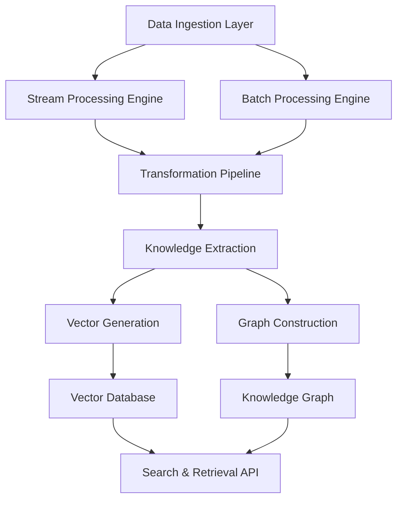

The Knowledge Pipeline Service provides enterprise-grade data processing capabilities for ingesting, transforming, and structuring data into actionable knowledge for AI systems.

## Service Overview

The Knowledge Pipeline Service orchestrates the complete data-to-knowledge transformation lifecycle, from raw data ingestion through structured knowledge graph construction and vector embeddings generation. It supports real-time streaming and batch processing modes with automatic scaling.

### Key Capabilities

- **Real-time Data Processing**: Stream processing with Apache Kafka and Apache Flink
- **ETL Pipeline Management**: Configurable extraction, transformation, and loading workflows  
- **Knowledge Graph Construction**: Automated entity extraction and relationship mapping
- **Vector Database Integration**: Embeddings generation and similarity search optimization
- **Multi-format Support**: Text, documents, APIs, databases, and structured data sources
- **Incremental Updates**: Efficient change detection and delta processing

## Architecture Design

### Core Components



### System Architecture

```kotlin
// Core service architecture
@Service
@Component("knowledgePipelineService")
class KnowledgePipelineService(
    private val dataIngestionService: DataIngestionService,
    private val streamProcessor: StreamProcessor,
    private val batchProcessor: BatchProcessor,
    private val knowledgeExtractor: KnowledgeExtractor,
    private val vectorGenerator: VectorGenerator,
    private val graphBuilder: GraphBuilder,
    private val pipelineOrchestrator: PipelineOrchestrator
) {
    
    suspend fun createPipeline(request: PipelineCreationRequest): PipelineResponse {
        // Validate pipeline configuration
        validatePipelineConfig(request.config)
        
        // Create pipeline instance
        val pipeline = Pipeline(
            id = UUID.randomUUID().toString(),
            name = request.name,
            config = request.config,
            status = PipelineStatus.CREATING
        )
        
        // Deploy pipeline components
        val deployment = pipelineOrchestrator.deployPipeline(pipeline)
        
        // Start data ingestion
        dataIngestionService.startIngestion(
            pipelineId = pipeline.id,
            sources = request.config.dataSources
        )
        
        return PipelineResponse(
            pipelineId = pipeline.id,
            status = pipeline.status,
            endpoints = deployment.endpoints
        )
    }
}
```

## API Specifications

### REST API Endpoints

#### Pipeline Management

```yaml
# OpenAPI Specification
openapi: 3.0.3
info:
  title: Knowledge Pipeline Service API
  version: 1.0.0
  description: Enterprise knowledge processing and pipeline management

paths:
  /api/v1/pipelines:
    post:
      summary: Create knowledge pipeline
      operationId: createPipeline
      requestBody:
        required: true
        content:
          application/json:
            schema:
              $ref: '#/components/schemas/PipelineCreationRequest'
      responses:
        '201':
          description: Pipeline created
          content:
            application/json:
              schema:
                $ref: '#/components/schemas/PipelineResponse'
        '400':
          description: Invalid pipeline configuration
        '429':
          description: Pipeline quota exceeded

    get:
      summary: List pipelines
      parameters:
        - name: status
          in: query
          schema:
            type: string
            enum: [creating, running, stopped, failed, deleted]
        - name: type
          in: query
          schema:
            type: string
            enum: [streaming, batch, hybrid]
        - name: limit
          in: query
          schema:
            type: integer
            default: 50
        - name: offset
          in: query
          schema:
            type: integer
            default: 0
      responses:
        '200':
          description: List of pipelines
          content:
            application/json:
              schema:
                $ref: '#/components/schemas/PipelineList'

  /api/v1/pipelines/{pipelineId}:
    get:
      summary: Get pipeline details
      parameters:
        - name: pipelineId
          in: path
          required: true
          schema:
            type: string
      responses:
        '200':
          description: Pipeline details
          content:
            application/json:
              schema:
                $ref: '#/components/schemas/Pipeline'
        '404':
          description: Pipeline not found

    patch:
      summary: Update pipeline configuration
      parameters:
        - name: pipelineId
          in: path
          required: true
          schema:
            type: string
      requestBody:
        required: true
        content:
          application/json:
            schema:
              $ref: '#/components/schemas/PipelineUpdateRequest'
      responses:
        '200':
          description: Pipeline updated
          content:
            application/json:
              schema:
                $ref: '#/components/schemas/Pipeline'
        '404':
          description: Pipeline not found
        '409':
          description: Cannot update running pipeline

    delete:
      summary: Delete pipeline
      parameters:
        - name: pipelineId
          in: path
          required: true
          schema:
            type: string
      responses:
        '204':
          description: Pipeline deleted
        '404':
          description: Pipeline not found
        '409':
          description: Cannot delete running pipeline

  /api/v1/pipelines/{pipelineId}/start:
    post:
      summary: Start pipeline execution
      parameters:
        - name: pipelineId
          in: path
          required: true
          schema:
            type: string
      responses:
        '202':
          description: Pipeline start initiated
          content:
            application/json:
              schema:
                $ref: '#/components/schemas/PipelineOperationResponse'

  /api/v1/pipelines/{pipelineId}/stop:
    post:
      summary: Stop pipeline execution
      parameters:
        - name: pipelineId
          in: path
          required: true
          schema:
            type: string
      responses:
        '202':
          description: Pipeline stop initiated
          content:
            application/json:
              schema:
                $ref: '#/components/schemas/PipelineOperationResponse'

  /api/v1/pipelines/{pipelineId}/metrics:
    get:
      summary: Get pipeline metrics
      parameters:
        - name: pipelineId
          in: path
          required: true
          schema:
            type: string
        - name: timeRange
          in: query
          schema:
            type: string
            enum: [1h, 6h, 24h, 7d, 30d]
            default: 1h
      responses:
        '200':
          description: Pipeline metrics
          content:
            application/json:
              schema:
                $ref: '#/components/schemas/PipelineMetrics'

  /api/v1/pipelines/{pipelineId}/logs:
    get:
      summary: Stream pipeline logs
      parameters:
        - name: pipelineId
          in: path
          required: true
          schema:
            type: string
        - name: follow
          in: query
          schema:
            type: boolean
            default: false
        - name: level
          in: query
          schema:
            type: string
            enum: [debug, info, warn, error]
            default: info
      responses:
        '200':
          description: Pipeline logs
          content:
            text/plain:
              schema:
                type: string
            application/x-ndjson:
              schema:
                $ref: '#/components/schemas/LogEntry'

  /api/v1/data-sources:
    get:
      summary: List supported data sources
      responses:
        '200':
          description: Supported data sources
          content:
            application/json:
              schema:
                $ref: '#/components/schemas/DataSourceList'

    post:
      summary: Register new data source
      requestBody:
        required: true
        content:
          application/json:
            schema:
              $ref: '#/components/schemas/DataSourceRegistration'
      responses:
        '201':
          description: Data source registered
          content:
            application/json:
              schema:
                $ref: '#/components/schemas/DataSource'

  /api/v1/data-sources/{sourceId}/test:
    post:
      summary: Test data source connectivity
      parameters:
        - name: sourceId
          in: path
          required: true
          schema:
            type: string
      responses:
        '200':
          description: Connection test results
          content:
            application/json:
              schema:
                $ref: '#/components/schemas/ConnectionTestResult'

  /api/v1/knowledge/entities:
    get:
      summary: Search knowledge entities
      parameters:
        - name: query
          in: query
          required: true
          schema:
            type: string
        - name: type
          in: query
          schema:
            type: string
        - name: limit
          in: query
          schema:
            type: integer
            default: 20
        - name: offset
          in: query
          schema:
            type: integer
            default: 0
      responses:
        '200':
          description: Knowledge entities
          content:
            application/json:
              schema:
                $ref: '#/components/schemas/EntitySearchResult'

  /api/v1/knowledge/relationships:
    get:
      summary: Get entity relationships
      parameters:
        - name: entityId
          in: query
          required: true
          schema:
            type: string
        - name: relationshipType
          in: query
          schema:
            type: string
        - name: depth
          in: query
          schema:
            type: integer
            default: 1
            minimum: 1
            maximum: 5
      responses:
        '200':
          description: Entity relationships
          content:
            application/json:
              schema:
                $ref: '#/components/schemas/RelationshipGraph'

  /api/v1/knowledge/search:
    post:
      summary: Semantic knowledge search
      requestBody:
        required: true
        content:
          application/json:
            schema:
              $ref: '#/components/schemas/SemanticSearchRequest'
      responses:
        '200':
          description: Search results
          content:
            application/json:
              schema:
                $ref: '#/components/schemas/SemanticSearchResponse'

components:
  schemas:
    PipelineCreationRequest:
      type: object
      required:
        - name
        - config
      properties:
        name:
          type: string
          example: "customer-knowledge-pipeline"
        description:
          type: string
        config:
          $ref: '#/components/schemas/PipelineConfig'
        tags:
          type: array
          items:
            type: string

    PipelineConfig:
      type: object
      required:
        - type
        - dataSources
        - transformations
        - outputs
      properties:
        type:
          type: string
          enum: [streaming, batch, hybrid]
        dataSources:
          type: array
          items:
            $ref: '#/components/schemas/DataSourceConfig'
        transformations:
          type: array
          items:
            $ref: '#/components/schemas/TransformationConfig'
        outputs:
          type: array
          items:
            $ref: '#/components/schemas/OutputConfig'
        scheduling:
          $ref: '#/components/schemas/SchedulingConfig'
        resources:
          $ref: '#/components/schemas/ResourceConfig'

    DataSourceConfig:
      type: object
      required:
        - type
        - connection
      properties:
        id:
          type: string
        type:
          type: string
          enum: [database, api, file, kafka, webhook, s3]
        connection:
          $ref: '#/components/schemas/ConnectionConfig'
        schema:
          type: object
          description: "Expected data schema"
        polling:
          $ref: '#/components/schemas/PollingConfig'

    ConnectionConfig:
      type: object
      properties:
        url:
          type: string
        credentials:
          type: object
          properties:
            type:
              type: string
              enum: [basic, bearer, oauth2, api_key, certificate]
            username:
              type: string
            password:
              type: string
              format: password
            token:
              type: string
            api_key:
              type: string
            certificate:
              type: string
        headers:
          type: object
          additionalProperties:
            type: string
        parameters:
          type: object
          additionalProperties: true

    TransformationConfig:
      type: object
      required:
        - type
        - config
      properties:
        id:
          type: string
        type:
          type: string
          enum: [filter, map, enrich, validate, extract, aggregate]
        config:
          type: object
          additionalProperties: true
        dependencies:
          type: array
          items:
            type: string

    OutputConfig:
      type: object
      required:
        - type
        - destination
      properties:
        type:
          type: string
          enum: [knowledge_graph, vector_db, database, file, api]
        destination:
          $ref: '#/components/schemas/DestinationConfig'
        format:
          type: string
          enum: [json, csv, parquet, avro]

    Pipeline:
      type: object
      properties:
        id:
          type: string
          format: uuid
        name:
          type: string
        description:
          type: string
        status:
          type: string
          enum: [creating, running, stopped, failed, deleted]
        config:
          $ref: '#/components/schemas/PipelineConfig'
        metrics:
          $ref: '#/components/schemas/PipelineMetrics'
        created_at:
          type: string
          format: date-time
        updated_at:
          type: string
          format: date-time
        started_at:
          type: string
          format: date-time
        stopped_at:
          type: string
          format: date-time

    PipelineMetrics:
      type: object
      properties:
        records_processed:
          type: integer
          format: int64
        records_per_second:
          type: number
        error_rate:
          type: number
          minimum: 0
          maximum: 1
        latency_p95:
          type: number
        latency_p99:
          type: number
        cpu_usage:
          type: number
        memory_usage:
          type: number
        disk_usage:
          type: number

    SemanticSearchRequest:
      type: object
      required:
        - query
      properties:
        query:
          type: string
          example: "sustainable energy solutions"
        filters:
          type: object
          properties:
            entity_types:
              type: array
              items:
                type: string
            date_range:
              type: object
              properties:
                start:
                  type: string
                  format: date-time
                end:
                  type: string
                  format: date-time
            source:
              type: array
              items:
                type: string
        options:
          type: object
          properties:
            limit:
              type: integer
              default: 10
              minimum: 1
              maximum: 100
            similarity_threshold:
              type: number
              default: 0.7
              minimum: 0
              maximum: 1
            include_relationships:
              type: boolean
              default: false

    SemanticSearchResponse:
      type: object
      properties:
        results:
          type: array
          items:
            $ref: '#/components/schemas/SearchResult'
        total_results:
          type: integer
        execution_time_ms:
          type: integer
        query_vector:
          type: array
          items:
            type: number

    SearchResult:
      type: object
      properties:
        id:
          type: string
        type:
          type: string
        content:
          type: string
        metadata:
          type: object
          additionalProperties: true
        similarity_score:
          type: number
        relationships:
          type: array
          items:
            $ref: '#/components/schemas/Relationship'

  securitySchemes:
    BearerAuth:
      type: http
      scheme: bearer
      bearerFormat: JWT
    ApiKeyAuth:
      type: apiKey
      in: header
      name: X-API-Key

security:
  - BearerAuth: []
  - ApiKeyAuth: []
```

### GraphQL API

```graphql
# GraphQL schema for advanced querying
type Query {
  pipelines(
    filter: PipelineFilter
    sort: PipelineSort
    pagination: PaginationInput
  ): PipelineConnection!
  
  pipeline(id: ID!): Pipeline
  
  knowledgeSearch(
    query: String!
    filters: SearchFilters
    options: SearchOptions
  ): KnowledgeSearchResult!
  
  entities(
    filter: EntityFilter
    pagination: PaginationInput
  ): EntityConnection!
  
  entity(id: ID!): Entity
  
  relationships(
    entityId: ID!
    types: [String!]
    depth: Int = 1
  ): RelationshipGraph!
}

type Mutation {
  createPipeline(input: PipelineInput!): PipelinePayload!
  updatePipeline(id: ID!, input: PipelineUpdateInput!): PipelinePayload!
  deletePipeline(id: ID!): DeletePayload!
  
  startPipeline(id: ID!): PipelineOperationPayload!
  stopPipeline(id: ID!): PipelineOperationPayload!
  
  registerDataSource(input: DataSourceInput!): DataSourcePayload!
  testDataSource(id: ID!): ConnectionTestPayload!
}

type Subscription {
  pipelineMetrics(pipelineId: ID!): PipelineMetricsUpdate!
  pipelineLogs(pipelineId: ID!): LogEntry!
  knowledgeUpdates(entityTypes: [String!]): KnowledgeUpdate!
}

# Core types
type Pipeline {
  id: ID!
  name: String!
  description: String
  status: PipelineStatus!
  config: PipelineConfig!
  metrics: PipelineMetrics
  dataSources: [DataSource!]!
  transformations: [Transformation!]!
  outputs: [Output!]!
  createdAt: DateTime!
  updatedAt: DateTime!
  startedAt: DateTime
  stoppedAt: DateTime
}

enum PipelineStatus {
  CREATING
  RUNNING
  STOPPED
  FAILED
  DELETED
}

type Entity {
  id: ID!
  type: String!
  name: String!
  properties: JSON!
  relationships: [Relationship!]!
  sources: [String!]!
  confidence: Float!
  createdAt: DateTime!
  updatedAt: DateTime!
}

type Relationship {
  id: ID!
  type: String!
  source: Entity!
  target: Entity!
  properties: JSON!
  confidence: Float!
  createdAt: DateTime!
}

# Custom scalars
scalar DateTime
scalar JSON
```

### gRPC Service Definition

```protobuf
// knowledge_pipeline.proto
syntax = "proto3";

package aimatrix.knowledge.v1;

import "google/protobuf/timestamp.proto";
import "google/protobuf/struct.proto";
import "google/protobuf/empty.proto";

// Knowledge Pipeline Service
service KnowledgePipelineService {
  // Pipeline management
  rpc CreatePipeline(CreatePipelineRequest) returns (CreatePipelineResponse);
  rpc GetPipeline(GetPipelineRequest) returns (Pipeline);
  rpc ListPipelines(ListPipelinesRequest) returns (ListPipelinesResponse);
  rpc UpdatePipeline(UpdatePipelineRequest) returns (Pipeline);
  rpc DeletePipeline(DeletePipelineRequest) returns (google.protobuf.Empty);
  
  // Pipeline operations
  rpc StartPipeline(PipelineOperationRequest) returns (PipelineOperationResponse);
  rpc StopPipeline(PipelineOperationRequest) returns (PipelineOperationResponse);
  
  // Monitoring
  rpc GetPipelineMetrics(GetPipelineMetricsRequest) returns (PipelineMetrics);
  rpc StreamPipelineLogs(StreamLogsRequest) returns (stream LogEntry);
  
  // Knowledge queries
  rpc SearchKnowledge(SearchKnowledgeRequest) returns (SearchKnowledgeResponse);
  rpc GetEntity(GetEntityRequest) returns (Entity);
  rpc GetRelationships(GetRelationshipsRequest) returns (RelationshipGraph);
}

// Data Source Service
service DataSourceService {
  rpc RegisterDataSource(RegisterDataSourceRequest) returns (DataSource);
  rpc TestDataSource(TestDataSourceRequest) returns (ConnectionTestResult);
  rpc ListDataSources(ListDataSourcesRequest) returns (ListDataSourcesResponse);
}

// Request/Response Messages
message CreatePipelineRequest {
  string name = 1;
  string description = 2;
  PipelineConfig config = 3;
  repeated string tags = 4;
}

message CreatePipelineResponse {
  string pipeline_id = 1;
  PipelineStatus status = 2;
  google.protobuf.Timestamp created_at = 3;
  repeated Endpoint endpoints = 4;
}

message Pipeline {
  string id = 1;
  string name = 2;
  string description = 3;
  PipelineStatus status = 4;
  PipelineConfig config = 5;
  PipelineMetrics metrics = 6;
  google.protobuf.Timestamp created_at = 7;
  google.protobuf.Timestamp updated_at = 8;
  google.protobuf.Timestamp started_at = 9;
  google.protobuf.Timestamp stopped_at = 10;
}

message PipelineConfig {
  PipelineType type = 1;
  repeated DataSourceConfig data_sources = 2;
  repeated TransformationConfig transformations = 3;
  repeated OutputConfig outputs = 4;
  SchedulingConfig scheduling = 5;
  ResourceConfig resources = 6;
}

message DataSourceConfig {
  string id = 1;
  DataSourceType type = 2;
  ConnectionConfig connection = 3;
  google.protobuf.Struct schema = 4;
  PollingConfig polling = 5;
}

message Entity {
  string id = 1;
  string type = 2;
  string name = 3;
  google.protobuf.Struct properties = 4;
  repeated Relationship relationships = 5;
  repeated string sources = 6;
  float confidence = 7;
  google.protobuf.Timestamp created_at = 8;
  google.protobuf.Timestamp updated_at = 9;
}

// Enums
enum PipelineStatus {
  PIPELINE_STATUS_UNSPECIFIED = 0;
  PIPELINE_STATUS_CREATING = 1;
  PIPELINE_STATUS_RUNNING = 2;
  PIPELINE_STATUS_STOPPED = 3;
  PIPELINE_STATUS_FAILED = 4;
  PIPELINE_STATUS_DELETED = 5;
}

enum PipelineType {
  PIPELINE_TYPE_UNSPECIFIED = 0;
  PIPELINE_TYPE_STREAMING = 1;
  PIPELINE_TYPE_BATCH = 2;
  PIPELINE_TYPE_HYBRID = 3;
}

enum DataSourceType {
  DATA_SOURCE_TYPE_UNSPECIFIED = 0;
  DATA_SOURCE_TYPE_DATABASE = 1;
  DATA_SOURCE_TYPE_API = 2;
  DATA_SOURCE_TYPE_FILE = 3;
  DATA_SOURCE_TYPE_KAFKA = 4;
  DATA_SOURCE_TYPE_WEBHOOK = 5;
  DATA_SOURCE_TYPE_S3 = 6;
}
```

## Implementation Examples

### Kotlin/Spring Boot Service Implementation

```kotlin
// Main service implementation
@Service
@Transactional
@Component("knowledgePipelineService")
class KnowledgePipelineServiceImpl(
    private val pipelineRepository: PipelineRepository,
    private val dataSourceService: DataSourceService,
    private val streamProcessor: StreamProcessor,
    private val batchProcessor: BatchProcessor,
    private val knowledgeExtractor: KnowledgeExtractor,
    private val vectorService: VectorService,
    private val graphService: GraphService,
    private val metricsCollector: MetricsCollector
) : KnowledgePipelineService {

    private val logger = LoggerFactory.getLogger(KnowledgePipelineServiceImpl::class.java)

    @Async
    override suspend fun createPipeline(request: PipelineCreationRequest): PipelineResponse {
        logger.info("Creating pipeline: ${request.name}")
        
        // Validate configuration
        validatePipelineConfig(request.config)
        
        // Create pipeline entity
        val pipeline = PipelineEntity(
            id = UUID.randomUUID().toString(),
            name = request.name,
            description = request.description,
            config = request.config,
            status = PipelineStatus.CREATING,
            tags = request.tags,
            createdAt = Instant.now()
        )
        
        pipelineRepository.save(pipeline)
        
        try {
            // Deploy pipeline infrastructure
            val deployment = deployPipelineInfrastructure(pipeline)
            
            // Initialize data sources
            initializeDataSources(pipeline.config.dataSources)
            
            // Set up transformations
            setupTransformations(pipeline.id, pipeline.config.transformations)
            
            // Configure outputs
            configureOutputs(pipeline.id, pipeline.config.outputs)
            
            // Update pipeline status
            pipeline.status = PipelineStatus.STOPPED // Ready to start
            pipeline.updatedAt = Instant.now()
            pipelineRepository.save(pipeline)
            
            return PipelineResponse(
                pipelineId = pipeline.id,
                status = pipeline.status,
                endpoints = deployment.endpoints,
                createdAt = pipeline.createdAt
            )
            
        } catch (e: Exception) {
            logger.error("Failed to create pipeline: ${pipeline.id}", e)
            pipeline.status = PipelineStatus.FAILED
            pipeline.updatedAt = Instant.now()
            pipelineRepository.save(pipeline)
            throw PipelineCreationException("Failed to create pipeline", e)
        }
    }

    override suspend fun startPipeline(pipelineId: String): PipelineOperationResponse {
        val pipeline = pipelineRepository.findById(pipelineId)
            ?: throw PipelineNotFoundException(pipelineId)
        
        if (pipeline.status !in setOf(PipelineStatus.STOPPED, PipelineStatus.FAILED)) {
            throw IllegalStateException("Cannot start pipeline in status: ${pipeline.status}")
        }
        
        logger.info("Starting pipeline: $pipelineId")
        
        try {
            // Start processing based on pipeline type
            when (pipeline.config.type) {
                PipelineType.STREAMING -> startStreamingPipeline(pipeline)
                PipelineType.BATCH -> startBatchPipeline(pipeline)
                PipelineType.HYBRID -> startHybridPipeline(pipeline)
            }
            
            pipeline.status = PipelineStatus.RUNNING
            pipeline.startedAt = Instant.now()
            pipeline.updatedAt = Instant.now()
            pipelineRepository.save(pipeline)
            
            // Start metrics collection
            metricsCollector.startCollection(pipelineId)
            
            return PipelineOperationResponse(
                pipelineId = pipelineId,
                operation = "start",
                status = "success",
                timestamp = Instant.now()
            )
            
        } catch (e: Exception) {
            logger.error("Failed to start pipeline: $pipelineId", e)
            pipeline.status = PipelineStatus.FAILED
            pipeline.updatedAt = Instant.now()
            pipelineRepository.save(pipeline)
            throw PipelineOperationException("Failed to start pipeline", e)
        }
    }

    override suspend fun stopPipeline(pipelineId: String): PipelineOperationResponse {
        val pipeline = pipelineRepository.findById(pipelineId)
            ?: throw PipelineNotFoundException(pipelineId)
        
        if (pipeline.status != PipelineStatus.RUNNING) {
            throw IllegalStateException("Cannot stop pipeline in status: ${pipeline.status}")
        }
        
        logger.info("Stopping pipeline: $pipelineId")
        
        try {
            // Stop processing components
            when (pipeline.config.type) {
                PipelineType.STREAMING -> stopStreamingPipeline(pipeline)
                PipelineType.BATCH -> stopBatchPipeline(pipeline)
                PipelineType.HYBRID -> stopHybridPipeline(pipeline)
            }
            
            // Stop metrics collection
            metricsCollector.stopCollection(pipelineId)
            
            pipeline.status = PipelineStatus.STOPPED
            pipeline.stoppedAt = Instant.now()
            pipeline.updatedAt = Instant.now()
            pipelineRepository.save(pipeline)
            
            return PipelineOperationResponse(
                pipelineId = pipelineId,
                operation = "stop",
                status = "success",
                timestamp = Instant.now()
            )
            
        } catch (e: Exception) {
            logger.error("Failed to stop pipeline: $pipelineId", e)
            throw PipelineOperationException("Failed to stop pipeline", e)
        }
    }

    override suspend fun searchKnowledge(request: SemanticSearchRequest): SemanticSearchResponse {
        logger.info("Performing knowledge search: ${request.query}")
        
        // Generate query vector
        val queryVector = vectorService.generateEmbedding(request.query)
        
        // Perform vector similarity search
        val vectorResults = vectorService.similaritySearch(
            vector = queryVector,
            limit = request.options.limit,
            threshold = request.options.similarityThreshold,
            filters = request.filters
        )
        
        // Enhance results with graph relationships if requested
        val enhancedResults = if (request.options.includeRelationships) {
            vectorResults.map { result ->
                val relationships = graphService.getEntityRelationships(
                    entityId = result.id,
                    depth = 1
                )
                result.copy(relationships = relationships)
            }
        } else {
            vectorResults
        }
        
        return SemanticSearchResponse(
            results = enhancedResults,
            totalResults = vectorResults.size,
            executionTimeMs = System.currentTimeMillis(), // Calculate actual time
            queryVector = queryVector
        )
    }

    private suspend fun startStreamingPipeline(pipeline: PipelineEntity) {
        logger.info("Starting streaming pipeline: ${pipeline.id}")
        
        // Configure Kafka consumers
        val consumers = pipeline.config.dataSources
            .filter { it.type == DataSourceType.KAFKA }
            .map { source ->
                streamProcessor.createConsumer(
                    pipelineId = pipeline.id,
                    config = source,
                    processor = createStreamProcessor(pipeline.config.transformations)
                )
            }
        
        // Start consumers
        consumers.forEach { consumer ->
            streamProcessor.startConsumer(consumer)
        }
        
        // Configure other streaming sources (webhooks, APIs)
        configureStreamingSources(pipeline)
    }

    private suspend fun startBatchPipeline(pipeline: PipelineEntity) {
        logger.info("Starting batch pipeline: ${pipeline.id}")
        
        // Create batch job
        val job = batchProcessor.createJob(
            pipelineId = pipeline.id,
            config = pipeline.config,
            schedule = pipeline.config.scheduling
        )
        
        // Execute batch job
        batchProcessor.executeJob(job)
    }

    private suspend fun startHybridPipeline(pipeline: PipelineEntity) {
        logger.info("Starting hybrid pipeline: ${pipeline.id}")
        
        // Start both streaming and batch components
        startStreamingPipeline(pipeline)
        startBatchPipeline(pipeline)
    }

    private fun validatePipelineConfig(config: PipelineConfig) {
        // Validate data sources
        if (config.dataSources.isEmpty()) {
            throw ValidationException("At least one data source is required")
        }
        
        // Validate transformations
        config.transformations.forEach { transformation ->
            validateTransformation(transformation)
        }
        
        // Validate outputs
        if (config.outputs.isEmpty()) {
            throw ValidationException("At least one output is required")
        }
        
        // Validate dependencies
        validateTransformationDependencies(config.transformations)
    }
    
    private fun validateTransformation(transformation: TransformationConfig) {
        when (transformation.type) {
            TransformationType.FILTER -> validateFilterTransformation(transformation)
            TransformationType.MAP -> validateMapTransformation(transformation)
            TransformationType.ENRICH -> validateEnrichTransformation(transformation)
            TransformationType.VALIDATE -> validateValidateTransformation(transformation)
            TransformationType.EXTRACT -> validateExtractTransformation(transformation)
            TransformationType.AGGREGATE -> validateAggregateTransformation(transformation)
        }
    }
}

// Stream processor implementation using Apache Kafka Streams
@Component
class KafkaStreamProcessor(
    private val kafkaStreamsFactory: KafkaStreamsFactory,
    private val knowledgeExtractor: KnowledgeExtractor,
    private val vectorService: VectorService,
    private val graphService: GraphService
) : StreamProcessor {
    
    private val activeStreams = ConcurrentHashMap<String, KafkaStreams>()
    
    override suspend fun createConsumer(
        pipelineId: String,
        config: DataSourceConfig,
        processor: StreamProcessorChain
    ): StreamConsumer {
        
        val streamBuilder = StreamsBuilder()
        
        // Create stream from source topic
        val sourceStream = streamBuilder.stream<String, String>(config.connection.topic)
        
        // Apply transformations
        val processedStream = processor.process(sourceStream)
        
        // Extract knowledge and generate vectors
        val knowledgeStream = processedStream
            .mapValues { value ->
                // Extract entities and relationships
                val entities = knowledgeExtractor.extractEntities(value)
                val relationships = knowledgeExtractor.extractRelationships(value)
                
                KnowledgeData(
                    originalData = value,
                    entities = entities,
                    relationships = relationships,
                    vectors = vectorService.generateEmbeddings(entities)
                )
            }
        
        // Write to knowledge graph and vector database
        knowledgeStream.foreach { key, knowledge ->
            // Store entities in graph
            knowledge.entities.forEach { entity ->
                graphService.storeEntity(entity)
            }
            
            // Store relationships
            knowledge.relationships.forEach { relationship ->
                graphService.storeRelationship(relationship)
            }
            
            // Store vectors
            vectorService.storeVectors(knowledge.vectors)
        }
        
        val streams = kafkaStreamsFactory.createStreams(
            streamBuilder.build(),
            getStreamProperties(pipelineId)
        )
        
        return StreamConsumer(
            pipelineId = pipelineId,
            consumerId = UUID.randomUUID().toString(),
            streams = streams,
            config = config
        )
    }
    
    override suspend fun startConsumer(consumer: StreamConsumer) {
        consumer.streams.start()
        activeStreams[consumer.consumerId] = consumer.streams
    }
    
    override suspend fun stopConsumer(consumerId: String) {
        activeStreams[consumerId]?.close()
        activeStreams.remove(consumerId)
    }
    
    private fun getStreamProperties(pipelineId: String): Properties {
        return Properties().apply {
            put(StreamsConfig.APPLICATION_ID_CONFIG, "knowledge-pipeline-$pipelineId")
            put(StreamsConfig.BOOTSTRAP_SERVERS_CONFIG, "localhost:9092")
            put(StreamsConfig.DEFAULT_KEY_SERDE_CLASS_CONFIG, Serdes.String()::class.java)
            put(StreamsConfig.DEFAULT_VALUE_SERDE_CLASS_CONFIG, Serdes.String()::class.java)
            put(StreamsConfig.PROCESSING_GUARANTEE_CONFIG, StreamsConfig.EXACTLY_ONCE_V2)
        }
    }
}

// Knowledge extraction service
@Service
class KnowledgeExtractionService(
    private val nlpService: NLPService,
    private val entityRecognizer: EntityRecognizer,
    private val relationshipExtractor: RelationshipExtractor
) : KnowledgeExtractor {
    
    override suspend fun extractEntities(text: String): List<Entity> {
        // Use NLP for entity recognition
        val namedEntities = nlpService.extractNamedEntities(text)
        
        // Custom entity recognition for domain-specific entities
        val domainEntities = entityRecognizer.recognizeEntities(text)
        
        // Combine and deduplicate
        return (namedEntities + domainEntities)
            .distinctBy { it.name.lowercase() }
            .map { namedEntity ->
                Entity(
                    id = UUID.randomUUID().toString(),
                    name = namedEntity.name,
                    type = namedEntity.type,
                    properties = mapOf(
                        "confidence" to namedEntity.confidence,
                        "source_text" to text,
                        "position" to namedEntity.position
                    ),
                    sources = listOf("nlp_extraction"),
                    confidence = namedEntity.confidence,
                    createdAt = Instant.now()
                )
            }
    }
    
    override suspend fun extractRelationships(text: String): List<Relationship> {
        // Extract entities first
        val entities = extractEntities(text)
        
        // Use relationship extraction models
        return relationshipExtractor.extractRelationships(text, entities)
            .map { extractedRel ->
                Relationship(
                    id = UUID.randomUUID().toString(),
                    type = extractedRel.type,
                    sourceId = extractedRel.sourceEntity.id,
                    targetId = extractedRel.targetEntity.id,
                    properties = mapOf(
                        "confidence" to extractedRel.confidence,
                        "source_text" to text,
                        "extracted_phrase" to extractedRel.phrase
                    ),
                    confidence = extractedRel.confidence,
                    createdAt = Instant.now()
                )
            }
    }
    
    override suspend fun extractKnowledge(data: Any): KnowledgeData {
        val text = when (data) {
            is String -> data
            is Map<*, *> -> data.values.joinToString(" ")
            else -> data.toString()
        }
        
        val entities = extractEntities(text)
        val relationships = extractRelationships(text)
        
        return KnowledgeData(
            originalData = data,
            entities = entities,
            relationships = relationships,
            vectors = emptyList() // Will be generated by vector service
        )
    }
}

// Vector service for embeddings and similarity search
@Service
class VectorService(
    private val embeddingModel: EmbeddingModel,
    private val vectorDatabase: VectorDatabase,
    private val dimensionalityReducer: DimensionalityReducer
) {
    
    suspend fun generateEmbedding(text: String): List<Float> {
        return embeddingModel.encode(text)
    }
    
    suspend fun generateEmbeddings(entities: List<Entity>): List<EntityVector> {
        return entities.map { entity ->
            val text = buildEntityText(entity)
            val vector = generateEmbedding(text)
            
            EntityVector(
                entityId = entity.id,
                vector = vector,
                dimensions = vector.size,
                model = embeddingModel.name,
                createdAt = Instant.now()
            )
        }
    }
    
    suspend fun similaritySearch(
        vector: List<Float>,
        limit: Int,
        threshold: Float,
        filters: SearchFilters?
    ): List<SearchResult> {
        return vectorDatabase.search(
            queryVector = vector,
            limit = limit,
            threshold = threshold,
            filters = filters
        )
    }
    
    suspend fun storeVectors(vectors: List<EntityVector>) {
        vectors.forEach { vector ->
            vectorDatabase.store(vector)
        }
    }
    
    private fun buildEntityText(entity: Entity): String {
        val properties = entity.properties.entries
            .joinToString(" ") { "${it.key}: ${it.value}" }
        return "${entity.name} ${entity.type} $properties"
    }
}
```

## Database Schema & Models

### PostgreSQL Schema

```sql
-- Pipelines table
CREATE TABLE pipelines (
    id UUID PRIMARY KEY DEFAULT gen_random_uuid(),
    name VARCHAR(255) NOT NULL,
    description TEXT,
    user_id UUID NOT NULL,
    status VARCHAR(50) NOT NULL DEFAULT 'creating',
    type VARCHAR(50) NOT NULL,
    
    -- Configuration stored as JSONB
    config JSONB NOT NULL,
    
    -- Resource allocation
    resource_allocation JSONB,
    
    -- Timestamps
    created_at TIMESTAMP WITH TIME ZONE DEFAULT NOW(),
    updated_at TIMESTAMP WITH TIME ZONE DEFAULT NOW(),
    started_at TIMESTAMP WITH TIME ZONE,
    stopped_at TIMESTAMP WITH TIME ZONE,
    
    -- Tags for organization
    tags TEXT[] DEFAULT '{}',
    
    -- Constraints
    CONSTRAINT pipelines_status_check CHECK (
        status IN ('creating', 'running', 'stopped', 'failed', 'deleted')
    ),
    CONSTRAINT pipelines_type_check CHECK (
        type IN ('streaming', 'batch', 'hybrid')
    )
);

-- Indexes
CREATE INDEX idx_pipelines_user_status ON pipelines(user_id, status);
CREATE INDEX idx_pipelines_status_created ON pipelines(status, created_at DESC);
CREATE INDEX idx_pipelines_type ON pipelines(type);
CREATE INDEX idx_pipelines_tags ON pipelines USING GIN(tags);
CREATE INDEX idx_pipelines_config ON pipelines USING GIN(config);

-- Data sources table
CREATE TABLE data_sources (
    id UUID PRIMARY KEY DEFAULT gen_random_uuid(),
    name VARCHAR(255) NOT NULL,
    type VARCHAR(50) NOT NULL,
    connection_config JSONB NOT NULL,
    schema_config JSONB,
    
    -- Status and health
    status VARCHAR(50) NOT NULL DEFAULT 'active',
    last_health_check TIMESTAMP WITH TIME ZONE,
    health_status VARCHAR(50) DEFAULT 'unknown',
    
    -- Timestamps
    created_at TIMESTAMP WITH TIME ZONE DEFAULT NOW(),
    updated_at TIMESTAMP WITH TIME ZONE DEFAULT NOW(),
    
    -- Constraints
    CONSTRAINT data_sources_type_check CHECK (
        type IN ('database', 'api', 'file', 'kafka', 'webhook', 's3')
    ),
    CONSTRAINT data_sources_status_check CHECK (
        status IN ('active', 'inactive', 'error')
    )
);

-- Pipeline executions table (for batch processing)
CREATE TABLE pipeline_executions (
    id UUID PRIMARY KEY DEFAULT gen_random_uuid(),
    pipeline_id UUID NOT NULL REFERENCES pipelines(id) ON DELETE CASCADE,
    
    -- Execution details
    execution_type VARCHAR(50) NOT NULL,
    status VARCHAR(50) NOT NULL DEFAULT 'pending',
    
    -- Timing
    started_at TIMESTAMP WITH TIME ZONE,
    completed_at TIMESTAMP WITH TIME ZONE,
    duration INTERVAL,
    
    -- Statistics
    records_processed BIGINT DEFAULT 0,
    records_failed BIGINT DEFAULT 0,
    bytes_processed BIGINT DEFAULT 0,
    
    -- Error information
    error_message TEXT,
    error_stack TEXT,
    
    -- Configuration snapshot
    config_snapshot JSONB,
    
    created_at TIMESTAMP WITH TIME ZONE DEFAULT NOW()
);

-- Indexes for executions
CREATE INDEX idx_executions_pipeline ON pipeline_executions(pipeline_id);
CREATE INDEX idx_executions_status ON pipeline_executions(status);
CREATE INDEX idx_executions_started ON pipeline_executions(started_at DESC);

-- Knowledge entities table
CREATE TABLE knowledge_entities (
    id UUID PRIMARY KEY DEFAULT gen_random_uuid(),
    name VARCHAR(500) NOT NULL,
    type VARCHAR(100) NOT NULL,
    
    -- Entity properties
    properties JSONB DEFAULT '{}'::jsonb,
    
    -- Source tracking
    sources TEXT[] DEFAULT '{}',
    pipeline_id UUID REFERENCES pipelines(id),
    
    -- Quality metrics
    confidence DECIMAL(3,2) DEFAULT 0.0,
    verification_status VARCHAR(50) DEFAULT 'unverified',
    
    -- Timestamps
    created_at TIMESTAMP WITH TIME ZONE DEFAULT NOW(),
    updated_at TIMESTAMP WITH TIME ZONE DEFAULT NOW(),
    
    -- Full-text search
    search_vector tsvector,
    
    -- Constraints
    CONSTRAINT entities_confidence_check CHECK (confidence >= 0.0 AND confidence <= 1.0)
);

-- Full-text search index
CREATE INDEX idx_entities_search ON knowledge_entities USING GIN(search_vector);
CREATE INDEX idx_entities_type ON knowledge_entities(type);
CREATE INDEX idx_entities_confidence ON knowledge_entities(confidence DESC);
CREATE INDEX idx_entities_pipeline ON knowledge_entities(pipeline_id);
CREATE INDEX idx_entities_properties ON knowledge_entities USING GIN(properties);

-- Trigger for updating search vector
CREATE OR REPLACE FUNCTION update_entity_search_vector()
RETURNS TRIGGER AS $$
BEGIN
    NEW.search_vector := 
        setweight(to_tsvector('english', coalesce(NEW.name, '')), 'A') ||
        setweight(to_tsvector('english', coalesce(NEW.type, '')), 'B') ||
        setweight(to_tsvector('english', coalesce(NEW.properties::text, '')), 'D');
    RETURN NEW;
END;
$$ LANGUAGE plpgsql;

CREATE TRIGGER trigger_update_entity_search_vector
    BEFORE INSERT OR UPDATE ON knowledge_entities
    FOR EACH ROW EXECUTE FUNCTION update_entity_search_vector();

-- Knowledge relationships table
CREATE TABLE knowledge_relationships (
    id UUID PRIMARY KEY DEFAULT gen_random_uuid(),
    type VARCHAR(100) NOT NULL,
    
    -- Relationship endpoints
    source_entity_id UUID NOT NULL REFERENCES knowledge_entities(id) ON DELETE CASCADE,
    target_entity_id UUID NOT NULL REFERENCES knowledge_entities(id) ON DELETE CASCADE,
    
    -- Relationship properties
    properties JSONB DEFAULT '{}'::jsonb,
    
    -- Quality metrics
    confidence DECIMAL(3,2) DEFAULT 0.0,
    verification_status VARCHAR(50) DEFAULT 'unverified',
    
    -- Source tracking
    sources TEXT[] DEFAULT '{}',
    pipeline_id UUID REFERENCES pipelines(id),
    
    -- Timestamps
    created_at TIMESTAMP WITH TIME ZONE DEFAULT NOW(),
    updated_at TIMESTAMP WITH TIME ZONE DEFAULT NOW(),
    
    -- Constraints
    CONSTRAINT relationships_confidence_check CHECK (confidence >= 0.0 AND confidence <= 1.0),
    CONSTRAINT relationships_endpoints_check CHECK (source_entity_id != target_entity_id),
    
    -- Unique constraint to prevent duplicates
    UNIQUE(source_entity_id, target_entity_id, type)
);

-- Indexes for relationships
CREATE INDEX idx_relationships_source ON knowledge_relationships(source_entity_id);
CREATE INDEX idx_relationships_target ON knowledge_relationships(target_entity_id);
CREATE INDEX idx_relationships_type ON knowledge_relationships(type);
CREATE INDEX idx_relationships_confidence ON knowledge_relationships(confidence DESC);
CREATE INDEX idx_relationships_pipeline ON knowledge_relationships(pipeline_id);

-- Vector embeddings table
CREATE TABLE entity_vectors (
    id UUID PRIMARY KEY DEFAULT gen_random_uuid(),
    entity_id UUID NOT NULL REFERENCES knowledge_entities(id) ON DELETE CASCADE,
    
    -- Vector data
    vector REAL[] NOT NULL,
    dimensions INTEGER NOT NULL,
    model VARCHAR(100) NOT NULL,
    
    -- Metadata
    created_at TIMESTAMP WITH TIME ZONE DEFAULT NOW(),
    
    -- Constraints
    CONSTRAINT vectors_dimensions_check CHECK (dimensions > 0 AND dimensions <= 4096),
    
    -- Unique constraint per entity and model
    UNIQUE(entity_id, model)
);

-- Vector similarity index (using pgvector extension)
-- Note: Requires pgvector extension to be installed
-- CREATE EXTENSION IF NOT EXISTS vector;
-- ALTER TABLE entity_vectors ADD COLUMN vector_data vector(1536);
-- CREATE INDEX idx_entity_vectors_similarity ON entity_vectors USING ivfflat(vector_data vector_cosine_ops);

-- Pipeline metrics table (time-series data)
CREATE TABLE pipeline_metrics (
    id BIGSERIAL PRIMARY KEY,
    pipeline_id UUID NOT NULL REFERENCES pipelines(id) ON DELETE CASCADE,
    
    -- Metric details
    metric_name VARCHAR(100) NOT NULL,
    metric_value DOUBLE PRECISION NOT NULL,
    metric_unit VARCHAR(50),
    
    -- Dimensions
    tags JSONB DEFAULT '{}'::jsonb,
    
    -- Timestamp
    timestamp TIMESTAMP WITH TIME ZONE DEFAULT NOW()
);

-- Partitioning for metrics (by month)
CREATE TABLE pipeline_metrics_y2024m01 PARTITION OF pipeline_metrics
    FOR VALUES FROM ('2024-01-01') TO ('2024-02-01');

-- Continue partitioning for other months...

-- Indexes for metrics
CREATE INDEX idx_pipeline_metrics_pipeline_time ON pipeline_metrics(pipeline_id, timestamp DESC);
CREATE INDEX idx_pipeline_metrics_name_time ON pipeline_metrics(metric_name, timestamp DESC);
CREATE INDEX idx_pipeline_metrics_tags ON pipeline_metrics USING GIN(tags);

-- Pipeline logs table
CREATE TABLE pipeline_logs (
    id BIGSERIAL PRIMARY KEY,
    pipeline_id UUID NOT NULL REFERENCES pipelines(id) ON DELETE CASCADE,
    
    -- Log details
    timestamp TIMESTAMP WITH TIME ZONE DEFAULT NOW(),
    level VARCHAR(20) NOT NULL DEFAULT 'INFO',
    message TEXT NOT NULL,
    component VARCHAR(100),
    
    -- Additional context
    context JSONB DEFAULT '{}'::jsonb,
    
    -- Constraints
    CONSTRAINT logs_level_check CHECK (
        level IN ('DEBUG', 'INFO', 'WARN', 'ERROR', 'FATAL')
    )
);

-- Partitioning for logs (by week)
CREATE TABLE pipeline_logs_2024w01 PARTITION OF pipeline_logs
    FOR VALUES FROM ('2024-01-01') TO ('2024-01-08');

-- Continue partitioning...

-- Indexes for logs
CREATE INDEX idx_pipeline_logs_pipeline_time ON pipeline_logs(pipeline_id, timestamp DESC);
CREATE INDEX idx_pipeline_logs_level ON pipeline_logs(level);
CREATE INDEX idx_pipeline_logs_component ON pipeline_logs(component);

-- Data quality rules table
CREATE TABLE data_quality_rules (
    id UUID PRIMARY KEY DEFAULT gen_random_uuid(),
    pipeline_id UUID NOT NULL REFERENCES pipelines(id) ON DELETE CASCADE,
    
    -- Rule definition
    name VARCHAR(255) NOT NULL,
    description TEXT,
    rule_type VARCHAR(50) NOT NULL,
    rule_config JSONB NOT NULL,
    
    -- Rule status
    enabled BOOLEAN DEFAULT true,
    severity VARCHAR(20) DEFAULT 'medium',
    
    -- Timestamps
    created_at TIMESTAMP WITH TIME ZONE DEFAULT NOW(),
    updated_at TIMESTAMP WITH TIME ZONE DEFAULT NOW(),
    
    -- Constraints
    CONSTRAINT quality_rules_type_check CHECK (
        rule_type IN ('completeness', 'uniqueness', 'validity', 'consistency', 'accuracy')
    ),
    CONSTRAINT quality_rules_severity_check CHECK (
        severity IN ('low', 'medium', 'high', 'critical')
    )
);

-- Data quality violations table
CREATE TABLE data_quality_violations (
    id UUID PRIMARY KEY DEFAULT gen_random_uuid(),
    rule_id UUID NOT NULL REFERENCES data_quality_rules(id) ON DELETE CASCADE,
    pipeline_id UUID NOT NULL REFERENCES pipelines(id) ON DELETE CASCADE,
    
    -- Violation details
    violation_type VARCHAR(100) NOT NULL,
    description TEXT NOT NULL,
    affected_records JSONB,
    
    -- Severity and status
    severity VARCHAR(20) NOT NULL,
    status VARCHAR(50) DEFAULT 'open',
    
    -- Resolution
    resolved_at TIMESTAMP WITH TIME ZONE,
    resolution_notes TEXT,
    
    -- Timestamps
    created_at TIMESTAMP WITH TIME ZONE DEFAULT NOW(),
    
    -- Constraints
    CONSTRAINT violations_status_check CHECK (
        status IN ('open', 'acknowledged', 'resolved', 'false_positive')
    )
);

-- Indexes for quality violations
CREATE INDEX idx_violations_rule ON data_quality_violations(rule_id);
CREATE INDEX idx_violations_pipeline ON data_quality_violations(pipeline_id);
CREATE INDEX idx_violations_status ON data_quality_violations(status);
CREATE INDEX idx_violations_severity ON data_quality_violations(severity);
CREATE INDEX idx_violations_created ON data_quality_violations(created_at DESC);

-- Functions and triggers
CREATE OR REPLACE FUNCTION update_updated_at_column()
RETURNS TRIGGER AS $$
BEGIN
    NEW.updated_at = NOW();
    RETURN NEW;
END;
$$ language 'plpgsql';

-- Apply update triggers
CREATE TRIGGER update_pipelines_updated_at BEFORE UPDATE
    ON pipelines FOR EACH ROW EXECUTE FUNCTION update_updated_at_column();

CREATE TRIGGER update_data_sources_updated_at BEFORE UPDATE
    ON data_sources FOR EACH ROW EXECUTE FUNCTION update_updated_at_column();

CREATE TRIGGER update_entities_updated_at BEFORE UPDATE
    ON knowledge_entities FOR EACH ROW EXECUTE FUNCTION update_updated_at_column();

CREATE TRIGGER update_relationships_updated_at BEFORE UPDATE
    ON knowledge_relationships FOR EACH ROW EXECUTE FUNCTION update_updated_at_column();

-- Views for common queries
CREATE VIEW pipeline_summary AS
SELECT 
    p.*,
    COUNT(pe.id) as total_executions,
    COUNT(CASE WHEN pe.status = 'completed' THEN 1 END) as successful_executions,
    COUNT(CASE WHEN pe.status = 'failed' THEN 1 END) as failed_executions,
    MAX(pe.completed_at) as last_execution,
    AVG(EXTRACT(EPOCH FROM pe.duration)) as avg_duration_seconds
FROM pipelines p
LEFT JOIN pipeline_executions pe ON p.id = pe.pipeline_id
GROUP BY p.id;

CREATE VIEW entity_relationship_counts AS
SELECT 
    e.id,
    e.name,
    e.type,
    COUNT(r1.id) as outgoing_relationships,
    COUNT(r2.id) as incoming_relationships,
    (COUNT(r1.id) + COUNT(r2.id)) as total_relationships
FROM knowledge_entities e
LEFT JOIN knowledge_relationships r1 ON e.id = r1.source_entity_id
LEFT JOIN knowledge_relationships r2 ON e.id = r2.target_entity_id
GROUP BY e.id, e.name, e.type;

CREATE VIEW pipeline_health_status AS
SELECT 
    p.id,
    p.name,
    p.status,
    CASE 
        WHEN p.status = 'running' AND pe.status = 'failed' THEN 'unhealthy'
        WHEN p.status = 'running' AND pe.status = 'completed' THEN 'healthy'
        WHEN p.status = 'stopped' THEN 'stopped'
        ELSE 'unknown'
    END as health_status,
    pe.completed_at as last_execution,
    COUNT(dqv.id) as active_violations
FROM pipelines p
LEFT JOIN LATERAL (
    SELECT * FROM pipeline_executions
    WHERE pipeline_id = p.id
    ORDER BY created_at DESC
    LIMIT 1
) pe ON true
LEFT JOIN data_quality_violations dqv ON p.id = dqv.pipeline_id AND dqv.status = 'open'
GROUP BY p.id, p.name, p.status, pe.status, pe.completed_at;
```

### JPA Entity Models

```kotlin
// Pipeline Entity
@Entity
@Table(name = "pipelines")
@EntityListeners(AuditingEntityListener::class)
data class PipelineEntity(
    @Id
    @GeneratedValue(strategy = GenerationType.AUTO)
    val id: String = UUID.randomUUID().toString(),
    
    @Column(nullable = false)
    var name: String,
    
    @Column(columnDefinition = "TEXT")
    var description: String? = null,
    
    @Column(name = "user_id", nullable = false)
    var userId: UUID,
    
    @Enumerated(EnumType.STRING)
    var status: PipelineStatus = PipelineStatus.CREATING,
    
    @Enumerated(EnumType.STRING)
    var type: PipelineType,
    
    @Type(JsonType::class)
    @Column(columnDefinition = "jsonb")
    var config: PipelineConfig,
    
    @Type(JsonType::class)
    @Column(name = "resource_allocation", columnDefinition = "jsonb")
    var resourceAllocation: ResourceAllocation? = null,
    
    @CreatedDate
    @Column(name = "created_at", nullable = false, updatable = false)
    var createdAt: Instant? = null,
    
    @LastModifiedDate
    @Column(name = "updated_at")
    var updatedAt: Instant? = null,
    
    @Column(name = "started_at")
    var startedAt: Instant? = null,
    
    @Column(name = "stopped_at")
    var stoppedAt: Instant? = null,
    
    @Type(ArrayType::class)
    @Column(columnDefinition = "text[]")
    var tags: Array<String> = emptyArray(),
    
    // Relationships
    @OneToMany(mappedBy = "pipeline", cascade = [CascadeType.ALL], fetch = FetchType.LAZY)
    var executions: MutableList<PipelineExecutionEntity> = mutableListOf(),
    
    @OneToMany(mappedBy = "pipeline", cascade = [CascadeType.ALL], fetch = FetchType.LAZY)
    var metrics: MutableList<PipelineMetricEntity> = mutableListOf(),
    
    @OneToMany(mappedBy = "pipeline", cascade = [CascadeType.ALL], fetch = FetchType.LAZY)
    var logs: MutableList<PipelineLogEntity> = mutableListOf()
)

// Knowledge Entity
@Entity
@Table(name = "knowledge_entities")
@EntityListeners(AuditingEntityListener::class)
data class KnowledgeEntityEntity(
    @Id
    @GeneratedValue(strategy = GenerationType.AUTO)
    val id: String = UUID.randomUUID().toString(),
    
    @Column(nullable = false, length = 500)
    var name: String,
    
    @Column(nullable = false, length = 100)
    var type: String,
    
    @Type(JsonType::class)
    @Column(columnDefinition = "jsonb")
    var properties: Map<String, Any> = emptyMap(),
    
    @Type(ArrayType::class)
    @Column(columnDefinition = "text[]")
    var sources: Array<String> = emptyArray(),
    
    @ManyToOne(fetch = FetchType.LAZY)
    @JoinColumn(name = "pipeline_id")
    var pipeline: PipelineEntity? = null,
    
    @Column(precision = 3, scale = 2)
    var confidence: BigDecimal = BigDecimal.ZERO,
    
    @Enumerated(EnumType.STRING)
    @Column(name = "verification_status")
    var verificationStatus: VerificationStatus = VerificationStatus.UNVERIFIED,
    
    @CreatedDate
    @Column(name = "created_at", nullable = false, updatable = false)
    var createdAt: Instant? = null,
    
    @LastModifiedDate
    @Column(name = "updated_at")
    var updatedAt: Instant? = null,
    
    // Relationships
    @OneToMany(mappedBy = "sourceEntity", cascade = [CascadeType.ALL], fetch = FetchType.LAZY)
    var outgoingRelationships: MutableList<KnowledgeRelationshipEntity> = mutableListOf(),
    
    @OneToMany(mappedBy = "targetEntity", cascade = [CascadeType.ALL], fetch = FetchType.LAZY)
    var incomingRelationships: MutableList<KnowledgeRelationshipEntity> = mutableListOf(),
    
    @OneToMany(mappedBy = "entity", cascade = [CascadeType.ALL], fetch = FetchType.LAZY)
    var vectors: MutableList<EntityVectorEntity> = mutableListOf()
)

// Knowledge Relationship Entity
@Entity
@Table(name = "knowledge_relationships")
@EntityListeners(AuditingEntityListener::class)
data class KnowledgeRelationshipEntity(
    @Id
    @GeneratedValue(strategy = GenerationType.AUTO)
    val id: String = UUID.randomUUID().toString(),
    
    @Column(nullable = false, length = 100)
    var type: String,
    
    @ManyToOne(fetch = FetchType.LAZY)
    @JoinColumn(name = "source_entity_id", nullable = false)
    var sourceEntity: KnowledgeEntityEntity,
    
    @ManyToOne(fetch = FetchType.LAZY)
    @JoinColumn(name = "target_entity_id", nullable = false)
    var targetEntity: KnowledgeEntityEntity,
    
    @Type(JsonType::class)
    @Column(columnDefinition = "jsonb")
    var properties: Map<String, Any> = emptyMap(),
    
    @Column(precision = 3, scale = 2)
    var confidence: BigDecimal = BigDecimal.ZERO,
    
    @Enumerated(EnumType.STRING)
    @Column(name = "verification_status")
    var verificationStatus: VerificationStatus = VerificationStatus.UNVERIFIED,
    
    @Type(ArrayType::class)
    @Column(columnDefinition = "text[]")
    var sources: Array<String> = emptyArray(),
    
    @ManyToOne(fetch = FetchType.LAZY)
    @JoinColumn(name = "pipeline_id")
    var pipeline: PipelineEntity? = null,
    
    @CreatedDate
    @Column(name = "created_at", nullable = false, updatable = false)
    var createdAt: Instant? = null,
    
    @LastModifiedDate
    @Column(name = "updated_at")
    var updatedAt: Instant? = null
)

// Entity Vector Entity
@Entity
@Table(name = "entity_vectors")
data class EntityVectorEntity(
    @Id
    @GeneratedValue(strategy = GenerationType.AUTO)
    val id: String = UUID.randomUUID().toString(),
    
    @ManyToOne(fetch = FetchType.LAZY)
    @JoinColumn(name = "entity_id", nullable = false)
    var entity: KnowledgeEntityEntity,
    
    @Type(ArrayType::class)
    @Column(columnDefinition = "real[]", nullable = false)
    var vector: Array<Float>,
    
    @Column(nullable = false)
    var dimensions: Int,
    
    @Column(nullable = false, length = 100)
    var model: String,
    
    @CreatedDate
    @Column(name = "created_at", nullable = false, updatable = false)
    var createdAt: Instant? = null
)

// Enums
enum class PipelineStatus {
    CREATING, RUNNING, STOPPED, FAILED, DELETED
}

enum class PipelineType {
    STREAMING, BATCH, HYBRID
}

enum class VerificationStatus {
    UNVERIFIED, VERIFIED, REJECTED
}

enum class DataSourceType {
    DATABASE, API, FILE, KAFKA, WEBHOOK, S3
}

enum class TransformationType {
    FILTER, MAP, ENRICH, VALIDATE, EXTRACT, AGGREGATE
}

// Data classes for complex types
data class PipelineConfig(
    val type: PipelineType,
    val dataSources: List<DataSourceConfig>,
    val transformations: List<TransformationConfig>,
    val outputs: List<OutputConfig>,
    val scheduling: SchedulingConfig? = null,
    val resources: ResourceConfig? = null
)

data class DataSourceConfig(
    val id: String,
    val type: DataSourceType,
    val connection: ConnectionConfig,
    val schema: Map<String, Any>? = null,
    val polling: PollingConfig? = null
)

data class ConnectionConfig(
    val url: String,
    val credentials: CredentialsConfig? = null,
    val headers: Map<String, String> = emptyMap(),
    val parameters: Map<String, Any> = emptyMap(),
    val timeout: Duration = Duration.ofSeconds(30)
)

data class TransformationConfig(
    val id: String,
    val type: TransformationType,
    val config: Map<String, Any>,
    val dependencies: List<String> = emptyList()
)

data class OutputConfig(
    val type: String,
    val destination: DestinationConfig,
    val format: String? = null
)
```

## Message Queue Patterns

### Apache Kafka Integration

```kotlin
// Kafka configuration for knowledge pipeline
@Configuration
@EnableKafka
class KnowledgePipelineKafkaConfig {
    
    @Value("\${spring.kafka.bootstrap-servers}")
    private lateinit var bootstrapServers: String
    
    @Bean
    fun knowledgeProducerFactory(): ProducerFactory<String, Any> {
        return DefaultKafkaProducerFactory(knowledgeProducerConfigs())
    }
    
    @Bean
    fun knowledgeProducerConfigs(): Map<String, Any> {
        return mapOf(
            ProducerConfig.BOOTSTRAP_SERVERS_CONFIG to bootstrapServers,
            ProducerConfig.KEY_SERIALIZER_CLASS_CONFIG to StringSerializer::class.java,
            ProducerConfig.VALUE_SERIALIZER_CLASS_CONFIG to JsonSerializer::class.java,
            ProducerConfig.ACKS_CONFIG to "all",
            ProducerConfig.RETRIES_CONFIG to 3,
            ProducerConfig.BATCH_SIZE_CONFIG to 16384,
            ProducerConfig.LINGER_MS_CONFIG to 5,
            ProducerConfig.COMPRESSION_TYPE_CONFIG to "snappy",
            ProducerConfig.IDEMPOTENCE_CONFIG to true,
            ProducerConfig.MAX_IN_FLIGHT_REQUESTS_PER_CONNECTION to 5
        )
    }
    
    @Bean
    fun knowledgeKafkaTemplate(): KafkaTemplate<String, Any> {
        return KafkaTemplate(knowledgeProducerFactory()).apply {
            setDefaultTopic("knowledge.events")
        }
    }
    
    // Kafka Streams configuration
    @Bean
    fun kafkaStreamsConfig(): KafkaStreamsConfiguration {
        val properties = Properties().apply {
            put(StreamsConfig.APPLICATION_ID_CONFIG, "knowledge-pipeline-processor")
            put(StreamsConfig.BOOTSTRAP_SERVERS_CONFIG, bootstrapServers)
            put(StreamsConfig.DEFAULT_KEY_SERDE_CLASS_CONFIG, Serdes.String()::class.java)
            put(StreamsConfig.DEFAULT_VALUE_SERDE_CLASS_CONFIG, Serdes.String()::class.java)
            put(StreamsConfig.PROCESSING_GUARANTEE_CONFIG, StreamsConfig.EXACTLY_ONCE_V2)
            put(StreamsConfig.STATE_DIR_CONFIG, "/tmp/kafka-streams")
            put(StreamsConfig.COMMIT_INTERVAL_MS_CONFIG, 1000)
            put(StreamsConfig.CACHE_MAX_BYTES_BUFFERING_CONFIG, 10 * 1024 * 1024L)
        }
        
        return KafkaStreamsConfiguration(properties)
    }
}

// Knowledge event publisher
@Component
class KnowledgeEventPublisher(
    private val kafkaTemplate: KafkaTemplate<String, Any>
) {
    
    private val logger = LoggerFactory.getLogger(KnowledgeEventPublisher::class.java)
    
    suspend fun publishEntityCreated(entity: KnowledgeEntityEntity) {
        val event = EntityCreatedEvent(
            entityId = entity.id,
            name = entity.name,
            type = entity.type,
            properties = entity.properties,
            confidence = entity.confidence.toDouble(),
            pipelineId = entity.pipeline?.id,
            timestamp = entity.createdAt ?: Instant.now()
        )
        
        kafkaTemplate.send("knowledge.entity.created", entity.id, event)
            .addCallback(
                { result ->
                    logger.info("Published entity created event: ${result?.recordMetadata}")
                },
                { failure ->
                    logger.error("Failed to publish entity created event", failure)
                }
            )
    }
    
    suspend fun publishRelationshipCreated(relationship: KnowledgeRelationshipEntity) {
        val event = RelationshipCreatedEvent(
            relationshipId = relationship.id,
            type = relationship.type,
            sourceEntityId = relationship.sourceEntity.id,
            targetEntityId = relationship.targetEntity.id,
            properties = relationship.properties,
            confidence = relationship.confidence.toDouble(),
            pipelineId = relationship.pipeline?.id,
            timestamp = relationship.createdAt ?: Instant.now()
        )
        
        kafkaTemplate.send("knowledge.relationship.created", relationship.id, event)
    }
    
    suspend fun publishPipelineStatusChanged(
        pipeline: PipelineEntity, 
        previousStatus: PipelineStatus
    ) {
        val event = PipelineStatusChangedEvent(
            pipelineId = pipeline.id,
            name = pipeline.name,
            previousStatus = previousStatus,
            currentStatus = pipeline.status,
            timestamp = Instant.now()
        )
        
        kafkaTemplate.send("knowledge.pipeline.status-changed", pipeline.id, event)
    }
    
    suspend fun publishKnowledgeGraphUpdated(pipelineId: String, statistics: GraphStatistics) {
        val event = KnowledgeGraphUpdatedEvent(
            pipelineId = pipelineId,
            entityCount = statistics.entityCount,
            relationshipCount = statistics.relationshipCount,
            newEntities = statistics.newEntities,
            newRelationships = statistics.newRelationships,
            timestamp = Instant.now()
        )
        
        kafkaTemplate.send("knowledge.graph.updated", pipelineId, event)
    }
}

// Kafka Streams processing topology
@Component
class KnowledgeProcessingTopology(
    private val knowledgeExtractor: KnowledgeExtractor,
    private val vectorService: VectorService,
    private val graphService: GraphService,
    private val eventPublisher: KnowledgeEventPublisher
) {
    
    @Bean
    fun buildTopology(): Topology {
        val builder = StreamsBuilder()
        
        // Input stream from various data sources
        val rawDataStream = builder.stream<String, String>("raw.data.stream")
        
        // Data validation and filtering
        val validDataStream = rawDataStream
            .filter { _, value -> isValidData(value) }
            .mapValues { value -> sanitizeData(value) }
        
        // Knowledge extraction
        val knowledgeStream = validDataStream
            .mapValues { value -> 
                try {
                    knowledgeExtractor.extractKnowledge(value)
                } catch (e: Exception) {
                    logger.error("Knowledge extraction failed", e)
                    null
                }
            }
            .filter { _, knowledge -> knowledge != null }
        
        // Entity processing branch
        val entityStream = knowledgeStream
            .flatMapValues { knowledge ->
                knowledge.entities
            }
            .mapValues { entity ->
                // Enrich entity with additional data
                enrichEntity(entity)
            }
        
        // Relationship processing branch  
        val relationshipStream = knowledgeStream
            .flatMapValues { knowledge ->
                knowledge.relationships
            }
            .mapValues { relationship ->
                enrichRelationship(relationship)
            }
        
        // Vector generation
        val vectorStream = entityStream
            .mapValues { entity ->
                vectorService.generateEmbedding(buildEntityText(entity))
            }
        
        // Write to knowledge graph
        entityStream.foreach { key, entity ->
            graphService.storeEntity(entity)
            eventPublisher.publishEntityCreated(entity.toEntity())
        }
        
        relationshipStream.foreach { key, relationship ->
            graphService.storeRelationship(relationship)
            eventPublisher.publishRelationshipCreated(relationship.toEntity())
        }
        
        // Write to vector database
        vectorStream.foreach { key, vector ->
            vectorService.storeVector(vector)
        }
        
        // Error handling stream
        val errorStream = rawDataStream
            .filter { _, value -> !isValidData(value) }
        
        errorStream.to("knowledge.errors")
        
        return builder.build()
    }
    
    private fun isValidData(value: String): Boolean {
        return value.isNotBlank() && value.length > 10
    }
    
    private fun sanitizeData(value: String): String {
        // Remove sensitive information, normalize text, etc.
        return value.trim()
            .replace(Regex("\\b\\d{4}-\\d{4}-\\d{4}-\\d{4}\\b"), "[CARD_NUMBER]")
            .replace(Regex("\\b[A-Za-z0-9._%+-]+@[A-Za-z0-9.-]+\\.[A-Z|a-z]{2,}\\b"), "[EMAIL]")
    }
    
    private fun enrichEntity(entity: Entity): Entity {
        // Add external data, validate against existing knowledge, etc.
        return entity.copy(
            properties = entity.properties + mapOf(
                "enriched_at" to Instant.now(),
                "enrichment_version" to "1.0"
            )
        )
    }
    
    private fun enrichRelationship(relationship: Relationship): Relationship {
        return relationship.copy(
            properties = relationship.properties + mapOf(
                "enriched_at" to Instant.now(),
                "enrichment_version" to "1.0"
            )
        )
    }
    
    private fun buildEntityText(entity: Entity): String {
        val properties = entity.properties.entries
            .joinToString(" ") { "${it.key}: ${it.value}" }
        return "${entity.name} ${entity.type} $properties"
    }
}

// Event DTOs
data class EntityCreatedEvent(
    val entityId: String,
    val name: String,
    val type: String,
    val properties: Map<String, Any>,
    val confidence: Double,
    val pipelineId: String?,
    val timestamp: Instant
)

data class RelationshipCreatedEvent(
    val relationshipId: String,
    val type: String,
    val sourceEntityId: String,
    val targetEntityId: String,
    val properties: Map<String, Any>,
    val confidence: Double,
    val pipelineId: String?,
    val timestamp: Instant
)

data class PipelineStatusChangedEvent(
    val pipelineId: String,
    val name: String,
    val previousStatus: PipelineStatus,
    val currentStatus: PipelineStatus,
    val timestamp: Instant
)

data class KnowledgeGraphUpdatedEvent(
    val pipelineId: String,
    val entityCount: Long,
    val relationshipCount: Long,
    val newEntities: Long,
    val newRelationships: Long,
    val timestamp: Instant
)
```

## Performance & Scaling

### Apache Flink Integration for Stream Processing

```kotlin
// Flink job configuration
@Configuration
class FlinkConfig {
    
    @Bean
    fun flinkEnvironment(): StreamExecutionEnvironment {
        val env = StreamExecutionEnvironment.getExecutionEnvironment()
        
        // Configure parallelism
        env.parallelism = 4
        
        // Configure checkpointing
        env.enableCheckpointing(60000) // 1 minute
        env.checkpointConfig.checkpointingMode = CheckpointingMode.EXACTLY_ONCE
        env.checkpointConfig.minPauseBetweenCheckpoints = 5000
        env.checkpointConfig.checkpointTimeout = 600000 // 10 minutes
        env.checkpointConfig.maxConcurrentCheckpoints = 1
        
        // Configure restart strategy
        env.restartStrategy = RestartStrategies.fixedDelayRestart(3, Time.seconds(30))
        
        return env
    }
}

// Flink knowledge processing job
@Component
class FlinkKnowledgeProcessingJob(
    private val flinkEnv: StreamExecutionEnvironment,
    private val knowledgeExtractor: KnowledgeExtractor,
    private val vectorService: VectorService
) {
    
    fun createKnowledgeProcessingJob(pipelineConfig: PipelineConfig): JobGraph {
        
        // Kafka source
        val kafkaSource = KafkaSource.builder<String>()
            .setBootstrapServers("localhost:9092")
            .setTopics("raw-data")
            .setGroupId("knowledge-pipeline")
            .setStartingOffsets(OffsetsInitializer.latest())
            .setValueOnlyDeserializer(SimpleStringSchema())
            .build()
        
        val rawDataStream = flinkEnv.fromSource(
            kafkaSource,
            WatermarkStrategy.noWatermarks(),
            "Kafka Source"
        )
        
        // Data validation and cleaning
        val cleanDataStream = rawDataStream
            .filter { data -> data.isNotBlank() && data.length > 10 }
            .map { data -> sanitizeData(data) }
            .name("Data Cleaning")
        
        // Knowledge extraction
        val knowledgeStream = cleanDataStream
            .flatMap { data ->
                try {
                    val knowledge = knowledgeExtractor.extractKnowledge(data)
                    knowledge.entities + knowledge.relationships.map { it as Any }
                } catch (e: Exception) {
                    logger.error("Knowledge extraction failed", e)
                    emptyList<Any>()
                }
            }
            .name("Knowledge Extraction")
        
        // Entity processing
        val entityStream = knowledgeStream
            .filter { item -> item is Entity }
            .map { item -> item as Entity }
            .keyBy { entity -> entity.type }
            .process(EntityProcessingFunction())
            .name("Entity Processing")
        
        // Vector generation
        val vectorStream = entityStream
            .map { entity ->
                val text = buildEntityText(entity)
                val vector = vectorService.generateEmbedding(text)
                EntityVector(entity.id, vector, vector.size, "sentence-transformers", Instant.now())
            }
            .name("Vector Generation")
        
        // Elasticsearch sink for entities
        val elasticsearchSink = ElasticsearchSink.builder(
            listOf(HttpHost("localhost", 9200, "http")),
            ElasticsearchSinkFunction<Entity> { entity, context, indexer ->
                val json = objectMapper.writeValueAsString(entity)
                indexer.add(
                    IndexRequest("knowledge-entities")
                        .id(entity.id)
                        .source(json, XContentType.JSON)
                )
            }
        ).build()
        
        entityStream.addSink(elasticsearchSink).name("Elasticsearch Sink")
        
        // Vector database sink
        val vectorSink = SinkFunction<EntityVector> { vector ->
            vectorService.storeVector(vector)
        }
        
        vectorStream.addSink(vectorSink).name("Vector Database Sink")
        
        return flinkEnv.streamGraph.jobGraph
    }
    
    // Custom processing function for entities
    class EntityProcessingFunction : ProcessFunction<Entity, Entity>() {
        
        private lateinit var entityState: ValueState<Entity>
        
        override fun open(parameters: Configuration) {
            entityState = runtimeContext.getState(
                ValueStateDescriptor("entity-state", Entity::class.java)
            )
        }
        
        override fun processElement(
            entity: Entity,
            context: ProcessFunction<Entity, Entity>.Context,
            out: Collector<Entity>
        ) {
            val existingEntity = entityState.value()
            
            if (existingEntity == null) {
                // New entity
                entityState.update(entity)
                out.collect(entity)
            } else {
                // Merge with existing entity
                val mergedEntity = mergeEntities(existingEntity, entity)
                entityState.update(mergedEntity)
                out.collect(mergedEntity)
            }
        }
        
        private fun mergeEntities(existing: Entity, new: Entity): Entity {
            // Merge properties, update confidence, etc.
            val mergedProperties = existing.properties.toMutableMap()
            mergedProperties.putAll(new.properties)
            
            return existing.copy(
                properties = mergedProperties,
                confidence = maxOf(existing.confidence, new.confidence),
                sources = (existing.sources + new.sources).distinct()
            )
        }
    }
}
```

### Distributed Caching with Redis Cluster

```kotlin
// Redis cluster configuration
@Configuration
@EnableCaching
class RedisCacheConfig {
    
    @Bean
    fun redisConnectionFactory(): RedisConnectionFactory {
        val clusterConfiguration = RedisClusterConfiguration().apply {
            clusterNode("redis-cluster-1", 7000)
            clusterNode("redis-cluster-2", 7001)
            clusterNode("redis-cluster-3", 7002)
            maxRedirects = 3
        }
        
        val jedisConnectionFactory = JedisConnectionFactory(clusterConfiguration)
        jedisConnectionFactory.poolConfig.apply {
            maxTotal = 20
            maxIdle = 10
            minIdle = 5
            testOnBorrow = true
            testOnReturn = true
        }
        
        return jedisConnectionFactory
    }
    
    @Bean
    fun cacheManager(redisConnectionFactory: RedisConnectionFactory): CacheManager {
        val defaultConfig = RedisCacheConfiguration.defaultCacheConfig()
            .entryTtl(Duration.ofMinutes(30))
            .serializeKeysWith(RedisSerializationContext.SerializationPair.fromSerializer(StringRedisSerializer()))
            .serializeValuesWith(RedisSerializationContext.SerializationPair.fromSerializer(GenericJackson2JsonRedisSerializer()))
            .disableCachingNullValues()
        
        val cacheConfigurations = mapOf(
            "entities" to defaultConfig.entryTtl(Duration.ofHours(2)),
            "relationships" to defaultConfig.entryTtl(Duration.ofHours(1)),
            "vectors" to defaultConfig.entryTtl(Duration.ofMinutes(15)),
            "pipeline-metrics" to defaultConfig.entryTtl(Duration.ofMinutes(5))
        )
        
        return RedisCacheManager.builder(redisConnectionFactory)
            .cacheDefaults(defaultConfig)
            .withInitialCacheConfigurations(cacheConfigurations)
            .build()
    }
    
    @Bean
    fun redisTemplate(redisConnectionFactory: RedisConnectionFactory): RedisTemplate<String, Any> {
        return RedisTemplate<String, Any>().apply {
            connectionFactory = redisConnectionFactory
            keySerializer = StringRedisSerializer()
            valueSerializer = GenericJackson2JsonRedisSerializer()
            hashKeySerializer = StringRedisSerializer()
            hashValueSerializer = GenericJackson2JsonRedisSerializer()
        }
    }
}

// Cached knowledge service
@Service
class CachedKnowledgeService(
    private val knowledgeService: KnowledgeService,
    private val redisTemplate: RedisTemplate<String, Any>,
    private val cacheManager: CacheManager
) {
    
    @Cacheable(
        value = ["entities"],
        key = "#entityId",
        unless = "#result == null"
    )
    suspend fun getEntity(entityId: String): Entity? {
        return knowledgeService.getEntity(entityId)
    }
    
    @Cacheable(
        value = ["relationships"],
        key = "#entityId + ':' + #depth",
        unless = "#result.isEmpty()"
    )
    suspend fun getEntityRelationships(entityId: String, depth: Int): List<Relationship> {
        return knowledgeService.getEntityRelationships(entityId, depth)
    }
    
    @CacheEvict(
        value = ["entities", "relationships"],
        key = "#entityId"
    )
    suspend fun evictEntityCache(entityId: String) {
        // Additional cleanup
        val relationshipPattern = "relationships:*:$entityId:*"
        val keys = redisTemplate.keys(relationshipPattern)
        if (keys.isNotEmpty()) {
            redisTemplate.delete(keys)
        }
    }
    
    // Distributed locking for pipeline operations
    suspend fun executeWithLock(pipelineId: String, operation: suspend () -> Unit) {
        val lockKey = "pipeline:lock:$pipelineId"
        val lockValue = UUID.randomUUID().toString()
        val lockTimeout = Duration.ofMinutes(5)
        
        val acquired = redisTemplate.opsForValue().setIfAbsent(
            lockKey, lockValue, lockTimeout
        ) ?: false
        
        if (!acquired) {
            throw PipelineLockedException("Pipeline $pipelineId is currently locked")
        }
        
        try {
            operation()
        } finally {
            // Release lock only if we still own it
            val luaScript = """
                if redis.call('get', KEYS[1]) == ARGV[1] then
                    return redis.call('del', KEYS[1])
                else
                    return 0
                end
            """.trimIndent()
            
            redisTemplate.execute(RedisCallback { connection ->
                connection.eval(
                    luaScript.toByteArray(),
                    ReturnType.INTEGER,
                    1,
                    lockKey.toByteArray(),
                    lockValue.toByteArray()
                )
            })
        }
    }
}
```

## Security Implementation

### Authentication & Authorization

```kotlin
// Security configuration for knowledge pipeline
@Configuration
@EnableWebFluxSecurity
@EnableReactiveMethodSecurity
class KnowledgePipelineSecurityConfig {
    
    @Bean
    fun securityWebFilterChain(
        http: ServerHttpSecurity,
        jwtAuthenticationManager: ReactiveAuthenticationManager
    ): SecurityWebFilterChain {
        
        return http
            .csrf().disable()
            .httpBasic().disable()
            .formLogin().disable()
            .authorizeExchange { exchanges ->
                exchanges
                    .pathMatchers("/actuator/health", "/actuator/info").permitAll()
                    .pathMatchers("/api/v1/pipelines/**").hasRole("PIPELINE_USER")
                    .pathMatchers("/api/v1/knowledge/search").hasRole("KNOWLEDGE_READER")
                    .pathMatchers("/api/v1/admin/**").hasRole("ADMIN")
                    .anyExchange().authenticated()
            }
            .oauth2ResourceServer { oauth2 ->
                oauth2.jwt { jwt ->
                    jwt.authenticationManager(jwtAuthenticationManager)
                }
            }
            .build()
    }
}

// Data access security
@Service
@PreAuthorize("hasRole('PIPELINE_USER')")
class SecureKnowledgePipelineService(
    private val pipelineService: KnowledgePipelineService,
    private val auditService: AuditService
) {
    
    @PreAuthorize("hasPermission(#request, 'CREATE_PIPELINE')")
    suspend fun createPipeline(request: PipelineCreationRequest): PipelineResponse {
        auditService.logPipelineCreation(request)
        return pipelineService.createPipeline(request)
    }
    
    @PreAuthorize("@pipelineSecurityService.canAccessPipeline(#pipelineId, authentication.name)")
    suspend fun getPipeline(pipelineId: String): Pipeline? {
        return pipelineService.getPipeline(pipelineId)
    }
    
    @PreAuthorize("hasRole('KNOWLEDGE_READER')")
    @PostFilter("@knowledgeSecurityService.canAccessEntity(filterObject, authentication.name)")
    suspend fun searchKnowledge(request: SemanticSearchRequest): SemanticSearchResponse {
        auditService.logKnowledgeSearch(request)
        return pipelineService.searchKnowledge(request)
    }
}

// Pipeline security service
@Component
class PipelineSecurityService(
    private val pipelineRepository: PipelineRepository
) {
    
    fun canAccessPipeline(pipelineId: String, userId: String): Boolean {
        val pipeline = pipelineRepository.findById(pipelineId)
        return pipeline?.userId.toString() == userId || hasAdminRole(userId)
    }
    
    private fun hasAdminRole(userId: String): Boolean {
        // Check user roles from authentication context or user service
        return SecurityContextHolder.getContext().authentication
            ?.authorities
            ?.any { it.authority == "ROLE_ADMIN" } ?: false
    }
}
```

### Data Encryption and Privacy

```kotlin
// Data privacy service
@Service
class DataPrivacyService(
    private val encryptionService: EncryptionService
) {
    
    // PII detection and redaction
    fun sanitizeData(data: String): String {
        return data
            .replace(Regex("\\b\\d{3}-\\d{2}-\\d{4}\\b"), "[SSN_REDACTED]")
            .replace(Regex("\\b\\d{4}[\\s-]?\\d{4}[\\s-]?\\d{4}[\\s-]?\\d{4}\\b"), "[CARD_REDACTED]")
            .replace(Regex("\\b[A-Za-z0-9._%+-]+@[A-Za-z0-9.-]+\\.[A-Z|a-z]{2,}\\b"), "[EMAIL_REDACTED]")
            .replace(Regex("\\b\\d{3}[-.\\s]?\\d{3}[-.\\s]?\\d{4}\\b"), "[PHONE_REDACTED]")
    }
    
    // Differential privacy for knowledge extraction
    fun addPrivacyNoise(confidence: Double, epsilon: Double = 0.1): Double {
        val laplaceMechanism = LaplaceDistribution(0.0, 1.0 / epsilon)
        val noise = laplaceMechanism.sample()
        return (confidence + noise).coerceIn(0.0, 1.0)
    }
    
    // Encrypted entity storage
    suspend fun storeEncryptedEntity(entity: Entity): Entity {
        val encryptedProperties = entity.properties.mapValues { (key, value) ->
            if (shouldEncryptProperty(key)) {
                encryptionService.encrypt(value.toString())
            } else {
                value
            }
        }
        
        return entity.copy(properties = encryptedProperties)
    }
    
    private fun shouldEncryptProperty(propertyName: String): Boolean {
        val sensitiveProperties = setOf(
            "personal_data", "financial_info", "health_data", 
            "contact_info", "government_id"
        )
        return sensitiveProperties.contains(propertyName.lowercase())
    }
}
```

---

**Next Steps:**
- Implement real-time data quality monitoring and alerting
- Set up automated pipeline testing and validation
- Configure cross-region data replication and disaster recovery
- Add support for graph neural networks for advanced relationship prediction
- Implement federated knowledge graphs for multi-tenant scenarios