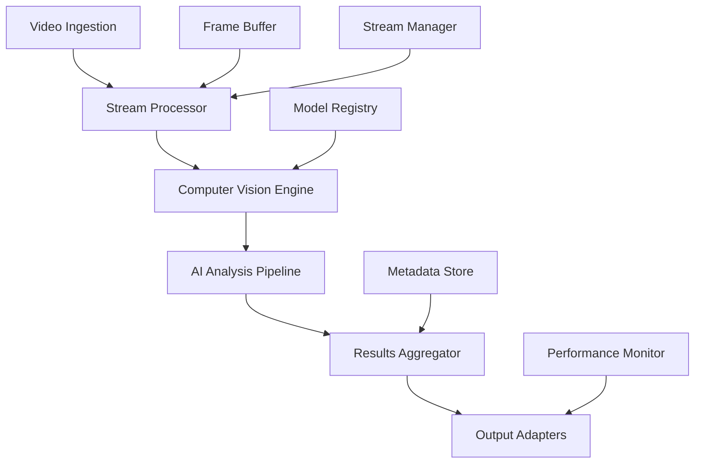

The Video Intelligence Service provides advanced computer vision and video analytics capabilities for real-time video processing, content analysis, and intelligent video workflows.

## Service Overview

The Video Intelligence Service combines computer vision, machine learning, and streaming technologies to provide comprehensive video analysis capabilities. It supports real-time processing, batch analysis, content understanding, and intelligent video workflows for various enterprise use cases.

### Key Capabilities

- **Real-time Video Processing**: Live stream analysis with low-latency processing
- **Computer Vision Pipeline**: Object detection, face recognition, scene analysis, and OCR
- **Content Intelligence**: Video summarization, highlight detection, and content classification
- **Stream Analytics**: Performance monitoring, quality assessment, and engagement analytics
- **Multi-format Support**: Support for various video formats, codecs, and streaming protocols
- **Edge Processing**: Distributed processing for bandwidth optimization and privacy

## Architecture Design

### Core Components



### System Architecture

```kotlin
// Core service architecture
@Service
@Component("videoIntelligenceService")
class VideoIntelligenceService(
    private val videoIngestionService: VideoIngestionService,
    private val streamProcessor: StreamProcessor,
    private val visionEngine: ComputerVisionEngine,
    private val analysisOrchestrator: AnalysisOrchestrator,
    private val resultsAggregator: ResultsAggregator,
    private val streamManager: StreamManager,
    private val modelRegistry: ModelRegistry
) {
    
    suspend fun createAnalysisJob(request: VideoAnalysisRequest): VideoAnalysisResponse {
        // Validate analysis request
        validateAnalysisRequest(request)
        
        // Create analysis job
        val job = VideoAnalysisJob(
            id = UUID.randomUUID().toString(),
            name = request.name,
            config = request.config,
            status = AnalysisJobStatus.CREATING
        )
        
        // Start video ingestion
        val stream = videoIngestionService.ingestVideo(request.videoSource)
        
        // Create processing pipeline
        val pipeline = analysisOrchestrator.createPipeline(job, stream)
        
        // Start analysis
        analysisOrchestrator.startAnalysis(pipeline)
        
        return VideoAnalysisResponse(
            jobId = job.id,
            status = job.status,
            streamUrl = stream.url,
            createdAt = job.createdAt
        )
    }
}
```

## API Specifications

### REST API Endpoints

#### Video Analysis Management

```yaml
# OpenAPI Specification
openapi: 3.0.3
info:
  title: Video Intelligence Service API
  version: 1.0.0
  description: Advanced video processing and computer vision analytics service

paths:
  /api/v1/analysis/jobs:
    post:
      summary: Create video analysis job
      operationId: createAnalysisJob
      requestBody:
        required: true
        content:
          application/json:
            schema:
              $ref: '#/components/schemas/VideoAnalysisRequest'
      responses:
        '201':
          description: Analysis job created
          content:
            application/json:
              schema:
                $ref: '#/components/schemas/VideoAnalysisResponse'
        '400':
          description: Invalid analysis request
        '429':
          description: Processing quota exceeded

    get:
      summary: List analysis jobs
      parameters:
        - name: status
          in: query
          schema:
            type: string
            enum: [creating, running, completed, failed, cancelled]
        - name: type
          in: query
          schema:
            type: string
            enum: [real-time, batch, on-demand]
        - name: created_after
          in: query
          schema:
            type: string
            format: date-time
        - name: limit
          in: query
          schema:
            type: integer
            default: 50
        - name: offset
          in: query
          schema:
            type: integer
            default: 0
      responses:
        '200':
          description: List of analysis jobs
          content:
            application/json:
              schema:
                $ref: '#/components/schemas/AnalysisJobList'

  /api/v1/analysis/jobs/{jobId}:
    get:
      summary: Get analysis job details
      parameters:
        - name: jobId
          in: path
          required: true
          schema:
            type: string
      responses:
        '200':
          description: Analysis job details
          content:
            application/json:
              schema:
                $ref: '#/components/schemas/AnalysisJob'
        '404':
          description: Analysis job not found

    patch:
      summary: Update analysis job configuration
      parameters:
        - name: jobId
          in: path
          required: true
          schema:
            type: string
      requestBody:
        required: true
        content:
          application/json:
            schema:
              $ref: '#/components/schemas/AnalysisJobUpdateRequest'
      responses:
        '200':
          description: Job updated
          content:
            application/json:
              schema:
                $ref: '#/components/schemas/AnalysisJob'

    delete:
      summary: Cancel/delete analysis job
      parameters:
        - name: jobId
          in: path
          required: true
          schema:
            type: string
      responses:
        '204':
          description: Job cancelled
        '404':
          description: Job not found
        '409':
          description: Cannot cancel completed job

  /api/v1/analysis/jobs/{jobId}/results:
    get:
      summary: Get analysis results
      parameters:
        - name: jobId
          in: path
          required: true
          schema:
            type: string
        - name: result_type
          in: query
          schema:
            type: string
            enum: [objects, faces, scenes, text, summary]
        - name: time_range
          in: query
          schema:
            type: string
            description: "Format: start_time-end_time in seconds"
        - name: confidence_threshold
          in: query
          schema:
            type: number
            minimum: 0
            maximum: 1
            default: 0.5
        - name: limit
          in: query
          schema:
            type: integer
            default: 100
      responses:
        '200':
          description: Analysis results
          content:
            application/json:
              schema:
                $ref: '#/components/schemas/AnalysisResults'
        '404':
          description: Job not found

  /api/v1/analysis/jobs/{jobId}/timeline:
    get:
      summary: Get analysis timeline
      parameters:
        - name: jobId
          in: path
          required: true
          schema:
            type: string
        - name: granularity
          in: query
          schema:
            type: string
            enum: [second, minute, scene]
            default: second
      responses:
        '200':
          description: Analysis timeline
          content:
            application/json:
              schema:
                $ref: '#/components/schemas/AnalysisTimeline'

  /api/v1/streams:
    post:
      summary: Create video stream
      requestBody:
        required: true
        content:
          application/json:
            schema:
              $ref: '#/components/schemas/StreamCreationRequest'
      responses:
        '201':
          description: Stream created
          content:
            application/json:
              schema:
                $ref: '#/components/schemas/VideoStream'

    get:
      summary: List video streams
      parameters:
        - name: status
          in: query
          schema:
            type: string
            enum: [active, inactive, error]
        - name: type
          in: query
          schema:
            type: string
            enum: [rtmp, webrtc, hls, dash]
      responses:
        '200':
          description: Video streams
          content:
            application/json:
              schema:
                $ref: '#/components/schemas/VideoStreamList'

  /api/v1/streams/{streamId}:
    get:
      summary: Get stream details
      parameters:
        - name: streamId
          in: path
          required: true
          schema:
            type: string
      responses:
        '200':
          description: Stream details
          content:
            application/json:
              schema:
                $ref: '#/components/schemas/VideoStream'

    delete:
      summary: Stop video stream
      parameters:
        - name: streamId
          in: path
          required: true
          schema:
            type: string
      responses:
        '204':
          description: Stream stopped

  /api/v1/streams/{streamId}/analytics:
    get:
      summary: Get stream analytics
      parameters:
        - name: streamId
          in: path
          required: true
          schema:
            type: string
        - name: time_range
          in: query
          schema:
            type: string
            enum: [1h, 6h, 24h, 7d, 30d]
            default: 1h
        - name: metrics
          in: query
          schema:
            type: array
            items:
              type: string
              enum: [quality, latency, viewers, engagement, detections]
      responses:
        '200':
          description: Stream analytics
          content:
            application/json:
              schema:
                $ref: '#/components/schemas/StreamAnalytics'

  /api/v1/models:
    get:
      summary: List available models
      parameters:
        - name: category
          in: query
          schema:
            type: string
            enum: [object_detection, face_recognition, scene_classification, ocr, action_recognition]
        - name: framework
          in: query
          schema:
            type: string
            enum: [tensorflow, pytorch, onnx, openvino]
      responses:
        '200':
          description: Available models
          content:
            application/json:
              schema:
                $ref: '#/components/schemas/ModelList'

    post:
      summary: Deploy custom model
      requestBody:
        required: true
        content:
          application/json:
            schema:
              $ref: '#/components/schemas/ModelDeploymentRequest'
      responses:
        '201':
          description: Model deployed
          content:
            application/json:
              schema:
                $ref: '#/components/schemas/Model'

  /api/v1/models/{modelId}:
    get:
      summary: Get model details
      parameters:
        - name: modelId
          in: path
          required: true
          schema:
            type: string
      responses:
        '200':
          description: Model details
          content:
            application/json:
              schema:
                $ref: '#/components/schemas/Model'

  /api/v1/models/{modelId}/benchmark:
    post:
      summary: Benchmark model performance
      parameters:
        - name: modelId
          in: path
          required: true
          schema:
            type: string
      requestBody:
        content:
          application/json:
            schema:
              $ref: '#/components/schemas/BenchmarkRequest'
      responses:
        '200':
          description: Benchmark results
          content:
            application/json:
              schema:
                $ref: '#/components/schemas/BenchmarkResults'

  /api/v1/processing/batch:
    post:
      summary: Submit batch processing job
      requestBody:
        required: true
        content:
          application/json:
            schema:
              $ref: '#/components/schemas/BatchProcessingRequest'
      responses:
        '202':
          description: Batch job submitted
          content:
            application/json:
              schema:
                $ref: '#/components/schemas/BatchJobResponse'

  /api/v1/processing/real-time:
    post:
      summary: Start real-time processing
      requestBody:
        required: true
        content:
          application/json:
            schema:
              $ref: '#/components/schemas/RealTimeProcessingRequest'
      responses:
        '200':
          description: Real-time processing started
          content:
            application/json:
              schema:
                $ref: '#/components/schemas/RealTimeProcessingResponse'

components:
  schemas:
    VideoAnalysisRequest:
      type: object
      required:
        - name
        - video_source
        - analysis_config
      properties:
        name:
          type: string
          example: "security-camera-analysis"
        description:
          type: string
        video_source:
          $ref: '#/components/schemas/VideoSource'
        analysis_config:
          $ref: '#/components/schemas/AnalysisConfig'
        processing_mode:
          type: string
          enum: [real-time, batch, on-demand]
          default: real-time
        priority:
          type: string
          enum: [low, medium, high, critical]
          default: medium
        tags:
          type: array
          items:
            type: string

    VideoSource:
      type: object
      required:
        - type
        - url
      properties:
        type:
          type: string
          enum: [rtmp, webrtc, hls, dash, file, camera]
        url:
          type: string
          format: uri
          example: "rtmp://stream.example.com/live/stream123"
        credentials:
          type: object
          properties:
            username:
              type: string
            password:
              type: string
              format: password
            token:
              type: string
        quality_settings:
          $ref: '#/components/schemas/QualitySettings'

    AnalysisConfig:
      type: object
      properties:
        models:
          type: array
          items:
            $ref: '#/components/schemas/ModelConfig'
          description: "Models to apply during analysis"
        frame_sampling:
          $ref: '#/components/schemas/FrameSamplingConfig'
        output_config:
          $ref: '#/components/schemas/OutputConfig'
        performance_config:
          $ref: '#/components/schemas/PerformanceConfig'

    ModelConfig:
      type: object
      required:
        - model_id
        - enabled
      properties:
        model_id:
          type: string
          example: "yolov8-object-detection"
        enabled:
          type: boolean
        confidence_threshold:
          type: number
          minimum: 0
          maximum: 1
          default: 0.5
        region_of_interest:
          $ref: '#/components/schemas/RegionOfInterest'
        custom_parameters:
          type: object
          additionalProperties: true

    FrameSamplingConfig:
      type: object
      properties:
        sampling_rate:
          type: number
          description: "Frames per second to process"
          default: 1
        key_frame_only:
          type: boolean
          default: false
        adaptive_sampling:
          type: boolean
          description: "Adjust sampling based on content complexity"
          default: false

    AnalysisJob:
      type: object
      properties:
        id:
          type: string
          format: uuid
        name:
          type: string
        description:
          type: string
        status:
          type: string
          enum: [creating, running, completed, failed, cancelled]
        video_source:
          $ref: '#/components/schemas/VideoSource'
        analysis_config:
          $ref: '#/components/schemas/AnalysisConfig'
        progress:
          $ref: '#/components/schemas/JobProgress'
        statistics:
          $ref: '#/components/schemas/JobStatistics'
        created_at:
          type: string
          format: date-time
        started_at:
          type: string
          format: date-time
        completed_at:
          type: string
          format: date-time

    AnalysisResults:
      type: object
      properties:
        job_id:
          type: string
        result_type:
          type: string
        time_range:
          $ref: '#/components/schemas/TimeRange'
        results:
          type: array
          items:
            $ref: '#/components/schemas/DetectionResult'
        summary:
          $ref: '#/components/schemas/ResultSummary'
        metadata:
          type: object
          additionalProperties: true

    DetectionResult:
      type: object
      properties:
        timestamp:
          type: number
          description: "Time in seconds from video start"
        frame_number:
          type: integer
        model_id:
          type: string
        detections:
          type: array
          items:
            $ref: '#/components/schemas/Detection'
        metadata:
          type: object
          additionalProperties: true

    Detection:
      type: object
      properties:
        class_name:
          type: string
          example: "person"
        confidence:
          type: number
          minimum: 0
          maximum: 1
        bounding_box:
          $ref: '#/components/schemas/BoundingBox'
        attributes:
          type: object
          additionalProperties: true
          example:
            age_range: "25-35"
            gender: "female"
            emotion: "happy"

    BoundingBox:
      type: object
      required:
        - x
        - y
        - width
        - height
      properties:
        x:
          type: number
          minimum: 0
          maximum: 1
          description: "X coordinate (normalized 0-1)"
        y:
          type: number
          minimum: 0
          maximum: 1
          description: "Y coordinate (normalized 0-1)"
        width:
          type: number
          minimum: 0
          maximum: 1
          description: "Width (normalized 0-1)"
        height:
          type: number
          minimum: 0
          maximum: 1
          description: "Height (normalized 0-1)"

    VideoStream:
      type: object
      properties:
        id:
          type: string
          format: uuid
        name:
          type: string
        type:
          type: string
          enum: [rtmp, webrtc, hls, dash]
        status:
          type: string
          enum: [active, inactive, error]
        source_url:
          type: string
        output_urls:
          type: object
          additionalProperties:
            type: string
        quality_profiles:
          type: array
          items:
            $ref: '#/components/schemas/QualityProfile'
        analytics:
          $ref: '#/components/schemas/StreamAnalytics'
        created_at:
          type: string
          format: date-time

    StreamAnalytics:
      type: object
      properties:
        stream_id:
          type: string
        time_range:
          $ref: '#/components/schemas/TimeRange'
        metrics:
          type: object
          properties:
            bitrate:
              type: object
              properties:
                current:
                  type: number
                average:
                  type: number
                peak:
                  type: number
            latency:
              type: object
              properties:
                current_ms:
                  type: number
                average_ms:
                  type: number
                p95_ms:
                  type: number
            frame_rate:
              type: object
              properties:
                current_fps:
                  type: number
                target_fps:
                  type: number
                dropped_frames:
                  type: integer
            viewers:
              type: object
              properties:
                current:
                  type: integer
                peak:
                  type: integer
                total:
                  type: integer
        detections:
          type: object
          properties:
            total_detections:
              type: integer
            detections_per_minute:
              type: number
            top_classes:
              type: array
              items:
                type: object
                properties:
                  class_name:
                    type: string
                  count:
                    type: integer

    Model:
      type: object
      properties:
        id:
          type: string
        name:
          type: string
        category:
          type: string
        framework:
          type: string
        version:
          type: string
        description:
          type: string
        input_format:
          $ref: '#/components/schemas/InputFormat'
        output_format:
          $ref: '#/components/schemas/OutputFormat'
        performance_metrics:
          $ref: '#/components/schemas/PerformanceMetrics'
        supported_hardware:
          type: array
          items:
            type: string
            enum: [cpu, gpu, tpu, vpu]
        model_size_mb:
          type: number
        created_at:
          type: string
          format: date-time

  securitySchemes:
    BearerAuth:
      type: http
      scheme: bearer
      bearerFormat: JWT
    ApiKeyAuth:
      type: apiKey
      in: header
      name: X-API-Key

security:
  - BearerAuth: []
  - ApiKeyAuth: []
```

### GraphQL API

```graphql
# GraphQL schema for video intelligence
type Query {
  analysisJobs(
    filter: AnalysisJobFilter
    sort: AnalysisJobSort
    pagination: PaginationInput
  ): AnalysisJobConnection!
  
  analysisJob(id: ID!): AnalysisJob
  
  analysisResults(
    jobId: ID!
    filter: ResultsFilter
    pagination: PaginationInput
  ): AnalysisResultsConnection!
  
  videoStreams(
    filter: VideoStreamFilter
    pagination: PaginationInput
  ): VideoStreamConnection!
  
  videoStream(id: ID!): VideoStream
  
  models(
    filter: ModelFilter
    pagination: PaginationInput
  ): ModelConnection!
  
  model(id: ID!): Model
  
  streamAnalytics(
    streamId: ID!
    timeRange: TimeRange!
    metrics: [AnalyticsMetric!]
  ): StreamAnalytics!
}

type Mutation {
  createAnalysisJob(input: AnalysisJobInput!): AnalysisJobPayload!
  updateAnalysisJob(id: ID!, input: AnalysisJobUpdateInput!): AnalysisJobPayload!
  cancelAnalysisJob(id: ID!): AnalysisJobPayload!
  
  createVideoStream(input: VideoStreamInput!): VideoStreamPayload!
  updateVideoStream(id: ID!, input: VideoStreamUpdateInput!): VideoStreamPayload!
  stopVideoStream(id: ID!): VideoStreamPayload!
  
  deployModel(input: ModelDeploymentInput!): ModelPayload!
  updateModel(id: ID!, input: ModelUpdateInput!): ModelPayload!
  
  benchmarkModel(id: ID!, input: BenchmarkInput!): BenchmarkPayload!
}

type Subscription {
  analysisJobUpdates(jobId: ID!): AnalysisJobUpdate!
  analysisResults(jobId: ID!): AnalysisResultUpdate!
  streamAnalytics(streamId: ID!): StreamAnalyticsUpdate!
  modelPerformance(modelId: ID!): ModelPerformanceUpdate!
}

# Core types
type AnalysisJob {
  id: ID!
  name: String!
  description: String
  status: AnalysisJobStatus!
  videoSource: VideoSource!
  analysisConfig: AnalysisConfig!
  progress: JobProgress
  statistics: JobStatistics
  results: AnalysisResultsConnection!
  createdAt: DateTime!
  startedAt: DateTime
  completedAt: DateTime
  estimatedDuration: Duration
}

enum AnalysisJobStatus {
  CREATING
  RUNNING
  COMPLETED
  FAILED
  CANCELLED
}

type VideoSource {
  type: VideoSourceType!
  url: String!
  credentials: Credentials
  qualitySettings: QualitySettings
}

enum VideoSourceType {
  RTMP
  WEBRTC
  HLS
  DASH
  FILE
  CAMERA
}

type AnalysisConfig {
  models: [ModelConfig!]!
  frameSampling: FrameSamplingConfig!
  outputConfig: OutputConfig!
  performanceConfig: PerformanceConfig!
}

type DetectionResult {
  timestamp: Float!
  frameNumber: Int!
  modelId: String!
  detections: [Detection!]!
  metadata: JSON
}

type Detection {
  className: String!
  confidence: Float!
  boundingBox: BoundingBox!
  attributes: JSON
  trackingId: String
}

type VideoStream {
  id: ID!
  name: String!
  type: VideoStreamType!
  status: StreamStatus!
  sourceUrl: String!
  outputUrls: JSON!
  qualityProfiles: [QualityProfile!]!
  analytics: StreamAnalytics
  analysisJobs: [AnalysisJob!]!
  createdAt: DateTime!
}

# Custom scalars
scalar DateTime
scalar Duration
scalar JSON
```

### gRPC Service Definition

```protobuf
// video_intelligence.proto
syntax = "proto3";

package aimatrix.video.v1;

import "google/protobuf/timestamp.proto";
import "google/protobuf/duration.proto";
import "google/protobuf/struct.proto";
import "google/protobuf/empty.proto";

// Video Intelligence Service
service VideoIntelligenceService {
  // Analysis job management
  rpc CreateAnalysisJob(CreateAnalysisJobRequest) returns (CreateAnalysisJobResponse);
  rpc GetAnalysisJob(GetAnalysisJobRequest) returns (AnalysisJob);
  rpc ListAnalysisJobs(ListAnalysisJobsRequest) returns (ListAnalysisJobsResponse);
  rpc CancelAnalysisJob(CancelAnalysisJobRequest) returns (google.protobuf.Empty);
  
  // Results retrieval
  rpc GetAnalysisResults(GetAnalysisResultsRequest) returns (GetAnalysisResultsResponse);
  rpc StreamAnalysisResults(StreamAnalysisResultsRequest) returns (stream AnalysisResultUpdate);
  
  // Stream management
  rpc CreateVideoStream(CreateVideoStreamRequest) returns (VideoStream);
  rpc GetVideoStream(GetVideoStreamRequest) returns (VideoStream);
  rpc StopVideoStream(StopVideoStreamRequest) returns (google.protobuf.Empty);
  
  // Real-time processing
  rpc ProcessVideoFrame(ProcessVideoFrameRequest) returns (ProcessVideoFrameResponse);
  rpc StreamVideoProcessing(stream VideoFrameRequest) returns (stream ProcessingResult);
}

// Model Management Service
service ModelService {
  rpc ListModels(ListModelsRequest) returns (ListModelsResponse);
  rpc GetModel(GetModelRequest) returns (Model);
  rpc DeployModel(DeployModelRequest) returns (Model);
  rpc BenchmarkModel(BenchmarkModelRequest) returns (BenchmarkResults);
}

// Stream Analytics Service
service StreamAnalyticsService {
  rpc GetStreamAnalytics(GetStreamAnalyticsRequest) returns (StreamAnalytics);
  rpc StreamAnalyticsUpdates(StreamAnalyticsUpdatesRequest) returns (stream AnalyticsUpdate);
}

// Request/Response Messages
message CreateAnalysisJobRequest {
  string name = 1;
  string description = 2;
  VideoSource video_source = 3;
  AnalysisConfig analysis_config = 4;
  ProcessingMode processing_mode = 5;
  Priority priority = 6;
  repeated string tags = 7;
}

message CreateAnalysisJobResponse {
  string job_id = 1;
  AnalysisJobStatus status = 2;
  google.protobuf.Timestamp created_at = 3;
  google.protobuf.Duration estimated_duration = 4;
}

message AnalysisJob {
  string id = 1;
  string name = 2;
  string description = 3;
  AnalysisJobStatus status = 4;
  VideoSource video_source = 5;
  AnalysisConfig analysis_config = 6;
  JobProgress progress = 7;
  JobStatistics statistics = 8;
  google.protobuf.Timestamp created_at = 9;
  google.protobuf.Timestamp started_at = 10;
  google.protobuf.Timestamp completed_at = 11;
}

message VideoSource {
  VideoSourceType type = 1;
  string url = 2;
  Credentials credentials = 3;
  QualitySettings quality_settings = 4;
}

message AnalysisConfig {
  repeated ModelConfig models = 1;
  FrameSamplingConfig frame_sampling = 2;
  OutputConfig output_config = 3;
  PerformanceConfig performance_config = 4;
}

message DetectionResult {
  double timestamp = 1;
  int64 frame_number = 2;
  string model_id = 3;
  repeated Detection detections = 4;
  google.protobuf.Struct metadata = 5;
}

message Detection {
  string class_name = 1;
  float confidence = 2;
  BoundingBox bounding_box = 3;
  google.protobuf.Struct attributes = 4;
  string tracking_id = 5;
}

message BoundingBox {
  float x = 1;
  float y = 2;
  float width = 3;
  float height = 4;
}

// Enums
enum AnalysisJobStatus {
  ANALYSIS_JOB_STATUS_UNSPECIFIED = 0;
  ANALYSIS_JOB_STATUS_CREATING = 1;
  ANALYSIS_JOB_STATUS_RUNNING = 2;
  ANALYSIS_JOB_STATUS_COMPLETED = 3;
  ANALYSIS_JOB_STATUS_FAILED = 4;
  ANALYSIS_JOB_STATUS_CANCELLED = 5;
}

enum VideoSourceType {
  VIDEO_SOURCE_TYPE_UNSPECIFIED = 0;
  VIDEO_SOURCE_TYPE_RTMP = 1;
  VIDEO_SOURCE_TYPE_WEBRTC = 2;
  VIDEO_SOURCE_TYPE_HLS = 3;
  VIDEO_SOURCE_TYPE_DASH = 4;
  VIDEO_SOURCE_TYPE_FILE = 5;
  VIDEO_SOURCE_TYPE_CAMERA = 6;
}

enum ProcessingMode {
  PROCESSING_MODE_UNSPECIFIED = 0;
  PROCESSING_MODE_REAL_TIME = 1;
  PROCESSING_MODE_BATCH = 2;
  PROCESSING_MODE_ON_DEMAND = 3;
}

enum Priority {
  PRIORITY_UNSPECIFIED = 0;
  PRIORITY_LOW = 1;
  PRIORITY_MEDIUM = 2;
  PRIORITY_HIGH = 3;
  PRIORITY_CRITICAL = 4;
}
```

## Implementation Examples

### Kotlin/Spring Boot Service Implementation

```kotlin
// Main service implementation
@Service
@Transactional
@Component("videoIntelligenceService")
class VideoIntelligenceServiceImpl(
    private val analysisJobRepository: AnalysisJobRepository,
    private val videoIngestionService: VideoIngestionService,
    private val streamProcessor: StreamProcessor,
    private val visionEngine: ComputerVisionEngine,
    private val analysisOrchestrator: AnalysisOrchestrator,
    private val resultsAggregator: ResultsAggregator,
    private val streamManager: StreamManager,
    private val modelRegistry: ModelRegistry,
    private val frameBufferService: FrameBufferService,
    private val metricsCollector: MetricsCollector
) : VideoIntelligenceService {

    private val logger = LoggerFactory.getLogger(VideoIntelligenceServiceImpl::class.java)

    @Async
    override suspend fun createAnalysisJob(request: VideoAnalysisRequest): VideoAnalysisResponse {
        logger.info("Creating video analysis job: ${request.name}")
        
        // Validate request
        validateAnalysisRequest(request)
        
        // Create analysis job entity
        val job = VideoAnalysisJobEntity(
            id = UUID.randomUUID().toString(),
            name = request.name,
            description = request.description,
            videoSource = request.videoSource,
            analysisConfig = request.analysisConfig,
            processingMode = request.processingMode,
            priority = request.priority,
            status = AnalysisJobStatus.CREATING,
            tags = request.tags,
            createdAt = Instant.now()
        )
        
        analysisJobRepository.save(job)
        
        try {
            // Initialize video ingestion
            val stream = videoIngestionService.createVideoStream(
                VideoStreamRequest(
                    source = request.videoSource,
                    quality = request.analysisConfig.qualitySettings,
                    buffering = request.analysisConfig.bufferingConfig
                )
            )
            
            // Create processing pipeline
            val pipeline = analysisOrchestrator.createProcessingPipeline(
                job = job,
                stream = stream,
                models = loadModels(request.analysisConfig.models)
            )
            
            // Start analysis based on processing mode
            when (request.processingMode) {
                ProcessingMode.REAL_TIME -> startRealTimeAnalysis(pipeline)
                ProcessingMode.BATCH -> scheduleBatchAnalysis(pipeline)
                ProcessingMode.ON_DEMAND -> prepareOnDemandAnalysis(pipeline)
            }
            
            // Update job status
            job.status = AnalysisJobStatus.RUNNING
            job.startedAt = Instant.now()
            job.streamId = stream.id
            job.pipelineId = pipeline.id
            
            analysisJobRepository.save(job)
            
            // Start metrics collection
            metricsCollector.startCollection(job.id)
            
            logger.info("Analysis job created successfully: ${job.id}")
            
            return VideoAnalysisResponse(
                jobId = job.id,
                status = job.status,
                streamUrl = stream.outputUrls["hls"],
                estimatedDuration = estimateProcessingDuration(job),
                createdAt = job.createdAt
            )
            
        } catch (e: Exception) {
            logger.error("Failed to create analysis job: ${job.id}", e)
            job.status = AnalysisJobStatus.FAILED
            job.updatedAt = Instant.now()
            job.errorMessage = e.message
            analysisJobRepository.save(job)
            throw VideoAnalysisException("Failed to create analysis job", e)
        }
    }

    override suspend fun getAnalysisResults(
        jobId: String,
        filter: AnalysisResultsFilter
    ): AnalysisResults {
        val job = analysisJobRepository.findById(jobId)
            ?: throw AnalysisJobNotFoundException(jobId)
        
        logger.info("Getting analysis results for job: $jobId")
        
        // Retrieve results from aggregator
        val rawResults = resultsAggregator.getResults(
            jobId = jobId,
            resultTypes = filter.resultTypes,
            timeRange = filter.timeRange,
            confidenceThreshold = filter.confidenceThreshold,
            limit = filter.limit
        )
        
        // Process and format results
        val formattedResults = formatAnalysisResults(rawResults, filter)
        
        // Generate summary statistics
        val summary = generateResultsSummary(formattedResults)
        
        return AnalysisResults(
            jobId = jobId,
            resultType = filter.resultTypes.firstOrNull() ?: "all",
            timeRange = filter.timeRange,
            results = formattedResults,
            summary = summary,
            metadata = mapOf(
                "total_frames_processed" to job.statistics?.framesProcessed,
                "processing_duration" to job.statistics?.processingDuration,
                "models_used" to job.analysisConfig.models.map { it.modelId }
            )
        )
    }

    override suspend fun processVideoFrame(request: VideoFrameProcessingRequest): VideoFrameProcessingResponse {
        logger.debug("Processing single video frame")
        
        try {
            // Decode frame
            val frame = decodeVideoFrame(request.frameData, request.format)
            
            // Load requested models
            val models = loadModels(request.models)
            
            // Process frame through vision engine
            val results = visionEngine.processFrame(
                frame = frame,
                models = models,
                options = request.processingOptions
            )
            
            // Format results
            val detections = results.map { result ->
                Detection(
                    className = result.className,
                    confidence = result.confidence,
                    boundingBox = result.boundingBox,
                    attributes = result.attributes,
                    trackingId = result.trackingId
                )
            }
            
            return VideoFrameProcessingResponse(
                frameNumber = request.frameNumber,
                timestamp = request.timestamp,
                detections = detections,
                processingTimeMs = results.processingTime,
                metadata = mapOf(
                    "frame_size" to "${frame.width}x${frame.height}",
                    "models_used" to models.map { it.id }
                )
            )
            
        } catch (e: Exception) {
            logger.error("Failed to process video frame", e)
            throw VideoProcessingException("Failed to process frame", e)
        }
    }

    override suspend fun getStreamAnalytics(
        streamId: String,
        timeRange: TimeRange,
        metrics: List<AnalyticsMetric>
    ): StreamAnalytics {
        val stream = streamManager.getStream(streamId)
            ?: throw VideoStreamNotFoundException(streamId)
        
        // Collect metrics from various sources
        val performanceMetrics = metricsCollector.getStreamMetrics(streamId, timeRange)
        val detectionMetrics = resultsAggregator.getDetectionMetrics(streamId, timeRange)
        val qualityMetrics = streamProcessor.getQualityMetrics(streamId, timeRange)
        
        return StreamAnalytics(
            streamId = streamId,
            timeRange = timeRange,
            metrics = combineMetrics(performanceMetrics, detectionMetrics, qualityMetrics),
            detections = detectionMetrics,
            qualityMetrics = qualityMetrics
        )
    }

    private suspend fun startRealTimeAnalysis(pipeline: ProcessingPipeline) {
        logger.info("Starting real-time analysis for pipeline: ${pipeline.id}")
        
        // Configure real-time processing parameters
        val realtimeConfig = RealtimeProcessingConfig(
            maxLatencyMs = 100,
            frameSkipTolerance = 0.1,
            bufferSize = 30,
            processingThreads = 4
        )
        
        // Start stream processing
        streamProcessor.startRealtimeProcessing(pipeline, realtimeConfig)
        
        // Initialize frame buffer
        frameBufferService.initializeBuffer(pipeline.id, realtimeConfig.bufferSize)
        
        // Start vision processing workers
        visionEngine.startRealtimeWorkers(pipeline.id, pipeline.models)
    }

    private suspend fun scheduleBatchAnalysis(pipeline: ProcessingPipeline) {
        logger.info("Scheduling batch analysis for pipeline: ${pipeline.id}")
        
        // Configure batch processing
        val batchConfig = BatchProcessingConfig(
            batchSize = 100,
            processingConcurrency = 8,
            checkpointInterval = Duration.ofMinutes(5),
            retryPolicy = RetryPolicy.exponentialBackoff(3, Duration.ofSeconds(1))
        )
        
        // Schedule batch job
        analysisOrchestrator.scheduleBatchJob(pipeline, batchConfig)
    }

    private fun validateAnalysisRequest(request: VideoAnalysisRequest) {
        if (request.name.isBlank()) {
            throw ValidationException("Analysis job name cannot be blank")
        }
        
        if (request.videoSource.url.isBlank()) {
            throw ValidationException("Video source URL is required")
        }
        
        if (request.analysisConfig.models.isEmpty()) {
            throw ValidationException("At least one analysis model must be specified")
        }
        
        // Validate models exist
        request.analysisConfig.models.forEach { modelConfig ->
            if (!modelRegistry.modelExists(modelConfig.modelId)) {
                throw ValidationException("Model not found: ${modelConfig.modelId}")
            }
        }
        
        // Validate frame sampling configuration
        val frameSampling = request.analysisConfig.frameSampling
        if (frameSampling.samplingRate <= 0) {
            throw ValidationException("Frame sampling rate must be positive")
        }
    }

    private fun loadModels(modelConfigs: List<ModelConfig>): List<LoadedModel> {
        return modelConfigs.map { config ->
            val model = modelRegistry.getModel(config.modelId)
            LoadedModel(
                id = model.id,
                name = model.name,
                instance = visionEngine.loadModel(model),
                config = config
            )
        }
    }
}

// Computer Vision Engine
@Component
class ComputerVisionEngine(
    private val tensorflowService: TensorFlowInferenceService,
    private val pytorchService: PyTorchInferenceService,
    private val onnxService: ONNXInferenceService,
    private val openvinoService: OpenVINOInferenceService,
    private val postProcessor: PostProcessor,
    private val trackingService: ObjectTrackingService
) {
    
    private val logger = LoggerFactory.getLogger(ComputerVisionEngine::class.java)
    private val modelInstances = ConcurrentHashMap<String, ModelInstance>()
    
    suspend fun processFrame(
        frame: VideoFrame,
        models: List<LoadedModel>,
        options: ProcessingOptions
    ): List<VisionResult> {
        
        val startTime = System.currentTimeMillis()
        val allResults = mutableListOf<VisionResult>()
        
        // Preprocess frame
        val preprocessedFrame = preprocessFrame(frame, options)
        
        // Run inference on each model
        models.forEach { model ->
            try {
                val rawResults = runInference(model, preprocessedFrame)
                val processedResults = postProcessor.process(rawResults, model.config)
                
                // Apply tracking if enabled
                val trackedResults = if (options.enableTracking) {
                    trackingService.updateTracking(model.id, processedResults)
                } else {
                    processedResults
                }
                
                allResults.addAll(trackedResults.map { result ->
                    VisionResult(
                        modelId = model.id,
                        className = result.className,
                        confidence = result.confidence,
                        boundingBox = result.boundingBox,
                        attributes = result.attributes,
                        trackingId = result.trackingId,
                        processingTime = System.currentTimeMillis() - startTime
                    )
                })
                
            } catch (e: Exception) {
                logger.error("Failed to process frame with model: ${model.id}", e)
            }
        }
        
        return allResults
    }
    
    suspend fun startRealtimeWorkers(pipelineId: String, models: List<LoadedModel>) {
        logger.info("Starting real-time processing workers for pipeline: $pipelineId")
        
        models.forEach { model ->
            // Create dedicated worker for each model
            CoroutineScope(Dispatchers.Default).launch {
                processRealtimeFrames(pipelineId, model)
            }
        }
    }
    
    private suspend fun processRealtimeFrames(pipelineId: String, model: LoadedModel) {
        val frameBuffer = frameBufferService.getBuffer(pipelineId)
        
        while (isActive) {
            try {
                val frame = frameBuffer.takeFrame() // Blocking call
                
                if (frame != null) {
                    val results = runInference(model, frame)
                    val processedResults = postProcessor.process(results, model.config)
                    
                    // Send results to aggregator
                    resultsAggregator.addResults(pipelineId, processedResults)
                }
                
            } catch (e: InterruptedException) {
                logger.info("Real-time worker interrupted for model: ${model.id}")
                break
            } catch (e: Exception) {
                logger.error("Error in real-time processing worker", e)
                delay(1000) // Brief pause before retrying
            }
        }
    }
    
    private suspend fun runInference(model: LoadedModel, frame: VideoFrame): List<RawInferenceResult> {
        return when (model.framework) {
            ModelFramework.TENSORFLOW -> tensorflowService.infer(model.instance, frame)
            ModelFramework.PYTORCH -> pytorchService.infer(model.instance, frame)
            ModelFramework.ONNX -> onnxService.infer(model.instance, frame)
            ModelFramework.OPENVINO -> openvinoService.infer(model.instance, frame)
        }
    }
    
    private fun preprocessFrame(frame: VideoFrame, options: ProcessingOptions): VideoFrame {
        var processedFrame = frame
        
        // Apply region of interest if specified
        options.regionOfInterest?.let { roi ->
            processedFrame = cropFrame(processedFrame, roi)
        }
        
        // Resize if needed
        options.targetResolution?.let { resolution ->
            processedFrame = resizeFrame(processedFrame, resolution)
        }
        
        // Normalize pixel values
        if (options.normalizePixels) {
            processedFrame = normalizeFrame(processedFrame)
        }
        
        return processedFrame
    }
    
    private fun cropFrame(frame: VideoFrame, roi: RegionOfInterest): VideoFrame {
        val x = (roi.x * frame.width).toInt()
        val y = (roi.y * frame.height).toInt()
        val width = (roi.width * frame.width).toInt()
        val height = (roi.height * frame.height).toInt()
        
        return frame.crop(x, y, width, height)
    }
}

// Stream processing service
@Component
class StreamProcessor(
    private val ffmpegService: FFmpegService,
    private val gstreamerService: GStreamerService,
    private val webrtcService: WebRTCService,
    private val frameExtractor: FrameExtractor,
    private val qualityAnalyzer: VideoQualityAnalyzer
) {
    
    private val activeStreams = ConcurrentHashMap<String, ProcessingStream>()
    
    suspend fun startRealtimeProcessing(
        pipeline: ProcessingPipeline,
        config: RealtimeProcessingConfig
    ) {
        logger.info("Starting real-time stream processing for pipeline: ${pipeline.id}")
        
        val stream = ProcessingStream(
            pipelineId = pipeline.id,
            source = pipeline.videoSource,
            config = config,
            frameBuffer = frameBufferService.getBuffer(pipeline.id)
        )
        
        activeStreams[pipeline.id] = stream
        
        // Start frame extraction
        CoroutineScope(Dispatchers.IO).launch {
            extractFramesFromStream(stream)
        }
        
        // Start quality monitoring
        CoroutineScope(Dispatchers.Default).launch {
            monitorStreamQuality(stream)
        }
    }
    
    private suspend fun extractFramesFromStream(stream: ProcessingStream) {
        try {
            when (stream.source.type) {
                VideoSourceType.RTMP -> extractFromRTMP(stream)
                VideoSourceType.WEBRTC -> extractFromWebRTC(stream)
                VideoSourceType.HLS -> extractFromHLS(stream)
                VideoSourceType.FILE -> extractFromFile(stream)
                else -> throw UnsupportedOperationException("Unsupported stream type: ${stream.source.type}")
            }
        } catch (e: Exception) {
            logger.error("Failed to extract frames from stream: ${stream.pipelineId}", e)
            throw StreamProcessingException("Frame extraction failed", e)
        }
    }
    
    private suspend fun extractFromRTMP(stream: ProcessingStream) {
        val extractorConfig = FrameExtractionConfig(
            inputUrl = stream.source.url,
            outputFormat = "rgb24",
            frameRate = stream.config.targetFrameRate,
            resolution = stream.config.targetResolution
        )
        
        frameExtractor.extractFrames(extractorConfig) { frame ->
            // Add frame to buffer
            stream.frameBuffer.addFrame(frame)
            
            // Update stream statistics
            stream.statistics.framesExtracted++
            stream.statistics.lastFrameTime = Instant.now()
        }
    }
    
    private suspend fun monitorStreamQuality(stream: ProcessingStream) {
        while (activeStreams.containsKey(stream.pipelineId)) {
            try {
                val qualityMetrics = qualityAnalyzer.analyzeStream(stream.source.url)
                
                stream.qualityMetrics = qualityMetrics
                
                // Check for quality issues
                if (qualityMetrics.bitrate < stream.config.minBitrate) {
                    logger.warn("Low bitrate detected for stream: ${stream.pipelineId}")
                    // Trigger quality adjustment
                    adjustStreamQuality(stream, qualityMetrics)
                }
                
                if (qualityMetrics.frameDropRate > stream.config.maxFrameDropRate) {
                    logger.warn("High frame drop rate for stream: ${stream.pipelineId}")
                    // Adjust processing parameters
                    adjustProcessingLoad(stream)
                }
                
                delay(Duration.ofSeconds(5))
                
            } catch (e: Exception) {
                logger.error("Error monitoring stream quality", e)
                delay(Duration.ofSeconds(10))
            }
        }
    }
    
    suspend fun getQualityMetrics(streamId: String, timeRange: TimeRange): QualityMetrics {
        val stream = activeStreams[streamId] ?: return QualityMetrics.empty()
        
        return stream.qualityMetrics ?: QualityMetrics.empty()
    }
}
```

## Database Schema & Models

### PostgreSQL Schema

```sql
-- Video analysis jobs table
CREATE TABLE video_analysis_jobs (
    id UUID PRIMARY KEY DEFAULT gen_random_uuid(),
    name VARCHAR(255) NOT NULL,
    description TEXT,
    user_id UUID NOT NULL,
    status VARCHAR(50) NOT NULL DEFAULT 'creating',
    processing_mode VARCHAR(50) NOT NULL,
    priority VARCHAR(20) NOT NULL DEFAULT 'medium',
    
    -- Video source configuration
    video_source JSONB NOT NULL,
    
    -- Analysis configuration
    analysis_config JSONB NOT NULL,
    
    -- Processing information
    stream_id UUID,
    pipeline_id UUID,
    
    -- Statistics
    statistics JSONB DEFAULT '{}'::jsonb,
    
    -- Error information
    error_message TEXT,
    error_stack TEXT,
    
    -- Timing
    created_at TIMESTAMP WITH TIME ZONE DEFAULT NOW(),
    updated_at TIMESTAMP WITH TIME ZONE DEFAULT NOW(),
    started_at TIMESTAMP WITH TIME ZONE,
    completed_at TIMESTAMP WITH TIME ZONE,
    
    -- Progress tracking
    progress JSONB DEFAULT '{}'::jsonb,
    
    -- Tags for organization
    tags TEXT[] DEFAULT '{}',
    
    -- Constraints
    CONSTRAINT jobs_status_check CHECK (
        status IN ('creating', 'running', 'completed', 'failed', 'cancelled')
    ),
    CONSTRAINT jobs_mode_check CHECK (
        processing_mode IN ('real-time', 'batch', 'on-demand')
    ),
    CONSTRAINT jobs_priority_check CHECK (
        priority IN ('low', 'medium', 'high', 'critical')
    )
);

-- Indexes
CREATE INDEX idx_analysis_jobs_user_status ON video_analysis_jobs(user_id, status);
CREATE INDEX idx_analysis_jobs_status_created ON video_analysis_jobs(status, created_at DESC);
CREATE INDEX idx_analysis_jobs_mode ON video_analysis_jobs(processing_mode);
CREATE INDEX idx_analysis_jobs_tags ON video_analysis_jobs USING GIN(tags);

-- Video streams table
CREATE TABLE video_streams (
    id UUID PRIMARY KEY DEFAULT gen_random_uuid(),
    name VARCHAR(255) NOT NULL,
    type VARCHAR(50) NOT NULL,
    status VARCHAR(50) NOT NULL DEFAULT 'inactive',
    
    -- Stream configuration
    source_url VARCHAR(1000) NOT NULL,
    output_urls JSONB DEFAULT '{}'::jsonb,
    
    -- Quality settings
    quality_profiles JSONB DEFAULT '[]'::jsonb,
    
    -- Stream health
    health_status VARCHAR(50) DEFAULT 'unknown',
    last_health_check TIMESTAMP WITH TIME ZONE,
    
    -- Performance metrics
    current_bitrate BIGINT,
    current_fps DECIMAL(5,2),
    viewer_count INTEGER DEFAULT 0,
    
    -- Timing
    created_at TIMESTAMP WITH TIME ZONE DEFAULT NOW(),
    updated_at TIMESTAMP WITH TIME ZONE DEFAULT NOW(),
    started_at TIMESTAMP WITH TIME ZONE,
    stopped_at TIMESTAMP WITH TIME ZONE,
    
    -- Constraints
    CONSTRAINT streams_type_check CHECK (
        type IN ('rtmp', 'webrtc', 'hls', 'dash', 'file', 'camera')
    ),
    CONSTRAINT streams_status_check CHECK (
        status IN ('active', 'inactive', 'error', 'starting', 'stopping')
    )
);

-- Analysis results table
CREATE TABLE analysis_results (
    id BIGSERIAL PRIMARY KEY,
    job_id UUID NOT NULL REFERENCES video_analysis_jobs(id) ON DELETE CASCADE,
    
    -- Detection details
    timestamp_seconds DECIMAL(10,3) NOT NULL,
    frame_number BIGINT NOT NULL,
    model_id VARCHAR(100) NOT NULL,
    
    -- Detection results
    detections JSONB NOT NULL,
    
    -- Metadata
    metadata JSONB DEFAULT '{}'::jsonb,
    
    -- Processing info
    processing_time_ms INTEGER,
    confidence_threshold DECIMAL(3,2),
    
    -- Timestamps
    created_at TIMESTAMP WITH TIME ZONE DEFAULT NOW(),
    
    -- Partitioning key
    partition_date DATE DEFAULT CURRENT_DATE
);

-- Partitioning for analysis results (by date)
CREATE TABLE analysis_results_2024_01 PARTITION OF analysis_results
    FOR VALUES FROM ('2024-01-01') TO ('2024-02-01');

-- Continue partitioning for other months...

-- Indexes for analysis results
CREATE INDEX idx_analysis_results_job_time ON analysis_results(job_id, timestamp_seconds);
CREATE INDEX idx_analysis_results_model ON analysis_results(model_id);
CREATE INDEX idx_analysis_results_created ON analysis_results(created_at DESC);
CREATE INDEX idx_analysis_results_detections ON analysis_results USING GIN(detections);

-- Models table
CREATE TABLE vision_models (
    id VARCHAR(100) PRIMARY KEY,
    name VARCHAR(255) NOT NULL,
    category VARCHAR(100) NOT NULL,
    framework VARCHAR(50) NOT NULL,
    version VARCHAR(50) NOT NULL,
    
    -- Model information
    description TEXT,
    input_format JSONB NOT NULL,
    output_format JSONB NOT NULL,
    
    -- Model files and artifacts
    model_path VARCHAR(1000),
    config_path VARCHAR(1000),
    weights_path VARCHAR(1000),
    labels_path VARCHAR(1000),
    
    -- Performance characteristics
    model_size_mb DECIMAL(10,2),
    inference_time_ms DECIMAL(8,2),
    memory_usage_mb INTEGER,
    
    -- Hardware requirements
    supported_hardware TEXT[] DEFAULT '{}',
    min_gpu_memory_mb INTEGER,
    
    -- Deployment status
    deployment_status VARCHAR(50) DEFAULT 'available',
    deployed_instances INTEGER DEFAULT 0,
    
    -- Usage statistics
    usage_count BIGINT DEFAULT 0,
    last_used_at TIMESTAMP WITH TIME ZONE,
    
    -- Timestamps
    created_at TIMESTAMP WITH TIME ZONE DEFAULT NOW(),
    updated_at TIMESTAMP WITH TIME ZONE DEFAULT NOW(),
    
    -- Constraints
    CONSTRAINT models_category_check CHECK (
        category IN ('object_detection', 'face_recognition', 'scene_classification', 
                    'ocr', 'action_recognition', 'segmentation', 'pose_estimation')
    ),
    CONSTRAINT models_framework_check CHECK (
        framework IN ('tensorflow', 'pytorch', 'onnx', 'openvino')
    ),
    CONSTRAINT models_deployment_check CHECK (
        deployment_status IN ('available', 'deploying', 'deployed', 'error', 'deprecated')
    )
);

-- Model performance benchmarks table
CREATE TABLE model_benchmarks (
    id UUID PRIMARY KEY DEFAULT gen_random_uuid(),
    model_id VARCHAR(100) NOT NULL REFERENCES vision_models(id) ON DELETE CASCADE,
    
    -- Benchmark configuration
    hardware_config JSONB NOT NULL,
    test_dataset VARCHAR(255),
    batch_size INTEGER,
    
    -- Performance metrics
    fps DECIMAL(8,2),
    latency_p50_ms DECIMAL(8,2),
    latency_p95_ms DECIMAL(8,2),
    latency_p99_ms DECIMAL(8,2),
    throughput_per_second DECIMAL(10,2),
    
    -- Accuracy metrics
    map_score DECIMAL(5,4),
    accuracy DECIMAL(5,4),
    precision DECIMAL(5,4),
    recall DECIMAL(5,4),
    f1_score DECIMAL(5,4),
    
    -- Resource usage
    cpu_usage_percent DECIMAL(5,2),
    memory_usage_mb INTEGER,
    gpu_usage_percent DECIMAL(5,2),
    gpu_memory_mb INTEGER,
    
    -- Timestamps
    created_at TIMESTAMP WITH TIME ZONE DEFAULT NOW()
);

-- Stream analytics table (time-series data)
CREATE TABLE stream_analytics (
    id BIGSERIAL PRIMARY KEY,
    stream_id UUID REFERENCES video_streams(id) ON DELETE CASCADE,
    job_id UUID REFERENCES video_analysis_jobs(id) ON DELETE SET NULL,
    
    -- Metric details
    metric_name VARCHAR(100) NOT NULL,
    metric_value DECIMAL(12,4) NOT NULL,
    metric_unit VARCHAR(20),
    
    -- Dimensions
    dimensions JSONB DEFAULT '{}'::jsonb,
    
    -- Time bucket for aggregation
    time_bucket TIMESTAMP WITH TIME ZONE NOT NULL,
    
    -- Timestamp
    recorded_at TIMESTAMP WITH TIME ZONE DEFAULT NOW()
);

-- Partitioning for stream analytics (by day)
CREATE TABLE stream_analytics_2024_001 PARTITION OF stream_analytics
    FOR VALUES FROM ('2024-01-01') TO ('2024-01-02');

-- Continue partitioning...

-- Indexes for stream analytics
CREATE INDEX idx_stream_analytics_stream_time ON stream_analytics(stream_id, time_bucket DESC);
CREATE INDEX idx_stream_analytics_job_time ON stream_analytics(job_id, time_bucket DESC);
CREATE INDEX idx_stream_analytics_metric ON stream_analytics(metric_name);

-- Processing pipelines table
CREATE TABLE processing_pipelines (
    id UUID PRIMARY KEY DEFAULT gen_random_uuid(),
    job_id UUID NOT NULL REFERENCES video_analysis_jobs(id) ON DELETE CASCADE,
    
    -- Pipeline configuration
    pipeline_config JSONB NOT NULL,
    
    -- Status and health
    status VARCHAR(50) NOT NULL DEFAULT 'creating',
    health_status VARCHAR(50) DEFAULT 'unknown',
    
    -- Performance metrics
    throughput_fps DECIMAL(8,2),
    latency_ms DECIMAL(8,2),
    error_rate DECIMAL(5,4),
    
    -- Resource allocation
    allocated_cpu_cores INTEGER,
    allocated_memory_mb INTEGER,
    allocated_gpu_count INTEGER,
    
    -- Timing
    created_at TIMESTAMP WITH TIME ZONE DEFAULT NOW(),
    started_at TIMESTAMP WITH TIME ZONE,
    stopped_at TIMESTAMP WITH TIME ZONE,
    
    -- Constraints
    CONSTRAINT pipelines_status_check CHECK (
        status IN ('creating', 'starting', 'running', 'stopping', 'stopped', 'error')
    )
);

-- Frame buffers table
CREATE TABLE frame_buffers (
    id UUID PRIMARY KEY DEFAULT gen_random_uuid(),
    pipeline_id UUID NOT NULL REFERENCES processing_pipelines(id) ON DELETE CASCADE,
    
    -- Buffer configuration
    max_size INTEGER NOT NULL DEFAULT 100,
    current_size INTEGER DEFAULT 0,
    
    -- Buffer statistics
    frames_added BIGINT DEFAULT 0,
    frames_consumed BIGINT DEFAULT 0,
    frames_dropped BIGINT DEFAULT 0,
    
    -- Performance metrics
    avg_buffer_utilization DECIMAL(5,4),
    max_buffer_utilization DECIMAL(5,4),
    buffer_overflow_count INTEGER DEFAULT 0,
    
    -- Timestamps
    created_at TIMESTAMP WITH TIME ZONE DEFAULT NOW(),
    last_activity_at TIMESTAMP WITH TIME ZONE DEFAULT NOW()
);

-- Object tracking table
CREATE TABLE object_tracking (
    id BIGSERIAL PRIMARY KEY,
    job_id UUID NOT NULL REFERENCES video_analysis_jobs(id) ON DELETE CASCADE,
    
    -- Tracking information
    track_id VARCHAR(100) NOT NULL,
    object_class VARCHAR(100) NOT NULL,
    
    -- Tracking timeline
    first_seen_at DECIMAL(10,3) NOT NULL,
    last_seen_at DECIMAL(10,3) NOT NULL,
    duration_seconds DECIMAL(10,3),
    
    -- Tracking statistics
    detection_count INTEGER DEFAULT 1,
    avg_confidence DECIMAL(5,4),
    max_confidence DECIMAL(5,4),
    
    -- Bounding box trajectory
    trajectory JSONB DEFAULT '[]'::jsonb,
    
    -- Metadata
    metadata JSONB DEFAULT '{}'::jsonb,
    
    -- Timestamps
    created_at TIMESTAMP WITH TIME ZONE DEFAULT NOW(),
    updated_at TIMESTAMP WITH TIME ZONE DEFAULT NOW(),
    
    -- Unique tracking per job
    UNIQUE(job_id, track_id)
);

-- Indexes for object tracking
CREATE INDEX idx_tracking_job ON object_tracking(job_id);
CREATE INDEX idx_tracking_class ON object_tracking(object_class);
CREATE INDEX idx_tracking_duration ON object_tracking(duration_seconds DESC);
CREATE INDEX idx_tracking_timeline ON object_tracking(first_seen_at, last_seen_at);

-- Functions and triggers
CREATE OR REPLACE FUNCTION update_updated_at_column()
RETURNS TRIGGER AS $$
BEGIN
    NEW.updated_at = NOW();
    RETURN NEW;
END;
$$ language 'plpgsql';

-- Apply update triggers
CREATE TRIGGER update_analysis_jobs_updated_at BEFORE UPDATE
    ON video_analysis_jobs FOR EACH ROW EXECUTE FUNCTION update_updated_at_column();

CREATE TRIGGER update_streams_updated_at BEFORE UPDATE
    ON video_streams FOR EACH ROW EXECUTE FUNCTION update_updated_at_column();

CREATE TRIGGER update_models_updated_at BEFORE UPDATE
    ON vision_models FOR EACH ROW EXECUTE FUNCTION update_updated_at_column();

CREATE TRIGGER update_tracking_updated_at BEFORE UPDATE
    ON object_tracking FOR EACH ROW EXECUTE FUNCTION update_updated_at_column();

-- Views for common queries
CREATE VIEW job_performance_summary AS
SELECT 
    vaj.*,
    COUNT(ar.id) as total_detections,
    COUNT(DISTINCT ar.model_id) as models_used,
    AVG(ar.processing_time_ms) as avg_processing_time_ms,
    MAX(ar.timestamp_seconds) as max_timestamp_processed,
    COUNT(DISTINCT ot.track_id) as unique_objects_tracked
FROM video_analysis_jobs vaj
LEFT JOIN analysis_results ar ON vaj.id = ar.job_id
LEFT JOIN object_tracking ot ON vaj.id = ot.job_id
GROUP BY vaj.id;

CREATE VIEW model_usage_stats AS
SELECT 
    vm.*,
    COUNT(ar.id) as total_detections,
    COUNT(DISTINCT ar.job_id) as jobs_used_in,
    AVG(ar.processing_time_ms) as avg_processing_time,
    COUNT(mb.id) as benchmark_count,
    MAX(mb.fps) as best_fps_recorded
FROM vision_models vm
LEFT JOIN analysis_results ar ON vm.id = ar.model_id
LEFT JOIN model_benchmarks mb ON vm.id = mb.model_id
GROUP BY vm.id;

CREATE VIEW stream_health_dashboard AS
SELECT 
    vs.*,
    COUNT(vaj.id) as active_analysis_jobs,
    AVG(sa.metric_value) FILTER (WHERE sa.metric_name = 'fps') as avg_fps,
    AVG(sa.metric_value) FILTER (WHERE sa.metric_name = 'latency_ms') as avg_latency_ms,
    AVG(sa.metric_value) FILTER (WHERE sa.metric_name = 'bitrate') as avg_bitrate
FROM video_streams vs
LEFT JOIN video_analysis_jobs vaj ON vs.id = vaj.stream_id AND vaj.status = 'running'
LEFT JOIN stream_analytics sa ON vs.id = sa.stream_id 
    AND sa.time_bucket >= NOW() - INTERVAL '1 hour'
GROUP BY vs.id;
```

### JPA Entity Models

```kotlin
// Video Analysis Job Entity
@Entity
@Table(name = "video_analysis_jobs")
@EntityListeners(AuditingEntityListener::class)
data class VideoAnalysisJobEntity(
    @Id
    @GeneratedValue(strategy = GenerationType.AUTO)
    val id: String = UUID.randomUUID().toString(),
    
    @Column(nullable = false)
    var name: String,
    
    @Column(columnDefinition = "TEXT")
    var description: String? = null,
    
    @Column(name = "user_id", nullable = false)
    var userId: UUID,
    
    @Enumerated(EnumType.STRING)
    var status: AnalysisJobStatus = AnalysisJobStatus.CREATING,
    
    @Enumerated(EnumType.STRING)
    @Column(name = "processing_mode")
    var processingMode: ProcessingMode,
    
    @Enumerated(EnumType.STRING)
    var priority: Priority = Priority.MEDIUM,
    
    @Type(JsonType::class)
    @Column(name = "video_source", columnDefinition = "jsonb")
    var videoSource: VideoSource,
    
    @Type(JsonType::class)
    @Column(name = "analysis_config", columnDefinition = "jsonb")
    var analysisConfig: AnalysisConfig,
    
    @Column(name = "stream_id")
    var streamId: UUID? = null,
    
    @Column(name = "pipeline_id")
    var pipelineId: UUID? = null,
    
    @Type(JsonType::class)
    @Column(columnDefinition = "jsonb")
    var statistics: JobStatistics? = null,
    
    @Column(name = "error_message", columnDefinition = "TEXT")
    var errorMessage: String? = null,
    
    @Column(name = "error_stack", columnDefinition = "TEXT")
    var errorStack: String? = null,
    
    @CreatedDate
    @Column(name = "created_at", nullable = false, updatable = false)
    var createdAt: Instant? = null,
    
    @LastModifiedDate
    @Column(name = "updated_at")
    var updatedAt: Instant? = null,
    
    @Column(name = "started_at")
    var startedAt: Instant? = null,
    
    @Column(name = "completed_at")
    var completedAt: Instant? = null,
    
    @Type(JsonType::class)
    @Column(columnDefinition = "jsonb")
    var progress: JobProgress? = null,
    
    @Type(ArrayType::class)
    @Column(columnDefinition = "text[]")
    var tags: Array<String> = emptyArray(),
    
    // Relationships
    @OneToMany(mappedBy = "job", cascade = [CascadeType.ALL], fetch = FetchType.LAZY)
    var results: MutableList<AnalysisResultEntity> = mutableListOf(),
    
    @OneToMany(mappedBy = "job", cascade = [CascadeType.ALL], fetch = FetchType.LAZY)
    var trackingData: MutableList<ObjectTrackingEntity> = mutableListOf(),
    
    @OneToMany(mappedBy = "job", cascade = [CascadeType.ALL], fetch = FetchType.LAZY)
    var analytics: MutableList<StreamAnalyticsEntity> = mutableListOf()
)

// Video Stream Entity
@Entity
@Table(name = "video_streams")
@EntityListeners(AuditingEntityListener::class)
data class VideoStreamEntity(
    @Id
    @GeneratedValue(strategy = GenerationType.AUTO)
    val id: UUID = UUID.randomUUID(),
    
    @Column(nullable = false)
    var name: String,
    
    @Enumerated(EnumType.STRING)
    var type: VideoStreamType,
    
    @Enumerated(EnumType.STRING)
    var status: StreamStatus = StreamStatus.INACTIVE,
    
    @Column(name = "source_url", nullable = false, length = 1000)
    var sourceUrl: String,
    
    @Type(JsonType::class)
    @Column(name = "output_urls", columnDefinition = "jsonb")
    var outputUrls: Map<String, String> = emptyMap(),
    
    @Type(JsonType::class)
    @Column(name = "quality_profiles", columnDefinition = "jsonb")
    var qualityProfiles: List<QualityProfile> = emptyList(),
    
    @Enumerated(EnumType.STRING)
    @Column(name = "health_status")
    var healthStatus: HealthStatus = HealthStatus.UNKNOWN,
    
    @Column(name = "last_health_check")
    var lastHealthCheck: Instant? = null,
    
    @Column(name = "current_bitrate")
    var currentBitrate: Long? = null,
    
    @Column(name = "current_fps", precision = 5, scale = 2)
    var currentFps: BigDecimal? = null,
    
    @Column(name = "viewer_count")
    var viewerCount: Int = 0,
    
    @CreatedDate
    @Column(name = "created_at", nullable = false, updatable = false)
    var createdAt: Instant? = null,
    
    @LastModifiedDate
    @Column(name = "updated_at")
    var updatedAt: Instant? = null,
    
    @Column(name = "started_at")
    var startedAt: Instant? = null,
    
    @Column(name = "stopped_at")
    var stoppedAt: Instant? = null,
    
    // Relationships
    @OneToMany(mappedBy = "stream", cascade = [CascadeType.ALL], fetch = FetchType.LAZY)
    var analytics: MutableList<StreamAnalyticsEntity> = mutableListOf()
)

// Analysis Result Entity
@Entity
@Table(name = "analysis_results")
data class AnalysisResultEntity(
    @Id
    @GeneratedValue(strategy = GenerationType.IDENTITY)
    val id: Long? = null,
    
    @ManyToOne(fetch = FetchType.LAZY)
    @JoinColumn(name = "job_id", nullable = false)
    var job: VideoAnalysisJobEntity,
    
    @Column(name = "timestamp_seconds", nullable = false, precision = 10, scale = 3)
    var timestampSeconds: BigDecimal,
    
    @Column(name = "frame_number", nullable = false)
    var frameNumber: Long,
    
    @Column(name = "model_id", nullable = false, length = 100)
    var modelId: String,
    
    @Type(JsonType::class)
    @Column(columnDefinition = "jsonb")
    var detections: List<Detection>,
    
    @Type(JsonType::class)
    @Column(columnDefinition = "jsonb")
    var metadata: Map<String, Any> = emptyMap(),
    
    @Column(name = "processing_time_ms")
    var processingTimeMs: Int? = null,
    
    @Column(name = "confidence_threshold", precision = 3, scale = 2)
    var confidenceThreshold: BigDecimal? = null,
    
    @CreatedDate
    @Column(name = "created_at", nullable = false, updatable = false)
    var createdAt: Instant? = null,
    
    @Column(name = "partition_date")
    var partitionDate: LocalDate = LocalDate.now()
)

// Vision Model Entity
@Entity
@Table(name = "vision_models")
@EntityListeners(AuditingEntityListener::class)
data class VisionModelEntity(
    @Id
    val id: String,
    
    @Column(nullable = false)
    var name: String,
    
    @Column(nullable = false)
    var category: String,
    
    @Enumerated(EnumType.STRING)
    var framework: ModelFramework,
    
    @Column(nullable = false)
    var version: String,
    
    @Column(columnDefinition = "TEXT")
    var description: String? = null,
    
    @Type(JsonType::class)
    @Column(name = "input_format", columnDefinition = "jsonb")
    var inputFormat: InputFormat,
    
    @Type(JsonType::class)
    @Column(name = "output_format", columnDefinition = "jsonb")
    var outputFormat: OutputFormat,
    
    @Column(name = "model_path", length = 1000)
    var modelPath: String? = null,
    
    @Column(name = "config_path", length = 1000)
    var configPath: String? = null,
    
    @Column(name = "weights_path", length = 1000)
    var weightsPath: String? = null,
    
    @Column(name = "labels_path", length = 1000)
    var labelsPath: String? = null,
    
    @Column(name = "model_size_mb", precision = 10, scale = 2)
    var modelSizeMb: BigDecimal? = null,
    
    @Column(name = "inference_time_ms", precision = 8, scale = 2)
    var inferenceTimeMs: BigDecimal? = null,
    
    @Column(name = "memory_usage_mb")
    var memoryUsageMb: Int? = null,
    
    @Type(ArrayType::class)
    @Column(name = "supported_hardware", columnDefinition = "text[]")
    var supportedHardware: Array<String> = emptyArray(),
    
    @Column(name = "min_gpu_memory_mb")
    var minGpuMemoryMb: Int? = null,
    
    @Enumerated(EnumType.STRING)
    @Column(name = "deployment_status")
    var deploymentStatus: ModelDeploymentStatus = ModelDeploymentStatus.AVAILABLE,
    
    @Column(name = "deployed_instances")
    var deployedInstances: Int = 0,
    
    @Column(name = "usage_count")
    var usageCount: Long = 0,
    
    @Column(name = "last_used_at")
    var lastUsedAt: Instant? = null,
    
    @CreatedDate
    @Column(name = "created_at", nullable = false, updatable = false)
    var createdAt: Instant? = null,
    
    @LastModifiedDate
    @Column(name = "updated_at")
    var updatedAt: Instant? = null,
    
    // Relationships
    @OneToMany(mappedBy = "model", cascade = [CascadeType.ALL], fetch = FetchType.LAZY)
    var benchmarks: MutableList<ModelBenchmarkEntity> = mutableListOf()
)

// Object Tracking Entity
@Entity
@Table(name = "object_tracking")
@EntityListeners(AuditingEntityListener::class)
data class ObjectTrackingEntity(
    @Id
    @GeneratedValue(strategy = GenerationType.IDENTITY)
    val id: Long? = null,
    
    @ManyToOne(fetch = FetchType.LAZY)
    @JoinColumn(name = "job_id", nullable = false)
    var job: VideoAnalysisJobEntity,
    
    @Column(name = "track_id", nullable = false, length = 100)
    var trackId: String,
    
    @Column(name = "object_class", nullable = false, length = 100)
    var objectClass: String,
    
    @Column(name = "first_seen_at", nullable = false, precision = 10, scale = 3)
    var firstSeenAt: BigDecimal,
    
    @Column(name = "last_seen_at", nullable = false, precision = 10, scale = 3)
    var lastSeenAt: BigDecimal,
    
    @Column(name = "duration_seconds", precision = 10, scale = 3)
    var durationSeconds: BigDecimal? = null,
    
    @Column(name = "detection_count")
    var detectionCount: Int = 1,
    
    @Column(name = "avg_confidence", precision = 5, scale = 4)
    var avgConfidence: BigDecimal? = null,
    
    @Column(name = "max_confidence", precision = 5, scale = 4)
    var maxConfidence: BigDecimal? = null,
    
    @Type(JsonType::class)
    @Column(columnDefinition = "jsonb")
    var trajectory: List<TrajectoryPoint> = emptyList(),
    
    @Type(JsonType::class)
    @Column(columnDefinition = "jsonb")
    var metadata: Map<String, Any> = emptyMap(),
    
    @CreatedDate
    @Column(name = "created_at", nullable = false, updatable = false)
    var createdAt: Instant? = null,
    
    @LastModifiedDate
    @Column(name = "updated_at")
    var updatedAt: Instant? = null
)

// Enums
enum class AnalysisJobStatus {
    CREATING, RUNNING, COMPLETED, FAILED, CANCELLED
}

enum class ProcessingMode {
    REAL_TIME, BATCH, ON_DEMAND
}

enum class VideoStreamType {
    RTMP, WEBRTC, HLS, DASH, FILE, CAMERA
}

enum class StreamStatus {
    ACTIVE, INACTIVE, ERROR, STARTING, STOPPING
}

enum class ModelFramework {
    TENSORFLOW, PYTORCH, ONNX, OPENVINO
}

enum class ModelDeploymentStatus {
    AVAILABLE, DEPLOYING, DEPLOYED, ERROR, DEPRECATED
}

enum class Priority {
    LOW, MEDIUM, HIGH, CRITICAL
}

enum class HealthStatus {
    HEALTHY, DEGRADED, UNHEALTHY, UNKNOWN
}

// Data classes for complex types
data class VideoSource(
    val type: VideoSourceType,
    val url: String,
    val credentials: Credentials? = null,
    val qualitySettings: QualitySettings? = null
)

data class AnalysisConfig(
    val models: List<ModelConfig>,
    val frameSampling: FrameSamplingConfig,
    val outputConfig: OutputConfig,
    val performanceConfig: PerformanceConfig
)

data class Detection(
    val className: String,
    val confidence: Double,
    val boundingBox: BoundingBox,
    val attributes: Map<String, Any> = emptyMap(),
    val trackingId: String? = null
)

data class BoundingBox(
    val x: Double,
    val y: Double,
    val width: Double,
    val height: Double
)

data class JobStatistics(
    val framesProcessed: Long = 0,
    val detectionsFound: Long = 0,
    val processingDuration: Duration? = null,
    val avgProcessingTimeMs: Double = 0.0,
    val errorCount: Int = 0
)

data class QualityProfile(
    val name: String,
    val width: Int,
    val height: Int,
    val bitrate: Int,
    val fps: Int,
    val codec: String
)

data class TrajectoryPoint(
    val timestamp: Double,
    val boundingBox: BoundingBox,
    val confidence: Double
)
```

## Message Queue Patterns

### Apache Kafka Integration for Video Intelligence

```kotlin
// Kafka configuration for video intelligence
@Configuration
@EnableKafka
class VideoIntelligenceKafkaConfig {
    
    @Value("\${spring.kafka.bootstrap-servers}")
    private lateinit var bootstrapServers: String
    
    @Bean
    fun videoProducerFactory(): ProducerFactory<String, Any> {
        return DefaultKafkaProducerFactory(videoProducerConfigs())
    }
    
    @Bean
    fun videoProducerConfigs(): Map<String, Any> {
        return mapOf(
            ProducerConfig.BOOTSTRAP_SERVERS_CONFIG to bootstrapServers,
            ProducerConfig.KEY_SERIALIZER_CLASS_CONFIG to StringSerializer::class.java,
            ProducerConfig.VALUE_SERIALIZER_CLASS_CONFIG to JsonSerializer::class.java,
            ProducerConfig.ACKS_CONFIG to "all",
            ProducerConfig.RETRIES_CONFIG to 3,
            ProducerConfig.BATCH_SIZE_CONFIG to 32768, // Larger batch for video data
            ProducerConfig.LINGER_MS_CONFIG to 10,
            ProducerConfig.COMPRESSION_TYPE_CONFIG to "lz4", // Fast compression for real-time
            ProducerConfig.BUFFER_MEMORY_CONFIG to 67108864L, // 64MB buffer
            ProducerConfig.MAX_REQUEST_SIZE_CONFIG to 10485760 // 10MB max request
        )
    }
    
    @Bean
    fun videoKafkaTemplate(): KafkaTemplate<String, Any> {
        return KafkaTemplate(videoProducerFactory()).apply {
            setDefaultTopic("video-intelligence.events")
        }
    }
    
    // High-throughput consumer for real-time processing
    @Bean
    fun realtimeConsumerFactory(): ConsumerFactory<String, Any> {
        return DefaultKafkaConsumerFactory(realtimeConsumerConfigs())
    }
    
    @Bean
    fun realtimeConsumerConfigs(): Map<String, Any> {
        return mapOf(
            ConsumerConfig.BOOTSTRAP_SERVERS_CONFIG to bootstrapServers,
            ConsumerConfig.KEY_DESERIALIZER_CLASS_CONFIG to StringDeserializer::class.java,
            ConsumerConfig.VALUE_DESERIALIZER_CLASS_CONFIG to JsonDeserializer::class.java,
            ConsumerConfig.GROUP_ID_CONFIG to "video-realtime-processors",
            ConsumerConfig.AUTO_OFFSET_RESET_CONFIG to "latest",
            ConsumerConfig.ENABLE_AUTO_COMMIT_CONFIG to false,
            ConsumerConfig.MAX_POLL_RECORDS_CONFIG to 500,
            ConsumerConfig.FETCH_MIN_BYTES_CONFIG to 1048576, // 1MB
            ConsumerConfig.FETCH_MAX_WAIT_MS_CONFIG to 100,
            ConsumerConfig.SESSION_TIMEOUT_MS_CONFIG to 30000,
            ConsumerConfig.HEARTBEAT_INTERVAL_MS_CONFIG to 10000
        )
    }
}

// Video intelligence event publisher
@Component
class VideoIntelligenceEventPublisher(
    private val kafkaTemplate: KafkaTemplate<String, Any>
) {
    
    private val logger = LoggerFactory.getLogger(VideoIntelligenceEventPublisher::class.java)
    
    suspend fun publishAnalysisJobCreated(job: VideoAnalysisJobEntity) {
        val event = AnalysisJobCreatedEvent(
            jobId = job.id,
            name = job.name,
            processingMode = job.processingMode,
            priority = job.priority,
            videoSource = job.videoSource,
            analysisConfig = job.analysisConfig,
            userId = job.userId.toString(),
            timestamp = job.createdAt ?: Instant.now()
        )
        
        kafkaTemplate.send("video.analysis.job.created", job.id, event)
            .addCallback(
                { result ->
                    logger.debug("Published analysis job created event: ${result?.recordMetadata}")
                },
                { failure ->
                    logger.error("Failed to publish analysis job created event", failure)
                }
            )
    }
    
    suspend fun publishDetectionResults(
        jobId: String,
        results: List<AnalysisResultEntity>
    ) {
        val event = DetectionResultsEvent(
            jobId = jobId,
            results = results.map { result ->
                DetectionResultData(
                    timestamp = result.timestampSeconds.toDouble(),
                    frameNumber = result.frameNumber,
                    modelId = result.modelId,
                    detections = result.detections,
                    processingTimeMs = result.processingTimeMs
                )
            },
            timestamp = Instant.now()
        )
        
        // Use job ID for partitioning to maintain order
        kafkaTemplate.send("video.detections.results", jobId, event)
    }
    
    suspend fun publishRealTimeDetection(detection: RealTimeDetection) {
        val event = RealTimeDetectionEvent(
            streamId = detection.streamId,
            jobId = detection.jobId,
            detection = detection,
            timestamp = Instant.now()
        )
        
        // Send to real-time topic with low latency
        kafkaTemplate.send("video.detections.realtime", detection.streamId, event)
    }
    
    suspend fun publishStreamStatus(stream: VideoStreamEntity, previousStatus: StreamStatus) {
        val event = StreamStatusChangeEvent(
            streamId = stream.id.toString(),
            name = stream.name,
            previousStatus = previousStatus,
            currentStatus = stream.status,
            healthStatus = stream.healthStatus,
            timestamp = Instant.now()
        )
        
        kafkaTemplate.send("video.stream.status", stream.id.toString(), event)
    }
    
    suspend fun publishFrameProcessed(
        jobId: String,
        frameNumber: Long,
        processingTimeMs: Int,
        detectionCount: Int
    ) {
        val event = FrameProcessedEvent(
            jobId = jobId,
            frameNumber = frameNumber,
            processingTimeMs = processingTimeMs,
            detectionCount = detectionCount,
            timestamp = Instant.now()
        )
        
        kafkaTemplate.send("video.frame.processed", jobId, event)
    }
    
    suspend fun publishPerformanceMetrics(
        jobId: String?,
        streamId: String?,
        metrics: PerformanceMetrics
    ) {
        val event = PerformanceMetricsEvent(
            jobId = jobId,
            streamId = streamId,
            metrics = metrics,
            timestamp = Instant.now()
        )
        
        val key = jobId ?: streamId ?: "global"
        kafkaTemplate.send("video.performance.metrics", key, event)
    }
}

// Real-time processing with Kafka Streams
@Component
class VideoProcessingStreams(
    private val visionEngine: ComputerVisionEngine,
    private val resultsAggregator: ResultsAggregator,
    private val alertService: AlertService,
    private val analyticsService: VideoAnalyticsService
) {
    
    @Bean
    fun buildVideoProcessingTopology(): Topology {
        val builder = StreamsBuilder()
        
        // Real-time detection stream
        val detectionStream = builder.stream<String, String>("video.detections.realtime")
        
        // Aggregate detections for analytics
        val detectionAggregates = detectionStream
            .mapValues { value -> parseDetectionEvent(value) }
            .groupByKey()
            .windowedBy(TimeWindows.of(Duration.ofSeconds(30)))
            .aggregate(
                { DetectionAggregation() },
                { _, detection, agg -> agg.add(detection) },
                Materialized.`as`<String, DetectionAggregation, WindowStore<Bytes, ByteArray>>("detection-aggregates")
            )
        
        // Alert generation for anomalies
        val alertStream = detectionAggregates.toStream()
            .mapValues { windowedAgg ->
                val agg = windowedAgg.value
                if (shouldTriggerAlert(agg)) {
                    generateAlert(agg)
                } else null
            }
            .filter { _, alert -> alert != null }
        
        alertStream.foreach { streamId, alert ->
            alertService.sendAlert(alert!!)
        }
        
        // Performance monitoring
        val performanceStream = builder.stream<String, String>("video.performance.metrics")
            .mapValues { value -> parsePerformanceEvent(value) }
            .groupByKey()
            .windowedBy(TimeWindows.of(Duration.ofMinutes(1)))
            .aggregate(
                { PerformanceAggregation() },
                { _, metrics, agg -> agg.add(metrics) },
                Materialized.`as`<String, PerformanceAggregation, WindowStore<Bytes, ByteArray>>("performance-aggregates")
            )
        
        // Real-time analytics updates
        performanceStream.toStream().foreach { jobId, windowedAgg ->
            analyticsService.updateRealTimeMetrics(jobId.key(), windowedAgg.value)
        }
        
        // Frame processing monitoring
        val frameStream = builder.stream<String, String>("video.frame.processed")
            .mapValues { value -> parseFrameEvent(value) }
        
        // Track processing rate and latency
        val processingMetrics = frameStream
            .groupByKey()
            .windowedBy(TimeWindows.of(Duration.ofSeconds(10)))
            .aggregate(
                { FrameProcessingMetrics() },
                { _, frame, metrics -> metrics.addFrame(frame) },
                Materialized.`as`<String, FrameProcessingMetrics, WindowStore<Bytes, ByteArray>>("frame-metrics")
            )
        
        // Detect processing bottlenecks
        processingMetrics.toStream()
            .filter { _, windowedMetrics -> 
                windowedMetrics.value.avgProcessingTime > 1000 // > 1 second per frame
            }
            .foreach { jobId, metrics ->
                alertService.sendProcessingDelayAlert(jobId.key(), metrics.value)
            }
        
        return builder.build()
    }
    
    private fun parseDetectionEvent(json: String): RealTimeDetection {
        // Parse JSON to detection object
        return objectMapper.readValue(json, RealTimeDetection::class.java)
    }
    
    private fun shouldTriggerAlert(agg: DetectionAggregation): Boolean {
        // Define alert conditions
        return agg.detectionCount > 100 || // High activity
               agg.avgConfidence < 0.3 ||   // Low confidence
               agg.uniqueClasses.contains("weapon") // Security threat
    }
    
    private fun generateAlert(agg: DetectionAggregation): VideoAlert {
        return VideoAlert(
            type = determineAlertType(agg),
            severity = determineAlertSeverity(agg),
            message = buildAlertMessage(agg),
            data = agg
        )
    }
}

// High-throughput frame processing consumer
@Component
class RealtimeFrameProcessor {
    
    @KafkaListener(
        topics = ["video.frames.raw"],
        groupId = "realtime-processors",
        concurrency = "4",
        containerFactory = "realtimeConsumerFactory"
    )
    fun processFrame(
        @Payload frameData: ByteArray,
        @Header("stream_id") streamId: String,
        @Header("frame_number") frameNumber: Long,
        @Header("timestamp") timestamp: Double
    ) {
        try {
            // Decode frame
            val frame = decodeFrame(frameData)
            
            // Process with vision models
            val results = visionEngine.processFrameRealtime(frame)
            
            // Publish results immediately
            results.forEach { result ->
                val detection = RealTimeDetection(
                    streamId = streamId,
                    frameNumber = frameNumber,
                    timestamp = timestamp,
                    modelId = result.modelId,
                    detections = result.detections
                )
                
                eventPublisher.publishRealTimeDetection(detection)
            }
            
        } catch (e: Exception) {
            logger.error("Failed to process frame: $streamId:$frameNumber", e)
        }
    }
}

// Event DTOs
data class AnalysisJobCreatedEvent(
    val jobId: String,
    val name: String,
    val processingMode: ProcessingMode,
    val priority: Priority,
    val videoSource: VideoSource,
    val analysisConfig: AnalysisConfig,
    val userId: String,
    val timestamp: Instant
)

data class DetectionResultsEvent(
    val jobId: String,
    val results: List<DetectionResultData>,
    val timestamp: Instant
)

data class RealTimeDetectionEvent(
    val streamId: String,
    val jobId: String?,
    val detection: RealTimeDetection,
    val timestamp: Instant
)

data class StreamStatusChangeEvent(
    val streamId: String,
    val name: String,
    val previousStatus: StreamStatus,
    val currentStatus: StreamStatus,
    val healthStatus: HealthStatus,
    val timestamp: Instant
)

data class FrameProcessedEvent(
    val jobId: String,
    val frameNumber: Long,
    val processingTimeMs: Int,
    val detectionCount: Int,
    val timestamp: Instant
)

data class RealTimeDetection(
    val streamId: String,
    val jobId: String? = null,
    val frameNumber: Long,
    val timestamp: Double,
    val modelId: String,
    val detections: List<Detection>
)

// Aggregation classes
data class DetectionAggregation(
    var detectionCount: Int = 0,
    var avgConfidence: Double = 0.0,
    val uniqueClasses: MutableSet<String> = mutableSetOf(),
    val detectionsByClass: MutableMap<String, Int> = mutableMapOf()
) {
    fun add(detection: RealTimeDetection): DetectionAggregation {
        detection.detections.forEach { det ->
            detectionCount++
            uniqueClasses.add(det.className)
            detectionsByClass[det.className] = detectionsByClass.getOrDefault(det.className, 0) + 1
            
            // Update rolling average confidence
            avgConfidence = (avgConfidence * (detectionCount - 1) + det.confidence) / detectionCount
        }
        return this
    }
}

data class FrameProcessingMetrics(
    var frameCount: Int = 0,
    var totalProcessingTime: Long = 0,
    var avgProcessingTime: Double = 0.0,
    var maxProcessingTime: Int = 0
) {
    fun addFrame(frame: FrameProcessedEvent): FrameProcessingMetrics {
        frameCount++
        totalProcessingTime += frame.processingTimeMs
        avgProcessingTime = totalProcessingTime.toDouble() / frameCount
        maxProcessingTime = maxOf(maxProcessingTime, frame.processingTimeMs)
        return this
    }
}
```

## Performance & Scaling

### GPU Resource Management

```kotlin
// GPU resource manager for video processing
@Component
class GPUResourceManager(
    private val gpuMonitoringService: GPUMonitoringService,
    private val modelLoadBalancer: ModelLoadBalancer
) {
    
    private val gpuResources = ConcurrentHashMap<Int, GPUResource>()
    private val modelAssignments = ConcurrentHashMap<String, Int>() // modelId -> gpuId
    
    @PostConstruct
    fun initializeGPUResources() {
        val availableGPUs = detectAvailableGPUs()
        
        availableGPUs.forEach { gpuId ->
            val resource = GPUResource(
                id = gpuId,
                totalMemoryMB = getGPUMemory(gpuId),
                utilizationThreshold = 0.8,
                maxConcurrentModels = 4
            )
            gpuResources[gpuId] = resource
            
            // Start monitoring
            startGPUMonitoring(gpuId)
        }
        
        logger.info("Initialized ${gpuResources.size} GPU resources")
    }
    
    suspend fun allocateGPU(modelId: String, memoryRequirementMB: Int): Int? {
        // Find best GPU for model
        val suitableGPU = findBestGPU(memoryRequirementMB)
        
        if (suitableGPU != null) {
            val resource = gpuResources[suitableGPU]!!
            resource.allocateMemory(memoryRequirementMB)
            resource.assignModel(modelId)
            modelAssignments[modelId] = suitableGPU
            
            logger.info("Allocated GPU $suitableGPU for model $modelId")
            return suitableGPU
        }
        
        logger.warn("No suitable GPU found for model $modelId (requires ${memoryRequirementMB}MB)")
        return null
    }
    
    suspend fun releaseGPU(modelId: String) {
        val gpuId = modelAssignments.remove(modelId)
        if (gpuId != null) {
            val resource = gpuResources[gpuId]!!
            resource.releaseModel(modelId)
            logger.info("Released GPU $gpuId from model $modelId")
        }
    }
    
    private fun findBestGPU(memoryRequirementMB: Int): Int? {
        return gpuResources.values
            .filter { it.canAllocate(memoryRequirementMB) }
            .minByOrNull { it.utilizationPercent }
            ?.id
    }
    
    private fun startGPUMonitoring(gpuId: Int) {
        CoroutineScope(Dispatchers.Default).launch {
            while (isActive) {
                try {
                    val utilization = gpuMonitoringService.getGPUUtilization(gpuId)
                    val memoryUsage = gpuMonitoringService.getGPUMemoryUsage(gpuId)
                    
                    val resource = gpuResources[gpuId]!!
                    resource.updateMetrics(utilization, memoryUsage)
                    
                    // Check for overutilization
                    if (utilization > resource.utilizationThreshold) {
                        handleOverutilization(gpuId, utilization)
                    }
                    
                    delay(Duration.ofSeconds(5))
                    
                } catch (e: Exception) {
                    logger.error("Error monitoring GPU $gpuId", e)
                    delay(Duration.ofSeconds(10))
                }
            }
        }
    }
    
    private suspend fun handleOverutilization(gpuId: Int, utilization: Double) {
        logger.warn("GPU $gpuId overutilized: ${utilization * 100}%")
        
        // Try to rebalance models
        val resource = gpuResources[gpuId]!!
        val modelsToMove = resource.assignedModels.take(1) // Move one model
        
        modelsToMove.forEach { modelId ->
            val alternativeGPU = findAlternativeGPU(modelId, gpuId)
            if (alternativeGPU != null) {
                modelLoadBalancer.migrateModel(modelId, gpuId, alternativeGPU)
            }
        }
    }
}

// Distributed processing with Kubernetes
@Component
class KubernetesVideoProcessorScaler(
    private val kubernetesClient: KubernetesClient,
    private val metricsService: MetricsService
) {
    
    suspend fun scaleProcessors(jobId: String, targetThroughput: Double) {
        val currentMetrics = metricsService.getProcessingMetrics(jobId)
        val currentThroughput = currentMetrics.framesPerSecond
        
        if (currentThroughput < targetThroughput * 0.8) {
            // Need to scale up
            val scaleFactor = (targetThroughput / currentThroughput).coerceAtMost(2.0)
            scaleUp(jobId, scaleFactor.toInt())
        } else if (currentThroughput > targetThroughput * 1.2) {
            // Can scale down
            scaleDown(jobId)
        }
    }
    
    private suspend fun scaleUp(jobId: String, replicas: Int) {
        val deployment = createProcessorDeployment(jobId, replicas)
        
        kubernetesClient.apps().deployments()
            .inNamespace("video-processing")
            .create(deployment)
        
        logger.info("Scaled up video processors for job $jobId to $replicas replicas")
    }
    
    private fun createProcessorDeployment(jobId: String, replicas: Int): Deployment {
        return Deployment().apply {
            metadata = ObjectMeta().apply {
                name = "video-processor-$jobId"
                namespace = "video-processing"
                labels = mapOf(
                    "app" to "video-processor",
                    "job-id" to jobId,
                    "component" to "realtime-processor"
                )
            }
            
            spec = DeploymentSpec().apply {
                this.replicas = replicas
                selector = LabelSelector().apply {
                    matchLabels = mapOf("job-id" to jobId)
                }
                
                template = PodTemplateSpec().apply {
                    metadata = ObjectMeta().apply {
                        labels = mapOf(
                            "app" to "video-processor",
                            "job-id" to jobId
                        )
                    }
                    
                    spec = PodSpec().apply {
                        containers = listOf(
                            Container().apply {
                                name = "processor"
                                image = "aimatrix/video-processor:latest"
                                
                                env = listOf(
                                    EnvVar("JOB_ID", jobId, null),
                                    EnvVar("KAFKA_BROKERS", "kafka:9092", null),
                                    EnvVar("GPU_ENABLED", "true", null)
                                )
                                
                                resources = io.fabric8.kubernetes.api.model.ResourceRequirements().apply {
                                    requests = mapOf(
                                        "cpu" to Quantity("2"),
                                        "memory" to Quantity("4Gi"),
                                        "nvidia.com/gpu" to Quantity("1")
                                    )
                                    limits = mapOf(
                                        "cpu" to Quantity("4"),
                                        "memory" to Quantity("8Gi"),
                                        "nvidia.com/gpu" to Quantity("1")
                                    )
                                }
                                
                                livenessProbe = Probe().apply {
                                    httpGet = HTTPGetAction().apply {
                                        path = "/health"
                                        port = IntOrString(8080)
                                    }
                                    initialDelaySeconds = 30
                                    periodSeconds = 30
                                }
                                
                                readinessProbe = Probe().apply {
                                    httpGet = HTTPGetAction().apply {
                                        path = "/ready"
                                        port = IntOrString(8080)
                                    }
                                    initialDelaySeconds = 15
                                    periodSeconds = 10
                                }
                            }
                        )
                        
                        nodeSelector = mapOf(
                            "gpu" to "nvidia",
                            "instance-type" to "gpu-optimized"
                        )
                        
                        tolerations = listOf(
                            Toleration().apply {
                                key = "nvidia.com/gpu"
                                operator = "Exists"
                                effect = "NoSchedule"
                            }
                        )
                    }
                }
            }
        }
    }
}
```

### Edge Processing Optimization

```kotlin
// Edge computing optimization for video processing
@Component
class EdgeProcessingOptimizer(
    private val modelOptimizer: ModelOptimizer,
    private val edgeDeploymentService: EdgeDeploymentService,
    private val bandwidthMonitor: BandwidthMonitor
) {
    
    suspend fun optimizeForEdge(
        jobId: String,
        edgeCapabilities: EdgeCapabilities
    ): EdgeOptimizationResult {
        
        val job = analysisJobRepository.findById(jobId) 
            ?: throw AnalysisJobNotFoundException(jobId)
        
        // Analyze models for edge compatibility
        val optimizedModels = job.analysisConfig.models.map { modelConfig ->
            optimizeModelForEdge(modelConfig, edgeCapabilities)
        }
        
        // Determine processing strategy
        val strategy = determineEdgeStrategy(optimizedModels, edgeCapabilities)
        
        // Configure edge deployment
        val edgeConfig = createEdgeConfig(job, optimizedModels, strategy)
        
        return EdgeOptimizationResult(
            optimizedModels = optimizedModels,
            strategy = strategy,
            edgeConfig = edgeConfig,
            expectedPerformance = estimateEdgePerformance(edgeConfig)
        )
    }
    
    private suspend fun optimizeModelForEdge(
        modelConfig: ModelConfig,
        capabilities: EdgeCapabilities
    ): OptimizedModelConfig {
        
        val model = modelRegistry.getModel(modelConfig.modelId)
        
        // Model optimization options
        val optimizations = mutableListOf<ModelOptimization>()
        
        // Quantization for smaller models
        if (capabilities.supportsQuantization && model.modelSizeMb!! > 100) {
            optimizations.add(ModelOptimization.INT8_QUANTIZATION)
        }
        
        // Pruning for faster inference
        if (capabilities.limitedComputePower) {
            optimizations.add(ModelOptimization.WEIGHT_PRUNING)
        }
        
        // Knowledge distillation for very constrained devices
        if (capabilities.memoryMB < 2000) {
            optimizations.add(ModelOptimization.KNOWLEDGE_DISTILLATION)
        }
        
        // Apply optimizations
        val optimizedModel = modelOptimizer.optimize(model, optimizations)
        
        return OptimizedModelConfig(
            originalModelId = model.id,
            optimizedModelId = optimizedModel.id,
            config = modelConfig,
            optimizations = optimizations,
            sizeBefore = model.modelSizeMb!!,
            sizeAfter = optimizedModel.modelSizeMb!!,
            performanceImprovement = estimatePerformanceImprovement(optimizations)
        )
    }
    
    private fun determineEdgeStrategy(
        models: List<OptimizedModelConfig>,
        capabilities: EdgeCapabilities
    ): EdgeProcessingStrategy {
        
        val totalModelSize = models.sumOf { it.sizeAfter }
        val estimatedMemoryUsage = totalModelSize * 1.5 // Model + runtime overhead
        
        return when {
            estimatedMemoryUsage > capabilities.memoryMB -> {
                // Models too large, use hybrid processing
                EdgeProcessingStrategy.HYBRID_CLOUD_EDGE
            }
            capabilities.bandwidthMbps < 10 -> {
                // Low bandwidth, prefer edge processing
                EdgeProcessingStrategy.EDGE_FIRST
            }
            capabilities.computePowerScore < 0.3 -> {
                // Limited compute, use cloud assistance
                EdgeProcessingStrategy.CLOUD_ASSISTED
            }
            else -> {
                // Capable edge device, process locally
                EdgeProcessingStrategy.FULL_EDGE
            }
        }
    }
    
    suspend fun deployToEdge(
        jobId: String,
        edgeNodeId: String,
        config: EdgeConfig
    ): EdgeDeploymentResult {
        
        return edgeDeploymentService.deploy(
            EdgeDeploymentRequest(
                jobId = jobId,
                edgeNodeId = edgeNodeId,
                config = config,
                healthCheckInterval = Duration.ofSeconds(30)
            )
        )
    }
}

// Bandwidth-aware streaming
@Component
class AdaptiveStreamingService(
    private val bandwidthMonitor: BandwidthMonitor,
    private val qualitySelector: QualitySelector,
    private val frameSkipper: FrameSkipper
) {
    
    suspend fun adaptStreamQuality(
        streamId: String,
        targetProcessingRate: Double
    ) {
        val currentBandwidth = bandwidthMonitor.getCurrentBandwidth(streamId)
        val stream = streamManager.getStream(streamId)
        
        // Calculate optimal quality based on bandwidth
        val optimalQuality = qualitySelector.selectQuality(
            availableBandwidth = currentBandwidth,
            targetFps = targetProcessingRate,
            currentQuality = stream?.qualityProfiles?.firstOrNull()
        )
        
        if (optimalQuality != stream?.qualityProfiles?.firstOrNull()) {
            // Switch quality
            streamManager.updateStreamQuality(streamId, optimalQuality)
            logger.info("Adapted stream $streamId quality to ${optimalQuality.name}")
        }
        
        // Adjust frame sampling if needed
        val optimalSamplingRate = calculateOptimalSamplingRate(
            bandwidth = currentBandwidth,
            quality = optimalQuality,
            targetProcessingRate = targetProcessingRate
        )
        
        frameSkipper.updateSamplingRate(streamId, optimalSamplingRate)
    }
    
    private fun calculateOptimalSamplingRate(
        bandwidth: Double,
        quality: QualityProfile,
        targetProcessingRate: Double
    ): Double {
        
        val frameSizeBits = quality.width * quality.height * 24 // Assuming 24-bit color
        val maxFramesPerSecond = (bandwidth * 1_000_000) / frameSizeBits // Convert Mbps to bps
        
        return minOf(maxFramesPerSecond, targetProcessingRate, quality.fps.toDouble())
    }
}
```

## Security Implementation

### Video Data Protection

```kotlin
// Video data encryption and secure processing
@Component
class VideoSecurityService(
    private val encryptionService: EncryptionService,
    private val accessControlService: AccessControlService,
    private val auditService: AuditService
) {
    
    suspend fun secureVideoStream(
        streamId: String,
        encryptionLevel: EncryptionLevel
    ): SecureStreamConfig {
        
        val stream = streamManager.getStream(streamId)
            ?: throw VideoStreamNotFoundException(streamId)
        
        // Generate stream-specific encryption keys
        val encryptionKeys = when (encryptionLevel) {
            EncryptionLevel.BASIC -> generateAESKeys()
            EncryptionLevel.ADVANCED -> generateECCKeys()
            EncryptionLevel.MILITARY_GRADE -> generateQuantumResistantKeys()
        }
        
        // Configure secure RTMP/WebRTC
        val secureConfig = SecureStreamConfig(
            streamId = streamId,
            encryptionKeys = encryptionKeys,
            encryptionLevel = encryptionLevel,
            certificatePath = generateTLSCertificate(streamId),
            accessTokens = generateAccessTokens(streamId)
        )
        
        // Update stream with security config
        streamManager.updateSecurityConfig(streamId, secureConfig)
        
        // Audit log
        auditService.logStreamSecurityUpdate(streamId, encryptionLevel)
        
        return secureConfig
    }
    
    suspend fun sanitizeVideoFrame(frame: VideoFrame): VideoFrame {
        // Remove metadata that might contain sensitive information
        val sanitizedFrame = frame.copy(
            metadata = frame.metadata.filterKeys { key ->
                !key.contains("location", ignoreCase = true) &&
                !key.contains("gps", ignoreCase = true) &&
                !key.contains("device", ignoreCase = true)
            }
        )
        
        return sanitizedFrame
    }
    
    suspend fun anonymizeDetections(detections: List<Detection>): List<Detection> {
        return detections.map { detection ->
            when (detection.className.lowercase()) {
                "person", "face" -> {
                    // Blur/anonymize person detections if required
                    detection.copy(
                        attributes = detection.attributes.filterKeys { key ->
                            !key.contains("identity", ignoreCase = true) &&
                            !key.contains("name", ignoreCase = true)
                        }
                    )
                }
                "license_plate", "text" -> {
                    // Redact text-based detections
                    detection.copy(
                        attributes = mapOf(
                            "text" to "[REDACTED]",
                            "confidence" to detection.confidence
                        )
                    )
                }
                else -> detection
            }
        }
    }
    
    suspend fun validateVideoAccess(
        userId: String,
        streamId: String,
        operation: VideoOperation
    ): Boolean {
        
        val hasAccess = accessControlService.checkVideoAccess(
            userId = userId,
            streamId = streamId,
            operation = operation
        )
        
        // Audit access attempt
        auditService.logVideoAccess(
            userId = userId,
            streamId = streamId,
            operation = operation,
            granted = hasAccess
        )
        
        return hasAccess
    }
}

// Privacy compliance service
@Component
class VideoPrivacyComplianceService(
    private val faceBlurService: FaceBlurService,
    private val licensePlateRedactor: LicensePlateRedactor,
    private val dataRetentionService: DataRetentionService
) {
    
    suspend fun applyPrivacyFilters(
        jobId: String,
        privacyRules: List<PrivacyRule>
    ): PrivacyProcessingResult {
        
        val results = mutableListOf<PrivacyAction>()
        
        privacyRules.forEach { rule ->
            when (rule.type) {
                PrivacyRuleType.FACE_ANONYMIZATION -> {
                    val blurredFrames = applyFaceBlurring(jobId, rule)
                    results.add(PrivacyAction(rule.type, blurredFrames))
                }
                PrivacyRuleType.LICENSE_PLATE_REDACTION -> {
                    val redactedFrames = applyLicensePlateRedaction(jobId, rule)
                    results.add(PrivacyAction(rule.type, redactedFrames))
                }
                PrivacyRuleType.PERSON_TRACKING_RESTRICTION -> {
                    disablePersonTracking(jobId)
                    results.add(PrivacyAction(rule.type, 0))
                }
                PrivacyRuleType.DATA_RETENTION_LIMIT -> {
                    scheduleDataDeletion(jobId, rule.retentionPeriod!!)
                    results.add(PrivacyAction(rule.type, 1))
                }
            }
        }
        
        return PrivacyProcessingResult(
            jobId = jobId,
            appliedRules = privacyRules,
            actions = results,
            processingTime = measureTime { /* Processing time calculation */ }
        )
    }
    
    private suspend fun applyFaceBlurring(jobId: String, rule: PrivacyRule): Int {
        val job = analysisJobRepository.findById(jobId)!!
        val faceDetections = resultsAggregator.getDetectionsByClass(jobId, "face")
        
        var blurredFrames = 0
        
        faceDetections.forEach { detection ->
            val blurSuccess = faceBlurService.blurFace(
                streamId = job.streamId!!.toString(),
                frameNumber = detection.frameNumber,
                boundingBox = detection.detections.first().boundingBox,
                blurIntensity = rule.intensity ?: 0.8
            )
            
            if (blurSuccess) {
                blurredFrames++
            }
        }
        
        return blurredFrames
    }
    
    suspend fun generatePrivacyReport(jobId: String): PrivacyComplianceReport {
        val job = analysisJobRepository.findById(jobId)!!
        val detections = resultsAggregator.getResults(jobId)
        
        // Analyze privacy-sensitive detections
        val faceCount = detections.count { it.detections.any { d -> d.className == "face" } }
        val personCount = detections.count { it.detections.any { d -> d.className == "person" } }
        val licensePlateCount = detections.count { it.detections.any { d -> d.className == "license_plate" } }
        
        return PrivacyComplianceReport(
            jobId = jobId,
            sensitiveDataFound = faceCount > 0 || personCount > 0 || licensePlateCount > 0,
            faceDetections = faceCount,
            personDetections = personCount,
            licensePlateDetections = licensePlateCount,
            dataRetentionPlan = dataRetentionService.getRetentionPlan(jobId),
            complianceStatus = determineComplianceStatus(faceCount, personCount, licensePlateCount),
            recommendations = generatePrivacyRecommendations(faceCount, personCount, licensePlateCount)
        )
    }
}
```

---

**Next Steps:**
- Implement advanced object tracking algorithms (SORT, DeepSORT, ByteTrack)
- Set up distributed model serving with TensorFlow Serving and TorchServe
- Add support for custom vision model deployment and A/B testing
- Implement video content understanding with scene analysis and activity recognition
- Create comprehensive video analytics dashboard with real-time monitoring capabilities