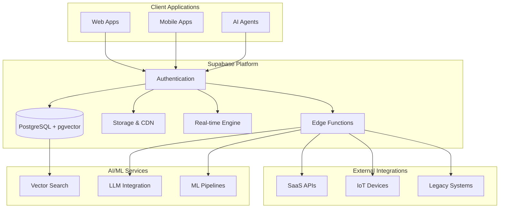

# Supabase Platform for AIMatrix

Supabase serves as the foundational data platform for AIMatrix, providing a comprehensive suite of backend services that power intelligent applications and AI agents.

## Why Supabase for AIMatrix?

Supabase is the ideal choice for AIMatrix applications due to its unique combination of features that align perfectly with modern AI and automation requirements:

### 1. **AI-Native Database**
- **pgvector Extension**: Built-in vector database capabilities for embeddings and similarity search
- **Full-text Search**: PostgreSQL's powerful text search for semantic queries
- **JSON Support**: Native JSON handling for unstructured AI data
- **Flexible Schema**: Adapt to evolving AI model requirements

### 2. **Real-time Everything**
- **Live Data Sync**: Real-time database changes for collaborative AI agents
- **Presence**: Track online users and active AI agents
- **Broadcast**: Low-latency messaging for agent communication
- **Multiplayer**: Build collaborative AI workspaces

### 3. **Edge-First Architecture**
- **Edge Functions**: Deploy AI inference at the edge
- **Global CDN**: Fast asset delivery worldwide
- **Multi-region**: Data residency compliance
- **Auto-scaling**: Handle variable AI workloads

### 4. **Developer Experience**
- **Auto-generated APIs**: Instant REST and GraphQL endpoints
- **Type Safety**: Generated TypeScript types
- **SQL-first**: Direct database access when needed
- **Migration System**: Version-controlled schema changes

## Architecture Overview



## Key Benefits and Features

### **Unified Data Platform**
- Single source of truth for all application data
- Consistent APIs across all services
- Integrated authentication and authorization
- Built-in backup and disaster recovery

### **AI/ML Ready**
- Vector embeddings storage and search
- Real-time model inference pipelines
- Automated data preprocessing
- Seamless integration with popular ML frameworks

### **Enterprise Security**
- Row Level Security (RLS) at the database level
- OAuth 2.0 and SAML integration
- Audit logging and compliance
- Data encryption at rest and in transit

### **Scalability & Performance**
- Connection pooling and read replicas
- Automatic indexing recommendations
- Query performance insights
- Horizontal scaling capabilities

## Migration Path from Other Databases

### From Firebase
```javascript
// Firebase Firestore
const doc = await db.collection('users').doc(userId).get()

// Supabase equivalent
const { data } = await supabase
  .from('users')
  .select('*')
  .eq('id', userId)
  .single()
```

### From MongoDB
```javascript
// MongoDB
await db.collection('products').find({ 
  price: { $gte: 100 } 
}).toArray()

// Supabase equivalent
const { data } = await supabase
  .from('products')
  .select('*')
  .gte('price', 100)
```

### From MySQL/PostgreSQL
```sql
-- Existing SQL queries work directly
SELECT p.*, c.name as category_name 
FROM products p 
JOIN categories c ON p.category_id = c.id
WHERE p.active = true
```

## Getting Started

1. **[Quick Start Guide](quick-start/)** - Set up your first Supabase project
2. **[Authentication](authentication/)** - Implement user management and security
3. **[Real-time Features](realtime-features/)** - Add live data synchronization
4. **[Vector AI](vector-ai/)** - Build AI-powered search and recommendations
5. **[Edge Functions](edge-functions/)** - Deploy serverless API endpoints
6. **[Storage & CDN](storage-cdn/)** - Handle files and media assets
7. **[Monitoring](monitoring-observability/)** - Ensure production reliability

## Core Components

### Database (PostgreSQL + Extensions)
- **pgvector**: Vector similarity search for AI embeddings
- **PostGIS**: Geospatial data for location-based AI
- **pg_cron**: Scheduled tasks and data processing
- **Full-text Search**: Advanced text search capabilities

### Authentication & Authorization
- Multiple authentication providers (email, OAuth, SAML)
- Row Level Security (RLS) for fine-grained access control
- JWT token management
- Custom claims and roles

### Real-time Engine
- Database change streams
- Presence tracking
- Broadcast messaging
- WebSocket connections

### Storage
- File upload/download with automatic resizing
- CDN integration for global distribution
- Access control and signed URLs
- S3-compatible API

### Edge Functions
- Deno runtime for TypeScript/JavaScript
- Auto-scaling serverless execution
- Database and storage integration
- Third-party API proxying

## Use Cases for AIMatrix

### **AI Agent Communication**
- Real-time message passing between agents
- Shared knowledge bases and context
- Collaborative decision making
- Agent orchestration and coordination

### **Intelligent Data Processing**
- Automated data ingestion and validation
- Real-time analytics and insights
- Predictive modeling pipelines
- Anomaly detection and alerting

### **Multi-tenant Applications**
- Secure data isolation per customer
- Dynamic scaling based on usage
- Custom branding and configuration
- Compliance and audit requirements

### **Collaborative Workspaces**
- Real-time document editing
- User presence and activity tracking
- Version control and change history
- Role-based access control

## Next Steps

Choose your implementation path based on your specific requirements:

- **New to Supabase?** Start with the [Quick Start Guide](quick-start/)
- **Need Authentication?** Jump to [Authentication Implementation](authentication/)
- **Building AI Features?** Check out [Vector AI](vector-ai/)
- **Real-time Requirements?** Explore [Real-time Features](realtime-features/)
- **API Development?** Learn about [Edge Functions](edge-functions/)
- **Production Deployment?** Review [Monitoring & Observability](monitoring-observability/)

Each guide includes complete code examples, best practices, and production-ready patterns specifically designed for AIMatrix applications.