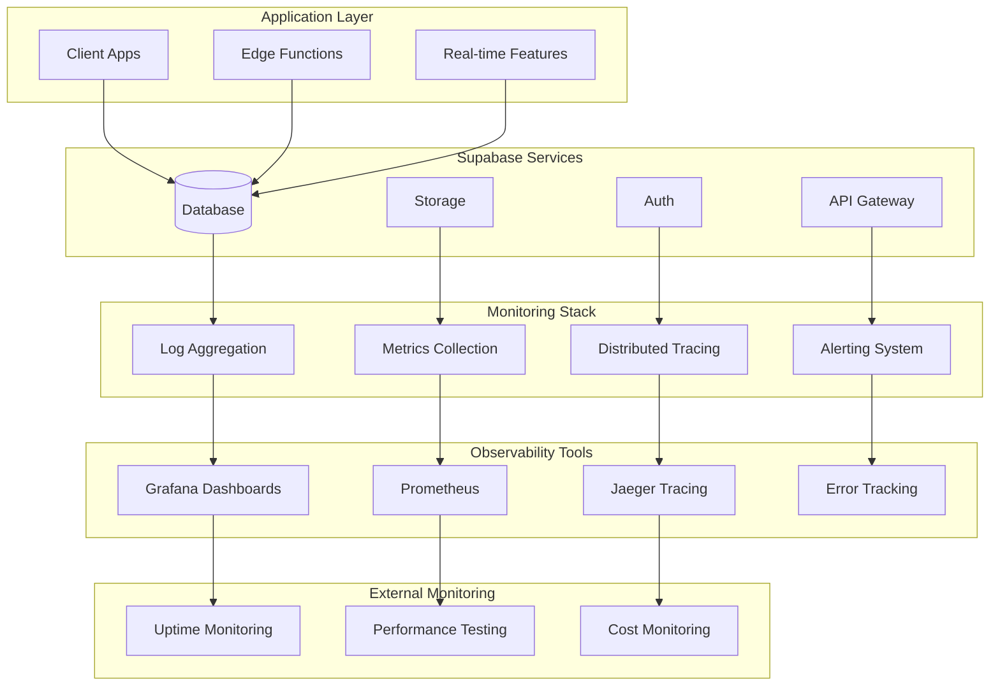

# Monitoring & Observability

Comprehensive monitoring and observability are crucial for maintaining reliable AIMatrix applications at scale. This guide covers performance monitoring, alerting, debugging, and optimization strategies for Supabase-powered systems.

## Observability Architecture



## Database Performance Monitoring

### Query Performance Analytics

```sql
-- Create performance monitoring tables
CREATE TABLE query_performance_logs (
    id UUID PRIMARY KEY DEFAULT uuid_generate_v4(),
    query_hash TEXT NOT NULL,
    query_text TEXT,
    execution_time_ms DECIMAL,
    rows_returned INTEGER,
    rows_examined INTEGER,
    index_usage JSONB,
    user_id UUID,
    organization_id UUID,
    created_at TIMESTAMPTZ DEFAULT NOW()
);

-- Create indexes for performance queries
CREATE INDEX idx_query_perf_hash ON query_performance_logs(query_hash);
CREATE INDEX idx_query_perf_time ON query_performance_logs(created_at);
CREATE INDEX idx_query_perf_duration ON query_performance_logs(execution_time_ms);

-- Function to log slow queries
CREATE OR REPLACE FUNCTION log_slow_query(
    query_text TEXT,
    execution_time_ms DECIMAL,
    rows_returned INTEGER DEFAULT NULL,
    user_id UUID DEFAULT NULL
)
RETURNS VOID AS $$
DECLARE
    query_hash TEXT;
BEGIN
    -- Generate hash for query normalization
    query_hash := encode(digest(regexp_replace(query_text, '\s+', ' ', 'g'), 'sha256'), 'hex');
    
    -- Log only if execution time exceeds threshold
    IF execution_time_ms > 1000 THEN -- 1 second threshold
        INSERT INTO query_performance_logs (
            query_hash,
            query_text,
            execution_time_ms,
            rows_returned,
            user_id,
            organization_id
        ) VALUES (
            query_hash,
            query_text,
            execution_time_ms,
            rows_returned,
            user_id,
            (SELECT organization_id FROM users WHERE id = user_id)
        );
    END IF;
END;
$$ LANGUAGE plpgsql;

-- View for query performance analysis
CREATE VIEW slow_queries_summary AS
SELECT 
    query_hash,
    LEFT(query_text, 100) as query_preview,
    COUNT(*) as occurrence_count,
    AVG(execution_time_ms) as avg_execution_time,
    MAX(execution_time_ms) as max_execution_time,
    AVG(rows_returned) as avg_rows_returned,
    DATE_TRUNC('hour', created_at) as hour_bucket
FROM query_performance_logs
WHERE created_at >= NOW() - INTERVAL '24 hours'
GROUP BY query_hash, query_text, hour_bucket
HAVING COUNT(*) > 5 OR AVG(execution_time_ms) > 500
ORDER BY avg_execution_time DESC;
```

### Database Health Monitoring

```typescript
class DatabaseHealthMonitor {
  private supabase: SupabaseClient

  constructor() {
    this.supabase = createClient(
      process.env.SUPABASE_URL!,
      process.env.SUPABASE_SERVICE_ROLE_KEY!
    )
  }

  async getConnectionStats(): Promise<ConnectionStats> {
    const { data, error } = await this.supabase.rpc('get_connection_stats')
    
    if (error) throw error
    
    return {
      activeConnections: data.active_connections,
      maxConnections: data.max_connections,
      connectionUtilization: data.active_connections / data.max_connections,
      idleConnections: data.idle_connections,
      waitingConnections: data.waiting_connections
    }
  }

  async getTableStats(): Promise<TableStats[]> {
    const { data, error } = await this.supabase.rpc('get_table_stats')
    
    if (error) throw error
    
    return data.map((table: any) => ({
      tableName: table.table_name,
      rowCount: table.row_count,
      tableSize: table.table_size,
      indexSize: table.index_size,
      lastVacuum: table.last_vacuum,
      lastAnalyze: table.last_analyze
    }))
  }

  async getQueryPerformance(timeRange: string = '1 hour'): Promise<QueryStats[]> {
    const { data, error } = await this.supabase
      .from('slow_queries_summary')
      .select('*')
      .gte('hour_bucket', `now() - interval '${timeRange}'`)
      .order('avg_execution_time', { ascending: false })
      .limit(20)

    if (error) throw error

    return data.map(query => ({
      queryHash: query.query_hash,
      queryPreview: query.query_preview,
      occurrenceCount: query.occurrence_count,
      avgExecutionTime: query.avg_execution_time,
      maxExecutionTime: query.max_execution_time,
      avgRowsReturned: query.avg_rows_returned
    }))
  }

  async checkIndexEfficiency(): Promise<IndexStats[]> {
    const { data, error } = await this.supabase.rpc('analyze_index_usage')
    
    if (error) throw error
    
    return data
      .filter((index: any) => index.usage_ratio < 0.1) // Unused indexes
      .map((index: any) => ({
        tableName: index.table_name,
        indexName: index.index_name,
        indexSize: index.index_size,
        usageRatio: index.usage_ratio,
        scansCount: index.scans_count,
        recommendation: index.usage_ratio === 0 ? 'DROP' : 'REVIEW'
      }))
  }
}

interface ConnectionStats {
  activeConnections: number
  maxConnections: number
  connectionUtilization: number
  idleConnections: number
  waitingConnections: number
}

interface TableStats {
  tableName: string
  rowCount: number
  tableSize: string
  indexSize: string
  lastVacuum: string
  lastAnalyze: string
}

interface QueryStats {
  queryHash: string
  queryPreview: string
  occurrenceCount: number
  avgExecutionTime: number
  maxExecutionTime: number
  avgRowsReturned: number
}

interface IndexStats {
  tableName: string
  indexName: string
  indexSize: string
  usageRatio: number
  scansCount: number
  recommendation: string
}
```

### Vector Database Monitoring

```typescript
class VectorDBMonitor {
  async getVectorIndexStats(): Promise<VectorIndexStats[]> {
    const { data, error } = await this.supabase.rpc('get_vector_index_stats')
    
    if (error) throw error
    
    return data.map((index: any) => ({
      tableName: index.table_name,
      columnName: index.column_name,
      indexType: index.index_type,
      indexSize: index.index_size,
      vectorCount: index.vector_count,
      averageQueryTime: index.avg_query_time,
      indexParameters: index.index_parameters
    }))
  }

  async monitorVectorQueries(): Promise<VectorQueryStats[]> {
    const { data, error } = await this.supabase
      .from('vector_query_logs')
      .select('*')
      .gte('created_at', new Date(Date.now() - 24 * 60 * 60 * 1000).toISOString())
      .order('query_time_ms', { ascending: false })
      .limit(100)

    if (error) throw error

    return data.map(log => ({
      queryType: log.query_type,
      similarityThreshold: log.similarity_threshold,
      vectorDimension: log.vector_dimension,
      queryTimeMs: log.query_time_ms,
      resultCount: log.result_count,
      indexUsed: log.index_used,
      createdAt: log.created_at
    }))
  }

  async getEmbeddingGenerationStats(): Promise<EmbeddingStats> {
    const { data, error } = await this.supabase
      .from('embedding_generation_logs')
      .select('*')
      .gte('created_at', new Date(Date.now() - 24 * 60 * 60 * 1000).toISOString())

    if (error) throw error

    const stats = data.reduce((acc, log) => {
      acc.totalGenerations++
      acc.totalTokens += log.token_count
      acc.totalTime += log.generation_time_ms
      if (log.error) acc.errorCount++
      return acc
    }, {
      totalGenerations: 0,
      totalTokens: 0,
      totalTime: 0,
      errorCount: 0
    })

    return {
      ...stats,
      avgTimePerGeneration: stats.totalTime / stats.totalGenerations,
      avgTokensPerGeneration: stats.totalTokens / stats.totalGenerations,
      errorRate: stats.errorCount / stats.totalGenerations,
      costEstimate: stats.totalTokens * 0.0001 // OpenAI pricing estimate
    }
  }
}

interface VectorIndexStats {
  tableName: string
  columnName: string
  indexType: string
  indexSize: string
  vectorCount: number
  averageQueryTime: number
  indexParameters: any
}

interface VectorQueryStats {
  queryType: string
  similarityThreshold: number
  vectorDimension: number
  queryTimeMs: number
  resultCount: number
  indexUsed: boolean
  createdAt: string
}

interface EmbeddingStats {
  totalGenerations: number
  totalTokens: number
  totalTime: number
  errorCount: number
  avgTimePerGeneration: number
  avgTokensPerGeneration: number
  errorRate: number
  costEstimate: number
}
```

## Application Performance Monitoring

### Real-time Performance Tracking

```typescript
class ApplicationMonitor {
  private metrics: Map<string, MetricData> = new Map()
  private readonly maxMetrics = 10000

  // Track custom metrics
  recordMetric(name: string, value: number, tags: Record<string, string> = {}) {
    const key = `${name}:${JSON.stringify(tags)}`
    const now = Date.now()

    if (!this.metrics.has(key)) {
      this.metrics.set(key, {
        name,
        values: [],
        tags,
        lastUpdated: now
      })
    }

    const metric = this.metrics.get(key)!
    metric.values.push({ value, timestamp: now })
    metric.lastUpdated = now

    // Keep only recent values
    if (metric.values.length > 1000) {
      metric.values = metric.values.slice(-500)
    }

    // Clean up old metrics
    if (this.metrics.size > this.maxMetrics) {
      this.cleanupOldMetrics()
    }
  }

  // Track API response times
  async trackAPICall<T>(
    endpoint: string,
    operation: () => Promise<T>,
    tags: Record<string, string> = {}
  ): Promise<T> {
    const startTime = performance.now()
    let error: Error | null = null

    try {
      const result = await operation()
      return result
    } catch (e) {
      error = e as Error
      throw e
    } finally {
      const duration = performance.now() - startTime
      
      this.recordMetric('api.response_time', duration, {
        endpoint,
        status: error ? 'error' : 'success',
        ...tags
      })

      if (error) {
        this.recordMetric('api.error_count', 1, {
          endpoint,
          error_type: error.constructor.name,
          ...tags
        })
      }
    }
  }

  // Monitor real-time connection health
  monitorRealtimeConnection(channel: string) {
    let connectionStartTime = Date.now()
    let messageCount = 0
    let lastMessageTime = Date.now()

    return {
      onConnect: () => {
        connectionStartTime = Date.now()
        this.recordMetric('realtime.connection', 1, { channel, event: 'connect' })
      },

      onDisconnect: () => {
        const connectionDuration = Date.now() - connectionStartTime
        this.recordMetric('realtime.connection_duration', connectionDuration, { channel })
        this.recordMetric('realtime.connection', -1, { channel, event: 'disconnect' })
      },

      onMessage: (payload: any) => {
        messageCount++
        lastMessageTime = Date.now()
        this.recordMetric('realtime.message_count', 1, { 
          channel, 
          event_type: payload.eventType || 'unknown' 
        })
      },

      onError: (error: Error) => {
        this.recordMetric('realtime.error_count', 1, { 
          channel, 
          error_type: error.constructor.name 
        })
      },

      getStats: () => ({
        connectionDuration: Date.now() - connectionStartTime,
        messageCount,
        timeSinceLastMessage: Date.now() - lastMessageTime
      })
    }
  }

  // Get metric summaries
  getMetricSummary(name: string, timeRange: number = 3600000): MetricSummary {
    const cutoffTime = Date.now() - timeRange
    const matchingMetrics = Array.from(this.metrics.values())
      .filter(metric => metric.name === name)

    const allValues = matchingMetrics
      .flatMap(metric => metric.values)
      .filter(value => value.timestamp > cutoffTime)
      .sort((a, b) => a.timestamp - b.timestamp)

    if (allValues.length === 0) {
      return { name, count: 0, min: 0, max: 0, avg: 0, sum: 0 }
    }

    const values = allValues.map(v => v.value)
    const sum = values.reduce((acc, val) => acc + val, 0)

    return {
      name,
      count: values.length,
      min: Math.min(...values),
      max: Math.max(...values),
      avg: sum / values.length,
      sum,
      p50: this.percentile(values, 0.5),
      p95: this.percentile(values, 0.95),
      p99: this.percentile(values, 0.99)
    }
  }

  private percentile(values: number[], percentile: number): number {
    const sorted = values.slice().sort((a, b) => a - b)
    const index = Math.ceil(sorted.length * percentile) - 1
    return sorted[index] || 0
  }

  private cleanupOldMetrics() {
    const cutoffTime = Date.now() - 3600000 // 1 hour
    const keysToDelete = []

    for (const [key, metric] of this.metrics) {
      if (metric.lastUpdated < cutoffTime) {
        keysToDelete.push(key)
      }
    }

    keysToDelete.forEach(key => this.metrics.delete(key))
  }
}

interface MetricData {
  name: string
  values: Array<{ value: number; timestamp: number }>
  tags: Record<string, string>
  lastUpdated: number
}

interface MetricSummary {
  name: string
  count: number
  min: number
  max: number
  avg: number
  sum: number
  p50?: number
  p95?: number
  p99?: number
}
```

### Error Tracking and Logging

```typescript
class ErrorTracker {
  private errorBuffer: ErrorEvent[] = []
  private readonly maxErrors = 1000

  captureError(
    error: Error,
    context: ErrorContext = {},
    severity: 'low' | 'medium' | 'high' | 'critical' = 'medium'
  ) {
    const errorEvent: ErrorEvent = {
      id: crypto.randomUUID(),
      message: error.message,
      stack: error.stack,
      name: error.name,
      context,
      severity,
      timestamp: new Date().toISOString(),
      userAgent: typeof navigator !== 'undefined' ? navigator.userAgent : 'server',
      url: typeof window !== 'undefined' ? window.location.href : 'server'
    }

    this.errorBuffer.push(errorEvent)

    // Keep buffer size manageable
    if (this.errorBuffer.length > this.maxErrors) {
      this.errorBuffer = this.errorBuffer.slice(-this.maxErrors / 2)
    }

    // Send to external error tracking service
    this.sendToErrorService(errorEvent)

    // Log critical errors immediately
    if (severity === 'critical') {
      this.sendImmediateAlert(errorEvent)
    }
  }

  captureException(exception: unknown, context: ErrorContext = {}) {
    const error = exception instanceof Error 
      ? exception 
      : new Error(String(exception))
    
    this.captureError(error, context, 'high')
  }

  // Capture performance issues
  capturePerformanceIssue(
    operation: string,
    duration: number,
    threshold: number,
    context: ErrorContext = {}
  ) {
    if (duration > threshold) {
      const error = new Error(
        `Performance threshold exceeded: ${operation} took ${duration}ms (threshold: ${threshold}ms)`
      )
      
      this.captureError(error, {
        ...context,
        operation,
        duration,
        threshold,
        type: 'performance'
      }, 'medium')
    }
  }

  // Get error statistics
  getErrorStats(timeRange: number = 3600000): ErrorStats {
    const cutoffTime = Date.now() - timeRange
    const recentErrors = this.errorBuffer.filter(
      error => Date.parse(error.timestamp) > cutoffTime
    )

    const errorsByType = recentErrors.reduce((acc, error) => {
      acc[error.name] = (acc[error.name] || 0) + 1
      return acc
    }, {} as Record<string, number>)

    const errorsBySeverity = recentErrors.reduce((acc, error) => {
      acc[error.severity] = (acc[error.severity] || 0) + 1
      return acc
    }, {} as Record<string, number>)

    return {
      totalErrors: recentErrors.length,
      errorsByType,
      errorsBySeverity,
      errorRate: recentErrors.length / (timeRange / 1000), // errors per second
      topErrors: Object.entries(errorsByType)
        .sort(([,a], [,b]) => b - a)
        .slice(0, 10)
        .map(([type, count]) => ({ type, count }))
    }
  }

  private async sendToErrorService(errorEvent: ErrorEvent) {
    try {
      // Send to Sentry, Bugsnag, or similar service
      await fetch('/api/errors', {
        method: 'POST',
        headers: { 'Content-Type': 'application/json' },
        body: JSON.stringify(errorEvent)
      })
    } catch (e) {
      console.error('Failed to send error to tracking service:', e)
    }
  }

  private async sendImmediateAlert(errorEvent: ErrorEvent) {
    try {
      // Send to alerting system (Slack, PagerDuty, etc.)
      await fetch('/api/alerts/critical', {
        method: 'POST',
        headers: { 'Content-Type': 'application/json' },
        body: JSON.stringify({
          title: `Critical Error: ${errorEvent.name}`,
          message: errorEvent.message,
          context: errorEvent.context,
          timestamp: errorEvent.timestamp
        })
      })
    } catch (e) {
      console.error('Failed to send critical alert:', e)
    }
  }
}

interface ErrorEvent {
  id: string
  message: string
  stack?: string
  name: string
  context: ErrorContext
  severity: string
  timestamp: string
  userAgent: string
  url: string
}

interface ErrorContext {
  userId?: string
  organizationId?: string
  operation?: string
  duration?: number
  threshold?: number
  type?: string
  [key: string]: any
}

interface ErrorStats {
  totalErrors: number
  errorsByType: Record<string, number>
  errorsBySeverity: Record<string, number>
  errorRate: number
  topErrors: Array<{ type: string; count: number }>
}
```

## Infrastructure Monitoring

### System Resource Monitoring

```typescript
class InfrastructureMonitor {
  async getSystemMetrics(): Promise<SystemMetrics> {
    // These would typically come from your hosting platform API
    const metrics = await this.fetchSystemMetrics()
    
    return {
      cpu: {
        usage: metrics.cpu_usage_percent,
        load_1m: metrics.load_1m,
        load_5m: metrics.load_5m,
        load_15m: metrics.load_15m
      },
      memory: {
        total: metrics.memory_total_bytes,
        used: metrics.memory_used_bytes,
        available: metrics.memory_available_bytes,
        usage_percent: (metrics.memory_used_bytes / metrics.memory_total_bytes) * 100
      },
      disk: {
        total: metrics.disk_total_bytes,
        used: metrics.disk_used_bytes,
        available: metrics.disk_available_bytes,
        usage_percent: (metrics.disk_used_bytes / metrics.disk_total_bytes) * 100
      },
      network: {
        bytes_in: metrics.network_bytes_in,
        bytes_out: metrics.network_bytes_out,
        packets_in: metrics.network_packets_in,
        packets_out: metrics.network_packets_out
      }
    }
  }

  async monitorSupabaseMetrics(): Promise<SupabaseMetrics> {
    // Use Supabase API to get service metrics
    const response = await fetch(`${process.env.SUPABASE_URL}/rest/v1/rpc/get_metrics`, {
      headers: {
        'Authorization': `Bearer ${process.env.SUPABASE_SERVICE_ROLE_KEY}`,
        'apikey': process.env.SUPABASE_SERVICE_ROLE_KEY!
      }
    })

    const data = await response.json()
    
    return {
      database: {
        connections_active: data.db_connections_active,
        connections_max: data.db_connections_max,
        queries_per_second: data.db_queries_per_second,
        cache_hit_rate: data.db_cache_hit_rate,
        replication_lag: data.db_replication_lag
      },
      auth: {
        active_users: data.auth_active_users,
        sign_ins_per_hour: data.auth_sign_ins_per_hour,
        token_refresh_rate: data.auth_token_refresh_rate
      },
      storage: {
        total_files: data.storage_total_files,
        total_size_bytes: data.storage_total_size_bytes,
        bandwidth_usage: data.storage_bandwidth_usage
      },
      realtime: {
        active_connections: data.realtime_active_connections,
        messages_per_second: data.realtime_messages_per_second,
        channels_active: data.realtime_channels_active
      },
      edge_functions: {
        invocations_per_minute: data.functions_invocations_per_minute,
        average_duration_ms: data.functions_avg_duration_ms,
        error_rate: data.functions_error_rate
      }
    }
  }

  private async fetchSystemMetrics(): Promise<any> {
    // Mock implementation - replace with actual system metrics API
    return {
      cpu_usage_percent: Math.random() * 100,
      load_1m: Math.random() * 4,
      load_5m: Math.random() * 4,
      load_15m: Math.random() * 4,
      memory_total_bytes: 8 * 1024 * 1024 * 1024,
      memory_used_bytes: Math.random() * 8 * 1024 * 1024 * 1024,
      memory_available_bytes: 8 * 1024 * 1024 * 1024 - Math.random() * 8 * 1024 * 1024 * 1024,
      disk_total_bytes: 100 * 1024 * 1024 * 1024,
      disk_used_bytes: Math.random() * 100 * 1024 * 1024 * 1024,
      disk_available_bytes: 100 * 1024 * 1024 * 1024 - Math.random() * 100 * 1024 * 1024 * 1024,
      network_bytes_in: Math.random() * 1000000,
      network_bytes_out: Math.random() * 1000000,
      network_packets_in: Math.random() * 10000,
      network_packets_out: Math.random() * 10000
    }
  }
}

interface SystemMetrics {
  cpu: {
    usage: number
    load_1m: number
    load_5m: number
    load_15m: number
  }
  memory: {
    total: number
    used: number
    available: number
    usage_percent: number
  }
  disk: {
    total: number
    used: number
    available: number
    usage_percent: number
  }
  network: {
    bytes_in: number
    bytes_out: number
    packets_in: number
    packets_out: number
  }
}

interface SupabaseMetrics {
  database: {
    connections_active: number
    connections_max: number
    queries_per_second: number
    cache_hit_rate: number
    replication_lag: number
  }
  auth: {
    active_users: number
    sign_ins_per_hour: number
    token_refresh_rate: number
  }
  storage: {
    total_files: number
    total_size_bytes: number
    bandwidth_usage: number
  }
  realtime: {
    active_connections: number
    messages_per_second: number
    channels_active: number
  }
  edge_functions: {
    invocations_per_minute: number
    average_duration_ms: number
    error_rate: number
  }
}
```

### Cost Monitoring

```typescript
class CostMonitor {
  async getSupabaseCosts(): Promise<CostBreakdown> {
    // Fetch usage data from Supabase API
    const usage = await this.getUsageData()
    
    return {
      database: this.calculateDatabaseCosts(usage.database),
      auth: this.calculateAuthCosts(usage.auth),
      storage: this.calculateStorageCosts(usage.storage),
      bandwidth: this.calculateBandwidthCosts(usage.bandwidth),
      edge_functions: this.calculateEdgeFunctionCosts(usage.edge_functions),
      total: 0 // Will be calculated
    }
  }

  private calculateDatabaseCosts(usage: any): number {
    // Supabase pricing tiers
    const freeLimit = 500 * 1024 * 1024 // 500MB
    const proPrice = 25 // $25/month for Pro
    
    if (usage.size_bytes <= freeLimit) {
      return 0
    }
    
    return proPrice + Math.max(0, (usage.size_bytes - 8 * 1024 * 1024 * 1024)) / (1024 * 1024 * 1024) * 0.125
  }

  private calculateAuthCosts(usage: any): number {
    const freeMAU = 50000
    const pricePerMAU = 0.00325
    
    return Math.max(0, usage.monthly_active_users - freeMAU) * pricePerMAU
  }

  private calculateStorageCosts(usage: any): number {
    const freeStorage = 1 * 1024 * 1024 * 1024 // 1GB
    const pricePerGB = 0.021
    
    const billableStorage = Math.max(0, usage.storage_bytes - freeStorage)
    return (billableStorage / (1024 * 1024 * 1024)) * pricePerGB
  }

  private calculateBandwidthCosts(usage: any): number {
    const freeBandwidth = 2 * 1024 * 1024 * 1024 // 2GB
    const pricePerGB = 0.09
    
    const billableBandwidth = Math.max(0, usage.egress_bytes - freeBandwidth)
    return (billableBandwidth / (1024 * 1024 * 1024)) * pricePerGB
  }

  private calculateEdgeFunctionCosts(usage: any): number {
    const freeInvocations = 500000
    const pricePerMillion = 2
    
    const billableInvocations = Math.max(0, usage.invocations - freeInvocations)
    return (billableInvocations / 1000000) * pricePerMillion
  }

  private async getUsageData(): Promise<any> {
    // Mock usage data - replace with actual Supabase API calls
    return {
      database: {
        size_bytes: Math.random() * 10 * 1024 * 1024 * 1024,
        queries: Math.random() * 1000000
      },
      auth: {
        monthly_active_users: Math.random() * 100000
      },
      storage: {
        storage_bytes: Math.random() * 5 * 1024 * 1024 * 1024
      },
      bandwidth: {
        egress_bytes: Math.random() * 10 * 1024 * 1024 * 1024
      },
      edge_functions: {
        invocations: Math.random() * 2000000
      }
    }
  }

  async generateCostAlert(threshold: number): Promise<void> {
    const costs = await this.getSupabaseCosts()
    
    if (costs.total > threshold) {
      await this.sendCostAlert({
        currentCost: costs.total,
        threshold,
        breakdown: costs,
        projectedMonthlyCost: costs.total * 30 // Rough projection
      })
    }
  }

  private async sendCostAlert(alert: CostAlert): Promise<void> {
    // Send alert via email, Slack, etc.
    console.log('Cost alert:', alert)
  }
}

interface CostBreakdown {
  database: number
  auth: number
  storage: number
  bandwidth: number
  edge_functions: number
  total: number
}

interface CostAlert {
  currentCost: number
  threshold: number
  breakdown: CostBreakdown
  projectedMonthlyCost: number
}
```

## Alerting and Notifications

### Smart Alerting System

```typescript
class AlertingSystem {
  private alertRules: AlertRule[] = []
  private alertHistory: AlertEvent[] = []
  private suppressionList: Map<string, number> = new Map()

  addAlertRule(rule: AlertRule) {
    this.alertRules.push(rule)
  }

  async evaluateAlerts(metrics: Record<string, number>) {
    for (const rule of this.alertRules) {
      const shouldAlert = await this.evaluateRule(rule, metrics)
      
      if (shouldAlert && !this.isSuppressed(rule.id)) {
        await this.triggerAlert(rule, metrics)
        this.suppressAlert(rule.id, rule.suppressionWindow || 300000) // 5 min default
      }
    }
  }

  private async evaluateRule(rule: AlertRule, metrics: Record<string, number>): Promise<boolean> {
    const value = metrics[rule.metric]
    if (value === undefined) return false

    switch (rule.operator) {
      case '>':
        return value > rule.threshold
      case '<':
        return value < rule.threshold
      case '>=':
        return value >= rule.threshold
      case '<=':
        return value <= rule.threshold
      case '==':
        return value === rule.threshold
      default:
        return false
    }
  }

  private async triggerAlert(rule: AlertRule, metrics: Record<string, number>) {
    const alertEvent: AlertEvent = {
      id: crypto.randomUUID(),
      ruleId: rule.id,
      title: rule.title,
      message: this.formatAlertMessage(rule, metrics),
      severity: rule.severity,
      timestamp: new Date().toISOString(),
      metrics,
      resolved: false
    }

    this.alertHistory.push(alertEvent)

    // Send notifications
    for (const channel of rule.notificationChannels) {
      await this.sendNotification(channel, alertEvent)
    }

    // Store in database for dashboard
    await this.storeAlert(alertEvent)
  }

  private formatAlertMessage(rule: AlertRule, metrics: Record<string, number>): string {
    return rule.message
      .replace(/\{(\w+)\}/g, (match, key) => {
        return metrics[key]?.toString() || match
      })
  }

  private isSuppressed(ruleId: string): boolean {
    const suppressedUntil = this.suppressionList.get(ruleId)
    return suppressedUntil ? Date.now() < suppressedUntil : false
  }

  private suppressAlert(ruleId: string, duration: number) {
    this.suppressionList.set(ruleId, Date.now() + duration)
  }

  private async sendNotification(channel: NotificationChannel, alert: AlertEvent) {
    switch (channel.type) {
      case 'email':
        await this.sendEmailNotification(channel, alert)
        break
      case 'slack':
        await this.sendSlackNotification(channel, alert)
        break
      case 'webhook':
        await this.sendWebhookNotification(channel, alert)
        break
      case 'pagerduty':
        await this.sendPagerDutyNotification(channel, alert)
        break
    }
  }

  private async sendEmailNotification(channel: NotificationChannel, alert: AlertEvent) {
    // Email notification implementation
    console.log(`Email alert to ${channel.address}:`, alert.title)
  }

  private async sendSlackNotification(channel: NotificationChannel, alert: AlertEvent) {
    const webhook = channel.webhook!
    const payload = {
      text: alert.title,
      attachments: [{
        color: this.getSeverityColor(alert.severity),
        fields: [{
          title: 'Message',
          value: alert.message,
          short: false
        }, {
          title: 'Severity',
          value: alert.severity,
          short: true
        }, {
          title: 'Time',
          value: alert.timestamp,
          short: true
        }]
      }]
    }

    await fetch(webhook, {
      method: 'POST',
      headers: { 'Content-Type': 'application/json' },
      body: JSON.stringify(payload)
    })
  }

  private async sendWebhookNotification(channel: NotificationChannel, alert: AlertEvent) {
    await fetch(channel.webhook!, {
      method: 'POST',
      headers: { 'Content-Type': 'application/json' },
      body: JSON.stringify(alert)
    })
  }

  private async sendPagerDutyNotification(channel: NotificationChannel, alert: AlertEvent) {
    // PagerDuty API integration
    const payload = {
      routing_key: channel.apiKey,
      event_action: 'trigger',
      payload: {
        summary: alert.title,
        source: 'AIMatrix Monitoring',
        severity: alert.severity,
        custom_details: {
          message: alert.message,
          metrics: alert.metrics
        }
      }
    }

    await fetch('https://events.pagerduty.com/v2/enqueue', {
      method: 'POST',
      headers: { 'Content-Type': 'application/json' },
      body: JSON.stringify(payload)
    })
  }

  private getSeverityColor(severity: string): string {
    const colors = {
      low: '#36a64f',
      medium: '#ffb347',
      high: '#ff6b6b',
      critical: '#dc143c'
    }
    return colors[severity] || '#808080'
  }

  private async storeAlert(alert: AlertEvent) {
    await supabase
      .from('alert_events')
      .insert(alert)
  }

  // Resolve alerts
  async resolveAlert(alertId: string, resolvedBy: string, notes?: string) {
    const alert = this.alertHistory.find(a => a.id === alertId)
    if (alert) {
      alert.resolved = true
      alert.resolvedAt = new Date().toISOString()
      alert.resolvedBy = resolvedBy
      alert.resolveNotes = notes

      await supabase
        .from('alert_events')
        .update({
          resolved: true,
          resolved_at: alert.resolvedAt,
          resolved_by: resolvedBy,
          resolve_notes: notes
        })
        .eq('id', alertId)
    }
  }
}

interface AlertRule {
  id: string
  title: string
  message: string
  metric: string
  operator: '>' | '<' | '>=' | '<=' | '=='
  threshold: number
  severity: 'low' | 'medium' | 'high' | 'critical'
  notificationChannels: NotificationChannel[]
  suppressionWindow?: number
}

interface NotificationChannel {
  type: 'email' | 'slack' | 'webhook' | 'pagerduty'
  address?: string
  webhook?: string
  apiKey?: string
}

interface AlertEvent {
  id: string
  ruleId: string
  title: string
  message: string
  severity: string
  timestamp: string
  metrics: Record<string, number>
  resolved: boolean
  resolvedAt?: string
  resolvedBy?: string
  resolveNotes?: string
}
```

## Dashboard and Visualization

### Real-time Dashboard

```typescript
class MonitoringDashboard {
  private updateInterval: number = 30000 // 30 seconds
  private charts: Map<string, Chart> = new Map()

  async initializeDashboard() {
    // Initialize metric collection
    await this.setupMetricCollection()
    
    // Create dashboard widgets
    this.createCPUChart()
    this.createMemoryChart()
    this.createDatabaseChart()
    this.createErrorRateChart()
    this.createRealtimeChart()
    
    // Start real-time updates
    this.startRealtimeUpdates()
  }

  private async setupMetricCollection() {
    // Set up metric collectors
    setInterval(async () => {
      const metrics = await this.collectAllMetrics()
      this.updateCharts(metrics)
    }, this.updateInterval)
  }

  private async collectAllMetrics(): Promise<DashboardMetrics> {
    const [
      systemMetrics,
      supabaseMetrics,
      appMetrics,
      errorStats
    ] = await Promise.all([
      new InfrastructureMonitor().getSystemMetrics(),
      new InfrastructureMonitor().monitorSupabaseMetrics(),
      new ApplicationMonitor().getMetricSummary('api.response_time'),
      new ErrorTracker().getErrorStats()
    ])

    return {
      system: systemMetrics,
      supabase: supabaseMetrics,
      application: appMetrics,
      errors: errorStats,
      timestamp: Date.now()
    }
  }

  private createCPUChart() {
    const chart = new Chart('cpu-chart', {
      type: 'line',
      data: {
        labels: [],
        datasets: [{
          label: 'CPU Usage %',
          data: [],
          borderColor: '#3b82f6',
          backgroundColor: 'rgba(59, 130, 246, 0.1)',
          tension: 0.4
        }]
      },
      options: {
        responsive: true,
        scales: {
          y: {
            beginAtZero: true,
            max: 100
          }
        },
        plugins: {
          legend: {
            display: true
          }
        }
      }
    })
    
    this.charts.set('cpu', chart)
  }

  private createDatabaseChart() {
    const chart = new Chart('database-chart', {
      type: 'doughnut',
      data: {
        labels: ['Active Connections', 'Available Connections'],
        datasets: [{
          data: [0, 100],
          backgroundColor: ['#ef4444', '#10b981'],
          borderWidth: 0
        }]
      },
      options: {
        responsive: true,
        plugins: {
          legend: {
            position: 'bottom'
          }
        }
      }
    })
    
    this.charts.set('database', chart)
  }

  private updateCharts(metrics: DashboardMetrics) {
    // Update CPU chart
    const cpuChart = this.charts.get('cpu')
    if (cpuChart) {
      const now = new Date().toLocaleTimeString()
      cpuChart.data.labels?.push(now)
      cpuChart.data.datasets[0].data.push(metrics.system.cpu.usage)
      
      // Keep only last 20 data points
      if (cpuChart.data.labels!.length > 20) {
        cpuChart.data.labels?.shift()
        cpuChart.data.datasets[0].data.shift()
      }
      
      cpuChart.update('none')
    }

    // Update database chart
    const dbChart = this.charts.get('database')
    if (dbChart) {
      const active = metrics.supabase.database.connections_active
      const max = metrics.supabase.database.connections_max
      
      dbChart.data.datasets[0].data = [active, max - active]
      dbChart.update('none')
    }
  }

  private startRealtimeUpdates() {
    // WebSocket connection for real-time updates
    const ws = new WebSocket('ws://localhost:3001/metrics')
    
    ws.onmessage = (event) => {
      const metrics = JSON.parse(event.data)
      this.updateCharts(metrics)
    }

    ws.onclose = () => {
      // Reconnect after 5 seconds
      setTimeout(() => this.startRealtimeUpdates(), 5000)
    }
  }

  // Export dashboard data
  async exportDashboardData(format: 'json' | 'csv' = 'json'): Promise<string> {
    const metrics = await this.collectAllMetrics()
    
    if (format === 'json') {
      return JSON.stringify(metrics, null, 2)
    } else {
      return this.convertToCSV(metrics)
    }
  }

  private convertToCSV(metrics: DashboardMetrics): string {
    const headers = ['timestamp', 'cpu_usage', 'memory_usage', 'db_connections', 'error_count']
    const row = [
      new Date(metrics.timestamp).toISOString(),
      metrics.system.cpu.usage,
      metrics.system.memory.usage_percent,
      metrics.supabase.database.connections_active,
      metrics.errors.totalErrors
    ]
    
    return [headers.join(','), row.join(',')].join('\n')
  }
}

interface DashboardMetrics {
  system: SystemMetrics
  supabase: SupabaseMetrics
  application: MetricSummary
  errors: ErrorStats
  timestamp: number
}
```

## Performance Optimization Recommendations

### Automated Performance Tuning

```typescript
class PerformanceOptimizer {
  async analyzePerformance(): Promise<OptimizationRecommendation[]> {
    const recommendations: OptimizationRecommendation[] = []

    // Analyze query performance
    const slowQueries = await this.findSlowQueries()
    recommendations.push(...this.generateQueryOptimizations(slowQueries))

    // Analyze index usage
    const indexStats = await this.analyzeIndexUsage()
    recommendations.push(...this.generateIndexOptimizations(indexStats))

    // Analyze vector performance
    const vectorStats = await this.analyzeVectorPerformance()
    recommendations.push(...this.generateVectorOptimizations(vectorStats))

    // Analyze real-time performance
    const realtimeStats = await this.analyzeRealtimePerformance()
    recommendations.push(...this.generateRealtimeOptimizations(realtimeStats))

    return recommendations.sort((a, b) => b.impact - a.impact)
  }

  private async findSlowQueries(): Promise<QueryAnalysis[]> {
    const { data } = await supabase
      .from('slow_queries_summary')
      .select('*')
      .gte('avg_execution_time', 1000) // > 1 second
      .order('avg_execution_time', { ascending: false })
      .limit(20)

    return data || []
  }

  private generateQueryOptimizations(queries: QueryAnalysis[]): OptimizationRecommendation[] {
    return queries.map(query => ({
      type: 'query',
      title: `Optimize slow query: ${query.query_preview}`,
      description: `Query takes ${query.avg_execution_time}ms on average`,
      impact: Math.min(query.avg_execution_time / 100, 10),
      effort: this.estimateQueryOptimizationEffort(query),
      actions: this.generateQueryActions(query)
    }))
  }

  private generateQueryActions(query: QueryAnalysis): string[] {
    const actions = []
    
    if (query.avg_execution_time > 5000) {
      actions.push('Consider breaking into smaller queries')
    }
    
    if (query.query_preview.includes('SELECT *')) {
      actions.push('Select only needed columns')
    }
    
    if (query.query_preview.includes('JOIN') && !query.query_preview.includes('INDEX')) {
      actions.push('Add indexes for JOIN conditions')
    }
    
    if (query.occurrence_count > 100) {
      actions.push('Consider caching results')
    }
    
    return actions
  }

  private async analyzeVectorPerformance(): Promise<VectorAnalysis[]> {
    const monitor = new VectorDBMonitor()
    const stats = await monitor.getVectorIndexStats()
    
    return stats.map(stat => ({
      tableName: stat.tableName,
      avgQueryTime: stat.averageQueryTime,
      vectorCount: stat.vectorCount,
      indexType: stat.indexType,
      needsOptimization: stat.averageQueryTime > 100 || stat.vectorCount > 100000
    }))
  }

  private generateVectorOptimizations(analyses: VectorAnalysis[]): OptimizationRecommendation[] {
    return analyses
      .filter(analysis => analysis.needsOptimization)
      .map(analysis => ({
        type: 'vector',
        title: `Optimize vector index for ${analysis.tableName}`,
        description: `Vector queries taking ${analysis.avgQueryTime}ms with ${analysis.vectorCount} vectors`,
        impact: Math.min(analysis.avgQueryTime / 50, 10),
        effort: analysis.vectorCount > 1000000 ? 8 : 5,
        actions: [
          analysis.indexType === 'ivfflat' && analysis.vectorCount > 1000000 
            ? 'Consider switching to HNSW index'
            : 'Tune index parameters',
          'Consider partitioning by metadata',
          'Implement result caching for common queries'
        ]
      }))
  }

  async applyOptimization(recommendation: OptimizationRecommendation): Promise<boolean> {
    try {
      switch (recommendation.type) {
        case 'query':
          return await this.applyQueryOptimization(recommendation)
        case 'index':
          return await this.applyIndexOptimization(recommendation)
        case 'vector':
          return await this.applyVectorOptimization(recommendation)
        default:
          return false
      }
    } catch (error) {
      console.error(`Failed to apply optimization: ${error.message}`)
      return false
    }
  }

  private async applyQueryOptimization(recommendation: OptimizationRecommendation): Promise<boolean> {
    // Implementation would depend on specific optimization
    console.log(`Applying query optimization: ${recommendation.title}`)
    return true
  }

  private estimateQueryOptimizationEffort(query: QueryAnalysis): number {
    let effort = 1
    
    if (query.query_preview.includes('JOIN')) effort += 2
    if (query.query_preview.includes('SUBQUERY')) effort += 3
    if (query.occurrence_count > 1000) effort += 1
    
    return Math.min(effort, 10)
  }
}

interface OptimizationRecommendation {
  type: 'query' | 'index' | 'vector' | 'realtime'
  title: string
  description: string
  impact: number // 1-10, higher = more impact
  effort: number // 1-10, higher = more effort
  actions: string[]
}

interface QueryAnalysis {
  query_preview: string
  avg_execution_time: number
  occurrence_count: number
  query_hash: string
}

interface VectorAnalysis {
  tableName: string
  avgQueryTime: number
  vectorCount: number
  indexType: string
  needsOptimization: boolean
}
```

## Conclusion

With comprehensive monitoring and observability in place, you now have:

1. **Real-time Performance Monitoring** - Track database, application, and infrastructure metrics
2. **Error Tracking and Alerting** - Capture and alert on errors and performance issues
3. **Cost Monitoring** - Track and optimize Supabase usage costs
4. **Automated Performance Optimization** - AI-powered recommendations for performance improvements
5. **Interactive Dashboards** - Visualize system health and performance trends

Your AIMatrix application is now equipped with production-grade monitoring capabilities that will help you maintain high availability, optimize performance, and control costs as you scale.