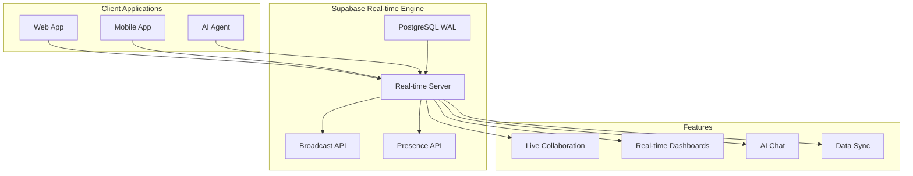

# Real-time Features with Supabase

Supabase's real-time engine enables building collaborative AI applications, live dashboards, and instant communication between AI agents and users. This guide covers all real-time capabilities from database change subscriptions to WebRTC signaling.

## Real-time Architecture Overview



## Database Change Subscriptions

### Basic Table Subscriptions

```typescript
import { supabase } from '@/lib/supabase'

// Subscribe to all changes on a table
const subscribeToMessages = () => {
  return supabase
    .channel('messages')
    .on('postgres_changes', 
      { 
        event: '*', 
        schema: 'public', 
        table: 'messages' 
      }, 
      (payload) => {
        console.log('Change received!', payload)
        handleMessageChange(payload)
      }
    )
    .subscribe()
}

// Subscribe to specific events
const subscribeToNewMessages = (conversationId: string) => {
  return supabase
    .channel(`messages:${conversationId}`)
    .on('postgres_changes',
      {
        event: 'INSERT',
        schema: 'public',
        table: 'messages',
        filter: `conversation_id=eq.${conversationId}`
      },
      (payload) => {
        console.log('New message:', payload.new)
        addMessageToUI(payload.new)
      }
    )
    .subscribe()
}

// Handle different change events
const handleMessageChange = (payload: any) => {
  switch (payload.eventType) {
    case 'INSERT':
      addMessageToUI(payload.new)
      break
    case 'UPDATE':
      updateMessageInUI(payload.new)
      break
    case 'DELETE':
      removeMessageFromUI(payload.old)
      break
  }
}
```

### Advanced Filtering

```typescript
// Filter by specific columns
const subscribeToAgentUpdates = (organizationId: string) => {
  return supabase
    .channel('agent_updates')
    .on('postgres_changes',
      {
        event: 'UPDATE',
        schema: 'public',
        table: 'ai_agents',
        filter: `organization_id=eq.${organizationId}`
      },
      (payload) => {
        // Only status changes
        if (payload.old.status !== payload.new.status) {
          handleAgentStatusChange(payload.new)
        }
      }
    )
    .subscribe()
}

// Multiple filters
const subscribeToUserConversations = (userId: string) => {
  return supabase
    .channel('user_conversations')
    .on('postgres_changes',
      {
        event: '*',
        schema: 'public',
        table: 'conversations',
        filter: `user_id=eq.${userId}`
      },
      handleConversationChange
    )
    .on('postgres_changes',
      {
        event: '*',
        schema: 'public',
        table: 'messages',
        filter: `conversation_id=in.(${getUserConversationIds(userId).join(',')})`
      },
      handleMessageChange
    )
    .subscribe()
}
```

## Presence: Who's Online

### Basic Presence Tracking

```typescript
// Track user presence
class PresenceManager {
  private channel: any
  private currentUser: any

  async joinChannel(channelName: string, userInfo: any) {
    this.channel = supabase.channel(channelName)
    this.currentUser = userInfo

    // Track presence
    const presenceTrackStatus = await this.channel.track({
      user_id: userInfo.id,
      full_name: userInfo.full_name,
      avatar_url: userInfo.avatar_url,
      status: 'online',
      last_seen: new Date().toISOString()
    })

    // Listen for presence changes
    this.channel.on('presence', { event: 'sync' }, () => {
      const onlineUsers = this.channel.presenceState()
      this.updateOnlineUsers(onlineUsers)
    })

    this.channel.on('presence', { event: 'join' }, ({ key, newPresences }) => {
      console.log('User joined:', newPresences)
      this.handleUserJoin(newPresences)
    })

    this.channel.on('presence', { event: 'leave' }, ({ key, leftPresences }) => {
      console.log('User left:', leftPresences)
      this.handleUserLeave(leftPresences)
    })

    await this.channel.subscribe()
    return presenceTrackStatus
  }

  updateStatus(status: 'online' | 'away' | 'busy') {
    if (this.channel) {
      this.channel.track({
        ...this.currentUser,
        status,
        last_seen: new Date().toISOString()
      })
    }
  }

  private updateOnlineUsers(presenceState: any) {
    const users = Object.values(presenceState).flat()
    // Update UI with online users
    this.onPresenceUpdate?.(users)
  }

  private handleUserJoin(newPresences: any[]) {
    newPresences.forEach(presence => {
      this.showUserJoinedNotification?.(presence)
    })
  }

  private handleUserLeave(leftPresences: any[]) {
    leftPresences.forEach(presence => {
      this.showUserLeftNotification?.(presence)
    })
  }

  async leaveChannel() {
    if (this.channel) {
      await this.channel.untrack()
      await this.channel.unsubscribe()
    }
  }
}
```

### Advanced Presence Features

```typescript
// Agent presence tracking
class AgentPresenceManager extends PresenceManager {
  async trackAgentActivity(agentId: string, activity: any) {
    await this.channel.track({
      agent_id: agentId,
      activity_type: activity.type,
      current_task: activity.task,
      progress: activity.progress,
      last_active: new Date().toISOString()
    })
  }

  // Track typing indicators
  async setTyping(isTyping: boolean) {
    await this.channel.track({
      ...this.currentUser,
      is_typing: isTyping,
      typing_at: isTyping ? new Date().toISOString() : null
    })
  }

  // Track cursor position for collaborative editing
  async updateCursor(position: { line: number, column: number }) {
    await this.channel.track({
      ...this.currentUser,
      cursor_position: position,
      updated_at: new Date().toISOString()
    })
  }
}
```

## Broadcast: Low-latency Messaging

### Real-time Chat Implementation

```typescript
class RealTimeChatManager {
  private channel: any

  async initializeChat(conversationId: string) {
    this.channel = supabase.channel(`chat:${conversationId}`)

    // Listen for broadcast messages
    this.channel.on('broadcast', { event: 'message' }, (payload) => {
      this.handleBroadcastMessage(payload)
    })

    this.channel.on('broadcast', { event: 'typing' }, (payload) => {
      this.handleTypingIndicator(payload)
    })

    this.channel.on('broadcast', { event: 'reaction' }, (payload) => {
      this.handleMessageReaction(payload)
    })

    await this.channel.subscribe()
  }

  // Send message via broadcast (faster than database)
  async sendMessage(message: any) {
    // Send via broadcast for immediate delivery
    await this.channel.send({
      type: 'broadcast',
      event: 'message',
      payload: {
        ...message,
        timestamp: new Date().toISOString(),
        temp_id: generateTempId()
      }
    })

    // Also save to database for persistence
    try {
      const { data } = await supabase
        .from('messages')
        .insert(message)
        .select()
        .single()

      // Update UI with database ID
      this.updateMessageWithId(message.temp_id, data.id)
    } catch (error) {
      this.handleMessageError(message.temp_id, error)
    }
  }

  // Typing indicator
  async sendTypingIndicator(isTyping: boolean) {
    await this.channel.send({
      type: 'broadcast',
      event: 'typing',
      payload: {
        user_id: this.getCurrentUser().id,
        is_typing: isTyping
      }
    })
  }

  // Message reactions
  async sendReaction(messageId: string, emoji: string) {
    await this.channel.send({
      type: 'broadcast',
      event: 'reaction',
      payload: {
        message_id: messageId,
        emoji,
        user_id: this.getCurrentUser().id
      }
    })

    // Persist reaction
    await supabase
      .from('message_reactions')
      .upsert({
        message_id: messageId,
        user_id: this.getCurrentUser().id,
        emoji
      })
  }

  private handleBroadcastMessage(payload: any) {
    // Add message to UI immediately
    this.addMessageToUI({
      ...payload.payload,
      status: 'sending'
    })
  }

  private handleTypingIndicator(payload: any) {
    this.updateTypingUsers(payload.payload)
  }

  private handleMessageReaction(payload: any) {
    this.addReactionToMessage(payload.payload)
  }
}
```

### WebRTC Signaling

```typescript
// WebRTC signaling for video/audio calls
class WebRTCSignaling {
  private channel: any
  private peerConnection: RTCPeerConnection

  async initializeSignaling(roomId: string) {
    this.channel = supabase.channel(`webrtc:${roomId}`)

    this.channel.on('broadcast', { event: 'offer' }, (payload) => {
      this.handleOffer(payload.payload)
    })

    this.channel.on('broadcast', { event: 'answer' }, (payload) => {
      this.handleAnswer(payload.payload)
    })

    this.channel.on('broadcast', { event: 'ice-candidate' }, (payload) => {
      this.handleIceCandidate(payload.payload)
    })

    await this.channel.subscribe()
  }

  async sendOffer(offer: RTCSessionDescriptionInit) {
    await this.channel.send({
      type: 'broadcast',
      event: 'offer',
      payload: {
        offer,
        from: this.getCurrentUser().id
      }
    })
  }

  async sendAnswer(answer: RTCSessionDescriptionInit) {
    await this.channel.send({
      type: 'broadcast',
      event: 'answer',
      payload: {
        answer,
        from: this.getCurrentUser().id
      }
    })
  }

  async sendIceCandidate(candidate: RTCIceCandidate) {
    await this.channel.send({
      type: 'broadcast',
      event: 'ice-candidate',
      payload: {
        candidate,
        from: this.getCurrentUser().id
      }
    })
  }

  private async handleOffer(payload: any) {
    await this.peerConnection.setRemoteDescription(payload.offer)
    const answer = await this.peerConnection.createAnswer()
    await this.peerConnection.setLocalDescription(answer)
    await this.sendAnswer(answer)
  }

  private async handleAnswer(payload: any) {
    await this.peerConnection.setRemoteDescription(payload.answer)
  }

  private async handleIceCandidate(payload: any) {
    await this.peerConnection.addIceCandidate(payload.candidate)
  }
}
```

## Live Collaboration

### Collaborative Document Editing

```typescript
class CollaborativeEditor {
  private channel: any
  private editor: any // Your editor instance
  private operationalTransform: OperationalTransform

  async initializeCollaboration(documentId: string) {
    this.channel = supabase.channel(`doc:${documentId}`)

    // Listen for document operations
    this.channel.on('broadcast', { event: 'operation' }, (payload) => {
      this.handleRemoteOperation(payload.payload)
    })

    // Listen for cursor movements
    this.channel.on('broadcast', { event: 'cursor' }, (payload) => {
      this.handleRemoteCursor(payload.payload)
    })

    // Listen for selections
    this.channel.on('broadcast', { event: 'selection' }, (payload) => {
      this.handleRemoteSelection(payload.payload)
    })

    await this.channel.subscribe()

    // Set up editor event listeners
    this.editor.on('change', this.handleLocalChange.bind(this))
    this.editor.on('cursor', this.handleLocalCursor.bind(this))
    this.editor.on('selection', this.handleLocalSelection.bind(this))
  }

  private async handleLocalChange(operation: any) {
    // Apply operational transformation
    const transformedOp = this.operationalTransform.transform(operation)

    // Broadcast to other users
    await this.channel.send({
      type: 'broadcast',
      event: 'operation',
      payload: {
        operation: transformedOp,
        user_id: this.getCurrentUser().id,
        timestamp: Date.now()
      }
    })

    // Save to database periodically
    this.debouncedSave()
  }

  private handleRemoteOperation(payload: any) {
    if (payload.user_id !== this.getCurrentUser().id) {
      const transformedOp = this.operationalTransform.transformAgainst(
        payload.operation,
        this.getPendingOperations()
      )
      this.editor.applyOperation(transformedOp)
    }
  }

  private async handleLocalCursor(position: any) {
    await this.channel.send({
      type: 'broadcast',
      event: 'cursor',
      payload: {
        position,
        user_id: this.getCurrentUser().id,
        user_color: this.getUserColor()
      }
    })
  }

  private handleRemoteCursor(payload: any) {
    if (payload.user_id !== this.getCurrentUser().id) {
      this.updateRemoteCursor(payload.user_id, payload.position, payload.user_color)
    }
  }

  // Conflict resolution using operational transformation
  private debouncedSave = debounce(async () => {
    const content = this.editor.getContent()
    await supabase
      .from('documents')
      .update({ content, updated_at: new Date().toISOString() })
      .eq('id', this.documentId)
  }, 1000)
}
```

### Real-time Whiteboard

```typescript
class RealTimeWhiteboard {
  private canvas: HTMLCanvasElement
  private context: CanvasRenderingContext2D
  private channel: any
  private isDrawing = false

  async initialize(boardId: string) {
    this.channel = supabase.channel(`whiteboard:${boardId}`)

    this.channel.on('broadcast', { event: 'draw' }, (payload) => {
      this.handleRemoteDraw(payload.payload)
    })

    this.channel.on('broadcast', { event: 'clear' }, () => {
      this.clearCanvas()
    })

    await this.channel.subscribe()

    this.setupCanvasEvents()
  }

  private setupCanvasEvents() {
    this.canvas.addEventListener('mousedown', this.startDrawing.bind(this))
    this.canvas.addEventListener('mousemove', this.draw.bind(this))
    this.canvas.addEventListener('mouseup', this.stopDrawing.bind(this))
  }

  private async startDrawing(event: MouseEvent) {
    this.isDrawing = true
    const point = this.getCanvasPoint(event)
    
    await this.channel.send({
      type: 'broadcast',
      event: 'draw',
      payload: {
        action: 'start',
        point,
        user_id: this.getCurrentUser().id,
        color: this.getCurrentColor(),
        lineWidth: this.getCurrentLineWidth()
      }
    })
  }

  private async draw(event: MouseEvent) {
    if (!this.isDrawing) return

    const point = this.getCanvasPoint(event)
    this.drawLine(this.lastPoint, point)

    await this.channel.send({
      type: 'broadcast',
      event: 'draw',
      payload: {
        action: 'draw',
        from: this.lastPoint,
        to: point,
        user_id: this.getCurrentUser().id
      }
    })

    this.lastPoint = point
  }

  private handleRemoteDraw(payload: any) {
    if (payload.user_id !== this.getCurrentUser().id) {
      switch (payload.action) {
        case 'start':
          this.setDrawingStyle(payload.color, payload.lineWidth)
          break
        case 'draw':
          this.drawLine(payload.from, payload.to)
          break
      }
    }
  }
}
```

## Live Dashboards

### Real-time Analytics Dashboard

```typescript
class LiveDashboard {
  private widgets: Map<string, DashboardWidget> = new Map()
  private channel: any

  async initialize(dashboardId: string) {
    this.channel = supabase.channel(`dashboard:${dashboardId}`)

    // Subscribe to data updates
    this.channel.on('postgres_changes',
      {
        event: '*',
        schema: 'public',
        table: 'analytics_events'
      },
      this.handleAnalyticsUpdate.bind(this)
    )

    // Subscribe to real-time metrics
    this.channel.on('broadcast', { event: 'metric_update' }, (payload) => {
      this.updateMetric(payload.payload)
    })

    await this.channel.subscribe()

    // Initialize widgets
    await this.loadDashboardWidgets()
  }

  private async handleAnalyticsUpdate(payload: any) {
    const event = payload.new || payload.old
    
    // Update relevant widgets
    this.widgets.forEach((widget, id) => {
      if (widget.shouldUpdate(event)) {
        widget.update(event)
      }
    })
  }

  private updateMetric(metric: any) {
    const widget = this.widgets.get(metric.widget_id)
    if (widget) {
      widget.updateValue(metric.value, metric.timestamp)
    }
  }

  // Add real-time chart widget
  addChartWidget(config: any) {
    const widget = new RealTimeChartWidget(config)
    this.widgets.set(config.id, widget)
    
    // Subscribe to specific data
    this.subscribeToWidgetData(widget)
  }

  private subscribeToWidgetData(widget: DashboardWidget) {
    // Subscribe to relevant database changes
    widget.getDataSources().forEach(source => {
      this.channel.on('postgres_changes',
        {
          event: '*',
          schema: 'public',
          table: source.table,
          filter: source.filter
        },
        (payload) => widget.handleDataChange(payload)
      )
    })
  }
}

// Real-time chart widget
class RealTimeChartWidget {
  private chart: Chart
  private dataBuffer: any[] = []
  private maxDataPoints = 50

  constructor(private config: any) {
    this.initializeChart()
  }

  handleDataChange(payload: any) {
    const newDataPoint = this.extractDataPoint(payload.new)
    
    // Add to buffer
    this.dataBuffer.push(newDataPoint)
    
    // Keep only recent data
    if (this.dataBuffer.length > this.maxDataPoints) {
      this.dataBuffer.shift()
    }

    // Update chart
    this.updateChart()
  }

  private updateChart() {
    this.chart.data.labels = this.dataBuffer.map(d => d.timestamp)
    this.chart.data.datasets[0].data = this.dataBuffer.map(d => d.value)
    this.chart.update('none') // No animation for real-time
  }
}
```

## Agent Communication

### Inter-Agent Messaging

```typescript
class AgentCommunicationManager {
  private channel: any
  private agentId: string

  async initialize(agentId: string) {
    this.agentId = agentId
    this.channel = supabase.channel(`agent:${agentId}`)

    // Listen for direct messages to this agent
    this.channel.on('broadcast', { event: 'agent_message' }, (payload) => {
      this.handleAgentMessage(payload.payload)
    })

    // Listen for broadcast messages
    this.channel.on('broadcast', { event: 'agent_broadcast' }, (payload) => {
      this.handleAgentBroadcast(payload.payload)
    })

    // Listen for coordination messages
    this.channel.on('broadcast', { event: 'coordination' }, (payload) => {
      this.handleCoordination(payload.payload)
    })

    await this.channel.subscribe()
  }

  // Send message to specific agent
  async sendMessageToAgent(targetAgentId: string, message: any) {
    const targetChannel = supabase.channel(`agent:${targetAgentId}`)
    
    await targetChannel.send({
      type: 'broadcast',
      event: 'agent_message',
      payload: {
        from: this.agentId,
        to: targetAgentId,
        message,
        timestamp: new Date().toISOString()
      }
    })
  }

  // Broadcast to all agents in organization
  async broadcastToAgents(message: any, organizationId: string) {
    const orgChannel = supabase.channel(`org:${organizationId}`)
    
    await orgChannel.send({
      type: 'broadcast',
      event: 'agent_broadcast',
      payload: {
        from: this.agentId,
        message,
        organization_id: organizationId,
        timestamp: new Date().toISOString()
      }
    })
  }

  // Coordinate task execution
  async requestTaskCoordination(task: any) {
    await this.channel.send({
      type: 'broadcast',
      event: 'coordination',
      payload: {
        type: 'task_request',
        agent_id: this.agentId,
        task,
        timestamp: new Date().toISOString()
      }
    })
  }

  private handleAgentMessage(payload: any) {
    if (payload.to === this.agentId) {
      this.processAgentMessage(payload.message, payload.from)
    }
  }

  private handleAgentBroadcast(payload: any) {
    if (payload.from !== this.agentId) {
      this.processBroadcastMessage(payload.message)
    }
  }

  private handleCoordination(payload: any) {
    switch (payload.type) {
      case 'task_request':
        this.evaluateTaskRequest(payload.task, payload.agent_id)
        break
      case 'task_offer':
        this.handleTaskOffer(payload)
        break
      case 'task_assignment':
        this.handleTaskAssignment(payload)
        break
    }
  }
}
```

## Performance Optimization

### Connection Management

```typescript
class RealtimeConnectionManager {
  private connections: Map<string, any> = new Map()
  private maxConnections = 10
  private connectionPool: any[] = []

  async getConnection(channelId: string): Promise<any> {
    // Reuse existing connection
    if (this.connections.has(channelId)) {
      return this.connections.get(channelId)
    }

    // Check connection limit
    if (this.connections.size >= this.maxConnections) {
      await this.pruneOldConnections()
    }

    // Create new connection
    const channel = supabase.channel(channelId, {
      config: {
        presence: { key: channelId },
        broadcast: { self: false }
      }
    })

    this.connections.set(channelId, {
      channel,
      lastUsed: Date.now(),
      subscribers: 1
    })

    return channel
  }

  async releaseConnection(channelId: string) {
    const connection = this.connections.get(channelId)
    if (connection) {
      connection.subscribers--
      
      if (connection.subscribers <= 0) {
        await connection.channel.unsubscribe()
        this.connections.delete(channelId)
      }
    }
  }

  private async pruneOldConnections() {
    const now = Date.now()
    const maxAge = 5 * 60 * 1000 // 5 minutes

    for (const [channelId, connection] of this.connections) {
      if (now - connection.lastUsed > maxAge && connection.subscribers === 0) {
        await connection.channel.unsubscribe()
        this.connections.delete(channelId)
      }
    }
  }
}
```

### Message Batching

```typescript
class MessageBatcher {
  private messageQueue: any[] = []
  private batchSize = 10
  private batchTimeout = 100 // ms

  private batchTimer: NodeJS.Timeout | null = null

  queueMessage(message: any) {
    this.messageQueue.push(message)

    if (this.messageQueue.length >= this.batchSize) {
      this.flushBatch()
    } else if (!this.batchTimer) {
      this.batchTimer = setTimeout(() => {
        this.flushBatch()
      }, this.batchTimeout)
    }
  }

  private async flushBatch() {
    if (this.messageQueue.length === 0) return

    const batch = this.messageQueue.splice(0, this.batchSize)
    
    if (this.batchTimer) {
      clearTimeout(this.batchTimer)
      this.batchTimer = null
    }

    // Send batch
    await this.channel.send({
      type: 'broadcast',
      event: 'batch_messages',
      payload: {
        messages: batch,
        timestamp: new Date().toISOString()
      }
    })
  }
}
```

## Testing Real-time Features

### Real-time Testing Utilities

```typescript
// Test utilities for real-time features
class RealtimeTestUtils {
  static async createTestChannel(channelName: string) {
    const channel = supabase.channel(channelName)
    await channel.subscribe()
    return channel
  }

  static async waitForEvent(channel: any, event: string, timeout = 5000): Promise<any> {
    return new Promise((resolve, reject) => {
      const timer = setTimeout(() => {
        reject(new Error(`Timeout waiting for event: ${event}`))
      }, timeout)

      channel.on('broadcast', { event }, (payload: any) => {
        clearTimeout(timer)
        resolve(payload)
      })
    })
  }

  static mockPresence(users: any[]) {
    return users.reduce((acc, user, index) => {
      acc[`presence-${index}`] = [user]
      return acc
    }, {})
  }
}

// Test examples
describe('Real-time Features', () => {
  test('should receive broadcast messages', async () => {
    const channel = await RealtimeTestUtils.createTestChannel('test-channel')
    
    // Send message
    await channel.send({
      type: 'broadcast',
      event: 'test_message',
      payload: { data: 'test' }
    })

    // Wait for message
    const received = await RealtimeTestUtils.waitForEvent(channel, 'test_message')
    expect(received.payload.data).toBe('test')

    await channel.unsubscribe()
  })

  test('should track presence correctly', async () => {
    const channel = await RealtimeTestUtils.createTestChannel('presence-test')
    
    await channel.track({ user_id: '123', status: 'online' })
    
    // Simulate presence sync
    const mockPresence = RealtimeTestUtils.mockPresence([
      { user_id: '123', status: 'online' }
    ])

    expect(mockPresence['presence-0'][0].user_id).toBe('123')
  })
})
```

## Next Steps

With real-time features implemented, you can now:

1. **[Implement Vector AI](vector-ai/)** - Add AI-powered search and recommendations
2. **[Create Edge Functions](edge-functions/)** - Build real-time API endpoints  
3. **[Set up Storage](storage-cdn/)** - Handle file sharing in real-time
4. **[Configure Monitoring](monitoring-observability/)** - Track real-time performance

Your application now supports collaborative features, live updates, and instant communication between users and AI agents.