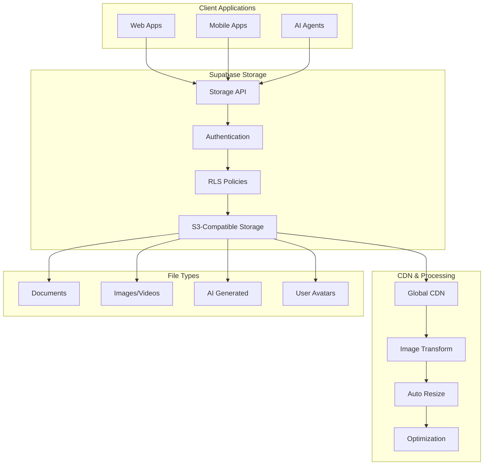

# Storage & CDN with Supabase

Supabase Storage provides a scalable file storage solution with integrated CDN, image transformations, and fine-grained access control, perfect for AIMatrix applications handling documents, media, and AI-generated content.

## Storage Architecture



## Storage Setup and Configuration

### Create Storage Buckets

```sql
-- Create storage buckets
INSERT INTO storage.buckets (id, name, public, file_size_limit, allowed_mime_types)
VALUES 
  ('avatars', 'avatars', true, 1048576, ARRAY['image/jpeg', 'image/png', 'image/webp']), -- 1MB limit
  ('documents', 'documents', false, 10485760, ARRAY['application/pdf', 'text/plain', 'application/msword']), -- 10MB limit
  ('ai-generated', 'ai-generated', false, 52428800, ARRAY['image/png', 'image/jpeg', 'application/json']), -- 50MB limit
  ('chat-attachments', 'chat-attachments', false, 5242880, NULL), -- 5MB limit, all mime types
  ('knowledge-base', 'knowledge-base', false, 104857600, NULL); -- 100MB limit
```

### Configure Bucket Policies

```sql
-- Avatar policies (public read, authenticated upload)
CREATE POLICY "Anyone can view avatars" ON storage.objects
    FOR SELECT USING (bucket_id = 'avatars');

CREATE POLICY "Users can upload their own avatar" ON storage.objects
    FOR INSERT WITH CHECK (
        bucket_id = 'avatars' AND
        auth.uid()::text = (storage.foldername(name))[1] AND
        auth.uid() IS NOT NULL
    );

CREATE POLICY "Users can update their own avatar" ON storage.objects
    FOR UPDATE USING (
        bucket_id = 'avatars' AND
        auth.uid()::text = (storage.foldername(name))[1] AND
        auth.uid() IS NOT NULL
    );

-- Document policies (organization-based access)
CREATE POLICY "Users can view organization documents" ON storage.objects
    FOR SELECT USING (
        bucket_id = 'documents' AND
        (storage.foldername(name))[1] = (
            SELECT organization_id::text 
            FROM users 
            WHERE id = auth.uid()
        )
    );

CREATE POLICY "Users can upload organization documents" ON storage.objects
    FOR INSERT WITH CHECK (
        bucket_id = 'documents' AND
        (storage.foldername(name))[1] = (
            SELECT organization_id::text 
            FROM users 
            WHERE id = auth.uid()
        )
    );

-- AI-generated content policies
CREATE POLICY "Users can view their AI-generated content" ON storage.objects
    FOR SELECT USING (
        bucket_id = 'ai-generated' AND
        (
            (storage.foldername(name))[1] = auth.uid()::text OR
            (storage.foldername(name))[1] = (
                SELECT organization_id::text 
                FROM users 
                WHERE id = auth.uid()
            )
        )
    );

CREATE POLICY "Authenticated users can upload AI content" ON storage.objects
    FOR INSERT WITH CHECK (
        bucket_id = 'ai-generated' AND
        auth.uid() IS NOT NULL
    );

-- Chat attachment policies
CREATE POLICY "Users can view conversation attachments" ON storage.objects
    FOR SELECT USING (
        bucket_id = 'chat-attachments' AND
        (storage.foldername(name))[1] IN (
            SELECT id::text FROM conversations 
            WHERE user_id = auth.uid() OR
            organization_id = (
                SELECT organization_id FROM users WHERE id = auth.uid()
            )
        )
    );

CREATE POLICY "Users can upload to their conversations" ON storage.objects
    FOR INSERT WITH CHECK (
        bucket_id = 'chat-attachments' AND
        (storage.foldername(name))[1] IN (
            SELECT id::text FROM conversations WHERE user_id = auth.uid()
        )
    );

-- Knowledge base policies
CREATE POLICY "Organization members can access knowledge base files" ON storage.objects
    FOR SELECT USING (
        bucket_id = 'knowledge-base' AND
        (storage.foldername(name))[1] = (
            SELECT organization_id::text 
            FROM users 
            WHERE id = auth.uid()
        )
    );

CREATE POLICY "Organization admins can manage knowledge base" ON storage.objects
    FOR ALL USING (
        bucket_id = 'knowledge-base' AND
        (storage.foldername(name))[1] = (
            SELECT organization_id::text 
            FROM users 
            WHERE id = auth.uid() AND role = 'admin'
        )
    );
```

## File Upload Implementation

### Basic File Upload

```typescript
import { supabase } from '@/lib/supabase'
import { v4 as uuidv4 } from 'uuid'

class FileUploadService {
  async uploadFile(
    bucket: string,
    file: File,
    folder?: string,
    options: any = {}
  ): Promise<{ path: string; url: string }> {
    // Generate unique filename
    const fileExt = file.name.split('.').pop()
    const fileName = `${uuidv4()}.${fileExt}`
    const filePath = folder ? `${folder}/${fileName}` : fileName

    // Validate file
    this.validateFile(file, bucket)

    // Upload file
    const { data, error } = await supabase.storage
      .from(bucket)
      .upload(filePath, file, {
        cacheControl: '3600',
        upsert: options.upsert || false,
        ...options
      })

    if (error) throw error

    // Get public URL for public buckets
    const { data: urlData } = supabase.storage
      .from(bucket)
      .getPublicUrl(data.path)

    return {
      path: data.path,
      url: urlData.publicUrl
    }
  }

  async uploadAvatar(file: File, userId: string): Promise<string> {
    const { url } = await this.uploadFile('avatars', file, userId, {
      upsert: true // Replace existing avatar
    })

    // Update user profile with new avatar URL
    const { error } = await supabase
      .from('users')
      .update({ avatar_url: url })
      .eq('id', userId)

    if (error) throw error

    return url
  }

  async uploadDocument(
    file: File,
    organizationId: string,
    metadata: any = {}
  ): Promise<{ path: string; documentId: string }> {
    const { path, url } = await this.uploadFile('documents', file, organizationId)

    // Create document record
    const { data: document, error } = await supabase
      .from('documents')
      .insert({
        title: file.name,
        file_path: path,
        file_url: url,
        file_size: file.size,
        mime_type: file.type,
        organization_id: organizationId,
        metadata
      })
      .select()
      .single()

    if (error) throw error

    return { path, documentId: document.id }
  }

  private validateFile(file: File, bucket: string) {
    const limits = {
      avatars: { maxSize: 1024 * 1024, types: ['image/jpeg', 'image/png', 'image/webp'] },
      documents: { maxSize: 10 * 1024 * 1024, types: ['application/pdf', 'text/plain'] },
      'ai-generated': { maxSize: 50 * 1024 * 1024, types: ['image/png', 'image/jpeg'] },
      'chat-attachments': { maxSize: 5 * 1024 * 1024, types: [] },
      'knowledge-base': { maxSize: 100 * 1024 * 1024, types: [] }
    }

    const limit = limits[bucket]
    if (!limit) throw new Error('Invalid bucket')

    if (file.size > limit.maxSize) {
      throw new Error(`File too large. Max size: ${limit.maxSize / 1024 / 1024}MB`)
    }

    if (limit.types.length > 0 && !limit.types.includes(file.type)) {
      throw new Error(`Invalid file type. Allowed: ${limit.types.join(', ')}`)
    }
  }
}
```

### Resumable Uploads for Large Files

```typescript
class ResumableUploadService {
  async uploadLargeFile(
    bucket: string,
    file: File,
    folder: string,
    onProgress?: (progress: number) => void
  ): Promise<{ path: string; url: string }> {
    const chunkSize = 1024 * 1024 * 5 // 5MB chunks
    const totalChunks = Math.ceil(file.size / chunkSize)
    const fileName = `${uuidv4()}.${file.name.split('.').pop()}`
    const filePath = `${folder}/${fileName}`

    // Initialize multipart upload
    const uploadId = await this.initializeUpload(bucket, filePath)
    const parts = []

    try {
      // Upload chunks
      for (let i = 0; i < totalChunks; i++) {
        const start = i * chunkSize
        const end = Math.min(start + chunkSize, file.size)
        const chunk = file.slice(start, end)

        const partNumber = i + 1
        const { data: part } = await supabase.storage
          .from(bucket)
          .uploadPart(uploadId, partNumber, chunk)

        parts.push({
          PartNumber: partNumber,
          ETag: part.ETag
        })

        // Report progress
        if (onProgress) {
          onProgress(Math.round((i + 1) / totalChunks * 100))
        }
      }

      // Complete upload
      const { data } = await supabase.storage
        .from(bucket)
        .completeMultipartUpload(uploadId, parts)

      const { data: urlData } = supabase.storage
        .from(bucket)
        .getPublicUrl(data.path)

      return {
        path: data.path,
        url: urlData.publicUrl
      }

    } catch (error) {
      // Abort upload on error
      await supabase.storage
        .from(bucket)
        .abortMultipartUpload(uploadId)
      
      throw error
    }
  }

  private async initializeUpload(bucket: string, path: string): Promise<string> {
    const { data, error } = await supabase.storage
      .from(bucket)
      .createMultipartUpload(path)

    if (error) throw error
    return data.UploadId
  }
}
```

### File Processing Pipeline

```typescript
class FileProcessingService {
  async processUploadedFile(bucket: string, path: string): Promise<void> {
    const { data: file } = await supabase.storage
      .from(bucket)
      .download(path)

    if (!file) throw new Error('File not found')

    const mimeType = file.type

    // Route to appropriate processor
    if (mimeType.startsWith('image/')) {
      await this.processImage(bucket, path, file)
    } else if (mimeType === 'application/pdf') {
      await this.processPDF(bucket, path, file)
    } else if (mimeType.startsWith('text/')) {
      await this.processText(bucket, path, file)
    }
  }

  private async processImage(bucket: string, path: string, file: Blob) {
    // Generate thumbnails and optimized versions
    const thumbnailSizes = [150, 300, 600]
    
    for (const size of thumbnailSizes) {
      const thumbnailBlob = await this.resizeImage(file, size)
      const thumbnailPath = path.replace(/(\.[^.]+)$/, `_${size}x${size}$1`)
      
      await supabase.storage
        .from(bucket)
        .upload(thumbnailPath, thumbnailBlob, {
          contentType: file.type,
          cacheControl: '31536000' // 1 year
        })
    }

    // Extract metadata
    const metadata = await this.extractImageMetadata(file)
    
    await supabase
      .from('file_metadata')
      .insert({
        bucket,
        path,
        metadata: {
          ...metadata,
          thumbnails_generated: true,
          processed_at: new Date().toISOString()
        }
      })
  }

  private async processPDF(bucket: string, path: string, file: Blob) {
    // Extract text content for search indexing
    const text = await this.extractPDFText(file)
    
    // Generate embedding for semantic search
    const embedding = await this.generateEmbedding(text)
    
    // Store extracted content
    await supabase
      .from('document_content')
      .insert({
        bucket,
        path,
        extracted_text: text,
        embedding,
        processed_at: new Date().toISOString()
      })
  }

  private async processText(bucket: string, path: string, file: Blob) {
    const text = await file.text()
    
    // Generate embedding
    const embedding = await this.generateEmbedding(text)
    
    // Store for vector search
    await supabase
      .from('text_embeddings')
      .insert({
        bucket,
        path,
        content: text,
        embedding,
        processed_at: new Date().toISOString()
      })
  }

  private async resizeImage(file: Blob, size: number): Promise<Blob> {
    // Image resizing implementation (could use a library or canvas API)
    // This is a placeholder - implement actual resizing logic
    return file
  }

  private async extractImageMetadata(file: Blob): Promise<any> {
    // Extract EXIF and other metadata
    return {
      size: file.size,
      type: file.type,
      // Add more metadata extraction
    }
  }

  private async extractPDFText(file: Blob): Promise<string> {
    // PDF text extraction implementation
    // Could use pdf-parse or similar library
    return 'Extracted PDF text'
  }

  private async generateEmbedding(text: string): Promise<number[]> {
    const response = await fetch('https://api.openai.com/v1/embeddings', {
      method: 'POST',
      headers: {
        'Authorization': `Bearer ${process.env.OPENAI_API_KEY}`,
        'Content-Type': 'application/json',
      },
      body: JSON.stringify({
        model: 'text-embedding-ada-002',
        input: text,
      }),
    })

    const data = await response.json()
    return data.data[0].embedding
  }
}
```

## Image Transformations

### Dynamic Image Resizing

```typescript
class ImageTransformService {
  // Get transformed image URL
  getTransformedImageUrl(
    bucket: string,
    path: string,
    transforms: ImageTransform
  ): string {
    const baseUrl = `${supabase.supabaseUrl}/storage/v1/object/public/${bucket}/${path}`
    
    // Build transformation query string
    const params = new URLSearchParams()
    
    if (transforms.width) params.set('width', transforms.width.toString())
    if (transforms.height) params.set('height', transforms.height.toString())
    if (transforms.quality) params.set('quality', transforms.quality.toString())
    if (transforms.format) params.set('format', transforms.format)
    if (transforms.resize) params.set('resize', transforms.resize)
    
    return `${baseUrl}?${params.toString()}`
  }

  // Pre-generate common sizes
  async generateImageVariants(bucket: string, path: string) {
    const variants = [
      { suffix: 'thumb', width: 150, height: 150, quality: 80 },
      { suffix: 'small', width: 300, height: 300, quality: 85 },
      { suffix: 'medium', width: 600, height: 600, quality: 90 },
      { suffix: 'large', width: 1200, height: 1200, quality: 95 }
    ]

    for (const variant of variants) {
      const transformedUrl = this.getTransformedImageUrl(bucket, path, variant)
      const variantPath = path.replace(/(\.[^.]+)$/, `_${variant.suffix}$1`)
      
      // Download transformed image
      const response = await fetch(transformedUrl)
      const blob = await response.blob()
      
      // Upload variant
      await supabase.storage
        .from(bucket)
        .upload(variantPath, blob, {
          contentType: blob.type,
          cacheControl: '31536000'
        })
    }
  }

  // Smart crop for avatars
  async generateAvatarCrop(bucket: string, path: string, size: number = 200) {
    const transformedUrl = this.getTransformedImageUrl(bucket, path, {
      width: size,
      height: size,
      resize: 'cover', // Smart crop to cover the area
      quality: 90
    })

    const avatarPath = path.replace(/(\.[^.]+)$/, '_avatar$1')
    
    const response = await fetch(transformedUrl)
    const blob = await response.blob()
    
    const { data, error } = await supabase.storage
      .from(bucket)
      .upload(avatarPath, blob, {
        contentType: blob.type,
        cacheControl: '31536000'
      })

    if (error) throw error
    return avatarPath
  }
}

interface ImageTransform {
  width?: number
  height?: number
  quality?: number
  format?: 'jpg' | 'png' | 'webp' | 'avif'
  resize?: 'cover' | 'contain' | 'fill' | 'inside' | 'outside'
}
```

### CDN Integration and Optimization

```typescript
class CDNService {
  private readonly cdnBase = 'https://your-cdn.com'

  // Get optimized CDN URL
  getCDNUrl(bucket: string, path: string, transforms?: ImageTransform): string {
    if (transforms) {
      // Use CDN transformation parameters
      const params = new URLSearchParams()
      
      if (transforms.width) params.set('w', transforms.width.toString())
      if (transforms.height) params.set('h', transforms.height.toString())
      if (transforms.quality) params.set('q', transforms.quality.toString())
      if (transforms.format) params.set('f', transforms.format)
      
      return `${this.cdnBase}/${bucket}/${path}?${params.toString()}`
    }
    
    return `${this.cdnBase}/${bucket}/${path}`
  }

  // Generate responsive image URLs
  generateResponsiveUrls(bucket: string, path: string): ResponsiveImageUrls {
    const breakpoints = [320, 640, 768, 1024, 1280, 1536]
    const urls: ResponsiveImageUrls = {}

    breakpoints.forEach(width => {
      urls[`${width}w`] = this.getCDNUrl(bucket, path, {
        width,
        quality: 85,
        format: 'webp'
      })
    })

    return urls
  }

  // Purge CDN cache
  async purgeCache(paths: string[]): Promise<void> {
    const response = await fetch(`${this.cdnBase}/purge`, {
      method: 'POST',
      headers: {
        'Authorization': `Bearer ${process.env.CDN_API_KEY}`,
        'Content-Type': 'application/json'
      },
      body: JSON.stringify({ paths })
    })

    if (!response.ok) {
      throw new Error('Failed to purge CDN cache')
    }
  }
}

interface ResponsiveImageUrls {
  [key: string]: string
}
```

## Access Control and Signed URLs

### Temporary Access URLs

```typescript
class SecureAccessService {
  // Generate signed URL for private files
  async getSignedUrl(
    bucket: string,
    path: string,
    expiresIn: number = 3600
  ): Promise<string> {
    const { data, error } = await supabase.storage
      .from(bucket)
      .createSignedUrl(path, expiresIn)

    if (error) throw error
    return data.signedUrl
  }

  // Generate signed URLs for multiple files
  async getSignedUrls(
    bucket: string,
    paths: string[],
    expiresIn: number = 3600
  ): Promise<Record<string, string>> {
    const { data, error } = await supabase.storage
      .from(bucket)
      .createSignedUrls(paths, expiresIn)

    if (error) throw error
    
    return data.reduce((acc, item) => {
      if (item.signedUrl) {
        acc[item.path] = item.signedUrl
      }
      return acc
    }, {} as Record<string, string>)
  }

  // Generate upload URL for direct client uploads
  async generateUploadUrl(
    bucket: string,
    path: string,
    expiresIn: number = 3600
  ): Promise<{ uploadUrl: string; token: string }> {
    const { data, error } = await supabase.storage
      .from(bucket)
      .createSignedUploadUrl(path, {
        expiresIn
      })

    if (error) throw error
    
    return {
      uploadUrl: data.signedUrl,
      token: data.token
    }
  }

  // Time-limited access for streaming
  async getStreamingUrl(
    bucket: string,
    path: string,
    expiresIn: number = 300
  ): Promise<string> {
    const { data, error } = await supabase.storage
      .from(bucket)
      .createSignedUrl(path, expiresIn, {
        download: false // For streaming, not download
      })

    if (error) throw error
    return data.signedUrl
  }
}
```

### Dynamic Access Control

```typescript
class DynamicAccessControl {
  async checkFileAccess(
    userId: string,
    bucket: string,
    path: string
  ): Promise<boolean> {
    // Get user permissions
    const { data: user } = await supabase
      .from('users')
      .select('role, organization_id')
      .eq('id', userId)
      .single()

    if (!user) return false

    // Check bucket-specific permissions
    switch (bucket) {
      case 'avatars':
        return this.checkAvatarAccess(userId, path)
      
      case 'documents':
        return this.checkDocumentAccess(user.organization_id, path)
      
      case 'ai-generated':
        return this.checkAIContentAccess(userId, user.organization_id, path)
      
      default:
        return false
    }
  }

  private checkAvatarAccess(userId: string, path: string): boolean {
    // Users can access their own avatars
    return path.startsWith(`${userId}/`)
  }

  private async checkDocumentAccess(organizationId: string, path: string): Promise<boolean> {
    // Check if path belongs to user's organization
    return path.startsWith(`${organizationId}/`)
  }

  private async checkAIContentAccess(
    userId: string,
    organizationId: string,
    path: string
  ): Promise<boolean> {
    // Users can access their own AI content or organization content
    return path.startsWith(`${userId}/`) || path.startsWith(`${organizationId}/`)
  }

  // Generate access token with custom claims
  async generateAccessToken(
    userId: string,
    permissions: string[],
    expiresIn: number = 3600
  ): Promise<string> {
    const payload = {
      user_id: userId,
      permissions,
      exp: Math.floor(Date.now() / 1000) + expiresIn,
      iat: Math.floor(Date.now() / 1000)
    }

    // Sign JWT token (implement your JWT signing logic)
    return this.signJWT(payload)
  }

  private signJWT(payload: any): string {
    // Implement JWT signing
    return 'signed_jwt_token'
  }
}
```

## File Management Operations

### Bulk File Operations

```typescript
class BulkFileManager {
  async moveFiles(
    bucket: string,
    operations: MoveOperation[]
  ): Promise<MoveResult[]> {
    const results: MoveResult[] = []

    for (const operation of operations) {
      try {
        const { data, error } = await supabase.storage
          .from(bucket)
          .move(operation.from, operation.to)

        results.push({
          from: operation.from,
          to: operation.to,
          success: !error,
          error: error?.message
        })
      } catch (error) {
        results.push({
          from: operation.from,
          to: operation.to,
          success: false,
          error: error.message
        })
      }
    }

    return results
  }

  async copyFiles(
    bucket: string,
    operations: CopyOperation[]
  ): Promise<CopyResult[]> {
    const results: CopyResult[] = []

    for (const operation of operations) {
      try {
        const { data, error } = await supabase.storage
          .from(bucket)
          .copy(operation.from, operation.to)

        results.push({
          from: operation.from,
          to: operation.to,
          success: !error,
          error: error?.message
        })
      } catch (error) {
        results.push({
          from: operation.from,
          to: operation.to,
          success: false,
          error: error.message
        })
      }
    }

    return results
  }

  async deleteFiles(bucket: string, paths: string[]): Promise<DeleteResult[]> {
    const { data, error } = await supabase.storage
      .from(bucket)
      .remove(paths)

    if (error) {
      return paths.map(path => ({
        path,
        success: false,
        error: error.message
      }))
    }

    return data.map(item => ({
      path: item.name,
      success: true
    }))
  }

  // Clean up orphaned files
  async cleanupOrphanedFiles(bucket: string): Promise<number> {
    // Get all files in bucket
    const { data: files, error } = await supabase.storage
      .from(bucket)
      .list('', { limit: 1000 })

    if (error || !files) return 0

    // Check which files are referenced in database
    const filePaths = files.map(file => file.name)
    const { data: referencedFiles } = await supabase
      .from('documents')
      .select('file_path')
      .in('file_path', filePaths)

    const referencedPaths = new Set(referencedFiles?.map(f => f.file_path) || [])
    const orphanedFiles = filePaths.filter(path => !referencedPaths.has(path))

    // Delete orphaned files
    if (orphanedFiles.length > 0) {
      await this.deleteFiles(bucket, orphanedFiles)
    }

    return orphanedFiles.length
  }
}

interface MoveOperation {
  from: string
  to: string
}

interface CopyOperation {
  from: string
  to: string
}

interface MoveResult {
  from: string
  to: string
  success: boolean
  error?: string
}

interface CopyResult {
  from: string
  to: string
  success: boolean
  error?: string
}

interface DeleteResult {
  path: string
  success: boolean
  error?: string
}
```

### File Metadata and Search

```typescript
class FileSearchService {
  async searchFiles(
    bucket: string,
    query: string,
    filters: FileSearchFilters = {}
  ): Promise<FileSearchResult[]> {
    let queryBuilder = supabase
      .from('file_metadata')
      .select(`
        *,
        documents (
          title,
          created_at,
          organization_id
        )
      `)
      .eq('bucket', bucket)

    // Apply filters
    if (filters.fileType) {
      queryBuilder = queryBuilder.ilike('mime_type', `${filters.fileType}%`)
    }

    if (filters.dateRange) {
      queryBuilder = queryBuilder
        .gte('created_at', filters.dateRange.from)
        .lte('created_at', filters.dateRange.to)
    }

    if (filters.sizeRange) {
      queryBuilder = queryBuilder
        .gte('size', filters.sizeRange.min)
        .lte('size', filters.sizeRange.max)
    }

    // Text search
    if (query) {
      queryBuilder = queryBuilder.or(`
        path.ilike.%${query}%,
        documents.title.ilike.%${query}%,
        extracted_text.fts.${query}
      `)
    }

    const { data, error } = await queryBuilder
      .order('created_at', { ascending: false })
      .limit(filters.limit || 50)

    if (error) throw error

    return data.map(item => ({
      path: item.path,
      bucket: item.bucket,
      title: item.documents?.title || item.path.split('/').pop(),
      mimeType: item.mime_type,
      size: item.size,
      createdAt: item.created_at,
      url: this.getFileUrl(bucket, item.path),
      thumbnail: this.getThumbnailUrl(bucket, item.path)
    }))
  }

  async getFilesByTag(bucket: string, tags: string[]): Promise<FileSearchResult[]> {
    const { data, error } = await supabase
      .from('file_metadata')
      .select('*')
      .eq('bucket', bucket)
      .contains('tags', tags)

    if (error) throw error

    return data.map(item => ({
      path: item.path,
      bucket: item.bucket,
      title: item.path.split('/').pop(),
      mimeType: item.mime_type,
      size: item.size,
      createdAt: item.created_at,
      url: this.getFileUrl(bucket, item.path),
      tags: item.tags
    }))
  }

  private getFileUrl(bucket: string, path: string): string {
    const { data } = supabase.storage
      .from(bucket)
      .getPublicUrl(path)
    
    return data.publicUrl
  }

  private getThumbnailUrl(bucket: string, path: string): string | null {
    if (!path.match(/\.(jpg|jpeg|png|gif|webp)$/i)) return null
    
    const thumbnailPath = path.replace(/(\.[^.]+)$/, '_thumb$1')
    const { data } = supabase.storage
      .from(bucket)
      .getPublicUrl(thumbnailPath)
    
    return data.publicUrl
  }
}

interface FileSearchFilters {
  fileType?: string
  dateRange?: {
    from: string
    to: string
  }
  sizeRange?: {
    min: number
    max: number
  }
  limit?: number
}

interface FileSearchResult {
  path: string
  bucket: string
  title: string
  mimeType?: string
  size?: number
  createdAt: string
  url: string
  thumbnail?: string
  tags?: string[]
}
```

## Performance Optimization

### Caching Strategies

```typescript
class FileCache {
  private cache = new Map<string, CachedFile>()
  private readonly maxCacheSize = 100 * 1024 * 1024 // 100MB
  private currentCacheSize = 0

  async getCachedFile(bucket: string, path: string): Promise<Blob | null> {
    const key = `${bucket}/${path}`
    const cached = this.cache.get(key)

    if (cached && cached.expires > Date.now()) {
      return cached.blob
    }

    this.cache.delete(key)
    return null
  }

  async setCachedFile(
    bucket: string,
    path: string,
    blob: Blob,
    ttl: number = 3600000
  ): Promise<void> {
    const key = `${bucket}/${path}`
    const size = blob.size

    // Check cache size limit
    if (this.currentCacheSize + size > this.maxCacheSize) {
      this.evictOldEntries(size)
    }

    const cached: CachedFile = {
      blob,
      size,
      expires: Date.now() + ttl,
      lastAccessed: Date.now()
    }

    this.cache.set(key, cached)
    this.currentCacheSize += size
  }

  private evictOldEntries(requiredSpace: number): void {
    // Sort by last accessed time
    const entries = Array.from(this.cache.entries())
      .sort((a, b) => a[1].lastAccessed - b[1].lastAccessed)

    let freedSpace = 0
    for (const [key, entry] of entries) {
      this.cache.delete(key)
      this.currentCacheSize -= entry.size
      freedSpace += entry.size

      if (freedSpace >= requiredSpace) break
    }
  }
}

interface CachedFile {
  blob: Blob
  size: number
  expires: number
  lastAccessed: number
}
```

### Lazy Loading and Pagination

```typescript
class LazyFileLoader {
  async loadFilesPage(
    bucket: string,
    folder: string,
    page: number = 0,
    pageSize: number = 20
  ): Promise<FilePageResult> {
    const offset = page * pageSize

    const { data: files, error } = await supabase.storage
      .from(bucket)
      .list(folder, {
        limit: pageSize,
        offset: offset,
        sortBy: { column: 'created_at', order: 'desc' }
      })

    if (error) throw error

    // Get total count
    const { count, error: countError } = await supabase.storage
      .from(bucket)
      .list(folder, { limit: 1, offset: 0 })

    if (countError) throw countError

    return {
      files: files.map(file => ({
        name: file.name,
        size: file.metadata?.size,
        lastModified: file.updated_at,
        url: this.getFileUrl(bucket, `${folder}/${file.name}`)
      })),
      page,
      pageSize,
      totalFiles: count,
      totalPages: Math.ceil(count / pageSize),
      hasNextPage: (page + 1) * pageSize < count,
      hasPreviousPage: page > 0
    }
  }

  // Virtual scrolling for large lists
  async loadFilesBatch(
    bucket: string,
    folder: string,
    startIndex: number,
    batchSize: number
  ): Promise<FileInfo[]> {
    const { data: files, error } = await supabase.storage
      .from(bucket)
      .list(folder, {
        limit: batchSize,
        offset: startIndex,
        sortBy: { column: 'name', order: 'asc' }
      })

    if (error) throw error

    return files.map(file => ({
      name: file.name,
      size: file.metadata?.size,
      lastModified: file.updated_at,
      url: this.getFileUrl(bucket, `${folder}/${file.name}`)
    }))
  }

  private getFileUrl(bucket: string, path: string): string {
    const { data } = supabase.storage
      .from(bucket)
      .getPublicUrl(path)
    
    return data.publicUrl
  }
}

interface FilePageResult {
  files: FileInfo[]
  page: number
  pageSize: number
  totalFiles: number
  totalPages: number
  hasNextPage: boolean
  hasPreviousPage: boolean
}

interface FileInfo {
  name: string
  size?: number
  lastModified?: string
  url: string
}
```

## Monitoring and Analytics

### Storage Analytics

```typescript
class StorageAnalytics {
  async getStorageMetrics(organizationId?: string): Promise<StorageMetrics> {
    let query = supabase
      .from('file_analytics')
      .select(`
        bucket,
        total_files,
        total_size,
        avg_file_size,
        popular_file_types,
        upload_trends
      `)

    if (organizationId) {
      query = query.eq('organization_id', organizationId)
    }

    const { data, error } = await query

    if (error) throw error

    return {
      buckets: data.map(bucket => ({
        name: bucket.bucket,
        fileCount: bucket.total_files,
        totalSize: bucket.total_size,
        averageFileSize: bucket.avg_file_size,
        popularTypes: bucket.popular_file_types
      })),
      uploadTrends: data[0]?.upload_trends || [],
      totalStorage: data.reduce((sum, bucket) => sum + bucket.total_size, 0),
      totalFiles: data.reduce((sum, bucket) => sum + bucket.total_files, 0)
    }
  }

  async trackFileAccess(
    bucket: string,
    path: string,
    userId?: string,
    accessType: 'view' | 'download' = 'view'
  ): Promise<void> {
    await supabase
      .from('file_access_logs')
      .insert({
        bucket,
        path,
        user_id: userId,
        access_type: accessType,
        accessed_at: new Date().toISOString(),
        ip_address: this.getClientIP(),
        user_agent: this.getUserAgent()
      })
  }

  async getPopularFiles(
    bucket?: string,
    timeRange: 'day' | 'week' | 'month' = 'week',
    limit: number = 10
  ): Promise<PopularFile[]> {
    const startDate = this.getStartDate(timeRange)
    
    let query = supabase
      .from('file_access_logs')
      .select('bucket, path, count(*)')
      .gte('accessed_at', startDate.toISOString())

    if (bucket) {
      query = query.eq('bucket', bucket)
    }

    const { data, error } = await query
      .group('bucket, path')
      .order('count', { ascending: false })
      .limit(limit)

    if (error) throw error

    return data.map(item => ({
      bucket: item.bucket,
      path: item.path,
      accessCount: item.count,
      url: this.getFileUrl(item.bucket, item.path)
    }))
  }

  private getStartDate(timeRange: string): Date {
    const now = new Date()
    switch (timeRange) {
      case 'day':
        return new Date(now.getTime() - 24 * 60 * 60 * 1000)
      case 'week':
        return new Date(now.getTime() - 7 * 24 * 60 * 60 * 1000)
      case 'month':
        return new Date(now.getTime() - 30 * 24 * 60 * 60 * 1000)
      default:
        return new Date(now.getTime() - 7 * 24 * 60 * 60 * 1000)
    }
  }

  private getClientIP(): string {
    // Get client IP from request headers
    return 'unknown'
  }

  private getUserAgent(): string {
    // Get user agent from request headers
    return 'unknown'
  }

  private getFileUrl(bucket: string, path: string): string {
    const { data } = supabase.storage
      .from(bucket)
      .getPublicUrl(path)
    
    return data.publicUrl
  }
}

interface StorageMetrics {
  buckets: BucketMetrics[]
  uploadTrends: any[]
  totalStorage: number
  totalFiles: number
}

interface BucketMetrics {
  name: string
  fileCount: number
  totalSize: number
  averageFileSize: number
  popularTypes: any[]
}

interface PopularFile {
  bucket: string
  path: string
  accessCount: number
  url: string
}
```

## Next Steps

With Storage & CDN implemented, you can now:

1. **[Set up Monitoring](monitoring-observability/)** - Track storage performance and costs
2. **[Enhance Vector AI](vector-ai/)** - Process uploaded documents for AI features
3. **[Improve Real-time Features](realtime-features/)** - Enable real-time file sharing
4. **[Expand Edge Functions](edge-functions/)** - Add file processing workflows

Your file storage system now supports secure uploads, automatic processing, global delivery, and comprehensive access control for AIMatrix applications.